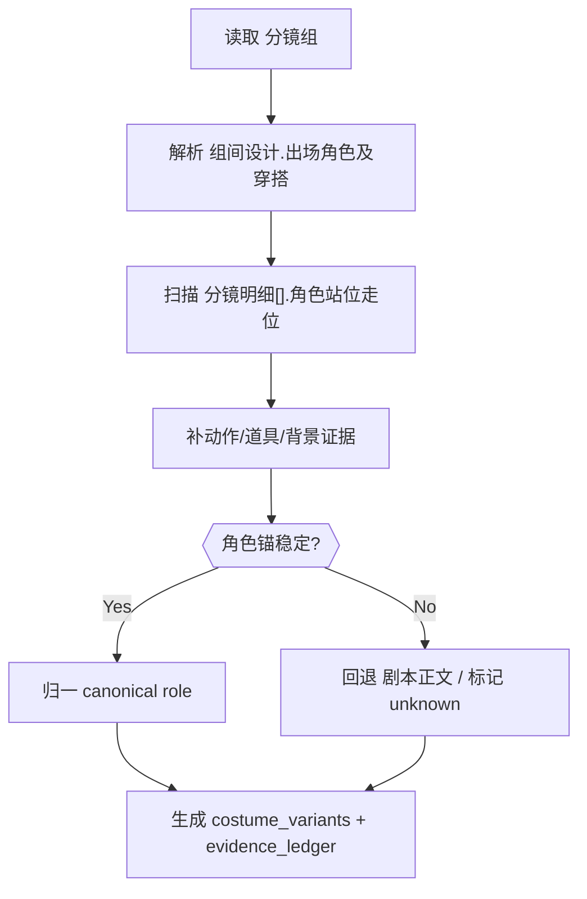

# Detail Role Normalization Reference

## Purpose

- 本文件承接 `4-Design/1-清单/角色/SKILL.md` 中下沉的角色归一化细则。
- 只定义 `3-Detail -> 角色清单` 的细粒度取证、归一、降级与桥接规则。

## Extraction Order

## Role Recognition Rules

| rule_id | trigger | action | downgrade |
| --- | --- | --- | --- |
| `RR-01` | `组间设计.出场角色及穿搭` 命中 `角色名-穿搭` | 建立 canonical role，并把穿搭写入主服装锚 | 若只有穿搭无角色名，不建角色 |
| `RR-02` | `角色站位走位` 出现明确人名/称谓组合 | 记录 `shot_id + position + motion` | 若只有“他/她/众人”且无前锚，不新建角色 |
| `RR-03` | 同角色跨镜出现多套穿搭或状态变化 | 生成 `costume_variants[]`，保留首次出现与变体触发镜头 | 若变化不足以区分，仅追加 evidence |
| `RR-04` | 群像词如“众人/老人群像/侍卫群” | 保留为 `群像角色` | 不强拆为多个单人角色 |
| `RR-05` | 亲属/关系称谓仅在无显式主体的代词句中出现 | 不直接建新角色 | 标记 `needs_manual_review` |

## Evidence Mapping

| source_slot | mapped_targets | extraction focus |
| --- | --- | --- |
| `组间设计.出场角色及穿搭` | `canonical_name`、`costume_anchor`、`group_presence` | 角色名、主服装、组级摘要 |
| `分镜明细[].角色站位走位` | `shot_presence`、`motion_vector`、`relationship_tension_markers` | 谁在镜头里、站位层次、移动路径 |
| `分镜明细[].分镜表现` | `performance_hook`、`expression_baseline`、`narrative_arc_position` | 动作与情绪如何被镜头消费 |
| `分镜明细[].道具及状态` | `prop_binding`、`identity_cue`、`continuity_anchor` | 道具归属、身份和连续性 |
| `分镜明细[].角色背景面` | `background_pressure`、`space_relation` | 人物与空间背景的关系 |
| `剧本正文` | `alias_hint`、`relationship_hint` | 只用于解歧和回退 |

## Unknown / Review Rules

1. 角色存在但无法稳定命名时：
   - 允许保留 `unknown-role-N`
   - 必须带 `group_id / shot_id / evidence_excerpt`
2. 服装线索不足时：
   - `costume_anchor = unknown`
   - 不得把环境材质、光色或道具材质强塞进服装字段
3. 句子级研究结论若证据不足：
   - 输出保守结论
   - 同时列出 `needs_manual_review[]`

## Bridge Minimum

每个角色最少要能桥接出：

- `role_identity`
- `appearance_bridge`
- `costume_bridge`
- `performance_bridge`
- `continuity_bridge`
- `prompt_ready`

若任一槽位证据不足，允许降级为 `unknown`，但必须在 `quality_flags[]` 中留痕。
