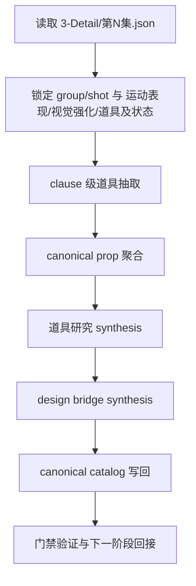
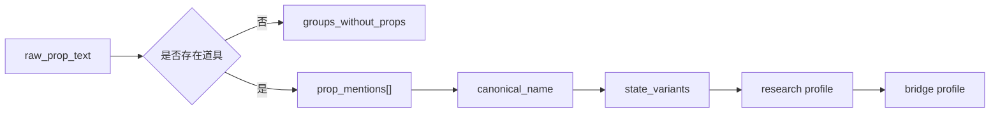
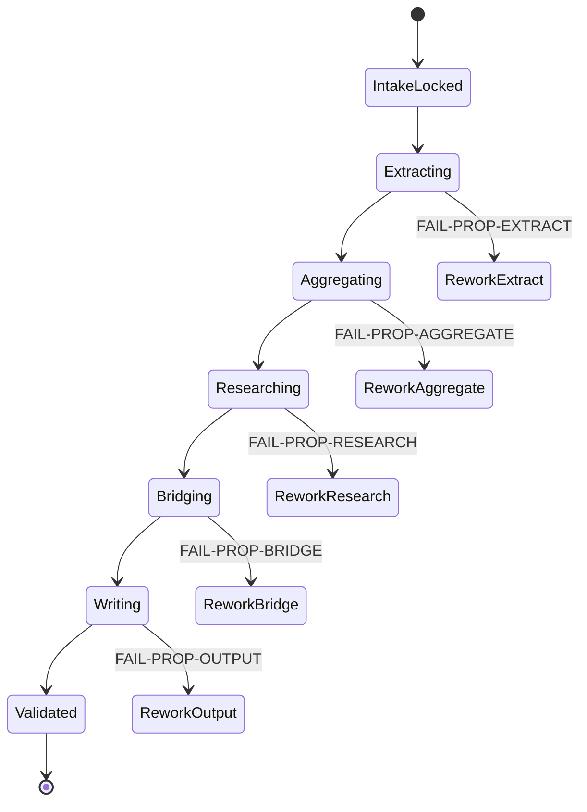

# aigc 4-Design / 1-清单 / 道具

## Context Loading Contract

- 每次调用本技能时，必须同时加载同目录 `CONTEXT.md` 作为预加载上下文。
- 若同目录 `CONTEXT.md` 缺失，应先补齐最小知识库骨架，或向用户明确报告阻塞；不得在未检查该上下文的情况下执行技能。
- 冲突优先级：用户显式请求 > 仓库/全局 `AGENTS.md` > 本 `SKILL.md` > 同目录 `CONTEXT.md`。

## 概述

`1-清单` 是 `4-Design/道具` 的首个执行叶子技能，用来把 `3-Detail/第N集.json` 中已经出现的道具事实收束为可被设计阶段直接消费的三真源：

1. `道具清单.json`
2. `_manifest.json`
3. `道具研究.json`
4. `prop_design_bridge.json`

本技能采用知行合一的单文档编排方式：核心思考、执行步骤、门禁、输出与返工都在本 `SKILL.md` 中锁定；`references/`、脚本和 schema 继续保留，但只作为执行支撑，不再承担主骨架真源。

## Business Requirement Analysis Contract

| 分析槽位 | 当前答案 |
| --- | --- |
| `business_goal` | 从 `3-Detail/第N集.json` 抽出稳定道具对象池，并同步生成研究层与设计桥接三真源 |
| `business_object` | `道具及状态` 中已经出现的道具、它们的镜头状态、`道具清单.json`、`道具研究.json` 与 `prop_design_bridge.json` |
| `constraint_profile` | 不发明上游未出现的道具；不回写 `3-Detail`；不把研究层停成纯评语；不把 design_context 强拆成多份并列真源 |
| `success_criteria` | `道具清单.json` 单独即可支撑下游设计消费，且每个 canonical prop 都能回链到镜头证据并具备 `design_context` |
| `non_goals` | 不直接生成图像、不输出面板、不重写角色/场景/服装类目 |
| `complexity_source` | 输入是镜头级文本事实，难点在 clause 级抽取、同名聚合、状态变体保留、叙事意义判型与 bridge 完整性 |
| `topology_fit` | 适合采用“输入锁定 -> 抽取 -> 聚合 -> 研究 -> bridge -> 写回验证”的串行主干，局部失败回退到最近节点 |

## Total Input Contract

### 必需输入

- `projects/aigc/<项目名>/3-Detail/第N集.json`
- `.agents/skills/aigc/_shared/director_episode_output.schema.json`

### 补充输入

- `.agents/skills/aigc/4-Design/1-清单/_shared/detail-output-consumption-contract.md`
- `.agents/skills/aigc/4-Design/1-清单/_shared/list-output-contract.md`
- `.agents/skills/aigc/_shared/project-runtime-layout.md`
- `.agents/skills/aigc/4-Design/1-清单/道具/scripts/run_prop_list_pipeline.py`
- `.agents/skills/aigc/4-Design/1-清单/道具/scripts/extract_episode_props.py`
- `.agents/skills/aigc/4-Design/1-清单/道具/scripts/build_prop_research.py`

### 固定输出落点

- `projects/aigc/<项目名>/4-Design/道具/1-清单/第N集/道具清单.json`
- `projects/aigc/<项目名>/4-Design/道具/1-清单/第N集/_manifest.json`
- `projects/aigc/<项目名>/4-Design/道具/1-清单/第N集/道具研究.json`
- `projects/aigc/<项目名>/4-Design/道具/1-清单/第N集/prop_design_bridge.json`

### 输入硬门槛

1. 输入 JSON 必须能被 `director_episode_output.schema.json` 解释。
2. 抽取源优先认 `分镜组列表 / 分镜明细 / 运动表现 / 视觉强化 / 角色表现` 这些 branch-owned 事实，并把 `道具及状态` 留作 prop state 主补证，不认手工脑补。
3. 若主路径不存在，允许做 `3-Detail <-> 编导` 兼容回退；若两者都不存在则 hard fail。

## Visual Maps







## Topology Contract

### 主干节点

1. 输入锁定
2. 分镜级抽取
3. canonical 聚合
4. 研究层 synthesis
5. bridge synthesis
6. 写回与验证

### 失败回退原则

- 抽取失败，回到抽取节点，不得直接跳到聚合后强补。
- 聚合失败，回到 canonical 命名和状态归一，不得在研究层掩盖。
- bridge 不完整，回到研究层或 bridge 节点，不得把缺字段甩给 `2-设计`。

## Thinking-Action Node Network

### NODE-PROP-LIST-01 输入锁定与路径归一

- `objective`
  - 锁定 episode 输入根、schema 解释方式与 canonical 输出目录。
- `inputs`
  - 用户给定输入路径
  - `projects/aigc/<项目名>/3-Detail/第N集.json`
  - 兼容回退路径
  - shared schema
- `actions`
  1. 从输入路径或 episode 号推断目标集数与项目名。
  2. 先尝试主输入路径，再尝试兼容回退路径。
  3. 校验 JSON 是否存在 `final_output.main_content.分镜组列表` 等关键结构。
  4. 锁定输出根为 `4-Design/道具/1-清单/第N集/`。
- `evidence`
  - `resolved_input_path`
  - `episode_id`
  - `resolved_output_root`
  - schema 结构检查结果
- `route_out`
  - 通过 -> `NODE-PROP-LIST-02`
  - 输入缺失或 schema 失配 -> `FAIL-PROP-OUTPUT`
- `gate`
  - 只有输入与输出根都锁定后，才允许进入抽取。

#### 着手面

- 路径层：主路径、回退路径、输出根是否 canonical。
- schema 层：是否真的是 `3-Detail` episode JSON，而不是其他阶段产物。
- episode 层：集数解析是否稳定。

### NODE-PROP-LIST-02 分镜级道具抽取

- `objective`
  - 从 `道具及状态` 中抽出镜头级道具 mention，同时用 `运动表现 / 视觉强化 / 角色表现` 补足角色与镜头语境。
- `inputs`
  - `分镜组列表[]`
  - `分镜明细[]`
  - 每个 shot 的 `道具及状态`
  - 可选 `运动表现 / 视觉强化 / 角色表现`
- `actions`
  1. 遍历 group 和 shot，读取 `group_id / shot_id / raw_prop_text`。
  2. 对 `raw_prop_text` 做 clause 级拆分，优先命中 stable noun，再拆出 `prop_name + state`。
  3. 记录 `prop_mentions[]`，保留原文证据，不先做强归一，也不允许整句直接回退成 `prop_name`。
  4. 若整组没有道具，只把它记入 `groups_without_props`，不硬造空 prop。
- `evidence`
  - `group_prop_map[]`
  - `prop_mentions[]`
  - `groups_without_props[]`
- `route_out`
  - 抽取成功 -> `NODE-PROP-LIST-03`
  - 无法稳定拆分或 evidence 丢失 -> `FAIL-PROP-EXTRACT`
- `gate`
  - 每条 mention 至少要能回链 `group_id + shot_id + raw_prop_text`，且 `prop_name` 不能是状态残句。

#### 着手面

- 语义层：哪些词是器物名，哪些词是状态词。
- 证据层：保留原始短语，避免抽取后失真。
- 保守层：无法拆分时优先保留 raw clause，而不是过度猜测。

### NODE-PROP-LIST-03 canonical prop 聚合

- `objective`
  - 把镜头级 mention 聚合成稳定的 canonical prop，同时保留状态差分。
- `inputs`
  - `group_prop_map[]`
  - `prop_mentions[]`
- `actions`
  1. 先按 stable noun / canonical object key 聚合同类道具，再补 `canonical_name`。
  2. 汇总每个 prop 的 `group_ids / shot_ids / raw mentions / state_variants`。
  3. 为每个 prop 生成稳定 `prop_id` 与 `display_profile` 摘要。
  4. 若同名但明显是不同物件，保留分裂并写明原因。
- `evidence`
  - `道具清单.json.props[]`
  - 每个 prop 的 shot/group 回链
- `route_out`
  - 聚合完成 -> `NODE-PROP-LIST-04`
  - canonical 名称漂移或状态合并错误 -> `FAIL-PROP-AGGREGATE`
- `gate`
  - 每个 canonical prop 都必须既有对象主键也有镜头锚点，且不能由整句描述直接升格。

#### 着手面

- 命名层：名称是否稳定、是否能跨镜头复用。
- 状态层：保留变体，不把所有状态压成静态 noun。
- 区分层：避免同名异物或异名同物误聚合。

### NODE-PROP-LIST-04 研究层 synthesis

- `objective`
  - 从聚合后的 prop 生成可读、可追溯的研究层结论。
- `inputs`
  - `道具清单.json.props[]`
  - shot/group 证据
- `actions`
  1. 为每个 prop 形成 `evidence_ledger`。
  2. 补出 `attribute_profile / scene_usage_profile / display_profile / narrative_significance / chronicle`。
  3. 强制研究层回答材质、功能、使用方式、镜头感知，以及“它是否承担特殊叙事意义”，而不是只给审美词。
  4. 若道具承担身份凭证、记忆回收、关键动作触发或持续空间限制，必须把这层叙事负载显式写入 `narrative_significance`。
  5. 若缺少足够 evidence，只能保守写缺口，不能臆造细节。
- `evidence`
  - `道具清单.json.props[].design_context`
- `route_out`
  - 研究层完整 -> `NODE-PROP-LIST-05`
  - 研究层空泛或无证据 -> `FAIL-PROP-RESEARCH`
- `gate`
  - 每个 prop 至少要同时具备 evidence、属性结论、叙事意义判型和时间/场景 chronicle。

#### 着手面

- 功能层：道具在剧情和镜头里做什么。
- 材质层：材质、工艺、表面感知。
- 叙事层：它是否承担剧情推进、身份认证、情绪回收或关键线索回收。
- 时间层：它在不同镜头中的变化轨迹。

### NODE-PROP-LIST-05 design bridge synthesis

- `objective`
  - 把研究结论压成 `2-设计` 可直接消费的机读字段。
- `inputs`
  - `道具清单.json.props[]`
  - `NODE-PROP-LIST-04` 已形成的 research context
- `actions`
  1. 为每个 prop 生成 `prompt_anchor`。
  2. 补齐 `structure_modules / material_and_finish / wear_marks / shot_route / physical_character / narrative_significance`。
  3. 若道具具有特殊叙事意义，必须把它转译成 `visual_obligation / continuity_guard` 一类下游可执行约束，而不是只写“重要”。
  4. 明确 `negative_constraints`，避免下游误判。
  5. 若 research 与 bridge 冲突，以证据更强的 research 结论为准并记录。
- `evidence`
  - `道具清单.json.props[].design_context.design_handoff`
- `route_out`
  - bridge 完整 -> `NODE-PROP-LIST-06`
  - bridge 缺关键字段 -> `FAIL-PROP-BRIDGE`
- `gate`
  - bridge 不得只是 prose 摘要，必须是结构化机读字段，且不能丢失叙事意义判断。

#### 着手面

- 结构层：部件构成和分区。
- 材质层：材质、涂层、磨损与表面处理。
- 镜头层：什么镜头最关键、怎样被看见。
- 叙事层：若是关键剧情道具，下游必须知道它为何不能被弱化成普通摆件。
- 性格层：这个道具的物理性格和触感逻辑是什么。

### NODE-PROP-LIST-06 写回、验证与下游回接

- `objective`
  - 同轮写回 `道具清单.json / 道具研究.json / prop_design_bridge.json`，然后确认可以继续进入 `2-设计`。
- `inputs`
  - `道具清单.json`
  - 输出根目录
  - 兼容导出开关
- `actions`
  1. 按固定命名写回 `道具清单.json` 与 `_manifest.json`。
  2. 把 research 与 bridge 折叠进 `props[].design_context`。
  3. 若显式命中兼容模式，再额外导出 `道具研究.json / prop_design_bridge.json`。
  4. 校验输出位于同一 episode 目录。
  5. 统计 prop 数、无道具组数、design_context 完整率。
  4. 给出默认下游回接口径：进入 `4-Design/道具/2-设计`。
- `evidence`
  - canonical catalog
  - 写回统计与验证结果
- `route_out`
  - 通过 -> final output
  - 写回不一致或路径漂移 -> `FAIL-PROP-OUTPUT`
- `gate`
  - 只有三份业务 JSON 与 `_manifest.json` 已稳定写回，且各自字段边界达标，才允许结案。

#### 着手面

- 落盘层：目录、文件名、episode 一致性。
- 完整性层：`道具清单.json / 道具研究.json / prop_design_bridge.json / _manifest.json` 是否都在。
- 承接层：下游 `2-设计` 是否已具备最低输入。

## Commands

```bash
python3 .agents/skills/aigc/4-Design/1-清单/道具/scripts/run_prop_list_pipeline.py \
  --input "projects/aigc/<项目名>/3-Detail/第N集.json"
```

```bash
python3 .agents/skills/aigc/4-Design/1-清单/道具/scripts/run_prop_list_pipeline.py \
  --input "projects/aigc/<项目名>/3-Detail/第N集.json" \
  --output-dir "projects/aigc/<项目名>/4-Design/道具/1-清单/第N集"
```

```bash
python3 .agents/skills/aigc/4-Design/1-清单/道具/scripts/run_prop_list_pipeline.py \
  --input "projects/aigc/<项目名>/3-Detail/第N集.json" \
  --emit-research-json \
  --emit-bridge-json
```

```bash
python3 .agents/skills/aigc/4-Design/1-清单/道具/scripts/run_prop_list_pipeline.py \
  --input "projects/aigc/<项目名>/3-Detail/第N集.json" \
  --dry-run
```

## Convergence Contract

本技能允许结案，必须同时满足：

1. 输入已锁定到正确 episode JSON。
2. `道具清单.json` 中每个 prop 都可回链镜头证据。
3. `道具清单.json.props[].design_context` 不是空泛审美词堆积。
4. `design_context.design_handoff` 包含下游设计必要字段，尤其不能丢失 `narrative_significance`。
5. `道具清单.json / 道具研究.json / prop_design_bridge.json` 与 `_manifest.json` 同轮落到同一 episode 输出目录。

任一条件不满足，都必须回到最近失败节点返工。

## Canonical Output Governance (Mandatory)

### 三业务真源

- `道具清单.json`：对象池、identity、coverage、group/shot 回链真源
- `道具研究.json`：证据账本、属性研究、叙事意义与展示卡真源
- `prop_design_bridge.json`：下游设计 handoff、prompt anchor、负面约束真源
- `_manifest.json`：输入输出与统计审计 sidecar

### 不拥有的真源

- 不改写 `3-Detail/第N集.json`
- 不产出 `道具设计.json`
- 不把临时分析笔记升格成 canonical 输出

## One-Shot Output Contract

### 最终结果

- `projects/aigc/<项目名>/4-Design/道具/1-清单/第N集/` 下的 `道具清单.json + 道具研究.json + prop_design_bridge.json + _manifest.json`

### 思考过程

- 输入路径如何锁定
- 抽取如何避免吞掉状态
- 聚合如何形成 canonical prop
- `design_context` 如何识别并传递“特殊叙事意义”
- `design_context.design_handoff` 如何保证可被下游消费

### 核心证据

- 解析到的 `group_count / shot_count / prop_count`
- `groups_without_props`
- `design_context` 字段完整度

### 风险 / 未完成支路

- 输入 evidence 稀薄的 prop
- 任何保守回退的命名或状态拆分

### 下一步

- 默认进入 `.agents/skills/aigc/4-Design/2-设计/道具`

## Field Master

| field_id | 输出位置/字段 | 内容要求 | 默认责任 Step | 质量维度 | 失败码 |
| --- | --- | --- | --- | --- | --- |
| FIELD-PROP-LIST-01 | `道具清单.json.group_prop_map[]` | 保留 `group_id + shot_id + raw_prop_text + prop_mentions` | NODE-PROP-LIST-02 | 抽取可追溯性 | FAIL-PROP-EXTRACT |
| FIELD-PROP-LIST-02 | `道具清单.json.props[]` | 形成稳定 canonical prop、状态变体与 display 摘要 | NODE-PROP-LIST-03 | 聚合稳定性 | FAIL-PROP-AGGREGATE |
| FIELD-PROP-LIST-03 | `道具清单.json.props[].design_context` | 形成 evidence、attribute、display、narrative_significance、chronicle 与 cultural/design handoff | NODE-PROP-LIST-04 | 研究完整性 | FAIL-PROP-RESEARCH |
| FIELD-PROP-LIST-04 | `道具清单.json.props[].design_context.design_handoff` | 形成 structure、material、wear、shot_route、physical_character、narrative_significance | NODE-PROP-LIST-05 | 桥接可执行性 | FAIL-PROP-BRIDGE |
| FIELD-PROP-LIST-05 | 三真源 + manifest | 同轮落盘到 `4-Design/道具/1-清单/第N集/` | NODE-PROP-LIST-06 | 落盘完整性 | FAIL-PROP-OUTPUT |

## Thought Pass Map

| step_id | 聚焦字段 | 核心问题 | 生成动作 | 未达标信号 |
| --- | --- | --- | --- | --- |
| S1 | FIELD-PROP-LIST-01 | 输入是否正确、抽取能否回链镜头证据 | 锁定输入、执行 clause 级抽取 | 路径不稳、mention 无 shot/group 锚点 |
| S2 | FIELD-PROP-LIST-02 | 同类道具能否稳定聚合且保留状态差分 | 生成 canonical prop 与 state_variants | 同名异物误合并，或状态被抹平 |
| S3 | FIELD-PROP-LIST-03 | `design_context` 是否足以支撑设计消费，并识别叙事关键度 | 输出 evidence / attribute / narrative_significance / chronicle / handoff | 只有空泛评语，没有叙事判型或证据结构 |
| S4 | FIELD-PROP-LIST-04 | `design_handoff` 能否直接进入 `2-设计`，并把关键剧情道具约束传下去 | 写 `prompt_anchor`、`narrative_significance` 与结构化 handoff 字段 | handoff 只有描述，没有机读字段或叙事约束 |
| S5 | FIELD-PROP-LIST-05 | canonical 输出是否同轮落盘并可回接下游 | 写回并验证路径、数量与完整度 | catalog / manifest 缺失、命名漂移、不能进入 `2-设计` |

## Pass Table

| field_id | Pass Standard | Fail Code | Rework Entry |
| --- | --- | --- | --- |
| FIELD-PROP-LIST-01 | 所有 mention 都可回链 `group_id + shot_id + raw_prop_text` | FAIL-PROP-EXTRACT | NODE-PROP-LIST-02 |
| FIELD-PROP-LIST-02 | `props[].canonical_name` 非空且含状态变体与 shot/group 锚点 | FAIL-PROP-AGGREGATE | NODE-PROP-LIST-03 |
| FIELD-PROP-LIST-03 | 每个 prop 具备 `evidence_ledger + attribute_profile + narrative_significance + chronicle + design_handoff` | FAIL-PROP-RESEARCH | NODE-PROP-LIST-04 |
| FIELD-PROP-LIST-04 | 每个 prop 具备 `structure_modules + shot_route + physical_character + narrative_significance` | FAIL-PROP-BRIDGE | NODE-PROP-LIST-05 |
| FIELD-PROP-LIST-05 | `道具清单.json + _manifest.json` 同轮落盘且位于 canonical 目录 | FAIL-PROP-OUTPUT | NODE-PROP-LIST-06 |

## Root-Cause Execution Contract (Mandatory)

当出现以下症状时，必须先修本子技能合同或脚本：

- `3-Detail/第N集.json` 能读，但脚本仍按旧仓路径推断。
- `道具及状态` 已有信息，却提不出稳定 prop。
- 研究层只有抽象词，没有 `structure_modules / shot_route / physical_character`。
- 关键剧情道具在 bridge 中被压成普通功能道具。
- 输出目录或文件名和 `4-Design/道具/1-清单` 不一致。

必经链路：

`Symptom -> Direct Technical Cause -> Rule Source -> Meta Rule Source -> Fix Landing Points`

优先检查：

- `Rule Source`
  - `.agents/skills/aigc/4-Design/1-清单/道具/SKILL.md`
  - `.agents/skills/aigc/4-Design/1-清单/道具/CONTEXT.md`
  - `.agents/skills/aigc/4-Design/1-清单/道具/scripts/run_prop_list_pipeline.py`
  - `.agents/skills/aigc/4-Design/1-清单/道具/scripts/extract_episode_props.py`
  - `.agents/skills/aigc/4-Design/1-清单/道具/scripts/build_prop_research.py`
- `Meta Rule Source`
  - `.agents/skills/aigc/_shared/director_episode_output.schema.json`
  - `.agents/skills/aigc/_shared/project-runtime-layout.md`
  - `.agents/skills/aigc/4-Design/1-清单/_shared/detail-output-consumption-contract.md`
  - `.agents/skills/aigc/4-Design/1-清单/_shared/object-normalization-contract.md`
  - 根 `AGENTS.md`

## Context Preload (Mandatory)

1. 根 `AGENTS.md`
2. `.agents/skills/aigc/SKILL.md + CONTEXT.md`
3. `.agents/skills/aigc/4-Design/SKILL.md + CONTEXT.md`
4. `.agents/skills/aigc/4-Design/1-清单/SKILL.md + CONTEXT.md`
5. `.agents/skills/aigc/4-Design/1-清单/_shared/detail-output-consumption-contract.md`
6. `.agents/skills/aigc/4-Design/1-清单/_shared/object-normalization-contract.md`
7. 本 `SKILL.md + CONTEXT.md`
8. `.agents/skills/aigc/_shared/director_episode_output.schema.json`
6. 按需读取本目录 `scripts/` 与 `references/`
