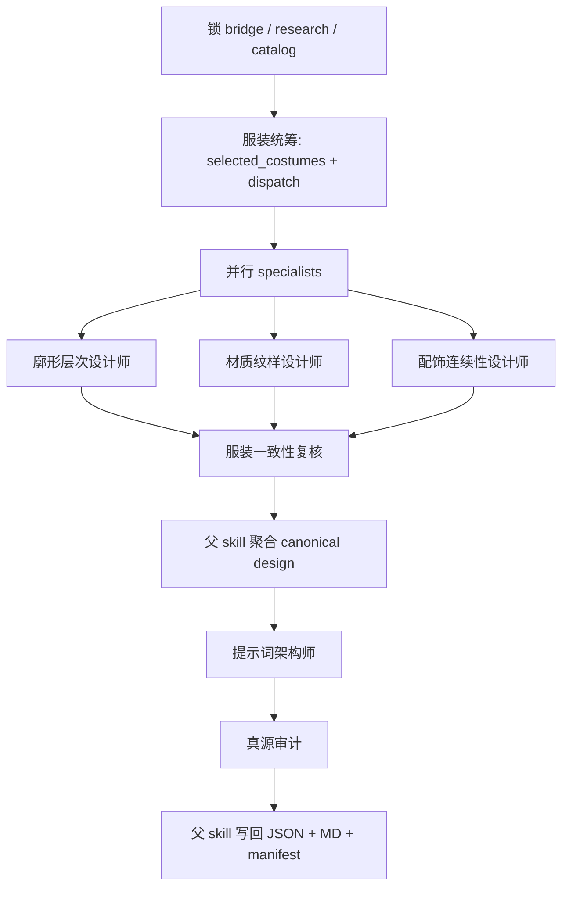
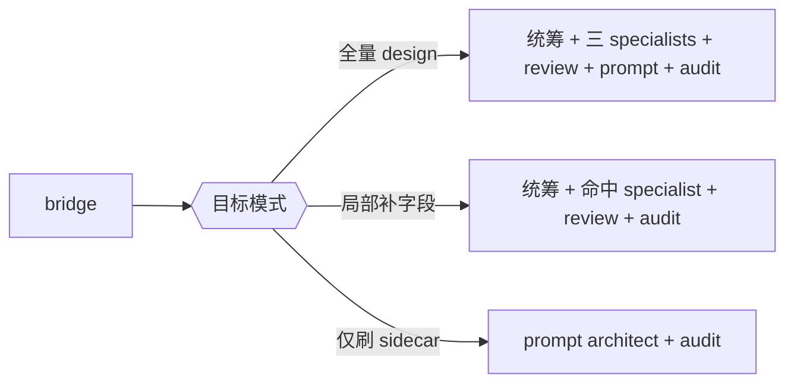
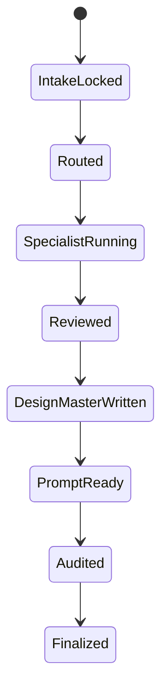
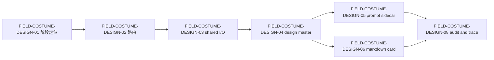

# aigc 4-Design / 3-服装 / 2-设计

## 概述

`2-设计` 是 `3-服装` 链路下的 subagent-governed 父技能，负责把 `1-清单` 已稳定写出的对象池、研究层与 bridge，继续收束成：

1. `服装设计.json`
2. `costume_design_prompt.json`
3. `第N集/<costume_id>-<canonical_label>.md`
4. `_manifest.json`

本轮重编排保持现有业务机制不变：

- 第一输入根仍是 `costume_design_bridge.json`
- shared I/O 仍以 `_shared/IO_CONTRACT.md` 为单一输入输出真源
- subagents 仍只返回 `agents_plan + patch / note / report`
- team 拓扑仍是 `服装统筹 -> specialists 并行 -> 服装一致性复核 -> 提示词架构师 -> 真源审计 -> 父 skill 写回`

变化只在合同表达：把业务分析、team 路由、节点网络、并发/汇流门、细颗粒执行细则和一次性输出统一到同一 `SKILL.md`。

## Skill / Subagent Execution Rule (Mandatory)

在 `2-设计` 中，职责固定分层：

- 父 skill 负责：
  - 输入读取
  - `selected_costumes[]` 与 tranche 决策
  - 上下文装配
  - patch 汇总
  - canonical design master / prompt sidecar / markdown / manifest 的最终写回
- subagents 负责：
  - `agents_plan`
  - 局部 `patch / note / report`
  - 字段候选、证据补充、冲突说明、返工建议

任何 subagent 都不得直接写 `projects/<项目名>/4-Design/服装/2-设计/第N集/*`。

## When to Use

- 已有 `costume_design_bridge.json`，需要生成或刷新结构化服装设计主稿。
- 需要用服装设计组分工完善廓形层次、材质纹样、配饰连续性、prompt sidecar 与审计闭环。
- 需要生成可供 `3-面板`、`5-Image` 或 `costume-swap` 继续消费的 machine-first design carrier。

## When Not to Use

- `1-清单` 尚未完成，应先回到 `4-Design/服装/1-清单`。
- 当前任务只是补角色 identity 或导演事实，应回上游。
- 当前任务是直接执行生图而不是先锁定 design master。

## Mode Selection

`2-设计` 默认有三种执行模式：

1. `full-design`
   - 无稳定 `服装设计.json`，需要完整 design synthesis
2. `partial-design`
   - design master 已存在，但只补某些字段或某几套 costume
3. `prompt-only`
   - canonical design facts 已稳定，只刷新 `costume_design_prompt.json`

## Business Requirement Analysis Contract (Mandatory)

| analysis_slot | 当前结论 |
| --- | --- |
| `business_goal` | 把 `1-清单` 生成的 bridge、research、catalog 和全局约束收束为唯一 machine-first 服装设计真源，并与 prompt sidecar 分层 |
| `business_object` | 服装对象池、研究层、bridge、角色设计约束、导演证据、全局风格、类型元素、服装设计组 patch |
| `constraint_profile` | 不得跳过 bridge；不允许 prompt 倒灌事实；subagents 不得直接写回；人读稿必须与 JSON 同源；`character_design.json` 只作约束输入 |
| `success_criteria` | 路由正确、命中服装明确、team 输出可聚合、design master 稳定、prompt sidecar 分层明确、manifest 有 lineage 与审计信息 |
| `non_goals` | 不回写 `1-清单`；不重新做角色设计；不直接出图；不把团队 patch 保留成第二真源 |
| `complexity_source` | 多 specialist 并行补位且共享同一 costume identity；design facts 与 prompt sidecar 必须强分层；父 skill 既要调 team 又要保证唯一写回口径 |
| `topology_fit` | 采用“串行锁输入与服装批次 -> specialists 并行补 design section -> review 汇流 -> prompt tranche -> audit gate -> 父 skill 唯一写回”的知行合一父技能网络 |
| `step_strategy` | 先锁 bridge 和目标 costume，再让三名 specialist 并行输出局部 patch，经 reviewer 汇流后写 canonical design，再让 prompt architect 基于已稳定事实生成 sidecar，最后 audit 和 manifest 收束 |

## Context Contract (Mandatory)

加载顺序固定为：

1. 根 `AGENTS.md`
2. `.agents/skills/aigc/SKILL.md + CONTEXT.md`
3. `.agents/skills/aigc/4-Design/SKILL.md + CONTEXT.md`
4. `.agents/skills/aigc/4-Design/服装/SKILL.md + CONTEXT.md`
5. 本 `SKILL.md + CONTEXT.md`
6. `.agents/skills/aigc/4-Design/服装/2-设计/_shared/IO_CONTRACT.md`
7. `.codex/agents/aigc/设计组/服装设计/team.md`
8. `projects/<项目名>/0-Init/north_star.yaml`
9. `projects/<项目名>/0-Init/init_handoff.yaml`
10. `projects/<项目名>/2-Global/全局风格.md`
11. `projects/<项目名>/2-Global/类型元素.md`
12. `projects/<项目名>/4-Design/服装/1-清单/第N集/服装清单.json`
13. `projects/<项目名>/4-Design/服装/1-清单/第N集/服装研究.json`
14. `projects/<项目名>/4-Design/服装/1-清单/第N集/costume_design_bridge.json`
15. `projects/<项目名>/4-Design/角色/2-设计/第N集/character_design.json`
16. 仅加载命中的 agent docs

## Shared Canonical Sources (Mandatory)

- 强制读取：`.agents/skills/aigc/4-Design/服装/2-设计/_shared/IO_CONTRACT.md`
- 强制读取：`.codex/agents/aigc/设计组/服装设计/team.md`
- 辅助读取：
  - `references/output-template.md`
  - `references/execution-flow.md`
  - `references/type-strategies.md`
  - `templates/服装设计卡.template.md`

硬规则：

1. 第一输入根固定为 `costume_design_bridge.json`。
2. `服装设计.json` 是本阶段唯一 machine-first 真源。
3. `costume_design_prompt.json` 只承载 prompt sidecar。
4. subagents 只返回 `agents_plan + patch / note / report`。
5. 逐服装 Markdown 必须与 `服装设计.json.costumes[]` 同源。

## Total Input Contract (Mandatory)

### 必需输入

- `projects/<项目名>/4-Design/服装/1-清单/第N集/costume_design_bridge.json`
- `projects/<项目名>/4-Design/服装/1-清单/第N集/服装研究.json`
- `projects/<项目名>/4-Design/服装/1-清单/第N集/服装清单.json`
- `projects/<项目名>/3-Detail/第N集.json`
- `projects/<项目名>/0-Init/north_star.yaml`
- `projects/<项目名>/0-Init/init_handoff.yaml`
- `projects/<项目名>/2-Global/全局风格.md`
- `projects/<项目名>/2-Global/类型元素.md`

### 可选输入

- `projects/<项目名>/4-Design/角色/2-设计/第N集/character_design.json`
- 已存在的 `projects/<项目名>/4-Design/服装/2-设计/第N集/*`

### 禁止输入

- 重新扫描全量 `角色清单.json` 作为第一输入根
- 让 `提示词架构师` 直接发明设计事实
- 任何要求本阶段跳过 `服装设计.json` 只留 prompt 的指令

### 输入处理原则

1. bridge 缺失时立刻停机并返回“先做 `1-清单`”。
2. 局部刷新 prompt 也必须先读取已稳定的 `服装设计.json`。
3. 角色设计文件只作为只读锚点，不得被服装链反向改写。

## Detail Placement Rule (Mandatory)

本技能采用：

- `复杂链路的骨架 / 细则分层 = false`

因此 team 路由、specialist 切面、review/audit gate、返工入口和一次性输出细则都直接写在本 `SKILL.md`；`references/` 和 `_shared` 只承载支持性结构，不替代主合同。

## Mermaid Visual Contract

- Mermaid 是 `2-设计` 的实际拓扑真源，必须同时覆盖 team 主链、route mode、状态推进和字段依赖。
- 图中的并行 specialists、review gate、prompt tranche 和 audit gate 必须与主文节点网络一一对应。
- 不允许把关键 team 执行顺序只留在 `team.md` 而不在主合同可视化呈现。

## Visual Maps (Mermaid)

## Topology Contract (Mandatory)

### Topology Fit

本技能采用 `串行锁定 + 并行补位 + 依赖汇流 + 后段审计`：

1. 串行锁定：
   - 锁 bridge 输入根
   - 判断当前轮目标模式
   - 生成 `selected_costumes[]`
2. 并行补位：
   - `廓形层次设计师`
   - `材质纹样设计师`
   - `配饰连续性设计师`
3. 依赖汇流：
   - `服装一致性复核`
   - 父 skill 聚合写 `服装设计.json`
4. 后段审计：
   - `提示词架构师`
   - `真源审计`
   - 父 skill 写 `_manifest.json`

### Default Route Priority

1. 若 `costume_design_bridge.json` 缺失：阻塞并回 `1-清单`
2. 若 `服装设计.json` 缺失：走全量 design tranche
3. 若 `服装设计.json` 已存在但用户只要局部字段：走局部补字段 tranche
4. 若 `服装设计.json` 已存在且目标只是 sidecar：走 prompt-only tranche

### Scenario Table

| case_id | 触发谓词 | 主策略 | fallback |
| --- | --- | --- | --- |
| `C1-BRIDGE-MISSING` | 缺 bridge | 停机并回 `1-清单` | 无 |
| `C2-FULL-DESIGN` | 无 design master 或需全量刷新 | 全拓扑派发 | 局部 evidence 缺口时保守 patch |
| `C3-PARTIAL-DESIGN` | 只补某一类字段 | 统筹 + 命中 specialist + review + audit | 若冲突波及全局，升级为全量 design |
| `C4-PROMPT-ONLY` | 事实真源稳定，只刷 sidecar | prompt architect + audit | 若事实漂移，回 `C2/C3` |

## Thinking-Action Node Contract (Mandatory)

| slot | 要求 |
| --- | --- |
| `node_id` | 稳定节点标识 |
| `objective` | 当前节点要完成的判断或动作 |
| `inputs` | 进入节点的输入 |
| `actions` | 当前节点真正执行的动作 |
| `evidence` | 当前节点留下的证据或产物 |
| `route_out` | 成功、失败、分支流向 |
| `gate` | 是否允许进入汇流 |

## Thinking-Action Node Network

| node_id | 对应 Step | 聚焦字段 | objective | actions | evidence | route_out | gate |
| --- | --- | --- | --- | --- | --- | --- | --- |
| `N1-INPUT-GATE` | `S1` | `FIELD-COSTUME-DESIGN-01` | 锁定当前确属 bridge 下游设计问题 | 读取 bridge、research、catalog、global presets，校验输入完整性 | `input_gate_note` | pass -> `N2`；fail -> 结束 | bridge 缺失不得继续 |
| `N2-ROUTE-MODE` | `S2` | `FIELD-COSTUME-DESIGN-02` | 判断当前轮是全量、局部还是 prompt-only | 基于目标、既有产物与缺口生成 route mode | `route_mode_note`、`selected_costumes[]` | pass -> `N3`；冲突 -> 回 `S1-S2` | 路由模式唯一 |
| `N3-SHARED-IO-LOCK` | `S3` | `FIELD-COSTUME-DESIGN-03` | 锁定 shared I/O、team 与命名合同 | 读取 `_shared/IO_CONTRACT.md` 和 `team.md`，生成 mission brief / context packets | `mission_brief_costume_design` | pass -> `N4`；fail -> 回 `S2-S3` | I/O 和 handoff 清晰后才可派发 |
| `N4-COORDINATOR-DISPATCH` | `S4` | `FIELD-COSTUME-DESIGN-02` `FIELD-COSTUME-DESIGN-07` | 由 `服装统筹` 锁定批次、优先级与返工入口 | 生成 `agents_plan`、tranche 和缺口摘要 | `plan_patch_服装统筹` | pass -> `N5A/N5B/N5C`；fail -> 回 `S4` | 命中服装与职责分配清楚 |
| `N5A-SILHOUETTE-LAYER` | `S5` | `FIELD-COSTUME-DESIGN-04` | 生成 silhouette/layering 设计 patch | 产出 `design_thesis / silhouette_system / layering_system` | `artifact_patch_廓形层次设计师` | pass -> `N6`；fail -> 回 `S5` | patch 必须服务同一 costume identity |
| `N5B-MATERIAL-PATTERN` | `S6` | `FIELD-COSTUME-DESIGN-04` | 生成材质纹样与颜色脚本 patch | 产出 `material_and_pattern / color_script / fabric_finish` | `artifact_patch_材质纹样设计师` | pass -> `N6`；fail -> 回 `S6` | patch 不能脱离 bridge |
| `N5C-ACCESSORY-CONTINUITY` | `S7` | `FIELD-COSTUME-DESIGN-04` | 生成配饰系统与连续性 patch | 产出 `accessory_system / mobility_and_continuity / negative_constraints` | `artifact_patch_配饰连续性设计师` | pass -> `N6`；fail -> 回 `S7` | patch 必须可执行 |
| `N6-REVIEW-CONVERGENCE` | `S8` | `FIELD-COSTUME-DESIGN-04` `FIELD-COSTUME-DESIGN-07` | 检查三类 patch 是否仍属于同一套服装设计 | 由 `服装一致性复核` 标记冲突字段、返工入口和通过结论 | `review_note_服装一致性` | pass -> `N7`；fail -> 回 `N5A/N5B/N5C` | reviewer 未通过不得写主稿 |
| `N7-DESIGN-MASTER-WRITE` | `S9` | `FIELD-COSTUME-DESIGN-04` `FIELD-COSTUME-DESIGN-06` | 父 skill 聚合 patch 并写 canonical design master 与 markdown | 写 `服装设计.json` 和逐服装 Markdown | canonical JSON + cards | pass -> `N8`；fail -> 回 `N6/N7` | design master 必须先稳定 |
| `N8-PROMPT-SIDECAR` | `S10` | `FIELD-COSTUME-DESIGN-05` | 让 prompt architect 读取稳定设计事实后生成 sidecar | 只基于 canonical design facts 生成 `costume_design_prompt.json` patch | `prompt_patch_提示词架构师` | pass -> `N9`；fail -> 回 `S10` | prompt 不得倒灌事实 |
| `N9-AUDIT-GATE` | `S11` | `FIELD-COSTUME-DESIGN-08` | 检查真源、路径、coverage 和 drift flags | `真源审计` 输出 evidence lineage、越权项、缺口 | `audit_report_真源审计` | pass -> `N10`；fail -> 回目标节点 | 审计通过后才可结案 |
| `N10-MANIFEST-CLOSURE` | `S12` | `FIELD-COSTUME-DESIGN-07` `FIELD-COSTUME-DESIGN-08` | 写 `_manifest.json` 并给出下一入口 | 写 lineage、selected_costumes、outputs、coverage、triad closure | `_manifest.json`、closure note | Final | 只允许父 skill 最终写回 |

## Capability Detail (Mandatory)

### `S1` 输入门

| node_step | 要从哪些方面着手 | 具体动作 | 输出要求 |
| --- | --- | --- | --- |
| `IG1` | bridge 是否是第一输入根 | 优先读 bridge，再读 research/catalog/global presets | 不得从角色链重新起跑 |
| `IG2` | 当前集 evidence 是否齐 | 检查 `3-Detail/第N集.json` 与角色设计约束是否存在 | 缺口必须显式上抛 |
| `IG3` | 当前目标是否真是设计问题 | 区分全量 design、局部返工、prompt-only | 路由模式要可解释 |

### `S2` 路由模式判断

| node_step | 要从哪些方面着手 | 具体动作 | 输出要求 |
| --- | --- | --- | --- |
| `RM1` | 既有 design master 状态 | 检查 `服装设计.json` 是否存在、是否可局部复用 | 不得无视已有真源 |
| `RM2` | 本轮命中哪些服装 | 抽 `selected_costumes[]`，标记 tranche 与进入角色 | 未命中 costume 不得补空内容 |
| `RM3` | prompt 是否可单独刷新 | 只有 design facts 稳定时才允许 prompt-only | 否则必须回 design tranche |

### `S3` shared I/O 锁定

| node_step | 要从哪些方面着手 | 具体动作 | 输出要求 |
| --- | --- | --- | --- |
| `IO1` | 命名与 handoff 口径 | 锁 `mission_brief_* / context_packet_* / patch_*` 命名 | 与 `_shared/IO_CONTRACT.md` 一致 |
| `IO2` | team 越权边界 | 锁 `allowed_return_types` 与 `canonical_writeback_owner` | 不得出现 agent 直写真源 |
| `IO3` | context packet 裁剪 | 仅打包命中 costume 的必要证据 | 减少无关上下文噪声 |

### `S4` 统筹派发

| node_step | 要从哪些方面着手 | 具体动作 | 输出要求 |
| --- | --- | --- | --- |
| `CO1` | 当前批次目标 | 明确是全量、局部还是 prompt-only | `agents_plan` 要给出批次理由 |
| `CO2` | 证据缺口 | 标出哪些 costume 证据不足、哪些字段风险高 | reviewer 能回链返工入口 |
| `CO3` | specialist 分配 | 明确哪个 specialist 负责哪个 costume 和字段组 | 防止三条线交叉越权 |

### `S5` 廓形层次链

| node_step | 要从哪些方面着手 | 具体动作 | 输出要求 |
| --- | --- | --- | --- |
| `SL1` | 设计论点 | 先判断这套服装的核心视觉命题是什么 | 不得只写形容词 |
| `SL2` | silhouette system | 写体量、轮廓、重心、空间占比 | 要与角色动作适配 |
| `SL3` | layering system | 写层次、内外搭、穿脱逻辑 | 必须服务 continuity |

### `S6` 材质纹样链

| node_step | 要从哪些方面着手 | 具体动作 | 输出要求 |
| --- | --- | --- | --- |
| `MP1` | material thesis | 判断材质与故事功能的关系 | 不得只写“高级面料” |
| `MP2` | pattern / finish | 写纹样、表面 finish、老化度或制作痕迹 | 可被下游画面消费 |
| `MP3` | color script | 写主辅色、强调色和使用条件 | 与全局风格一致 |

### `S7` 配饰连续性链

| node_step | 要从哪些方面着手 | 具体动作 | 输出要求 |
| --- | --- | --- | --- |
| `AC1` | accessory system | 写不可缺省、可替换、场景条件触发的配饰位 | 要与 catalog/research 同源 |
| `AC2` | mobility and continuity | 写动作、转场、镜头连续性约束 | 必须能进入 negative constraints |
| `AC3` | negative constraints | 写不应出现的错配、越权材质或 continuity 断裂 | 供 prompt 和 panel 下游共用 |

### `S8` 一致性复核

| node_step | 要从哪些方面着手 | 具体动作 | 输出要求 |
| --- | --- | --- | --- |
| `RV1` | 同一 costume identity | 检查三类 patch 是否服务同一 costume | reviewer 必须指出冲突字段 |
| `RV2` | 字段空洞与互斥 | 检查是否有关键字段缺失或打法互斥 | 返工入口要明确 |
| `RV3` | 角色锚点冲突 | 对照 `character_design.json` 判断是否吞掉角色主体 | 不得让服装越权重写角色 |

### `S9` 主稿写回

| node_step | 要从哪些方面着手 | 具体动作 | 输出要求 |
| --- | --- | --- | --- |
| `DW1` | JSON 真源结构 | 聚合 design facts，只保留 machine-first 字段 | 不夹带长 prompt prose |
| `DW2` | Markdown 卡片 | 基于同一 JSON 生成人读稿 | 结构和命名与 JSON 同源 |
| `DW3` | 路径归一 | 写到 `projects/<项目名>/4-Design/服装/2-设计/第N集/` | 不允许漂移到其他 sibling |

### `S10` sidecar 生成

| node_step | 要从哪些方面着手 | 具体动作 | 输出要求 |
| --- | --- | --- | --- |
| `PS1` | 事实边界 | 只读取已稳定的 canonical design facts | 不补新世界观 |
| `PS2` | prompt structure | 生成长 prompt、布局说明、模型约束、负面提示 | sidecar 必须可执行 |
| `PS3` | prompt 与 facts 对齐 | 检查 sidecar 没超出主稿事实 | 漂移要回 reviewer 或主稿 |

### `S11-S12` 审计与闭环

| node_step | 要从哪些方面着手 | 具体动作 | 输出要求 |
| --- | --- | --- | --- |
| `AU1` | evidence lineage | 审查 प्रत्येक costume 字段是否可回链 bridge/research/detail/global | 审计报告要能指出来源 |
| `AU2` | path / ownership | 审查路径、owner、return types 是否合规 | 不得出现 agent 直写 |
| `AU3` | manifest closure | 写 selected_costumes、outputs、coverage、drift flags、triad closure | 供 `3-面板` 和审查链直接接手 |

## Convergence Contract (Mandatory)

只有同时满足以下条件，`2-设计` 才允许宣布完成：

1. `FIELD-COSTUME-DESIGN-01` 到 `FIELD-COSTUME-DESIGN-08` 全部落位。
2. 所有命中 costume 都经过 `服装一致性复核`。
3. `服装设计.json` 与逐服装 Markdown 同源。
4. `costume_design_prompt.json` 只基于 canonical design facts 生成。
5. `_manifest.json` 写明输入、命中服装、输出与 drift flags。

若未满足：

- 输入问题 -> 回 `N1`
- 路由或 selected_costumes 问题 -> 回 `N2/N4`
- design patch 冲突 -> 回 `N5A/N5B/N5C/N6`
- prompt 漂移 -> 回 `N8`
- 审计或路径问题 -> 回 `N9/N10`

## One-Shot Output Contract (Mandatory)

`2-设计` 的一次性输出是同一 bundle 内的五类结果：

1. `projects/<项目名>/4-Design/服装/2-设计/第N集/服装设计.json`
2. `projects/<项目名>/4-Design/服装/2-设计/第N集/costume_design_prompt.json`
3. `projects/<项目名>/4-Design/服装/2-设计/第N集/<costume_id>-<canonical_label>.md`
4. `projects/<项目名>/4-Design/服装/2-设计/第N集/_manifest.json`
5. `thinking_process + closure_triad`
   - 为什么命中这些 costume
   - 哪些字段由哪条 specialist 链提供
   - reviewer 拦下了什么冲突
   - prompt architect 为什么没有越权补事实

## Canonical Output Governance (Mandatory)

1. `服装设计.json` 是唯一 machine-first 真源。
2. `costume_design_prompt.json` 是派生 sidecar，不得与 design facts 争权。
3. Markdown 只是同源人读稿。
4. `_manifest.json` 只记录 lineage、coverage、route mode、selected_costumes 与审计摘要。
5. 不额外挂第二份 team 总结稿。

## Quality And Audit Contract

### 评分矩阵

| 维度 | 指标 | 分值 |
| --- | --- | --- |
| 维度0: 契约遵循 | 是否坚持 `bridge first`、parent-skill-only writeback、prompt sidecar 分层 | __/10 |
| 维度1 | route mode 与 selected_costumes 正确性 | __/10 |
| 维度2 | design master 稳定性 | __/10 |
| 维度3 | prompt sidecar 可执行且不漂移 | __/10 |
| 维度4 | markdown 同源性 | __/10 |
| 维度5 | audit / manifest 完整度 | __/10 |

## Field Master

| field_id | 输出位置/字段 | 内容要求 | 默认责任 Step | 质量维度 | 失败码 |
| --- | --- | --- | --- | --- | --- |
| `FIELD-COSTUME-DESIGN-01` | 阶段定位 | 明确 `2-设计` 是 bridge 下游的 design synthesis | `S1` | 边界清晰度 | `FAIL-COSTUME-DESIGN-01` |
| `FIELD-COSTUME-DESIGN-02` | 角色路由 | 明确 `selected_costumes[]`、route mode 与 tranche | `S2-S4` | 路由完整性 | `FAIL-COSTUME-DESIGN-02` |
| `FIELD-COSTUME-DESIGN-03` | shared I/O | 锁定 bridge 输入根、team handoff 与命名 | `S3` | 交接清晰度 | `FAIL-COSTUME-DESIGN-03` |
| `FIELD-COSTUME-DESIGN-04` | canonical design master | `服装设计.json` 只保留稳定服装事实与 render contract | `S5-S9` | 真源稳定性 | `FAIL-COSTUME-DESIGN-04` |
| `FIELD-COSTUME-DESIGN-05` | prompt sidecar | `costume_design_prompt.json` 只承载执行话术和模型消费字段 | `S10` | 分层正确性 | `FAIL-COSTUME-DESIGN-05` |
| `FIELD-COSTUME-DESIGN-06` | markdown card | 逐服装 Markdown 与 JSON 同源并可审阅 | `S9` | 人读一致性 | `FAIL-COSTUME-DESIGN-06` |
| `FIELD-COSTUME-DESIGN-07` | synthesis writeback | 父 skill 聚合 patch 并统一落盘 | `S4-S12` | 聚合可执行性 | `FAIL-COSTUME-DESIGN-07` |
| `FIELD-COSTUME-DESIGN-08` | audit and trace | 返回 coverage、drift flags、blocking note 与 triad closure | `S11-S12` | 审计完整性 | `FAIL-COSTUME-DESIGN-08` |

## Thought Pass Map

| step_id | 聚焦字段 | 核心问题 | 生成动作 | 未达标信号 |
| --- | --- | --- | --- | --- |
| `S1` | `FIELD-COSTUME-DESIGN-01` | 当前是不是 bridge 下游的 design synthesis 问题 | 锁定阶段边界与上游真源 | 把本阶段写成研究层或直接生图 |
| `S2` | `FIELD-COSTUME-DESIGN-02` | 本轮是全量、局部还是 prompt-only | 生成 route mode 和 `selected_costumes[]` | 路由模式含糊 |
| `S3` | `FIELD-COSTUME-DESIGN-03` | 输入输出 handoff 和命名是否锁死 | 回指 shared I/O 与 team | 输入输出仍靠自然语言猜 |
| `S4` | `FIELD-COSTUME-DESIGN-02` `FIELD-COSTUME-DESIGN-07` | 统筹如何派发 specialist | 生成 `agents_plan` 与 tranche | specialists 无边界抢写 |
| `S5-S7` | `FIELD-COSTUME-DESIGN-04` | 三条 specialist 链怎样补 design facts | 产出 design section patches | patch 互相打架 |
| `S8` | `FIELD-COSTUME-DESIGN-04` | 如何证明还是同一套 costume identity | reviewer 汇流并给返工入口 | 没有冲突定位 |
| `S9` | `FIELD-COSTUME-DESIGN-04` `FIELD-COSTUME-DESIGN-06` | 父 skill 如何写稳定主稿 | 写 JSON + Markdown | prompt prose 混入主稿 |
| `S10` | `FIELD-COSTUME-DESIGN-05` | sidecar 是否只基于稳定事实生成 | 写 `costume_design_prompt.json` | prompt 倒灌设计事实 |
| `S11-S12` | `FIELD-COSTUME-DESIGN-07` `FIELD-COSTUME-DESIGN-08` | 如何完成审计与 manifest 闭环 | 写 audit report + manifest + triad closure | 无 coverage、无 drift flags |

## Pass Table

| field_id | Pass Standard | Fail Code | Rework Entry |
| --- | --- | --- | --- |
| `FIELD-COSTUME-DESIGN-01` | 阶段边界、父子职责与上下游口径明确 | `FAIL-COSTUME-DESIGN-01` | `S1` |
| `FIELD-COSTUME-DESIGN-02` | `selected_costumes[]`、route mode 与 tranche 明确 | `FAIL-COSTUME-DESIGN-02` | `S2-S4` |
| `FIELD-COSTUME-DESIGN-03` | bridge 输入、输出与 patch 命名统一 | `FAIL-COSTUME-DESIGN-03` | `S3` |
| `FIELD-COSTUME-DESIGN-04` | `服装设计.json` 只保存稳定服装事实与 render contract | `FAIL-COSTUME-DESIGN-04` | `S5-S9` |
| `FIELD-COSTUME-DESIGN-05` | `costume_design_prompt.json` 只保存 prompt sidecar 内容 | `FAIL-COSTUME-DESIGN-05` | `S10` |
| `FIELD-COSTUME-DESIGN-06` | 逐服装 Markdown 与 JSON 同源 | `FAIL-COSTUME-DESIGN-06` | `S9` |
| `FIELD-COSTUME-DESIGN-07` | 父 skill 独占写回并能统一落盘 | `FAIL-COSTUME-DESIGN-07` | `S4-S12` |
| `FIELD-COSTUME-DESIGN-08` | triad closure、coverage 与 drift flags 完整 | `FAIL-COSTUME-DESIGN-08` | `S11-S12` |

## Root-Cause Execution Contract (Mandatory)

当 `2-设计` 出现以下问题时，必须先修源层而不是补单次 prompt：

- 只有 `costume_design_bridge.json`，没有 `服装设计.json`
- 把角色设计里的 `wardrobe_profile` 当成唯一服装设计真源
- subagents 直接争夺最终 JSON 的写回权
- prompt sidecar 脱离 canonical design facts，开始自说自话

必经链路：

`Symptom -> Direct Technical Cause -> Rule Source -> Meta Rule Source -> Fix Landing Points`

优先检查：

- `Rule Source`
  - `.agents/skills/aigc/4-Design/服装/2-设计/SKILL.md`
  - `.agents/skills/aigc/4-Design/服装/2-设计/CONTEXT.md`
  - `.agents/skills/aigc/4-Design/服装/2-设计/_shared/IO_CONTRACT.md`
  - `.codex/agents/aigc/设计组/服装设计/team.md`
- `Meta Rule Source`
  - `AGENTS.md`
  - `.agents/skills/aigc/4-Design/服装/SKILL.md`
  - `/Users/vincentlee/.codex/skills/meta/构建/技能/skill-subagents/SKILL.md`
