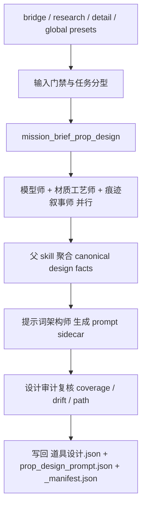
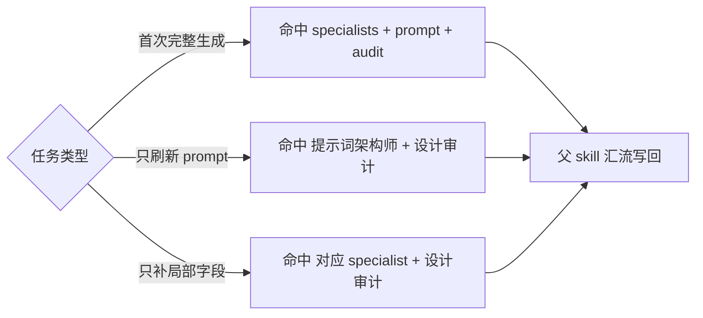
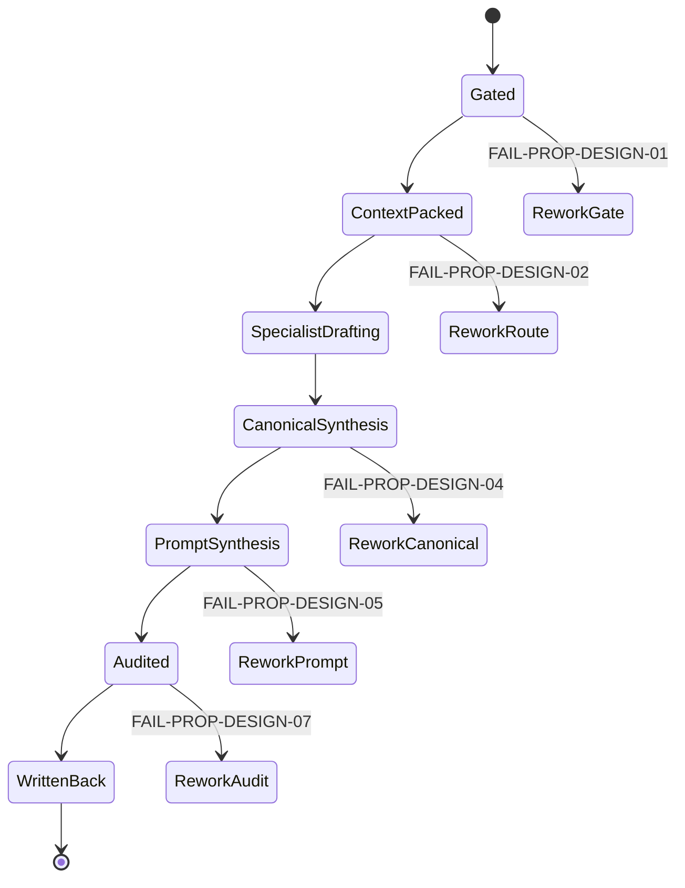

# 4-Design / 4-道具 / 2-设计

## 概述

`2-设计` 是 `4-Design/道具` 类目下负责 design synthesis 的叶子技能。

它的职责不是重新研究道具，也不是把长 prompt 当成唯一真源，而是把上游 `1-清单` 已经稳定写出的 bridge 和研究结果，连同全局风格与初始化约束，收束成三件套：

1. `道具设计.json`
   canonical design master，只保存稳定设计事实、设计决策与 render contract
2. `prop_design_prompt.json`
   prompt sidecar，只保存模型消费友好的执行话术与布局信息
3. `_manifest.json`
   lineage、coverage、path normalization 与审计侧车

本技能保留现有 subagent 机制与 `_shared/IO_CONTRACT.md`，但把核心路由、节点、汇流与写回合同统一收回到本 `SKILL.md`，避免出现“主文档只写摘要、真实执行逻辑散在 references/team/口头约定里”的第二真源。

## Business Requirement Analysis Contract

| 分析槽位 | 当前答案 |
| --- | --- |
| `business_goal` | 把道具桥接层升级为可复用的 canonical 设计真源，并为面板/生图提供稳定 handoff |
| `business_object` | 上游 `prop_design_bridge.json` 中的每个 prop、其研究证据、结构/材质/痕迹 patch、叙事意义约束、prompt sidecar 与审计记录 |
| `constraint_profile` | 不重复做研究层；subagents 不直接写最终 JSON；prompt 不改业务事实；不能把关键剧情道具降成普通陈设；错位路径必须规范化 |
| `success_criteria` | `道具设计.json + prop_design_prompt.json + _manifest.json` 同轮生成，且下游可直接进入 `3-面板` 或 `nano-banana/multiview-prop` |
| `non_goals` | 不直接执行图片生成；不回写 `3-Detail` 或 `1-清单` 真源；不把角色/服装路径拿来冒充道具路径 |
| `complexity_source` | 输入多源、角色分工多、patch 要聚合、prompt 与 canonical 要严格分层、路径和审计要闭环 |
| `topology_fit` | 适合“输入门禁 -> mission brief -> specialists 并行 patch -> canonical 汇流 -> prompt -> audit -> manifest”的网状主干 |

## Total Input Contract

### 必需输入

- `projects/aigc/<项目名>/4-Design/道具/1-清单/第N集/prop_design_bridge.json`
- `projects/aigc/<项目名>/4-Design/道具/1-清单/第N集/道具研究.json`
- `projects/aigc/<项目名>/3-Detail/第N集.json`
- `.agents/skills/aigc/4-Design/道具/2-设计/_shared/IO_CONTRACT.md`
- `.codex/agents/aigc/设计组/道具设计/team.md`

### 可选输入

- `projects/aigc/<项目名>/4-Design/道具/1-清单/第N集/道具清单.json`
- `projects/aigc/<项目名>/2-Global/全局风格.md`
- `projects/aigc/<项目名>/2-Global/类型元素.md`
- `projects/aigc/<项目名>/0-Init/north_star.yaml`
- `projects/aigc/<项目名>/0-Init/init_handoff.yaml`

### 固定输出落点

- `projects/aigc/<项目名>/4-Design/道具/2-设计/第N集/道具设计.json`
- `projects/aigc/<项目名>/4-Design/道具/2-设计/第N集/prop_design_prompt.json`
- `projects/aigc/<项目名>/4-Design/道具/2-设计/第N集/_manifest.json`

### 输入硬门槛

1. `prop_design_bridge.json` 缺失时，必须阻塞并回退到 `1-清单`。
2. `道具设计.json` 不得直接由 subagents 写回，只能由父 skill 聚合后落盘。
3. `prop_design_prompt.json` 必须晚于 canonical design facts 生成。
4. 若 brief 中出现错位路径，必须在本阶段做 normalization 并记入 manifest。

## Canonical Anchors

| 载体 | 位置 | 作用 |
| --- | --- | --- |
| 上游 bridge | `projects/aigc/<项目名>/4-Design/道具/1-清单/第N集/prop_design_bridge.json` | 本阶段第一输入根 |
| 上游研究 | `projects/aigc/<项目名>/4-Design/道具/1-清单/第N集/道具研究.json` | 补证与 evidence ledger |
| 上游清单 | `projects/aigc/<项目名>/4-Design/道具/1-清单/第N集/道具清单.json` | shot/group 回链 |
| episode 根文件 | `projects/aigc/<项目名>/3-Detail/第N集.json` | 导演事实与最新状态 |
| 全局风格 | `projects/aigc/<项目名>/2-Global/全局风格.md` | 项目级风格锚点 |
| 类型元素 | `projects/aigc/<项目名>/2-Global/类型元素.md` | 类型与导演打法约束 |
| init / north star | `projects/aigc/<项目名>/0-Init/` | 硬边界与世界观基线 |
| shared I/O | `.agents/skills/aigc/4-Design/道具/2-设计/_shared/IO_CONTRACT.md` | 输入输出、命名和 path normalization 真源 |
| 道具设计组 team | `.codex/agents/aigc/设计组/道具设计/team.md` | 角色 roster、返回类型与越权禁令 |

## Visual Maps







## Route And Topology Contract (Mandatory)

### 默认 tranche

1. `模型师 + 材质工艺师 + 痕迹叙事师`
   并行输出 `agents_plan + patch / note`
2. `提示词架构师`
   读取已收束的 canonical design facts，生成 prompt sidecar patch
3. `设计审计`
   复核 coverage、prompt drift、path normalization 与下游可消费性

### 路由规则

1. `prop_design_bridge.json` 缺失时直接阻塞，返回“先做 `1-清单`”。
2. `道具设计.json` 缺失时默认命中完整 tranche。
3. 只刷新 prompt 时，只命中 `提示词架构师 + 设计审计`。
4. 只补局部字段时，只命中对应 specialist，再进入审计。
5. 无论命中哪一种 tranche，最终都由父 skill 统一写回三件套。

## Thinking-Action Node Network

### NODE-PROP-DESIGN-01 进入门禁与任务分型

- `objective`
  - 判断当前是首次完整设计、prompt 刷新、局部字段补位，还是应回退上游。
- `inputs`
  - bridge/research/catalog
  - 用户目标
  - 当前 `2-设计` 输出是否已存在
- `actions`
  1. 先确认 `prop_design_bridge.json` 是否存在。
  2. 再判断用户要的是完整设计、prompt 修订还是局部 patch。
  3. 将任务归入唯一 tranche，并明确是否需要完整 specialists。
  4. 若缺上游输入，立即阻塞，不进入后续节点。
- `evidence`
  - `task_mode`
  - `selected_agents[]`
  - `blocked_reason`（如有）
- `route_out`
  - 通过 -> `NODE-PROP-DESIGN-02`
  - 缺上游输入 -> `FAIL-PROP-DESIGN-01`
- `gate`
  - 只有 `task_mode` 与 `selected_agents[]` 明确后，才能进入上下文装配。

#### 着手面

- 阶段层：是完整生成还是局部刷新。
- 输入层：bridge 是否齐备，是否需要补读 research/catalog。
- 路由层：哪些角色是必须，哪些可以跳过。

### NODE-PROP-DESIGN-02 mission brief 与 context packet 装配

- `objective`
  - 为父 skill 和命中的 subagents 装配统一上下文，不让角色各自读全量材料后跑偏。
- `inputs`
  - shared I/O contract
  - team contract
  - bridge/research/catalog/detail/global presets
- `actions`
  1. 生成 `mission_brief_prop_design`，明确目标 prop、输出三件套、`narrative_significance` 判型和禁止越权边界。
  2. 为每个命中角色裁剪 `context_packet_<role>`，只保留其必需事实，并显式标记哪些道具具有特殊叙事意义。
  3. 若 brief 中存在错位路径，立即规范化为 `4-Design/道具/2-设计/第N集/`。
  4. 记录将要写入 manifest 的 `path_normalization` 信息。
- `evidence`
  - `mission_brief_prop_design`
  - `context_packet_<role>`
  - `path_normalization`
- `route_out`
  - 装配完成 -> `NODE-PROP-DESIGN-03`
  - 路由或路径不清 -> `FAIL-PROP-DESIGN-02`
- `gate`
  - 只有所有命中角色都拿到裁剪后上下文，才允许派发。

#### 着手面

- 上下文层：哪些事实对所有角色通用，哪些只给单角色。
- 叙事层：哪些道具必须按英雄道具/关键剧情道具处理，哪些只需维持功能可读。
- 命名层：brief/packet/patch 的命名是否遵守 shared I/O。
- 路径层：请求输出根是否需要归一。

### NODE-PROP-DESIGN-03 specialists 并行 patch 生成

- `objective`
  - 让结构、材质、痕迹三类专业 patch 在不争夺真源的前提下并行生成，并响应道具的叙事权重。
- `inputs`
  - `context_packet_模型师`
  - `context_packet_材质工艺师`
  - `context_packet_痕迹叙事师`
- `actions`
  1. `模型师` 输出结构模块、部件分区、比例与物理构成建议；若 `narrative_significance.is_special=true`，必须优先保障英雄轮廓与关键识别面。
  2. `材质工艺师` 输出 `material_and_finish`、工艺层次、表面处理与色彩重点；若具特殊叙事意义，必须保留能支撑剧情识别的材质证据。
  3. `痕迹叙事师` 输出 `wear_marks`、使用痕迹、叙事性损耗与 `shot_route` 关键提示，并把 `visual_obligation / continuity_guard` 具象化到 patch。
  4. 统一收集 `agents_plan + patch / note`，不允许角色直接落盘。
- `evidence`
  - `artifact_patch_模型师`
  - `artifact_patch_材质工艺师`
  - `artifact_patch_痕迹叙事师`
- `route_out`
  - patch 齐备 -> `NODE-PROP-DESIGN-04`
  - 角色 patch 缺槽位或越权 -> `FAIL-PROP-DESIGN-03`
- `gate`
  - 至少要能覆盖结构、材质、痕迹三大槽位；若存在特殊叙事道具，还必须覆盖其关键可读性与连续性约束，才允许进入 canonical 汇流。

#### 着手面

- 分工层：每个角色只写自己负责的槽位。
- 证据层：patch 是否都能回链到 bridge/research/detail。
- 叙事层：关键剧情道具是否被明确升级为高优先级设计对象，而不是停留在抽象“重要”。
- 冲突层：不同 specialist 是否对同一字段给出冲突结论。

### NODE-PROP-DESIGN-04 canonical design master 汇流

- `objective`
  - 把 specialists patch 聚合成唯一的 `道具设计.json`。
- `inputs`
  - specialists patches
  - bridge/research/catalog/detail/global presets
- `actions`
  1. 先确定每个 prop 的 `prop_id / canonical_name / evidence` 主键。
  2. 聚合 `design_thesis / structure_modules / material_and_finish / wear_marks / shot_route / physical_character / display_profile`，并把上游 `narrative_significance` 写入 `design_thesis`。
  3. 注入 `style_refs / render_contract / negative_constraints / prompt_anchor`。
  4. 若 prop 具有特殊叙事意义，必须检查它是否已转译为稳定的轮廓、材质证据、痕迹与连续性规则，而不是只剩一个标签。
  5. 若 patch 冲突，以证据更强、与全局约束更一致的结论为准，并记录到 manifest。
- `evidence`
  - `道具设计.json`
  - 冲突裁决记录
- `route_out`
  - canonical 完成 -> `NODE-PROP-DESIGN-05`
  - 设计事实与 prompt 话术混层 -> `FAIL-PROP-DESIGN-04`
- `gate`
  - `道具设计.json` 必须只保留稳定设计事实与 render contract。

#### 着手面

- 真源层：哪些字段属于 canonical facts，哪些不是。
- 风格层：是否服从 `2-Global` 与 init 约束。
- 叙事层：关键剧情道具的“特殊性”是否已落成可被下游复用的设计事实。
- 下游层：render contract 是否足以支撑 panel / 生图。

### NODE-PROP-DESIGN-05 prompt sidecar synthesis

- `objective`
  - 在不污染 canonical truth 的前提下，生成模型消费友好的 prompt sidecar。
- `inputs`
  - `道具设计.json`
  - `context_packet_提示词架构师`
- `actions`
  1. 让 `提示词架构师` 只读取 canonical design facts。
  2. 为每个 prop 组装 `prompt_cn / negative_constraints / render_hints`，并把 `narrative_significance.visual_obligation` 转成 prompt emphasis。
  3. 若道具具有特殊叙事意义，明确提示词需要保住它的英雄识别与剧情读点，而不是平均化处理。
  4. 确保 sidecar 只是执行话术，不反向改设计事实。
  5. 若当前仅刷新 prompt，则仍要回链现有 `道具设计.json`。
- `evidence`
  - `prompt_patch_提示词架构师`
  - `prop_design_prompt.json`
- `route_out`
  - prompt 完成 -> `NODE-PROP-DESIGN-06`
  - prompt 开始自创业务事实 -> `FAIL-PROP-DESIGN-05`
- `gate`
  - prompt sidecar 必须晚于 canonical design master，且内容可追溯到 design facts。

#### 着手面

- 话术层：语言是否便于模型执行。
- 分层层：是否把 prompt 与 design truth 严格分开。
- 叙事层：关键剧情道具的提示是否得到额外焦点，而不是与普通陈设同权。
- 负面约束层：negative constraints 是否完整下放。

### NODE-PROP-DESIGN-06 审计、manifest 与统一写回

- `objective`
  - 让本轮输出在 coverage、path、drift 和下游 handoff 上都可追溯。
- `inputs`
  - `道具设计.json`
  - `prop_design_prompt.json`
  - `selected_agents[]`
  - `path_normalization`
- `actions`
  1. 调用 `设计审计` 复核字段覆盖率、prompt drift、路径归一、叙事意义保真度与未解决冲突。
  2. 写回 `_manifest.json`，记录 `inputs / outputs / coverage / selected_agents / path_normalization / drift_flags`，并统计 `special_narrative_prop_count`。
  3. 将三件套统一落盘到 canonical 目录。
  4. 明确默认下游回接口径为 `3-面板` 或 `nano-banana/multiview-prop`。
- `evidence`
  - `review_note_设计审计`
  - `audit_report_设计审计`
  - `_manifest.json`
- `route_out`
  - 审计通过 -> final output
  - coverage/path/drift 未闭环 -> `FAIL-PROP-DESIGN-07`
- `gate`
  - 只有三件套都位于同一 canonical episode 目录，且 manifest 记录完整，才允许结案。

#### 着手面

- 审计层：coverage、drift、blocking note 是否齐备。
- 叙事层：特殊叙事道具是否从 bridge 一直保真到 design/prompt。
- 路径层：请求根与 canonical 根是否一致。
- 承接层：下游默认进入哪里、是否已具备输入。

## CLI

```bash
python3 .agents/skills/aigc/4-Design/道具/2-设计/scripts/run_prop_design_pipeline.py \
  --bridge "projects/aigc/<项目名>/4-Design/道具/1-清单/第N集/prop_design_bridge.json" \
  --research "projects/aigc/<项目名>/4-Design/道具/1-清单/第N集/道具研究.json" \
  --detail "projects/aigc/<项目名>/3-Detail/第N集.json" \
  --global-style "projects/aigc/<项目名>/2-Global/全局风格.md" \
  --type-elements "projects/aigc/<项目名>/2-Global/类型元素.md"
```

```bash
python3 .agents/skills/aigc/4-Design/道具/2-设计/scripts/run_prop_design_pipeline.py \
  --bridge "projects/aigc/<项目名>/4-Design/道具/1-清单/第N集/prop_design_bridge.json" \
  --research "projects/aigc/<项目名>/4-Design/道具/1-清单/第N集/道具研究.json" \
  --detail "projects/aigc/<项目名>/3-Detail/第N集.json" \
  --dry-run
```

## Convergence Contract

本技能允许结案，必须同时满足：

1. `selected_agents[]` 与 `task_mode` 已明确。
2. `道具设计.json` 已先于 prompt sidecar 收束完成。
3. `prop_design_prompt.json` 全量回链 canonical design facts。
4. `道具设计.json` 中的 `design_thesis.narrative_significance` 未丢失上游关键叙事约束。
5. `_manifest.json` 已记录 coverage、path normalization 与 drift flags。
6. 三件套同轮落到 `4-Design/道具/2-设计/第N集/`。

若不满足，必须回到对应节点，不得只修单次 prompt 文案。

## Canonical Output Governance (Mandatory)

1. `道具设计.json` 是稳定设计事实与 render contract 的唯一真源。
2. `prop_design_prompt.json` 是 prompt sidecar，只承载执行话术、布局说明与模型友好文本。
3. `_manifest.json` 只承担 lineage、coverage、path normalization 与 drift 追踪。
4. subagents 只能返回 `agents_plan + patch / note / report`，不能直接写最终 JSON。

## One-Shot Output Contract

### 最终结果

- `projects/aigc/<项目名>/4-Design/道具/2-设计/第N集/道具设计.json`
- `projects/aigc/<项目名>/4-Design/道具/2-设计/第N集/prop_design_prompt.json`
- `projects/aigc/<项目名>/4-Design/道具/2-设计/第N集/_manifest.json`

### 思考过程

- 本轮为何命中这些角色
- specialists 如何分工补齐结构、材质、痕迹
- 特殊叙事道具如何被转译成设计与提示重点
- canonical truth 与 prompt sidecar 如何分层
- 冲突是如何裁决的

### 核心证据

- `selected_agents[]`
- `coverage.prop_count`
- `coverage.special_narrative_prop_count`
- `path_normalization`
- 任何 `drift_flags`

### 风险 / 未完成支路

- evidence 稀薄的 prop
- 被审计标出的未闭环项

### 下一步

- 默认进入 `.agents/skills/aigc/4-Design/道具/3-面板`
- 或进入 `nano-banana/multiview-prop`

## Field Master

| field_id | 输出位置/字段 | 内容要求 | 默认责任 Step | 质量维度 | 失败码 |
| --- | --- | --- | --- | --- | --- |
| FIELD-PROP-DESIGN-01 | 阶段定位 | 明确 `2-设计` 是 bridge 下游的 design synthesis | NODE-PROP-DESIGN-01 | 边界清晰度 | FAIL-PROP-DESIGN-01 |
| FIELD-PROP-DESIGN-02 | 角色路由 | 明确 `selected_agents[]`、task mode 与 tranche | NODE-PROP-DESIGN-02 | 路由完整性 | FAIL-PROP-DESIGN-02 |
| FIELD-PROP-DESIGN-03 | shared I/O | 锁定 bridge 输入根、输出三件套与命名合同 | NODE-PROP-DESIGN-03 | 交接清晰度 | FAIL-PROP-DESIGN-03 |
| FIELD-PROP-DESIGN-04 | canonical design master | `道具设计.json` 只保留稳定设计事实与 render contract，并保留 `design_thesis.narrative_significance` | NODE-PROP-DESIGN-04 | 真源稳定性 | FAIL-PROP-DESIGN-04 |
| FIELD-PROP-DESIGN-05 | prompt sidecar | `prop_design_prompt.json` 只承载执行话术与模型提示，并响应叙事重点 | NODE-PROP-DESIGN-05 | 分层正确性 | FAIL-PROP-DESIGN-05 |
| FIELD-PROP-DESIGN-06 | synthesis writeback | 父 skill 聚合 patch 并统一落盘三件套 | NODE-PROP-DESIGN-06 | 聚合可执行性 | FAIL-PROP-DESIGN-06 |
| FIELD-PROP-DESIGN-07 | audit and trace | manifest 返回 coverage、`special_narrative_prop_count`、drift flags 与 blocking note | NODE-PROP-DESIGN-06 | 审计完整性 | FAIL-PROP-DESIGN-07 |
| FIELD-PROP-DESIGN-08 | downstream handoff | 明确回接 `3-面板 / multiview-prop` 的默认入口 | NODE-PROP-DESIGN-06 | 下游可消费性 | FAIL-PROP-DESIGN-08 |

## Thought Pass Map

| step_id | 聚焦字段 | 核心问题 | 生成动作 | 未达标信号 |
| --- | --- | --- | --- | --- |
| S1 | FIELD-PROP-DESIGN-01 | 当前是不是 bridge 下游的 design synthesis 问题 | 识别 task mode 与上游门槛 | 明明缺 bridge 仍继续设计 |
| S2 | FIELD-PROP-DESIGN-02 | 哪些角色必须命中、如何裁剪上下文、哪些道具叙事权重更高 | 生成 mission brief 与 context packets | 多角色并列但没有统一 brief 或叙事优先级 |
| S3 | FIELD-PROP-DESIGN-03 | specialists patch 如何生成且不越权，并落实叙事约束 | 并行派发并收集 `agents_plan + patch` | 角色直接争夺最终 JSON，或忽略关键剧情道具 |
| S4 | FIELD-PROP-DESIGN-04 / 05 | canonical truth 与 prompt sidecar 如何严格分层，并保持叙事重点 | 先写 design master，再写 prompt sidecar | prompt 反向污染 design facts，或关键道具被平均化 |
| S5 | FIELD-PROP-DESIGN-06 / 07 / 08 | 如何审计、写回并回接下游 | 写 manifest、三件套与下一步入口 | 无 coverage、无叙事保真统计、无 drift、路径错位 |

## Pass Table

| field_id | Pass Standard | Fail Code | Rework Entry |
| --- | --- | --- | --- |
| FIELD-PROP-DESIGN-01 | 阶段边界、上下游职责与阻塞回退明确 | FAIL-PROP-DESIGN-01 | NODE-PROP-DESIGN-01 |
| FIELD-PROP-DESIGN-02 | 角色路由、task mode 与上下文裁剪明确 | FAIL-PROP-DESIGN-02 | NODE-PROP-DESIGN-02 |
| FIELD-PROP-DESIGN-03 | 输入根、输出三件套与命名合同统一 | FAIL-PROP-DESIGN-03 | NODE-PROP-DESIGN-03 |
| FIELD-PROP-DESIGN-04 | `道具设计.json` 只保存稳定设计事实，且保留 `narrative_significance` | FAIL-PROP-DESIGN-04 | NODE-PROP-DESIGN-04 |
| FIELD-PROP-DESIGN-05 | `prop_design_prompt.json` 只保存 prompt sidecar 内容，并对特殊叙事道具给出额外焦点 | FAIL-PROP-DESIGN-05 | NODE-PROP-DESIGN-05 |
| FIELD-PROP-DESIGN-06 | 父 skill 独占最终写回三件套 | FAIL-PROP-DESIGN-06 | NODE-PROP-DESIGN-06 |
| FIELD-PROP-DESIGN-07 | manifest 完整记录 coverage、drift 与 path normalization | FAIL-PROP-DESIGN-07 | NODE-PROP-DESIGN-06 |
| FIELD-PROP-DESIGN-08 | 结果能稳定进入 `3-面板 / multiview-prop` | FAIL-PROP-DESIGN-08 | NODE-PROP-DESIGN-06 |

## Root-Cause Execution Contract (Mandatory)

当 `2-设计` 出现以下问题时，必须先修源层而不是补单次 prompt：

- 只有 `prop_design_bridge.json`，没有 `道具设计.json`
- 把长 prompt 当成唯一道具设计真源
- 路径错写成 `4-Design/角色/4-道具`
- subagents 直接争夺最终 JSON 的写回权
- prompt sidecar 脱离 canonical design facts 自说自话
- 关键剧情道具被设计成普通背景摆件

必经链路：

`Symptom -> Direct Technical Cause -> Rule Source -> Meta Rule Source -> Fix Landing Points`

优先检查：

- `Rule Source`
  - `.agents/skills/aigc/4-Design/道具/2-设计/SKILL.md`
  - `.agents/skills/aigc/4-Design/道具/2-设计/CONTEXT.md`
  - `.agents/skills/aigc/4-Design/道具/2-设计/_shared/IO_CONTRACT.md`
  - `.codex/agents/aigc/设计组/道具设计/team.md`
  - `.agents/skills/aigc/4-Design/道具/2-设计/scripts/run_prop_design_pipeline.py`
- `Meta Rule Source`
  - `AGENTS.md`
  - `.agents/skills/aigc/4-Design/SKILL.md`
  - `.agents/skills/aigc/4-Design/道具/SKILL.md`
  - `/Users/vincentlee/.codex/skills/meta/构建/技能/skill-subagents/SKILL.md`

## Context Contract (Mandatory)

### 加载顺序

1. `.agents/skills/aigc/SKILL.md + CONTEXT.md`
2. `.agents/skills/aigc/4-Design/SKILL.md + CONTEXT.md`
3. `.agents/skills/aigc/4-Design/道具/SKILL.md + CONTEXT.md`
4. 本 `SKILL.md + CONTEXT.md`
5. `.agents/skills/aigc/4-Design/道具/2-设计/_shared/IO_CONTRACT.md`
6. `.codex/agents/aigc/设计组/道具设计/team.md`
7. `projects/aigc/<项目名>/0-Init/north_star.yaml`
8. `projects/aigc/<项目名>/0-Init/init_handoff.yaml`
9. `projects/aigc/<项目名>/2-Global/全局风格.md`
10. `projects/aigc/<项目名>/2-Global/类型元素.md`
11. `projects/aigc/<项目名>/4-Design/道具/1-清单/第N集/道具清单.json`
12. `projects/aigc/<项目名>/4-Design/道具/1-清单/第N集/道具研究.json`
13. `projects/aigc/<项目名>/4-Design/道具/1-清单/第N集/prop_design_bridge.json`
14. `projects/aigc/<项目名>/3-Detail/第N集.json`
15. 仅加载命中的 agent docs
