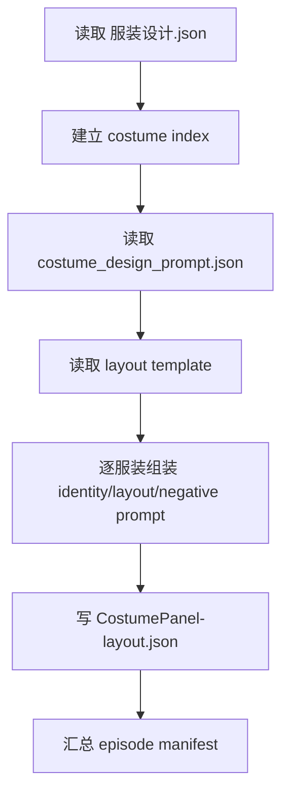
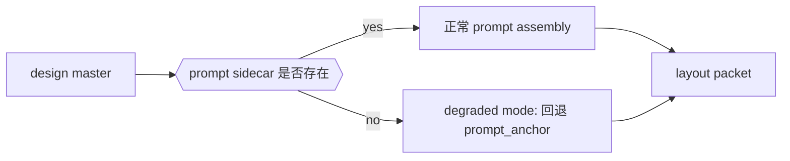
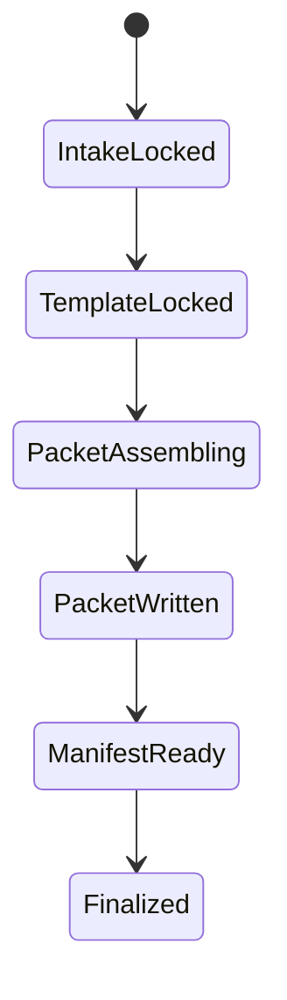

# aigc 4-Design / 3-服装 / 3-面板

## 概述

`3-面板` 是 `3-服装` 链路下的展示型 direct leaf skill，负责把 `2-设计` 已稳定写出的服装设计真源继续收束成 review-ready 的 panel layout packets。

当前阶段 canonical 交付停点保持不变：

1. 每套服装一份 `<costume_id>-<canonical_label>-CostumePanel-layout.json`
2. 每集一份 `_manifest.json`

本轮重编排只改变合同表达：

- 输入根仍固定为 `服装设计.json + costume_design_prompt.json`
- 模板真源仍是 `templates/服装面板-提示词.json`
- runner 仍是 `scripts/generate_costume_panels.py`
- 停点仍是 layout JSON，不直接生 PNG

## Skill Execution Rule (Mandatory)

`3-面板` 由本 leaf skill 自身完成执行闭环：

- skill 负责读取 design master、prompt sidecar、template
- skill 负责逐服装组装 identity badge、prompt segments、layout contract
- skill 负责写每套服装的 layout packet 和 episode 级 `_manifest.json`
- 不得为 `3-面板` 再生成第二份 panel 规划稿或另一个模板真源

## When to Use

- 已有 `projects/<项目名>/4-Design/服装/2-设计/第N集/服装设计.json`，需要继续生成服装展示面板布局。
- 需要把 design master 收束成可审阅、可追溯、可继续下游消费的 panel dossier。
- 需要为 image/review/costume-swap 工具提供稳定的 panel handoff JSON。

## When Not to Use

- 还没有 `costume_design_bridge.json` 或 `服装设计.json`，应先回到 `1-清单` 或 `2-设计`。
- 当前任务是直接执行图片生成、视频请求或素材发布，而不是先固化 panel layout。
- 当前只是修补角色设计或导演事实，不应在本阶段绕行。

## Mode Selection

`3-面板` 有两种执行模式：

1. `standard-packet-build`
   - sidecar 完整，按标准 packet 组装
2. `degraded-packet-build`
   - sidecar 缺失或覆盖不足，退回 design master 最小锚点并显式留痕

## Business Requirement Analysis Contract (Mandatory)

| analysis_slot | 当前结论 |
| --- | --- |
| `business_goal` | 把 `2-设计` 的 design master 与 prompt sidecar 收束成逐服装 panel layout packets，并保持可审阅、可追溯、可继续下游消费 |
| `business_object` | `服装设计.json.costumes[]`、`costume_design_prompt.json.costumes[]`、layout template、manifest |
| `constraint_profile` | 不改写 design master；不回头重扫角色清单或导演 JSON；缺 sidecar 时允许 degraded mode，但必须留痕；每套服装独立一份 layout packet |
| `success_criteria` | 输入根正确、模板唯一、identity badge 稳定、prompt assembly 可执行、逐服装输出完整、manifest 记录降级与数量 |
| `non_goals` | 不直接生图；不重新做服装设计；不另造第二套 panel 模板；不把整集写成单文件泛化 panel |
| `complexity_source` | design facts 和 prompt sidecar 要合流但不能混淆；sidecar 可能缺失；模板结构和 identity badge 要统一；输出必须逐服装拆包 |
| `topology_fit` | 采用“串行锁输入 -> 模板与 prompt 组装 -> 逐服装 packet 生成 -> 汇流 manifest”的叶子技能思行网络 |
| `step_strategy` | 先锁 design master 和 sidecar，再锁模板规则，逐服装拼 identity/layout/negative prompt，最后写 packets 和 manifest，并对 degraded mode 留痕 |

## Context Preload (Mandatory)

加载顺序固定为：

1. 根 `AGENTS.md`
2. `.agents/skills/aigc/SKILL.md + CONTEXT.md`
3. `.agents/skills/aigc/4-Design/SKILL.md + CONTEXT.md`
4. `.agents/skills/aigc/4-Design/服装/SKILL.md + CONTEXT.md`
5. 本 `SKILL.md + CONTEXT.md`
6. `projects/<项目名>/4-Design/服装/2-设计/第N集/服装设计.json`
7. `projects/<项目名>/4-Design/服装/2-设计/第N集/costume_design_prompt.json`
8. `templates/服装面板-提示词.json`
9. `references/output-template.md`
10. `scripts/generate_costume_panels.py`

## Shared Canonical Sources (Mandatory)

- 强制读取：`templates/服装面板-提示词.json`
- 辅助读取：`references/output-template.md`
- runner：`scripts/generate_costume_panels.py`

硬规则：

1. 输入根固定为 `服装设计.json + costume_design_prompt.json`。
2. 模板真源固定为 `templates/服装面板-提示词.json`。
3. layout `template_type` 固定为 `COSTUME_SYSTEM_DOSSIER`。
4. 输出文件必须逐服装拆分。
5. sidecar 缺失时必须记录 degraded mode。

## Total Input Contract (Mandatory)

### 必需输入

- `projects/<项目名>/4-Design/服装/2-设计/第N集/服装设计.json`
- `templates/服装面板-提示词.json`

### 条件输入

- `projects/<项目名>/4-Design/服装/2-设计/第N集/costume_design_prompt.json`
  - 缺失时允许 degraded mode，但必须记录

### 禁止输入

- `角色清单.json`
- `3-Detail/第N集.json`
- 任何要求本阶段直接输出 PNG 的额外指令

### 输入处理原则

1. `服装设计.json` 缺失时立刻停止。
2. sidecar 缺失时，只能用 design master 中的最小锚点补 prompt，不得自由发挥。
3. 模板缺失时不允许脚本内另造第二套结构。

## Detail Placement Rule (Mandatory)

本技能采用：

- `复杂链路的骨架 / 细则分层 = false`

因此输入门、模板组装、identity badge、degraded mode 与 manifest 细则全部直接写在本 `SKILL.md` 中。

## Mermaid Visual Contract

- Mermaid 必须同时覆盖输入门、degraded mode、状态推进和字段依赖。
- `design master -> sidecar/template -> packet -> manifest` 的关系必须可从图中直接扫描。
- 不允许把 degraded mode 只写成脚本细节而不进入可视真源。

## Visual Maps (Mermaid)

## Topology Contract (Mandatory)

### Topology Fit

本技能采用 `串行主干 + 逐项装配 + 汇流清单`：

1. 串行主干：
   - 锁 design master
   - 锁 prompt sidecar
   - 锁模板
2. 逐项装配：
   - 针对每套 costume 生成 packet
3. 汇流清单：
   - 输出 episode 级 `_manifest.json`

### Ordered Rules

- `N1 -> N2 -> N3` 固定串行。
- `N4` 对 `costumes[]` 做逐项循环。
- 只有所有命中 costume 都完成 packet 后才允许进入 `N5`。

## Thinking-Action Node Contract (Mandatory)

| slot | 要求 |
| --- | --- |
| `node_id` | 稳定节点标识 |
| `objective` | 当前节点要完成的判断或动作 |
| `inputs` | 进入节点的输入 |
| `actions` | 当前节点真正执行的动作 |
| `evidence` | 当前节点留下的证据或产物 |
| `route_out` | 成功、失败、分支流向 |
| `gate` | 是否允许进入汇流 |

## Thinking-Action Node Network

| node_id | 对应 Step | 聚焦字段 | objective | actions | evidence | route_out | gate |
| --- | --- | --- | --- | --- | --- | --- | --- |
| `N1-DESIGN-LOCK` | `S1` | `FIELD-COSTUME-PANEL-01` `FIELD-COSTUME-PANEL-02` | 锁定当前确属 design master 下游的 panel handoff 问题 | 读取 `服装设计.json` 并判断阶段边界 | `design_lock_note` | pass -> `N2`；fail -> 结束 | design master 缺失不得继续 |
| `N2-PROMPT-INDEX` | `S2` | `FIELD-COSTUME-PANEL-02` `FIELD-COSTUME-PANEL-07` | 读取 prompt sidecar 并建立 `costume_id -> prompt` 索引 | 正常读取 sidecar，或进入 degraded mode | `prompt_index_note`、degraded flags | pass -> `N3`；fail -> 回 `S1-S2` | sidecar 缺失要显式标记 |
| `N3-TEMPLATE-LOCK` | `S3` | `FIELD-COSTUME-PANEL-03` | 锁定唯一模板真源 | 读取 `templates/服装面板-提示词.json`，抽 `layout_generation_prompt / layout_modules / mandatory_rules` | `template_lock_note` | pass -> `N4`；fail -> 回 `S3` | 模板唯一后才可装配 |
| `N4-PACKET-ASSEMBLY` | `S4-S5` | `FIELD-COSTUME-PANEL-04` `FIELD-COSTUME-PANEL-05` | 逐服装组装 packet | 为每个 costume 生成 `identity_badge`、`identity_prompt`、`layout_prompt`、`negative_prompt_global`、`output filenames` | 每套服装的 packet 草稿 | pass -> `N5`；fail -> 回 `S4-S5` | 每套服装都要独立 packet |
| `N5-OUTPUT-CONVERGENCE` | `S6-S7` | `FIELD-COSTUME-PANEL-06` `FIELD-COSTUME-PANEL-07` | 写 packets 与 manifest，并记录 degraded mode | 写逐服装 layout JSON 和 episode `_manifest.json` | 最终 packets + manifest | Final；fail -> 回 `N4/N5` | 所有 packets 与 manifest 对齐后结案 |

## Capability Detail (Mandatory)

### `S1` design master 锁定

| node_step | 要从哪些方面着手 | 具体动作 | 输出要求 |
| --- | --- | --- | --- |
| `DL1` | 当前轮是不是 panel 任务 | 区分 panel dossier 和直接生图任务 | 若是生图任务，应退出给父级 |
| `DL2` | design master 是否可消费 | 检查 `costumes[]`、`costume_id`、`canonical_label`、`prompt_anchor` | 缺主字段时停止 |
| `DL3` | 输出根是否正确 | 锁 `projects/<项目名>/4-Design/服装/3-面板/第N集/` | 不得漂移到 `2-设计` 目录 |

### `S2` prompt 索引与 degraded mode

| node_step | 要从哪些方面着手 | 具体动作 | 输出要求 |
| --- | --- | --- | --- |
| `PI1` | sidecar 是否存在 | 读取 `costume_design_prompt.json`，按 `costume_id` 建索引 | 正常模式要完整建索引 |
| `PI2` | 缺失时如何退化 | 若缺 sidecar，用 design master 的 `prompt_anchor` 和稳定 design facts 生成最小 prompt | 退化必须显式标记 |
| `PI3` | prompt 对齐度 | 检查 sidecar 是否覆盖所有命中 costume | 缺项要记入 manifest |

### `S3` 模板锁定

| node_step | 要从哪些方面着手 | 具体动作 | 输出要求 |
| --- | --- | --- | --- |
| `TL1` | template_type | 锁 `COSTUME_SYSTEM_DOSSIER` | 不得改成别的 template type |
| `TL2` | 画幅与模块 | 锁 `16:9`、three-column、mandatory rules | 每个 packet 要回链模板 |
| `TL3` | 脚本与模板边界 | 模板定义留在 template 文件，脚本只做装配 | 不得再造第二套模板结构 |

### `S4-S5` packet 组装

| node_step | 要从哪些方面着手 | 具体动作 | 输出要求 |
| --- | --- | --- | --- |
| `PA1` | identity badge | 生成 `<costume_id>+<canonical_label>` | 每个 packet 都可追溯 |
| `PA2` | identity prompt | 从 design master 提炼 costume 核心识别信息 | 不得丢失 costume identity |
| `PA3` | layout prompt | 把模板规则与设计要点合并为 layout prompt | 要服务 panel 审阅 |
| `PA4` | negative prompt | 组合全局负面约束和 costume 级禁区 | 不得缺失反向约束 |
| `PA5` | output naming | 生成 `<costume_id>-<canonical_label>-CostumePanel-layout.json` | 单 costume 单文件 |

### `S6-S7` 输出治理与 manifest

| node_step | 要从哪些方面着手 | 具体动作 | 输出要求 |
| --- | --- | --- | --- |
| `OW1` | 逐服装落盘 | 为每个 costume 写 packet 文件 | 文件数应等于命中 costume 数 |
| `OW2` | manifest 汇总 | 写输入路径、输出清单、degraded_costumes、数量统计 | manifest 可审计 |
| `OW3` | 闭环说明 | 写 `thinking_process + closure_triad` 给用户 | 不额外挂第二份过程稿 |

## Convergence Contract (Mandatory)

只有同时满足以下条件，`3-面板` 才允许宣布完成：

1. `FIELD-COSTUME-PANEL-01` 到 `FIELD-COSTUME-PANEL-07` 全部落位。
2. 每个命中 costume 都有独立 layout packet。
3. 每个 packet 都含稳定 `identity_badge`。
4. 模板规则、画幅和 negative constraints 已进入 packet。
5. `_manifest.json` 记录了所有 degraded mode。

若未满足：

- design master 问题 -> 回 `N1`
- prompt index / degraded mode 问题 -> 回 `N2`
- 模板问题 -> 回 `N3`
- packet 装配问题 -> 回 `N4`
- manifest 或数量问题 -> 回 `N5`

## One-Shot Output Contract (Mandatory)

`3-面板` 的一次性输出是同一 bundle 内的三类结果：

1. `projects/<项目名>/4-Design/服装/3-面板/第N集/<costume_id>-<canonical_label>-CostumePanel-layout.json`
2. `projects/<项目名>/4-Design/服装/3-面板/第N集/_manifest.json`
3. `thinking_process + closure_triad`
   - 说明设计主稿如何被翻译为 panel packet
   - 说明 sidecar 是否缺失、退化发生在哪些 costume
   - 说明模板与 identity badge 如何锁定

## Canonical Output Governance (Mandatory)

1. `服装设计.json` 继续是上游真源，不被本技能改写。
2. `CostumePanel-layout.json` 是本阶段唯一业务主产物。
3. `_manifest.json` 只记录 lineage、degraded mode 与数量统计。
4. 不额外挂第二份 panel 文案主稿。

## Quality And Audit Contract

### 评分矩阵

| 维度 | 指标 | 分值 |
| --- | --- | --- |
| 维度0: 契约遵循 | 是否坚持 design master first、template single-source、layout packet 停点 | __/10 |
| 维度1 | 输入根正确性 | __/10 |
| 维度2 | identity badge 稳定性 | __/10 |
| 维度3 | prompt assembly 可执行性 | __/10 |
| 维度4 | 输出治理完整性 | __/10 |
| 维度5 | degraded mode 留痕完整性 | __/10 |

## Field Master

| field_id | 输出位置/字段 | 内容要求 | 默认责任 Step | 质量维度 | 失败码 |
| --- | --- | --- | --- | --- | --- |
| `FIELD-COSTUME-PANEL-01` | 阶段定位 | 明确 `3-面板` 是 design master 下游的 layout handoff | `S1` | 边界清晰度 | `FAIL-COSTUME-PANEL-01` |
| `FIELD-COSTUME-PANEL-02` | 输入真源 | 锁定 `服装设计.json + costume_design_prompt.json` 为唯一输入 | `S1-S2` | 真源稳定性 | `FAIL-COSTUME-PANEL-02` |
| `FIELD-COSTUME-PANEL-03` | 模板契约 | 固定 `COSTUME_SYSTEM_DOSSIER + 16:9 + three-column` | `S3` | 模板一致性 | `FAIL-COSTUME-PANEL-03` |
| `FIELD-COSTUME-PANEL-04` | identity badge | 每个 layout 必须写 `<costume_id>+<canonical_label>` | `S4` | 可追溯性 | `FAIL-COSTUME-PANEL-04` |
| `FIELD-COSTUME-PANEL-05` | prompt assembly | 组装 identity / layout / negative prompt，并落成最终 packet | `S4-S5` | 可执行性 | `FAIL-COSTUME-PANEL-05` |
| `FIELD-COSTUME-PANEL-06` | 输出治理 | 每套服装独立 layout，episode 统一 manifest | `S6` | 落盘完整性 | `FAIL-COSTUME-PANEL-06` |
| `FIELD-COSTUME-PANEL-07` | 降级记录 | sidecar 缺失或字段退化时必须记录 degraded mode | `S2-S7` | 审计完整性 | `FAIL-COSTUME-PANEL-07` |

## Thought Pass Map

| step_id | 聚焦字段 | 核心问题 | 生成动作 | 未达标信号 |
| --- | --- | --- | --- | --- |
| `S1` | `FIELD-COSTUME-PANEL-01` `FIELD-COSTUME-PANEL-02` | 当前是不是 panel layout handoff 问题 | 锁定 design master 和输出根 | 把本阶段写成重新设计或自动生图 |
| `S2` | `FIELD-COSTUME-PANEL-02` `FIELD-COSTUME-PANEL-07` | prompt sidecar 是否齐备，缺失时如何退化 | 建索引并记录 degraded flags | 静默回退没有留痕 |
| `S3` | `FIELD-COSTUME-PANEL-03` | 模板是不是唯一真源 | 读取模板并抽 mandatory rules | 本地再造第二套模板 |
| `S4-S5` | `FIELD-COSTUME-PANEL-04` `FIELD-COSTUME-PANEL-05` | 每套服装如何组装 packet | 生成 identity/layout/negative prompt 与命名 | prompt 缺规则或 identity badge 缺失 |
| `S6-S7` | `FIELD-COSTUME-PANEL-06` `FIELD-COSTUME-PANEL-07` | packets 和 manifest 如何一起合法落盘 | 写 packets + manifest + closure | 文件数错误或 degraded 未记录 |

## Pass Table

| field_id | Pass Standard | Fail Code | Rework Entry |
| --- | --- | --- | --- |
| `FIELD-COSTUME-PANEL-01` | 阶段边界、停点与上下游职责明确 | `FAIL-COSTUME-PANEL-01` | `S1` |
| `FIELD-COSTUME-PANEL-02` | 输入根固定为 `2-设计` 产物 | `FAIL-COSTUME-PANEL-02` | `S1-S2` |
| `FIELD-COSTUME-PANEL-03` | 模板结构与 `16:9` 布局被稳定执行 | `FAIL-COSTUME-PANEL-03` | `S3` |
| `FIELD-COSTUME-PANEL-04` | 每个 layout 都含稳定 identity badge | `FAIL-COSTUME-PANEL-04` | `S4` |
| `FIELD-COSTUME-PANEL-05` | 最终 prompt 可执行且不丢负面约束 | `FAIL-COSTUME-PANEL-05` | `S4-S5` |
| `FIELD-COSTUME-PANEL-06` | layout 与 manifest 全部落盘且命名正确 | `FAIL-COSTUME-PANEL-06` | `S6` |
| `FIELD-COSTUME-PANEL-07` | 所有降级路径都有 manifest 记录 | `FAIL-COSTUME-PANEL-07` | `S2-S7` |

## Root-Cause Execution Contract (Mandatory)

当 `3-面板` 出现以下问题时，必须先修源层而不是补单次 JSON：

- 已有 `服装设计.json`，但仍从 `角色清单` 或 `编导` 直接拼 panel prompt。
- template_type、画幅或模块规则漂移。
- 整集只产出一个泛化 panel，而不是逐服装 layout。
- sidecar 缺失时静默回退，没有任何审计记录。

必经链路：

`Symptom -> Direct Technical Cause -> Rule Source -> Meta Rule Source -> Fix Landing Points`

优先检查：

- `Rule Source`
  - `.agents/skills/aigc/4-Design/服装/3-面板/SKILL.md`
  - `.agents/skills/aigc/4-Design/服装/3-面板/CONTEXT.md`
  - `.agents/skills/aigc/4-Design/服装/3-面板/templates/服装面板-提示词.json`
  - `.agents/skills/aigc/4-Design/服装/3-面板/scripts/generate_costume_panels.py`
- `Meta Rule Source`
  - `.agents/skills/aigc/4-Design/服装/SKILL.md`
  - `.agents/skills/aigc/4-Design/SKILL.md`
  - 根 `AGENTS.md`
