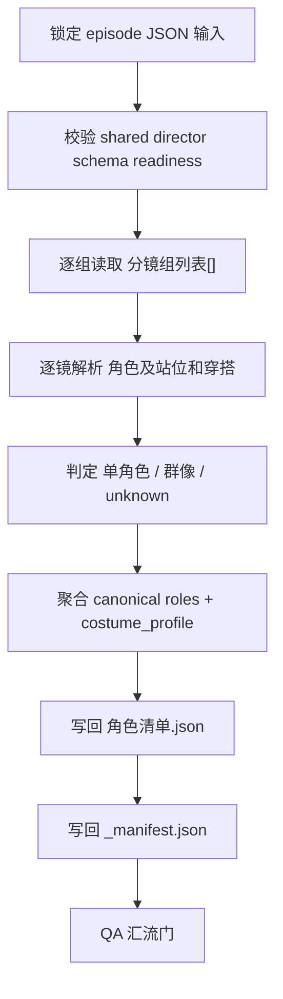
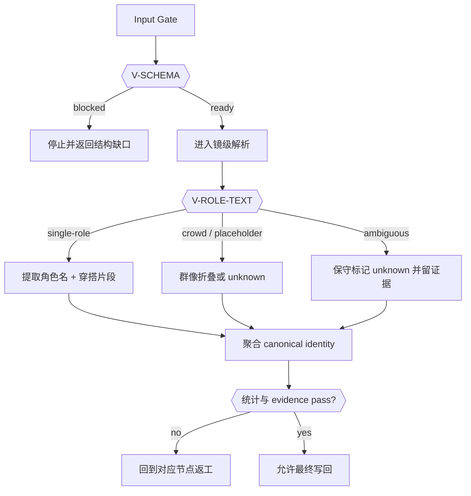
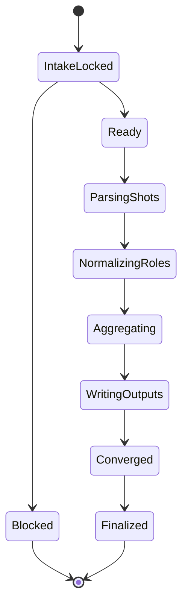
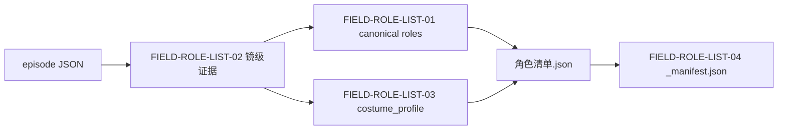

# 4-Design / 2-角色 / 1-清单

## 概述

`1-清单` 是 `4-Design/2-角色` 的第一个 direct leaf skill，负责把 `3-Detail` 已经稳定写入的导演 episode JSON 收敛为可复用的 **角色 design-source 清单**。

本轮重排只改变合同表达方式，不改变业务边界、输入根、输出根、脚本入口与字段口径：

- 第一输入根仍是 `projects/<项目名>/3-Detail/第N集.json`
- 兼容输入仍允许消费 `projects/<项目名>/3-Detail/第N集.json`
- canonical 输出仍是 `角色清单.json + _manifest.json`
- 脚本入口仍是 `scripts/extract_role_list.py`

本叶子显式采用知行合一单技能真源模式，且：

- `复杂链路的骨架 / 细则分层 = false`
- 字段主表、思行节点、执行顺序、失败码、输出结构和验收门全部直接写在本 `SKILL.md`
- 旧 `references/` 仅保留迁移 stub，不再承载规范执行真源

交付类型：`内容输出型 direct leaf`

## Skill Execution Rule (Mandatory)

`1-清单` 直接由本 leaf skill 完成执行闭环，不再拆出第二份思考 sidecar、平行步骤文档或外置角色抽取合同。

- skill 自身负责输入锁定、镜级角色解析、canonical 聚合、写回 `角色清单.json + _manifest.json` 与 QA
- 父 `2-角色` 只消费本技能产出的角色对象池，不维护平行角色抽取步骤真源
- 不得在目录内保留与主 `SKILL.md` 并列演化的字段/流程/输出合同

## When to Use

- 需要从 `projects/<项目名>/3-Detail/第N集.json` 提取角色 canonical list。
- 当前输入仍是兼容路径 `projects/<项目名>/3-Detail/第N集.json`，但内容结构已经对齐 `.agents/skills/aigc/_shared/director_episode_output.schema.json`。
- 需要把镜级 `角色及站位和穿搭` 收敛为角色对象池、穿搭提示和证据映射。

## When Not to Use

- 需要继续补镜头事实、角色表现、运镜或氛围，应回到 `3-Detail`。
- 需要出角色设定图、角色卡或 prompt，应等待 `2-设计` 或下游阶段消费本清单。
- 上游 episode JSON 还没有合法 `分镜组列表[] / 分镜明细[]`。

## Business Requirement Analysis Contract (Mandatory)

| analysis_slot | 当前结论 |
| --- | --- |
| `business_goal` | 把镜级角色事实收束成稳定的角色对象池，让后续 `2-设计 / 3-面板 / 5-Image / 6-Video` 消费同一份 JSON 真源 |
| `business_object` | `3-Detail` episode JSON 中的 `分镜组列表[].分镜明细[].角色及站位和穿搭` |
| `constraint_profile` | 只提取不改写；必须保留 `group_id + shot_id + source_file`；不得把环境/道具词误写成人名或服装结论 |
| `success_criteria` | `roles[]` 非空、镜级 evidence 完整、群像判定可解释、`_manifest.json` 统计与主清单一致 |
| `non_goals` | 不做角色研究长文、不做角色视觉设计、不做角色面板或生图 prompt |
| `complexity_source` | 输入 schema readiness、镜级角色文本保守解析、角色 alias 归并、服装子句隔离、群像折叠与统计收束 |
| `topology_fit` | 前段串行锁输入和 shot 粒度，中段条件分支做角色/群像判定，后段统一聚合、写回和 QA 汇流 |
| `step_strategy` | 采用“串行主干 + 条件判型 + 单点汇流”的单技能思行网络，而不是 `references/` 分拆步骤说明 |

## Context Preload (Mandatory)

加载顺序固定为：

1. 根 `AGENTS.md`
2. `.agents/skills/aigc/SKILL.md + CONTEXT.md`
3. `.agents/skills/aigc/4-Design/SKILL.md + CONTEXT.md`
4. `.agents/skills/aigc/4-Design/2-角色/SKILL.md + CONTEXT.md`
5. 本 `SKILL.md + CONTEXT.md`
6. `.agents/skills/aigc/_shared/director_episode_output.schema.json`
7. `.agents/skills/aigc/_shared/project-runtime-layout.md`
8. `scripts/extract_role_list.py`
9. `projects/<项目名>/3-Detail/第N集.json` 或兼容 `projects/<项目名>/3-Detail/第N集.json`

## Shared Canonical Sources (Mandatory)

- 强制读取：`.agents/skills/aigc/_shared/director_episode_output.schema.json`
- 强制读取：`.agents/skills/aigc/_shared/project-runtime-layout.md`
- 强制读取：`.agents/skills/aigc/4-Design/2-角色/1-清单/scripts/extract_role_list.py`

硬规则：

1. 第一输入根必须是对齐 shared director schema 的 episode JSON
2. 角色提取主路径必须来自 `分镜明细[].角色及站位和穿搭`
3. 所有角色结论都必须保留 `group_id + shot_id + source_file`
4. 不得把 `1-清单` 扩写成角色设计、角色面板或下游生图阶段

## Total Input Contract

### 必需输入

- `projects/<项目名>/3-Detail/第N集.json`
- `.agents/skills/aigc/_shared/director_episode_output.schema.json`

### 可选输入

- `projects/<项目名>/3-Detail/第N集.json`
  - 用户显式给旧路径时可兼容消费
- 用户显式指定的单集范围、单组范围或增量镜头范围

### 禁止输入

- 未对齐 shared schema 的自由文本整理稿
- 旧仓 `output/影片/...` 路径下的平行角色清单
- 任何要求本阶段直接输出角色设计卡或角色面板的额外指令

### 输入处理原则

1. 用户显式指定路径时，先验证结构，再决定是否消费
2. 用户未指定时，默认从 `projects/<项目名>/3-Detail/第N集.json` 读取
3. 读取失败或 schema 缺失时，必须先阻塞并返回缺口，不得硬猜角色清单

## Visual Maps









## Topology Contract (Mandatory)

### Topology Fit

本技能采用 `串行主干 + 条件判型 + 汇流写回`：

1. 串行主干
   - 锁输入
   - 判 readiness
   - 逐镜解析
2. 条件判型
   - 单角色
   - 群像 / 占位
   - ambiguous / unknown
3. 汇流写回
   - 聚合 canonical roles
   - 生成 `角色清单.json`
   - 生成 `_manifest.json`
   - QA 汇流

### Variable Register

| var_id | 观测信号 | 状态集合 | 检测方法 | 优先级 |
| --- | --- | --- | --- | --- |
| `V-SCHEMA` | 输入结构是否可读 | `blocked/ready` | 检查 `分镜组列表[] / 分镜明细[] / 角色及站位和穿搭` | P0 |
| `V-ROLE-TEXT` | 当前镜头角色文本形态 | `single-role/crowd-placeholder/ambiguous/empty` | 解析 `角色及站位和穿搭` | P0 |
| `V-COSTUME-SIGNAL` | 是否命中服装子句 | `present/weak/none` | 服装关键词窗口与角色子句绑定 | P1 |
| `V-EVIDENCE-DENSITY` | 当前镜头证据是否足够 | `full/partial/weak` | 是否具备 `group_id + shot_id + source_file + role_text` | P0 |

### Scenario Table

| case_id | 触发谓词 | 主策略 | fallback |
| --- | --- | --- | --- |
| `C1-BLOCKED` | `V-SCHEMA=blocked` | 停机并返回输入缺口 | 无 |
| `C2-SINGLE` | `V-ROLE-TEXT=single-role` | 提取角色名、穿搭片段和镜级 evidence | `C4-AMBIGUOUS` |
| `C3-CROWD` | `V-ROLE-TEXT=crowd-placeholder` | 群像折叠或保守标记 crowd | `C4-AMBIGUOUS` |
| `C4-AMBIGUOUS` | `V-ROLE-TEXT=ambiguous` | 标记 `unknown` 并保留原文 evidence | 手工复核 |

## Thinking-Action Node Contract (Mandatory)

每个关键节点必须同时描述判断与动作，至少覆盖以下槽位：

| slot | 要求 |
| --- | --- |
| `node_id` | 稳定节点标识 |
| `objective` | 该节点要解决的判断/动作目标 |
| `inputs` | 进入该节点的输入与依赖 |
| `actions` | 该节点真正执行的动作 |
| `evidence` | 该节点留下的证据、产物或验证结果 |
| `route_out` | 成功、失败、分支时分别流向何处 |
| `gate` | 是否允许进入最终汇流 |

## Thinking-Action Node Network

| node_id | 对应 Step | 聚焦字段 | objective | actions | evidence | route_out | gate |
| --- | --- | --- | --- | --- | --- | --- | --- |
| `N1-INPUT-LOCK` | S1 | `FIELD-ROLE-LIST-02` | 锁定唯一 episode 输入根并确认路径别名 | 读取默认路径或兼容路径，校验 shared schema 主结构 | 输入清单、episode_id、readiness 结论 | ready -> `N2`；blocked -> 结束 | 输入真源唯一后方可继续 |
| `N2-SHOT-PARSE` | S2 | `FIELD-ROLE-LIST-02` | 在镜级粒度上稳定提取角色原始文本 | 遍历 `分镜组列表[].分镜明细[]`，提取 `role_text / shot_scene / group_id / shot_id` | `group_role_map[]` 草稿 | 成功 -> `N3`；字段缺失 -> 回到 `S1/S2` | 镜级 evidence 可追溯 |
| `N3-ROLE-NORMALIZE` | S3 | `FIELD-ROLE-LIST-01` | 把镜级角色文本收束成 canonical identity | 判定单角色、群像、占位和 unknown，做 alias 归并与首次出现统计 | `roles[]` 草稿、`first_appearance`、`role_level` | 成功 -> `N4`；全空或全 unknown -> 回到 `S2/S3` | 至少出现可解释的角色对象池 |
| `N4-COSTUME-TRACE` | S4 | `FIELD-ROLE-LIST-03` | 在不污染角色 identity 的前提下提炼穿搭线索 | 只在命中服装关键词的角色子句中抽取 `costume_mentions` 与 `costume_profile` | `roles[].costume_profile`、`group_role_map[].costume_mentions` | 成功 -> `N5`；服装串场 -> 回到 `S2/S4` | 穿搭线索与角色子句绑定 |
| `N5-AGGREGATE-WRITEBACK` | S5 | `FIELD-ROLE-LIST-01` `FIELD-ROLE-LIST-04` | 把角色对象池、镜级 evidence 与统计收束成 canonical 输出 | 生成 `角色清单.json` 与 `_manifest.json`，写入默认 episode 目录 | JSON 主稿、manifest、统计摘要 | 成功 -> `N6`；统计不一致 -> 回到 `S3/S5` | 输出结构完整 |
| `N6-QA-CONVERGENCE` | S6 | `FIELD-ROLE-LIST-04` | 校验 evidence、统计、unknown 比例与路径稳定性 | 检查角色数、evidence 覆盖、manifest 一致性、输出路径 | PASS/FAIL、返工入口 | pass -> Final；fail -> 对应返工节点 | 仅在字段与统计全部通过时允许结案 |

## Convergence Contract (Mandatory)

只有同时满足以下条件，`1-清单` 才允许宣布完成：

1. `FIELD-ROLE-LIST-01` 到 `FIELD-ROLE-LIST-04` 全部已落位
2. 输入已通过 shared schema 主结构校验
3. `roles[]` 非空，且不允许全量退化为 `unknown`
4. `group_role_map[]` 每项都具备 `group_id + shot_id + source_file`
5. `costume_profile` 与 `costume_mentions` 没有被环境或道具描述污染
6. `_manifest.json.statistics.role_count` 与主清单一致

若未满足：

- 输入结构问题 -> 回到 `N1-INPUT-LOCK`
- 镜级解析问题 -> 回到 `N2-SHOT-PARSE`
- 角色归并问题 -> 回到 `N3-ROLE-NORMALIZE`
- 穿搭污染问题 -> 回到 `N4-COSTUME-TRACE`
- 输出统计问题 -> 回到 `N5-AGGREGATE-WRITEBACK`

## One-Shot Output Contract (Mandatory)

`1-清单` 的一次性输出不是研究长文，而是同一 bundle 内的两类 canonical 结果：

### A. `角色清单.json`（Mandatory）

默认路径：

`projects/<项目名>/4-Design/2-角色/1-清单/第N集/角色清单.json`

最低结构：

- `meta`
  - `schema_version`
  - `skill_id`
  - `source_schema`
  - `episode_id`
  - `project_name`
  - `source_file`
  - `generated_at`
- `statistics`
  - `group_count`
  - `shot_count`
  - `role_count`
  - `unknown_shot_count`
- `group_role_map[]`
  - `group_id`
  - `shot_id`
  - `shot_scene`
  - `role_text`
  - `roles[]`
  - `costume_mentions`
  - `source_file`
- `roles[]`
  - `role_id`
  - `name`
  - `role_level`
  - `group_ids[]`
  - `shot_ids[]`
  - `first_appearance`
  - `costume_profile`
  - `display_card`
  - `evidence[]`

### B. `_manifest.json`（Mandatory）

默认路径：

`projects/<项目名>/4-Design/2-角色/1-清单/第N集/_manifest.json`

最低结构：

- `status`
- `episode_id`
- `input_file`
- `output_dir`
- `output_files[]`
- `statistics`
- `notes[]`

### 命令入口

```bash
python3 .agents/skills/aigc/4-Design/2-角色/1-清单/scripts/extract_role_list.py \
  --input "projects/项目名/3-Detail/第1集.json"
```

```bash
python3 .agents/skills/aigc/4-Design/2-角色/1-清单/scripts/extract_role_list.py \
  --project "项目名" \
  --episode "第1集" \
  --dry-run
```

## Field Master

| field_id | 输出位置 | 内容要求 | 来源 | 默认责任 Step | 质量维度 | fail_code |
| --- | --- | --- | --- | --- | --- | --- |
| `FIELD-ROLE-LIST-01` | `roles[]` | 角色 canonical identity、首次出现、出现统计、角色层级 | `分镜明细[].角色及站位和穿搭` | S3 | identity 稳定性 | `FAIL-ROLE-LIST-01` |
| `FIELD-ROLE-LIST-02` | `group_role_map[]` | 每镜角色证据、原始角色文本、场景文本、穿搭片段、`group_id + shot_id` | `分镜组列表[].分镜明细[]` | S2 | 镜级可追溯性 | `FAIL-ROLE-LIST-02` |
| `FIELD-ROLE-LIST-03` | `roles[].costume_profile` | 角色穿搭主线索和常见变体 | 命中服装关键词的角色子句 | S4 | 穿搭隔离度 | `FAIL-ROLE-LIST-03` |
| `FIELD-ROLE-LIST-04` | `_manifest.json` | 输入输出路径、统计、告警与产物摘要 | 提取脚本运行结果 | S5-S6 | 收束完整性 | `FAIL-ROLE-LIST-04` |

## Thought Pass Map

| step_id | 聚焦字段 | 核心问题 | 生成动作 | 未达标信号 |
| --- | --- | --- | --- | --- |
| S1 | `FIELD-ROLE-LIST-02` | 输入 JSON 是否符合 shared director schema | 锁定 episode 输入、别名路径与 readiness | 读不到 `分镜组列表[] / 分镜明细[]` |
| S2 | `FIELD-ROLE-LIST-02` | 每镜能否稳定保留角色原文和证据 | 逐镜提取 `group_id / shot_id / role_text / shot_scene` | `group_role_map[]` evidence 残缺 |
| S3 | `FIELD-ROLE-LIST-01` | 角色 identity 是否可保守归并 | 归并 alias、群像、首次出现与角色层级 | `roles[]` 全空或全 unknown |
| S4 | `FIELD-ROLE-LIST-03` | 穿搭片段是否被正确绑定到角色子句 | 提取 `costume_mentions` 与 `costume_profile` | 服装词明显串场 |
| S5 | `FIELD-ROLE-LIST-01` `FIELD-ROLE-LIST-04` | 是否已形成 machine-first 输出 | 写 `角色清单.json + _manifest.json` | 只有过程说明，没有 JSON 主稿 |
| S6 | `FIELD-ROLE-LIST-04` | 统计、evidence 与输出路径是否一致 | 校验 role_count、unknown_shot_count 与 output_files | manifest 与主稿统计不一致 |

## Pass Table

| field_id | Pass Standard | Fail Code | Rework Entry |
| --- | --- | --- | --- |
| `FIELD-ROLE-LIST-01` | `roles[]` 非空且 identity 可解释 | `FAIL-ROLE-LIST-01` | S3 |
| `FIELD-ROLE-LIST-02` | 每镜 evidence 都具备 `group_id + shot_id + source_file` | `FAIL-ROLE-LIST-02` | S1-S2 |
| `FIELD-ROLE-LIST-03` | `costume_profile` 可解释且未被环境词污染 | `FAIL-ROLE-LIST-03` | S4 |
| `FIELD-ROLE-LIST-04` | `_manifest.json` 统计与主清单一致，路径正确 | `FAIL-ROLE-LIST-04` | S5-S6 |

## Root-Cause Execution Contract (Mandatory)

当出现以下症状时，必须先修本叶子合同：

- 角色清单仍按旧 `groups[]` 或 Markdown 第二行逻辑取数，导致漏掉 `分镜明细[]` 差异。
- 输出里只有角色名，没有 `group_id / shot_id` 证据回链。
- 角色穿搭片段被环境、道具或镜头描述污染。
- 输出继续落到旧仓 `output/影片/...` 或其他平行路径。
- 主 `SKILL.md` 已经知行合一化，但目录里仍把字段/步骤继续写在平行 `references/` 真源里。

必经链路：

`Symptom -> Direct Technical Cause -> Rule Source -> Meta Rule Source -> Fix Landing Points`

优先检查：

- `Rule Source`
  - `.agents/skills/aigc/4-Design/2-角色/1-清单/SKILL.md`
  - `.agents/skills/aigc/4-Design/2-角色/1-清单/CONTEXT.md`
  - `scripts/extract_role_list.py`
- `Meta Rule Source`
  - `.agents/skills/aigc/4-Design/2-角色/SKILL.md`
  - `.agents/skills/aigc/4-Design/SKILL.md`
  - 根 `AGENTS.md`
  - `/Users/vincentlee/.codex/skills/meta/构建/技能/skill-知行合一/SKILL.md`

面向用户的闭环固定返回：

1. root cause location
2. immediate fix
3. systemic prevention fix

## Completion Criteria

- 已锁定唯一 episode 输入根与 shared schema 读法
- 已在镜级粒度完成角色 evidence 提取与 canonical 聚合
- 已生成 `角色清单.json + _manifest.json`
- 已给出通过/阻塞结论与返工入口
- 未生成任何越权角色设计、角色面板或生图产物
