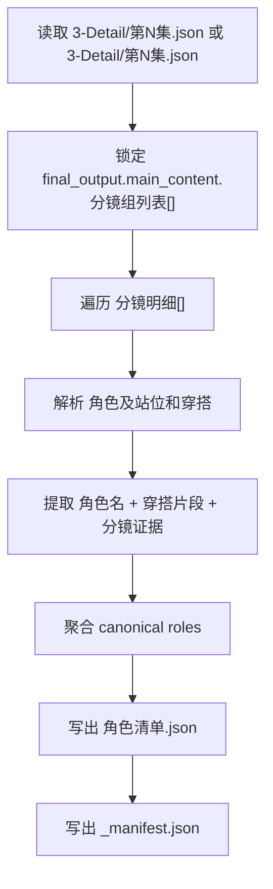

# 4-Design / 2-角色 / 1-清单

## 概述

`1-清单` 是 `4-Design/2-角色` 的第一个可执行叶子技能。

它的职责不是继续做角色研究长文，而是把 `3-Detail` 已经稳定写入的导演 episode JSON 收敛为 **角色 design-source 清单**，供后续 `2-设计 / 3-面板 / 5-Image / 6-Video` 复用。

本叶子默认只产出两类文件：

1. `角色清单.json`
2. `_manifest.json`

## When to Use

- 需要从 `projects/<项目名>/3-Detail/第N集.json` 提取角色 canonical list。
- 当前输入仍是兼容路径 `projects/<项目名>/3-Detail/第N集.json`，但内容结构已经对齐 `.agents/skills/aigc/_shared/director_episode_output.schema.json`。
- 需要把镜级 `角色及站位和穿搭` 收敛为角色对象池、穿搭提示和证据映射。

## When Not to Use

- 需要继续补镜头事实、角色表现、运镜或氛围，应回到 `3-Detail`。
- 需要出角色设定图、角色卡或 prompt，应等待 `2-设计` 或下游阶段消费本清单。
- 上游 episode JSON 还没有合法 `分镜组列表[] / 分镜明细[]`。

## 子技能边界

### `1-清单` 拥有

- shared director schema 到角色清单 JSON 的投影合同。
- 角色 canonical identity、出场镜头、首次出现、服装片段与群像判定的提取逻辑。
- 输出目录 `projects/<项目名>/4-Design/2-角色/1-清单/第N集/` 的默认落点。

### `1-清单` 不拥有

- 角色深入研究长文。
- 角色定妆、形象设计图或展示面板。
- 反向修改上游导演 JSON。

## Visual Maps

## Canonical Module References

| 模块 | 作用 | 真源文件 |
| --- | --- | --- |
| 思维链 | 字段主表、步骤映射、返工入口 | `references/chain-of-thought.md` |
| 执行流程 | 输入解析、命令入口、写回流程 | `references/execution-flow.md` |
| 输出契约 | 产物结构、文件列表、验收面 | `references/output-template.md` |

## Execution Summary

- 第一事实源固定为 `.agents/skills/aigc/_shared/director_episode_output.schema.json` 对齐的导演 JSON。
- 默认优先读取 `projects/<项目名>/3-Detail/第N集.json`；若用户显式给 `projects/<项目名>/3-Detail/第N集.json`，只要结构合法即可直接消费。
- 角色提取优先使用镜级字段 `角色及站位和穿搭`，不再沿用旧版“分镜组第二行角色锚点”作为主路径。
- 所有角色结论都必须保留 `group_id + shot_id + source_file` 证据链。

## Output Summary

- canonical 主产物：`projects/<项目名>/4-Design/2-角色/1-清单/第N集/角色清单.json`
- canonical 辅助清单：`projects/<项目名>/4-Design/2-角色/1-清单/第N集/_manifest.json`
- 脚本入口：`scripts/extract_role_list.py`

## Field System Summary

- 字段体系保持 `FIELD-ROLE-LIST-01` 到 `FIELD-ROLE-LIST-04`
- 详细字段主表、Thought Pass 与 Pass Table 见 `references/chain-of-thought.md`

## Root-Cause Execution Contract (Mandatory)

当出现以下症状时，必须先修本叶子合同：

- 角色清单仍按旧 `groups[]` 或 Markdown 第二行逻辑取数，导致漏掉 `分镜明细[]` 差异。
- 输出里只有角色名，没有 `group_id / shot_id` 证据回链。
- 角色穿搭片段被环境、道具或镜头描述污染。
- 输出继续落到旧仓 `output/影片/...` 或其他平行路径。

必经链路：

`Symptom -> Direct Technical Cause -> Rule Source -> Meta Rule Source -> Fix Landing Points`

优先检查：

- `Rule Source`
  - `.agents/skills/aigc/4-Design/2-角色/1-清单/SKILL.md`
  - `.agents/skills/aigc/4-Design/2-角色/1-清单/CONTEXT.md`
  - `references/*.md`
  - `scripts/extract_role_list.py`
- `Meta Rule Source`
  - `.agents/skills/aigc/4-Design/2-角色/SKILL.md`
  - `.agents/skills/aigc/4-Design/SKILL.md`
  - 根 `AGENTS.md`

## Context Preload (Mandatory)

- 先加载 `aigc` 根合同、`4-Design` 父级合同和 `2-角色` 类目合同。
- 再加载本 `SKILL.md + CONTEXT.md`。
- 执行脚本前按需读取 `references/chain-of-thought.md`、`references/execution-flow.md`、`references/output-template.md`。
