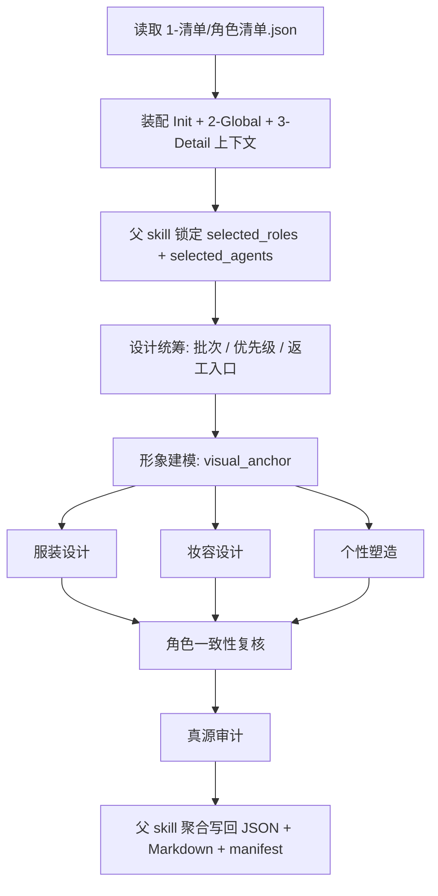
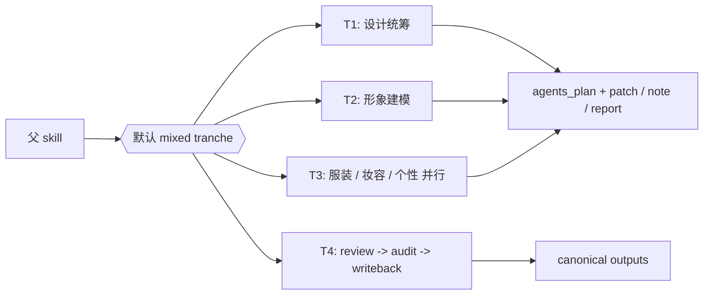
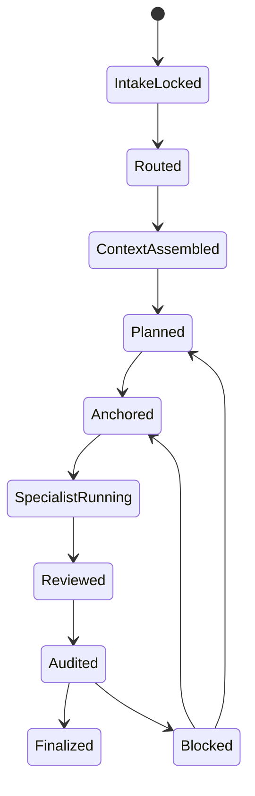
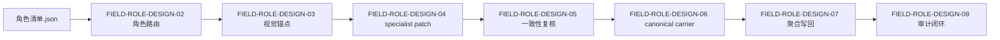

# 4-Design / 2-角色 / 2-设计

## 概述

`2-设计` 是 `4-Design/2-角色` 下的角色设计父 skill，负责把 `1-清单` 已锁定的角色对象池继续收束成：

1. `character_design.json`
2. `第N集/[角色名].md`
3. `_manifest.json`

本轮重排遵循知行合一，但保持现有内容与机制不变：

- 第一输入根仍是 `1-清单/角色清单.json`
- 仍由 `.codex/agents/aigc/设计组/角色设计/` 提供专门化 subagent 思考
- subagents 仍只返回 `agents_plan + patch / note / report`
- 父 skill 仍独占 canonical writeback
- `_shared/IO_CONTRACT.md`、`team.md`、模板与 project runtime layout 仍是共享真源

本技能额外锁定：

- `复杂链路的骨架 / 细则分层 = false`
- 因此业务分析、类型策略、思行节点、并行 tranche、汇流门、失败码与一次性输出合同都必须直接写在本 `SKILL.md`
- `references/` 仅保留迁移 stub，不再承载平行执行真源

交付类型：`内容输出型 + subagent-governed`

## Skill / Subagent Execution Rule (Mandatory)

在 `2-角色/2-设计` 中，分工固定为：

- subagents 负责思考、`agents_plan`、局部证据整理、字段候选与 `patch / note / report`
- skill 本身负责命中角色裁决、上下文装配、patch 收束、canonical 写回、review/audit 闭环与下游 handoff

subagents 可以决定“本轮哪些角色先做、哪些字段先补、哪些冲突该上抛”，但不能替代 skill 完成阶段执行闭环。

## When to Use

- 已有 `projects/<项目名>/4-Design/2-角色/1-清单/第N集/角色清单.json`，需要继续生成角色设计稿。
- 需要把 `2-Global` 的项目级风格/类型/导演意图，与 `3-Detail/第N集.json` 的镜头证据合并为逐角色设计卡。
- 需要为后续 `3-面板`、`5-Image` 或角色多视图生图提供稳定的结构化角色设计 carrier。

## When Not to Use

- 当前还没有 `1-清单` 的角色对象池，应先回到 `4-Design/2-角色/1-清单`。
- 当前任务是补 `3-Detail/第N集.json` 的镜头事实，应回到 `3-Detail`。
- 当前任务是直接出图、做面板或视频请求，应进入 `3-面板`、`5-Image` 或 `6-Video`。

## Business Requirement Analysis Contract (Mandatory)

| analysis_slot | 当前结论 |
| --- | --- |
| `business_goal` | 把角色对象池、全局风格和镜头证据压成可持续复用的角色结构化设计稿 |
| `business_object` | `角色清单.json` 中的角色 identity、`2-Global` 的风格/类型指导、`3-Detail` 的镜头证据、初始化项目约束 |
| `constraint_profile` | 不跳过对象池、不让 subagents 直接写 canonical 文件、不越权替代场景/道具或面板/生图阶段 |
| `success_criteria` | 命中角色范围清晰、视觉锚点稳定、specialist patch 可聚合、review/audit 可回溯、`character_design.json + Markdown + manifest` 同源 |
| `non_goals` | 不回写 `1-清单`、不直接出图、不直接写角色面板 packet、不把角色设计组扩张成跨模块常驻团队 |
| `complexity_source` | 角色批次裁决、上下文剪裁、视觉锚点先行、specialist 并行 patch 汇流、review/audit 返工、增量写回 |
| `topology_fit` | 前段串行锁角色范围与 context packet，中段 `形象建模 -> 三 specialist 并行`，后段统一 review、audit 与 writeback 汇流 |
| `step_strategy` | 采用“串行主干 + 并行 specialist tranche + 单写回汇流”的父 skill 思行网络 |

## Context Preload (Mandatory)

加载顺序固定为：

1. 根 `AGENTS.md`
2. `.agents/skills/aigc/SKILL.md + CONTEXT.md`
3. `.agents/skills/aigc/4-Design/SKILL.md + CONTEXT.md`
4. `.agents/skills/aigc/4-Design/2-角色/SKILL.md + CONTEXT.md`
5. 本 `SKILL.md + CONTEXT.md`
6. `.agents/skills/aigc/_shared/project-runtime-layout.md`
7. `.agents/skills/aigc/4-Design/2-角色/2-设计/_shared/IO_CONTRACT.md`
8. `.codex/agents/aigc/设计组/角色设计/team.md`
9. `projects/<项目名>/0-Init/north_star.yaml`
10. `projects/<项目名>/0-Init/init_handoff.yaml`
11. `projects/<项目名>/2-Global/全局风格.md`
12. `projects/<项目名>/2-Global/类型指导.md`
13. `projects/<项目名>/2-Global/导演意图.md`
14. `projects/<项目名>/4-Design/2-角色/1-清单/第N集/角色清单.json`
15. `projects/<项目名>/3-Detail/第N集.json` 或兼容 `projects/<项目名>/3-Detail/第N集.json`
16. 仅加载命中的角色设计组 agent docs

## Shared Canonical Sources (Mandatory)

- 强制读取：`.agents/skills/aigc/4-Design/2-角色/2-设计/_shared/IO_CONTRACT.md`
- 强制读取：`.agents/skills/aigc/_shared/project-runtime-layout.md`
- 强制读取：`.codex/agents/aigc/设计组/角色设计/team.md`
- 强制读取：`templates/角色设计卡.template.md`

硬规则：

1. 第一输入根固定为 `1-清单/角色清单.json`
2. `character_design.json` 是本阶段唯一 machine-first 真源
3. subagents 只能返回 `agents_plan + patch / note / report`
4. 场景/道具清单只作为只读上下文包，不得扩成角色设计组新常驻职责
5. 本阶段不得创建角色面板、图片或视频请求

## Total Input Contract

### 必需输入

- `projects/<项目名>/4-Design/2-角色/1-清单/第N集/角色清单.json`
- `projects/<项目名>/3-Detail/第N集.json`
- `projects/<项目名>/0-Init/north_star.yaml`
- `projects/<项目名>/0-Init/init_handoff.yaml`
- `projects/<项目名>/2-Global/全局风格.md`
- `projects/<项目名>/2-Global/类型指导.md`

### 可选输入

- `projects/<项目名>/3-Detail/第N集.json`
  - 用户显式给旧路径时的兼容回退
- `projects/<项目名>/2-Global/导演意图.md`
- `projects/<项目名>/4-Design/1-场景/1-清单/第N集/第N集.json`
- `projects/<项目名>/4-Design/4-道具/1-清单/第N集/prop_design_bridge.json`
- `projects/<项目名>/4-Design/2-角色/2-设计/第N集/*`
  - 已有角色设计稿，用于增量 patch
- 用户显式指定的 `selected_roles[]` 或局部设计维度

### 禁止输入

- 跳过 `角色清单.json` 直接从导演 JSON 发明角色设计结论
- 旧仓 `output/影片/.../3-设定/2-设计` 下的平行角色设计主稿
- 要求本阶段直接产出角色面板或直接出图的越权指令

## Visual Maps

## Character Design Team Contract (Mandatory)

唯一执行投影：

- team：`.codex/agents/aigc/设计组/角色设计/team.md`
- roles：
  - `.codex/agents/aigc/设计组/角色设计/设计统筹.md`
  - `.codex/agents/aigc/设计组/角色设计/形象建模.md`
  - `.codex/agents/aigc/设计组/角色设计/服装设计.md`
  - `.codex/agents/aigc/设计组/角色设计/妆容设计.md`
  - `.codex/agents/aigc/设计组/角色设计/个性塑造.md`
  - `.codex/agents/aigc/设计组/角色设计/角色一致性复核.md`
  - `.codex/agents/aigc/设计组/角色设计/真源审计.md`

### 父 skill 拥有

- `selected_roles[]`、`selected_agents[]` 与 tranche 决策
- 全局上下文裁剪与 `context_packet_*` 装配
- `character_design.json`、逐角色 Markdown、`_manifest.json` 的最终写回权
- 对已有角色设计稿做增量 patch 的裁决权
- `validation-report` 与下游 `3-面板 / 5-Image` 回接说明

### 角色设计组 agents 拥有

- 专门化分析与角色化判断
- `agents_plan + patch / note / report`
- 当前角色范围内的局部证据与阻塞报告

### 角色设计组 agents 不拥有

- 直接写回 `projects/<项目名>/4-Design/2-角色/2-设计/第N集/*`
- 为未命中的角色补占位内容
- 越权改写 `1-清单` 的角色 canonical identity
- 越权创建角色面板、图片或视频请求

## Topology Contract (Mandatory)

### Topology Fit

本技能采用 `串行主干 + 并行 specialist tranche + 单写回汇流`：

1. 串行主干
   - 锁输入与角色范围
   - 组装 context packet
   - 运行 `设计统筹`
   - 运行 `形象建模`
2. 并行 tranche
   - `服装设计`
   - `妆容设计`
   - `个性塑造`
3. 汇流门
   - `角色一致性复核`
   - `真源审计`
   - 父 skill 聚合写回

### Route Priority (Mandatory)

`用户显式指定角色/维度 > 设计统筹批次裁决 > role_tier 默认策略`

解释：

1. 用户只要求某个角色、某个维度或某个服装状态时，优先命中该局部路径
2. 用户未指定时，由 `设计统筹` 先裁决 `selected_roles[]`、`selected_agents[]` 与返工入口
3. 若仍无强约束，再由 `role_tier` 和 `world_mode` 决定 specialist 深度

### Variable Register

| var_id | 观测信号 | 状态集合 | 检测方法 | 优先级 |
| --- | --- | --- | --- | --- |
| `V-ROLE-SCOPE` | 当前命中角色范围 | `single/batch/all/unknown` | 读取用户约束与 `角色清单.json` | P0 |
| `V-ROLE-TIER` | 角色层级 | `lead/support/featured-crowd/crowd` | 读取 `roles[].role_level` | P0 |
| `V-WORLD-MODE` | 世界观风格类型 | `historical/modern/fantasy/stylized/hybrid` | 读取 `north_star + 类型指导` | P1 |
| `V-PATCH-MODE` | 当前是新建还是增量更新 | `fresh/incremental` | 检查既有 `第N集/*` 输出 | P0 |
| `V-EVIDENCE-GAP` | 证据完整度 | `full/partial/blocked` | 检查 `group_id + shot_id + source_file` 与 style context | P0 |

### Role Tier Strategy

| role_tier | 设计深度 | 默认 specialist | 说明 |
| --- | --- | --- | --- |
| `lead` | full | 全部 | 主角必须完整输出全部槽位 |
| `support` | high | 全部 | 配角可精简辅助字段，但视觉锚点与穿搭系统不能缺 |
| `featured-crowd` | medium | `形象建模 + 服装设计 + 个性塑造` | 有辨识要求的群像角色可弱化妆容颗粒度 |
| `crowd` | lite | `设计统筹 + 形象建模 + 服装设计` | 纯群演只保留识别锚点、阶层穿搭与禁区 |

### World Mode Strategy

| world_mode | 重点 | 约束 |
| --- | --- | --- |
| `historical` | 制式、材质、阶层、文化痕迹 | 禁止现代时装语言偷渡 |
| `modern` | 职业、生活方式、现实可穿性 | 避免过度奇观化 |
| `fantasy` | 世界观符号、辨识度、视觉夸张度 | 仍需保留角色 identity 与 evidence anchor |
| `stylized` | 轮廓、色块、角色气场 | 避免只剩空泛风格词 |
| `hybrid` | 混合参考需显式说明主导风格 | 避免冲突风格无裁决 |

### Conflict Tie-Break

1. `角色清单.json` 的 canonical identity 优先
2. `2-Global` 的项目级风格与类型指导高于单次镜头修辞
3. `3-Detail/第N集.json` 的镜头证据高于设计组臆测
4. `casting_reference` 只作为具象化代理，不得压过 canonical identity 与镜头证据
5. 若两条证据冲突，优先保守设计，并在 `report` 说明

## Thinking-Action Node Contract (Mandatory)

每个关键节点必须同时描述判断与动作，至少覆盖以下槽位：

| slot | 要求 |
| --- | --- |
| `node_id` | 稳定节点标识 |
| `objective` | 该节点要解决的判断/动作目标 |
| `inputs` | 进入该节点的输入与依赖 |
| `actions` | 该节点真正执行的动作 |
| `evidence` | 该节点留下的证据、产物或验证结果 |
| `route_out` | 成功、失败、分支时分别流向何处 |
| `gate` | 是否允许进入最终输出汇流 |

## Thinking-Action Node Network

| node_id | 对应 Step | 聚焦字段 | objective | actions | evidence | route_out | gate |
| --- | --- | --- | --- | --- | --- | --- | --- |
| `N1-INTAKE-LOCK` | S1 | `FIELD-ROLE-DESIGN-01` | 锁定当前确属 `2-设计` 问题而非前后游问题 | 读取 `角色清单.json`、检测前序真源是否齐备、确认 episode 目录 | 输入清单、phase verdict | 成功 -> `N2`；缺前序真源 -> 回 `1-清单` | 阶段边界明确后方可继续 |
| `N2-ROLE-ROUTE` | S2 | `FIELD-ROLE-DESIGN-02` | 锁定本轮 `selected_roles[]`、`selected_agents[]` 与 patch 模式 | 结合用户约束、`设计统筹` 前置信号和 role_tier 做批次裁决 | role dispatch note、selected_roles | 成功 -> `N3`；角色范围不清 -> 回 `S2` | 角色范围唯一后方可派发 |
| `N3-CONTEXT-PACKET` | S3 | `FIELD-ROLE-DESIGN-02` | 为父 skill 与 subagents 裁剪最小充分上下文 | 组装 `mission_brief_role_design`、`context_packet_*`、既有输出增量基线 | context packets、patch mode 结论 | 成功 -> `N4`；证据缺口 -> 回 `S1-S3` | 上下文充分后方可进入设计 |
| `N4-DISPATCH-PLAN` | S4 | `FIELD-ROLE-DESIGN-02` | 用 `设计统筹` 锁角色批次、优先级与返工入口 | 调度 `设计统筹`，收 `agents_plan + patch / note / report` | `plan_patch_设计统筹` | 成功 -> `N5`；批次冲突 -> 回 `S2-S4` | 计划明确后方可建锚点 |
| `N5-VISUAL-ANCHOR` | S5 | `FIELD-ROLE-DESIGN-03` | 先为每个命中角色建立统一视觉锚点，并把抽象角色感压成可传递的具象参照 | 调度 `形象建模`，生成 `visual_anchor / face_signature / body_signature / silhouette_signature / casting_reference / feature_markers / signature_elements`；其中 `casting_reference` 仅作第一联想演员代理，必须转译成可落盘的特征与元素 | `artifact_patch_形象建模` | 成功 -> `N6A/N6B/N6C`；锚点不稳或演员联想无法转译 -> 回 `S5` | specialist 必须围绕统一锚点与同一组 `feature_markers / signature_elements` 工作 |
| `N6A-WARDROBE` | S6 | `FIELD-ROLE-DESIGN-04` | 生成服装系统、材质、配色与状态变体，并放大角色标志性元素 | 调度 `服装设计`，基于 `visual_anchor + signature_elements` 返回局部 wardrobe patch | `artifact_patch_服装设计` | 成功 -> `N7`；服装冲突 -> 回 `S6` | 只允许返回局部 patch，且不得背离既定标志性元素 |
| `N6B-MAKEUP` | S6 | `FIELD-ROLE-DESIGN-04` | 生成妆面、发型、肤质和镜头可读性方案，并维护脸部辨识特征 | 调度 `妆容设计`，基于 `face_signature + feature_markers` 返回 makeup patch | `artifact_patch_妆容设计` | 成功 -> `N7`；年龄感或镜头冲突 -> 回 `S6` | 只允许返回局部 patch，且不得抹平关键辨识特征 |
| `N6C-PERSONA` | S6 | `FIELD-ROLE-DESIGN-04` | 生成人物气场、姿态、情绪锚点和行为特征，并把具象参照转写成可见表演感 | 调度 `个性塑造`，基于 `casting_reference + feature_markers + signature_elements` 返回 personality patch | `artifact_patch_个性塑造` | 成功 -> `N7`；人设冲突或表演感漂移 -> 回 `S6` | 只允许返回局部 patch，且不得把演员联想直接当成角色定稿 |
| `N7-CONSISTENCY-REVIEW` | S7 | `FIELD-ROLE-DESIGN-05` | 检查跨字段、跨角色、跨场景兼容性，并确认所有 specialist 仍收束在同一个具象角色方向上 | 调度 `角色一致性复核`，指出冲突字段、演员联想漂移、特征丢失与返工入口 | `review_note_角色一致性` | pass -> `N8`；fail -> 回 `S5-S7` | review 不通过不得写回 |
| `N8-AUDIT-WRITEBACK` | S8 | `FIELD-ROLE-DESIGN-06` `FIELD-ROLE-DESIGN-07` `FIELD-ROLE-DESIGN-08` | 检查真源、路径、越权、证据并统一写回 canonical 产物 | 调度 `真源审计`，父 skill 聚合 patch，写回 JSON / Markdown / manifest，并给下游 handoff | canonical outputs、audit report、handoff note | pass -> Final；fail -> 回对应节点 | 仅父 skill 可写回，且通过 audit 后才允许结案 |

## Convergence Contract (Mandatory)

只有同时满足以下条件，`2-设计` 才允许宣布完成：

1. `FIELD-ROLE-DESIGN-01` 到 `FIELD-ROLE-DESIGN-08` 全部已落位
2. `selected_roles[]`、`selected_agents[]` 与 tranche 路由清晰
3. 每个命中角色已有稳定 `visual_anchor`，且 `casting_reference / feature_markers / signature_elements` 已转成可消费锚点
4. specialist patch 可被 review 汇流，不存在未裁决冲突
5. `character_design.json + [角色名].md + _manifest.json` 同源且只覆盖命中角色
6. `真源审计` 未给出 veto，且 evidence lineage 完整

若未满足：

- 角色范围问题 -> 回到 `N2-ROLE-ROUTE`
- 上下文缺口问题 -> 回到 `N3-CONTEXT-PACKET`
- 视觉锚点问题 -> 回到 `N5-VISUAL-ANCHOR`
- specialist 冲突问题 -> 回到 `N6A/N6B/N6C`
- review/audit 问题 -> 回到 `N7` 或 `N8`

## One-Shot Output Contract (Mandatory)

`2-设计` 的一次性输出不是多个 specialist 平行主稿，而是同一 bundle 内的四类 canonical 结果：

### A. `character_design.json`（Mandatory）

默认路径：

`projects/<项目名>/4-Design/2-角色/2-设计/第N集/character_design.json`

最低字段：

- `meta`
  - `project_name`
  - `episode_id`
  - `source_role_list`
  - `source_episode_detail`
  - `skill_id`
  - `generated_at`
- `roles[]`
  - `role_id`
  - `canonical_name`
  - `role_tier`
  - `costume_state`
  - `visual_anchor`
  - `casting_reference`
  - `feature_markers`
  - `signature_elements`
  - `wardrobe_profile`
  - `makeup_profile`
  - `personality_profile`
  - `scene_compatibility`
  - `prop_compatibility`
  - `variation_rules`
  - `negative_constraints`
  - `evidence`
  - `structured_markdown_path`

### B. 逐角色 Markdown（Mandatory）

默认路径：

`projects/<项目名>/4-Design/2-角色/2-设计/第N集/[角色名].md`

必须使用 `templates/角色设计卡.template.md`，最低包含：

1. `物语`
2. `解构`
3. `Visual Anchor`
4. `Wardrobe System`
5. `Makeup & Hair`
6. `Personality & Pose`
7. `Scene / Prop Compatibility`
8. `Negative Constraints`
9. `prompt整合`

### C. `_manifest.json`（Mandatory）

默认路径：

`projects/<项目名>/4-Design/2-角色/2-设计/第N集/_manifest.json`

最低字段：

- `episode_id`
- `selected_roles`
- `source_inputs`
- `output_files`
- `selected_agents`
- `review_status`
- `audit_status`

### D. 父级 handoff note（Mandatory）

本技能返回给 `2-角色` 或下游阶段的最小闭环说明必须包含：

- `selected_roles`
- `patch_mode`
- `review_status`
- `audit_status`
- `next_recommended_entry`
- `blocking_notes`

## Field Master

| field_id | 输出位置/字段 | 内容要求 | 默认责任 Step | 质量维度 | 失败码 |
| --- | --- | --- | --- | --- | --- |
| `FIELD-ROLE-DESIGN-01` | 阶段定位 | 明确 `2-设计` 消费 `1-清单`，负责结构化角色设计，不越权做面板/出图 | S1 | 边界清晰度 | `FAIL-ROLE-DESIGN-01` |
| `FIELD-ROLE-DESIGN-02` | 角色路由 | 明确 `selected_roles[]`、`selected_agents[]` 与 mixed tranche | S2-S4 | 路由完整性 | `FAIL-ROLE-DESIGN-02` |
| `FIELD-ROLE-DESIGN-03` | 视觉锚点 | 每个命中角色都有稳定 `visual_anchor / face_signature / body_signature / casting_reference / feature_markers / signature_elements`，且演员联想已被转译为角色自身特征 | S5 | 角色锚点稳定性 | `FAIL-ROLE-DESIGN-03` |
| `FIELD-ROLE-DESIGN-04` | specialist patch | `wardrobe_profile / makeup_profile / personality_profile / variation_rules` 完整可聚合 | S6 | 设计颗粒度 | `FAIL-ROLE-DESIGN-04` |
| `FIELD-ROLE-DESIGN-05` | 一致性复核 | 跨字段、跨角色、跨场景兼容性被 review，不互相打架 | S7 | 设计一致性 | `FAIL-ROLE-DESIGN-05` |
| `FIELD-ROLE-DESIGN-06` | canonical carrier | `character_design.json + 逐角色 Markdown + _manifest.json` 同源且命名稳定 | S8 | 输出完整性 | `FAIL-ROLE-DESIGN-06` |
| `FIELD-ROLE-DESIGN-07` | 聚合写回 | 父 skill 独占写回，未命中角色不被覆盖 | S8 | 聚合可执行性 | `FAIL-ROLE-DESIGN-07` |
| `FIELD-ROLE-DESIGN-08` | 审计闭环 | 返回 triad closure、阻塞说明与下游回接 | S8 | 闭环完整性 | `FAIL-ROLE-DESIGN-08` |

## Thought Pass Map

| step_id | 聚焦字段 | 核心问题 | 生成动作 | 未达标信号 |
| --- | --- | --- | --- | --- |
| S1 | `FIELD-ROLE-DESIGN-01` | 当前是不是 `2-设计` 问题 | 锁定阶段边界与前后游停点 | 跳过 `1-清单` 直接设计 |
| S2 | `FIELD-ROLE-DESIGN-02` | 本轮要设计哪些角色 | 锁定 `selected_roles[]` 与角色范围 | 多角色并列但没有命中规则 |
| S3 | `FIELD-ROLE-DESIGN-02` | 当前上下文是否足够派发 | 生成 `mission_brief` 与 `context_packet_*` | 证据不足仍强行派发 |
| S4 | `FIELD-ROLE-DESIGN-02` | 设计统筹是否已给出批次和返工入口 | 收 `plan_patch_设计统筹` | 没有批次、优先级或返工说明 |
| S5 | `FIELD-ROLE-DESIGN-03` | 视觉锚点是否稳定且可具象化 | 生成 `visual_anchor / face_signature / body_signature / casting_reference / feature_markers / signature_elements` | specialist 没有统一锚点，或演员联想没有被转成可执行特征 |
| S6 | `FIELD-ROLE-DESIGN-04` | 三条 specialist patch 是否各归其位 | 收服装、妆容、个性 patch | patch 互相污染或缺字段 |
| S7 | `FIELD-ROLE-DESIGN-05` | 设计是否一致可汇流 | 做 reviewer 复核与返工判断 | 强行拼成冲突人设 |
| S8 | `FIELD-ROLE-DESIGN-06` `FIELD-ROLE-DESIGN-07` `FIELD-ROLE-DESIGN-08` | canonical 输出与闭环是否稳定 | audit + writeback + handoff | 只有文采，没有 machine-first carrier 或审计闭环 |

## Pass Table

| field_id | Pass Standard | Fail Code | Rework Entry |
| --- | --- | --- | --- |
| `FIELD-ROLE-DESIGN-01` | 阶段边界、父子职责与输出真源明确 | `FAIL-ROLE-DESIGN-01` | S1 |
| `FIELD-ROLE-DESIGN-02` | 角色路由、顺序与单点直达规则明确 | `FAIL-ROLE-DESIGN-02` | S2-S4 |
| `FIELD-ROLE-DESIGN-03` | 每个命中角色有稳定视觉锚点，且具备可消费的具象参照 | `FAIL-ROLE-DESIGN-03` | S5 |
| `FIELD-ROLE-DESIGN-04` | specialist patch 颗粒度清晰且不越权 | `FAIL-ROLE-DESIGN-04` | S6 |
| `FIELD-ROLE-DESIGN-05` | reviewer 能指出跨字段冲突与返工入口 | `FAIL-ROLE-DESIGN-05` | S7 |
| `FIELD-ROLE-DESIGN-06` | JSON / Markdown / manifest 同源且字段完整 | `FAIL-ROLE-DESIGN-06` | S8 |
| `FIELD-ROLE-DESIGN-07` | 父 skill 独占写回，agents 只返 `agents_plan + patch / note / report` | `FAIL-ROLE-DESIGN-07` | S8 |
| `FIELD-ROLE-DESIGN-08` | 返回 triad closure、阻塞说明与下游回接 | `FAIL-ROLE-DESIGN-08` | S8 |

## Root-Cause Execution Contract (Mandatory)

当 `2-设计` 出现以下问题时，必须先修源层而不是补单次角色文案：

- `2-设计` 跳过 `1-清单`，直接从 `3-Detail/第N集.json` 发明人设
- 四个 specialist 各自输出一整套角色稿，父 skill 无法收束
- 角色设计看起来完整，但没有 `evidence[]`、`shot_id` 或 `group_id` 回链
- 设计内容吞掉场景或道具职责，出现跨模块越权
- canonical 输出只剩 Markdown，没有 machine-first JSON carrier
- 主 `SKILL.md` 已改成知行合一，但目录里仍让 `references/` 承载并列步骤真源

必经链路：

`Symptom -> Direct Technical Cause -> Rule Source -> Meta Rule Source -> Fix Landing Points`

优先检查：

- `Rule Source`
  - `.agents/skills/aigc/4-Design/2-角色/2-设计/SKILL.md`
  - `.agents/skills/aigc/4-Design/2-角色/2-设计/CONTEXT.md`
  - `.agents/skills/aigc/4-Design/2-角色/2-设计/_shared/IO_CONTRACT.md`
  - `.codex/agents/aigc/设计组/角色设计/team.md`
  - `.codex/agents/aigc/设计组/角色设计/*.md`
- `Meta Rule Source`
  - `.agents/skills/aigc/4-Design/2-角色/SKILL.md`
  - `.agents/skills/aigc/4-Design/SKILL.md`
  - 根 `AGENTS.md`
  - `/Users/vincentlee/.codex/skills/meta/构建/技能/skill-知行合一/SKILL.md`

面向用户的闭环固定返回：

1. root cause location
2. immediate fix
3. systemic prevention fix

## Completion Criteria

- 已锁定唯一输入根、唯一输出根和唯一 writeback owner
- 已完成 `设计统筹 -> 形象建模 -> specialist 并行 -> review -> audit -> writeback`
- 已生成 `character_design.json + [角色名].md + _manifest.json`
- 已给出 triad closure 与下游推荐入口
- 未命中角色未被覆盖或补空模板
