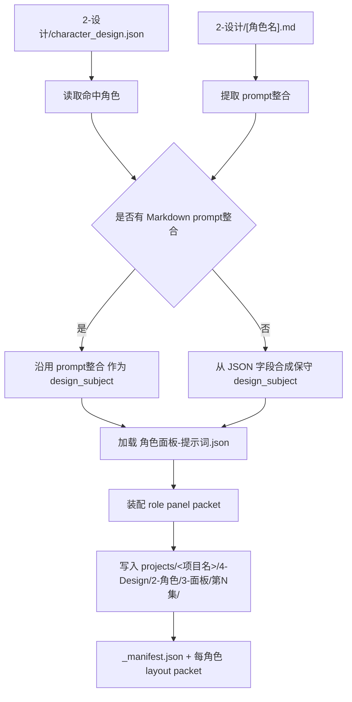
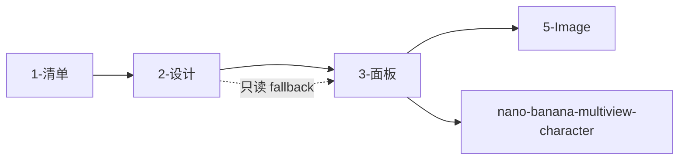

# 4-Design / 2-角色 / 3-面板

## 概述

`3-面板` 是 `4-Design/2-角色` 下承接 `2-设计` 的角色展示面板叶子技能。

它不再重新设计角色，也不直接替代 `5-Image` 出图。它的职责是把 `2-设计` 已经稳定产出的：

1. `character_design.json`
2. 逐角色 Markdown 设计卡

收束成可下游继续消费的 **角色面板 layout packet**，用于后续：

- 角色面板审阅
- 角色多视图/设计页 prompt 装配
- `5-Image` 或 `nano-banana-multiview-character` 的显式下游接续

当前阶段默认只写 packet，不直接生图。

## When to Use

- 已有 `projects/<项目名>/4-Design/2-角色/2-设计/第N集/character_design.json`，需要继续生成角色面板布局包。
- 需要把逐角色 Markdown 中的 `prompt整合` 收束成稳定的角色面板 prompt。
- 需要为后续角色多视图生图、角色展示板审阅或 layout review 保留 machine-first packet。
- 用户明确要求“角色面板 / 角色展示板 / dossier / CHARACTER_ATMOSPHERIC_DOSSIER”。

## When Not to Use

- 还没有 `2-设计` 的角色设计稿，应先回到 `4-Design/2-角色/2-设计`。
- 当前任务是继续补角色对象池，应回到 `1-清单`。
- 当前任务是直接执行图片生成，应进入 `5-Image` 或相关 API 技能，而不是在本阶段越权出图。

## Canonical Anchors

| 载体 | 位置 | 作用 |
| --- | --- | --- |
| 角色设计真源 | `projects/<项目名>/4-Design/2-角色/2-设计/第N集/character_design.json` | 面板阶段的第一输入根 |
| 角色设计卡 | `projects/<项目名>/4-Design/2-角色/2-设计/第N集/[角色名].md` | 首选 `prompt整合` 提取源 |
| 角色对象池 | `projects/<项目名>/4-Design/2-角色/1-清单/第N集/角色清单.json` | identity 与 evidence 回链锚点 |
| 当前集导演真源 | `projects/<项目名>/3-Detail/第N集.json` | 兼容回看，不作为第一 prompt 源 |
| panel template | `templates/角色面板-提示词.json` | 布局、模块与 critical requirements 真源 |
| shared I/O | `_shared/IO_CONTRACT.md` | 输入、输出、命名与 packet 责任真源 |
| runner script | `scripts/build_character_panel_packets.py` | 最小可运行 packet 生成器 |

## Visual Maps

## Canonical Module References

| 模块 | 作用 | 真源文件 |
| --- | --- | --- |
| 输入输出合同 | 输入根、输出根、命名与 packet 责任 | `_shared/IO_CONTRACT.md` |
| 执行流程 | 参数、提取、写回与返工顺序 | `references/execution-flow.md` |
| 类型策略 | Markdown 缺失、群像、参照图与角色层级策略 | `references/type-strategies.md` |
| 输出模板 | packet 结构、manifest 结构与验收面 | `references/output-template.md` |
| panel template | 三栏布局、模块和强制约束 | `templates/角色面板-提示词.json` |

## Execution Summary

- 第一输入根固定为 `projects/<项目名>/4-Design/2-角色/2-设计/第N集/character_design.json`。
- 首选 `prompt整合` 来源固定为同集逐角色 Markdown；若 Markdown 缺失或未含 `prompt整合`，才允许从 `character_design.json.roles[]` 合成保守版 `design_subject`。
- 默认输出根固定为 `projects/<项目名>/4-Design/2-角色/3-面板/第N集/`。
- 当前阶段只生成角色面板 packet，不直接生图，不直接写 report。
- 默认每个命中角色生成一份 `<role_id>-<role_name>-<costume_state>-CharacterPanel-layout.json`。

## Canonical Output Governance (Mandatory)

1. 每角色 layout packet 是本阶段 machine-first 真源。
2. `_manifest.json` 只记录输入、输出、命中角色、统计与下游回接，不承载角色设计事实。
3. `design_subject` 优先复用 `prompt整合`；若回退到 JSON synthesis，必须在 packet 中留下 `design_subject_source=fallback_json_synthesis`。
4. 本阶段不修改 `character_design.json`、逐角色 Markdown 或 `角色清单.json`。
5. 本阶段不直接执行图像生成；后续若要出图，必须显式进入 `5-Image` 或 API 技能。

## Field Master

| field_id | 输出位置/字段 | 内容要求 | 默认责任 Step | 质量维度 | 失败码 |
| --- | --- | --- | --- | --- | --- |
| FIELD-ROLE-PANEL-01 | 阶段定位 | 明确 `3-面板` 只消费 `2-设计`，只产出 layout packet | S1 | 边界清晰度 | FAIL-ROLE-PANEL-01 |
| FIELD-ROLE-PANEL-02 | 输入真源 | `character_design.json + [角色名].md + 模板` 三者职责明确 | S2 | 真源稳定性 | FAIL-ROLE-PANEL-02 |
| FIELD-ROLE-PANEL-03 | design_subject | 优先抽 `prompt整合`，缺失时保守合成 | S3 | prompt 来源可靠性 | FAIL-ROLE-PANEL-03 |
| FIELD-ROLE-PANEL-04 | 布局继承 | 三栏 layout、模块和 critical requirements 完整继承模板 | S4 | 布局一致性 | FAIL-ROLE-PANEL-04 |
| FIELD-ROLE-PANEL-05 | packet prompt | `prompt_text` 必须完整包含 design_subject 与 layout contract | S5 | 下游可消费性 | FAIL-ROLE-PANEL-05 |
| FIELD-ROLE-PANEL-06 | packet 输出 | 每角色 packet 与 `_manifest.json` 命名稳定、路径正确 | S6 | 输出完整性 | FAIL-ROLE-PANEL-06 |
| FIELD-ROLE-PANEL-07 | 群像/参照策略 | 群像角色与 local reference image 处理有据可依 | S7 | 变体处理稳定性 | FAIL-ROLE-PANEL-07 |
| FIELD-ROLE-PANEL-08 | 下游回接 | 明确可回接 `5-Image` 或 `nano-banana-multiview-character` | S8 | handoff 清晰度 | FAIL-ROLE-PANEL-08 |

## Thought Pass Map

| step_id | 聚焦字段 | 核心问题 | 生成动作 | 未达标信号 |
| --- | --- | --- | --- | --- |
| S1 | FIELD-ROLE-PANEL-01 | 当前是不是 `3-面板` 问题 | 锁定阶段边界与停点 | 在本阶段直接出图 |
| S2 | FIELD-ROLE-PANEL-02 | 当前应读取哪些真源 | 锁定 JSON / Markdown / 模板 | 重扫导演 JSON 代替上游设计稿 |
| S3 | FIELD-ROLE-PANEL-03 | design_subject 从哪里来 | 抽 `prompt整合` 或做 JSON synthesis | prompt 来源不明或整份 Markdown 混入搜索/解构段 |
| S4 | FIELD-ROLE-PANEL-04 | 布局是否完整继承模板 | 读取模板并装配 layout 模块 | 模板字段缺失或布局漂移 |
| S5 | FIELD-ROLE-PANEL-05 | prompt 是否足够完整可被下游消费 | 合成 `prompt_text` 与 prompt segments | 只有 layout 文案，没有角色主体 |
| S6 | FIELD-ROLE-PANEL-06 | 输出是否稳定落盘 | 写每角色 packet + manifest | 丢角色、命名漂移或写错路径 |
| S7 | FIELD-ROLE-PANEL-07 | 群像和参照图是否处理正确 | 标记 `group_portrait` 与 `reference_images[]` | crowd 仍按单人板写死 |
| S8 | FIELD-ROLE-PANEL-08 | 后续如何继续消费 | 留下 handoff target 与 packet 元信息 | 结果无法继续进入生图链 |

## Pass Table

| field_id | Pass Standard | Fail Code | Rework Entry |
| --- | --- | --- | --- |
| FIELD-ROLE-PANEL-01 | 阶段边界、停点与禁令明确 | FAIL-ROLE-PANEL-01 | S1 |
| FIELD-ROLE-PANEL-02 | JSON / Markdown / 模板三者职责明确 | FAIL-ROLE-PANEL-02 | S2 |
| FIELD-ROLE-PANEL-03 | `design_subject` 可追溯到 `prompt整合` 或 fallback 说明 | FAIL-ROLE-PANEL-03 | S3 |
| FIELD-ROLE-PANEL-04 | 模板布局、模块和 constraints 完整继承 | FAIL-ROLE-PANEL-04 | S4 |
| FIELD-ROLE-PANEL-05 | `prompt_text` 同时包含角色主体与布局约束 | FAIL-ROLE-PANEL-05 | S5 |
| FIELD-ROLE-PANEL-06 | packet 与 manifest 路径、命名、角色覆盖正确 | FAIL-ROLE-PANEL-06 | S6 |
| FIELD-ROLE-PANEL-07 | 群像/参照图策略稳定且不越权 | FAIL-ROLE-PANEL-07 | S7 |
| FIELD-ROLE-PANEL-08 | 下游回接路径明确 | FAIL-ROLE-PANEL-08 | S8 |

## Root-Cause Execution Contract (Mandatory)

当 `3-面板` 出现以下问题时，必须先修源层而不是只改某一条 prompt：

- 整份角色 Markdown 被直接拼进面板 prompt，导致把 `物语 / 解构` 全部灌入下游。
- 面板阶段绕过 `2-设计`，重新从 `3-Detail/第N集.json` 发明角色形象。
- 输出继续沿用旧仓路径或随机目录。
- packet 只保留模板文案，没有角色主体内容。
- crowd / 群像角色仍被当作单角色 turnaround 处理。

必经链路：

`Symptom -> Direct Technical Cause -> Rule Source -> Meta Rule Source -> Fix Landing Points`

优先检查：

- `Rule Source`
  - `.agents/skills/aigc/4-Design/2-角色/3-面板/SKILL.md`
  - `.agents/skills/aigc/4-Design/2-角色/3-面板/CONTEXT.md`
  - `.agents/skills/aigc/4-Design/2-角色/3-面板/_shared/IO_CONTRACT.md`
  - `.agents/skills/aigc/4-Design/2-角色/3-面板/references/*.md`
  - `.agents/skills/aigc/4-Design/2-角色/3-面板/scripts/build_character_panel_packets.py`
- `Meta Rule Source`
  - `.agents/skills/aigc/4-Design/2-角色/2-设计/SKILL.md`
  - `.agents/skills/aigc/4-Design/2-角色/SKILL.md`
  - `.agents/skills/aigc/4-Design/SKILL.md`
  - 根 `AGENTS.md`

面向用户的闭环固定返回：

1. root cause location
2. immediate fix
3. systemic prevention fix

## Context Preload (Mandatory)

1. `.agents/skills/aigc/SKILL.md + CONTEXT.md`
2. `.agents/skills/aigc/4-Design/SKILL.md + CONTEXT.md`
3. `.agents/skills/aigc/4-Design/2-角色/SKILL.md + CONTEXT.md`
4. `.agents/skills/aigc/4-Design/2-角色/2-设计/SKILL.md + CONTEXT.md`
5. 本 `SKILL.md + CONTEXT.md`
6. `_shared/IO_CONTRACT.md`
7. `references/execution-flow.md`
8. `references/type-strategies.md`
9. `references/output-template.md`
10. `templates/角色面板-提示词.json`

## Completion Criteria

- 已建立 `3-面板` 主合同、经验层、模板、I/O 合同与入口元数据。
- 已提供可运行脚本，能把 `2-设计` 产物收束成角色面板 packet。
- 已锁定 `prompt整合 -> design_subject -> layout packet` 的单一收束顺序。
- 已明确本阶段不直接出图，只做 packet 写回。
- 已同步父级类目与阶段父级的 active/pending 状态。
