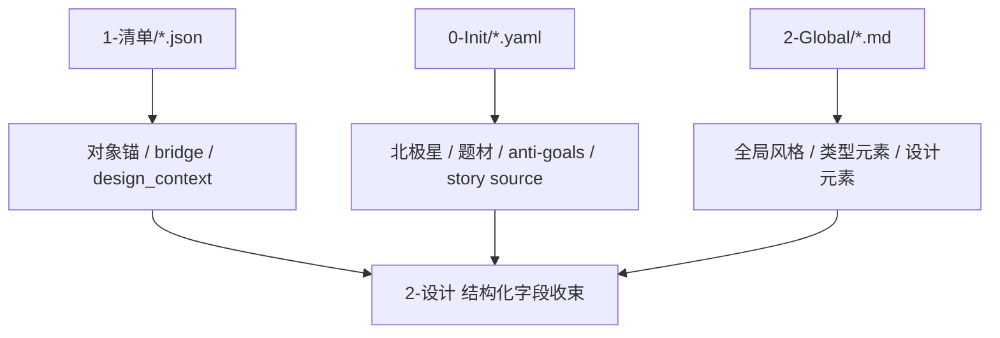

# 4-Design / 2-设计 Design Input Contract

## Purpose

- 本文件是 `4-Design/2-设计/*` 消费上游设计源的共享真源。
- `2-设计` 不直接回读 `3-Detail` 作为默认第一输入，而是优先消费 `1-清单` 已写回的 design-source JSON。
- `0-Init` 与 `2-Global` 在本阶段不负责对象识别，只负责风格、题材、禁区、故事使命与设计边界。

## Upstream Priority

## Canonical Input Layers

| layer | source | responsibility | forbidden_overreach |
| --- | --- | --- | --- |
| `L1` | `projects/aigc/<项目名>/4-Design/<领域>/1-清单/第N集/*.json` | 提供对象主键、bridge、research、design_context | 不负责项目级风格基调裁决 |
| `L2` | `projects/aigc/<项目名>/0-Init/{north_star,init_handoff,story-source-manifest}.yaml` | 提供故事核、情绪内核、世界模式、anti-goals、未决问题 | 不负责逐角色造型落笔 |
| `L3` | `projects/aigc/<项目名>/2-Global/{全局风格,类型元素,设计元素}` | 提供项目级 Style Backbone、类型边界与导演意图 | 不负责对象主键或服装状态识别 |

## Role Design Mapping

| target_slot | first_source | fallback | note |
| --- | --- | --- | --- |
| `role_anchor` | `角色清单.json.roles[]` | `角色清单.json.group_role_map[]` | 锁 `role_id / canonical_name / role_tier / costume_state` |
| `appearance_bridge` | `role_design_bridge.json.roles[]` | `角色研究.json.roles[]` | 面部、发型、体态、连续性优先 bridge-first |
| `costume_bridge` | `role_design_bridge.json.roles[]` | `角色研究.json.roles[]` | 服装制式、材质、配色、变体 |
| `story_premise` | `north_star.yaml` | `init_handoff.yaml` | 锁人物处于什么故事世界与情感走廊 |
| `style_backbone` | `2-Global/全局风格.md` | `north_star.yaml.aesthetic_axes` | 项目级视觉基底 |
| `genre_guardrail` | `2-Global/全集类型元素.md` | `north_star.yaml.creative_mandate` | 防止 prompt 漂成错误题材 |
| `directing_bias` | `2-Global/导演意图.md` | `2-Global/分组类型元素.md` | 角色镜头/情绪与空间导向 |

## Scene Design Mapping

| target_slot | first_source | fallback | note |
| --- | --- | --- | --- |
| `scene_anchor` | `场景清单.json.scenes[]` | `场景清单.json.group_scene_map[]` | 锁 `scene_id / scene_name / scene_type / occurrence` |
| `scene_evidence` | `场景研究.json.scenes[]` | `场景清单.json.scenes[].design_context` | 证据账本、detail profile、scene bible、compendium |
| `scene_bridge` | `scene_design_bridge.json.scenes[]` | `场景清单.json.scenes[].design_context.design_handoff` | fixed anchors、variable state、prompt anchor、negative constraints |
| `story_premise` | `north_star.yaml` | `init_handoff.yaml` | 锁场景处于什么故事世界、情绪走廊与 anti-goals |
| `style_backbone` | `2-Global/全局风格.md` | `north_star.yaml.aesthetic_axes` | 项目级视觉基底 |
| `genre_guardrail` | `2-Global/全集类型元素.md` | `north_star.yaml.creative_mandate` | 防止场景 prompt 漂成错误题材 |
| `directing_bias` | `2-Global/导演意图.md` | `2-Global/分组类型元素.md` | 场景观看、镜头情绪与空间导向 |

## Prop Design Mapping

| target_slot | first_source | fallback | note |
| --- | --- | --- | --- |
| `prop_anchor` | `道具清单.json.props[]` | `道具清单.json.group_prop_map[]` | 锁 `prop_id / canonical_name / narrative_significance` |
| `prop_design_context` | `道具清单.json.props[].design_context` | `prop_design_bridge.json.props[]` | 道具设计第一骨架 |
| `prop_research` | `道具研究.json.props[]` | `道具清单.json.props[].design_context` | 只补证，不反向改对象池 |
| `story_premise` | `north_star.yaml` | `init_handoff.yaml` | 锁道具所处故事世界 |
| `style_backbone` | `2-Global/全局风格.md` | `north_star.yaml.aesthetic_axes` | 项目级视觉基底 |

## Shared Rules

1. `1-清单` 的对象 JSON 是 `2-设计` 的第一输入根。
2. `0-Init` 负责“为什么这样设计”，`2-Global` 负责“应落在哪条视觉与类型走廊”，`1-清单` 负责“设计谁以及有哪些桥接证据”。
3. 当 `role_design_bridge.json` 缺失时，允许退回 `角色研究.json`；再缺失时，才退回 `角色清单.json`。
4. 当 `scene_design_bridge.json` 或 `场景研究.json` 缺失时，`场景/2-设计` 只能降级消费 `场景清单.json.scenes[].design_context`，并必须在 `scene_design.json.quality_flags` 与 `_manifest.json.notes` 留痕。
5. 当 `prop_design_bridge.json` 或 `道具研究.json` 缺失时，`道具/2-设计` 仍以 `道具清单.json.props[].design_context` 为第一设计骨架，不得把 compat sidecar 升为主输入。
6. 若 `0-Init` 与 `2-Global` 对风格信号冲突，优先级固定为：
   - `2-Global/全局风格`
   - `north_star.aesthetic_axes`
   - `init_handoff.stage_entry_seeds.directing_seed`
7. 下游 `3-面板` 应优先消费 `2-设计` 写出的 structured design truth，不再反向重猜对象身份或风格骨架。
