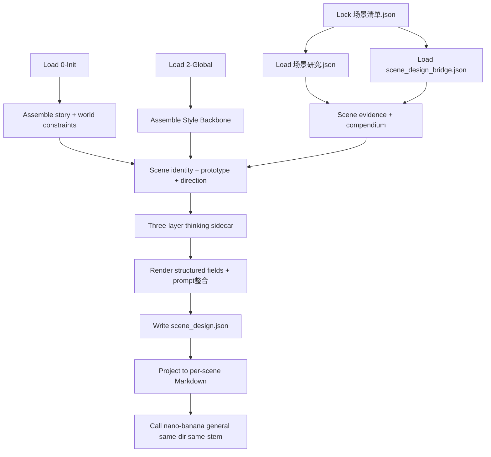
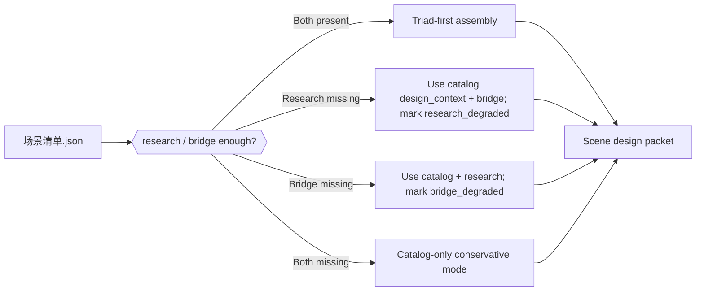
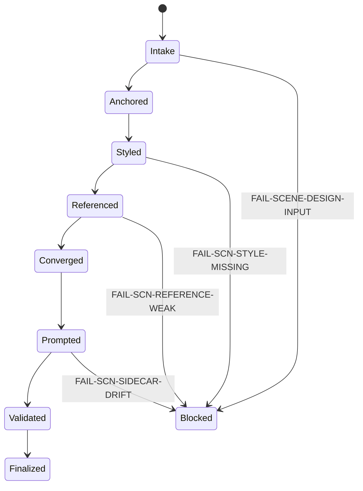
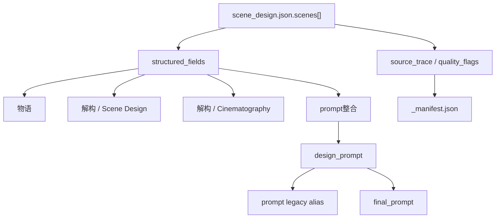

# aigc 4-Design / 2-设计 / 场景

## Context Loading Contract

- 每次调用本技能时，必须同时加载同目录 `CONTEXT.md` 作为预加载上下文。
- 若同目录 `CONTEXT.md` 缺失，应先补齐最小知识库骨架，或向用户明确报告阻塞；不得在未检查该上下文的情况下执行技能。
- 冲突优先级：用户显式请求 > 仓库/全局 `AGENTS.md` > 本 `SKILL.md` > 同目录 `CONTEXT.md`。

## 概述

`4-Design/2-设计/场景` 是当前 `aigc` 技能树里的统一场景主体设计 leaf。

它参照 `/Volumes/AIGC/AIGC-ZEN-VOID/.agents/skills/aigc2026/3-设定/2-设计/场景设计` 的成熟配置，但按当前仓 runtime 重定输入与落点：

- 上游不再是旧仓 `output/影片/<项目名>/3-设定/1-清单/场景清单/`。
- 当前第一输入根固定为 `projects/aigc/<项目名>/4-Design/场景/1-清单/第N集/` 下的清单产物 JSON。
- `0-Init` 与 `2-Global` 只提供北极星、风格骨架、类型边界与导演偏置，不负责重新识别场景对象。

默认交付：

1. `scene_design.json`
2. `[场景名].md`
3. `[场景名].<ext>`（nano-banana general 单主体图片）
4. `_manifest.json`

可选工作侧车：

- `thinking/第N集/[场景名].md`

## LLM-First Creative Authorship Contract (Mandatory)

- `场景设计` 属于内容创作型任务；`scene_design.json`、`[场景名].md`、`prompt整合` 与其他创作性设计正文，必须由 LLM 直接完成。
- `scripts/build_scene_design_packets.py` 不得再被视为默认主创入口；它只允许用于受控兼容迁移、既有 LLM 真源的模板投影、批量落盘或结构校验前的机械辅助。
- 当前 skill 的默认执行路径必须是：`LLM 直出 canonical creative truth -> validator / projector / auto-image helper`，而不是 `script 生成设计稿 -> LLM 只做补丁`。
- 若确需临时运行旧式脚本主创，只能以受控兼容模式显式传入 `--allow-legacy-script-authorship`，且不得把该路径重新写回为默认流程。

## Parent Positioning

- 当前 skill 是 `4-Design/2-设计` 下的场景 leaf。
- 上游对象池与场景研究真源属于 `4-Design/1-清单/场景`。
- 项目题材、风格和导演意图真源属于 `0-Init` 与 `2-Global`。
- 本技能只负责把这些上游信息压成可直接供 `3-面板/场景`、`5-Image` 与后续视频阶段消费的场景设计真源。

本技能不拥有：

- 重写 `场景清单.json / 场景研究.json / scene_design_bridge.json`
- 越权改写 `0-Init` 北极星或 `2-Global` 风格总线
- 把旧仓 `室内 / 室外 / 野外` 恢复为三个技能边界
- 用 per-scene Markdown 冒充 machine-first canonical truth

## Shared Canonical Sources (Mandatory)

- `.agents/skills/aigc/4-Design/2-设计/_shared/design-input-contract.md`
- `.agents/skills/aigc/4-Design/2-设计/_shared/design-output-contract.md`
- `.agents/skills/aigc/4-Design/2-设计/_shared/design-slot-review-contract.md`
- `.agents/skills/aigc/_shared/council-runtime/module-spec.md`
- `.agents/skills/aigc/4-Design/2-设计/_shared/subagent-supervision-contract.md`
- `.agents/skills/aigc/4-Design/1-清单/_shared/list-output-contract.md`
- `.agents/skills/aigc/4-Design/1-清单/场景/SKILL.md`
- `references/scene-design-assembly.md`
- `templates/scene_masterprompt.structured.v2.md`
- `scripts/build_scene_design_packets.py`
- `scripts/validate_scene_design_projection.py`

真源分工：

- 本 `SKILL.md`
  - 场景设计 leaf 的输入合同、思行网络、字段通过门与输出契约。
- `_shared/design-input-contract.md`
  - `1-清单 + 0-Init + 2-Global` 的上游输入口径真源。
- `_shared/design-output-contract.md`
  - `global_style_prefix / full_generation_prompt / same-dir same-stem auto image` 的共享输出真源。
- `_shared/design-slot-review-contract.md`
  - 当前轮 `scene_design.json + [场景名].md + _manifest.json` 应如何解析成 `SCENE-BUNDLE-*` 的共享评审与返工真源。
- `references/scene-design-assembly.md`
  - 三真源装配、文化原型查证、三层收敛与输出映射细则。
- `templates/scene_masterprompt.structured.v2.md`
  - 单场景 Markdown projection 的固定模板真源。
- `scripts/build_scene_design_packets.py`
  - 场景三 JSON 到 `scene_design.json + [场景名].md` 的唯一批量渲染入口；必须从模板填槽，不得手写第二套 Markdown 结构。
- `scripts/validate_scene_design_projection.py`
  - Markdown projection 与 `scene_design.json` 的硬校验入口；缺 `Reasoning Pivot / Scene Design / Cinematography / prompt整合` 时必须返回非零。

## Reference Loading Guide

读取顺序固定为：

1. 根 `AGENTS.md`
2. `.agents/skills/aigc/SKILL.md + CONTEXT.md`
3. `.agents/skills/aigc/4-Design/SKILL.md + CONTEXT.md`
4. `.agents/skills/aigc/4-Design/2-设计/SKILL.md + CONTEXT.md`
5. `.agents/skills/aigc/4-Design/2-设计/_shared/design-input-contract.md`
6. `.agents/skills/aigc/4-Design/2-设计/_shared/design-output-contract.md`
7. `.agents/skills/aigc/4-Design/2-设计/_shared/design-slot-review-contract.md`
8. `.agents/skills/aigc/_shared/council-runtime/module-spec.md`
9. `.agents/skills/aigc/4-Design/2-设计/_shared/subagent-supervision-contract.md`
10. `.agents/skills/aigc/4-Design/1-清单/_shared/list-output-contract.md`
11. `.agents/skills/aigc/4-Design/1-清单/场景/SKILL.md + CONTEXT.md`
12. 本 `SKILL.md + CONTEXT.md`
13. `references/scene-design-assembly.md`
14. `templates/scene_masterprompt.structured.v2.md`
15. `projects/aigc/<项目名>/4-Design/场景/1-清单/第N集/场景清单.json`
16. `projects/aigc/<项目名>/4-Design/场景/1-清单/第N集/场景研究.json`（若存在）
17. `projects/aigc/<项目名>/4-Design/场景/1-清单/第N集/scene_design_bridge.json`（若存在）
18. `projects/aigc/<项目名>/0-Init/{north_star,init_handoff,story-source-manifest}.yaml`
19. `projects/aigc/<项目名>/2-Global/全局风格.md`
20. `projects/aigc/<项目名>/2-Global/全集类型元素.md`
21. `projects/aigc/<项目名>/2-Global/导演意图.md`
22. `projects/aigc/<项目名>/team.yaml`（若存在）

## Business Requirement Analysis Contract (Mandatory)

| analysis_slot | 当前结论 |
| --- | --- |
| `business_goal` | 把场景三真源、项目北极星与项目级风格/类型/导演意图，收束成 machine-first 的场景设计真源，供 `3-面板/场景` 与后续图像阶段直接消费。 |
| `business_object` | `场景清单.json.scenes[]`、`场景研究.json.scenes[]`、`scene_design_bridge.json.scenes[]`、`0-Init/*.yaml`、`2-Global/*.md`、`scene_design.json.scenes[]`。 |
| `constraint_profile` | 场景主键只来自 `场景清单.json`；证据与场景宝典优先来自 `场景研究.json`；设计直参和负面约束优先来自 `scene_design_bridge.json`；风格骨架优先 `2-Global/全局风格`。 |
| `success_criteria` | 每个场景都有稳定 `scene_id / scene_name / scene_type / style_backbone / scene_style / structured_fields / prompt整合 / quality_flags / source_trace`，并且 Markdown projection 与 `scene_design.json` 一致。 |
| `non_goals` | 不重写清单三真源；不直接生成 layout panel；不把 thinking sidecar 升格为业务真源；不恢复室内/室外/野外多技能分裂。 |
| `complexity_source` | 场景设计既要继承旧仓 17 字段与三段式场景宝典，又要适配当前仓 `1-清单` 三 JSON、`0-Init`、`2-Global` 的分层输入责任。 |
| `topology_fit` | 固定为“锁输入 -> 场景锚与风格骨架并行装配 -> 原型/参照/文化查证 -> 三层收敛 -> prompt整合 -> JSON/Markdown 汇流校验”。 |
| `step_strategy` | 主合同保留骨架、Mermaid、门禁、字段映射与输出契约；复杂装配、外部查证与字段落盘细则下沉 `references/scene-design-assembly.md`。 |

## Total Input Contract (Mandatory)

### 必需输入

- `projects/aigc/<项目名>/4-Design/场景/1-清单/第N集/场景清单.json`

### 强烈建议输入

- `projects/aigc/<项目名>/4-Design/场景/1-清单/第N集/场景研究.json`
- `projects/aigc/<项目名>/4-Design/场景/1-清单/第N集/scene_design_bridge.json`
- `projects/aigc/<项目名>/0-Init/north_star.yaml`
- `projects/aigc/<项目名>/0-Init/init_handoff.yaml`
- `projects/aigc/<项目名>/0-Init/story-source-manifest.yaml`
- `projects/aigc/<项目名>/2-Global/全局风格.md`
- `projects/aigc/<项目名>/2-Global/全集类型元素.md`
- `projects/aigc/<项目名>/2-Global/导演意图.md`

### 可选输入

- `projects/aigc/<项目名>/2-Global/分组类型元素.md`
- 用户显式指定的 `selected_scenes[] / selected_scene_ids[]`
- 外部查证材料或用户提供的文化/建筑参考资料

### 硬规则

1. `场景清单.json` 是对象池第一输入根；缺失时必须回退到 `1-清单/场景`，不得在本阶段重猜场景主键。
2. `场景研究.json` 与 `scene_design_bridge.json` 若缺失，允许降级，但必须在 `scene_design.json.scenes[].quality_flags` 与 `_manifest.json.notes` 留痕。
3. `0-Init` 负责故事核、世界模式、anti-goals 与情绪北极星；不负责逐场景空间细节。
4. `2-Global` 负责 Style Backbone、类型元素与导演偏置；不负责对象识别。
5. 缺证据时允许 `TBD / manual_review_required`，不得臆造建筑制式、宗教礼制或地域材料。

## Output Contract (Mandatory)

默认输出目录：

- `projects/aigc/<项目名>/4-Design/场景/2-设计/第N集/`

默认交付物：

1. `scene_design.json`
2. `[场景名].md`
3. `[场景名].<ext>`
4. `_manifest.json`

可选工作侧车：

- `projects/aigc/<项目名>/4-Design/场景/2-设计/thinking/第N集/[场景名].md`

输出硬约束：

1. `scene_design.json` 是 machine-first canonical truth。
2. `[场景名].md` 必须按模板文件输出三段式：`物语 -> 解构 -> prompt整合`。
3. `_manifest.json` 只记录覆盖率、路径、输入降级、外部查证与兼容说明。
4. thinking sidecar 只承载三层收敛过程，不得被下游 `3-面板` 当作第一输入。
5. `scene_type` 是字段，不是目录或子技能边界；允许值优先归一为 `interior / exterior / wilderness / hybrid / unknown`。
6. `design_prompt` 为 canonical prompt 字段，`prompt` 仅作为 legacy alias，值必须与 `design_prompt` 一致。
7. `full_generation_prompt` 必须等于统一 `global_style_prefix + design_prompt`，并作为 nano-banana general 的唯一 prompt 入参。
8. `[场景名].<ext>` 必须由同目录 `[场景名].md` 触发生成，文件 stem 与 Markdown 一致。
9. 脚本不再是默认主创入口；若人工或 LLM 已完成 canonical creative truth，可用 `scripts/validate_scene_design_projection.py` 做投影校验，必要时才在受控兼容模式下调用 legacy builder。
10. `_manifest.json.template_validation.status` 必须为 `success` 才能宣称 Markdown projection 已符合模板。

## Projection And Validation Helpers

默认校验：

```bash
python3 .agents/skills/aigc/4-Design/2-设计/场景/scripts/validate_scene_design_projection.py \
  --output-dir "projects/aigc/<项目名>/4-Design/场景/2-设计/第N集"
```

legacy 兼容投影入口：

```bash
python3 .agents/skills/aigc/4-Design/2-设计/场景/scripts/build_scene_design_packets.py \
  --catalog "projects/aigc/<项目名>/4-Design/场景/1-清单/第N集/场景清单.json" \
  --allow-legacy-script-authorship
```

脚本硬规则：

1. `build_scene_design_packets.py` 仅可在受控兼容模式下执行，不得再作为默认主创入口。
2. `validate_scene_design_projection.py` 必须检查 `**物语** / **解构** / Reasoning Pivot / ## Scene Design ## / ## Cinematography ## / **prompt整合**`。
3. 校验失败时，不得继续把输出交给 `3-面板` 当作稳定设计真源。

## Visual Maps (Mermaid)









## Field Master

| field_id | output_position | requirement | source_layers | owner_step | quality_dimension | fail_code |
| --- | --- | --- | --- | --- | --- | --- |
| `FIELD-SCN-DES-01` | `scenes[].scene_id / scene_name / scene_type` | 场景身份、类型、原型与出现范围稳定可追溯 | `场景清单.json` | `S2` | identity stability | `FAIL-SCN-IDENTITY-DRIFT` |
| `FIELD-SCN-DES-02` | `scenes[].story_premise / compendium / reasoning_pivot` | 把场景宝典、北极星与导演意图压成单场景叙事支点 | `场景研究.json`、`north_star.yaml`、`导演意图.md` | `S3` | story pivot fit | `FAIL-SCN-STORY-PIVOT` |
| `FIELD-SCN-DES-03` | `scenes[].style_backbone / scene_style / direction_anchor / guardrails` | 全局风格与类型边界被稳定转译成场景专业语言，并保留设计之向与反向禁忌 | `全局风格.md`、`类型元素.md`、`scene_design_bridge.json` | `S3` | style stability | `FAIL-SCN-STYLE-MISSING` |
| `FIELD-SCN-DES-04` | `structured_fields.reference / concept_translation / cultural_elements` | 参照、制式、文化元素具体且服务当前原型 | research / bridge / external verification | `S4` | reference precision | `FAIL-SCN-REFERENCE-WEAK` |
| `FIELD-SCN-DES-05` | `structured_fields.structure / layout / circulation` | 空间结构、布局、动线可画、可拍、可生成 | `scene_design_bridge.json`、`场景研究.json` | `S5` | spatial executability | `FAIL-SCN-STRUCTURE-WEAK` |
| `FIELD-SCN-DES-06` | `structured_fields.materials / accessories / ecology` | 材料、配件、生态或装置可信且不跨题材 | research / global design elements | `S5` | material fidelity | `FAIL-SCN-MATERIAL-DRIFT` |
| `FIELD-SCN-DES-07` | `structured_fields.atmosphere / composition / camera` | 氛围、构图、镜头与摄影参数为场景观看服务 | research / bridge / `2-Global` | `S6` | camera executability | `FAIL-SCN-CAMERA-PARTIAL` |
| `FIELD-SCN-DES-08` | `scenes[].prompt_integration / design_prompt / final_prompt` | 最终 prompt 吃到原型、风格、结构、双锚与镜头参数 | `FIELD-SCN-DES-02~07` 汇流 | `S7` | prompt coherence | `FAIL-SCN-PROMPT-INTEGRATION` |
| `FIELD-SCN-DES-09` | `scene_design.json.scenes[]` | machine-first canonical truth 完整，含 `quality_flags / source_trace` | 全链输出 | `S8` | structured truth completeness | `FAIL-SCN-SIDECAR-DRIFT` |
| `FIELD-SCN-DES-10` | `[场景名].md` | Markdown projection 与模板绑定且和 JSON 同密度 | 模板 + `FIELD-SCN-DES-09` | `S8` | human projection fidelity | `FAIL-SCN-FIELD-UNSTRUCTURED` |
| `FIELD-SCN-DES-11` | `_manifest.json` | 审计、路径、统计、降级与外部查证清楚，且不冒充业务真源 | 全链输出 | `S9` | audit closure | `FAIL-SCN-MANIFEST-DRIFT` |
| `FIELD-SCN-DES-12` | `[场景名].<ext> / _manifest.json.auto_image` | 自动生图使用含全局风格前缀的完整 prompt，默认后台批量并发提交，图片与设计文件同目录同 stem | `design-output-contract.md`、`image-generation-execution-contract.md`、`全局风格.md`、`[场景名].md` | `S10` | auto image completeness | `FAIL-SCN-AUTO-IMAGE` |
| `FIELD-SCN-DES-13` | `prompt_integration / full_generation_prompt / auto_image preflight` | 场景图必须是空镜环境参照；剧情人物动作只能转写为空间痕迹、动线、环境状态或物体尺度线索 | `design-output-contract.md`、`scene-design-assembly.md`、`validate_scene_design_projection.py` | `S7` / `S10` | reference cleanliness | `FAIL-SCN-REFERENCE-CONTAMINATION` |
| `FIELD-SCN-DES-14` | current-round outputs / supervision review | 输出后必须读取项目根 `team.yaml`，按共享收尾合同裁定当前轮 closeout、reviewer 顺序与场景设计型补选，并先把当前轮场景输出解析成 `SCENE-BUNDLE-*`，再只 patch 当前轮场景文件 | `team.yaml`、`council-runtime`、`subagent-supervision-contract.md`、`design-slot-review-contract.md` | `S11` | council closeout | `FAIL-SCN-SUPERVISION-REVIEW` |

## Thought Pass Map

| step_id | focus | actions | evidence | route_out | rework_entry |
| --- | --- | --- | --- | --- | --- |
| `S1` | 锁输入根与 scope | 读取 `1-清单` 三 JSON、`0-Init`、`2-Global`，判定 selected scenes | `intake_note` | `S2` | `S1` |
| `S2` | 锁场景锚 | 从 `场景清单.json` 锁 `scene_id / scene_name / scene_type / occurrence` | `scene_anchor_note` | `S3` | `S2` |
| `S3` | 装配故事支点与风格骨架 | 组合 research / bridge / north_star / `2-Global` | `story_style_packet` | `S4` | `S3` |
| `S4` | 参照、制式与文化查证 | 选择建筑/空间参照；强文化原型先查证 | `reference_packet` | `S5` | `S4` |
| `S5` | 收束空间结构、材料与动线 | 生成 layout、structure、materials、circulation 字段 | `spatial_packet` | `S6` | `S5` |
| `S6` | 收束氛围、构图、摄影与空镜视角 | 生成 atmosphere、composition、camera block 与参数；先把上游人物动作转写为空间痕迹、动线、环境状态或物体尺度线索 | `camera_packet + scene_empty_shot_note` | `S7` | `S6` |
| `S7` | prompt整合与空镜洁净门禁 | 生成 `prompt_integration / design_prompt / final_prompt / quality_flags`，注入 `empty environmental shot / no characters`，复核禁止人物、人群、手部、表演动作 | `prompt_packet + reference_cleanliness_note` | `S8` | `S7` |
| `S8` | JSON/Markdown 汇流 | 写 `scene_design.json + [场景名].md` | `design_truth_packet` | `S9` | `S8` |
| `S9` | 审计与落盘 | 写 `_manifest.json`，验证 coverage 与 alias 同步 | `manifest_packet` | `S10` | `S8-S9` |
| `S10` | 单主体自动生图 | 读取 `[场景名].md` 与全局风格前缀；自动生图前复验空镜锚句，再默认后台批量并发提交 nano-banana general，同目录同名图片由后续验收复核 | `auto_image_packet + reference_cleanliness_note` | `S11` | `S7-S10` |
| `S11` | 输出后 subagents 监制强化 | 读取 `team.yaml` 与共享收尾合同，裁定当前轮 closeout 是否可进入，先把当前轮场景输出解析成 `SCENE-BUNDLE-01~04`，再解析显式 reviewer、可选 `4-Design review gate members` 与场景设计型补选，真实启动 reviewer subagents 并回写当前轮文件 | `supervision_review_note + subagent_supervision_result` | `done` | `S7-S11` |

## Thinking-Action Node Contract (Mandatory)

| node_id | objective | inputs | actions | evidence | route_out | gate |
| --- | --- | --- | --- | --- | --- | --- |
| `N1-INTAKE` | 锁本轮场景设计输入 | `1-清单/*.json`、`0-Init`、`2-Global` | 校验输入存在性、episode 与 selected scenes；记录缺失 JSON 的降级状态 | `intake_note` | `N2` | 缺 `场景清单.json` 不得继续 |
| `N2-ANCHOR` | 锁场景锚与类型 | `场景清单.json` | 确认 `scene_id / scene_name / scene_type / scene_key / occurrence` | `scene_anchor_note` | `N3` | 主键不得漂移 |
| `N3-STORY-STYLE` | 组合故事支点、风格骨架与双锚 | research / bridge / `0-Init` / `2-Global` | 生成 `story_premise / style_backbone / scene_style / direction_anchor / negative_guardrails` | `story_style_packet` | `N4` | 不得把故事核和风格核混写 |
| `N4-REFERENCE` | 锁空间参照与文化原型 | research / bridge / external verification | 判断历史制式、现代参照或未来类型学；强文化原型先查证 | `reference_packet` | `N5` | 参照不得只剩流派名 |
| `N5-SPATIAL` | 收束场景结构与材料 | `N3~N4` | 生成 layout、structure、materials、accessories、circulation 字段 | `spatial_packet` | `N6` | 空间必须可画草图 |
| `N6-CAMERA` | 收束场景摄影块与空镜视角 | `设计元素`、`类型元素`、spatial packet | 生成 atmosphere、composition、camera block 与 Midjourney 参数；把角色动作、围观、人手、表演状态转写为空间痕迹、动线、环境状态或物体尺度线索 | `camera_packet + scene_empty_shot_note` | `N7` | 不得写成空泛电影感；不得在摄影块召回角色主体 |
| `N7-PROMPT` | 生成最终 prompt 整合与空镜洁净门禁 | `N3~N6`、`design-output-contract.md` | 生成 `prompt_integration / design_prompt / prompt alias / final_prompt / quality_flags`；强制包含 `empty environmental shot` 与 `no characters`；禁止人物、人群、手部、表演动作入画 | `prompt_packet + reference_cleanliness_note` | `N8` | prompt 不得与结构化字段脱节；缺空镜锚句或有污染主体必须返工 |
| `N8-PROJECTION` | 写结构化真源与人读投影 | 模板 + `prompt_packet` | 生成 `scene_design.json` 和 `[场景名].md` | `design_truth_packet` | `N9` | Markdown 不得成为第二真源 |
| `N9-VALIDATE` | 一次性收束与审计 | 全链输出 | 写 `_manifest.json` 并验证 coverage、字段、alias、降级说明 | `manifest_packet` | `N10` | 只允许在图片步骤完成后结案 |
| `N10-AUTO-IMAGE` | 生成单场景概念图 | `[场景名].md`、`全局风格.md`、`design_prompt` | 生成 `full_generation_prompt`；复验空镜锚句与污染主体禁令后默认后台批量并发提交 nano-banana general，目标输出 `[场景名].<ext>` | `auto_image_packet + reference_cleanliness_note` | `N11` | 不得只传局部 prompt；后台提交不得伪装为已产图；图片必须同目录同名；空镜门禁失败不得生图 |
| `N11-SUPERVISION-REVIEW` | 输出后监制强化 | 当前轮 `scene_design.json + [场景名].md + _manifest.json`、`team.yaml`、`subagent-supervision-contract.md`、`design-slot-review-contract.md` | 按共享合同确认当前轮 closeout 可进入；先把当前轮场景输出解析成 `SCENE-BUNDLE-01~04`；显式 reviewer 先取 `roles.supervision.members`，若 `4-Design` final-stage gate 存在则并入 `roles.review.members`，不足再补入 `隈研吾 + 叶锦添`，并按 `use_subagents_by_default` 真实启动 reviewer subagents；主代理汇流后只 patch 当前轮场景输出 | `supervision_review_note + subagent_supervision_result` | `done` | 不得把 `source_skill_refs` 误当 runtime 授权或 reviewer skill；`use_subagents_by_default=true` 时不得用本地模拟冒充 council |

## Pass Table

| field_id | pass_condition | fail_code | rework_entry |
| --- | --- | --- | --- |
| `FIELD-SCN-DES-01` | 场景主键、类型、原型与出现范围稳定 | `FAIL-SCN-IDENTITY-DRIFT` | `S2` |
| `FIELD-SCN-DES-02` | 每个场景都有明确 story pivot 与 compendium 继承或保守 fallback | `FAIL-SCN-STORY-PIVOT` | `S3` |
| `FIELD-SCN-DES-03` | Style Backbone 与 Scene Style 稳定且双锚齐全 | `FAIL-SCN-STYLE-MISSING` / `FAIL-SCN-DIRECTION-MISSING` / `FAIL-SCN-GUARDRAIL-MISSING` | `S3` |
| `FIELD-SCN-DES-04` | 参照具体、适配、不过度喧宾夺主；文化原型有查证或保守说明 | `FAIL-SCN-REFERENCE-WEAK` | `S4` |
| `FIELD-SCN-DES-05` | 结构、布局、动线足以画草图 | `FAIL-SCN-STRUCTURE-WEAK` | `S5` |
| `FIELD-SCN-DES-06` | 材料、配件、生态或装置与题材/时代一致 | `FAIL-SCN-MATERIAL-DRIFT` | `S5` |
| `FIELD-SCN-DES-07` | 氛围、构图、摄影参数可执行，且含 Midjourney V8 参数 | `FAIL-SCN-CAMERA-PARTIAL` | `S6` |
| `FIELD-SCN-DES-08` | prompt整合与上游字段同源，`design_prompt == prompt` | `FAIL-SCN-PROMPT-INTEGRATION` | `S7` |
| `FIELD-SCN-DES-09` | `scene_design.json` 完整且 machine-first | `FAIL-SCN-SIDECAR-DRIFT` | `S8` |
| `FIELD-SCN-DES-10` | `[场景名].md` 与模板和 JSON 同步 | `FAIL-SCN-FIELD-UNSTRUCTURED` | `S8` |
| `FIELD-SCN-DES-11` | `_manifest.json` 只做审计，不冒充业务真源 | `FAIL-SCN-MANIFEST-DRIFT` | `S9` |
| `FIELD-SCN-DES-12` | 默认提交态含 `background_submitted/request_batch_path/background_log`；最终验收时 `[场景名].<ext>` 已由 `full_generation_prompt` 生成，且 stem 与 `[场景名].md` 一致 | `FAIL-SCN-AUTO-IMAGE` | `S10` |
| `FIELD-SCN-DES-13` | `Integrated prompt` 含 `empty environmental shot / no characters`，且不正向要求人物、人群、手部或表演动作 | `FAIL-SCN-REFERENCE-CONTAMINATION` | `S7` |
| `FIELD-SCN-DES-14` | `team.yaml` 已读取，当前轮 closeout 已按共享合同完成 refine / gate 分层裁定，reviewer 解析遵循共享合同，且在允许时真实启动 reviewer subagents 完成场景输出收尾 | `FAIL-SCN-SUPERVISION-REVIEW` | `S11` |

## Template Binding Contract

1. 单场景 Markdown projection 必须绑定 `templates/scene_masterprompt.structured.v2.md`。
2. 模板顺序固定：
   - `物语`
   - `解构`
   - `prompt整合`
3. `prompt整合` 才是下游可直接消费的最终 prompt 段；不得把整份 Markdown 当成图像输入。
4. `prompt整合` 的语义是对同一模板文件中其上方全部内容做英文整合，必须覆盖 `解构` 下的 Scene Design、Cinematography、结构、材质、氛围、构图和镜头信息，并形成可直接生图的完整 brief。
5. `Integrated prompt:` 正文必须完全为英文 ASCII 文本，目标约 2000 UTF-8 bytes，硬门范围为 1800-2200 bytes；不得输出中文字段拼接、列表堆叠、过短主体提示词或超长资料压缩稿。
6. 场景设计图片必须固定为空镜头参照图；`Integrated prompt` 必须包含 `empty environmental shot` 与 `no characters`，且不得要求人物、角色、人群、手部或表演动作入画，避免后续参照图人物污染。
7. `prompt整合` 内必须显式包含 `Global style prefix: [global_style_prefix]`；该英文前缀只能从 `projects/aigc/<项目名>/2-Global/全局风格.md` 的 `- 全局风格：` 字段转写，不得混入其他章节。
8. 模板结构必须直接对齐 AIGC-ZEN-VOID 参照模板；当前仓只允许在 `prompt整合` 内追加全局风格前缀，不得重排上游字段。
9. `Reasoning Pivot` 必须把 `物语` 的感性主锚转写成结构、动线、光影与镜头支点。

## Detailed Assembly Rules

详细三真源装配、文化原型查证、字段映射与三层收敛规则，下沉到 `references/scene-design-assembly.md`。

本处只保留硬门：

1. 先锁对象，再锁故事支点，再锁风格骨架。
2. `scene_design_bridge.json` 缺失时允许回退，但必须显式打 `bridge_status`。
3. 强文化原型场景缺证据时，必须先查证或保守降级，不得泛词拼装。
4. per-scene Markdown 是 projection，不是 canonical truth。
5. `场景类型` 是字段，不是技能拆分信号。
6. 当前轮 review target 必须先按 `_shared/design-slot-review-contract.md` 解析到 `SCENE-BUNDLE-*`，不得只停留在文件名级别。

## One-Shot Output Contract (Mandatory)

本技能最终只允许一次性收束为：

1. `scene_design.json`
2. `[场景名].md`
3. `[场景名].<ext>`
4. `_manifest.json`

当前轮监制强化默认围绕以上文件及其对应 `SCENE-BUNDLE-*` 做 patch，不再以“整个文件的整体感觉”作为唯一定位方式。

thinking sidecar 只作为过程证据，不进入最终 canonical 交付集合。

## Root-Cause Execution Contract (Mandatory)

当 `场景/2-设计` 出现以下问题时，必须先修源层而不是补单次场景文案：

- `prompt整合` 漂成单行堆词，丢失场景宝典、风格骨架与双锚
- Markdown projection 与 `scene_design.json` 内容不一致
- Scene Style 写成空泛全局风格复述
- `[场景名].md` 已生成但没有同目录同名图片
- nano-banana prompt 缺失 `global_style_prefix`
- 文化/宗教/民俗场景被误画成错误近邻原型
- 仍按旧式 `室内 / 室外 / 野外` 多技能口径交付
- 下游 `3-面板` 仍需重新猜 scene key 或风格骨架
- 场景输出已落盘，但没有读取项目根 `team.yaml` 做监制强化
- 把 `4-Design` 的 stage-end refine 与 final-stage review gate 混成同一条权限线
- 把 `roles.supervision.source_skill_refs` 误当 reviewer skill，导致 reviewer 选成阶段合同而非 `.agents/skills/team/` 技能
- `runtime_policy.use_subagents_by_default == true` 时，仍用本地顺序模拟冒充场景 council

固定链路：

`Symptom -> Direct Technical Cause -> Rule Source -> Meta Rule Source -> Fix Landing Points`

优先检查：

1. `_shared/design-input-contract.md`
2. `_shared/design-output-contract.md`
3. `4-Design/1-清单/_shared/list-output-contract.md`
4. `references/scene-design-assembly.md`
5. 本 `SKILL.md` 的 `Field Master / Pass Table`
6. `templates/scene_masterprompt.structured.v2.md`
7. `scripts/build_scene_design_packets.py`
8. `scripts/validate_scene_design_projection.py`
9. `.agents/skills/aigc/_shared/council-runtime/module-spec.md`
10. `.agents/skills/aigc/4-Design/2-设计/_shared/subagent-supervision-contract.md`
11. `projects/aigc/<项目名>/team.yaml`

对用户的闭环输出固定为：

1. 根因位置
2. 立即修复
3. 系统预防修复

## Subagents 监制强化收尾（Mandatory）

1. `S10/N10` 完成后不得直接结案，必须进入 `S11/N11`。
2. reviewer precedence、manual override、structured summary 与 subagent gate 全部以 `_shared/subagent-supervision-contract.md` 为准；本 leaf 只声明场景型补选差异。
3. 当前轮输出的 design supplement 为 `隈研吾 -> 叶锦添`。
4. 监制强化只允许 patch 当前轮 `scene_design.json / [场景名].md / _manifest.json`，并按需补阶段 `validation-report.md`；不得另起 reviewer 平行总稿。

## Completion Criteria

1. 已明确 `1-清单` 三 JSON + `0-Init` + `2-Global` 的上游输入口径。
2. 已把场景设计收束为单 leaf，而不是拆成室内/室外/野外子链。
3. 已固定 `scene_design.json` 为 machine-first truth。
4. 已固定 `[场景名].md` 为模板投影而不是第二真源。
5. 已给出默认 `3-面板/场景` handoff 口径。
6. 已在 `_manifest.json` 留下输入降级、外部查证和 coverage 证据。
7. 已使用含统一全局风格前缀的 `full_generation_prompt` 默认后台批量并发提交 `[场景名].<ext>` 请求；最终验收时图片同 stem 存在。
8. 已运行 `validate_scene_design_projection.py`，并且 `_manifest.json.template_validation.status == success`。
9. 已按 `team.yaml + _shared/subagent-supervision-contract.md` 完成当前轮场景输出的 `subagents` 监制强化，并把有效建议回写到当前轮文件。
