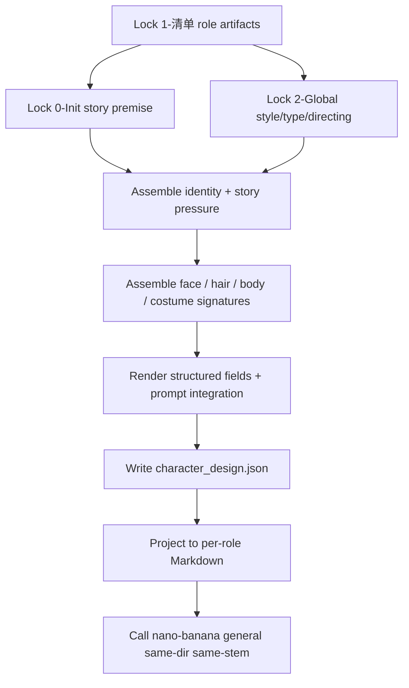
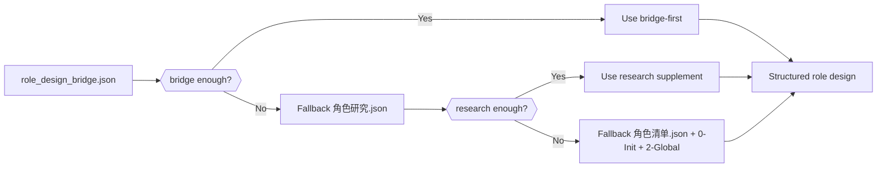
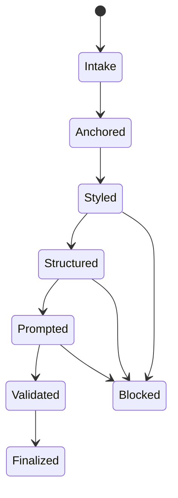

# aigc 4-Design / 2-设计 / 角色

## Context Loading Contract

- 每次调用本技能时，必须同时加载同目录 `CONTEXT.md` 作为预加载上下文。
- 若同目录 `CONTEXT.md` 缺失，应先补齐最小知识库骨架，或向用户明确报告阻塞；不得在未检查该上下文的情况下执行技能。
- 冲突优先级：用户显式请求 > 仓库/全局 `AGENTS.md` > 本 `SKILL.md` > 同目录 `CONTEXT.md`。

## 概述

`4-Design/2-设计/角色` 是当前 `aigc` 技能树里角色主体设计的统一入口。

它承接：

- `4-Design/角色/1-清单/第N集/*.json`
- `0-Init/*.yaml`
- `2-Global/*.md`

并输出：

1. `character_design.json`
2. `[角色名].md`
3. `[角色名].<ext>`（nano-banana general 单主体图片）
4. `_manifest.json`

本技能不再拆成“面部 / 全身 / 服装”三条独立链。它要求在同一份结构化设计稿里完成角色身份、人物戏剧压力、面部、发型、身形、服装、构图摄影与最终 prompt 的统一收束。

## Parent Positioning

- 当前 skill 是 `4-Design/2-设计` 下的角色 leaf。
- 上游对象识别真源属于 `1-清单/角色`。
- 项目题材、风格和导演意图真源属于 `0-Init` 与 `2-Global`。
- 本技能只负责把这些上游信息压成可直接供 `3-面板/角色` 与后续图像阶段消费的角色设计真源。

本技能不拥有：

- 重写 `1-清单` 对象池
- 越权改写 `0-Init` 北极星或 `2-Global` 风格总线
- 用 per-role Markdown 冒充 machine-first canonical truth

## Shared Canonical Sources (Mandatory)

- `.agents/skills/aigc/4-Design/2-设计/_shared/design-input-contract.md`
- `.agents/skills/aigc/4-Design/2-设计/_shared/design-output-contract.md`
- `.agents/skills/aigc/4-Design/2-设计/_shared/design-slot-review-contract.md`
- `.agents/skills/aigc/_shared/council-runtime/module-spec.md`
- `.agents/skills/aigc/4-Design/2-设计/_shared/subagent-supervision-contract.md`
- `.agents/skills/aigc/4-Design/1-清单/角色/SKILL.md`
- `references/character-design-assembly.md`
- `templates/character_masterprompt.structured.v2.md`

真源分工：

- 本 `SKILL.md`
  - 角色设计 leaf 的输入合同、思行网络、字段通过门与输出契约
- `_shared/design-input-contract.md`
  - `1-清单 + 0-Init + 2-Global` 的上游输入口径真源
- `_shared/design-output-contract.md`
  - `global_style_prefix / full_generation_prompt / same-dir same-stem auto image` 的共享输出真源
- `_shared/design-slot-review-contract.md`
  - 当前轮 `character_design.json + [角色名].md + _manifest.json` 应如何解析成 `ROLE-BUNDLE-*` 的共享评审与返工真源
- `references/character-design-assembly.md`
  - bridge-first 装配、文化原型保守模式、输出映射细则
- `templates/character_masterprompt.structured.v2.md`
  - 单角色 Markdown projection 的固定模板真源
- `scripts/build_character_design_packets.py`
  - 角色 `1-清单` 三真源到 `character_design.json + [角色名].md` 的唯一批量渲染入口；必须从模板填槽生成 Markdown，并负责对接共享 auto-image guard。
- `scripts/run_character_design_pipeline.py`
  - 当前 leaf 的统一执行入口；默认调用 builder、validator 与 auto-image fast path。
- `scripts/validate_character_design_projection.py`
  - 角色 projection 与 `character_design.json` 的硬校验入口。

## Reference Loading Guide

读取顺序固定为：

1. 根 `AGENTS.md`
2. `.agents/skills/aigc/SKILL.md + CONTEXT.md`
3. `.agents/skills/aigc/4-Design/SKILL.md + CONTEXT.md`
4. `.agents/skills/aigc/4-Design/2-设计/SKILL.md + CONTEXT.md`
5. `.agents/skills/aigc/4-Design/2-设计/_shared/design-input-contract.md`
6. `.agents/skills/aigc/4-Design/2-设计/_shared/design-output-contract.md`
7. `.agents/skills/aigc/4-Design/2-设计/_shared/design-slot-review-contract.md`
8. `.agents/skills/aigc/_shared/council-runtime/module-spec.md`
9. `.agents/skills/aigc/4-Design/2-设计/_shared/subagent-supervision-contract.md`
10. 本 `SKILL.md + CONTEXT.md`
11. `references/character-design-assembly.md`
12. `templates/character_masterprompt.structured.v2.md`
13. `projects/aigc/<项目名>/4-Design/角色/1-清单/第N集/role_design_bridge.json`（若存在）
14. `projects/aigc/<项目名>/4-Design/角色/1-清单/第N集/角色研究.json`（若存在）
15. `projects/aigc/<项目名>/4-Design/角色/1-清单/第N集/角色清单.json`
16. `projects/aigc/<项目名>/0-Init/{north_star,init_handoff,story-source-manifest}.yaml`
17. `projects/aigc/<项目名>/2-Global/全局风格.md`
18. `projects/aigc/<项目名>/2-Global/全集类型元素.md`
19. `projects/aigc/<项目名>/2-Global/导演意图.md`
20. `projects/aigc/<项目名>/team.yaml`（若存在）

## Executable Entrypoints

默认批量生成：

```bash
python3 .agents/skills/aigc/4-Design/2-设计/角色/scripts/run_character_design_pipeline.py \
  --catalog "projects/aigc/<项目名>/4-Design/角色/1-清单/第N集/角色清单.json"
```

默认投影校验：

```bash
python3 .agents/skills/aigc/4-Design/2-设计/角色/scripts/validate_character_design_projection.py \
  --output-dir "projects/aigc/<项目名>/4-Design/角色/2-设计/第N集"
```

脚本硬规则：

1. `run_character_design_pipeline.py` 必须串联 builder、validator 与共享 auto-image guard。
2. `build_character_design_packets.py` 必须读取 `templates/character_masterprompt.structured.v2.md` 并填槽生成 Markdown。
3. `validate_character_design_projection.py` 必须在当前轮结束前通过；失败时不得把输出交给 `3-面板/角色`。

## Business Requirement Analysis Contract (Mandatory)

| analysis_slot | 当前结论 |
| --- | --- |
| `business_goal` | 把角色对象池、角色研究/bridge、项目北极星与项目级风格/类型/导演意图，收束成 machine-first 的角色设计真源，供 `3-面板/角色` 与后续图像阶段直接消费。 |
| `business_object` | `projects/aigc/<项目名>/4-Design/角色/1-清单/第N集/*.json`、`projects/aigc/<项目名>/0-Init/*.yaml`、`projects/aigc/<项目名>/2-Global/*.md`、`projects/aigc/<项目名>/4-Design/角色/2-设计/第N集/character_design.json`。 |
| `constraint_profile` | 对象主键只来自 `1-清单`；风格骨架优先 `2-Global/全局风格`；题材与 anti-goals 优先 `0-Init`；不得把旧式单行 prompt 当成本阶段唯一交付。 |
| `success_criteria` | 每个角色都有稳定 `role_id / costume_state / structured_fields / prompt整合 / quality_flags / source_trace`，并且 Markdown projection 与结构化真源一致。 |
| `non_goals` | 不重写上游 list truth；不直接生成 layout panel；不越权把角色设计拆回多条子链。 |
| `complexity_source` | 角色设计既要吃对象池 JSON，又要吃项目级北极星与全局风格，还要保持 per-role Markdown、结构化 JSON 和下游 panel handoff 三者同源。 |
| `topology_fit` | 固定为“锁输入 -> 角色锚与风格骨架并行装配 -> 人物结构化收束 -> prompt整合 -> JSON/Markdown 汇流校验”。 |
| `step_strategy` | 角色 leaf 用单技能思行网络完成；细粒度装配与文化原型保守模式下沉到 `references/character-design-assembly.md`。 |

## Total Input Contract (Mandatory)

### 必需输入

- `projects/aigc/<项目名>/4-Design/角色/1-清单/第N集/角色清单.json`

### 强烈建议输入

- `projects/aigc/<项目名>/4-Design/角色/1-清单/第N集/role_design_bridge.json`
- `projects/aigc/<项目名>/4-Design/角色/1-清单/第N集/角色研究.json`
- `projects/aigc/<项目名>/0-Init/north_star.yaml`
- `projects/aigc/<项目名>/0-Init/init_handoff.yaml`
- `projects/aigc/<项目名>/0-Init/story-source-manifest.yaml`
- `projects/aigc/<项目名>/2-Global/全局风格.md`
- `projects/aigc/<项目名>/2-Global/全集类型元素.md`
- `projects/aigc/<项目名>/2-Global/导演意图.md`

### 可选输入

- `projects/aigc/<项目名>/2-Global/分组类型元素.md`
- 用户显式指定的 `selected_roles[]`

### 硬规则

1. bridge-first：先读 `role_design_bridge.json`，再退 `角色研究.json`，最后才退 `角色清单.json`。
2. `north_star.yaml` 负责故事核与 anti-goals，不负责逐角色服装细节。
3. `全局风格.md` 负责 Style Backbone，不负责对象主键。
4. `导演意图.md` 负责导演偏置与观众注意焦点，不负责角色身份判定。
5. 缺证据时允许 `TBD / manual_review_required`，不得臆造。

## Output Contract (Mandatory)

默认输出目录：

- `projects/aigc/<项目名>/4-Design/角色/2-设计/第N集/`

默认交付物：

1. `character_design.json`
2. `[角色名].md`
3. `[角色名].<ext>`
4. `_manifest.json`

可选工作侧车：

- `projects/aigc/<项目名>/4-Design/角色/2-设计/thinking/第N集/[角色名].md`

输出硬约束：

1. `character_design.json` 是 machine-first canonical truth。
2. `[角色名].md` 必须按模板文件输出 Markdown 三段式：`物语 -> 解构 -> prompt整合`。
3. `_manifest.json` 只记录覆盖率、路径、角色统计与兼容说明。
4. thinking sidecar 不得被下游 `3-面板` 当作第一输入。
5. `full_generation_prompt` 必须等于统一 `global_style_prefix + prompt_integration`，并作为 nano-banana general 的唯一 prompt 入参。
6. `[角色名].<ext>` 必须由同目录 `[角色名].md` 触发生成，文件 stem 与 Markdown 一致。
7. 每轮落盘后必须运行 `scripts/validate_character_design_projection.py --output-dir <角色2-设计/第N集>`；校验失败时不得把 `_manifest.json.status` 或阶段验收写成完成。

## Visual Maps (Mermaid)







## Field Master

| field_id | output_position | requirement | source_layers | owner_step | quality_dimension | fail_code |
| --- | --- | --- | --- | --- | --- | --- |
| `FIELD-CHAR-01` | `roles[].role_id / role_name / role_tier / costume_state` | 角色身份、层级与服装状态稳定可追溯 | `角色清单.json` | `S2` | identity stability | `FAIL-ROLE-ANCHOR` |
| `FIELD-CHAR-02` | `roles[].story_premise / identity_hook / narrative_tension` | 把北极星、角色 bridge 与导演意图压成单角色叙事支点 | `role_design_bridge.json`、`north_star.yaml`、`导演意图.md` | `S3` | story pressure fit | `FAIL-STORY-PIVOT` |
| `FIELD-CHAR-03` | `roles[].style_backbone / character_style / design_guardrails` | 全局风格与题材边界被稳定转译成角色设计语言 | `全局风格.md`、`类型元素.md`、`init_handoff.yaml` | `S3` | style stability | `FAIL-STYLE-LOCK` |
| `FIELD-CHAR-04` | `roles[].structured_fields.face_* / hair_* / body_*` | 面部、发型、身形细节是结构化可执行字段，不退化成空形容词 | bridge / research / role list | `S4` | visual granularity | `FAIL-VISUAL-GRANULARITY` |
| `FIELD-CHAR-05` | `roles[].structured_fields.costume_*` | 服装制式、材质、配色与连续性被稳定落盘 | `costume_bridge`、`角色研究.json`、`north_star.yaml` | `S5` | costume translation | `FAIL-COSTUME-TRANSLATION` |
| `FIELD-CHAR-06` | `roles[].structured_fields.camera_* / midjourney_params` | 构图与摄影参数为角色定妆图服务，不漂成 layout board | `导演意图.md`、`prompt_ready`、`类型元素.md` | `S6` | camera executability | `FAIL-CAMERA-BLOCK` |
| `FIELD-CHAR-07` | `roles[].prompt_integration / final_prompt` | 最终 prompt 吃到身份钩子、差异轴和风格骨架 | `FIELD-CHAR-02~06` 汇流 | `S7` | prompt coherence | `FAIL-PROMPT-INTEGRATION` |
| `FIELD-CHAR-08` | `character_design.json.roles[]` | machine-first canonical truth 完整，含 `quality_flags / source_trace` | 全链输出 | `S8` | structured truth completeness | `FAIL-STRUCTURED-TRUTH` |
| `FIELD-CHAR-09` | `[角色名].md` | Markdown projection 与模板绑定且和 JSON 同密度 | 模板 + `FIELD-CHAR-08` | `S8` | human projection fidelity | `FAIL-MARKDOWN-PROJECTION` |
| `FIELD-CHAR-10` | `_manifest.json` | 审计、路径与统计清楚，且不冒充业务真源 | 全链输出 | `S9` | audit closure | `FAIL-MANIFEST-DRIFT` |
| `FIELD-CHAR-11` | `[角色名].<ext> / _manifest.json.auto_image` | 自动生图使用含全局风格前缀的完整 prompt，默认后台批量并发提交，图片与设计文件同目录同 stem | `design-output-contract.md`、`image-generation-execution-contract.md`、`全局风格.md`、`[角色名].md` | `S10` | auto image completeness | `FAIL-CHAR-AUTO-IMAGE` |
| `FIELD-CHAR-12` | `prompt_integration / full_generation_prompt / auto_image preflight` | 角色图必须是纯色背景定妆参照；场景、建筑、房间、街道、道具环境或其他人物只能作为离屏叙事压力，不得进入画面 | `design-output-contract.md`、`character-design-assembly.md`、`validate_character_design_projection.py` | `S7` / `S10` | reference cleanliness | `FAIL-CHAR-REFERENCE-CONTAMINATION` |
| `FIELD-CHAR-13` | current-round outputs / supervision review | 输出后必须读取项目根 `team.yaml`，按共享收尾合同裁定当前轮 closeout、reviewer 顺序与角色设计型补选，并先把当前轮角色输出解析成 `ROLE-BUNDLE-*`，再只 patch 当前轮角色文件 | `team.yaml`、`council-runtime`、`subagent-supervision-contract.md`、`design-slot-review-contract.md` | `S11` | council closeout | `FAIL-CHAR-SUPERVISION-REVIEW` |

## Thought Pass Map

| step_id | focus | actions | evidence | route_out | rework_entry |
| --- | --- | --- | --- | --- | --- |
| `S1` | 锁输入根与 scope | 读取 `1-清单/*.json + 0-Init + 2-Global` | `intake_note` | `S2` | `S1` |
| `S2` | 锁角色锚与服装状态 | 读取 `角色清单.json` 锁 `role_id / canonical_name / role_tier / costume_state` | `role_anchor_note` | `S3` | `S2` |
| `S3` | 装配故事支点与风格骨架 | 组合 `bridge + north_star + 2-Global` | `story_style_packet` | `S4` | `S3` |
| `S4` | 收束面部/发型/身形 | 生成结构化人物外观字段 | `visual_packet` | `S5` | `S4` |
| `S5` | 收束服装与连续性 | 生成服装字段与连续性锚点 | `costume_packet` | `S6` | `S5` |
| `S6` | 收束构图摄影与纯色背景定妆视角 | 生成 camera block 与参数；先判定这是角色 reference asset，不是剧情剧照、场景板或多人物关系图 | `camera_packet + character_reference_note` | `S7` | `S6` |
| `S7` | prompt整合与背景洁净门禁 | 生成最终 prompt 与 quality flags，注入 `solid color background / no scene background elements`，复核禁止建筑、房间、街道、道具环境、叙事场景和其他人物 | `prompt_packet + reference_cleanliness_note` | `S8` | `S7` |
| `S8` | JSON/Markdown 汇流 | 写 `character_design.json + [角色名].md` | `design_truth_packet` | `S9` | `S8` |
| `S9` | 审计与落盘 | 写 `_manifest.json`，验证 coverage | `manifest_packet` | `S10` | `S8-S9` |
| `S10` | 单主体自动生图 | 读取 `[角色名].md` 与全局风格前缀；自动生图前复验纯色背景锚句，再默认后台批量并发提交 nano-banana general，同目录同名图片由后续验收复核 | `auto_image_packet + reference_cleanliness_note` | `S11` | `S7-S10` |
| `S11` | 输出后 subagents 监制强化 | 读取 `team.yaml` 与共享收尾合同，裁定当前轮 closeout 是否可进入，先把当前轮角色输出解析成 `ROLE-BUNDLE-01~04`，再解析显式 reviewer、可选 `4-Design review gate members` 与角色设计型补选，真实启动 reviewer subagents 并回写当前轮文件 | `supervision_review_note + subagent_supervision_result` | `done` | `S7-S11` |

## Thinking-Action Node Contract (Mandatory)

| node_id | objective | inputs | actions | evidence | route_out | gate |
| --- | --- | --- | --- | --- | --- | --- |
| `N1-INTAKE` | 锁本轮角色设计输入 | `1-清单/*.json`、`0-Init`、`2-Global` | 校验输入存在性、episode 与 selected_roles | `intake_note` | `N2` | 缺 `角色清单.json` 不得继续 |
| `N2-ANCHOR` | 锁角色锚与服装状态 | `角色清单.json` | 确认 `role_id / canonical_name / role_tier / costume_state` | `role_anchor_note` | `N3` | 主键不得漂移 |
| `N3-STORY-STYLE` | 组合故事支点与风格骨架 | bridge / research / `0-Init` / `2-Global` | 生成 `story_premise / identity_hook / style_backbone / character_style` | `story_style_packet` | `N4` | 不得把故事核和风格核混写 |
| `N4-VISUAL` | 收束人物本体 | `appearance_bridge` 等 | 生成面部、发型、身形结构化字段 | `visual_packet` | `N5` | 不得退化成空形容词 |
| `N5-COSTUME` | 收束服装系统 | `costume_bridge` 等 | 生成服装制式、材质、配色与连续性锚点 | `costume_packet` | `N6` | 缺证据时显式降级 |
| `N6-CAMERA` | 收束角色定妆摄影块与纯色背景视角 | `设计元素`、`类型元素` | 生成 camera block 与参数；确认这是单角色定妆参照图，不是剧情剧照、场景板、多人物关系图或带道具环境的氛围图 | `camera_packet + character_reference_note` | `N7` | 不得写成多视图设定板；不得召回场景背景 |
| `N7-PROMPT` | 生成最终 prompt 整合与背景洁净门禁 | `N3~N6`、`design-output-contract.md` | 生成 `prompt_integration / final_prompt / quality_flags`；强制包含 `solid color background` 与 `no scene background elements`；禁止建筑、房间、街道、道具环境、叙事场景或其他人物入画 | `prompt_packet + reference_cleanliness_note` | `N8` | prompt 不得与结构化字段脱节；缺纯色背景锚句或有背景污染必须返工 |
| `N8-PROJECTION` | 写结构化真源与人读投影 | 模板 + `prompt_packet` | 生成 `character_design.json` 和 `[角色名].md` | `design_truth_packet` | `N9` | Markdown 不得成为第二真源 |
| `N9-VALIDATE` | 一次性收束与审计 | 全链输出 | 写 `_manifest.json` 并验证 coverage | `manifest_packet` | `N10` | 只允许在图片步骤完成后结案 |
| `N10-AUTO-IMAGE` | 生成单角色概念图 | `[角色名].md`、`全局风格.md`、`prompt_integration` | 生成 `full_generation_prompt`；复验纯色背景锚句与背景污染禁令后默认后台批量并发提交 nano-banana general，目标输出 `[角色名].<ext>` | `auto_image_packet + reference_cleanliness_note` | `N11` | 不得只传局部 prompt；后台提交不得伪装为已产图；图片必须同目录同名；纯色背景门禁失败不得生图 |
| `N11-SUPERVISION-REVIEW` | 输出后监制强化 | 当前轮 `character_design.json + [角色名].md + _manifest.json`、`team.yaml`、`subagent-supervision-contract.md`、`design-slot-review-contract.md` | 按共享合同确认当前轮 closeout 可进入；先把当前轮角色输出解析成 `ROLE-BUNDLE-01~04`；显式 reviewer 先取 `roles.supervision.members`，若 `4-Design` final-stage gate 存在则并入 `roles.review.members`，不足再补入 `张叔平 + 叶锦添`，并按 `use_subagents_by_default` 真实启动 reviewer subagents；主代理汇流后只 patch 当前轮角色输出 | `supervision_review_note + subagent_supervision_result` | `done` | 不得把 `source_skill_refs` 误当 runtime 授权或 reviewer skill；`use_subagents_by_default=true` 时不得用本地模拟冒充 council |

## Pass Table

| field_id | pass_condition | fail_code | rework_entry |
| --- | --- | --- | --- |
| `FIELD-CHAR-01` | 角色主键、层级与服装状态稳定 | `FAIL-ROLE-ANCHOR` | `S2` |
| `FIELD-CHAR-02` | 每个角色都有明确的 story pivot | `FAIL-STORY-PIVOT` | `S3` |
| `FIELD-CHAR-03` | Style Backbone 与 Character Style 稳定且不混写 | `FAIL-STYLE-LOCK` | `S3` |
| `FIELD-CHAR-04` | 面/发/身字段具备结构化颗粒度 | `FAIL-VISUAL-GRANULARITY` | `S4` |
| `FIELD-CHAR-05` | 服装系统与连续性锚点稳定 | `FAIL-COSTUME-TRANSLATION` | `S5` |
| `FIELD-CHAR-06` | 构图摄影块可执行 | `FAIL-CAMERA-BLOCK` | `S6` |
| `FIELD-CHAR-07` | prompt整合与上游字段同源 | `FAIL-PROMPT-INTEGRATION` | `S7` |
| `FIELD-CHAR-08` | `character_design.json` 完整且 machine-first | `FAIL-STRUCTURED-TRUTH` | `S8` |
| `FIELD-CHAR-09` | `[角色名].md` 与模板和 JSON 同步 | `FAIL-MARKDOWN-PROJECTION` | `S8` |
| `FIELD-CHAR-10` | `_manifest.json` 只做审计，不冒充业务真源 | `FAIL-MANIFEST-DRIFT` | `S9` |
| `FIELD-CHAR-11` | 默认提交态含 `background_submitted/request_batch_path/background_log`；最终验收时 `[角色名].<ext>` 已由 `full_generation_prompt` 生成，且 stem 与 `[角色名].md` 一致 | `FAIL-CHAR-AUTO-IMAGE` | `S10` |
| `FIELD-CHAR-12` | `Integrated prompt` 含 `solid color background / no scene background elements`，且不正向要求建筑、房间、街道、道具环境、叙事场景或其他人物 | `FAIL-CHAR-REFERENCE-CONTAMINATION` | `S7` |
| `FIELD-CHAR-13` | `team.yaml` 已读取，当前轮 closeout 已按共享合同完成 refine / gate 分层裁定，reviewer 解析遵循共享合同，且在允许时真实启动 reviewer subagents 完成角色输出收尾 | `FAIL-CHAR-SUPERVISION-REVIEW` | `S11` |

## Template Binding Contract

1. 单角色 Markdown projection 必须绑定 `templates/character_masterprompt.structured.v2.md`。
2. 模板顺序固定：
   - `物语`
   - `解构`
   - `prompt整合`
3. `prompt整合` 才是下游可直接消费的最终 prompt 段；不得把整份 Markdown 当成图像输入。
4. `prompt整合` 的语义是对同一模板文件中其上方全部内容做英文整合，必须覆盖 `解构` 下的身份、叙事压力、角色设计、服装、姿态、材质、表演状态与镜头信息，并形成可直接生图的完整 brief。
5. `Integrated prompt:` 正文必须完全为英文 ASCII 文本，目标约 2000 UTF-8 bytes，硬门范围为 1800-2200 bytes；不得输出中文字段拼接、列表堆叠、过短主体提示词或超长资料压缩稿。
6. 角色设计图片必须固定为纯色背景参照图；`Integrated prompt` 必须包含 `solid color background` 与 `no scene background elements`，且不得要求建筑、房间、街道、道具环境、叙事场景或其他人物入画，避免后续参照图背景污染。
7. `prompt整合` 内必须显式包含 `Global style prefix: [global_style_prefix]`；该英文前缀只能从 `projects/aigc/<项目名>/2-Global/全局风格.md` 的 `- 全局风格：` 字段转写，不得混入其他章节。
8. 模板结构必须直接对齐 AIGC-ZEN-VOID 参照模板；当前仓只允许在 `prompt整合` 内追加全局风格前缀，不得重排上游字段。
9. 若 Markdown 缺少 `Identity & Story Pressure / Visual Drivers / Detailed Character Design / Detailed Costume Design / Cinematography` 等模板块，或出现旧式 `**full_generation_prompt**` 独立块，必须视为 `FAIL-MARKDOWN-PROJECTION`。

## Detailed Assembly Rules

详细 bridge-first 装配、文化原型保守模式与输出映射规则，下沉到 `references/character-design-assembly.md`。

本处只保留硬门：

1. 先锁对象，再锁故事支点，再锁风格骨架。
2. `role_design_bridge.json` 缺失时允许回退，但必须显式打 `bridge_status`。
3. 强文化原型角色缺证据时，必须走保守模式，不得泛词拼装。
4. per-role Markdown 是 projection，不是 canonical truth。
5. 当前轮 review target 必须先按 `_shared/design-slot-review-contract.md` 解析到 `ROLE-BUNDLE-*`，不得只停留在文件名级别。

## One-Shot Output Contract (Mandatory)

本技能最终只允许一次性收束为：

1. `character_design.json`
2. `[角色名].md`
3. `[角色名].<ext>`
4. `_manifest.json`

thinking sidecar 只作为过程证据，不进入最终 canonical 交付集合。

当前轮监制强化默认围绕以上文件及其对应 `ROLE-BUNDLE-*` 做 patch，不再以“整个文件的整体感觉”作为唯一定位方式。

## Root-Cause Execution Contract (Mandatory)

当 `角色/2-设计` 出现以下问题时，必须先修源层而不是补单次角色文案：

- `prompt整合` 漂成单行堆词，丢失故事支点与风格骨架
- Markdown projection 与 `character_design.json` 内容不一致
- style 写成空泛全局风格复述
- `[角色名].md` 已生成但没有同目录同名图片
- nano-banana prompt 缺失 `global_style_prefix`
- cultural archetype 角色被误画成错误近邻原型
- 仍按旧式单文件 prompt 口径交付
- 把 `4-Design` 的 stage-end refine 与 final-stage review gate 混成同一条权限线
- 角色输出已落盘，但没有读取项目根 `team.yaml` 做监制强化
- 把 `roles.supervision.source_skill_refs` 误当 reviewer skill，导致 reviewer 选成阶段合同而非 `.agents/skills/team/` 技能
- `runtime_policy.use_subagents_by_default == true` 时，仍用本地顺序模拟冒充角色 council

固定链路：

`Symptom -> Direct Technical Cause -> Rule Source -> Meta Rule Source -> Fix Landing Points`

优先检查：

1. `_shared/design-input-contract.md`
2. `_shared/design-output-contract.md`
3. `references/character-design-assembly.md`
4. 本 `SKILL.md` 的 `Field Master / Pass Table`
5. `templates/character_masterprompt.structured.v2.md`
6. `scripts/validate_character_design_projection.py`
7. `.agents/skills/aigc/_shared/council-runtime/module-spec.md`
8. `.agents/skills/aigc/4-Design/2-设计/_shared/subagent-supervision-contract.md`
9. `projects/aigc/<项目名>/team.yaml`

对用户的闭环输出固定为：

1. 根因位置
2. 立即修复
3. 系统预防修复

## Subagents 监制强化收尾（Mandatory）

1. `S10/N10` 完成后不得直接结案，必须进入 `S11/N11`。
2. reviewer precedence、manual override、structured summary 与 subagent gate 全部以 `_shared/subagent-supervision-contract.md` 为准；本 leaf 只声明角色型补选差异。
3. 当前轮输出的 design supplement 为 `张叔平 -> 叶锦添`。
4. 监制强化只允许 patch 当前轮 `character_design.json / [角色名].md / _manifest.json`，并按需补阶段 `validation-report.md`；不得另起 reviewer 平行总稿。

## Completion Criteria

1. 已明确 `1-清单/*.json + 0-Init + 2-Global` 的上游输入口径。
2. 已把角色设计收束为单 leaf，而不是拆成多条角色子链。
3. 已固定 `character_design.json` 为 machine-first truth。
4. 已固定 `[角色名].md` 为模板投影而不是第二真源。
5. 已给出默认 `3-面板/角色` handoff 口径。
6. 已使用含统一全局风格前缀的 `full_generation_prompt` 默认后台批量并发提交 `[角色名].<ext>` 请求；最终验收时图片同 stem 存在。
7. `validate_character_design_projection.py` 已通过，且 `_manifest.json.template_validation.status` 非 `failed`。
8. 已按 `team.yaml + _shared/subagent-supervision-contract.md` 完成当前轮角色输出的 `subagents` 监制强化，并把有效建议回写到当前轮文件。
