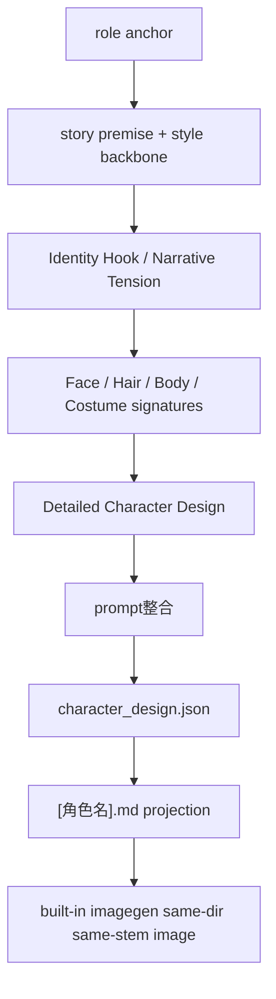

# Character Design Assembly Reference

## Purpose

- 本文件承接 `4-Design/2-设计/角色/SKILL.md` 下沉的细粒度装配规则。
- 只定义“如何从 `1-清单/*.json + 0-Init + 2-Global` 收束成单角色结构化设计稿”。

## Input Priority

| priority | source | use |
| --- | --- | --- |
| P0 | `role_design_bridge.json` | 直接消费 `role_identity / appearance_bridge / costume_bridge / continuity_bridge / prompt_ready / quality_flags` |
| P1 | `角色研究.json` | 当 bridge 缺失或局部稀疏时，补研究句子与 display/profile 语义 |
| P2 | `角色清单.json` | 锁 `role_id / canonical_name / role_tier / costume_state / group_id / shot_id` |
| P3 | `0-Init/*.yaml` | 锁故事核、情绪内核、anti-goals、source type |
| P4 | `2-Global/*.md` | 锁 Style Backbone、类型走廊、导演意图 |

## Bridge-First Rules

1. `appearance_bridge` 优先决定 `Face Signature / Hair Signature / Silhouette & Build`。
2. `costume_bridge` 优先决定 `Costume System / Detailed Costume Design`。
3. `continuity_bridge` 优先决定 `Accessories & Continuity / Design Guardrails`。
4. `prompt_ready` 优先决定 `Identity Hook / Narrative Tension / prompt整合` 的前半段。
5. 若 bridge 中对应槽位缺失，才回退研究稿；研究稿也缺失时，退回 `角色清单.json` 和上游故事/风格源。

## Cultural Archetype Trigger

命中以下任一信号时，必须进入文化原型保守模式：

- `role_identity` 或 `canonical_name` 明示神祇、阴差鬼使、宗教人物、戏曲神怪、历史名将
- `costume_bridge` 含强朝代/宗教/神话制式词
- `north_star` / `2-Global` 指向强民俗、历史、宗教题材

进入后要求：

1. 不允许用泛“东方奇幻”词替代具体制式。
2. 参考项不足时，显式写 `TBD` 或 `manual_review_required`。
3. `反向禁忌` 必须写清最容易被误画成什么近邻原型。

## Output Composition

## Canonical Output Rules

1. `character_design.json` 是 machine-first canonical truth。
2. `[角色名].md` 必须镜像 `character_design.json.roles[]` 中同名角色的结构化内容。
3. `thinking` sidecar 只保留推理证据，不得被 `3-面板` 当作第一输入。
4. `_manifest.json` 只记录覆盖率、路径和统计，不承载业务字段真相。
5. `prompt整合` 必须按模板拆出 `Global style prefix` 与 `Integrated prompt`。
6. `full_generation_prompt` 必须是 `prompt整合` 的完整英文段落：先把 `2-Global/全局风格.md` 的 `- 全局风格：` 字段转写成英文风格前缀，再用约 2000 UTF-8 bytes 的英文自然语句整合角色模板上方全部内容，尤其覆盖 `解构` 中的身份、服装、姿态、材质、表演状态与镜头信息；`Integrated prompt` 正文必须完全为英文 ASCII 文本。
7. 角色 prompt 必须固定为纯色背景参照图，包含 `solid color background` 与 `no scene background elements`，不得加入建筑、街道、房间、叙事场景、道具环境或其他人物。

## Output Mapping

| canonical JSON slot | Markdown projection | note |
| --- | --- | --- |
| `roles[].prompt_integration` | `prompt整合 / Integrated prompt` | 约 2000 bytes 的英文自然语言整合 prompt |
| `roles[].global_style_prefix` | `prompt整合 / Global style prefix` | 来自 `2-Global/全局风格.md` 的 `- 全局风格：` 字段的英文转写 |
| `roles[].full_generation_prompt` | `prompt整合` 整段 | provider-ready final prompt，必须含英文全局风格前缀 |
| `roles[].final_prompt` | `character_design.json` | legacy alias, should equal `full_generation_prompt` |
