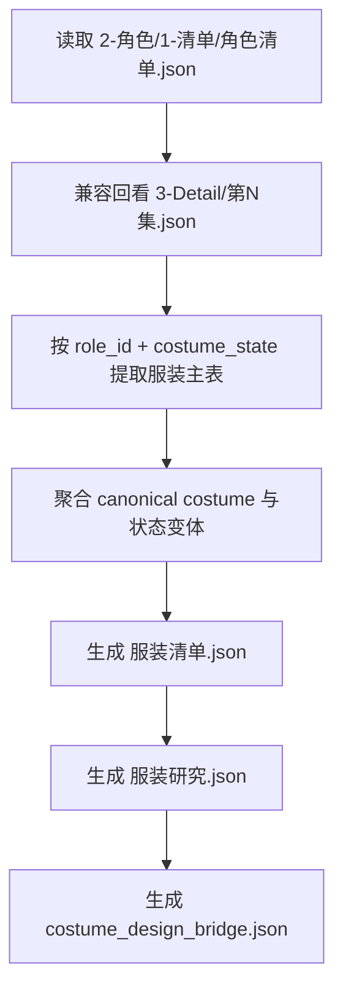

# 4-Design / 3-服装 / 1-清单

## 概述

`1-清单` 是 `4-Design/3-服装` 的首个可执行叶子子技能。

它不重新定义角色身份，也不回头吞掉 `2-角色/1-清单` 的 canonical truth。它的职责是把上游已经稳定的 `角色清单.json` 中的穿搭线索，结合 `3-Detail/第N集.json` 或兼容 `3-Detail/第N集.json` 的镜头证据，整理成三份默认 JSON 主产物：

1. `服装清单.json`
2. `服装研究.json`
3. `costume_design_bridge.json`

## When to Use

- 需要从 `角色清单.json` 提取当前集的服装对象池。
- 需要把角色穿搭主线索收束成可聚合的 canonical costume。
- 需要为后续 `4-Design/3-服装/2-设计` 或 `5-Image` 提供机读的服装桥接字段。

## When Not to Use

- 当前任务仍在抽角色 canonical identity，应先回到 `2-角色/1-清单`。
- 当前任务是直接出图或做视频请求，而不是先做服装对象池。
- 需要补场景或道具清单，应进入对应 sibling 子路径。

## 子技能边界

### `1-清单` 拥有

- `角色清单 -> 服装提取 -> 服装聚合` 的第一层合同。
- `服装清单 / 服装研究 / 设计桥接` 三份 JSON 主产物。
- 运行时路径推断：优先消费 `2-角色/1-清单/角色清单.json`，并兼容回看 `编导 / 3-Detail` 证据。

### `1-清单` 不拥有

- 改写 `角色清单.json` 的角色 canonical identity。
- 直接生成图像或视频请求。
- 发明上游未提供的新角色或新剧情服装事实。

## Visual Maps

## Canonical Module References

| 模块 | 作用 | 真源文件 |
| --- | --- | --- |
| 执行流程 | 输入、输出、命令与默认路径 | `references/execution-flow.md` |
| 类型策略 | 抽取缺口、状态归一与保守回退 | `references/type-strategies.md` |
| 输出契约 | 三份 JSON 结构与落点 | `references/output-template.md` |

## Execution Summary

- 第一输入根固定为 `projects/<项目名>/4-Design/2-角色/1-清单/第N集/角色清单.json`。
- 证据补充固定优先读取 `projects/<项目名>/3-Detail/第N集.json`，兼容回退 `projects/<项目名>/3-Detail/第N集.json`。
- 默认输出根目录：`projects/<项目名>/4-Design/3-服装/1-清单/第N集/`
- 默认主产物固定为：
  - `服装清单.json`
  - `服装研究.json`
  - `costume_design_bridge.json`

## Output Summary

- canonical 目录：`projects/<项目名>/4-Design/3-服装/1-清单/第N集/`
- canonical 文件：
  - `服装清单.json`
  - `服装研究.json`
  - `costume_design_bridge.json`

## Field Master

| field_id | 输出位置/字段 | 内容要求 | 默认责任 Step | 质量维度 | 失败码 |
| --- | --- | --- | --- | --- | --- |
| FIELD-COSTUME-LIST-01 | 输入根 | 第一输入根固定为 `角色清单.json`，不能重新抢角色真源 | S1 | 真源稳定性 | FAIL-COSTUME-LIST-01 |
| FIELD-COSTUME-LIST-02 | 服装抽取 | 每个服装条目都能回链 `role_id + costume_state + evidence` | S2 | 抽取准确度 | FAIL-COSTUME-LIST-02 |
| FIELD-COSTUME-LIST-03 | 研究层 | `服装研究.json` 保留 silhouette / material / accessory / continuity 结论 | S3 | 研究完整性 | FAIL-COSTUME-LIST-03 |
| FIELD-COSTUME-LIST-04 | 设计桥接 | `costume_design_bridge.json` 产出可供 `2-设计` 继续消费的机读字段 | S4 | 桥接可执行性 | FAIL-COSTUME-LIST-04 |
| FIELD-COSTUME-LIST-05 | 输出契约 | 三份输出命名、路径与 manifest 口径稳定 | S5 | 落盘完整性 | FAIL-COSTUME-LIST-05 |

## Thought Pass Map

| step_id | 聚焦字段 | 核心问题 | 生成动作 | 未达标信号 |
| --- | --- | --- | --- | --- |
| S1 | FIELD-COSTUME-LIST-01 | 当前是不是服装对象池问题 | 锁定角色清单为第一输入根 | 回头重扫角色 identity |
| S2 | FIELD-COSTUME-LIST-02 | 服装条目能否按 `role_id + costume_state` 稳定聚合 | 写出 `服装清单.json` | 同一角色状态被拆成多套无依据服装 |
| S3 | FIELD-COSTUME-LIST-03 | 研究层是否足够支撑设计 | 写 silhouette/material/accessory/continuity 结论 | 研究层只有空泛审美词 |
| S4 | FIELD-COSTUME-LIST-04 | design bridge 是否可被 `2-设计` 直接消费 | 写 `prompt_anchor / layer_system / continuity_rules` | bridge 只有描述没有机读字段 |
| S5 | FIELD-COSTUME-LIST-05 | 输出命名与路径是否稳定 | 写三份 JSON 与 manifest | 文件名和目录漂移 |

## Pass Table

| field_id | Pass Standard | Fail Code | Rework Entry |
| --- | --- | --- | --- |
| FIELD-COSTUME-LIST-01 | 第一输入根固定为 `角色清单.json` | FAIL-COSTUME-LIST-01 | S1 |
| FIELD-COSTUME-LIST-02 | 所有服装条目都能回链角色、状态与证据 | FAIL-COSTUME-LIST-02 | S2 |
| FIELD-COSTUME-LIST-03 | 研究层含 silhouette/material/accessory/continuity | FAIL-COSTUME-LIST-03 | S3 |
| FIELD-COSTUME-LIST-04 | bridge 可直接进入 `2-设计` | FAIL-COSTUME-LIST-04 | S4 |
| FIELD-COSTUME-LIST-05 | 路径、命名与统计稳定 | FAIL-COSTUME-LIST-05 | S5 |

## Root-Cause Execution Contract (Mandatory)

当出现以下症状时，必须先修本子技能合同或脚本：

- `角色清单.json` 已有信息，但服装链仍按导演 JSON 重新抢角色提取权。
- `costume_state` 漂移，导致同一角色同一状态被拆成多个 costume。
- 研究层只有抽象词，没有 `layer_system / continuity_rules / accessory_system`。
- 输出目录或文件名和 `4-Design/3-服装/1-清单` 不一致。

必经链路：

`Symptom -> Direct Technical Cause -> Rule Source -> Meta Rule Source -> Fix Landing Points`

优先检查：

- `Rule Source`
  - `.agents/skills/aigc/4-Design/3-服装/1-清单/SKILL.md`
  - `.agents/skills/aigc/4-Design/3-服装/1-清单/CONTEXT.md`
  - `.agents/skills/aigc/4-Design/3-服装/1-清单/scripts/extract_costume_catalog.py`
- `Meta Rule Source`
  - `.agents/skills/aigc/4-Design/2-角色/1-清单/SKILL.md`
  - `.agents/skills/aigc/4-Design/SKILL.md`
  - 根 `AGENTS.md`

## Context Preload (Mandatory)

- 执行前先加载 `.agents/skills/aigc/SKILL.md + CONTEXT.md`
- 再加载 `.agents/skills/aigc/4-Design/3-服装/SKILL.md + CONTEXT.md`
- 强制读取 `projects/<项目名>/4-Design/2-角色/1-清单/第N集/角色清单.json`
- 再按需读取 `references/*.md`
