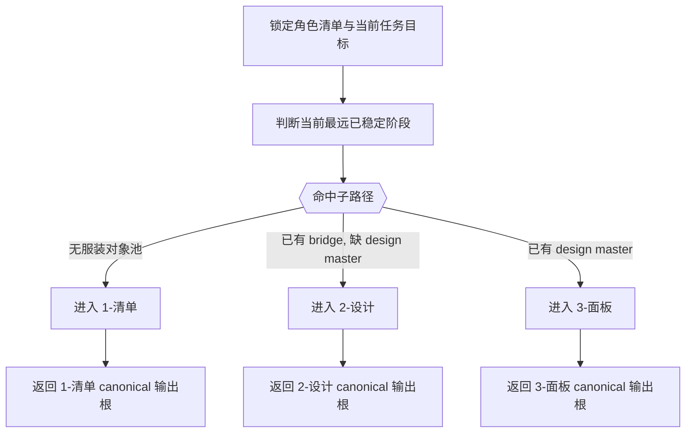
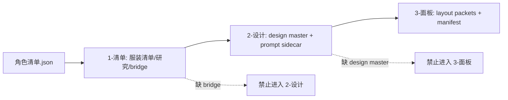
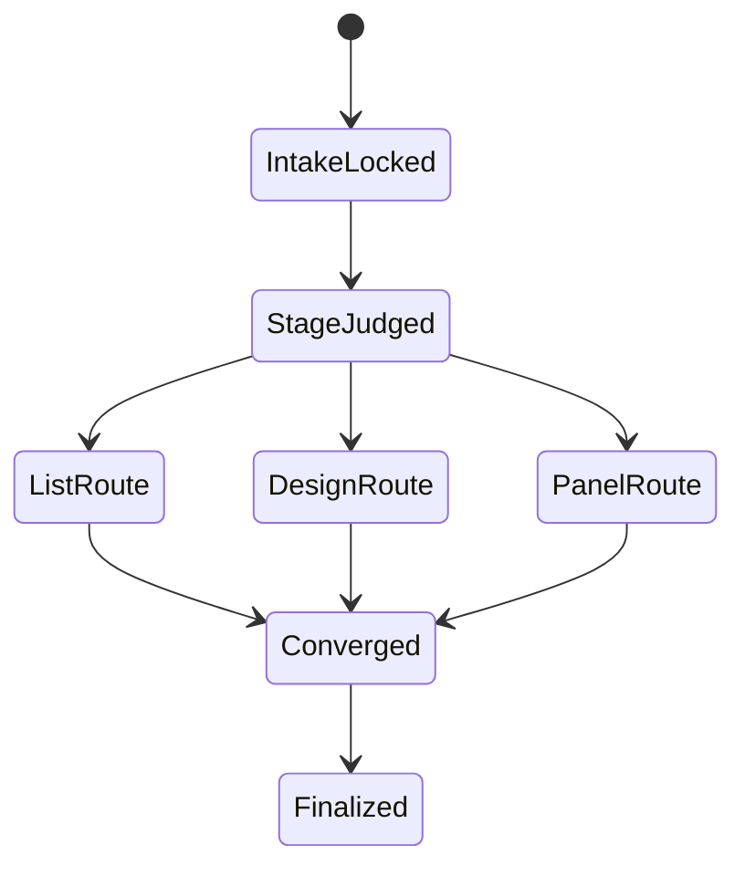
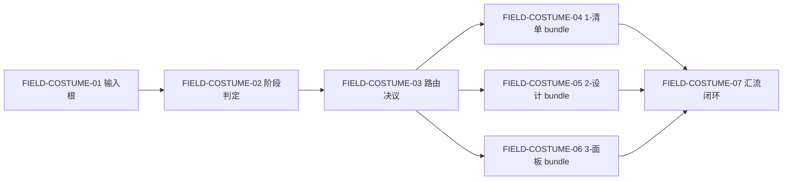

# aigc 4-Design / 3-服装

## 概述

`3-服装` 是 `4-Design` 阶段的服装类目父技能，负责把角色侧已锁定的穿搭事实继续沉淀为独立服装真源，并把任务稳定路由到：

1. `1-清单`
2. `2-设计`
3. `3-面板`

本轮重编排遵循两个原则：

- 内容和机制全量继承当前服装链既有配置：`角色清单 -> 服装清单/研究/bridge -> 服装设计 -> 服装面板`、`_shared/IO_CONTRACT.md`、team、runner、template、目录口径都保持不变。
- 表达方式改写为知行合一父技能：业务分析、总输入合同、父子路由、思行节点、汇流门和一次性输出全部内收在同一 `SKILL.md`。

## Skill Execution Rule (Mandatory)

`3-服装` 是父级路由技能，不直接替代三个子技能执行业务主产物，但它必须独占以下父级职责：

- 判断当前任务属于服装对象池、服装设计 synthesis 还是服装展示面板。
- 锁定当前轮唯一应进入的子路径，避免同一请求在 `1-清单 / 2-设计 / 3-面板` 之间漂移。
- 固定全链第一输入根来自 `2-角色/1-清单/角色清单.json`，后续子链按阶段接力。
- 统一返回当前命中的 canonical 输出根、下一入口和 triad closure。

子技能负责各自阶段的 canonical 写回；父技能不并行替子技能再维护第二份服装总稿。

## When to Use

- 需要判断服装链当前该先做 `1-清单`、`2-设计` 还是 `3-面板`。
- 需要把角色侧已稳定的穿搭线索升级为独立服装设计真源。
- 需要确保服装阶段所有产物稳定落到 `projects/<项目名>/4-Design/3-服装/`。

## When Not to Use

- 当前任务仍在抽角色 canonical identity，应先回到 `4-Design/2-角色`。
- 当前任务是场景或道具方向，应进入对应 sibling 类目。
- 当前任务已经进入 `5-Image / 6-Video` 的生成或投放执行，而不是先固化服装设计真源。

## Mode Selection

本技能只做父级路由，但当前轮必须锁定一种模式：

1. `route-to-list`
   - 缺 `costume_design_bridge.json`，先做 `1-清单`
2. `route-to-design`
   - bridge 已有，但缺 `服装设计.json`，或当前目标是 design synthesis
3. `route-to-panel`
   - design master 已有，当前目标是 layout / panel dossier

## Business Requirement Analysis Contract (Mandatory)

| analysis_slot | 当前结论 |
| --- | --- |
| `business_goal` | 把角色侧已锁定的服装事实稳定路由成 `清单 -> 设计 -> 面板` 三段服装真源链，并确保每一段只消费上一段已稳定的输入 |
| `business_object` | `角色清单.json`、episode director evidence、`1-清单` 三份 JSON、`2-设计` 设计主稿与 prompt sidecar、`3-面板` layout packet |
| `constraint_profile` | 不得重写角色 identity；不得让 prompt sidecar 反向污染 canonical facts；不得让 `3-面板` 回头重扫 `角色清单` 或导演 JSON；父技能只路由不造第二主稿 |
| `success_criteria` | 当前轮子路径唯一、输入根正确、上下游 handoff 清楚、输出根明确、返工入口稳定、所有真源仍保持单一写回 owner |
| `non_goals` | 不直接执行生图；不代替 `2-角色` 抽角色；不把服装链混成角色设计字段补丁；不新增平行父级汇总文件 |
| `complexity_source` | 三段链路共享同一服装业务对象但输入根不断切换；父级既要裁路又不能越权写子阶段真源；`2-设计` 还带 team / shared I/O / prompt sidecar 分层 |
| `topology_fit` | 采用“串行锁阶段 -> 条件路由 -> 命中子路径 -> 汇流回执”的父技能思行网络，而不是普通目录说明书 |
| `step_strategy` | 先锁任务类型和输入 readiness，再按 `1-清单 > 2-设计 > 3-面板` 的阶段依赖判断唯一入口，最后输出当前命中 bundle 与下一入口 |

## Context Preload (Mandatory)

加载顺序固定为：

1. 根 `AGENTS.md`
2. `.agents/skills/aigc/SKILL.md + CONTEXT.md`
3. `.agents/skills/aigc/4-Design/SKILL.md + CONTEXT.md`
4. 本 `SKILL.md + CONTEXT.md`
5. `projects/<项目名>/4-Design/2-角色/1-清单/第N集/角色清单.json`
6. `projects/<项目名>/3-Detail/第N集.json`
7. 若 `1-清单` 已存在，读取：
   - `projects/<项目名>/4-Design/3-服装/1-清单/第N集/服装清单.json`
   - `projects/<项目名>/4-Design/3-服装/1-清单/第N集/服装研究.json`
   - `projects/<项目名>/4-Design/3-服装/1-清单/第N集/costume_design_bridge.json`
8. 若 `2-设计` 已存在，读取：
   - `projects/<项目名>/4-Design/3-服装/2-设计/第N集/服装设计.json`
   - `projects/<项目名>/4-Design/3-服装/2-设计/第N集/costume_design_prompt.json`
9. 再进入命中的子技能 `SKILL.md + CONTEXT.md`

## Shared Canonical Sources (Mandatory)

强制回链以下服装链真源：

- `.agents/skills/aigc/4-Design/3-服装/1-清单/SKILL.md`
- `.agents/skills/aigc/4-Design/3-服装/2-设计/SKILL.md`
- `.agents/skills/aigc/4-Design/3-服装/3-面板/SKILL.md`

硬规则：

1. 全链第一输入根固定为 `projects/<项目名>/4-Design/2-角色/1-清单/第N集/角色清单.json`。
2. `1-清单` 才能生成服装对象池与 bridge。
3. `2-设计` 才能生成 `服装设计.json + costume_design_prompt.json`。
4. `3-面板` 才能生成 `CostumePanel-layout.json`。
5. 父技能必须输出唯一命中子路径，不得把三个阶段一起当“都可以”的宽泛建议。

## Total Input Contract (Mandatory)

### 必需输入

- `projects/<项目名>/4-Design/2-角色/1-清单/第N集/角色清单.json`
- 当前集编号或可解析的 episode 范围

### 条件输入

- 当目标是 `1-清单`：
  - `projects/<项目名>/3-Detail/第N集.json`
- 当目标是 `2-设计`：
  - `projects/<项目名>/4-Design/3-服装/1-清单/第N集/服装清单.json`
  - `projects/<项目名>/4-Design/3-服装/1-清单/第N集/服装研究.json`
  - `projects/<项目名>/4-Design/3-服装/1-清单/第N集/costume_design_bridge.json`
- 当目标是 `3-面板`：
  - `projects/<项目名>/4-Design/3-服装/2-设计/第N集/服装设计.json`
  - `projects/<项目名>/4-Design/3-服装/2-设计/第N集/costume_design_prompt.json`

### 禁止输入

- 把 `角色设计` 中零散穿搭字段直接冒充服装设计主稿。
- 把 `3-Detail/第N集.json` 直接当 `2-设计` 或 `3-面板` 的第一输入根。
- 任何要求父技能直接产出服装设计主稿或面板 layout 的额外指令。

### 输入处理原则

1. 先看当前最远已稳定到哪一段，再判断本轮目标。
2. 没有 `1-清单` 不得直达 `2-设计`。
3. 没有 `2-设计` 不得直达 `3-面板`。
4. 用户显式要求只修某一阶段时，仍必须校验上游真源是否存在。

## Detail Placement Rule (Mandatory)

本技能明确采用：

- `复杂链路的骨架 / 细则分层 = false`

因此：

- 父级关键路由逻辑、节点动作、门禁和返工规则必须直接写在本 `SKILL.md`。
- `references/` 若存在，只作辅助材料，不承载本轮父级主链真源。
- 不允许把关键路由细则下沉后只在主文档里留一句“详见 reference”。

## Mermaid Visual Contract

- Mermaid 是当前父技能的路由真源，而不是装饰图。
- 图必须同时覆盖：主路由、阶段依赖、状态推进、字段关系。
- 所有图都必须直接服务“本轮只命中一个子路径”的裁路目标。

## Visual Maps (Mermaid)

## Topology Contract (Mandatory)

### Topology Fit

本技能采用 `串行主干 + 条件路由 + 单点汇流`：

1. 串行主干：
   - 锁 episode 和第一输入根
   - 判定当前最远稳定阶段
   - 判断当前轮目标与上游 readiness
2. 条件路由：
   - `1-清单`
   - `2-设计`
   - `3-面板`
3. 单点汇流：
   - 只返回一个命中子路径
   - 输出 canonical 输出根、下一入口和 triad closure

### Route Priority (Mandatory)

`上游真源缺口优先于用户愿望`

具体顺序：

1. 若 `角色清单.json` 缺失：停止并回到 `2-角色/1-清单`
2. 若缺 `costume_design_bridge.json`：命中 `1-清单`
3. 若已有 bridge 但缺 `服装设计.json`：命中 `2-设计`
4. 若已有 `服装设计.json`：命中 `3-面板`

### Scenario Table

| case_id | 触发谓词 | 主策略 | fallback |
| --- | --- | --- | --- |
| `C1-MISSING-ROLE-LIST` | 不存在 `角色清单.json` | 停止服装链，返回上游缺口 | 无 |
| `C2-LIST-STAGE` | `角色清单.json` 存在，但 `costume_design_bridge.json` 缺失 | 进入 `1-清单` | 手工补 episode 证据 |
| `C3-DESIGN-STAGE` | bridge 已存在，但 `服装设计.json` 缺失或目标是刷新 design/prompt | 进入 `2-设计` | 仅增量刷新 prompt 时允许局部命中 |
| `C4-PANEL-STAGE` | `服装设计.json` 已存在，目标是 layout/panel dossier | 进入 `3-面板` | sidecar 缺失时走 degraded panel |

## Thinking-Action Node Contract (Mandatory)

每个关键节点至少覆盖以下槽位：

| slot | 要求 |
| --- | --- |
| `node_id` | 稳定节点标识 |
| `objective` | 当前节点要完成的判断或动作 |
| `inputs` | 进入节点的输入 |
| `actions` | 当前节点真正执行的动作 |
| `evidence` | 当前节点留下的证据或产物 |
| `route_out` | 成功、失败、分支流向 |
| `gate` | 是否允许进入汇流 |

## Thinking-Action Node Network

| node_id | 对应 Step | 聚焦字段 | objective | actions | evidence | route_out | gate |
| --- | --- | --- | --- | --- | --- | --- | --- |
| `N1-INTAKE-LOCK` | `S1` | `FIELD-COSTUME-01` | 锁定当前 episode、项目路径和第一输入根是否存在 | 读取 `角色清单.json`，确认当前请求确属服装链 | `input_lock_note`、缺口列表 | pass -> `N2`；fail -> 结束 | `角色清单.json` 缺失不得继续 |
| `N2-STAGE-JUDGE` | `S2` | `FIELD-COSTUME-02` | 判断当前最远已稳定到哪一阶段 | 探测 `1-清单`、`2-设计` 现有产物与目标文件缺口 | `stage_status_note` | pass -> `N3`；冲突 -> 回 `S1-S2` | 阶段状态唯一后才可裁路 |
| `N3-ROUTE-DECISION` | `S3` | `FIELD-COSTUME-03` | 按上游真源和当前目标锁定唯一命中子路径 | 套用 `C1-C4` 路由表，排除错误入口 | `route_note`、放弃理由 | `1-清单 -> N4A`；`2-设计 -> N4B`；`3-面板 -> N4C` | 不允许并列输出多个入口 |
| `N4A-LIST-BUNDLE` | `S4` | `FIELD-COSTUME-04` | 解释为什么应先进入 `1-清单`，并给出输入/输出根 | 指向 `角色清单 + 3-Detail -> 服装清单/研究/bridge` | `list_bundle_note` | pass -> `N5`；fail -> 回 `S2-S3` | 清单输入根和输出根明确 |
| `N4B-DESIGN-BUNDLE` | `S5` | `FIELD-COSTUME-05` | 解释为什么应进入 `2-设计`，并给出 bridge/team/shared I/O 入口 | 指向 `bridge + research + catalog -> 服装设计.json + prompt sidecar` | `design_bundle_note` | pass -> `N5`；fail -> 回 `S2-S3` | design 入口依赖齐备 |
| `N4C-PANEL-BUNDLE` | `S6` | `FIELD-COSTUME-06` | 解释为什么应进入 `3-面板`，并给出 design->layout handoff | 指向 `服装设计.json + costume_design_prompt.json -> layout packets` | `panel_bundle_note` | pass -> `N5`；fail -> 回 `S2-S3` | panel 输入根齐备 |
| `N5-CONVERGENCE` | `S7` | `FIELD-COSTUME-07` | 把当前轮唯一路由、输出根、下一入口与返工点收束为一次性结论 | 汇总 route、canonical output root、next step、风险与 triad closure | `closure_note` | Final | 只允许一个最终入口结论 |

## Route Detail (Mandatory)

### `1-清单` 路由时要从哪些方面着手

| route_step | 要从哪些方面着手 | 具体动作 | 输出要求 |
| --- | --- | --- | --- |
| `RL1` | 角色清单是否已稳定 | 检查 `角色清单.json.roles[]` 是否可回链 `costume_profile / costume_state` | 若角色侧未稳定，直接回上游 |
| `RL2` | 当前集镜头证据是否足够 | 检查 `3-Detail/第N集.json` 是否存在并可补 costume evidence | 只允许把 director JSON 当证据补包 |
| `RL3` | 目标是否真的是服装对象池 | 区分“抽对象池”和“设计/面板”请求 | 不得把设计或 panel 误判为清单任务 |
| `RL4` | 输出根是否唯一 | 锁 `projects/<项目名>/4-Design/3-服装/1-清单/第N集/` | 返回三份 JSON 主产物 |

### `2-设计` 路由时要从哪些方面着手

| route_step | 要从哪些方面着手 | 具体动作 | 输出要求 |
| --- | --- | --- | --- |
| `RD1` | bridge 是否已稳定 | 检查 `costume_design_bridge.json` 是否存在且服装对象池完整 | 无 bridge 不得进入设计 |
| `RD2` | 研究层与 catalog 是否齐备 | 检查 `服装研究.json + 服装清单.json` 是否可供 synthesis | 研究缺失时先回 `1-清单` |
| `RD3` | 当前轮是全量设计还是局部刷新 | 判断是否需要全团队拓扑，还是只刷 prompt sidecar | 局部刷新也必须保留父 skill 写回边界 |
| `RD4` | 输出分层是否明确 | 锁定 `服装设计.json` 与 `costume_design_prompt.json` 分层 | 不得让 prompt 倒灌事实真源 |

### `3-面板` 路由时要从哪些方面着手

| route_step | 要从哪些方面着手 | 具体动作 | 输出要求 |
| --- | --- | --- | --- |
| `RP1` | design master 是否存在 | 检查 `服装设计.json` 是否已稳定 | 缺 design master 不得进入 panel |
| `RP2` | prompt sidecar 是否可用 | 检查 `costume_design_prompt.json` 是否存在；缺失时准备 degraded mode | degraded 必须进入 manifest |
| `RP3` | 当前轮目标是否是展示型 handoff | 区分 panel dossier 和直接生图请求 | 本阶段停在 layout JSON，不自动生 PNG |
| `RP4` | layout 输出是否逐服装独立 | 锁定 `<costume_id>-<canonical_label>-CostumePanel-layout.json` | 不得整集写成单文件泛化 panel |

## Convergence Contract (Mandatory)

只有同时满足以下条件，父技能才允许宣布本轮裁路完成：

1. `FIELD-COSTUME-01` 到 `FIELD-COSTUME-07` 全部落位。
2. 当前轮只有一个命中子路径。
3. 命中子路径的输入根和输出根都已明确。
4. 上游缺口和返工入口已明确写出。
5. 当前轮 closure 明确包含：
   - root cause location
   - immediate fix
   - systemic prevention fix

若未满足：

- 输入根缺失 -> 回到 `N1-INTAKE-LOCK`
- 阶段判定冲突 -> 回到 `N2-STAGE-JUDGE`
- 路由不唯一 -> 回到 `N3-ROUTE-DECISION`
- 子路径 bundle 不清楚 -> 回到对应 `N4A/N4B/N4C`

## One-Shot Output Contract (Mandatory)

`3-服装` 的一次性输出不是父技能自己另写一份总稿，而是同一轮只收束为一个命中 bundle：

1. `route_decision`
   - 当前命中的唯一子路径：`1-清单` / `2-设计` / `3-面板`
2. `canonical_output_root`
   - 当前轮应该写入的目录根
3. `thinking_process`
   - 说明为什么不是另外两个子路径
   - 说明当前轮卡在哪个输入根或通过了哪个 gate
4. `next_entry`
   - 当前阶段完成后，默认下一入口是什么
5. `closure_triad`
   - `root cause location`
   - `immediate fix`
   - `systemic prevention fix`

## Canonical Output Governance (Mandatory)

1. 父技能不创建第二份 `服装总稿.json`。
2. `1-清单 / 2-设计 / 3-面板` 继续各自拥有自己的 canonical 写回目标。
3. 父技能唯一业务真源是“当前轮应进入哪个子路径”。
4. 用户闭环里必须额外输出 `思考过程`，但不得为此新增第二份 reasoning sidecar 文件。

## Quality And Audit Contract

### 评分矩阵

| 维度 | 指标 | 分值 |
| --- | --- | --- |
| 维度0: 契约遵循 | 是否遵守“先角色、再服装；先清单、再设计、再面板” | __/10 |
| 维度1 | 输入根锁定正确性 | __/10 |
| 维度2 | 阶段判定唯一性 | __/10 |
| 维度3 | 子路径选择正确性 | __/10 |
| 维度4 | 输出根与下一入口清晰度 | __/10 |
| 维度5 | triad closure 完整度 | __/10 |

## Field Master

| field_id | 输出位置/字段 | 内容要求 | 默认责任 Step | 质量维度 | 失败码 |
| --- | --- | --- | --- | --- | --- |
| `FIELD-COSTUME-01` | 第一输入根 | `角色清单.json` 是全链第一输入根 | `S1` | 输入真源稳定性 | `FAIL-COSTUME-01` |
| `FIELD-COSTUME-02` | 阶段状态 | 正确判断当前停留在清单/设计/面板哪一段之前 | `S2` | 阶段判定精度 | `FAIL-COSTUME-02` |
| `FIELD-COSTUME-03` | 路由决议 | 当前轮只命中一个子路径 | `S3` | 路由唯一性 | `FAIL-COSTUME-03` |
| `FIELD-COSTUME-04` | 清单 bundle | `1-清单` 的输入根、输出根、停点与返工点清楚 | `S4` | 子路径可执行性 | `FAIL-COSTUME-04` |
| `FIELD-COSTUME-05` | 设计 bundle | `2-设计` 的 bridge/team/shared I/O 边界清楚 | `S5` | 子路径可执行性 | `FAIL-COSTUME-05` |
| `FIELD-COSTUME-06` | 面板 bundle | `3-面板` 的 design->layout handoff 边界清楚 | `S6` | 子路径可执行性 | `FAIL-COSTUME-06` |
| `FIELD-COSTUME-07` | 汇流闭环 | closure、下一入口和思考过程完整 | `S7` | 闭环稳定性 | `FAIL-COSTUME-07` |

## Thought Pass Map

| step_id | 聚焦字段 | 核心问题 | 生成动作 | 未达标信号 |
| --- | --- | --- | --- | --- |
| `S1` | `FIELD-COSTUME-01` | 当前轮有没有锁到服装链第一输入根 | 读取 `角色清单.json` 并确认 episode | 一上来就讨论 design/panel，没检查角色清单 |
| `S2` | `FIELD-COSTUME-02` | 当前最远稳定到了哪一段 | 探测现有服装产物并记录阶段状态 | 阶段状态混乱，无法判定 |
| `S3` | `FIELD-COSTUME-03` | 该进入哪个子路径 | 依据缺口和目标锁唯一入口 | 同时推荐多个子路径 |
| `S4` | `FIELD-COSTUME-04` | 为什么必须先做清单 | 返回清单 bundle 与返工点 | 清单任务仍被误导到设计 |
| `S5` | `FIELD-COSTUME-05` | 为什么可以进入设计 | 返回 design bundle、team 与 shared I/O | 跳过 bridge 直接设计 |
| `S6` | `FIELD-COSTUME-06` | 为什么可以进入面板 | 返回 panel bundle 与 design handoff | 缺 design master 仍进 panel |
| `S7` | `FIELD-COSTUME-07` | 如何一次性收束本轮路由 | 输出 route + thinking_process + closure triad | 没有 next entry 或返工入口 |

## Pass Table

| field_id | Pass Standard | Fail Code | Rework Entry |
| --- | --- | --- | --- |
| `FIELD-COSTUME-01` | 第一输入根固定为 `角色清单.json` | `FAIL-COSTUME-01` | `S1` |
| `FIELD-COSTUME-02` | 阶段状态唯一且可解释 | `FAIL-COSTUME-02` | `S2` |
| `FIELD-COSTUME-03` | 当前轮只命中一个子路径 | `FAIL-COSTUME-03` | `S3` |
| `FIELD-COSTUME-04` | 清单 bundle 明确输入、输出和返工点 | `FAIL-COSTUME-04` | `S4` |
| `FIELD-COSTUME-05` | 设计 bundle 明确 bridge/team/shared I/O 边界 | `FAIL-COSTUME-05` | `S5` |
| `FIELD-COSTUME-06` | 面板 bundle 明确 design->layout handoff | `FAIL-COSTUME-06` | `S6` |
| `FIELD-COSTUME-07` | thinking_process、next entry、triad closure 完整 | `FAIL-COSTUME-07` | `S7` |

## Root-Cause Execution Contract (Mandatory)

当出现以下症状时，必须先修父级类目合同：

- 服装链重新从导演 JSON 全量扫角色，绕开 `角色清单.json`。
- `2-设计` 或 `3-面板` 在缺上游真源时被误放行。
- 父技能只给“都可以试试”的宽泛建议，没有锁唯一入口。
- 父技能自己开始发明第二份服装总稿。

必经链路：

`Symptom -> Direct Technical Cause -> Rule Source -> Meta Rule Source -> Fix Landing Points`

优先检查：

- `Rule Source`
  - `.agents/skills/aigc/4-Design/3-服装/SKILL.md`
  - `.agents/skills/aigc/4-Design/3-服装/CONTEXT.md`
  - `.agents/skills/aigc/4-Design/3-服装/1-清单/SKILL.md`
  - `.agents/skills/aigc/4-Design/3-服装/2-设计/SKILL.md`
  - `.agents/skills/aigc/4-Design/3-服装/3-面板/SKILL.md`
- `Meta Rule Source`
  - `.agents/skills/aigc/4-Design/SKILL.md`
  - 根 `AGENTS.md`

## Supporting References

以下材料继续保留，但仅作为辅助，不替代本 `SKILL.md` 的父级主链真源：

- `1-清单/references/*`
- `2-设计/references/*`
- `2-设计/_shared/IO_CONTRACT.md`
- `3-面板/references/output-template.md`
