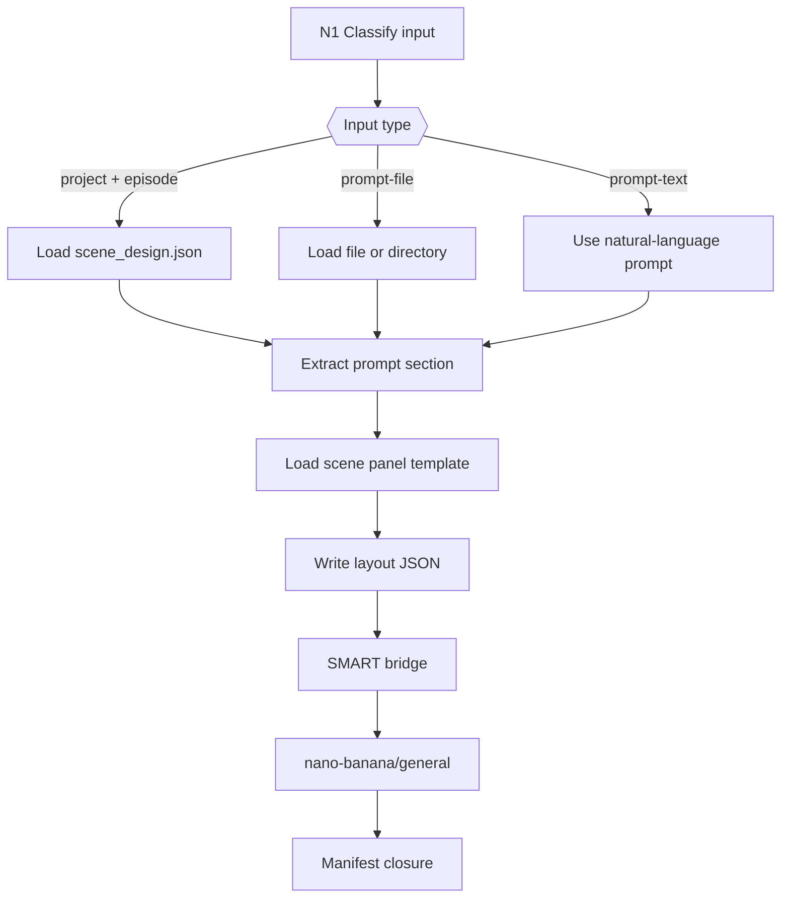
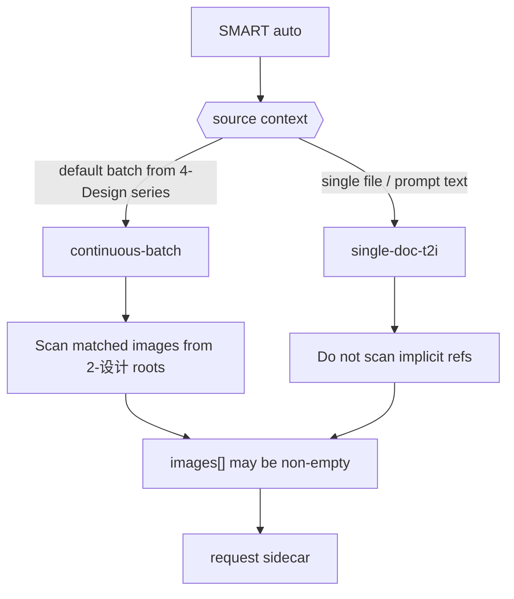
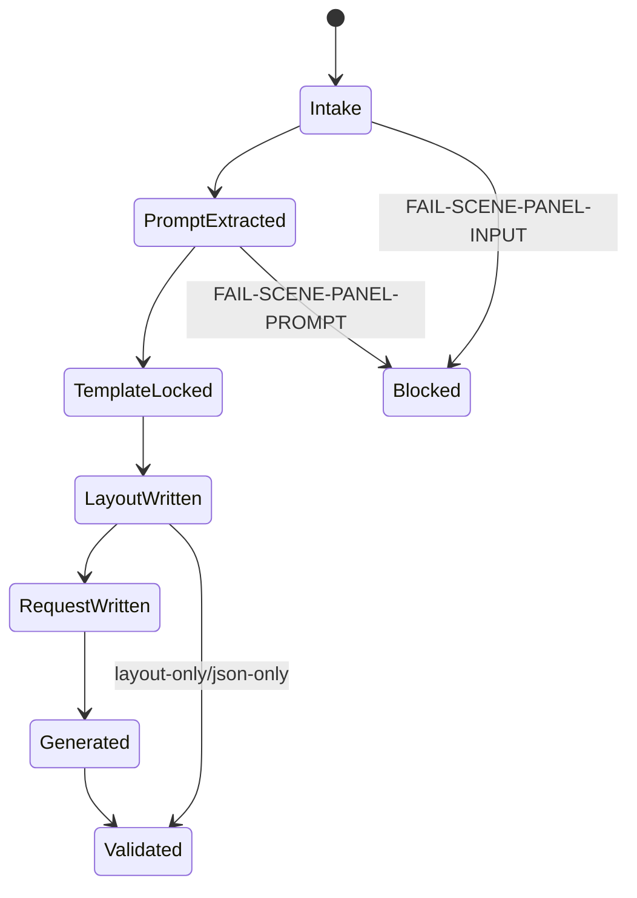
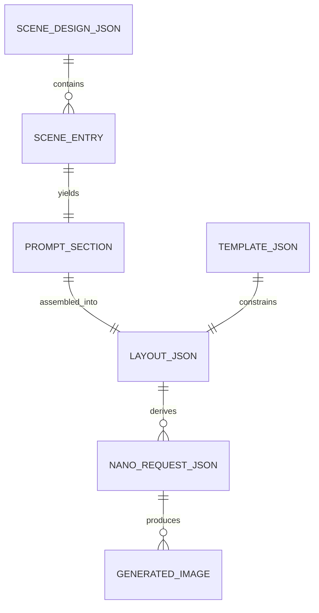

# aigc 4-Design / 3-面板 / 场景

## 概述

`4-Design/3-面板/场景` 是场景设计后的面板化 leaf。它参照 `/Volumes/AIGC/AIGC-ZEN-VOID/.agents/skills/aigc2026/3-设定/4-面板/场景面板` 的成熟配置，但按当前仓 runtime 重定输入、落点与 SMART 生图规则。

核心职责：

1. 消费 `4-Design/场景/2-设计` 的各种设计产物。
2. 只直接引用设计产物中的 prompt 部分，尤其是 Markdown 的 `**prompt整合**` 段。
3. 生成 `16:9 + 3x3 + 9 panels` 的 `*_ScenePanel-layout.json`。
4. JSON 落盘后默认调用 `.agents/skills/api/image/nano-banana/general` 自动生图。
5. SMART 批量模式自动获取设计中已有图片作为对应参照图；单独指定文件或自然语言要求生图时默认无参照图 T2I。

本技能不拥有：

- 改写 `scene_design.json` 或逐场景 Markdown。
- 重新推导场景设计事实。
- 在桥接层二次改写 prompt。
- 把 request JSON、PNG 或 nano report 升格为业务真源。

## Shared Canonical Sources

- `.agents/skills/aigc/4-Design/3-面板/SKILL.md`
- `.agents/skills/aigc/4-Design/3-面板/_shared/smart-image-handoff-contract.md`
- `.agents/skills/aigc/4-Design/3-面板/_shared/panel_auto_generate.py`
- `.agents/skills/aigc/4-Design/2-设计/场景/SKILL.md`
- `.agents/skills/api/image/nano-banana/general/SKILL.md`
- `templates/场景面板-提示词.json`

真源分工：

- 本 `SKILL.md`：场景 leaf 的输入分型、思行网络、字段门、输出与 SMART 规则。
- `templates/场景面板-提示词.json`：九宫格版式与面板提示模板真源。
- `_shared/smart-image-handoff-contract.md`：自动生图桥与 SMART 判型真源。
- `_shared/panel_auto_generate.py`：request sidecar 与 nano-banana 调用共享实现。

## Business Requirement Analysis Contract

| analysis_slot | 当前结论 |
| --- | --- |
| `business_goal` | 把场景设计 prompt 转成可直接生图的九宫格场景面板 JSON，并默认完成生图调用。 |
| `business_object` | `scene_design.json.scenes[]`、兼容旧 `scene_designs[]`、逐场景 Markdown、用户指定 prompt 文件、自然语言 prompt、layout JSON、SMART request sidecar。 |
| `constraint_profile` | 上游设计产物是 prompt 真源；面板模板固定 16:9/3x3；layout JSON 是业务真源；nano 输出是派生资产。 |
| `success_criteria` | 每个场景 layout 含 `subject/prompt/images/project_name/aspect_ratio/image_size/output_dir/output_filename`，默认生成 request sidecar 并调用 nano-banana。 |
| `non_goals` | 不重写场景设计、不替用户补完整设计、不在单文件直调时隐式偷扫参考图。 |
| `complexity_source` | 输入产物类型多、旧/新字段名不同、SMART 参考图判型依赖执行上下文。 |
| `topology_fit` | “输入分型 -> prompt 直引 -> 模板装配 -> layout 写回 -> SMART 判型 -> nano 调用 -> manifest 汇流”的单技能思行网络。 |

## Total Input Contract

默认批量输入：

- `projects/aigc/<项目名>/4-Design/场景/2-设计/第N集/scene_design.json`
- 同目录逐场景 Markdown（可选）

显式输入：

- `--design-file <json>`：指定设计 JSON。
- `--prompt-file <md|txt|json|dir>`：指定单文件或目录；默认按直调处理，不隐式扫描参考图。
- `--prompt-text "<自然语言>"`：自然语言直调；默认无参考图 T2I。

Prompt 字段优先级：

1. Markdown `**prompt整合**` 段。
2. JSON 字段：`prompt整合 / prompt_integration / design_prompt / final_prompt / final_scene_prompt / prompt`。
3. 嵌套字段：`structured_fields.prompt整合 / structured_fields.prompt_integration`。

硬规则：

1. 有设计文档时，只取 prompt 部分，不把 `物语 / 解构 / 搜索 / 研究` 全文拼入面板 prompt。
2. 默认批量 `project + episode` 是 `panel-stage` 上下文，SMART `auto` 解析为 `continuous-batch`。
3. `--prompt-file` 或 `--prompt-text` 是 `direct-request` 上下文，SMART `auto` 解析为 `single-doc-t2i`。
4. 用户显式传 `--reference` 时，无论上下文都加入 explicit refs。
5. `--layout-only / --json-only / --smart-mode off` 时只产出 JSON，不调用 nano。

## Output Contract

默认输出目录：

- `projects/aigc/<项目名>/4-Design/场景/3-面板/第N集/`

默认交付物：

1. `*_ScenePanel-layout.json`
2. `场景面板.json`
3. `_manifest.json`
4. 默认派生：`generated/requests/*.json`、`generated/requests/panel_auto_generate_batch.json`、`generated/panel_auto_generate_report.json`、nano-banana 输出图片。

`layout.json` 至少包含：

```json
{
  "subject": {
    "scene_id": "",
    "scene_name": "",
    "identity_badge": ""
  },
  "prompt": "",
  "images": [],
  "project_name": "<项目名>",
  "task_kind": "project",
  "aspect_ratio": "16:9",
  "image_size": "4K",
  "request_id": "SCN-001-scene-panel",
  "output_dir": "projects/aigc/<项目名>/4-Design/场景/3-面板/第N集/generated/SCN-001-ScenePanel",
  "output_filename": "SCN-001-场景名_ScenePanel.png",
  "filename_prefix": "SCN-001-场景名_ScenePanel"
}
```

## CLI Contract

```bash
python3 .agents/skills/aigc/4-Design/3-面板/场景/scripts/generate_scene_panels.py \
  --project "<项目名>" \
  --episode "第1集"
```

常用参数：

- `--scene-id <id>`：只生成指定场景。
- `--design-file <path>`：显式指定设计 JSON。
- `--prompt-file <path>`：指定单文件或目录。
- `--prompt-text "<prompt>"`：自然语言直调。
- `--layout-only` / `--json-only`：只写 JSON，不调用 nano。
- `--smart-mode auto|continuous-batch|single-doc-t2i|off`：SMART 模式。
- `--reference <path-or-url>`：显式参考图，可重复。
- `--dry-run`：写 JSON 与 request sidecar，并 dry-run nano payload，不真正调用 API。
- `--force`：覆盖已存在输出。

## Visual Maps









## Thinking-Action Node Network

| node_id | objective | inputs | actions | evidence | route_out | gate |
| --- | --- | --- | --- | --- | --- | --- |
| `N1-INTAKE` | 判定输入类型与执行上下文 | CLI 参数、用户任务 | 判定 project batch / prompt-file / prompt-text | `input_mode` | `N2` | 无 prompt 来源不得继续 |
| `N2-SOURCE` | 装载设计产物 | design JSON、Markdown、目录 | 读取文件并拆成场景任务 | `source_tasks` | `N3` | JSON/目录不可读失败 |
| `N3-PROMPT` | 直引 prompt 部分 | scene entry、Markdown | 提取 `prompt整合` 或字段优先级 prompt | `prompt_source` | `N4` | prompt 为空失败 |
| `N4-TEMPLATE` | 锁定九宫格模板 | `templates/场景面板-提示词.json` | 校验 `prompt_payload`、16:9、3x3 | `template_meta` | `N5` | 模板缺字段失败 |
| `N5-LAYOUT` | 写 layout JSON | prompt、subject、template | 组装并落盘 per-scene layout | `layout_paths` | `N6` | 输出冲突且未 force 失败 |
| `N6-AGGREGATE` | 写 episode carrier 与 manifest | layout 列表 | 写 `场景面板.json` 与 `_manifest.json` | `manifest_path` | `N7` | 聚合与 layout 不一致失败 |
| `N7-SMART` | 判定并执行生图桥 | layout 列表、SMART mode | 写 request sidecar，调用 nano 或显式跳过 | `image_generation` | `N8` | 默认未调用且无跳过理由失败 |
| `N8-CLOSURE` | 收束验收 | 全部输出 | 写 manifest 结果与失败码 | `closure` | `done` | 无根因闭环不得结案 |

## Field Master

| field_id | 输出位置/字段 | 内容要求 | 默认责任 Step | 质量维度 | 失败码 |
| --- | --- | --- | --- | --- | --- |
| `FIELD-SCENE-PANEL-01` | `input_mode/source_context` | 区分 batch 与 direct-request | `N1` | 输入分型 | `FAIL-SCENE-PANEL-INPUT` |
| `FIELD-SCENE-PANEL-02` | `prompt` | 只引用 prompt 部分，不泄漏全文推导 | `N3` | prompt 纯度 | `FAIL-SCENE-PANEL-PROMPT` |
| `FIELD-SCENE-PANEL-03` | `subject` | `scene_id/scene_name/identity_badge` 稳定 | `N3-N5` | 身份稳定 | `FAIL-SCENE-PANEL-SUBJECT` |
| `FIELD-SCENE-PANEL-04` | `template` | 固定 `16:9 + 3x3 + 9 panels` | `N4` | 模板一致 | `FAIL-SCENE-PANEL-TEMPLATE` |
| `FIELD-SCENE-PANEL-05` | `layout JSON` | 可直接被 nano/general 或 SMART bridge 消费 | `N5` | JSON 可消费 | `FAIL-SCENE-PANEL-LAYOUT` |
| `FIELD-SCENE-PANEL-06` | `image_generation` | SMART 判型正确，批量可扫图，直调默认 T2I | `N7` | SMART 准确 | `FAIL-SCENE-PANEL-SMART` |
| `FIELD-SCENE-PANEL-07` | `_manifest.json` | 记录 layout、request、生图结果与失败状态 | `N6-N8` | 闭环可追溯 | `FAIL-SCENE-PANEL-MANIFEST` |

## Thought Pass Map

| step_id | 聚焦字段 | 核心问题 | 生成动作 | 未达标信号 |
| --- | --- | --- | --- | --- |
| `S1` | `FIELD-SCENE-PANEL-01` | 当前是不是连续批量链路 | 记录 `source_context` 与 `pipeline_context` | 单文件被当批量 |
| `S2` | `FIELD-SCENE-PANEL-02` | prompt 是否来自上游 prompt 段 | 提取 `prompt整合` 或字段 prompt | prompt 混入 `解构` 全文 |
| `S3` | `FIELD-SCENE-PANEL-03` | scene identity 是否稳定 | 解析 `scene_id/name` 与文件名 fallback | 空标签 |
| `S4` | `FIELD-SCENE-PANEL-04` | 模板是否仍对齐 ZEN 场景面板 | 校验 `prompt_payload` 与 16:9/3x3 | 模板字段缺失 |
| `S5` | `FIELD-SCENE-PANEL-05` | layout 是否可直接消费 | 写标准 JSON 字段 | 缺 `prompt/images/output_filename` |
| `S6` | `FIELD-SCENE-PANEL-06` | SMART 是否按规则解析 | 调用共享桥 | 直调偷扫图或批量不扫图 |
| `S7` | `FIELD-SCENE-PANEL-07` | 是否留下可恢复闭环 | 写 manifest 与错误 | 生图失败但无 sidecar |

## Pass Table

| field_id | Pass Standard | Fail Code | Rework Entry |
| --- | --- | --- | --- |
| `FIELD-SCENE-PANEL-01` | batch/direct-request 判型清楚 | `FAIL-SCENE-PANEL-INPUT` | `S1` |
| `FIELD-SCENE-PANEL-02` | prompt 只取 prompt 部分且非空 | `FAIL-SCENE-PANEL-PROMPT` | `S2` |
| `FIELD-SCENE-PANEL-03` | 身份标签非空、可回链 | `FAIL-SCENE-PANEL-SUBJECT` | `S3` |
| `FIELD-SCENE-PANEL-04` | 模板固定 16:9/3x3/9 panels | `FAIL-SCENE-PANEL-TEMPLATE` | `S4` |
| `FIELD-SCENE-PANEL-05` | layout JSON 含 nano/general 标准字段 | `FAIL-SCENE-PANEL-LAYOUT` | `S5` |
| `FIELD-SCENE-PANEL-06` | SMART 批量/直调行为符合规则 | `FAIL-SCENE-PANEL-SMART` | `S6` |
| `FIELD-SCENE-PANEL-07` | manifest 记录产物和生图结果 | `FAIL-SCENE-PANEL-MANIFEST` | `S7` |

## Root-Cause Execution Contract (Mandatory)

触发场景：输入解析失败、prompt 混入全文、模板漂移、SMART 参考图错误、默认未生图、生图 API 失败。

强制链路：

`Symptom -> Direct Technical Cause -> Rule Source -> Meta Rule Source -> Fix Landing Points`

优先检查：

- `Rule Source`
  - 本 `SKILL.md`
  - `scripts/generate_scene_panels.py`
  - `templates/场景面板-提示词.json`
  - `../_shared/smart-image-handoff-contract.md`
  - `../_shared/panel_auto_generate.py`
- `Meta Rule Source`
  - `.agents/skills/aigc/4-Design/3-面板/SKILL.md`
  - `.agents/skills/aigc/4-Design/SKILL.md`
  - 根 `AGENTS.md`

闭环输出必须包含：`root cause location + immediate fix + systemic prevention fix`，并附分层追踪路径。

## Completion Criteria

- `SKILL.md + CONTEXT.md + agents/openai.yaml + skill_manifest.json + templates + scripts` 齐备。
- 可从当前仓 `scene_design.json.scenes[]` 与 Markdown `prompt整合` 生成 layout。
- 默认 JSON 后自动调用 `nano-banana/general`。
- `--prompt-file` / `--prompt-text` 默认不扫隐式参考图。
- `--dry-run` 可验证 JSON、request sidecar 与 nano payload，不需要真实 API key。
