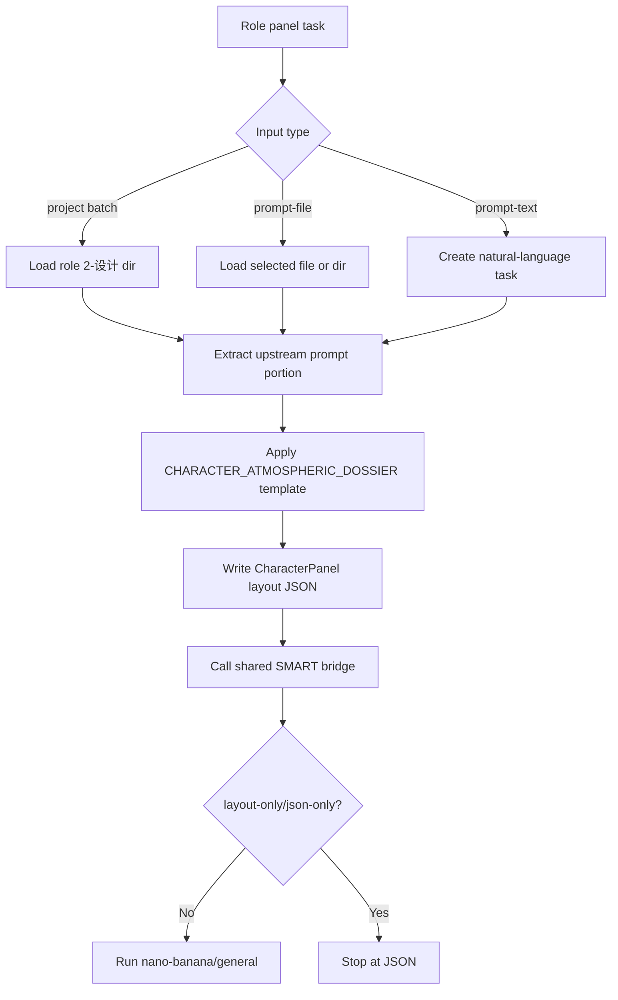
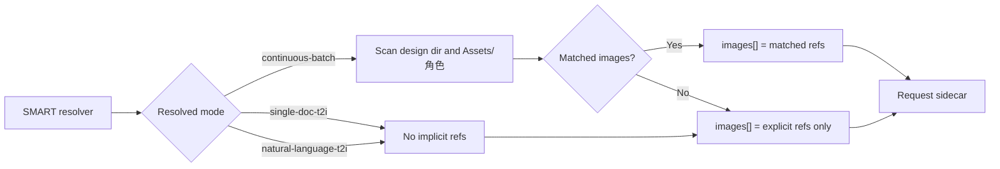
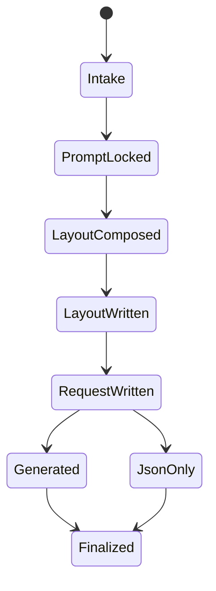
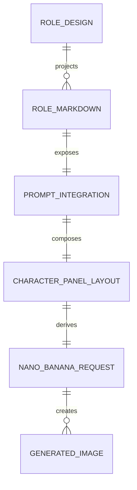

# aigc 4-Design / 3-面板 / 角色

## Context Loading Contract

- 每次调用本技能时，必须同时加载同目录 `CONTEXT.md` 作为预加载上下文。
- 若同目录 `CONTEXT.md` 缺失，应先补齐最小知识库骨架，或向用户明确报告阻塞；不得在未检查该上下文的情况下执行技能。
- 冲突优先级：用户显式请求 > 仓库/全局 `AGENTS.md` > 本 `SKILL.md` > 同目录 `CONTEXT.md`。

## 概述

`4-Design/3-面板/角色` 是角色设计产物的面板化与自动生图入口。

它完全参照 `/Volumes/AIGC/AIGC-ZEN-VOID/.agents/skills/aigc2026/3-设定/4-面板/角色面板` 的核心配置口径，并按当前仓库 `4-Design` 新 runtime 改写落点：

- 上游：`projects/aigc/<项目名>/4-Design/角色/2-设计/第N集/`
- 输出：`projects/aigc/<项目名>/4-Design/角色/3-面板/第N集/`
- 生图：`.agents/skills/api/image/nano-banana/general`，执行模式继承 `.agents/skills/aigc/_shared/image-generation-execution-contract.md`

本技能只做：

1. 读取上游角色设计产物。
2. 直接抽取设计产物中的 `prompt整合` / `prompt_integration` / `final_prompt` 等 prompt 部分。
3. 套用固定 16:9 `CHARACTER_ATMOSPHERIC_DOSSIER` 三栏模板。
4. 写 `*-CharacterPanel-layout.json`。
5. 默认写 request sidecar 后以后台批量并发模式调用 nano-banana/general 自动生图。

本技能不做：

- 重写角色身份、服装体系或剧情事实。
- 把面板 prompt 反向写回 `2-设计`。
- 在单文件或自然语言请求中隐式扫描 continuity refs。

## Shared Canonical Sources (Mandatory)

- `.agents/skills/aigc/4-Design/3-面板/SKILL.md`
- `.agents/skills/aigc/4-Design/3-面板/_shared/smart-image-handoff-contract.md`
- `.agents/skills/aigc/4-Design/3-面板/_shared/panel_auto_generate.py`
- `.agents/skills/aigc/_shared/image-generation-execution-contract.md`
- `.agents/skills/aigc/4-Design/2-设计/角色/SKILL.md`
- `templates/角色面板-提示词.json`
- `scripts/generate_character_panels.py`
- `.agents/skills/api/image/nano-banana/general/SKILL.md`

真源分工：

- 本 `SKILL.md`：角色面板 leaf 的输入输出、思行网络、SMART 域内门禁。
- `templates/角色面板-提示词.json`：固定布局与 prompt payload 模板真源。
- `_shared/smart-image-handoff-contract.md`：批量/单例参照图策略与 nano-banana request sidecar 真源。
- `scripts/generate_character_panels.py`：角色 layout 落盘入口；SMART mode、Assets 扫描、request sidecar 与 nano 调用统一交给 `_shared/panel_auto_generate.py`。

## Business Requirement Analysis Contract (Mandatory)

| analysis_slot | 当前结论 |
| --- | --- |
| `business_goal` | 把角色 `2-设计` 产物直接面板化，并默认生成角色面板图。 |
| `business_object` | 逐角色 Markdown、`character_design.json`、`_manifest.json`、已有角色设计图、`*-CharacterPanel-layout.json`、nano-banana request sidecar。 |
| `constraint_profile` | 上游 prompt 部分是设计主体真源；模板是布局真源；SMART 批量才自动绑参照图。 |
| `success_criteria` | 每个角色产出 layout JSON；无停点参数时 request sidecar 可被 nano-banana/general 执行；批量模式自动使用匹配已有图。 |
| `non_goals` | 不补写角色设计；不把 Markdown 以外的搜索/解构全文塞入 prompt；不在 single/natural 模式自动扫图。 |
| `complexity_source` | 输入来源多型、prompt 字段多型、批量/单例 SMART 分叉、JSON 与生图请求双产物汇流。 |
| `topology_fit` | 混合型：输入判型 -> prompt 直引 -> 模板装配 -> SMART 参照 -> JSON 落盘 -> 自动生图。 |
| `step_strategy` | 用单技能思行网络执行，脚本承接可重复的解析、落盘与 handoff。 |

## Total Input Contract (Mandatory)

### 批量默认输入

- `projects/aigc/<项目名>/4-Design/角色/2-设计/第N集/`

可消费：

- `[角色名].md`：优先抽取 `**prompt整合**` 段。
- `_manifest.json`：用于补齐 `role_id / canonical_name / role_tier / costume_state / markdown_path`。
- `character_design.json`：若存在，优先读取 `roles[].prompt_integration / final_prompt / prompt_payload.prompt_text`。

### 单例输入

- `--prompt-file <path>`：指定单个 Markdown / JSON 或目录。
- `--prompt-text <text>`：自然语言直接生图。

### 参照图输入

- 批量模式：自动扫描设计目录同级图与 `projects/aigc/<项目名>/Assets/角色/` 中匹配 `role_id / role_name` 的图片。
- 单文件 / 自然语言模式：默认不自动扫描；只使用 `--subject-reference / --costume-reference / --reference-image`。

## Output Contract (Mandatory)

默认输出目录：

- `projects/aigc/<项目名>/4-Design/角色/3-面板/第N集/`

默认交付物：

1. `<role_id>-<role_name>-<costume_state>-CharacterPanel-layout.json`
2. `generated/requests/panel_auto_generate_batch.json`
3. 默认后台提交证据：`background_submitted`、`background_pid`、`background_log`；最终图片输出到 `generated/<layout-stem>/...png`
4. `_manifest.json`

停点规则：

- 默认：写 JSON 后自动执行生图。
- `--foreground`：前台等待 nano-banana 完成；未传时默认后台批量并发提交。
- `--layout-only` 或 `--json-only`：只写 layout JSON、request sidecar、bridge report 与 manifest，不调用 API。
- `--dry-run`：写 JSON 与 request sidecar，并让 nano-banana/general 只打印/验证 payload，不真实调用 API。

## Visual Maps (Mermaid)

## SMART 执行规则（Mandatory）

1. `continuous-batch`
   - 触发：只提供 `--project + --episode`、或父级 `4-Design` 批量调度。
   - 动作：由共享 SMART bridge 自动获取设计中已有图片作为对应参照图进行面板化生图。
   - 匹配：共享 bridge 基于 `role_id / role_name / identity_badge` 等主体 token 扫描 `2-设计` 同级图与 `Assets/角色`。
2. `single-doc-t2i`
   - 触发：显式指定单个 `--prompt-file`。
   - 动作：默认无参照图直接生成。
3. `natural-language-t2i`
   - 触发：显式 `--prompt-text` 或自然语言要求生图。
   - 动作：默认无参照图直接生成。
4. 显式参考图永远允许，但必须进入 `explicit_references`，不得伪装为自动参照。

## Field Master

| field_id | output_position | requirement | source_layers | owner_step | quality_dimension | fail_code |
| --- | --- | --- | --- | --- | --- | --- |
| `FIELD-RP-01` | `subject.role_id / role_name / costume_state` | 主体锚点稳定，能从 manifest、JSON 或文件名追溯 | `2-设计/_manifest.json`、Markdown、JSON | `S2` | identity stability | `FAIL-RP-IDENTITY` |
| `FIELD-RP-02` | `design_subject` | 只来自上游 prompt 部分，不含搜索/解构全文 | Markdown `prompt整合`、JSON prompt 字段 | `S3` | prompt inheritance | `FAIL-RP-PROMPT` |
| `FIELD-RP-03` | `prompt_payload` | 与模板字段结构一致，固定 16:9 三栏 | `templates/角色面板-提示词.json` | `S4` | layout fidelity | `FAIL-RP-TEMPLATE` |
| `FIELD-RP-04` | `references.reference_images` / `images` | SMART 参照符合 batch/single 边界 | SMART contract + CLI refs | `S5` | reference governance | `FAIL-RP-REFERENCES` |
| `FIELD-RP-05` | `image_generation` / request sidecar | 可直接由 nano-banana/general 消费 | layout JSON | `S6` | generation handoff | `FAIL-RP-HANDOFF` |
| `FIELD-RP-06` | `_manifest.json` | 记录任务数、SMART 模式、layout 与 request sidecar | 全链输出 | `S7` | audit closure | `FAIL-RP-MANIFEST` |

## Thought Pass Map

| step_id | focus | actions | evidence | route_out | rework_entry |
| --- | --- | --- | --- | --- | --- |
| `S1` | 输入判型 | 判定 project batch / prompt-file / prompt-text | `input_mode` | `S2` | `S1` |
| `S2` | 主体锚点 | 解析 `role_id / role_name / role_tier / costume_state` | `subject` | `S3` | `S2` |
| `S3` | prompt 直引 | 抽取 `prompt整合` 或 JSON prompt 字段 | `design_subject` | `S4` | `S3` |
| `S4` | 模板装配 | 读取固定模板并合成 `prompt_payload.prompt_text` | `template_path` | `S5` | `S4` |
| `S5` | SMART 参照 | 按模式绑定自动/显式参照 | `references` | `S6` | `S5` |
| `S6` | JSON 与请求汇流 | 写 layout JSON 与 request sidecar | `layout_paths`、`request_sidecar` | `S7` | `S6` |
| `S7` | 生图与收束 | 默认后台批量并发提交 nano-banana/general 或停在 JSON | `generation_result`、`manifest` | `done` | `S6-S7` |

## Thinking-Action Node Contract (Mandatory)

| node_id | objective | inputs | actions | evidence | route_out | gate |
| --- | --- | --- | --- | --- | --- | --- |
| `N1-INTAKE` | 锁输入模式 | CLI / 用户任务 | 判定 batch、single、natural | `input_mode` | `N2` | 缺 project 且无 prompt 输入不得继续 |
| `N2-IDENTITY` | 锁角色锚点 | manifest / JSON / Markdown / 文件名 | 解析主体字段 | `subject` | `N3` | `role_name` 不得为空 |
| `N3-PROMPT` | 锁设计主体 | 上游设计产物 | 只抽取 prompt 部分 | `design_subject` | `N4` | prompt 空则阻断 |
| `N4-TEMPLATE` | 锁面板布局 | 模板 JSON | 合成三栏 layout prompt | `prompt_payload` | `N5` | 模板缺 `prompt_payload` 阻断 |
| `N5-SMART-REF` | 锁参照图策略 | SMART mode / explicit refs / Assets | 写入 continuity roots 并调用共享 bridge 绑定 refs 或保持 T2I | `references` | `N6` | single/natural 不得隐式扫图 |
| `N6-WRITE` | 写 JSON 与 request | `N2~N5` | 落 layout 和 sidecar | `layout_paths` | `N7` | layout 不存在不得生图 |
| `N7-GENERATE` | 自动生图或停点 | request sidecar | 默认后台批量并发提交 nano-banana/general，或 JSON-only 停下 | `generation_result` | `done` | 默认不得漏掉生图；后台提交不得伪装为图片已完成 |

## Pass Table

| field_id | pass_condition | fail_code | rework_entry |
| --- | --- | --- | --- |
| `FIELD-RP-01` | 主体 ID/name/state 可追溯 | `FAIL-RP-IDENTITY` | `S2` |
| `FIELD-RP-02` | prompt 只来自上游 prompt 部分且非空 | `FAIL-RP-PROMPT` | `S3` |
| `FIELD-RP-03` | 模板字段与 16:9 三栏布局稳定 | `FAIL-RP-TEMPLATE` | `S4` |
| `FIELD-RP-04` | SMART 参照不越界 | `FAIL-RP-REFERENCES` | `S5` |
| `FIELD-RP-05` | request sidecar 可被 nano-banana/general 消费 | `FAIL-RP-HANDOFF` | `S6` |
| `FIELD-RP-06` | manifest 能说明本轮产物与停点 | `FAIL-RP-MANIFEST` | `S7` |

## Root-Cause Execution Contract (Mandatory)

触发场景：

- prompt 被截断或混入搜索/解构全文。
- SMART 模式绑定了错误参照图。
- `layout.json` 已写但默认未触发生图。
- request sidecar 与 nano-banana/general 字段不兼容。

固定链路：

`Symptom -> Direct Technical Cause -> Rule Source -> Meta Rule Source -> Fix Landing Points`

优先检查：

1. `scripts/generate_character_panels.py`
2. `templates/角色面板-提示词.json`
3. `.agents/skills/aigc/4-Design/3-面板/_shared/smart-image-handoff-contract.md`
4. 本 `SKILL.md`
5. `.agents/skills/api/image/nano-banana/general/SKILL.md`
6. `AGENTS.md`

## Completion Criteria

- 技能基线完整：`SKILL.md + CONTEXT.md + agents/openai.yaml + skill_manifest.json + templates + scripts`。
- 可消费项目批量、单文件和自然语言三类输入。
- 每个任务先写 layout JSON。
- 默认执行 nano-banana/general；JSON-only 停点显式可控。
- SMART 执行符合：批量自动参照，单文件/自然语言默认无参照。
