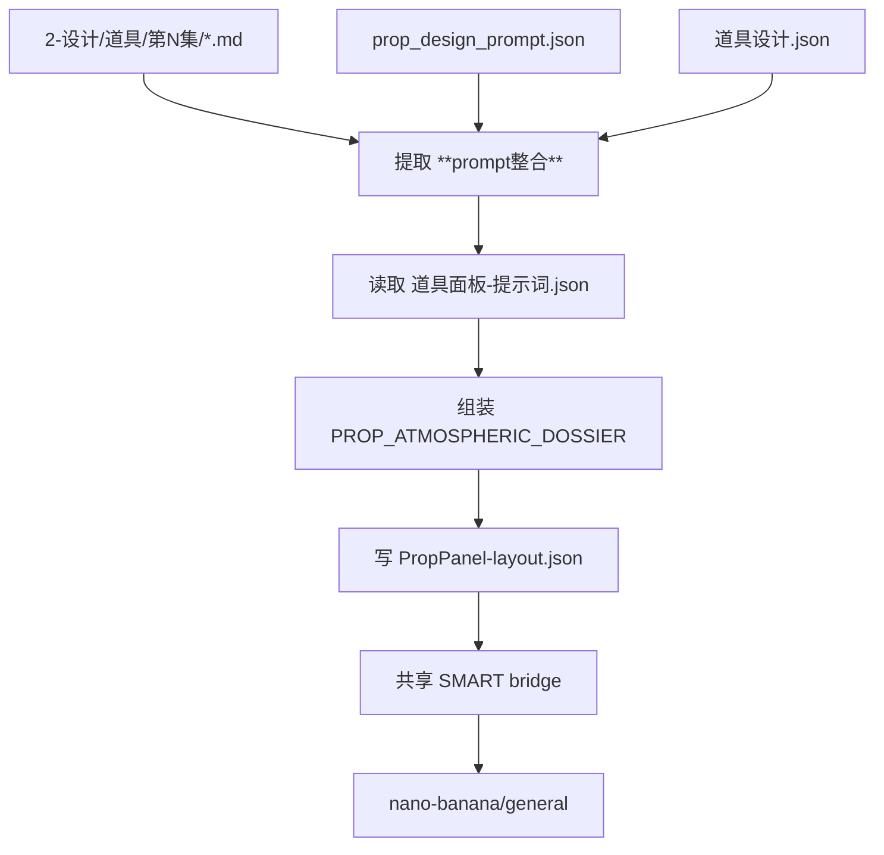
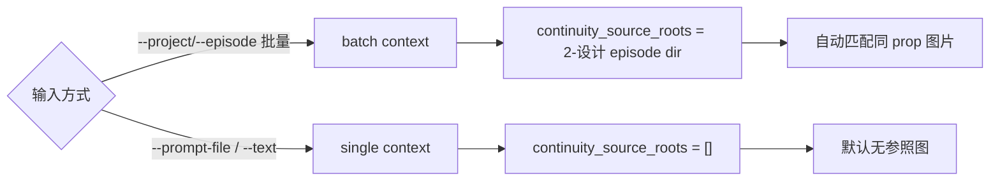
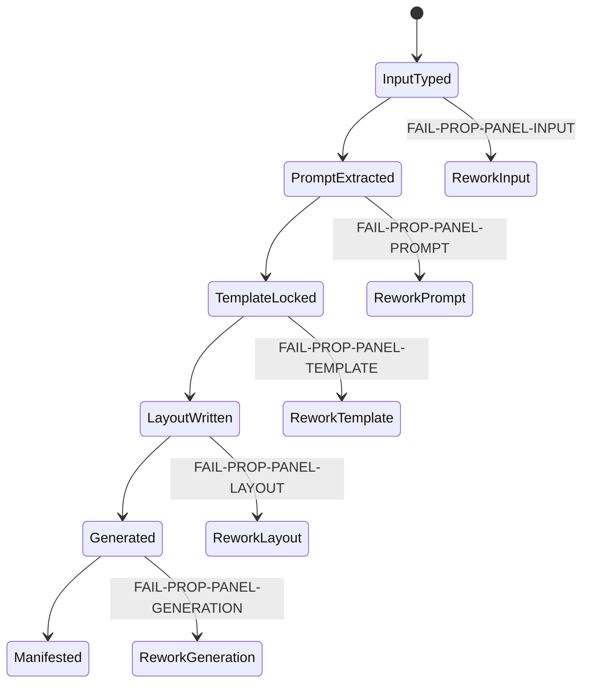

# aigc 4-Design / 3-面板 / 道具

## Context Loading Contract

- 每次调用本技能时，必须同时加载同目录 `CONTEXT.md` 作为预加载上下文。
- 若同目录 `CONTEXT.md` 缺失，应先补齐最小知识库骨架，或向用户明确报告阻塞；不得在未检查该上下文的情况下执行技能。
- 冲突优先级：用户显式请求 > 仓库/全局 `AGENTS.md` > 本 `SKILL.md` > 同目录 `CONTEXT.md`。

## 概述

`3-面板/道具` 承接 `2-设计/道具` 的设计产物，将每个道具的 prompt 部分直接版式化为 16:9 道具面板 JSON，并默认按 `.agents/skills/aigc/_shared/image-generation-execution-contract.md` 后台批量并发调用 `.agents/skills/api/image/nano-banana/general` 生图。

本技能完全继承 `/Volumes/AIGC/AIGC-ZEN-VOID/.agents/skills/aigc2026/3-设定/4-面板/道具面板` 的核心配置口径：

- `PROP_ATMOSPHERIC_DOSSIER`
- 固定 16:9 / 4K / `4096x2304`
- 三栏布局 `LEFT 15% | CENTER 50% | RIGHT 35%`
- 左上角固定 `PROP_ID+PROP_NAME` identity badge
- `layout.json` 先行、默认继续后台批量并发自动生图

当前仓的差异只在 runtime 与输入真源：

- runtime 固定为 `projects/aigc/<项目名>/4-Design/道具/`
- 默认上游是 `2-设计/第N集/*.md` 中的 `**prompt整合**`
- `道具设计.json / prop_design_prompt.json` 只作为兼容输入

## Business Requirement Analysis Contract

| 分析槽位 | 当前答案 |
| --- | --- |
| `business_goal` | 把道具设计产物中的 prompt 区块转成面板 layout JSON，并默认生成可审阅 PNG |
| `business_object` | 逐道具 Markdown 设计卡、兼容 prompt JSON、兼容 design JSON、道具面板模板、SMART 参考图规则 |
| `constraint_profile` | 不重做设计；只直引 prompt；先写 JSON 后生图；批量链路自动找参照；单文件/自然语言默认无参照 |
| `success_criteria` | 每个道具有独立 `<prop_id>-<prop_name>-PropPanel-layout.json`、manifest、request sidecar 与默认后台提交链；最终 PNG 由输出文件或 provider report 复核 |
| `non_goals` | 不回写 `2-设计`，不把面板 prompt 反向升格为设计事实，不为未重建 sibling 定义规则 |
| `complexity_source` | 上游文件形态多，且 SMART 参照图规则需要同时满足连续批量与单次直生图两种语义 |
| `topology_fit` | 混合型：输入判型 -> prompt 提取 -> 模板装配 -> layout 写回 -> SMART 生图 -> manifest 汇流 |

## Total Input Contract

### 默认批量输入

- `projects/aigc/<项目名>/4-Design/道具/2-设计/第N集/*.md`
- `projects/aigc/<项目名>/4-Design/道具/2-设计/第N集/_manifest.json`

### 兼容输入

- `projects/aigc/<项目名>/4-Design/道具/2-设计/第N集/prop_design_prompt.json`
- `projects/aigc/<项目名>/4-Design/道具/2-设计/第N集/道具设计.json`

### 单次输入

- `--prompt-file <md|json|txt|directory>`
- `--text "<自然语言 prompt>"`

### 固定输出

- `projects/aigc/<项目名>/4-Design/道具/3-面板/第N集/<prop_id>-<prop_name>-PropPanel-layout.json`
- `projects/aigc/<项目名>/4-Design/道具/3-面板/第N集/_manifest.json`
- `projects/aigc/<项目名>/4-Design/道具/3-面板/第N集/generated/requests/*.json`
- 默认后台提交 pid/log 写入 manifest；最终 PNG 输出到 `generated/<layout-stem>/`

## Stage Boundary

### 本阶段拥有

1. 从设计产物提取 `prompt`。
2. 读取 `templates/道具面板-提示词.json`。
3. 组装道具面板 layout JSON。
4. 调用共享 SMART bridge 后台批量并发生图。
5. 写 `_manifest.json` 记录 layout 与生图结果。

### 本阶段不拥有

1. 不重新设计道具。
2. 不回写 `2-设计` 的 Markdown 或兼容 JSON。
3. 不直接绕过 layout JSON 调用 nano-banana。
4. 不在 leaf 私有脚本中复制第二套生图桥。

## Visual Maps







## Canonical Anchors

| 载体 | 位置 | 作用 |
| --- | --- | --- |
| Markdown 主输入 | `projects/aigc/<项目名>/4-Design/道具/2-设计/第N集/*.md` | 默认 prompt 真源 |
| prompt compat | `projects/aigc/<项目名>/4-Design/道具/2-设计/第N集/prop_design_prompt.json` | 兼容 prompt 输入 |
| design compat | `projects/aigc/<项目名>/4-Design/道具/2-设计/第N集/道具设计.json` | 兼容 fallback |
| layout template | `.agents/skills/aigc/4-Design/3-面板/道具/templates/道具面板-提示词.json` | 版式唯一真源 |
| runner | `.agents/skills/aigc/4-Design/3-面板/道具/scripts/generate_prop_panels.py` | 执行入口 |
| SMART bridge | `.agents/skills/aigc/4-Design/3-面板/_shared/panel_auto_generate.py` | 生图桥接唯一真源 |

## SMART Reference Rule

1. 批量调度 `.agents/skills/aigc/4-Design` 系列任务时：
   - 默认 `pipeline_context=panel-stage`
   - `smart_mode=auto` 解析为 `continuous-batch`
   - 自动扫描对应 `2-设计/第N集/` 中已有图片，按 `prop_id / prop_name / identity_badge` 匹配参照图
2. 单独指定文件或自然语言要求生图时：
   - 默认 `pipeline_context=direct-request`
   - `smart_mode=auto` 解析为 `single-doc-t2i`
   - 默认不扫描 continuity refs
   - 只有显式 `--reference` 才加入参照图
3. `--layout-only` 或 `--json-only` 时只产出 layout JSON、manifest、request sidecar 与 bridge report，不调用生图。

## Thinking-Action Node Network

### NODE-PROP-PANEL-01 输入判型

- `objective`: 判断输入来自批量 episode、指定文件、目录还是自然语言。
- `actions`:
  1. `--project` 默认定位 `4-Design/道具/2-设计/第N集/`。
  2. `--prompt-file` 按文件/目录直接提取 prompt。
  3. `--text` 直接作为单道具 prompt。
  4. 锁定 `pipeline_context` 与 SMART 默认模式。
- `evidence`: `input_mode`、`episode_id`、`source_files[]`、`pipeline_context`。
- `route_out`: 通过 -> `NODE-PROP-PANEL-02`；缺输入 -> `FAIL-PROP-PANEL-INPUT`。
- `gate`: 不允许在无法定位 prompt 真源时继续。

### NODE-PROP-PANEL-02 prompt 直引

- `objective`: 只从设计产物的 prompt 部分提取可消费文本。
- `actions`:
  1. Markdown 只提取 `**prompt整合**` 后正文。
  2. `prop_design_prompt.json` 读取 `props[].prompt_cn`。
  3. `道具设计.json` 读取 `props[].prompt_anchor` 或 `prompt`。
  4. `.txt` 作为已整理 prompt 直读。
- `evidence`: `prompt_source_type`、`prompt_length`、`prop_id`、`prop_name`。
- `route_out`: 通过 -> `NODE-PROP-PANEL-03`；prompt 空 -> `FAIL-PROP-PANEL-PROMPT`。
- `gate`: 禁止本阶段补写新的设计事实。

### NODE-PROP-PANEL-03 模板装配与形制门禁

- `objective`: 使用固定模板形成完整 `PROP_ATMOSPHERIC_DOSSIER` 提示词。
- `actions`:
  1. 读取模板 `prompt_payload`。
  2. 固定 16:9 / `4096x2304`。
  3. 注入 identity badge：`<PROP_ID>+<PROP_NAME>`。
  4. 命中茶杯、细金链、图纸、铜铃等高风险形制时注入专门 guardrails。
- `evidence`: `template_schema`、`morphology_guardrails[]`。
- `route_out`: 通过 -> `NODE-PROP-PANEL-04`；模板缺结构 -> `FAIL-PROP-PANEL-TEMPLATE`。
- `gate`: 模板结构不可由脚本私造替代。

### NODE-PROP-PANEL-04 layout 写回

- `objective`: 每个道具写一份独立 layout JSON。
- `actions`:
  1. 写 `subject / prompt / images / image_generation / output`。
  2. 文件名固定 `<prop_id>-<prop_name>-PropPanel-layout.json`。
  3. 写 `_manifest.json` 记录输出、输入、SMART 与生图状态。
- `evidence`: layout 路径、manifest。
- `route_out`: 通过 -> `NODE-PROP-PANEL-05`；写入失败 -> `FAIL-PROP-PANEL-LAYOUT`。
- `gate`: layout 数量应等于本轮任务数量。

### NODE-PROP-PANEL-05 自动生图

- `objective`: layout 之后自动桥接 nano-banana/general。
- `actions`:
  1. 调用 `../_shared/panel_auto_generate.py`。
  2. 批量上下文自动发现 continuity refs。
  3. 单文件/自然语言上下文默认无参照。
  4. 默认后台批量并发提交，将 bridge 结果回写 manifest。
- `evidence`: request sidecar、bridge report、`background_pid/background_log` 或 foreground nano result。
- `route_out`: 成功 -> final；失败 -> `FAIL-PROP-PANEL-GENERATION`。
- `gate`: 失败时返回非零；后台提交只写 `background_submitted`，不伪装为图片已完成。

## Commands

```bash
python3 .agents/skills/aigc/4-Design/3-面板/道具/scripts/generate_prop_panels.py \
  --project "<项目名>" \
  --episode "第1集"
```

```bash
python3 .agents/skills/aigc/4-Design/3-面板/道具/scripts/generate_prop_panels.py \
  --project "<项目名>" \
  --episode "第1集" \
  --layout-only
```

```bash
python3 .agents/skills/aigc/4-Design/3-面板/道具/scripts/generate_prop_panels.py \
  --project "<项目名>" \
  --prompt-file "projects/aigc/<项目名>/4-Design/道具/2-设计/第1集/prop-001-某道具.md"
```

```bash
python3 .agents/skills/aigc/4-Design/3-面板/道具/scripts/generate_prop_panels.py \
  --project "<项目名>" \
  --text "一枚带有裂纹和蓝光的古代玉佩，道具面板"
```

## Field Master

| field_id | 输出位置/字段 | 内容要求 | 默认责任 Step | 质量维度 | 失败码 |
| --- | --- | --- | --- | --- | --- |
| `FIELD-PROP-PANEL-01` | `input_mode` | 区分批量、单文件、目录、自然语言 | `NODE-PROP-PANEL-01` | 输入判型 | `FAIL-PROP-PANEL-INPUT` |
| `FIELD-PROP-PANEL-02` | `prompt` | 直接引用上游 prompt 部分，非空 | `NODE-PROP-PANEL-02` | prompt 真源性 | `FAIL-PROP-PANEL-PROMPT` |
| `FIELD-PROP-PANEL-03` | `layout_contract` | 完整继承道具面板模板 | `NODE-PROP-PANEL-03` | 模板一致性 | `FAIL-PROP-PANEL-TEMPLATE` |
| `FIELD-PROP-PANEL-04` | `subject.identity_badge` | 固定 `<PROP_ID>+<PROP_NAME>` | `NODE-PROP-PANEL-03` | 身份稳定性 | `FAIL-PROP-PANEL-LAYOUT` |
| `FIELD-PROP-PANEL-05` | `image_generation` | 记录 SMART 上下文与 nano-banana 目标 | `NODE-PROP-PANEL-04/05` | 生图桥接 | `FAIL-PROP-PANEL-GENERATION` |
| `FIELD-PROP-PANEL-06` | `_manifest.json` | 记录输入、输出、生成状态、降级 | `NODE-PROP-PANEL-04/05` | 审计完整性 | `FAIL-PROP-PANEL-MANIFEST` |

## Thought Pass Map

| step_id | 聚焦字段 | 核心问题 | 生成动作 | 未达标信号 |
| --- | --- | --- | --- | --- |
| `S1` | `FIELD-PROP-PANEL-01` | 当前是不是批量 4-Design 上下文 | 判定 input + pipeline context | SMART 模式默认错 |
| `S2` | `FIELD-PROP-PANEL-02` | prompt 是否直引上游 | 抽取 `prompt整合` / compat prompt | 本阶段重写设计 |
| `S3` | `FIELD-PROP-PANEL-03/04` | 版式与身份是否稳定 | 套模板并注入 badge | layout 漂移或无 badge |
| `S4` | `FIELD-PROP-PANEL-05` | 是否该绑定参照图 | 调用 SMART bridge | 单文件自动绑定旧图 |
| `S5` | `FIELD-PROP-PANEL-06` | 是否可复盘 | 写 manifest | 成功/失败不可追踪 |

## Pass Table

| field_id | Pass Standard | Fail Code | Rework Entry |
| --- | --- | --- | --- |
| `FIELD-PROP-PANEL-01` | input mode 与 pipeline context 明确 | `FAIL-PROP-PANEL-INPUT` | `NODE-PROP-PANEL-01` |
| `FIELD-PROP-PANEL-02` | prompt 非空且来源可追溯 | `FAIL-PROP-PANEL-PROMPT` | `NODE-PROP-PANEL-02` |
| `FIELD-PROP-PANEL-03` | 模板字段层级完整 | `FAIL-PROP-PANEL-TEMPLATE` | `NODE-PROP-PANEL-03` |
| `FIELD-PROP-PANEL-04` | identity badge 与文件名一致 | `FAIL-PROP-PANEL-LAYOUT` | `NODE-PROP-PANEL-04` |
| `FIELD-PROP-PANEL-05` | request sidecar 可由 nano-banana/general 承接 | `FAIL-PROP-PANEL-GENERATION` | `NODE-PROP-PANEL-05` |
| `FIELD-PROP-PANEL-06` | manifest 记录生成状态 | `FAIL-PROP-PANEL-MANIFEST` | `NODE-PROP-PANEL-04/05` |

## Root-Cause Execution Contract (Mandatory)

必经链路：

`Symptom -> Direct Technical Cause -> Rule Source (本 SKILL / runner / template / _shared bridge) -> Meta Rule Source (4-Design parent / AGENTS.md / skill-知行合一 / nano-banana general) -> Fix Landing Points`

常见症状优先级：

1. 找不到 prompt：先查 `2-设计/道具` 是否产出 `**prompt整合**`。
2. layout 缺字段：先查模板是否损坏。
3. 单文件任务错误绑定参照：先查 SMART mode 与 pipeline context。
4. 批量任务没用设计图：先查 `continuity_source_roots` 与 `_shared` 扫描规则。
5. 生图失败：先查 request sidecar，再查 `nano-banana/general`。

## One-Shot Output Contract

### 最终结果

- layout JSON
- `_manifest.json`
- 默认生图 request sidecar 与 PNG

### 思考过程

- 输入为何判定为批量或单次。
- prompt 从哪个上游字段/区块直引。
- SMART 是否应自动绑定设计图参照。
- 生图结果如何回链到 layout JSON。

### 风险 / 例外

- `--layout-only / --json-only` 会跳过生图，但仍通过共享 SMART bridge 写 request sidecar 与 bridge report。
- `--dry-run` 不写 layout，也不调用远端 API。
- 真实 API 失败时，本技能不重试伪造结果，返回失败并保留 request sidecar。

## Completion Criteria

- `SKILL.md / CONTEXT.md / template / runner / skill_manifest / agents/openai.yaml` 齐备。
- 能从 Markdown `**prompt整合**` 生成 layout JSON。
- 默认具备自动生图路径。
- SMART 规则在批量与单次上下文中可区分。
