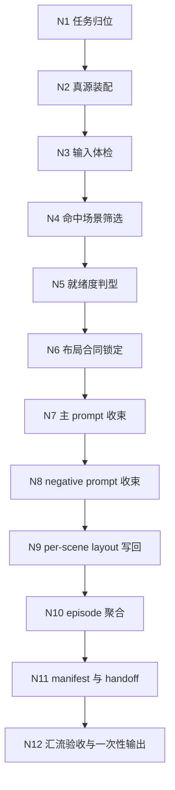
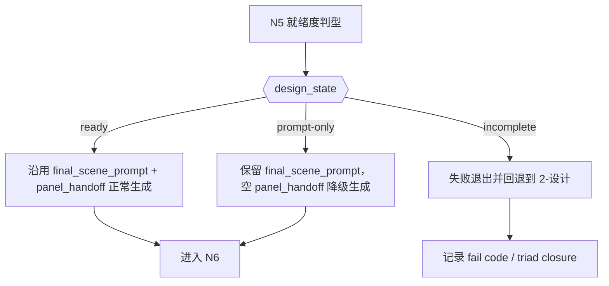
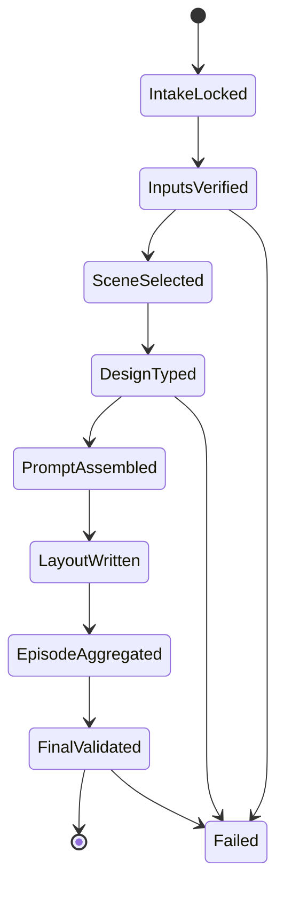
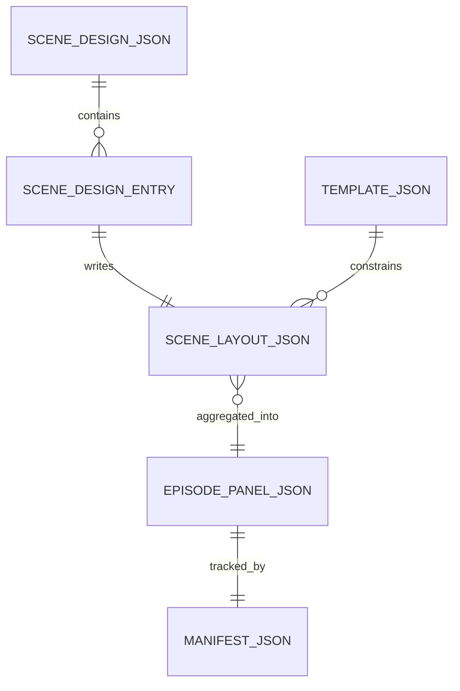

# 4-Design / 1-场景 / 3-面板

## 概述

`3-面板` 负责把 `2-设计` 已收束的场景设计 carrier，继续整理成可展示、可审阅、可被 `5-Image` 或人工流程继续消费的场景面板 layout package。

它的工作不是再造第二份场景设计稿，也不是直接进入图片生成。它只做一件事：把 `场景设计.json` 中已经稳定的空间事实、布局意图与禁区信息，收束为统一的 16:9 九宫格 scene panel carrier。

本轮采用 `skill-知行合一` 的单一真源编排，且显式关闭“复杂链路的骨架 / 细则分层”：

- 所有关键规则、思行节点、分支、回退、字段表、输出契约都直接写在本 `SKILL.md`
- `references/` 不再承载规范真源，避免形成第二条平行主链
- 复杂度通过更细的思行节点来表达，而不是拆散到多份说明文件

交付类型：`内容输出型`

## When to Use

- 已有 `projects/aigc/<项目名>/4-Design/场景/2-设计/第N集/场景设计.json`，需要继续生成场景面板 carrier。
- 需要把 `final_scene_prompt + panel_handoff + reverse_taboos` 收束为 16:9、3x3、9-panel 的 scene sheet prompt。
- 需要为后续 `5-Image`、人工审阅或其他下游装配保留 machine-first JSON carrier。
- 用户明确要求“场景面板 / 场景展示板 / scene panel / 九宫格场景设计页”。

## When Not to Use

- 当前还没有 `2-设计` 的合法输入，应先回退到 `4-Design/场景/2-设计`。
- 当前任务是补场景设计字段或改场景设计世界观，不应越权停留在本阶段。
- 当前任务是直接生图、视频或镜头请求，应进入 `5-Image` 或 `6-Video`。

## Business Requirement Analysis Contract

### 业务目标

- 把 `2-设计` 的场景设计事实，收束成稳定、可追溯、可批量消费的 scene panel layout package。
- 保留空间逻辑、光线逻辑、材质逻辑和禁区约束，不把场景设计阶段重新解释一遍。
- 为后续生图或审稿提供 machine-first 输出，而不是只给人读文案。

### 业务对象

- 输入对象：`scene_designs[]`
- 核心字段：`scene_key`、`scene_name`、`scene_variant`、`source_scene_ids`、`final_scene_prompt`、`panel_handoff`、`reverse_taboos`
- 模板对象：`templates/scene-panel-layout.template.json`
- 输出对象：`场景面板.json`、`<scene_key>-layout.json`、可选 `_manifest.json`

### 约束与风险

- 第一输入根必须是 `场景设计.json`，不得回退成从导演 JSON 直接发明面板。
- 布局合同固定为 `16:9 + 3x3 + 9 panels`。
- 本阶段只产出 JSON carrier，不直接出图。
- episode 聚合 carrier 与 per-scene layout 必须同源，不能各写各的。
- negative prompt 必须稳定继承模板禁区与 `reverse_taboos`。

### 成功标准

- 每个命中场景都能生成稳定的 `identity_badge + panel_prompt + negative_prompt`。
- 每个 `<scene_key>-layout.json` 都能回链到 `场景设计.json`。
- `场景面板.json` 能完整聚合本轮命中场景，顺序与上游命中顺序一致。
- 输出仍停在 JSON carrier，不越权进入生图。

### 非目标

- 不补写 `场景设计.json`
- 不替代 `2-设计` 的思考与设计判断
- 不自动触发图像或视频生成
- 不把逐场景 Markdown 卡片重写成新真源

### 拓扑判断

- 本技能的复杂度主要来自：输入体检、场景就绪度判型、prompt 收束、JSON 双层同源写回、汇流验收
- 最优拓扑为：`串行主干 + 条件分支 + 最终汇流`
- 由于用户明确要求 `复杂链路的骨架 / 细则分层 = false`，所以采用 `inline-full-spec` 模式：所有关键细则直接内嵌于本 `SKILL.md`

## Canonical Anchors

| 载体 | 位置 | 作用 |
| --- | --- | --- |
| 场景设计真源 | `projects/aigc/<项目名>/4-Design/场景/2-设计/第N集/场景设计.json` | 本阶段第一输入根 |
| 逐场景设计卡 | `projects/aigc/<项目名>/4-Design/场景/2-设计/第N集/<scene_key>.md` | 人读审阅与局部字段回看 |
| 面板模板 | `templates/scene-panel-layout.template.json` | 固定 16:9 九宫格布局合同 |
| 执行脚本 | `scripts/generate_scene_panels.py` | 负责模板装配、批量生成与落盘 |
| 场景面板输出根 | `projects/aigc/<项目名>/4-Design/场景/3-面板/第N集/` | 本阶段 canonical 输出根 |

## 子技能边界

### `3-面板` 拥有

- `scene design -> scene panel` 的 prompt 收束合同
- `场景面板.json + <scene_key>-layout.json + _manifest.json` 的写回权
- 九宫格布局合同、identity badge、negative prompt 与 handoff 元信息的统一收束
- 指向 `5-Image / 人工审阅` 的下一入口说明

### `3-面板` 不拥有

- 改写 `场景设计.json` 或逐场景设计卡
- 直接生成图片、视频或模型执行结果
- 从导演 JSON、故事文本或灵感文案直接编造场景面板

## Total Input Contract

### 必需输入

1. `projects/aigc/<项目名>/4-Design/场景/2-设计/第N集/场景设计.json`
2. `templates/scene-panel-layout.template.json`

### 补充输入

1. `projects/aigc/<项目名>/4-Design/场景/2-设计/第N集/<scene_key>.md`
2. `projects/aigc/<项目名>/2-Global/全局风格.md`
3. `projects/aigc/<项目名>/2-Global/类型元素.md`
4. `projects/aigc/<项目名>/2-Global/导演意图.md`

### 命名合同

- episode 输出目录：`projects/aigc/<项目名>/4-Design/场景/3-面板/第N集/`
- episode carrier：`场景面板.json`
- per-scene carrier：`<scene_key>-layout.json`
- manifest：`_manifest.json`

### CLI 合同

```bash
python3 .agents/skills/aigc/4-Design/3-面板设计/场景/scripts/generate_scene_panels.py \
  --project "<项目名>" \
  --episode "第1集"
```

可选参数：

- `--scene-key <scene_key>`：只生成单个场景面板
- `--design-file <path>`：显式指定 `场景设计.json`
- `--output-root <path>`：覆盖默认输出根
- `--dry-run`：只打印将写出的目标文件，不落盘
- `--force`：覆盖已存在输出

### 硬规则

1. 脚本只承接模板装配与落盘，不得替代 `2-设计` 的结构化思考。
2. 若 `scene_designs[]` 缺少 `scene_key` 或 `final_scene_prompt`，必须失败退出，不得静默补空。
3. 若输出已存在，默认不覆盖；除非显式传 `--force`。
4. 本阶段不得自动调用图片生成或视频生成脚本。

## Visual Maps









## Topology Contract

### 主干

- `任务归位 -> 真源装配 -> 输入体检 -> 命中筛选 -> 就绪度判型 -> prompt 收束 -> per-scene 写回 -> episode 聚合 -> handoff -> 汇流验收`

### 条件分支

- `ready`：正常使用 `final_scene_prompt + panel_handoff + reverse_taboos`
- `prompt-only`：允许降级生成，但必须保留空 `panel_handoff`
- `incomplete`：失败退出，禁止编造

### 回退门

- 输入缺失：回退到 `2-设计`
- 模板漂移：回退到模板或脚本真源
- prompt/negative prompt 空洞：回退到对应收束节点，不整盘重写
- output 同源性失效：回退到写回与聚合节点

### 汇流门

- 全部命中场景均通过字段门
- `场景面板.json` 与所有 `<scene_key>-layout.json` 路径一致、顺序一致、回链一致
- 输出停在 JSON carrier，并给出下一入口与 triad closure

## Thinking-Action Node Network

### N1 任务归位

- `node_id`: `N1-task-positioning`
- `objective`: 判断当前任务是否属于 `4-Design/场景/3-面板`
- `inputs`: 用户诉求、上游阶段状态、输出目标
- `着手方面`:
  1. 判断用户要的是 panel carrier 还是场景设计本身
  2. 判断当前是否已具备 `2-设计` 产物
  3. 锁定本阶段只写 JSON，不进入生图
- `actions`:
  1. 锁定本阶段边界与不拥有事项
  2. 明确输出根、停点和下游入口
- `evidence`: 阶段定位说明、输入根与输出根确认结果
- `route_out`: 归位成功进入 `N2`；归位失败回退父级类目路由
- `gate`: 若任务主语不是场景面板，则不得继续

### N2 真源装配

- `node_id`: `N2-source-assembly`
- `objective`: 装配本轮需要读取的真源与补充上下文
- `inputs`: `场景设计.json` 路径、模板路径、逐场景 Markdown 可用性
- `着手方面`:
  1. 锁定第一输入根为 `场景设计.json`
  2. 判断是否需要读取 `逐场景设计卡`
  3. 确认模板、脚本与输出目录是否一致
- `actions`:
  1. 读取 `场景设计.json`
  2. 读取 `scene-panel-layout.template.json`
  3. 记录补充输入是否存在，但不让其越权成为第一真源
- `evidence`: 输入清单、路径合法性、模板版本信息
- `route_out`: 真源齐备进入 `N3`
- `gate`: 缺第一输入根或模板时，必须失败退出

### N3 输入体检

- `node_id`: `N3-input-healthcheck`
- `objective`: 检查 `scene_designs[]` 是否足以支撑 panel 生成
- `inputs`: `scene_designs[]`、模板布局字段
- `着手方面`:
  1. 检查 `scene_designs[]` 是否存在且非空
  2. 检查模板中 `aspect_ratio / grid / panel_count` 是否齐备
  3. 检查每个 entry 的最小必需字段
- `actions`:
  1. 拒绝空 `scene_designs[]`
  2. 标记缺字段的 entry
  3. 输出本轮可命中范围与风险范围
- `evidence`: 输入体检结论、缺口列表
- `route_out`: 通过进入 `N4`；失败则给出 fail code 并回退 `2-设计`
- `gate`: 不允许带着缺 `scene_key` / 缺 `final_scene_prompt` 的 entry 继续

### N4 命中场景筛选

- `node_id`: `N4-scene-selection`
- `objective`: 锁定本轮实际参与生成的场景集合
- `inputs`: 全量 `scene_designs[]`、可选 `scene_key` 过滤条件
- `着手方面`:
  1. 整集批量还是单场景返工
  2. 命中顺序是否与上游一致
  3. 是否出现筛选后空集
- `actions`:
  1. 应用 `scene_key` 过滤
  2. 保留原始顺序
  3. 生成 `selected_scene_keys`
- `evidence`: 命中场景列表
- `route_out`: 有命中进入 `N5`
- `gate`: 筛选结果为空必须失败退出

### N5 就绪度判型

- `node_id`: `N5-design-typing`
- `objective`: 判断每个命中场景处于 `ready / prompt-only / incomplete` 哪种状态
- `inputs`: `final_scene_prompt`、`panel_handoff`、`scene_key`
- `着手方面`:
  1. 是否同时具备 `final_scene_prompt + panel_handoff + scene_key`
  2. 是否只有 `final_scene_prompt`
  3. 是否缺关键字段导致禁止生成
- `actions`:
  1. 给每个场景打 `design_state`
  2. 为降级场景标记 `panel_handoff` 为空但允许继续
  3. 为不完整场景直接触发失败
- `evidence`: `design_state` 判型结果
- `route_out`: `ready/prompt-only` 进入 `N6`；`incomplete` 回退 `2-设计`
- `gate`: 禁止对 `incomplete` 场景编造 prompt

### N6 布局合同锁定

- `node_id`: `N6-layout-lock`
- `objective`: 把模板中的布局合同稳定继承到本轮所有输出
- `inputs`: 模板 JSON 的 `layout / panel_sheet_contract / layout_generation_prompt`
- `着手方面`:
  1. `16:9 / 3x3 / 9 panels` 是否明确
  2. 统一空间 sheet 的约束是否明确
  3. critical requirements 是否可继承到 prompt
- `actions`:
  1. 读取模板布局参数
  2. 固化本轮 `layout_contract`
  3. 准备供 prompt 收束与 JSON 写回复用的布局字段
- `evidence`: 统一的 `layout_contract`
- `route_out`: 进入 `N7`
- `gate`: 模板布局字段缺失时不得继续

### N7 主 prompt 收束

- `node_id`: `N7-panel-prompt-assembly`
- `objective`: 为每个命中场景合成稳定的 `panel_prompt`
- `inputs`: `scene_key`、`scene_name`、`final_scene_prompt`、`panel_handoff`、模板布局合同
- `着手方面`:
  1. `identity_badge` 是否稳定包含 `scene_key + scene_name`
  2. `final_scene_prompt` 是否保留为第一空间事实来源
  3. `panel_handoff` 是否只补布局视角，不覆盖空间事实
  4. 模板布局与 critical requirements 是否进入主 prompt
- `actions`:
  1. 生成 `identity_badge`
  2. 组装 `final_scene_prompt + panel_handoff + canvas_setup + constraints + critical_requirements`
  3. 对 `prompt-only` 场景保留空 `panel_handoff` 的降级痕迹
- `evidence`: 每场景 `panel_prompt`
- `route_out`: 进入 `N8`
- `gate`: `panel_prompt` 不得为空，不得直接照抄大段无关 reasoning

### N8 Negative Prompt 收束

- `node_id`: `N8-negative-assembly`
- `objective`: 保证每个场景的 negative prompt 同时继承模板禁区与设计禁区
- `inputs`: `reverse_taboos[]`、模板 `negative_prompt_*`
- `着手方面`:
  1. `reverse_taboos[]` 是否存在
  2. 模板默认 negative 是否齐备
  3. 固定门禁是否追加完整
- `actions`:
  1. 优先拼接模板 negative 段
  2. 追加 `reverse_taboos[]`
  3. 保留固定门禁：`no humans, no creatures, no text clutter, no panel overlap`
- `evidence`: 每场景 `negative_prompt`
- `route_out`: 进入 `N9`
- `gate`: negative prompt 不得遗漏模板硬禁区

### N9 Per-Scene Layout 写回

- `node_id`: `N9-layout-writeback`
- `objective`: 为每个命中场景写出同源的 `<scene_key>-layout.json`
- `inputs`: `panel_prompt`、`negative_prompt`、`layout_contract`、场景身份字段
- `着手方面`:
  1. 路径命名是否稳定
  2. `subject` 与 `meta` 是否能回链上游
  3. `output_hint` 是否指向正确下游
- `actions`:
  1. 写 `meta / subject / layout_contract / prompt / negative_prompt / panel_handoff / output_hint`
  2. 路径固定为 `<scene_key>-layout.json`
  3. 默认不覆盖已有输出，除非显式 `--force`
- `evidence`: 实际落盘的 per-scene layout 文件
- `route_out`: 全部 layout 写完进入 `N10`
- `gate`: 不得只写 episode carrier 而漏掉 per-scene layout

### N10 Episode 聚合

- `node_id`: `N10-episode-aggregation`
- `objective`: 生成 `场景面板.json`，作为本阶段 machine-first canonical carrier
- `inputs`: 全部 per-scene layout 衍生字段、episode 元信息
- `着手方面`:
  1. 聚合顺序是否与命中顺序一致
  2. `layout_path` 是否可回链实际文件
  3. 是否保留 `design_markdown_path`
- `actions`:
  1. 组装 `meta`
  2. 组装 episode 级 `layout_contract`
  3. 组装 `panels[]`
- `evidence`: `场景面板.json`
- `route_out`: 进入 `N11`
- `gate`: `场景面板.json` 与 per-scene layout 必须同源，不能独立生长

### N11 Manifest 与 Handoff 收束

- `node_id`: `N11-manifest-handoff`
- `objective`: 输出本轮命中、输入、输出与下一入口说明
- `inputs`: `selected_scene_keys`、输入路径、输出路径、review 状态
- `着手方面`:
  1. 是否记录了本轮所有输入与输出
  2. 是否标明继续进入 `5-Image` 或人工审阅
  3. 是否保留 review 状态与 triad closure 所需证据
- `actions`:
  1. 写 `_manifest.json`
  2. 生成下一入口说明
  3. 汇总本轮可追溯证据包
- `evidence`: `_manifest.json` 与 handoff 说明
- `route_out`: 进入 `N12`
- `gate`: 没有 manifest 或下一入口说明，不得结案

### N12 汇流验收与一次性输出

- `node_id`: `N12-convergence-finalize`
- `objective`: 统一收束本轮结果，对用户或上游只交付一个完成口径
- `inputs`: 所有输出文件、字段门通过情况、阻塞或降级信息
- `着手方面`:
  1. 双层 carrier 是否同源
  2. 失败或降级是否已被标明
  3. 输出是否仍停在 JSON carrier
  4. 用户闭环是否包含思考过程与 triad closure
- `actions`:
  1. 运行最终字段门检查
  2. 形成唯一 final output 口径
  3. 产出 `最终产物 + 思考过程 + 关键依据 + 风险/阻塞 + 下一步`
- `evidence`: 最终 closure、通过的产物路径
- `route_out`: 结案或按 fail code 回退具体节点
- `gate`: 未通过汇流门时，不得宣称完成

## Field Master

| field_id | 输出位置/字段 | 内容要求 | 默认责任 Node | 质量维度 | 失败码 |
| --- | --- | --- | --- | --- | --- |
| FIELD-SCN-PANEL-01 | 阶段定位 | 明确 `3-面板` 只消费 `2-设计`，只产出 panel carrier | N1 | 边界清晰度 | FAIL-SCN-PANEL-01 |
| FIELD-SCN-PANEL-02 | 输入锚点 | 锁定 `场景设计.json + 模板 + 可选设计卡` | N2-N3 | 输入完备性 | FAIL-SCN-PANEL-02 |
| FIELD-SCN-PANEL-03 | 命中与判型 | `scene selection + design_state` 合法 | N4-N5 | 分支稳定性 | FAIL-SCN-PANEL-03 |
| FIELD-SCN-PANEL-04 | 布局合同 | 固定 `16:9 + 3x3 + 9 panels` | N6 | 布局一致性 | FAIL-SCN-PANEL-04 |
| FIELD-SCN-PANEL-05 | 主 prompt | `identity_badge + final_scene_prompt + panel_handoff + layout constraints` 可执行 | N7 | prompt 可执行性 | FAIL-SCN-PANEL-05 |
| FIELD-SCN-PANEL-06 | negative prompt | 模板禁区、`reverse_taboos` 与固定门禁完整 | N8 | 禁区完整性 | FAIL-SCN-PANEL-06 |
| FIELD-SCN-PANEL-07 | per-scene carrier | `<scene_key>-layout.json` 路径、结构、回链稳定 | N9 | 局部输出完整性 | FAIL-SCN-PANEL-07 |
| FIELD-SCN-PANEL-08 | episode carrier | `场景面板.json` 与 per-scene layout 同源 | N10 | 聚合完整性 | FAIL-SCN-PANEL-08 |
| FIELD-SCN-PANEL-09 | manifest/handoff | `_manifest.json` 与下一入口说明完整 | N11 | handoff 清晰度 | FAIL-SCN-PANEL-09 |
| FIELD-SCN-PANEL-10 | 一次性输出 | final output 含思考过程、triad closure、风险说明 | N12 | 收束质量 | FAIL-SCN-PANEL-10 |

## Thought Pass Map

| node_id | 聚焦字段 | 核心问题 | 生成动作 | 未达标信号 |
| --- | --- | --- | --- | --- |
| N1 | FIELD-SCN-PANEL-01 | 当前是不是 `3-面板` 问题 | 锁定阶段边界、停点与不拥有事项 | 开始补场景设计或直接出图 |
| N2 | FIELD-SCN-PANEL-02 | 该读哪些真源 | 装配输入根、模板与补充上下文 | 让补充上下文越权成第一真源 |
| N3 | FIELD-SCN-PANEL-02 | 输入是否足以做面板 | 检查 `scene_designs[]` 与模板字段 | 缺关键字段仍继续 |
| N4 | FIELD-SCN-PANEL-03 | 本轮命中哪些场景 | 生成命中列表并保留顺序 | 筛选后空集仍继续 |
| N5 | FIELD-SCN-PANEL-03 | 场景是 ready、prompt-only 还是 incomplete | 对每场景做判型与降级/失败决策 | 对 incomplete 编造 prompt |
| N6 | FIELD-SCN-PANEL-04 | 布局合同是否稳定 | 继承模板布局与约束 | 布局漂移 |
| N7 | FIELD-SCN-PANEL-05 | 主 prompt 是否来自设计真源 | 收束 `panel_prompt` | 大段抄录 reasoning 或漏掉 layout |
| N8 | FIELD-SCN-PANEL-06 | negative prompt 是否完整 | 合成禁区与固定门禁 | 漏 `reverse_taboos` 或模板硬禁区 |
| N9 | FIELD-SCN-PANEL-07 | per-scene layout 是否正确落盘 | 写 `<scene_key>-layout.json` | 只写一层 carrier |
| N10 | FIELD-SCN-PANEL-08 | episode 聚合是否同源 | 写 `场景面板.json` | 顺序错乱或 layout_path 失配 |
| N11 | FIELD-SCN-PANEL-09 | handoff 与审阅证据是否齐 | 写 `_manifest.json` 与下一入口 | 无法继续进入下游 |
| N12 | FIELD-SCN-PANEL-10 | 能否以唯一口径结案 | 汇流验收、输出思考过程与 triad closure | 只能罗列过程，不能给出完成口径 |

## Pass Table

| field_id | Pass Standard | Fail Code | Rework Entry |
| --- | --- | --- | --- |
| FIELD-SCN-PANEL-01 | 阶段边界、上下游职责与输出停点明确 | FAIL-SCN-PANEL-01 | N1 |
| FIELD-SCN-PANEL-02 | 输入根、模板与最小字段体检通过 | FAIL-SCN-PANEL-02 | N2-N3 |
| FIELD-SCN-PANEL-03 | 命中范围合法、判型稳定且不对 incomplete 编造 | FAIL-SCN-PANEL-03 | N4-N5 |
| FIELD-SCN-PANEL-04 | 布局合同稳定继承模板 | FAIL-SCN-PANEL-04 | N6 |
| FIELD-SCN-PANEL-05 | `panel_prompt` 可执行且可回链上游事实 | FAIL-SCN-PANEL-05 | N7 |
| FIELD-SCN-PANEL-06 | `negative_prompt` 完整继承禁区 | FAIL-SCN-PANEL-06 | N8 |
| FIELD-SCN-PANEL-07 | per-scene layout 命名、路径、字段稳定 | FAIL-SCN-PANEL-07 | N9 |
| FIELD-SCN-PANEL-08 | episode carrier 与 per-scene layout 同源且顺序一致 | FAIL-SCN-PANEL-08 | N10 |
| FIELD-SCN-PANEL-09 | manifest、下一入口与证据链齐全 | FAIL-SCN-PANEL-09 | N11 |
| FIELD-SCN-PANEL-10 | final output 具唯一口径、思考过程与 triad closure | FAIL-SCN-PANEL-10 | N12 |

## Type Strategy Contract

### Design Completeness Strategy

| design_state | 判定信号 | 面板策略 | 说明 |
| --- | --- | --- | --- |
| `ready` | 具备 `final_scene_prompt + panel_handoff + scene_key` | 正常生成 panel carrier | 默认状态 |
| `prompt-only` | 只有 `final_scene_prompt`，缺 `panel_handoff` | 允许生成，但在输出中保留空 `panel_handoff` | 低风险降级 |
| `incomplete` | 缺 `final_scene_prompt` 或缺 `scene_key` | 失败退出 | 禁止编造 |

### Output Mode Strategy

| mode | 产物 | 用途 |
| --- | --- | --- |
| `episode-batch` | `场景面板.json + 多个 <scene_key>-layout.json` | 默认整集面板整理 |
| `single-scene` | 单个 `<scene_key>-layout.json` + 更新后的 `场景面板.json` | 局部返工或增补 |
| `dry-run` | 仅打印将生成的文件清单 | 验证命名和命中范围 |

### Negative Prompt Strategy

1. 优先使用模板 `negative_prompt_global + negative_prompt_layout + negative_prompt_motion`。
2. 若存在 `reverse_taboos[]`，则追加到 negative prompt。
3. 固定门禁必须保留：`no humans, no creatures, no text clutter, no panel overlap`。
4. 不得把 `2-设计` 的大段 reasoning 直接塞进 negative prompt。

### Conflict Tie-Break

1. `场景设计.json` 的字段高于逐场景 Markdown 卡片。
2. `panel_handoff` 高于脚本自行猜测的布局解释。
3. 若 `final_scene_prompt` 与 `panel_handoff` 冲突，优先保留 `final_scene_prompt` 的空间事实，`panel_handoff` 只补布局视角。
4. 若模板与技能合同冲突，以本 `SKILL.md` 为准。

## Canonical Output Contract

### 1. Episode 级 `场景面板.json`

路径：

`projects/aigc/<项目名>/4-Design/场景/3-面板/第N集/场景面板.json`

最小骨架：

```json
{
  "meta": {
    "project_name": "项目名",
    "episode_id": "第1集",
    "source_scene_design": "projects/aigc/<项目名>/4-Design/场景/2-设计/第1集/场景设计.json",
    "skill_id": "aigc/4-Design/场景/3-面板",
    "generated_at": "2026-04-12T12:00:00-07:00"
  },
  "layout_contract": {
    "aspect_ratio": "16:9",
    "panel_count": 9,
    "grid": "3x3"
  },
  "panels": [
    {
      "scene_key": "ancient-hall--night",
      "scene_name": "皇城大殿",
      "scene_variant": "夜",
      "identity_badge": "ancient-hall--night + 皇城大殿",
      "source_scene_ids": [
        "1-1-10-1"
      ],
      "panel_prompt": "",
      "negative_prompt": "",
      "panel_handoff": "",
      "layout_path": "projects/aigc/<项目名>/4-Design/场景/3-面板/第1集/ancient-hall--night-layout.json",
      "design_markdown_path": "projects/aigc/<项目名>/4-Design/场景/2-设计/第1集/ancient-hall--night.md"
    }
  ]
}
```

### 2. Per-scene `*-layout.json`

路径：

`projects/aigc/<项目名>/4-Design/场景/3-面板/第N集/<scene_key>-layout.json`

最小骨架：

```json
{
  "meta": {
    "project_name": "项目名",
    "episode_id": "第1集",
    "scene_key": "ancient-hall--night",
    "scene_name": "皇城大殿",
    "source_scene_design": "projects/aigc/<项目名>/4-Design/场景/2-设计/第1集/场景设计.json"
  },
  "subject": {
    "scene_key": "ancient-hall--night",
    "scene_name": "皇城大殿",
    "scene_variant": "夜",
    "identity_badge": "ancient-hall--night + 皇城大殿",
    "source_scene_ids": [
      "1-1-10-1"
    ]
  },
  "layout_contract": {
    "aspect_ratio": "16:9",
    "panel_count": 9,
    "grid": "3x3"
  },
  "prompt": "",
  "negative_prompt": "",
  "panel_handoff": "",
  "output_hint": {
    "downstream_stage": "5-Image",
    "suggested_filename": "ancient-hall--night-ScenePanel.png"
  }
}
```

### 3. `_manifest.json`

```json
{
  "episode_id": "第1集",
  "selected_scene_keys": [
    "ancient-hall--night"
  ],
  "source_inputs": [],
  "output_files": [],
  "review_status": "pass"
}
```

### Hard Rules

1. `场景面板.json` 必须覆盖本轮命中的所有场景，顺序与 `场景设计.json.scene_designs[]` 命中顺序一致。
2. 每个 `panels[].layout_path` 必须对应一个实际存在的 `<scene_key>-layout.json`。
3. `identity_badge` 必须稳定包含 `scene_key + scene_name`。
4. `panel_prompt` 不得为空，且必须可回链到 `final_scene_prompt / panel_handoff`。
5. `_manifest.json` 只记录本轮输入、输出、命中、统计与 review 状态，不承载场景设计事实。

## Convergence Contract

只有同时满足以下条件，才允许宣称本轮完成：

1. 所有命中场景都已通过 `FIELD-SCN-PANEL-01` 到 `FIELD-SCN-PANEL-10` 的门禁。
2. `场景面板.json`、全部 `<scene_key>-layout.json`、`_manifest.json` 已全部落盘或在 `dry-run` 中完整列出。
3. 输出路径全部位于 `projects/aigc/<项目名>/4-Design/场景/3-面板/第N集/`。
4. 未发生越权出图、越权改写 `2-设计` 产物或从导演 JSON 直接编造面板。
5. 用户侧 closure 已包含：
   - 最终产物
   - 思考过程
   - 关键依据
   - 风险 / 阻塞
   - 下一步入口

## One-Shot Output Contract

本技能最终只允许一个 canonical final output 口径：

1. `最终产物`
   当前集的 `场景面板.json`、命中场景的 `<scene_key>-layout.json`、可选 `_manifest.json`
2. `思考过程`
   说明为何采用当前命中范围、判型结果、prompt 收束逻辑、negative 合成逻辑与汇流判断
3. `关键依据`
   `场景设计.json`、模板合同、脚本执行或 dry-run 证据
4. `风险 / 例外`
   哪些场景是 `prompt-only` 降级、哪些场景被阻塞
5. `下一步`
   进入 `5-Image` 或人工审阅

禁止输出多个互不收束的半成品结论。

## Root-Cause Execution Contract (Mandatory)

当出现以下症状时，必须先修本子技能合同，而不是只改某一条 prompt：

- `3-面板` 直接跳过 `2-设计`，从导演 JSON 或灵感文本发明场景面板。
- 面板 carrier 只有文案，没有 machine-first JSON。
- 逐场景 layout 与 episode 级 panel carrier 不同源，出现第二真源。
- `3-面板` 越权调用图片生成，把 `4-Design` 与 `5-Image` 边界打穿。
- 输出仍沿用旧仓 `output/影片/.../3-设定/4-面板` 路径，而不是当前 `projects/aigc/<项目名>/4-Design/...`。
- 主合同与旧 `references/*.md` 同时演化，出现并行真源。

必经链路：

`Symptom -> Direct Technical Cause -> Rule Source -> Meta Rule Source -> Fix Landing Points`

优先检查：

- `Rule Source`
  - `.agents/skills/aigc/4-Design/3-面板设计/场景/SKILL.md`
  - `.agents/skills/aigc/4-Design/3-面板设计/场景/CONTEXT.md`
  - `.agents/skills/aigc/4-Design/3-面板设计/场景/templates/scene-panel-layout.template.json`
  - `.agents/skills/aigc/4-Design/3-面板设计/场景/scripts/generate_scene_panels.py`
- `Meta Rule Source`
  - `.agents/skills/aigc/4-Design/2-主体设计/场景/SKILL.md`
  - `.agents/skills/aigc/4-Design/1-主体清单/场景/SKILL.md`
  - `.agents/skills/aigc/SKILL.md`
  - 根 `AGENTS.md`
  - `/Users/vincentlee/.codex/skills/meta/构建/技能/skill-知行合一/SKILL.md`

面向用户的闭环固定返回：

1. `root cause location`
2. `immediate fix`
3. `systemic prevention fix`
4. `layered trace`

## Context Preload (Mandatory)

1. 根 `AGENTS.md`
2. `.agents/skills/aigc/SKILL.md + CONTEXT.md`
3. `.agents/skills/aigc/4-Design/SKILL.md + CONTEXT.md`
4. `.agents/skills/aigc/4-Design/3-面板设计/SKILL.md + CONTEXT.md`
5. `.agents/skills/aigc/4-Design/2-主体设计/场景/SKILL.md + CONTEXT.md`
6. 本 `SKILL.md + CONTEXT.md`
7. `.agents/skills/aigc/4-Design/1-主体清单/场景/SKILL.md + CONTEXT.md`（按需回看）
8. 按需读取：
   - `templates/scene-panel-layout.template.json`
   - `scripts/generate_scene_panels.py`
   - `projects/aigc/<项目名>/4-Design/场景/2-设计/第N集/场景设计.json`
   - `projects/aigc/<项目名>/4-Design/场景/2-设计/第N集/<scene_key>.md`

优先级：

`用户显式请求 > 根 AGENTS.md > aigc 根技能 > 4-Design 阶段父级 > 3-面板设计 tranche 父级 > 4-Design/2-主体设计/场景 上游技能 > 本 SKILL.md > 各级 CONTEXT.md`

## Completion Criteria

- 已把场景面板阶段的规范真源收束为单一 `SKILL.md`，不再依赖平行 `references/*.md`。
- 已保留现有配置的业务机制：输入锚点、模板合同、脚本 CLI、判型逻辑、输出骨架、handoff 边界。
- 已提供细粒度思行节点网络，且每个关键节点都有明确目标、着手方面、动作、证据、路由和门禁。
- 已明确本阶段只生成 JSON carrier，不直接生图。
- 已给出 final output、思考过程、triad closure 与下一入口。
