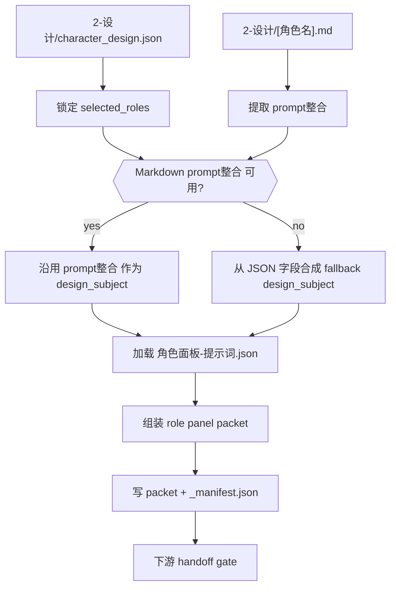
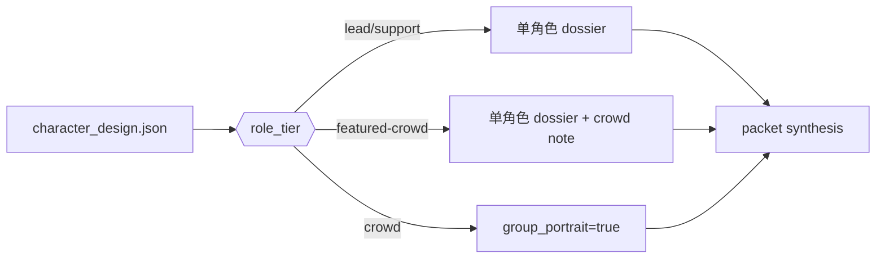
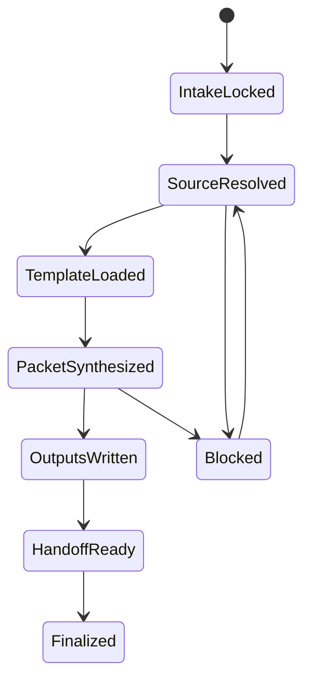
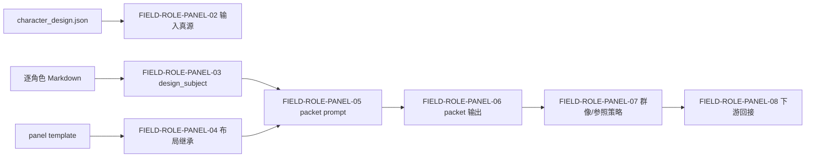

# 4-Design / 2-角色 / 3-面板

## 概述

`3-面板` 是 `4-Design/角色` 下承接 `2-设计` 的角色展示面板叶子技能，负责把：

1. `character_design.json`
2. 逐角色 Markdown 设计卡

收束成可下游继续消费的 **角色面板 layout packet**。

本轮重排遵循知行合一，但保持现有内容与机制不变：

- 第一输入根仍是 `2-设计/character_design.json`
- `prompt整合` 仍是首选 `design_subject` 来源
- fallback 仍是基于 `character_design.json` 的保守 synthesis
- `templates/角色面板-提示词.json` 仍是 layout/template 真源
- `scripts/build_character_panel_packets.py` 仍是最小 runner

本技能额外锁定：

- `复杂链路的骨架 / 细则分层 = false`
- 因此 prompt 来源判型、role tier 策略、reference image 处理、输出结构与 handoff 规则都必须写在本 `SKILL.md`
- `references/` 仅保留迁移 stub，不再承载平行执行真源

交付类型：`内容输出型 direct leaf`

## When to Use

- 已有 `projects/aigc/<项目名>/4-Design/角色/2-设计/第N集/character_design.json`，需要继续生成角色面板布局包。
- 需要把逐角色 Markdown 中的 `prompt整合` 收束成稳定的角色面板 prompt。
- 需要为后续角色多视图生图、角色展示板审阅或 layout review 保留 machine-first packet。
- 用户明确要求“角色面板 / 角色展示板 / dossier / CHARACTER_ATMOSPHERIC_DOSSIER”。

## When Not to Use

- 还没有 `2-设计` 的角色设计稿，应先回到 `4-Design/角色/2-设计`。
- 当前任务是继续补角色对象池，应回到 `1-清单`。
- 当前任务是直接执行图片生成，应进入 `5-Image` 或相关 API 技能，而不是在本阶段越权出图。

## Business Requirement Analysis Contract (Mandatory)

| analysis_slot | 当前结论 |
| --- | --- |
| `business_goal` | 把角色设计稿和 `prompt整合` 压成可直接下游消费的 layout packet，而不是再造第二份角色设计真源 |
| `business_object` | `character_design.json`、逐角色 Markdown、角色面板模板、可选 reference images |
| `constraint_profile` | 第一输入根必须是 `character_design.json`；只做 packet 不出图；若 Markdown 不足只允许保守 fallback |
| `success_criteria` | 每个命中角色都生成稳定 packet、`design_subject_source` 可追溯、layout 完整继承模板、manifest 与 packet 数一致 |
| `non_goals` | 不修改 `character_design.json`、不重扫导演 JSON、不断言替代生图阶段 |
| `complexity_source` | `prompt整合` 优先级、Markdown 缺失回退、group/crowd 策略、reference image 继承、template 与主体 prompt 的汇流 |
| `topology_fit` | 串行锁输入与角色范围，中段分支判断 prompt 来源与群像策略，后段汇流写 packet 与 manifest |
| `step_strategy` | 采用“串行主干 + prompt 来源判型 + packet 汇流写回”的单技能思行网络 |

## Context Preload (Mandatory)

1. 根 `AGENTS.md`
2. `.agents/skills/aigc/SKILL.md + CONTEXT.md`
3. `.agents/skills/aigc/4-Design/SKILL.md + CONTEXT.md`
4. `.agents/skills/aigc/4-Design/3-面板设计/SKILL.md + CONTEXT.md`
5. `.agents/skills/aigc/4-Design/2-主体设计/角色/SKILL.md + CONTEXT.md`
6. 本 `SKILL.md + CONTEXT.md`
7. `.agents/skills/aigc/4-Design/3-面板设计/角色/_shared/IO_CONTRACT.md`
8. `.agents/skills/aigc/4-Design/1-主体清单/角色/SKILL.md + CONTEXT.md`（按需回看）
9. `templates/角色面板-提示词.json`
10. `scripts/build_character_panel_packets.py`
11. `projects/aigc/<项目名>/4-Design/角色/2-设计/第N集/character_design.json`
12. `projects/aigc/<项目名>/4-Design/角色/2-设计/第N集/[角色名].md`
13. 可选 `projects/aigc/<项目名>/4-Design/角色/1-清单/第N集/角色清单.json`

## Shared Canonical Sources (Mandatory)

- 强制读取：`.agents/skills/aigc/4-Design/3-面板设计/角色/_shared/IO_CONTRACT.md`
- 强制读取：`.agents/skills/aigc/4-Design/3-面板设计/角色/templates/角色面板-提示词.json`
- 强制读取：`.agents/skills/aigc/4-Design/3-面板设计/角色/scripts/build_character_panel_packets.py`

硬规则：

1. 第一输入根固定为 `character_design.json`
2. `prompt整合` 是首选 `design_subject` 提取源；若缺失必须显式记录 fallback
3. packet 是 canonical 停点；若启用 SMART 自动生图，PNG 与 request/report 只作为 derived sidecar
4. `_manifest.json` 只记录输入输出与统计，不反写角色设计事实
5. 输出目录固定为 `projects/aigc/<项目名>/4-Design/角色/3-面板/第N集/`

## Total Input Contract

### 必需输入

- `projects/aigc/<项目名>/4-Design/角色/2-设计/第N集/character_design.json`
- `.agents/skills/aigc/4-Design/3-面板设计/角色/templates/角色面板-提示词.json`

### 可选但优先输入

- `projects/aigc/<项目名>/4-Design/角色/2-设计/第N集/[角色名].md`
  - 首选 `prompt整合` 提取源
- `projects/aigc/<项目名>/4-Design/角色/1-清单/第N集/角色清单.json`
  - identity 与 evidence 补证
- `projects/aigc/<项目名>/3-Detail/第N集.json`
  - 兼容回看，不作为第一 prompt 源
- 角色 Markdown 同目录存在的本地参考图片
- 用户显式给定的 `--reference`

### 禁止输入

- 直接把整份角色 Markdown 原封不动灌进 packet
- 跳过 `2-设计` 重新从导演 JSON 发明角色形象
- 任何要求绕过 packet 直接出图的越权指令

## Visual Maps

## Topology Contract (Mandatory)

### Topology Fit

本技能采用 `串行主干 + prompt 来源判型 + 汇流写回`：

1. 串行主干
   - 锁输入
   - 锁命中角色
   - 加载模板
2. 条件判型
   - `prompt整合` 可用
   - Markdown 缺失或不含 `prompt整合`
   - crowd / featured-crowd / 单角色
   - reference image 有无
3. 汇流写回
   - 合成 `prompt_text`
   - 生成每角色 packet
   - 写 `_manifest.json`
   - 给出下游 handoff

### Variable Register

| var_id | 观测信号 | 状态集合 | 检测方法 | 优先级 |
| --- | --- | --- | --- | --- |
| `V-PROMPT-SOURCE` | 当前角色主体 prompt 来源 | `markdown_prompt_integration/fallback_json_synthesis/blocked` | 读取 Markdown `prompt整合` 或 JSON synthesis | P0 |
| `V-ROLE-TIER` | 角色层级 | `lead/support/featured-crowd/crowd` | 读取 `character_design.json.roles[]` | P0 |
| `V-REFERENCE-IMAGES` | 是否存在可继承参考图 | `local/explicit/none` | 扫描同目录图片或用户显式 `--reference` | P1 |
| `V-TEMPLATE-READY` | 模板是否可读 | `ready/blocked` | 读取 `角色面板-提示词.json` | P0 |

### Design Subject Strategy

| 输入状态 | 默认策略 | 说明 |
| --- | --- | --- |
| Markdown 存在且含 `prompt整合` | 直接抽取 | 首选，最贴近下游消费段 |
| Markdown 存在但无 `prompt整合` | JSON synthesis fallback | 保守回退，并记录来源 |
| Markdown 缺失 | JSON synthesis fallback | 不阻断，但 packet 必须显式标记 fallback |

### Role Tier Strategy

| role_tier | 面板策略 | 说明 |
| --- | --- | --- |
| `lead` | 单角色 dossier | 完整展示角色主体、服装与表情/动作 |
| `support` | 单角色 dossier | 可略缩减叙事气压，但 layout 完整 |
| `featured-crowd` | 单角色 dossier + crowd note | 保留辨识度，但不自动切群像 |
| `crowd` | `group_portrait=true` | 视为同阶层群像设计板，不做单人 turnaround |

### Reference Image Strategy

| 条件 | 动作 |
| --- | --- |
| 角色 Markdown 同目录存在图片 | 写入 `reference_images[]` |
| 只有显式 `--reference` | 按 CLI 顺序写入 `explicit_references[]` |
| 两者都没有 | 继续执行，但 `reference_images[]` 为空 |

### Conflict Tie-Break

1. `character_design.json` 的 canonical identity 优先
2. 逐角色 Markdown 的 `prompt整合` 高于同文件其他段落
3. 模板 layout 与 critical requirements 高于单次自由发挥
4. 若 `prompt整合` 与 `character_design.json` 冲突，优先保守采信 JSON identity，同时保留 Markdown 作为主体文案

## Thinking-Action Node Contract (Mandatory)

每个关键节点必须同时描述判断与动作，至少覆盖以下槽位：

| slot | 要求 |
| --- | --- |
| `node_id` | 稳定节点标识 |
| `objective` | 该节点要解决的判断/动作目标 |
| `inputs` | 进入该节点的输入与依赖 |
| `actions` | 该节点真正执行的动作 |
| `evidence` | 该节点留下的证据、产物或验证结果 |
| `route_out` | 成功、失败、分支时分别流向何处 |
| `gate` | 是否允许进入最终输出汇流 |

## Thinking-Action Node Network

| node_id | 对应 Step | 聚焦字段 | objective | actions | evidence | route_out | gate |
| --- | --- | --- | --- | --- | --- | --- | --- |
| `N1-INTAKE-LOCK` | S1 | `FIELD-ROLE-PANEL-01` | 锁定当前确属 `3-面板` 问题 | 校验 `character_design.json` 是否存在、锁定 episode 输出目录 | phase verdict、input manifest | 成功 -> `N2`；缺设计稿 -> 回 `2-设计` | 阶段边界正确后方可继续 |
| `N2-ROLE-SELECT` | S2 | `FIELD-ROLE-PANEL-02` | 锁定本轮命中角色与 identity | 读取 `roles[]`、确定 `selected_roles[]`、补充 `角色清单.json` 只读证据 | role selection note | 成功 -> `N3`；角色范围不清 -> 回 `S2` | 输入真源稳定 |
| `N3-DESIGN-SUBJECT` | S3 | `FIELD-ROLE-PANEL-03` | 为每个角色锁定唯一 `design_subject` 来源 | 优先抽 `prompt整合`；缺失时执行 JSON synthesis fallback 并写 `design_subject_source` | prompt source note、fallback mark | 成功 -> `N4`；主体不足 -> 回 `2-设计` 或 `S3` | 主体 prompt 必须可追溯 |
| `N4-TEMPLATE-LOAD` | S4 | `FIELD-ROLE-PANEL-04` | 锁定 layout、modules 与 critical requirements | 读取模板，继承 `layout / render_style_contract / rule_profile / prompt_segments` | template load note | 成功 -> `N5`；模板缺失 -> blocked | 模板可读后方可合成 packet |
| `N5-PACKET-SYNTHESIS` | S5 | `FIELD-ROLE-PANEL-05` | 合成同时包含角色主体与 layout 约束的 `prompt_text` | 组合 `design_subject + template layout + rule profile + prompt segments` | `prompt_payload` 草稿 | 成功 -> `N6`；prompt 不完整 -> 回 `S3-S5` | packet 主体完整 |
| `N6-REFERENCE-HANDLING` | S6 | `FIELD-ROLE-PANEL-07` | 处理 crowd 策略与 reference images | 根据 `role_tier` 决定 `group_portrait`，收集 `reference_images[]` 与 `explicit_references[]` | subject/references 草稿 | 成功 -> `N7`；群像误判 -> 回 `S2/S6` | 变体处理正确 |
| `N7-WRITE-OUTPUTS` | S7 | `FIELD-ROLE-PANEL-06` | 把 packet 与 manifest 写回固定 episode 路径 | 逐角色写 `<role_id>-<role_name>-<costume_state>-CharacterPanel-layout.json`，生成 `_manifest.json` | packet files、manifest | 成功 -> `N8`；命名或路径漂移 -> 回 `S7` | 输出结构稳定 |
| `N8-HANDOFF-GATE` | S8 | `FIELD-ROLE-PANEL-08` | 给出下游消费入口与阻塞说明 | 记录 handoff targets、role_count、group_portrait_count、reference_image_count | handoff note、PASS/FAIL | pass -> Final；fail -> 回对应节点 | 仅在 packet 与 handoff 全部达标时允许结案 |

## Convergence Contract (Mandatory)

只有同时满足以下条件，`3-面板` 才允许宣布完成：

1. `FIELD-ROLE-PANEL-01` 到 `FIELD-ROLE-PANEL-08` 全部已落位
2. 第一输入根仍是 `character_design.json`
3. 每个 packet 都具备可追溯的 `design_subject_source`
4. `prompt_payload.prompt_text` 同时包含角色主体与 layout 约束
5. packet 命名、路径和 `_manifest.json.statistics.role_count` 一致
6. crowd / reference image 策略已正确记录

若未满足：

- 输入缺口问题 -> 回到 `N1-INTAKE-LOCK`
- prompt 来源问题 -> 回到 `N3-DESIGN-SUBJECT`
- 模板/布局问题 -> 回到 `N4-TEMPLATE-LOAD`
- 群像/参考图问题 -> 回到 `N6-REFERENCE-HANDLING`
- 输出命名/统计问题 -> 回到 `N7-WRITE-OUTPUTS`

## One-Shot Output Contract (Mandatory)

`3-面板` 的一次性输出不是 report 或图像，而是同一 bundle 内的两类 canonical 结果：

### A. 每角色 layout packet（Mandatory）

默认路径：

`projects/aigc/<项目名>/4-Design/角色/3-面板/第N集/<role_id>-<role_name>-<costume_state>-CharacterPanel-layout.json`

最低结构：

- `meta`
  - `project_name`
  - `episode_id`
  - `skill_id`
  - `generated_at`
  - `template_path`
  - `source_character_design`
  - `source_role_markdown`
- `subject`
  - `role_id`
  - `role_name`
  - `role_tier`
  - `costume_state`
  - `identity_badge`
  - `group_portrait`
- `design_subject_source`
- `design_subject`
- `prompt_payload`
  - `layout`
  - `render_style_contract`
  - `rule_profile`
  - `prompt_segments`
  - `prompt_text`
- `references`
  - `reference_images`
  - `explicit_references`
- `render_contract`
  - `target_skill_id`
  - `render_mode`
  - `aspect_ratio`
  - `layout`
- `output`
  - `packet_filename`
  - `target_image_filename`

### B. `_manifest.json`（Mandatory）

默认路径：

`projects/aigc/<项目名>/4-Design/角色/3-面板/第N集/_manifest.json`

最低结构：

- `meta`
  - `project_name`
  - `episode_id`
  - `skill_id`
- `inputs`
  - `character_design`
  - `template`
- `outputs`
  - `packet_files`
  - `manifest`
- `selected_roles`
- `statistics`
  - `role_count`
  - `group_portrait_count`
  - `reference_image_count`
- `handoff_targets`

## Field Master

| field_id | 输出位置/字段 | 内容要求 | 默认责任 Step | 质量维度 | 失败码 |
| --- | --- | --- | --- | --- | --- |
| `FIELD-ROLE-PANEL-01` | 阶段定位 | 明确 `3-面板` 只消费 `2-设计`，只产出 layout packet | S1 | 边界清晰度 | `FAIL-ROLE-PANEL-01` |
| `FIELD-ROLE-PANEL-02` | 输入真源 | `character_design.json + [角色名].md + 模板` 三者职责明确 | S2 | 真源稳定性 | `FAIL-ROLE-PANEL-02` |
| `FIELD-ROLE-PANEL-03` | design_subject | 优先抽 `prompt整合`，缺失时保守合成 | S3 | prompt 来源可靠性 | `FAIL-ROLE-PANEL-03` |
| `FIELD-ROLE-PANEL-04` | 布局继承 | 三栏 layout、模块和 critical requirements 完整继承模板 | S4 | 布局一致性 | `FAIL-ROLE-PANEL-04` |
| `FIELD-ROLE-PANEL-05` | packet prompt | `prompt_text` 必须完整包含 design_subject 与 layout contract | S5 | 下游可消费性 | `FAIL-ROLE-PANEL-05` |
| `FIELD-ROLE-PANEL-06` | packet 输出 | 每角色 packet 与 `_manifest.json` 命名稳定、路径正确 | S7 | 输出完整性 | `FAIL-ROLE-PANEL-06` |
| `FIELD-ROLE-PANEL-07` | 群像/参照策略 | 群像角色与 local reference image 处理有据可依 | S6 | 变体处理稳定性 | `FAIL-ROLE-PANEL-07` |
| `FIELD-ROLE-PANEL-08` | 下游回接 | 明确可回接 `5-Image` 或 `nano-banana-multiview-character` | S8 | handoff 清晰度 | `FAIL-ROLE-PANEL-08` |

## Thought Pass Map

| step_id | 聚焦字段 | 核心问题 | 生成动作 | 未达标信号 |
| --- | --- | --- | --- | --- |
| S1 | `FIELD-ROLE-PANEL-01` | 当前是不是 `3-面板` 问题 | 锁定阶段边界与停点 | 在本阶段直接出图 |
| S2 | `FIELD-ROLE-PANEL-02` | 当前应读取哪些真源 | 锁定 JSON / Markdown / 模板 | 重扫导演 JSON 代替上游设计稿 |
| S3 | `FIELD-ROLE-PANEL-03` | `design_subject` 从哪里来 | 抽 `prompt整合` 或做 JSON synthesis | prompt 来源不明或整份 Markdown 混入分析段 |
| S4 | `FIELD-ROLE-PANEL-04` | 布局是否完整继承模板 | 读取模板并装配 layout 模块 | 模板字段缺失或布局漂移 |
| S5 | `FIELD-ROLE-PANEL-05` | prompt 是否足够完整可被下游消费 | 合成 `prompt_text` 与 prompt segments | 只有 layout 文案，没有角色主体 |
| S6 | `FIELD-ROLE-PANEL-07` | 群像和参照图是否处理正确 | 标记 `group_portrait` 与 `reference_images[]` | crowd 仍按单人板写死 |
| S7 | `FIELD-ROLE-PANEL-06` | 输出是否稳定落盘 | 写每角色 packet + manifest | 丢角色、命名漂移或写错路径 |
| S8 | `FIELD-ROLE-PANEL-08` | 后续如何继续消费 | 留下 handoff target 与 packet 元信息 | 结果无法继续进入生图链 |

## Pass Table

| field_id | Pass Standard | Fail Code | Rework Entry |
| --- | --- | --- | --- |
| `FIELD-ROLE-PANEL-01` | 阶段边界、停点与禁令明确 | `FAIL-ROLE-PANEL-01` | S1 |
| `FIELD-ROLE-PANEL-02` | JSON / Markdown / 模板三者职责明确 | `FAIL-ROLE-PANEL-02` | S2 |
| `FIELD-ROLE-PANEL-03` | `design_subject` 可追溯到 `prompt整合` 或 fallback 说明 | `FAIL-ROLE-PANEL-03` | S3 |
| `FIELD-ROLE-PANEL-04` | 模板布局、模块和 constraints 完整继承 | `FAIL-ROLE-PANEL-04` | S4 |
| `FIELD-ROLE-PANEL-05` | `prompt_text` 同时包含角色主体与布局约束 | `FAIL-ROLE-PANEL-05` | S5 |
| `FIELD-ROLE-PANEL-06` | packet 与 manifest 路径、命名、角色覆盖正确 | `FAIL-ROLE-PANEL-06` | S7 |
| `FIELD-ROLE-PANEL-07` | 群像/参照图策略稳定且不越权 | `FAIL-ROLE-PANEL-07` | S6 |
| `FIELD-ROLE-PANEL-08` | 下游回接路径明确 | `FAIL-ROLE-PANEL-08` | S8 |

## Root-Cause Execution Contract (Mandatory)

当 `3-面板` 出现以下问题时，必须先修源层而不是只改某一条 prompt：

- 整份角色 Markdown 被直接拼进面板 prompt，导致把 `物语 / 解构` 全部灌入下游
- 面板阶段绕过 `2-设计`，重新从 `3-Detail/第N集.json` 发明角色形象
- 输出继续沿用旧仓路径或随机目录
- packet 只保留模板文案，没有角色主体内容
- crowd / 群像角色仍被当作单角色 turnaround 处理
- 主 `SKILL.md` 已经知行合一化，但目录里仍把 prompt 规则和平行步骤放在 `references/` 真源里

必经链路：

`Symptom -> Direct Technical Cause -> Rule Source -> Meta Rule Source -> Fix Landing Points`

优先检查：

- `Rule Source`
  - `.agents/skills/aigc/4-Design/3-面板设计/角色/SKILL.md`
  - `.agents/skills/aigc/4-Design/3-面板设计/角色/CONTEXT.md`
  - `.agents/skills/aigc/4-Design/3-面板设计/角色/_shared/IO_CONTRACT.md`
  - `.agents/skills/aigc/4-Design/3-面板设计/角色/templates/角色面板-提示词.json`
  - `.agents/skills/aigc/4-Design/3-面板设计/角色/scripts/build_character_panel_packets.py`
- `Meta Rule Source`
  - `.agents/skills/aigc/4-Design/2-主体设计/角色/SKILL.md`
  - `.agents/skills/aigc/4-Design/1-主体清单/角色/SKILL.md`
  - `.agents/skills/aigc/SKILL.md`
  - 根 `AGENTS.md`
  - `/Users/vincentlee/.codex/skills/meta/构建/技能/skill-知行合一/SKILL.md`

面向用户的闭环固定返回：

1. root cause location
2. immediate fix
3. systemic prevention fix

## Completion Criteria

- 已锁定 `character_design.json` 为第一输入根
- 已为每个命中角色生成稳定 packet 与 `_manifest.json`
- 已显式记录 `design_subject_source`
- 已给出下游 handoff target
- 未直接执行图片生成，也未回写上游角色设计真源
