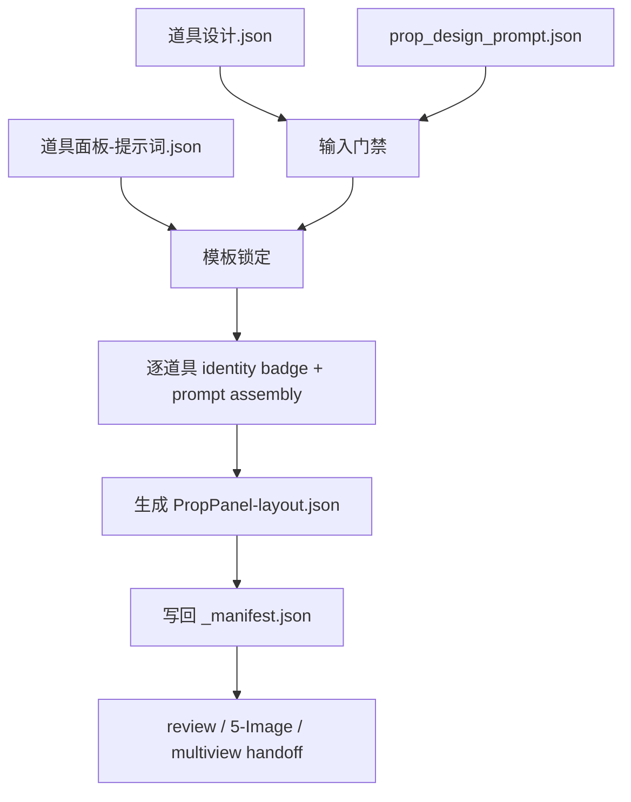
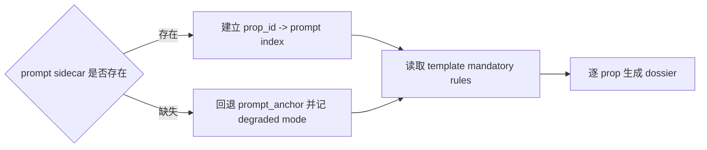
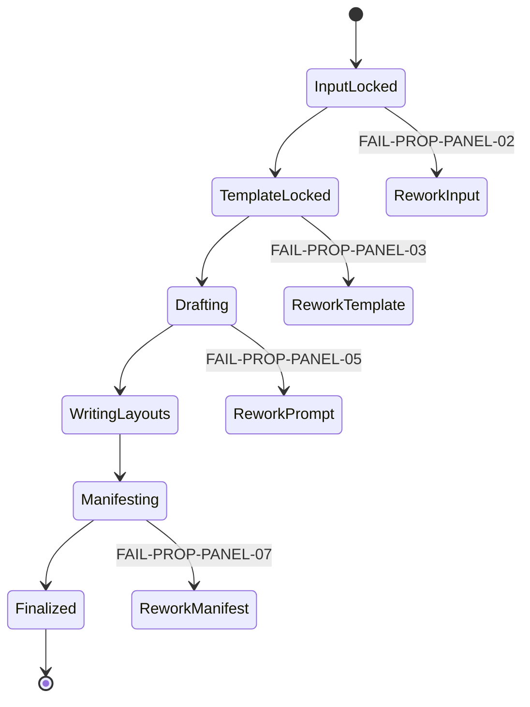

# 4-Design / 4-道具 / 3-面板

## 概述

`3-面板` 是 `4-Design/道具` 类目下承接设计真源的展示型叶子技能。

它消费 `2-设计` 已经稳定写出的 `道具设计.json` 与 `prop_design_prompt.json`，把每个 prop 收束成可审阅、可追溯、可供后续图像链消费的 panel layout JSON，而不是回头重扫 `3-Detail`，也不是在本阶段重造设计真源。

当前 canonical 交付停点保持不变：

1. 每个道具一份 `<prop_id>-<prop_name>-PropPanel-layout.json`
2. 每集一份 `_manifest.json`

## Business Requirement Analysis Contract

| 分析槽位 | 当前答案 |
| --- | --- |
| `business_goal` | 把设计主稿稳定转换成 layout dossier handoff，而不让展示阶段重新发明设计事实 |
| `business_object` | `道具设计.json` 中的每个 prop、对应 prompt sidecar、模板合同与 manifest 追踪 |
| `constraint_profile` | 不改写上游设计真源；不自动生成 PNG；模板是唯一布局真源；sidecar 缺失时必须显式降级 |
| `success_criteria` | 每个 prop 都生成独立 layout JSON，identity badge 稳定，manifest 完整记录 degraded mode 与输出统计 |
| `non_goals` | 不回写 `3-Detail`、不重做 `2-设计`、不将本阶段升级成图片生成阶段 |
| `complexity_source` | 输入来自两份上游文件，且要把模板规则、prompt 片段、identity badge 与降级逻辑稳定组合 |
| `topology_fit` | 适合“输入门禁 -> template 锁定 -> per-prop dossier 组装 -> layout 写回 -> manifest 汇流”的串行主干 |

## Total Input Contract

### 必需输入

- `projects/aigc/<项目名>/4-Design/道具/2-设计/第N集/道具设计.json`
- `.agents/skills/aigc/4-Design/道具/3-面板/templates/道具面板-提示词.json`

### 可选输入

- `projects/aigc/<项目名>/4-Design/道具/2-设计/第N集/prop_design_prompt.json`

### 固定输出落点

- `projects/aigc/<项目名>/4-Design/道具/3-面板/第N集/<prop_id>-<prop_name>-PropPanel-layout.json`
- `projects/aigc/<项目名>/4-Design/道具/3-面板/第N集/_manifest.json`

### 输入硬门槛

1. `道具设计.json` 缺失时必须回退到 `2-设计`。
2. `prop_design_prompt.json` 缺失时允许降级，但必须记录到 manifest。
3. 模板 `道具面板-提示词.json` 是 layout 结构唯一真源，脚本不得私造第二套模板。

## Canonical Anchors

| 载体 | 位置 | 作用 |
| --- | --- | --- |
| design master | `projects/aigc/<项目名>/4-Design/道具/2-设计/第N集/道具设计.json` | panel 第一输入真源 |
| prompt sidecar | `projects/aigc/<项目名>/4-Design/道具/2-设计/第N集/prop_design_prompt.json` | 长 prompt、负面约束与渲染提示 |
| layout template | `.agents/skills/aigc/4-Design/道具/3-面板/templates/道具面板-提示词.json` | layout contract 真源 |
| runner | `.agents/skills/aigc/4-Design/道具/3-面板/scripts/generate_prop_panels.py` | 最小可执行入口 |
| panel output root | `projects/aigc/<项目名>/4-Design/道具/3-面板/第N集/` | 本阶段唯一输出根 |

## Visual Maps

## Stage Boundary (Mandatory)

### 本阶段拥有

- 读取 design master 与 prompt sidecar
- 读取模板并锁定 `template_type / aspect_ratio / layout modules / mandatory rules`
- 为每个 prop 写出独立 layout JSON
- 写回 episode 级 `_manifest.json`

### 本阶段不拥有

- 改写 `道具设计.json` 或 `prop_design_prompt.json`
- 回头重扫 `3-Detail/第N集.json`
- 自动调用图片生成器写 PNG
- 再造第二份模板真源

## Thinking-Action Node Network

### NODE-PROP-PANEL-01 输入门禁与 episode 锁定

- `objective`
  - 锁定当前集的上游 design master 是否存在，并确定 panel 输出根。
- `inputs`
  - `道具设计.json`
  - `prop_design_prompt.json`
  - 用户目标
- `actions`
  1. 先确认 `道具设计.json` 是否存在。
  2. 若存在，解析 `episode_id / props[] / canonical_name / prop_id`。
  3. 锁定输出根为 `4-Design/道具/3-面板/第N集/`。
  4. 记录 `prop_design_prompt.json` 是否存在，以决定后续是否降级。
- `evidence`
  - `episode_id`
  - `prop_count`
  - `has_prompt_sidecar`
  - `output_root`
- `route_out`
  - 通过 -> `NODE-PROP-PANEL-02`
  - design master 缺失 -> `FAIL-PROP-PANEL-02`
- `gate`
  - 只有 design master 与输出根都锁定后，才允许进入模板装配。

#### 着手面

- 输入层：上游设计真源是否完整。
- episode 层：当前集与输出目录是否对应。
- 降级层：prompt sidecar 是否缺失。

### NODE-PROP-PANEL-02 模板锁定与 prompt 索引建立

- `objective`
  - 锁定 layout template，并准备 per-prop prompt 读取方式。
- `inputs`
  - 模板 JSON
  - `prop_design_prompt.json` 或 `道具设计.json.prompt_anchor`
- `actions`
  1. 读取模板，锁定 `template_type / layout_generation_prompt / layout_modules / mandatory_rules`。
  2. 若 sidecar 存在，建立 `prop_id -> prompt` 索引。
  3. 若 sidecar 缺失，则准备回退到 `道具设计.json.prompt_anchor`。
  4. 把是否降级写入待写 manifest 状态。
- `evidence`
  - `template_snapshot`
  - `prompt_index`
  - `degraded_mode`
- `route_out`
  - 通过 -> `NODE-PROP-PANEL-03`
  - 模板缺结构或 prompt 索引失效 -> `FAIL-PROP-PANEL-03`
- `gate`
  - 只有模板真源被锁定，才允许开始逐道具组装。

#### 着手面

- 模板层：模板结构是否完整。
- 提示层：prompt 来源是 sidecar 还是 fallback。
- 审计层：降级状态是否被显式记录。

### NODE-PROP-PANEL-03 逐道具 dossier 规划

- `objective`
  - 为每个 prop 规划 identity badge、布局段落与 prompt 片段。
- `inputs`
  - `道具设计.json.props[]`
  - `prompt_index`
  - 模板 mandatory rules
- `actions`
  1. 针对每个 prop 生成固定 identity badge：`<prop_id>+<prop_name>`。
  2. 读取 prop 的 `render_contract / negative_constraints / display_profile / prompt_anchor`。
  3. 组合 `identity_prompt / layout_prompt / negative_prompt_global`。
  4. 确保每个 dossier 都遵守同一模板，而不是按 prop 自行改 layout 结构。
- `evidence`
  - per-prop `prompt_segments`
  - per-prop `identity_badge`
- `route_out`
  - 规划完成 -> `NODE-PROP-PANEL-04`
  - prompt 缺段或 identity 漂移 -> `FAIL-PROP-PANEL-05`
- `gate`
  - 每个 prop 都必须具备 identity badge 和最终 prompt 片段。

#### 着手面

- 身份层：prop 身份标签是否可追溯。
- 布局层：layout prompt 是否服从模板。
- 负面约束层：negative prompt 是否完整下放。

### NODE-PROP-PANEL-04 layout 写回

- `objective`
  - 为每个 prop 写出独立 `PropPanel-layout.json`。
- `inputs`
  - per-prop dossier 规划结果
  - 模板快照
  - 输出根
- `actions`
  1. 组装 layout JSON 的 `meta / subject / layout_contract / prompt_segments / prompt / output`。
  2. 生成 `<prop_id>-<prop_name>-PropPanel-layout.json`。
  3. 确保每个 layout 只描述一个 prop，不把整集压成泛化面板。
  4. 将输出路径写回每个 layout 的 `output.layout_path`。
- `evidence`
  - 每个 prop 的 layout JSON
- `route_out`
  - 通过 -> `NODE-PROP-PANEL-05`
  - layout 漂移、命名错误或单文件泛化 -> `FAIL-PROP-PANEL-06`
- `gate`
  - 输出文件数必须与 prop 数一致，除非 manifest 明确记录跳过原因。

#### 着手面

- 命名层：文件名是否遵守 `<prop_id>-<prop_name>-PropPanel-layout.json`。
- 结构层：layout JSON 字段是否齐备。
- 数量层：逐 prop 输出是否完整。

### NODE-PROP-PANEL-05 manifest 汇流与下游 handoff

- `objective`
  - 为整集 layout 输出建立统一审计记录，并指向后续消费入口。
- `inputs`
  - 所有 layout JSON
  - `degraded_mode`
  - 输入与输出统计
- `actions`
  1. 写回 `_manifest.json`，记录输入源、输出文件、layout 数量和 degraded mode。
  2. 若 sidecar 缺失，显式写入回退来源与影响范围。
  3. 明确默认 handoff 到 `review / 5-Image / multiview-prop`。
  4. 如果模板或 prompt 有残余风险，在 manifest 中留下 blocking note。
- `evidence`
  - `_manifest.json`
  - `layout_count`
  - `degraded_flags`
- `route_out`
  - 通过 -> final output
  - manifest 缺统计或静默降级 -> `FAIL-PROP-PANEL-07`
- `gate`
  - manifest 必须完整记录输入、输出和降级状态，才允许结案。

#### 着手面

- 审计层：degraded mode、输入源和文件统计。
- 承接层：后续 review / image 工具如何接。
- 风险层：当前 layout 是否仍有待人工确认的问题。

## Execution Workflow

1. 读取当前项目 `2-设计` episode 根，锁定 `道具设计.json` 是否存在。
2. 读取 `prop_design_prompt.json`，或回退到 `道具设计.json.prompt_anchor`。
3. 读取模板，锁定 `layout_generation_prompt`、`layout_modules` 与 `mandatory_rules`。
4. 针对每个 prop 组装 `identity badge + prompt segments + final prompt`。
5. 写出逐 prop `PropPanel-layout.json`。
6. 写回 `_manifest.json`，记录输入、输出、degraded mode 与数量统计。

## Convergence Contract

本技能允许结案，必须同时满足：

1. design master 已存在且 episode 已锁定。
2. 模板是唯一布局真源，未发生脚本私造第二套结构。
3. 每个 prop 都有独立 layout JSON。
4. sidecar 缺失时 manifest 已显式记录 degraded mode。
5. `_manifest.json` 已记录输入、输出和数量统计。

## Canonical Output Governance (Mandatory)

1. `<prop_id>-<prop_name>-PropPanel-layout.json` 是本阶段每个 prop 的 canonical handoff。
2. `_manifest.json` 是 episode 级审计与统计真源。
3. 本阶段不争夺 `道具设计.json` 与 `prop_design_prompt.json` 的真源权。

## One-Shot Output Contract

### 最终结果

- `projects/aigc/<项目名>/4-Design/道具/3-面板/第N集/` 下的逐 prop layout JSON 与 `_manifest.json`

### 思考过程

- 为什么当前能进入 panel 阶段
- 模板如何锁定
- prompt sidecar 是否发生降级
- per-prop dossier 如何保证 identity 稳定

### 核心证据

- `prop_count / layout_count`
- `degraded_mode`
- 输入源与模板版本

### 风险 / 未完成支路

- sidecar 缺失的 prop
- 任何仍需人工复核的 layout

### 下一步

- 默认进入 review、`5-Image` 或 `multiview-prop`

## Field Master

| field_id | 输出位置/字段 | 内容要求 | 默认责任 Step | 质量维度 | 失败码 |
| --- | --- | --- | --- | --- | --- |
| FIELD-PROP-PANEL-01 | 阶段定位 | 明确 `3-面板` 是 design master 下游的 layout handoff | NODE-PROP-PANEL-01 | 边界清晰度 | FAIL-PROP-PANEL-01 |
| FIELD-PROP-PANEL-02 | 输入真源 | 锁定 `道具设计.json + prop_design_prompt.json` 为唯一输入 | NODE-PROP-PANEL-01 | 真源稳定性 | FAIL-PROP-PANEL-02 |
| FIELD-PROP-PANEL-03 | 模板契约 | 固定 `PROP_ATMOSPHERIC_DOSSIER + 16:9 + three-column` | NODE-PROP-PANEL-02 | 模板一致性 | FAIL-PROP-PANEL-03 |
| FIELD-PROP-PANEL-04 | identity badge | 每个 layout 必须写 `<prop_id>+<prop_name>` 的固定身份标签 | NODE-PROP-PANEL-03 | 可追溯性 | FAIL-PROP-PANEL-04 |
| FIELD-PROP-PANEL-05 | prompt assembly | 组装 identity/layout/negative prompt 并落成最终 `prompt` | NODE-PROP-PANEL-03 | 可执行性 | FAIL-PROP-PANEL-05 |
| FIELD-PROP-PANEL-06 | 输出治理 | 每个道具独立 layout，episode 统一 manifest | NODE-PROP-PANEL-04 | 落盘完整性 | FAIL-PROP-PANEL-06 |
| FIELD-PROP-PANEL-07 | 降级记录 | prompt sidecar 缺失时必须记录 degraded mode | NODE-PROP-PANEL-05 | 审计完整性 | FAIL-PROP-PANEL-07 |

## Thought Pass Map

| step_id | 聚焦字段 | 核心问题 | 生成动作 | 未达标信号 |
| --- | --- | --- | --- | --- |
| S1 | FIELD-PROP-PANEL-01 / 02 | 当前是不是 panel layout handoff，输入真源是否齐备 | 锁定 design master、episode 与输出根 | 仍回头重扫 `3-Detail` 或 design master 缺失 |
| S2 | FIELD-PROP-PANEL-03 | 模板是不是唯一真源，sidecar 是否需降级 | 读取模板、建立 prompt index、记录 degraded mode | 模板缺字段或降级被静默吞掉 |
| S3 | FIELD-PROP-PANEL-04 / 05 | per-prop dossier 是否同时具备身份标签与可执行 prompt | 生成 identity badge 与 prompt segments | 只有 prop 名，没有稳定 ID 或负面约束 |
| S4 | FIELD-PROP-PANEL-06 | 输出命名和数量是否正确 | 写逐 prop layout JSON | 整集只出一个泛化 JSON 或命名漂移 |
| S5 | FIELD-PROP-PANEL-07 | manifest 是否完整记录降级与统计 | 写 `_manifest.json` 与 handoff | sidecar 缺失却没有任何审计痕迹 |

## Pass Table

| field_id | Pass Standard | Fail Code | Rework Entry |
| --- | --- | --- | --- |
| FIELD-PROP-PANEL-01 | 阶段边界、停点与上下游职责明确 | FAIL-PROP-PANEL-01 | NODE-PROP-PANEL-01 |
| FIELD-PROP-PANEL-02 | 输入根固定为 `2-设计` 产物 | FAIL-PROP-PANEL-02 | NODE-PROP-PANEL-01 |
| FIELD-PROP-PANEL-03 | 模板结构与 `16:9` 布局被稳定执行 | FAIL-PROP-PANEL-03 | NODE-PROP-PANEL-02 |
| FIELD-PROP-PANEL-04 | 每个 layout 都含稳定 identity badge | FAIL-PROP-PANEL-04 | NODE-PROP-PANEL-03 |
| FIELD-PROP-PANEL-05 | 最终 prompt 可执行且不丢负面约束 | FAIL-PROP-PANEL-05 | NODE-PROP-PANEL-03 |
| FIELD-PROP-PANEL-06 | layout 与 manifest 全部落盘且命名正确 | FAIL-PROP-PANEL-06 | NODE-PROP-PANEL-04 |
| FIELD-PROP-PANEL-07 | 所有降级路径都有 manifest 记录 | FAIL-PROP-PANEL-07 | NODE-PROP-PANEL-05 |

## Root-Cause Execution Contract (Mandatory)

当 `3-面板` 出现以下问题时，必须先修源层而不是补单次 JSON：

- 已有 `道具设计.json`，但仍从 `3-Detail` 直接拼 panel prompt
- template_type、画幅或模块规则漂移
- 整集只产出一个泛化 panel，而不是逐道具 layout
- sidecar 缺失时静默回退，没有任何审计记录

必经链路：

`Symptom -> Direct Technical Cause -> Rule Source -> Meta Rule Source -> Fix Landing Points`

优先检查：

- `Rule Source`
  - `.agents/skills/aigc/4-Design/道具/3-面板/SKILL.md`
  - `.agents/skills/aigc/4-Design/道具/3-面板/CONTEXT.md`
  - `.agents/skills/aigc/4-Design/道具/3-面板/templates/道具面板-提示词.json`
  - `.agents/skills/aigc/4-Design/道具/3-面板/scripts/generate_prop_panels.py`
- `Meta Rule Source`
  - `.agents/skills/aigc/4-Design/道具/SKILL.md`
  - `.agents/skills/aigc/4-Design/SKILL.md`
  - 根 `AGENTS.md`

## Context Preload (Mandatory)

1. `.agents/skills/aigc/SKILL.md + CONTEXT.md`
2. `.agents/skills/aigc/4-Design/SKILL.md + CONTEXT.md`
3. `.agents/skills/aigc/4-Design/道具/SKILL.md + CONTEXT.md`
4. 本 `SKILL.md + CONTEXT.md`
5. `projects/aigc/<项目名>/4-Design/道具/2-设计/第N集/道具设计.json`
6. `projects/aigc/<项目名>/4-Design/道具/2-设计/第N集/prop_design_prompt.json`
7. `.agents/skills/aigc/4-Design/道具/3-面板/templates/道具面板-提示词.json`
