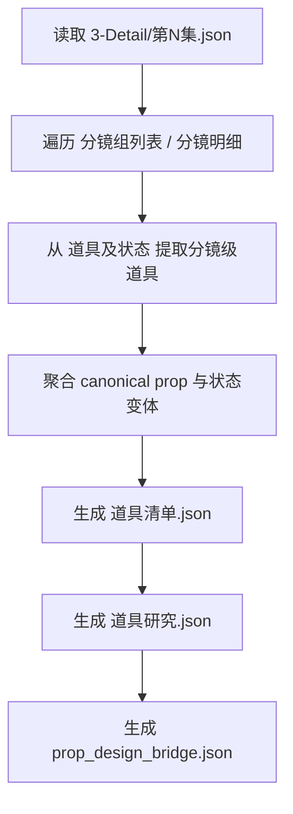
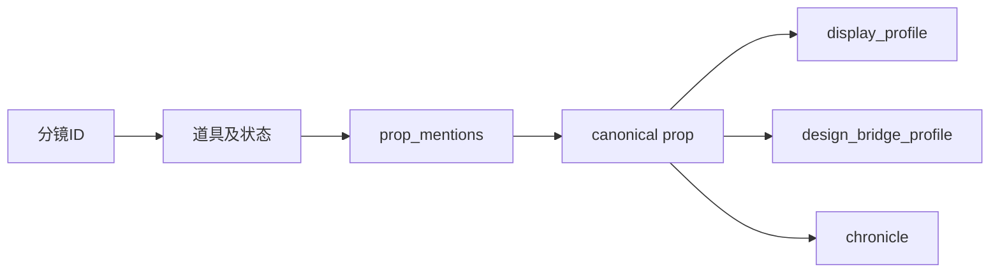

# 4-Design / 4-道具 / 1-清单

## 概述

`1-清单` 是 `4-Design/4-道具` 的首个可执行叶子子技能。

它负责把上游 `3-Detail` 已经稳定的导演 episode JSON 中的 `分镜组列表[] / 分镜明细[] / 道具及状态`，整理成三份默认 JSON 主产物：

1. `道具清单.json`
2. `道具研究.json`
3. `prop_design_bridge.json`

当前子技能的目标不是回写上游剧情事实，也不是直接生成画面 prompt，而是先把“镜头里出现了哪些道具、它们处于什么状态、哪些字段足以支撑后续设计”收束成一个稳定的道具真源入口。

## When to Use

- 需要从 `projects/<项目名>/3-Detail/第N集.json` 提取道具对象池。
- 需要把 `道具及状态` 从镜头级描述收束成可聚合的 canonical prop。
- 需要为后续 `4-Design/4-道具/2-设计` 或 `5-Image` 提供机读的道具桥接字段。
- 需要输出面向设计阶段而不是纯研究阶段的 JSON-first 产物。

## When Not to Use

- 当前任务还在补 `3-Detail` 的镜头事实，应先回到上游修 `第N集.json`。
- 当前任务是直接出图或做视频请求，而不是先做道具对象池。
- 需要重写角色、服装或场景清单，应进入对应 sibling 子路径。

## 子技能边界

### `1-清单` 拥有

- `分镜ID -> 道具提取 -> 道具聚合` 的第一层合同。
- `道具清单 / 道具研究 / 设计桥接` 三份 JSON 主产物。
- 运行时路径推断：优先消费 `3-Detail/第N集.json`，兼容回退 `3-Detail/第N集.json`。

### `1-清单` 不拥有

- 改写 `3-Detail/第N集.json`
- 直接生成图像或视频请求
- 发明上游未提供的新剧情道具事实

## Visual Maps

## Canonical Module References

| 模块 | 作用 | 真源文件 |
| --- | --- | --- |
| 思维链 | 字段主表、case 与返工入口 | `references/chain-of-thought.md` |
| 执行流程 | 输入、输出、命令与默认路径 | `references/execution-flow.md` |
| 输出契约 | 三份 JSON 结构与落点 | `references/output-template.md` |

## Execution Summary

- 上游默认真源：`projects/<项目名>/3-Detail/第N集.json`
- 兼容回退：`projects/<项目名>/3-Detail/第N集.json`
- 默认输出根目录：`projects/<项目名>/4-Design/4-道具/1-清单/第N集/`
- 默认主产物固定为：
  - `道具清单.json`
  - `道具研究.json`
  - `prop_design_bridge.json`
- `道具清单.json` 负责保留 `group_id / shot_id / prop_mentions / state_variants`
- `道具研究.json` 负责保留 `evidence_ledger / attribute_profile / display_profile / chronicle`
- `prop_design_bridge.json` 负责保留 `structure_modules / material_and_finish / wear_marks / shot_route / physical_character`

## Output Summary

- canonical 目录：`projects/<项目名>/4-Design/4-道具/1-清单/第N集/`
- canonical 文件：
  - `道具清单.json`
  - `道具研究.json`
  - `prop_design_bridge.json`
- shared schema 回指：
  - `.agents/skills/aigc/_shared/director_episode_output.schema.json`

## Strategy Summary

- 只抽取上游 `道具及状态` 已经出现的对象，不补虚构道具。
- 优先保留镜头级状态差分，而不是一开始就把所有描述糊成一个静态 noun。
- 设计桥接必须服务下游设计消费，不接受只有研究判断、没有结构和机读字段的半成品。

## Field System Summary

- 核心字段系统见 `references/chain-of-thought.md`
- 当前叶子技能的硬字段固定为：
  - `FIELD-PROP-LIST-01` 道具抽取
  - `FIELD-PROP-LIST-02` 道具聚合
  - `FIELD-PROP-LIST-03` 研究结论
  - `FIELD-PROP-LIST-04` 设计桥接
  - `FIELD-PROP-LIST-05` 输出契约

## Root-Cause Execution Contract (Mandatory)

当出现以下症状时，必须先修本子技能合同或脚本：

- `3-Detail/第N集.json` 能读，但脚本仍按旧仓 `3-设定` 目录推断
- `道具及状态` 已有信息，却提不出稳定 prop
- 研究层只有抽象词，没有 `structure_modules / shot_route / physical_character`
- 输出目录或文件名和 `4-Design/4-道具/1-清单` 不一致

必经链路：

`Symptom -> Direct Technical Cause -> Rule Source -> Meta Rule Source -> Fix Landing Points`

优先检查：

- `Rule Source`
  - `.agents/skills/aigc/4-Design/4-道具/1-清单/SKILL.md`
  - `.agents/skills/aigc/4-Design/4-道具/1-清单/CONTEXT.md`
  - `.agents/skills/aigc/4-Design/4-道具/1-清单/scripts/run_prop_list_pipeline.py`
- `Meta Rule Source`
  - `.agents/skills/aigc/_shared/director_episode_output.schema.json`
  - `.agents/skills/aigc/_shared/project-runtime-layout.md`
  - 根 `AGENTS.md`

## Context Preload (Mandatory)

- 执行前先加载 `.agents/skills/aigc/SKILL.md + CONTEXT.md`
- 再加载本 `SKILL.md + CONTEXT.md`
- 强制读取 `.agents/skills/aigc/_shared/director_episode_output.schema.json`
- 再按需读取 `references/*.md`
- 优先级遵循：用户显式请求 > 根 `AGENTS.md` > `.agents/skills/aigc/SKILL.md` > 本 `SKILL.md` > 各级 `CONTEXT.md`
