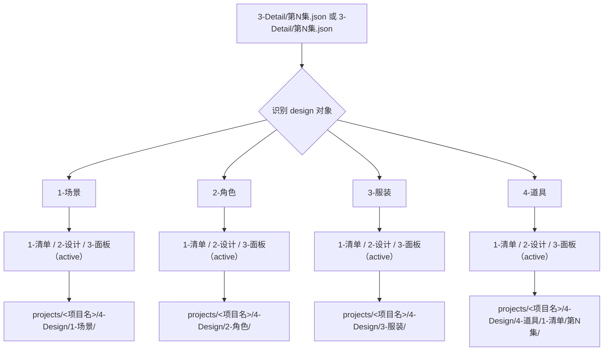

# aigc 4-Design

## 概述

`4-Design` 是 `aigc` 主链里承接 `3-Detail`、为后续设计与资产阶段准备对象清单和设计真源的阶段父级合同。

本阶段当前优先解决四件事：

1. 锁定 `projects/<项目名>/3-Detail/第N集.json` 是否已具备可消费的角色、场景、服装、道具事实。
2. 判断当前任务应该进入哪一类 design 子路径。
3. 把 design 侧产物稳定落到 `projects/<项目名>/4-Design/`。
4. 避免下游 `5-Image / 6-Video` 继续直接回头解析全部导演字段。

## When to Use

- 需要从导演集级 JSON 派生角色、场景、服装、道具的清单或设计源。
- 需要明确 `4-Design` 与 `3-Detail`、`5-Image`、`6-Video` 的边界。
- 用户只说“做主体设定 / 做 design / 做角色清单”，但还没有进入画面或视频生成。

## When Not to Use

- 上游还在补 `3-Detail/第N集.json` 的镜头事实，应回到 `3-Detail`。
- 当前任务已经进入画面 prompt、图片生成或视频请求阶段，应进入 `5-Image` 或 `6-Video`。
- 当前诉求只是项目状态查询、续跑或验收，应走 `query / resume / review`。

## 阶段边界

### `4-Design` 拥有

- 设计阶段父级路由。
- `projects/<项目名>/4-Design/` 下的阶段级落点约定。
- 设计源与导演真源之间的消费边界。

### `4-Design` 不拥有

- 重新改写 `projects/<项目名>/3-Detail/第N集.json`。
- 直接替代 `5-Image / 6-Video` 产出 prompt 或执行请求。
- 凭空发明角色/场景/道具事实。

## Visual Maps

## 当前路由状态

- `1-场景/1-清单`：active，已落地为场景清单叶子入口。
- `1-场景/2-设计`：active，已升级为场景设计组 subagents 编排面。
- `1-场景/3-面板`：active，已升级为 scene panel carrier 入口。
- `2-角色/1-清单`：active，已落地为角色清单叶子入口。
- `2-角色/2-设计`：active，已升级为 `skill-subagents` 父子治理结构，负责把角色对象池收束为结构化设计稿。
- `2-角色/3-面板`：active，已建立角色面板 packet 收束入口。
- `3-服装/1-清单`：active，负责从角色清单与导演证据收束 canonical costume roster、研究层与 design bridge。
- `3-服装/2-设计`：active，已升级为 `skill-subagents` 父子治理结构，负责把服装 bridge 收束为设计主稿、prompt sidecar 与逐服装设计卡。
- `3-服装/3-面板`：active，负责把服装设计主稿收束为逐服装 panel layout JSON。
- `4-道具/1-清单`：active，已落地为道具清单 + 研究 + bridge 叶子入口。
- `4-道具/2-设计`：active，已升级为 `skill-subagents` 父子治理结构，负责把 bridge 收束为 `道具设计.json + prop_design_prompt.json`。
- `4-道具/3-面板`：active，负责把 design master 收束为逐道具 panel layout JSON。
- 当前四大类目均已具备 `3-面板` active 入口，不再保留 `3-服装` 的 pending 占位。

## Execution Summary

- 上游第一事实源固定为 `.agents/skills/aigc/_shared/director_episode_output.schema.json` 对齐的导演 JSON。
- 本阶段默认把产物写到 `projects/<项目名>/4-Design/`，不回写上游导演根文件。
- 当前已开放的 design-source 入口有：
  - `1-场景/1-清单`
  - `2-角色/1-清单`
  - `3-服装/1-清单`
  - `4-道具/1-清单`
- 当前已开放的 design synthesis 入口有：
  - `1-场景/2-设计`
  - `2-角色/2-设计`
  - `3-服装/2-设计`
  - `4-道具/2-设计`
- 当前已开放的 design panel 入口有：
  - `1-场景/3-面板`
  - `2-角色/3-面板`
  - `3-服装/3-面板`
  - `4-道具/3-面板`
- 若用户只说“补 design-source”，默认优先进入最贴近对象类别的 `1-清单` 叶子，而不是跳过对象池直做设计稿。
- 若用户明确要求“把场景清单继续做成场景设计卡 / 场景设计 carrier / 供面板继续消费的设计真源”，应进入 `1-场景/2-设计`。
- 若用户明确要求“把场景设计继续做成场景面板 / 九宫格展示布局 / 可供 5-Image 继续消费的 panel carrier”，应进入 `1-场景/3-面板`。
- 若用户明确要求“把角色清单进一步做成结构化角色设计稿 / 角色设计 carrier / 供面板继续消费的设计真源”，应进入 `2-角色/2-设计`。
- 若用户明确要求“把角色设计稿继续做成角色面板 / 角色展示板 / dossier layout packet”，应进入 `2-角色/3-面板`。
- 若用户明确要求“把角色穿搭事实进一步做成服装对象池 / 服装研究 / 服装桥接”，应进入 `3-服装/1-清单`。
- 若用户明确要求“把服装清单继续做成结构化服装设计稿 / prompt sidecar / 逐服装设计卡”，应进入 `3-服装/2-设计`。
- 若用户明确要求“把服装设计稿继续做成展示面板 / wardrobe dossier / panel layout packet”，应进入 `3-服装/3-面板`。
- 若用户明确要求“把道具清单进一步做成可执行设计包 / 设计图输入 / 多视图设计页真源”，应进入 `4-道具/2-设计`，而不是继续停留在 `1-清单`。
- 若用户明确要求“把道具设计稿继续做成展示面板 / panel layout dossier / 审阅面板”，应进入 `4-道具/3-面板`。

## Root-Cause Execution Contract (Mandatory)

当出现以下症状时，必须先修本阶段父级合同：

- 用户只说“做 design”，却被错误送进画面或视频阶段。
- 执行者跳过父级路由，直接在空目录中臆造角色或场景设计稿。
- 输出仍沿用旧仓 `output/影片/...` 路径，而不是当前 `projects/<项目名>/4-Design/`。
- 下游又开始把 `3-Detail/第N集.json` 当成 design 清单直读，而没有经过 design-source 收敛。

必经链路：

`Symptom -> Direct Technical Cause -> Rule Source -> Meta Rule Source -> Fix Landing Points`

优先检查：

- `Rule Source`
  - `.agents/skills/aigc/4-Design/SKILL.md`
  - `.agents/skills/aigc/4-Design/CONTEXT.md`
  - 当前命中子路径的本地合同
- `Meta Rule Source`
  - `.agents/skills/aigc/SKILL.md`
  - 根 `AGENTS.md`

## Context Preload (Mandatory)

- 执行前先加载 `.agents/skills/aigc/SKILL.md + CONTEXT.md`。
- 再加载本 `SKILL.md + CONTEXT.md`。
- 进入具体类目后，再加载对应类目的本地合同与经验层。
