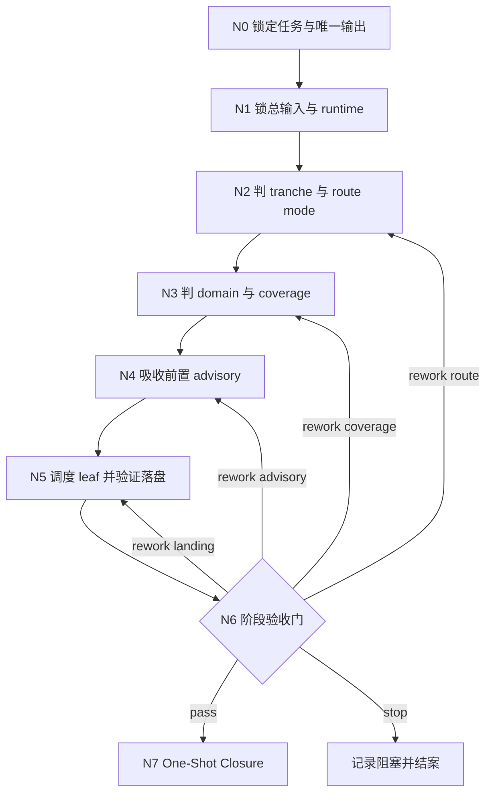
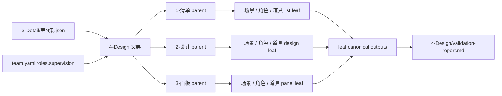
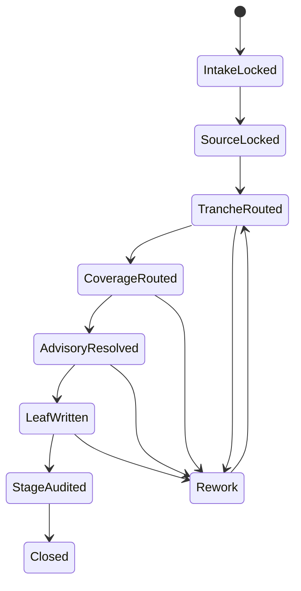
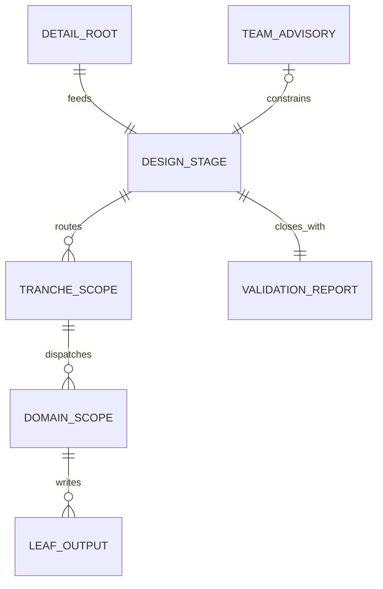

# aigc 4-Design

## Context Loading Contract

- 每次调用本技能时，必须同时加载同目录 `CONTEXT.md` 作为预加载上下文。
- 本技能默认采用 `单技能知行合一 + references 细则下沉` 模式：根 `SKILL.md` 负责业务分析、总输入、拓扑、思行节点、汇流门与 one-shot 输出；`references/` 负责阶段路由矩阵与节点执行细则。
- 冲突优先级固定为：用户显式请求 > 根 `AGENTS.md` > `.agents/skills/aigc/SKILL.md` > 本 `SKILL.md` > 本目录 `references/*` > 本 `CONTEXT.md`。

## 编排声明

- 本技能按 [$skill-知行合一](/Users/vincentlee/.codex/skills/meta/构建/技能/skill-知行合一/SKILL.md) 的 `既有优化` 模式增量升级。
- 当前仍是单技能阶段父总线，不升格为多智能体 harness；复杂度通过 `业务分析 + Mermaid 拓扑 + 思行节点 + 汇流门 + one-shot closure` 承载。
- `复杂链路的骨架 / 细则分层`: `true`
- 这意味着：
  - `SKILL.md` 只保留 `4-Design` 父层真正拥有的边界、路由、门禁、输出收束与上溯合同。
  - [references/思行网络.md](references/思行网络.md) 负责承接节点与返工语义的展开说明。
  - [references/阶段路由矩阵.md](references/阶段路由矩阵.md) 负责承接 tranche/domain coverage、输入前置条件、落盘路径与 handoff 矩阵。

## Mode Selection

- 当前模式：`既有优化`
- 选择原因：
  - `4-Design` 已拥有稳定的阶段边界、runtime 根路径和 tranche 划分。
  - 当前要升级的是父层编排密度与真源表达方式，而不是重写阶段业务对象本身。
  - 本轮目标是把既有“线性门禁说明”升级为“思维链即执行链”的阶段父技能网络。

## Purpose & Scope

`4-Design` 是 `aigc` 技能树中承接 `3-Detail`、连接 `5-Image / 6-Video` 的阶段父 skill。

它负责在同一轮执行里同时成立 5 件事：

1. 先判阶段边界：确认当前问题属于 design 父层，而不是 `3-Detail` 重写或 leaf 自治。
2. 先锁总输入：回到 `projects/aigc/<项目名>/4-Design/` 的唯一 runtime 根与共享上游。
3. 再做 selective dispatch：只调度命中的 tranche 与 active domain，不伪造全链完成。
4. 把 advisory 收回到前置：`roles.supervision` 只在落盘前提供顾问意见，不再占有落盘后收尾权。
5. 结果一次性收束：父层只把阶段级 closure 写入 `projects/aigc/<项目名>/4-Design/validation-report.md`，不发明第二业务真源。

当前阶段处于 `bootstrap_compat` 迁移窗口，已稳定链路为：

`3-Detail -> 1-清单/{场景,角色,道具} -> 2-设计/{场景,角色,道具} + 同 stem 单主体图 -> 3-面板/{场景,角色,道具}`

## Single-Skill Positioning

### 本技能拥有

- `1-清单 / 2-设计 / 3-面板` 的顺序门与阶段入口判断
- `场景 / 角色 / 服装 / 道具` 四类类目的父层路由裁决
- `projects/aigc/<项目名>/4-Design/` 的 runtime 根路径真源
- `3-Detail` 下游 design-source 消费总合同回链
- `team.yaml -> roles.supervision` 的前置 advisory 裁决
- 阶段级 `validation-report.md` 的 one-shot closure 写回

### 本技能不拥有

- 直接写任何类目的 canonical 业务内容
- 发明 `4-Design` 阶段总稿或第二业务真源
- 越权改写 `3-Detail/第N集.json`
- 在首次落盘后继续以 `roles.supervision` 名义做 closeout patch
- 把 `思考过程` 另起 sidecar 文件与阶段报告竞争

## Business Requirement Analysis Contract (Mandatory)

| analysis_slot | 当前结论 |
| --- | --- |
| `business_goal` | 让 `4-Design` 父层把当前轮 design 任务正确路由到 `1-清单 / 2-设计 / 3-面板` 的 active leaf，并只把阶段 summary 收束到 `projects/aigc/<项目名>/4-Design/validation-report.md`。 |
| `business_object` | `projects/aigc/<项目名>/4-Design/validation-report.md` 与当前轮被命中的 tranche/domain leaf canonical 输出。 |
| `constraint_profile` | `4-Design` 父层只拥有路由、coverage、advisory boundary、runtime 对齐与 closure；`1-清单 / 2-设计 / 3-面板` 的 leaf 才拥有业务真源写回权；当前 active 域以 `场景 / 角色 / 道具` 为主，`服装` 仍受迁移状态约束。 |
| `success_criteria` | 当前轮 tranche/domain scope 明确、active coverage 未虚报、顾问边界未越权、leaf 输出落到正确 runtime、阶段报告写出思考过程/关键证据/风险例外/下一入口。 |
| `non_goals` | 不在父层重写 leaf 业务细则；不伪装未迁回 sibling 为 active；不产出跨类目总稿；不把派生 PNG、request sidecar 或 `_manifest.json` 升为父层 closure 对象。 |
| `complexity_source` | 复杂度主要来自 `tranche 顺序 + domain selective dispatch + partial-active coverage + advisory 边界 + stage closure` 的同时成立。 |
| `topology_fit` | 最优拓扑为“串行主干 + 条件域分支 + 单点汇流”：先锁任务和总输入，再判 tranche，再判 domain/coverage，再按需吸收 advisory，随后把 leaf 落盘结果汇入单一阶段 closure。 |
| `step_strategy` | 不再只用线性 prose 描述阶段门禁，而用 `N0-N7` 思行节点显式承载“锁任务、锁输入、锁 tranche、锁 domain、吸收 advisory、执行与验收 leaf、做 one-shot closure”。 |

## Shared Canonical Sources (Mandatory)

- `.agents/skills/aigc/SKILL.md`
- `.agents/skills/aigc/3-Detail/SKILL.md`
- `.agents/skills/aigc/_shared/project-runtime-layout.md`
- `.agents/skills/aigc/_shared/council-runtime/module-spec.md`
- `.agents/skills/aigc/_shared/council-runtime/team.template.yaml`
- `.agents/skills/aigc/4-Design/1-清单/_shared/detail-output-consumption-contract.md`
- `.agents/skills/aigc/4-Design/1-清单/SKILL.md`
- `.agents/skills/aigc/4-Design/2-设计/SKILL.md`
- `.agents/skills/aigc/4-Design/2-设计/_shared/design-output-contract.md`
- `.agents/skills/aigc/4-Design/3-面板/SKILL.md`
- [references/思行网络.md](references/思行网络.md)
- [references/阶段路由矩阵.md](references/阶段路由矩阵.md)

## Context Preload (Mandatory)

加载顺序固定为：

1. 根 `AGENTS.md`
2. `.agents/skills/aigc/SKILL.md + CONTEXT.md`
3. `.agents/skills/aigc/3-Detail/SKILL.md + CONTEXT.md`
4. 本 `SKILL.md + CONTEXT.md`
5. `.agents/skills/aigc/_shared/project-runtime-layout.md`
6. `.agents/skills/aigc/_shared/council-runtime/module-spec.md`
7. `.agents/skills/aigc/_shared/council-runtime/team.template.yaml`
8. `.agents/skills/aigc/4-Design/1-清单/_shared/detail-output-consumption-contract.md`
9. [references/思行网络.md](references/思行网络.md)
10. [references/阶段路由矩阵.md](references/阶段路由矩阵.md)
11. 命中 `1-清单` 时，加载 `4-Design/1-清单/SKILL.md + CONTEXT.md`
12. 命中 `2-设计` 时，加载 `4-Design/2-设计/SKILL.md + CONTEXT.md`
13. 命中 `2-设计` 或 `3-面板` 时，加载 `4-Design/2-设计/_shared/design-output-contract.md`
14. 命中 `3-面板` 时，加载 `4-Design/3-面板/SKILL.md + CONTEXT.md`
15. `projects/aigc/<项目名>/MEMORY.md`（若项目已绑定）
16. `projects/aigc/<项目名>/CONTEXT/` 相关文件（若存在）
17. `projects/aigc/<项目名>/team.yaml`（若存在）

## Total Input Contract (Mandatory)

### 必需输入

- `projects/aigc/<项目名>/4-Design/`
- `projects/aigc/<项目名>/3-Detail/第N集.json`

### 推荐输入

- `projects/aigc/<项目名>/4-Design/validation-report.md`
- `projects/aigc/<项目名>/team.yaml`
- 命中 tranche/domain 对应的既有 leaf runtime 文件

### 硬规则

1. `projects/aigc/<项目名>/4-Design/` 是 design 阶段唯一 runtime 根。
2. `4-Design` 父层只路由真实存在的 tranche parent 与 active leaf，不得为 pending sibling 伪造路径。
3. 本轮只 patch 命中的 tranche/domain scope，不默认全量重跑。
4. `1-清单` 是 `2-设计` 的默认上游，`2-设计` 是 `3-面板` 的默认上游。
5. `2-设计` 命中时，必须遵守 `full_generation_prompt + 同 stem 单主体图` 的共享输出合同。
6. `3-面板` 命中时，必须遵守 `layout JSON -> SMART bridge -> 派生生图` 的共享输出合同。
7. 父层的唯一 canonical 输出是 `validation-report.md` 的阶段 closure；leaf 业务真源始终留在各自 runtime。

## Topology Contract

### 主干与分支总览

- 串行主干：`N0 -> N1 -> N2 -> N3 -> N4 -> N5 -> N6 -> N7`
- 条件分支：
  - `N2` 负责判定 `single-tranche-single-domain / single-tranche-multi-domain / cross-tranche-handoff`
  - `N3` 负责判定 active domain 与 pending-migration
  - `N4` 负责判定 `roles.supervision: enabled | absent | unused_with_reason`
  - `N6` 负责判定 `pass | rework | stop`
- 汇流点固定为：`N6 -> N7`

### 结构性约束

- 父层允许“多域调度集”存在，但不因此伪装为全阶段全量完成。
- 任一 leaf 若未命中或未 active，都不得被补空字段或补占位输出。
- 任何返工都必须回指到具体节点或具体 tranche/domain，不允许只写“后续再优化”。

## Mermaid Visual Contract

- 本技能把 Mermaid 视为治理真源，而不是装饰图。
- 当前至少用 4 张图承载：
  - 阶段主干与返工流
  - runtime / tranche / leaf 关系
  - 状态推进与 closure gate
  - 输入到输出的治理关系

## Visual Maps (Mermaid)

## Thinking-Action Node Contract (Mandatory)

### Node Register

| node_id | 节点名 | 主责任 | 失败回退 |
| --- | --- | --- | --- |
| `N0` | 锁定任务与唯一输出 | 锁定当前任务属于 `4-Design` 阶段父层，且父层唯一 canonical 输出为 `validation-report.md` | 停止并回父级路由 |
| `N1` | 锁总输入与 runtime | 锁 `3-Detail` 上游、`4-Design` runtime 根与项目级上下文 | 回 `N0` |
| `N2` | 判 tranche 与 route mode | 决定当前进入 `1-清单 / 2-设计 / 3-面板` 及其 route mode | 回 `N1` 或 `N2` |
| `N3` | 判 domain 与 coverage | 决定当前命中哪些域、哪些 active、哪些 pending-migration | 回 `N2` 或 `N3` |
| `N4` | 吸收前置 advisory | 读取并约束 `team.yaml.roles.supervision` 的前置顾问意见 | 回 `N3` 或 `N4` |
| `N5` | 调度 leaf 并验证落盘 | 把命中 scope 交给对应 leaf，核对输出是否落到正确 runtime | 回 `N2`、`N3` 或 `N5` |
| `N6` | 阶段验收门 | 统一判定 `pass / rework / stop`，不让 pending/越权/错路径混入 closure | 回指定节点返工 |
| `N7` | One-Shot Closure | 把阶段 summary、思考过程和下一入口统一写入 `validation-report.md` | 回 `N6` |

### N0 锁定任务与唯一输出

- `objective`
  - 确认当前任务是 `4-Design` 父层问题，而不是 leaf 细节创作或其他阶段改写。
- `inputs`
  - 用户请求
  - 根 `aigc` 路由
  - 本技能输出合同
- `actions`
  1. 锁定父层唯一输出为 `projects/aigc/<项目名>/4-Design/validation-report.md`
  2. 锁定父层不创建第二业务真源
  3. 锁定当前执行模式为 `既有优化`
- `evidence`
  - `stage_scope=4-Design-parent`
  - `output_mode=stage_report_only`
- `route_out`
  - 成功：进入 `N1`
  - 失败：停止并回父级路由
- `gate`
  - 未锁定唯一输出前，不得写任何阶段 closure

### N1 锁总输入与 runtime

- `objective`
  - 在做 tranche/domain 判定前，先锁清楚共享上游、runtime 根和项目上下文。
- `inputs`
  - `projects/aigc/<项目名>/3-Detail/第N集.json`
  - `projects/aigc/<项目名>/4-Design/`
  - `project-runtime-layout.md`
  - 项目级 `MEMORY.md / CONTEXT/`
- `actions`
  1. 锁定本轮项目根与 episode scope
  2. 锁定 `4-Design` runtime 根路径
  3. 读取既有 `validation-report.md` 作为兼容 closure 载体（若存在）
- `evidence`
  - `project_root`
  - `episode_scope`
  - `runtime_root`
- `route_out`
  - 成功：进入 `N2`
  - 失败：回 `N0`
- `gate`
  - runtime 根未锁定前，不得推导 leaf 路径

### N2 判 tranche 与 route mode

- `objective`
  - 根据用户请求与上游成熟度判定当前进入哪个 tranche，以及本轮是单域、多域还是跨 tranche handoff。
- `inputs`
  - 用户任务
  - `references/阶段路由矩阵.md`
  - `1-清单 / 2-设计 / 3-面板` 父技能合同
- `actions`
  1. 判定 `single-tranche-single-domain / single-tranche-multi-domain / cross-tranche-handoff`
  2. 选择当前 tranche 集合
  3. 对未满足前置条件的 tranche 记录阻塞原因
- `evidence`
  - `route_mode`
  - `tranche_scope`
  - `blocked_tranches`
- `route_out`
  - 成功：进入 `N3`
  - 失败：回 `N1` 或 `N2`
- `gate`
  - 未明确 tranche scope 前，不得启动 leaf 调度

### N3 判 domain 与 coverage

- `objective`
  - 只调度命中且 active 的 domain，同时显式保留 pending-migration 说明。
- `inputs`
  - `references/阶段路由矩阵.md`
  - 当前 tranche scope
  - 已落地 leaf 实体
- `actions`
  1. 锁定 `场景 / 角色 / 服装 / 道具` 中本轮命中的 domain
  2. 判定每个 domain 的 `active / pending-migration / blocked`
  3. 形成 selective dispatch 集合
- `evidence`
  - `domain_scope`
  - `active_leaf_set`
  - `pending_leaf_set`
- `route_out`
  - 成功：进入 `N4`
  - 失败：回 `N2` 或 `N3`
- `gate`
  - 未命中的 domain 不得被补空，也不得被写成已完成

### N4 吸收前置 advisory

- `objective`
  - 在真正落盘前按需吸收 `roles.supervision` 的顾问意见，但不让它越权为 post-write owner。
- `inputs`
  - `projects/aigc/<项目名>/team.yaml`
  - `council-runtime/module-spec.md`
  - 当前 tranche/domain scope
- `actions`
  1. 判定 `roles.supervision` 是否启用
  2. 若启用，读取与本轮 scope 相关的 advisory
  3. 记录 `advisory_used | unused_with_reason`
- `evidence`
  - `advisory_mode`
  - `source_skill_refs`
  - `advisory_note`
- `route_out`
  - 成功：进入 `N5`
  - 失败：回 `N3` 或 `N4`
- `gate`
  - 顾问意见只能约束落盘前判断，不得接管落盘后收尾

### N5 调度 leaf 并验证落盘

- `objective`
  - 把命中 scope 交给对应 tranche/domain leaf，并核对 leaf 输出是否真实落盘且未越权。
- `inputs`
  - 当前 `tranche_scope + active_leaf_set`
  - `references/阶段路由矩阵.md`
  - 命中 leaf 的 `SKILL.md + CONTEXT.md`
- `actions`
  1. 调度当前 tranche/domain leaf
  2. 核对 leaf 输出是否落到约定 runtime
  3. 核对父层没有额外制造第二业务真源
  4. 记录未执行或 pending 的 scope
- `evidence`
  - `executed_leaf_outputs`
  - `pending_leaf_notes`
  - `runtime_alignment`
- `route_out`
  - 成功：进入 `N6`
  - 失败：回 `N2`、`N3` 或 `N5`
- `gate`
  - 若 leaf 输出路径、真源边界或前置条件不成立，不得直接进入 closure

### N6 阶段验收门

- `objective`
  - 统一判断当前轮是否允许进入阶段 closure。
- `inputs`
  - `N5` 的落盘结果
  - `references/思行网络.md`
  - 当前轮 advisory / coverage / route 记录
- `actions`
  1. 判定 `pass | rework | stop`
  2. 为返工指定具体节点
  3. 记录当前轮的 route summary、coverage summary 与 boundary summary
- `evidence`
  - `stage_verdict`
  - `rework_entry`
  - `route_summary`
- `route_out`
  - `pass`：进入 `N7`
  - `rework`：回指定节点
  - `stop`：记录阻塞并结案
- `gate`
  - 只要存在 pending 被误报 active、advisory 越权或 leaf 错路径，就必须返工或停止

### N7 One-Shot Closure

- `objective`
  - 把本轮阶段结论只收束到 `validation-report.md`，不并列抛出第二份收尾稿。
- `inputs`
  - `N6` 的 `stage_verdict`
  - `executed_leaf_outputs`
  - advisory / coverage / route 证据
- `actions`
  1. 在 `validation-report.md` 写入 `思考过程 / 关键证据 / 风险/例外 / 下一入口`
  2. 写明 `route_mode / tranche_scope / domain_scope / advisory boundary`
  3. 明确哪些 leaf 已执行、哪些仍 pending-migration
- `evidence`
  - `## Thinking-Action Closure` 或兼容 closure 章节
  - 阶段 closure 四段齐备
- `route_out`
  - 成功：完成本轮
  - 失败：回 `N6`
- `gate`
  - 若 closure 四段缺失，或把父层写成第二业务真源，不得宣告完成

## Convergence Contract (Mandatory)

`4-Design` 的汇流点固定只有一个：`N6 -> N7`。

汇流时必须同时满足：

1. 当前轮 route mode、tranche scope 与 domain scope 已明确。
2. 命中的 active leaf 已落盘，或明确记录了阻塞与 pending-migration。
3. `roles.supervision` 的使用边界已被收束为前置 advisory，而非 post-write owner。
4. 父层没有制造第二业务真源。
5. `validation-report.md` 已成为当前轮唯一阶段 closure 载体。

判定分支：

- `pass`
  - route/coverage 正确
  - leaf 输出路径正确
  - closure 四段齐全
- `rework`
  - route、coverage、advisory 或落盘仍可修复
  - 能回指到具体节点
- `stop`
  - 上游输入缺口、迁移缺口或硬阻塞无法在当前轮内消除
  - 必须在 `validation-report.md` 留下阻塞与上溯链

## One-Shot Output Contract (Mandatory)

### canonical 输出

- `projects/aigc/<项目名>/4-Design/validation-report.md`

### `validation-report.md` 最低要求

必须包含以下章节或等价兼容章节：

- `## Route Summary`
- `## Coverage Summary`
- `## Advisory Boundary`
- `## Thinking-Action Closure` 或兼容 `## Closure Triad`

其中 closure 段必须显式写出：

- `思考过程`
- `关键证据`
- `风险/例外`
- `下一入口`

### 硬规则

1. 父层的 `思考过程` 只进入阶段报告，不与 leaf canonical 内容竞争。
2. 不得为父层 closure 另起 sidecar 文件。
3. `validation-report.md` 必须明确：
   - `route_mode`
   - `tranche_scope`
   - `domain_scope`
   - `executed_leaf_outputs`
   - `pending_or_blocked`
4. 若启用了 `roles.supervision`，必须写明：
   - `advisory_mode`
   - `advisory_used | unused_with_reason`
   - `source_skill_refs` 只作领域提示
5. 若当前轮只完成局部 scope，也必须明确“局部完成”而不是伪造全阶段完成。

## Template Fill Strategy

- 节点主干、返工入口与 closure 语义：读取 [references/思行网络.md](references/思行网络.md)
- tranche/domain coverage、前置条件、落盘与 handoff：读取 [references/阶段路由矩阵.md](references/阶段路由矩阵.md)
- runtime 路径总真源：读取 `.agents/skills/aigc/_shared/project-runtime-layout.md`
- advisory 边界：读取 `.agents/skills/aigc/_shared/council-runtime/module-spec.md`

## Field Master

| field_id | 输出位置/字段 | 内容要求 | 默认责任节点 | 质量维度 | 失败码 |
| --- | --- | --- | --- | --- | --- |
| `FIELD-4D-01` | 阶段边界 | 明确父层只拥有路由与 closure，不拥有第二业务真源 | `N0` | 边界清晰度 | `FAIL-4D-01` |
| `FIELD-4D-02` | 总输入与 runtime | 明确 `4-Design` 唯一 runtime 根与上游输入 | `N1` | 真源一致性 | `FAIL-4D-02` |
| `FIELD-4D-03` | tranche route | route mode 与 tranche scope 准确 | `N2` | 路由稳定性 | `FAIL-4D-03` |
| `FIELD-4D-04` | domain coverage | selective dispatch 正确，pending 不冒充 active | `N3` | coverage 准确性 | `FAIL-4D-04` |
| `FIELD-4D-05` | advisory boundary | `roles.supervision` 只作前置 advisory | `N4` | 角色边界正确性 | `FAIL-4D-05` |
| `FIELD-4D-06` | leaf landing | 命中 leaf 输出落到正确 runtime，且父层不造第二真源 | `N5` | 落盘可信度 | `FAIL-4D-06` |
| `FIELD-4D-07` | stage verdict | `pass / rework / stop` 判定可回指具体节点 | `N6` | 验收可追溯性 | `FAIL-4D-07` |
| `FIELD-4D-08` | stage closure | `validation-report.md` 写出 closure 四段与下一入口 | `N7` | 结案完整性 | `FAIL-4D-08` |

## Thought Pass Map

| step_id | 对应节点 | 聚焦字段 | 核心问题 | 生成动作 | 未达标信号 |
| --- | --- | --- | --- | --- | --- |
| `S0` | `N0` | `FIELD-4D-01` | 当前是不是 `4-Design` 父层任务 | 锁唯一输出与边界 | 父层越权造总稿 |
| `S1` | `N1` | `FIELD-4D-02` | 这轮设计任务的上游、runtime 和项目范围是什么 | 锁总输入与根路径 | runtime 漂移 |
| `S2` | `N2` | `FIELD-4D-03` | 该进哪个 tranche、哪种 route mode | 写 tranche route | tranche 顺序漂移 |
| `S3` | `N3` | `FIELD-4D-04` | 当前命中哪些域，哪些 active，哪些 pending | 写 selective dispatch 集合 | pending 被当 active |
| `S4` | `N4` | `FIELD-4D-05` | 本轮是否需要前置 advisory，边界是否越权 | 记录 advisory 使用情况 | 把顾问变成 closeout owner |
| `S5` | `N5` | `FIELD-4D-06` | 当前 leaf 是否真正落到约定 runtime | 执行 leaf 并验路径 | leaf 错路径或父层二次造真源 |
| `S6` | `N6` | `FIELD-4D-07` | 现在是否允许进入 closure | 做 stage verdict | 返工入口不明确 |
| `S7` | `N7` | `FIELD-4D-08` | 现在是否真的允许结案 | 写 closure 四段与下一入口 | 缺思考过程或风险说明 |

## Pass Table

| field_id | Pass Standard | Fail Code | Rework Entry |
| --- | --- | --- | --- |
| `FIELD-4D-01` | 阶段边界明确，父层不造第二真源 | `FAIL-4D-01` | `N0` |
| `FIELD-4D-02` | 总输入与 runtime 根一致 | `FAIL-4D-02` | `N1` |
| `FIELD-4D-03` | tranche route 与 route mode 正确 | `FAIL-4D-03` | `N2` |
| `FIELD-4D-04` | domain selective dispatch 明确，pending 未虚报 | `FAIL-4D-04` | `N3` |
| `FIELD-4D-05` | `roles.supervision` 未越权到落盘后收尾 | `FAIL-4D-05` | `N4` |
| `FIELD-4D-06` | 命中 leaf 输出落盘正确，父层未造第二真源 | `FAIL-4D-06` | `N5` |
| `FIELD-4D-07` | stage verdict 可追溯并具返工入口 | `FAIL-4D-07` | `N6` |
| `FIELD-4D-08` | closure 四段与下一入口齐备 | `FAIL-4D-08` | `N7` |

## Root-Cause Execution Contract (Mandatory)

出现以下任一症状，必须先修源层，而不是只补单次文字：

- 未做阶段边界判断就直接进入 leaf
- route mode、tranche scope 或 domain scope 只在 prose 里提到，却没有进入节点与门禁
- Mermaid 只剩装饰图，无法承载真实路由与返工
- 把 pending-migration sibling 写成 active
- 父层继续发明 `4-Design` 总稿
- `roles.supervision` 被写回成 post-write reviewer 或 closeout owner
- leaf 已落盘，但父层 closure 没有可复核的 route/coverage 记录
- `validation-report.md` 只有结果摘要，没有 `思考过程 / 关键证据 / 风险/例外 / 下一入口`

固定上溯链：

`Symptom -> Direct Technical Cause -> Rule Source -> Meta Rule Source -> Fix Landing Points`

默认排查顺序：

1. `Business Requirement Analysis Contract / Total Input Contract / Topology Contract` 是否仍成立。
2. `N0-N3` 是否真的锁定了阶段边界、runtime、tranche 和 domain。
3. `references/阶段路由矩阵.md` 与仓内 active leaf 实体是否一致。
4. `N4` 是否把 advisory 收束在落盘前，而不是收尾后。
5. `N5-N6` 是否真实核对了 leaf 落盘与 pending 状态。
6. `validation-report.md` 是否具备 one-shot closure 四段。

`Rule Source`

- `.agents/skills/aigc/4-Design/SKILL.md`
- `references/思行网络.md`
- `references/阶段路由矩阵.md`
- `.agents/skills/aigc/4-Design/1-清单/SKILL.md`
- `.agents/skills/aigc/4-Design/2-设计/SKILL.md`
- `.agents/skills/aigc/4-Design/3-面板/SKILL.md`

`Meta Rule Source`

- `.agents/skills/aigc/SKILL.md`
- `AGENTS.md`
- `/Users/vincentlee/.codex/skills/meta/构建/技能/skill-知行合一/SKILL.md`
- `.agents/skills/aigc/_shared/project-runtime-layout.md`

## Completion Gate

只有同时满足以下条件，`4-Design` 父层才允许宣布完成：

1. 真实的 `4-Design` 阶段父级合同存在，并按知行合一骨架治理。
2. route mode、tranche scope、domain scope 已明确。
3. 命中的 active leaf 已落到正确 runtime，或显式记录了阻塞与 pending-migration。
4. 若命中 `2-设计`，已遵守 `full_generation_prompt + 同 stem 单主体图` 合同。
5. 若命中 `3-面板`，已遵守 `layout JSON -> SMART bridge -> 派生输出` 合同。
6. `roles.supervision` 若启用，已被约束为前置 advisory，而不是 post-write closeout。
7. `projects/aigc/<项目名>/4-Design/validation-report.md` 已写回：
   - `Route Summary`
   - `Coverage Summary`
   - `Advisory Boundary`
   - `Thinking-Action Closure` 或兼容 closure 章节
   - `思考过程`
   - `关键证据`
   - `风险/例外`
   - `下一入口`
