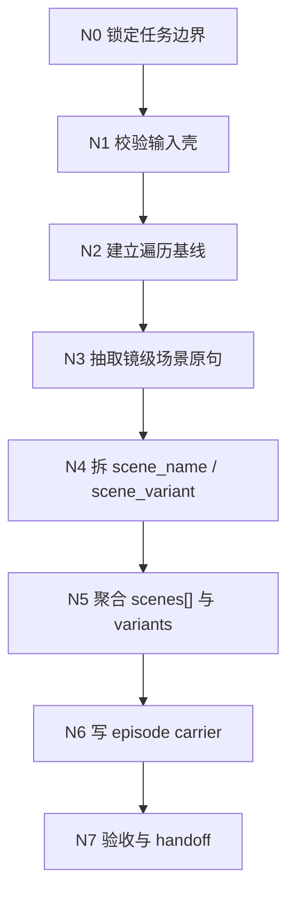
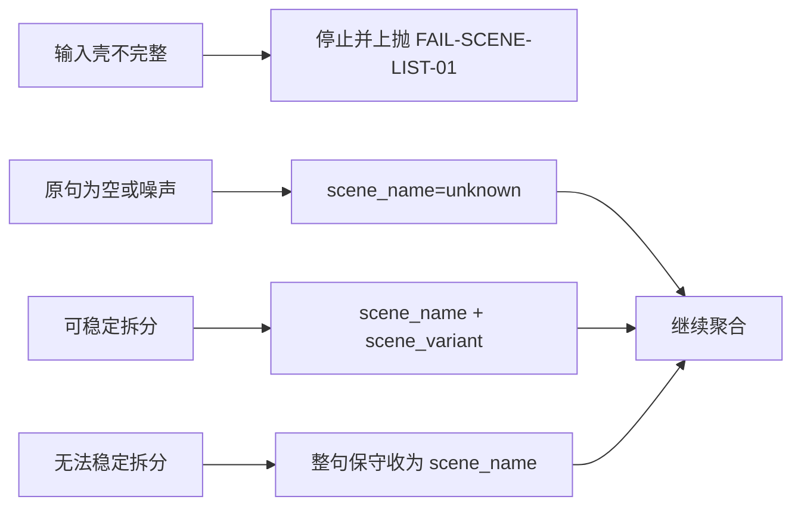
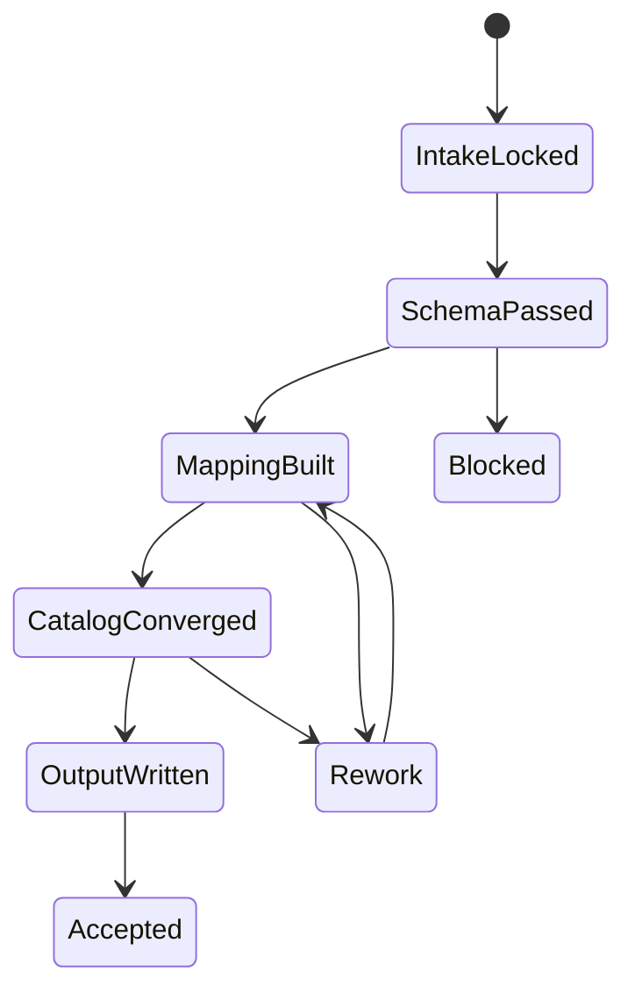

# 4-Design / 1-场景 / 1-清单

## 概述

`1-清单` 负责把上游导演 episode JSON 中已经存在的 `场景及方位` 事实，收束为当前集唯一可复用的 `scene catalog`，供 `2-设计` 直接消费。

本次重构采用 `$skill-知行合一` 的单技能真源口径：

- `复杂链路的骨架 / 细则分层`：`false`
- canonical source：仅本 `SKILL.md`
- 共享脚本：`scripts/extract_scene_catalog.py`
- 不再把思维链、执行流、类型策略、输出契约拆到 `references/`

交付类型：`内容输出型`

## When To Use

- 需要从 `projects/<项目名>/3-Detail/第N集.json` 提取当前集出现过的场景主表。
- 需要把 `分镜明细[].场景及方位` 收束成稳定的 `scene_name / scene_variant / group_scene_map`。
- 需要为 `4-Design/场景/2-设计` 提供唯一场景对象池，避免下游重新从镜头文本猜场景。

## When Not To Use

- 任务还在补导演事实，应回到 `3-Detail`。
- 目标是产出场景设计稿、场景面板、图片 prompt 或视频请求，应进入后续阶段。
- 上游 episode 文件不符合 shared director schema，或缺少 `分镜组列表[] / 分镜明细[]`。

## 单一真源边界

### `1-清单` 拥有

- `场景及方位 -> scene_name / scene_variant` 的保守抽取合同。
- `group_scene_map[]`、`scenes[]`、`summary` 的 episode 级聚合合同。
- `projects/<项目名>/4-Design/场景/1-清单/第N集/第N集.json` 的 canonical 写出。

### `1-清单` 不拥有

- 场景研究、历史考据、网络检索。
- 场景设计稿、材质语言、视觉方案。
- 改写上游 `3-Detail` 镜头事实。

## Business Requirement Analysis Contract

### 业务目标

- 锁定一份稳定、可追溯、可 handoff 的场景对象池。

### 业务对象

- 导演 episode JSON 中的 `分镜组列表[] / 分镜明细[] / 场景及方位`。

### 复杂度来源

- 上游原句存在噪声、缩写、方位词混排。
- 同一主场景会在不同镜头中以不同变体出现。
- 下游要消费的是“稳主键”，而不是“多研究字段”。

### 非目标

- 不补研究稿。
- 不输出设计稿。
- 不额外虚构空间、建筑、布景信息。

### 成功标准

- 同一主场景不会因为方位差异被伪拆成多个场景。
- 每个镜头都能在 `group_scene_map[]` 中回链到抽取结果。
- 输出 `第N集.json` 可直接被 `2-设计` 读取，无需二次解释。

## Total Input Contract

### Canonical Inputs

- `projects/<项目名>/3-Detail/第N集.json`
- `.agents/skills/aigc/_shared/director_episode_output.schema.json`
- `.agents/skills/aigc/SKILL.md`
- `.agents/skills/aigc/CONTEXT.md`
- 本目录下 `CONTEXT.md`

### 必需字段

- `final_output.main_content.分镜组列表[]`
- `分镜组列表[].分镜组ID`
- `分镜组列表[].分镜明细[]`
- `分镜明细[].分镜ID`
- `分镜明细[].场景及方位`

### 推荐字段

- `metadata.episode_id`
- `分镜明细[].时间段`
- `分镜组列表[].剧本正文`

### 输入处理原则

1. 一切场景事实以上游 episode JSON 为准。
2. 只抽取既有 `场景及方位`，不新增研究型字段。
3. shot 级事实只用于提取和映射，不反向改写上游。

## Visual Maps

## Thinking-Action Node Contract

### N0. 锁定任务边界

- `objective`
  - 确认本轮只做场景清单，不越权进入研究或设计。
- `inputs`
  - 用户目标、父级 `1-场景` 合同、本技能 `CONTEXT.md`。
- `from_angles`
  - 产物边界。
  - 下游 handoff 需要什么。
  - 哪些内容绝对不写。
- `actions`
  1. 明确本轮最终产物只有 `第N集.json`，`_manifest.json` 仅在显式要求时输出。
  2. 锁定下游消费方是 `2-设计`，不是图片或视频阶段。
  3. 记录本轮是否需要 `json_only` 或 `full_trace`。
- `evidence`
  - 清晰的输出模式判定。
- `route_out`
  - 成功：进入 `N1`。
  - 失败：返回边界错配说明并停止。
- `gate`
  - 只有确认“当前任务就是场景对象池收束”后才能继续。

### N1. 校验输入壳

- `objective`
  - 确认上游 episode JSON 具备最小 shared schema 壳。
- `inputs`
  - `projects/<项目名>/3-Detail/第N集.json`
  - `.agents/skills/aigc/_shared/director_episode_output.schema.json`
- `from_angles`
  - 根文件是否存在。
  - `分镜组列表[]` 是否存在。
  - `分镜明细[] / 场景及方位` 是否存在。
- `actions`
  1. 读取 root file。
  2. 校验 `final_output.main_content.分镜组列表[]`。
  3. 校验每个 group 是否有 `分镜组ID`。
  4. 统计缺失 `场景及方位` 的镜头数。
- `evidence`
  - 输入壳通过 / 失败结论。
  - 基础缺口统计。
- `route_out`
  - 通过：进入 `N2`。
  - 失败：触发 `FAIL-SCENE-LIST-01` 并停止。
- `gate`
  - 不允许在缺壳情况下伪造场景清单。

### N2. 建立遍历基线

- `objective`
  - 为后续抽取建立稳定的遍历顺序、统计基线和 episode 元数据。
- `inputs`
  - 已通过校验的 episode root。
- `from_angles`
  - episode 标识。
  - group / shot 总量。
  - 输出落点路径。
- `actions`
  1. 锁定 `episode_id`，缺失时从文件名回推。
  2. 按原顺序展开 `分镜组列表[] -> 分镜明细[]`。
  3. 建立 `group_count / shot_count / missing_scene_count` 基线。
  4. 初始化 `group_scene_map[]` 与 `scene_bucket`。
- `evidence`
  - 基线统计。
  - 遍历容器初始化完成。
- `route_out`
  - 成功：进入 `N3`。
  - 失败：返回统计不一致并重做本节点。
- `gate`
  - 遍历总量必须和上游镜头总量一致。

### N3. 抽取镜级场景原句

- `objective`
  - 为每个镜头提取可追溯的 `scene_raw`。
- `inputs`
  - `分镜组ID`
  - `分镜ID`
  - `场景及方位`
  - `时间段`
- `from_angles`
  - 原句是否为空。
  - 是否只剩噪声或标点。
  - 是否需要保留原句供追溯。
- `actions`
  1. 清洗空白、尾部标点和明显噪声。
  2. 保留清洗后的 `scene_raw`。
  3. 若原句为空，则显式标记为 `unknown`，不静默跳过。
  4. 为每条记录登记 `group_id / shot_id / order / time_range`。
- `evidence`
  - 完整的镜级原句映射。
- `route_out`
  - 成功：进入 `N4`。
  - 若大量为空：记录风险但继续。
- `gate`
  - 每个镜头至少产生 1 条待拆分记录。

### N4. 拆分 `scene_name / scene_variant`

- `objective`
  - 把 `scene_raw` 保守拆成稳定主场景和余量变体。
- `inputs`
  - `scene_raw`
  - earliest-marker 规则
- `from_angles`
  - 是否能识别主空间实体。
  - 方位词是否应留在变体。
  - 无法稳定拆分时如何保守回退。
- `actions`
  1. 先找最早出现的方位、门槛、边界、朝向标记。
  2. 优先保住主空间实体作为 `scene_name`。
  3. 余量信息收进 `scene_variant`。
  4. 若切分后主场景为空，则整句回退为 `scene_name`。
  5. 若原句无效，则 `scene_name=unknown`。
- `evidence`
  - 每条记录都有 `scene_name / scene_variant / scene_key_seed`。
- `route_out`
  - 成功：进入 `N5`。
  - 若拆分异常裂变：返回本节点重做。
- `gate`
  - 不允许把氛围词、朝向词误升为新场景主名。

### N5. 聚合 `scenes[]` 与 `variants[]`

- `objective`
  - 用稳定 `scene_key` 聚合同一主场景的多镜头出现。
- `inputs`
  - 已拆分的镜级映射。
- `from_angles`
  - scene_key 是否稳定。
  - 首次出现是否准确。
  - coverage / variants 是否可追溯。
- `actions`
  1. 以 `scene_name` 为主键生成 `scene_key`。
  2. 按首次出现顺序分配 `scene_id`。
  3. 聚合每个场景的 `coverage`、`source_shots`、`variants`。
  4. 去重同义变体，保留出现证据。
  5. 生成 `summary.scene_count / variant_count / unknown_count`。
- `evidence`
  - 完整 `scenes[]`。
  - 完整 `group_scene_map[]`。
- `route_out`
  - 成功：进入 `N6`。
  - 若同一主场景出现多个 `scene_id`：回到本节点。
- `gate`
  - 同一 `scene_name` 不得无理由裂变为多个场景条目。

### N6. 写 episode carrier

- `objective`
  - 生成 canonical `第N集.json`，并在需要时生成 `_manifest.json`。
- `inputs`
  - `summary`
  - `scenes[]`
  - `group_scene_map[]`
  - 输出模式
- `from_angles`
  - 主产物结构是否完整。
  - manifest 是否真有必要。
  - 路径是否落在当前仓。
- `actions`
  1. 写入 `metadata / summary / scenes / group_scene_map / acceptance_notes`。
  2. 明确 `source_file` 和 `output_file`。
  3. 仅在 `full_trace` 时补 `_manifest.json`。
  4. 保证输出路径固定到 `projects/<项目名>/4-Design/场景/1-清单/第N集/`。
- `evidence`
  - `第N集.json`
  - 可选 `_manifest.json`
- `route_out`
  - 成功：进入 `N7`。
  - 失败：回到本节点修补输出壳。
- `gate`
  - 没有 `summary / scenes / group_scene_map` 不得写出完成态。

### N7. 验收与 handoff

- `objective`
  - 确认结果可被 `2-设计` 直接消费，并记录必要风险。
- `inputs`
  - 已写出的产物。
  - 本技能质量门。
- `from_angles`
  - 结构完整性。
  - 回链能力。
  - 下游可消费性。
- `actions`
  1. 复查镜头总数与 `group_scene_map[]` 记录数是否一致。
  2. 复查 `unknown` 占比是否异常。
  3. 复查每个 `scene_id` 是否有 `scene_name / first_appearance / coverage`。
  4. 在 `acceptance_notes` 中写明是否可直接交给 `2-设计`。
- `evidence`
  - 验收结论。
  - 风险摘要。
- `route_out`
  - 通过：任务完成。
  - 不通过：回到对应失败节点。
- `gate`
  - 只有通过结构、追溯和 handoff 三重检查才允许结案。

## Convergence Contract

- 汇流点固定在 `N7`，前面任一节点失败都不得绕过。
- `FAIL-SCENE-LIST-01`：输入壳不完整，回到 `N1`。
- `FAIL-SCENE-LIST-02`：镜级抽取缺失，回到 `N3`。
- `FAIL-SCENE-LIST-03`：主场景聚合裂变，回到 `N5`。
- `FAIL-SCENE-LIST-04`：输出壳不完整，回到 `N6`。
- 所有回退都优先修规则与抽取口径，不靠手工补局部结果掩盖问题。

## One-Shot Output Contract

### Canonical Outputs

- `projects/<项目名>/4-Design/场景/1-清单/第N集/第N集.json`
- `projects/<项目名>/4-Design/场景/1-清单/第N集/_manifest.json` 仅在显式要求追溯时输出

### `第N集.json` 最低结构

1. `metadata`
2. `summary`
3. `scenes`
4. `group_scene_map`
5. `acceptance_notes`

### `scenes[]` 最低结构

1. `scene_id`
2. `scene_name`
3. `scene_key`
4. `first_appearance`
5. `coverage`
6. `variants`
7. `display_profile`

### `group_scene_map[]` 最低结构

1. `order`
2. `group_id`
3. `shot_id`
4. `scene_raw`
5. `scene_name`
6. `scene_variant`
7. `scene_key`
8. `time_range`

### 硬规则

1. 当前模式只输出场景清单，不输出研究稿、设计稿或桥接稿。
2. `scene_name` 必须来自上游 `场景及方位` 的保守抽取，不得凭空研究补写。
3. `group_scene_map[]` 必须能回链 `分镜组ID + 分镜ID`。
4. 当原句为空或无法成立时，允许写 `unknown`，但不得静默跳过该镜头。

## Field Master

| field_id | 输出位置/字段 | 内容要求 | 证据来源 | 默认责任 Step | 质量维度 | 失败码 |
| --- | --- | --- | --- | --- | --- | --- |
| FIELD-SCENE-LIST-01 | `metadata / summary` | 输入源、episode、统计信息完整可追溯 | episode root、文件名、遍历基线 | N1-N2 | 输入真源清晰度 | FAIL-SCENE-LIST-01 |
| FIELD-SCENE-LIST-02 | `group_scene_map[]` | 每个镜头都有 `scene_raw -> scene_name -> scene_variant` 映射 | `分镜组列表[].分镜明细[]` | N3-N4 | 镜级提取稳定性 | FAIL-SCENE-LIST-02 |
| FIELD-SCENE-LIST-03 | `scenes[]` | 同一主场景稳定聚合，首次出现与覆盖范围完整 | 镜级映射、聚合规则 | N5 | 场景聚合稳定性 | FAIL-SCENE-LIST-03 |
| FIELD-SCENE-LIST-04 | `scenes[].variants[]` | 变体可追溯到 group / shot | `scene_variant` 与来源镜头 | N5 | 变体表达清晰度 | FAIL-SCENE-LIST-04 |
| FIELD-SCENE-LIST-05 | `第N集.json / _manifest.json` | episode 级输出完整可 handoff | 输出 carrier 与验收结果 | N6-N7 | 输出可消费性 | FAIL-SCENE-LIST-05 |

## Thought Pass Map

| step_id | 聚焦字段(field_id) | 核心问题 | 生成动作 | 未达标信号 |
| --- | --- | --- | --- | --- |
| N1 | FIELD-SCENE-LIST-01 | 输入壳是否成立 | 校验 root file 与 shared schema 最小壳 | 缺 `分镜组列表[]` 或 `场景及方位` |
| N2 | FIELD-SCENE-LIST-01 | 遍历基线是否稳定 | 建立 episode_id、group/shot 统计与容器 | 统计与上游不一致 |
| N3-N4 | FIELD-SCENE-LIST-02 | 镜级场景是否可追溯且可保守拆分 | 抽 `scene_raw` 并拆 `scene_name / scene_variant` | 原句为空、噪声过多、拆分漂移 |
| N5 | FIELD-SCENE-LIST-03 / FIELD-SCENE-LIST-04 | 同一场景能否稳定聚合 | 生成 `scene_key`、聚合 `scenes[] / variants[]` | 同名主场景裂变 |
| N6-N7 | FIELD-SCENE-LIST-05 | 输出是否可被下游直接消费 | 写 carrier、验收并给 handoff verdict | 缺结构字段或不可追溯 |

## Pass Table

| field_id | 质量维度 | Pass Standard | Fail Code | Rework Entry |
| --- | --- | --- | --- | --- |
| FIELD-SCENE-LIST-01 | 输入真源清晰度 | 输入源路径、episode_id、统计字段完整 | FAIL-SCENE-LIST-01 | N1 |
| FIELD-SCENE-LIST-02 | 镜级提取稳定性 | 每个镜头至少有 1 条可追溯映射记录 | FAIL-SCENE-LIST-02 | N3 |
| FIELD-SCENE-LIST-03 | 场景聚合稳定性 | 同一主场景不出现重复 `scene_id` | FAIL-SCENE-LIST-03 | N5 |
| FIELD-SCENE-LIST-04 | 变体表达清晰度 | 每个变体都能回链原镜头 | FAIL-SCENE-LIST-04 | N5 |
| FIELD-SCENE-LIST-05 | 输出可消费性 | `第N集.json` 可直接交给 `2-设计` 读取 | FAIL-SCENE-LIST-05 | N6 |

## Root-Cause Execution Contract

当出现以下症状时，必须先修本子技能合同：

- 把 `1-清单` 做成研究链或设计链。
- `scene_name / scene_variant` 拆分漂移，导致同一场景反复裂变。
- `group_scene_map` 无法回链 `分镜组ID / 分镜ID`。
- 输出落回旧 runtime，而不是当前 `projects/<项目名>/4-Design/...`。
- 主合同、`references/`、脚本三处并存不同规则，造成第二真源。

必经链路：

`Symptom -> Direct Technical Cause -> Rule Source -> Meta Rule Source -> Fix Landing Points`

优先检查：

- `Rule Source`
  - `.agents/skills/aigc/4-Design/场景/1-清单/SKILL.md`
  - `.agents/skills/aigc/4-Design/场景/1-清单/CONTEXT.md`
  - `.agents/skills/aigc/4-Design/场景/1-清单/scripts/extract_scene_catalog.py`
- `Meta Rule Source`
  - `.agents/skills/aigc/4-Design/场景/SKILL.md`
  - `.agents/skills/aigc/4-Design/SKILL.md`
  - 根 `AGENTS.md`
  - `/Users/vincentlee/.codex/skills/meta/构建/技能/skill-知行合一/SKILL.md`

用户闭环固定返回：

1. 根因位置
2. 立即修复
3. 系统预防修复

## Context Preload

- 执行前先加载 `.agents/skills/aigc/SKILL.md + CONTEXT.md`。
- 再加载 `.agents/skills/aigc/4-Design/SKILL.md + CONTEXT.md`。
- 再加载 `.agents/skills/aigc/4-Design/场景/SKILL.md + CONTEXT.md`。
- 最后加载本 `SKILL.md + CONTEXT.md`。
- 优先级遵循：用户显式请求 > 根 `AGENTS.md` > `aigc` 根技能 > `4-Design` 父级 > `1-场景` 父级 > 本 `SKILL.md` > 各级 `CONTEXT.md`。
