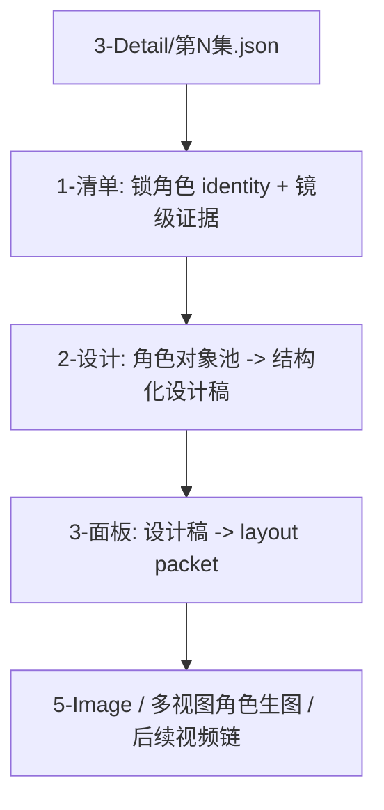
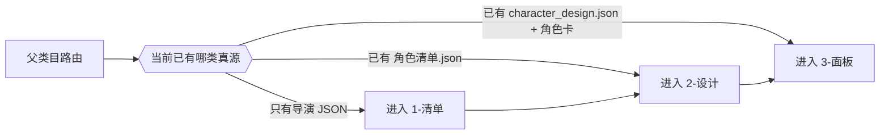

# 4-Design / 2-角色

## 概述

`2-角色` 是 `4-Design` 阶段里负责角色对象池、角色结构化设计稿与角色展示面板 carrier 的类目父级路由合同。

本轮重排遵循 `skill-知行合一`，但保持当前角色链的业务边界、输入根、输出根和子技能职责不变：

- 默认顺序仍是 `1-清单 -> 2-设计 -> 3-面板`
- `1-清单` 仍负责角色 canonical identity、镜级证据与穿搭线索
- `2-设计` 仍负责消费对象池并收束为 `character_design.json + [角色名].md`
- `3-面板` 仍负责把设计稿收束为 layout packet

本类目额外锁定：

- `复杂链路的骨架 / 细则分层 = false`
- 因此三个 active 子技能的关键判型、思行节点、汇流门、失败码与一次性输出合同，都必须直接写在各自主 `SKILL.md`
- `_shared/`、`templates/`、`scripts/`、`agents/` 只保留共享 I/O、模板、执行器与 agent/team 真源，不再承载平行步骤真源

## When to Use

- 需要从 `projects/<项目名>/3-Detail/第N集.json` 继续收束角色类 design-source。
- 需要判断当前任务应先做角色清单、角色设计，还是进入角色面板。
- 需要明确角色链与上游导演事实、下游生图/视频链之间的消费边界。

## When Not to Use

- 任务其实属于 `1-场景 / 3-服装 / 4-道具`，应回到 `4-Design` 父级改路由。
- 当前诉求已经是直接图片生成、视频请求或镜头级 prompt，不在本类目执行。
- 上游 `3-Detail` 事实未稳定，或还不存在可消费的 episode JSON。

## Business Requirement Analysis Contract

| analysis_slot | 当前结论 |
| --- | --- |
| `business_goal` | 把导演 episode JSON 中的角色事实，沿唯一主链收束成角色对象池、角色设计稿与角色面板 carrier |
| `business_object` | `projects/<项目名>/4-Design/角色/` 下的三段式角色设计资产链 |
| `constraint_profile` | 不越权改写导演真源；不跳过对象池直接发明角色设计；不让面板阶段直接替代生图阶段 |
| `success_criteria` | 三个 active 子技能各自单一真源清晰、默认顺序稳定、输入输出回链明确、下游 handoff 不漂移 |
| `non_goals` | 不直接生成角色图、不承担场景/道具长期真源、不把角色链改造成并列多总线 |
| `complexity_source` | 镜级角色事实到对象池的保守收敛、父 skill 对 subagent patch 的统一写回、面板 prompt/layout 的稳定承接 |
| `topology_fit` | 父类目采用串行路由主干，子技能内部各自采用思行网络和汇流门 |
| `step_strategy` | 父类目负责“选入口与定顺序”，局部复杂度全部下沉到 active 子技能主合同内部解决 |

## Visual Maps

## 类目边界

### `2-角色` 拥有

- `projects/<项目名>/4-Design/角色/` 的父级路由与目录约定。
- `清单 -> 设计 -> 面板` 的默认消费顺序。
- 子技能之间的真源边界说明与下游 handoff 入口说明。

### `2-角色` 不拥有

- 越权改写上游导演 JSON。
- 直接替代 `5-Image` 生成角色图。
- 允许任一子技能绕过前序 canonical source。

## 当前路由状态

- `1-清单`：active，负责把镜级角色事实收束成 `角色清单.json + _manifest.json`
- `2-设计`：active，负责把角色对象池收束成 `character_design.json + [角色名].md + _manifest.json`
- `3-面板`：active，负责把角色设计稿收束成 `layout packet + _manifest.json`

## Parent Route Contract (Mandatory)

### 入口决策

1. 只给导演 JSON，且不存在角色对象池时，固定进入 `1-清单`
2. 已有 `角色清单.json`，需要角色视觉/服装/妆容/个性结构化设计时，固定进入 `2-设计`
3. 已有 `character_design.json + [角色名].md`，需要展示面板或多视图 layout packet 时，固定进入 `3-面板`
4. 任何子技能如发现前序真源缺失，必须回退到上一入口，而不是本地伪造补齐

### 共享硬规则

1. 当前类目唯一业务链仍是 `导演事实 -> 角色清单 -> 角色设计 -> 角色面板`
2. 各子技能都必须把关键思行节点、字段主表、汇流门和一次性输出合同写在主 `SKILL.md`
3. 子技能的共享载体只允许放在 `_shared/`、`templates/`、`scripts/`、`agents/`
4. 不得继续在 `references/` 中维护与主 `SKILL.md` 并列演化的步骤真源

## Root-Cause Execution Contract (Mandatory)

当出现以下症状时，必须先修本类目父级合同：

- 用户要“角色设计”，却没有任何角色清单可供消费
- 角色链直接从导演 JSON 跳到面板，不经过对象池收敛
- `1-清单` 已有输出，但下游仍各自重新扫导演 JSON
- 子技能主 `SKILL.md` 与目录内 `references/` 同时演化，形成双真源

必经链路：

`Symptom -> Direct Technical Cause -> Rule Source -> Meta Rule Source -> Fix Landing Points`

优先检查：

- `Rule Source`
  - `.agents/skills/aigc/4-Design/角色/SKILL.md`
  - `.agents/skills/aigc/4-Design/角色/CONTEXT.md`
  - `.agents/skills/aigc/4-Design/角色/1-清单/`
  - `.agents/skills/aigc/4-Design/角色/2-设计/`
  - `.agents/skills/aigc/4-Design/角色/3-面板/`
- `Meta Rule Source`
  - `.agents/skills/aigc/4-Design/SKILL.md`
  - 根 `AGENTS.md`
  - `/Users/vincentlee/.codex/skills/meta/构建/技能/skill-知行合一/SKILL.md`

面向用户的闭环固定返回：

1. root cause location
2. immediate fix
3. systemic prevention fix

## Context Preload (Mandatory)

1. 先加载 `aigc` 根合同与 `4-Design` 父级合同
2. 再加载本类目 `SKILL.md + CONTEXT.md`
3. 进入 `1-清单` 时继续加载其主 `SKILL.md`、`CONTEXT.md`、脚本与共享 schema
4. 进入 `2-设计` 时继续加载其主 `SKILL.md`、`CONTEXT.md`、`_shared/IO_CONTRACT.md`、team 合同与模板
5. 进入 `3-面板` 时继续加载其主 `SKILL.md`、`CONTEXT.md`、`_shared/IO_CONTRACT.md`、模板与 runner
