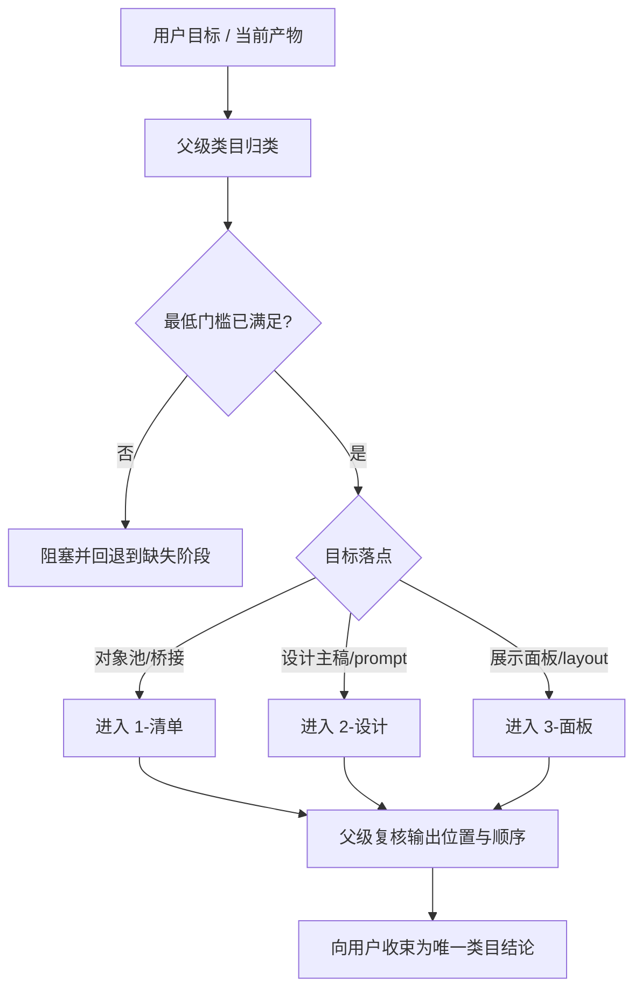
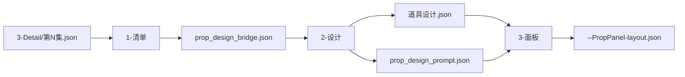
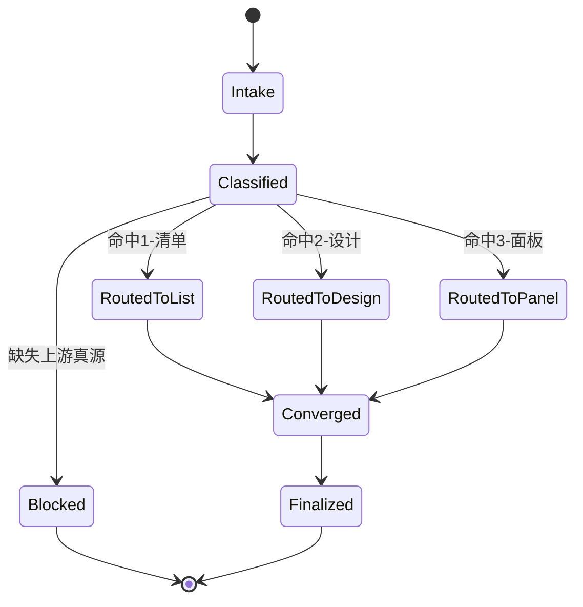

# 4-Design / 4-道具

## 概述

`4-道具` 是 `4-Design` 阶段中负责道具类目路由、阶段顺序锁定与真源收束的父级技能。

它不直接替代 `1-清单 / 2-设计 / 3-面板` 的叶子执行，而是用单一 `SKILL.md` 统筹以下问题：

- 当前任务究竟是在做道具对象池、道具设计 synthesis，还是展示面板 handoff。
- 现有输入真源是否已经满足进入下一段的最低门槛。
- 当前应命中哪个子技能，哪个子技能必须被阻塞回退。
- `清单 -> 设计 -> 面板` 三段链路如何保持单一路由，而不是出现旁路真源。

当前类目保留现有机制与产物路径，不更改脚本、模板、目录与文件命名：

1. `1-清单`
   把 `3-Detail/第N集.json` 收束为 `道具清单.json + 道具研究.json + prop_design_bridge.json`
2. `2-设计`
   把 `prop_design_bridge.json` 收束为 `道具设计.json + prop_design_prompt.json + _manifest.json`
3. `3-面板`
   把 `道具设计.json + prop_design_prompt.json` 收束为逐道具 `PropPanel-layout.json + _manifest.json`

## Business Requirement Analysis Contract

| 分析槽位 | 当前类目答案 |
| --- | --- |
| `business_goal` | 为道具类目建立从导演事实到设计真源再到展示 handoff 的稳定单链路 |
| `business_object` | `projects/<项目名>/4-Design/道具/` 下的对象池、设计主稿与面板 layout |
| `constraint_profile` | 不改写 `3-Detail`；不跳过上游阶段；不把 prompt sidecar 升格为真源；不把展示层写成重新设计 |
| `success_criteria` | 任一任务都能被父级准确归类到 `1-清单 / 2-设计 / 3-面板`，且输出只落到当前类目 canonical 目录 |
| `non_goals` | 不直接执行图片生成、不越权改写角色/场景/服装类目、不另造第二套道具 runtime |
| `evidence_sources` | 用户任务目标、当前项目阶段产物、子技能合同、脚本/模板、根 `AGENTS.md` |
| `topology_fit` | 适合采用“父级任务归类 -> 输入门禁 -> 子技能路由 -> 汇流闭环”的树形主干，而不是全量并行 |

## Total Input Contract

### 必读输入

- 用户当前目标：
  - 想生成道具清单
  - 想生成道具设计主稿
  - 想生成道具展示面板
  - 想排查链路为何卡住
- 项目名与集数
- 当前已存在的阶段产物：
  - `projects/<项目名>/3-Detail/第N集.json`
  - `projects/<项目名>/4-Design/道具/1-清单/第N集/prop_design_bridge.json`
  - `projects/<项目名>/4-Design/道具/2-设计/第N集/道具设计.json`

### 补充输入

- `.agents/skills/aigc/4-Design/道具/1-清单/`
- `.agents/skills/aigc/4-Design/道具/2-设计/`
- `.agents/skills/aigc/4-Design/道具/3-面板/`
- `.agents/skills/aigc/4-Design/SKILL.md`
- 根 `AGENTS.md`

### 父级输入判断硬规则

1. 没有 `3-Detail/第N集.json` 时，不得进入本类目任何下游阶段。
2. 没有 `prop_design_bridge.json` 时，不得进入 `2-设计`。
3. 没有 `道具设计.json` 时，不得进入 `3-面板`。
4. 用户若给出错位路径，父级必须先做阶段判断，再回归 `projects/<项目名>/4-Design/道具/` 的 canonical 路由。

## Visual Maps

## Topology Contract

### 主干

1. 先识别当前任务到底属于哪一段。
2. 再检查进入该段所需的上游真源是否已存在。
3. 再路由到唯一命中的叶子子技能。
4. 最后由父级收束并确认没有出现旁路真源。

### 分支

- 若任务目标和当前产物不匹配：
  - 返回缺失阶段
  - 不允许“先往下做，回头补上游”
- 若用户只想排查为什么卡住：
  - 先做门禁与路径诊断
  - 再给出应回到哪个叶子技能

### 汇流

- 所有路由最终都要回到父级统一口径：
  - 当前命中的子技能是什么
  - 为什么命中它
  - 哪个输入满足或不满足
  - 下一步继续往哪走

## Thinking-Action Node Network

### NODE-PROP-CATEGORY-01 任务归类

- `objective`
  - 判断当前任务究竟是对象池、设计 synthesis、面板 handoff，还是纯诊断。
- `inputs`
  - 用户目标
  - 当前项目与集数
  - 当前存在的阶段产物
- `actions`
  1. 读取用户对“想要什么产物”的表达，而不是只看提到的文件名。
  2. 对照现有三段链路，先判业务停点，再判文件停点。
  3. 若用户描述含糊，优先按“最晚可安全进入的阶段”保守归类。
- `evidence`
  - 当前命中的阶段标签
  - 对应已有或缺失的关键文件
- `route_out`
  - 对象池问题 -> `NODE-PROP-CATEGORY-02`
  - 设计问题 -> `NODE-PROP-CATEGORY-02`
  - 面板问题 -> `NODE-PROP-CATEGORY-02`
  - 纯诊断 -> `NODE-PROP-CATEGORY-02`
- `gate`
  - 只有阶段被明确归类后，才允许继续做门禁判断。

#### 着手面

- 任务语言层：用户说的是“清单”“设计稿”“面板”“修问题”中的哪一种。
- 产物层：当前磁盘上已经存在哪些真源文件。
- 语义层：用户想要的是上游补足，还是下游继续。

### NODE-PROP-CATEGORY-02 上游真源门禁

- `objective`
  - 检查当前阶段是否具备最低输入门槛。
- `inputs`
  - `3-Detail/第N集.json`
  - `prop_design_bridge.json`
  - `道具设计.json`
- `actions`
  1. 若命中 `1-清单`，只要求 `3-Detail/第N集.json` 存在且可读。
  2. 若命中 `2-设计`，必须确认 `prop_design_bridge.json` 已存在。
  3. 若命中 `3-面板`，必须确认 `道具设计.json` 已存在。
  4. 若缺少上游真源，直接给出阻塞结论，不允许越级补下游。
- `evidence`
  - 文件存在性检查结果
  - 对应缺失项
- `route_out`
  - 满足门槛 -> `NODE-PROP-CATEGORY-03`
  - 不满足门槛 -> `NODE-PROP-CATEGORY-04`
- `gate`
  - 只有通过门禁，才允许继续路由到叶子技能。

#### 着手面

- 文件层：存在、不存在、路径是否 canonical。
- 阶段层：缺的是本阶段输入还是更上游的前置阶段。
- 风险层：若越级执行会造成什么真源漂移。

### NODE-PROP-CATEGORY-03 唯一路由与执行边界锁定

- `objective`
  - 在 `1-清单 / 2-设计 / 3-面板` 中选择唯一命中子技能，并锁定父级不越权。
- `inputs`
  - 阶段归类结果
  - 门禁检查结果
  - 三个叶子技能合同
- `actions`
  1. 把当前任务映射到唯一叶子技能，而不是同时激活多个子技能。
  2. 明确当前轮父级只做路由、监督和收束，不替子技能生成业务产物。
  3. 若用户的目标跨两个阶段，先按上游优先原则只命中最早未完成阶段。
- `evidence`
  - `selected_child_skill`
  - `blocked_child_skill` 或 `deferred_child_skill`
- `route_out`
  - 命中完成 -> `NODE-PROP-CATEGORY-05`
- `gate`
  - 只有单一子技能被选中，父级才允许收束。

#### 着手面

- 路由层：是否单点命中。
- 真源层：是否出现两个叶子都想写同一份事实的风险。
- 顺序层：是否遵守 `清单 -> 设计 -> 面板`。

### NODE-PROP-CATEGORY-04 阻塞回退与根因定位

- `objective`
  - 当当前任务无法进入目标阶段时，给出明确回退入口与根因链。
- `inputs`
  - 缺失的上游真源
  - 父级/叶子技能合同
- `actions`
  1. 明确缺的是哪一个文件或哪一道阶段事实。
  2. 指出应回到哪一个叶子技能补足。
  3. 用 `Symptom -> Direct Cause -> Rule Source -> Meta Rule Source` 写出最小根因链。
- `evidence`
  - 缺失文件清单
  - 需要回退的技能路径
- `route_out`
  - 回退建议完成 -> `NODE-PROP-CATEGORY-05`
- `gate`
  - 阻塞状态可作为最终输出，但不能冒充当前阶段已完成。

#### 着手面

- 根因层：是输入没产出、路径错位，还是阶段越级。
- 规则层：父级合同错，还是叶子合同错。
- 修复层：先补内容，还是先修源层合同。

### NODE-PROP-CATEGORY-05 父级汇流与一次性输出

- `objective`
  - 把本轮类目判断收束为唯一结论，并给出下一步入口。
- `inputs`
  - 命中子技能
  - 阻塞或通过结果
  - 下一步目标
- `actions`
  1. 汇总当前阶段结论、依据和下一步。
  2. 明确本轮不会并列给出多个“也可以”的阶段入口。
  3. 若是修问题，附上立即修复与系统预防修复。
- `evidence`
  - 命中子技能
  - 通过/阻塞依据
  - 下一步建议
- `route_out`
  - 通过汇流 -> final output
- `gate`
  - 只有当“当前阶段 + 进入理由 + 下一步”三者齐备时，才允许对用户结案。

#### 着手面

- 结论层：当前应该做什么。
- 证据层：为什么是这个阶段。
- 后续层：下一个最自然的承接动作是什么。

## Convergence Contract

父级允许结案，必须同时满足：

1. 当前任务已被唯一归类到一个阶段或一个阻塞回退结论。
2. 已说明所依赖的关键输入为何满足或不满足。
3. 已明确当前轮父级不越权替叶子技能改写业务真源。
4. 已给出下一步唯一推荐入口。

若不满足以上任一条件，必须回到对应节点重做，不得提前宣布“类目判断完成”。

## One-Shot Output Contract

父级对用户的最终输出固定收束为一份类目级结论，不并列给出多个互相竞争的路由。

### 最终结果

- 当前命中的阶段或阻塞回退阶段
- 对应 canonical 路径前缀：
  - `projects/<项目名>/4-Design/道具/1-清单/`
  - `projects/<项目名>/4-Design/道具/2-设计/`
  - `projects/<项目名>/4-Design/道具/3-面板/`

### 思考过程

- 为什么判定当前属于这一个阶段
- 依据了哪些现有产物
- 为什么不能直接跳到更下游

### 核心证据

- 已存在或缺失的关键文件
- 当前类目路由顺序

### 风险 / 未完成支路

- 缺失的上游阶段
- 任何被阻塞的路径

### 下一步

- 唯一推荐的叶子技能入口

## Root-Cause Execution Contract (Mandatory)

当出现以下症状时，必须先修本类目父级合同：

- 任务明明是道具设计，却还停留在 `1-清单` 的研究层。
- 道具链直接从 `3-Detail` 跳到 prompt，没有经过 bridge 或 design master。
- `2-设计` 已有输出，但下游仍各自重新扫 `3-Detail`。
- 父级同时把一个任务发给两个叶子技能，导致阶段重叠。

必经链路：

`Symptom -> Direct Technical Cause -> Rule Source -> Meta Rule Source -> Fix Landing Points`

优先检查：

- `Rule Source`
  - `.agents/skills/aigc/4-Design/道具/SKILL.md`
  - `.agents/skills/aigc/4-Design/道具/CONTEXT.md`
  - `.agents/skills/aigc/4-Design/道具/1-清单/`
  - `.agents/skills/aigc/4-Design/道具/2-设计/`
  - `.agents/skills/aigc/4-Design/道具/3-面板/`
- `Meta Rule Source`
  - `.agents/skills/aigc/4-Design/SKILL.md`
  - 根 `AGENTS.md`

## Context Preload (Mandatory)

1. `.agents/skills/aigc/SKILL.md + CONTEXT.md`
2. `.agents/skills/aigc/4-Design/SKILL.md + CONTEXT.md`
3. 本 `SKILL.md + CONTEXT.md`
4. 命中的叶子技能 `SKILL.md + CONTEXT.md`

## Lite Field Map

| step_id | field_id | intent | failure_signal | rework_entry |
| --- | --- | --- | --- | --- |
| P1 | FIELD-PROP-CATEGORY-01 | 锁定当前任务到底属于清单、设计、面板还是诊断 | 只看文件名，不看真实业务停点 | 回到 `NODE-PROP-CATEGORY-01` |
| P2 | FIELD-PROP-CATEGORY-02 | 检查当前阶段的最低输入门槛 | 越级进入下游，缺上游真源仍继续 | 回到 `NODE-PROP-CATEGORY-02` |
| P3 | FIELD-PROP-CATEGORY-03 | 在三个叶子技能中选择唯一入口 | 同时命中多个叶子，或父级越权执行 | 回到 `NODE-PROP-CATEGORY-03` |
| P4 | FIELD-PROP-CATEGORY-04 | 给出阻塞回退与根因链 | 只说“不能做”，不说缺什么、回哪里 | 回到 `NODE-PROP-CATEGORY-04` |
| P5 | FIELD-PROP-CATEGORY-05 | 把本轮类目判断收束为唯一结论 | 输出多个竞争建议，或没有下一步入口 | 回到 `NODE-PROP-CATEGORY-05` |
