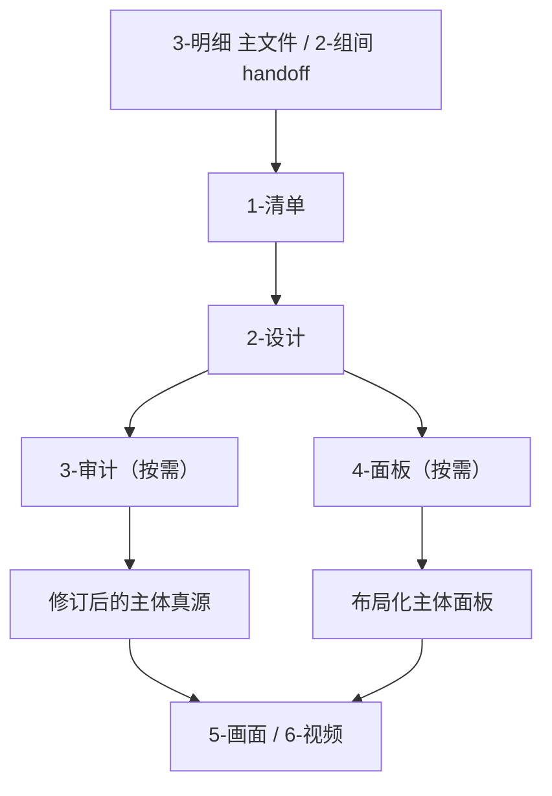
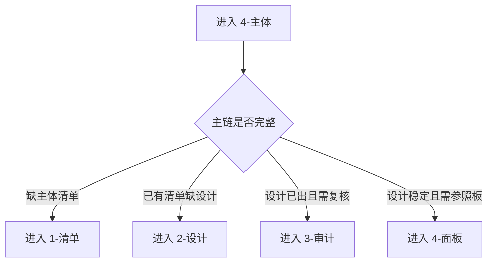

# aigc 4-主体

## 概述

`4-主体` 是 `aigc` 主链里承接 `3-明细`、服务 `5-画面 / 6-视频` 的主体真源阶段。

它统一治理三类对象：

1. `角色`
2. `场景`
3. `道具`

本阶段固定回答四件事：

1. 从 `3-明细` 与 `2-组间` 中提炼出哪些主体需要被稳定建档。
2. 如何把这些主体收束成可续跑的设计真源。
3. 何时需要在设计之后进入审计修正。
4. 何时需要把主体进一步布局化为可消费面板。

本技能已按最新规范重构为“主合同 + references 模块细则”结构，不改变原有阶段语义、路径、顾问团运行时与父子边界。

## When to Use

- 需要从脚本阶段抽出角色、场景、道具主体并建立稳定清单。
- 需要把主体真源从“脚本里的描述”升级成可复用的设计资产。
- 需要判断当前应进入主体清单、设计、审计还是面板。
- 需要给 `5-画面`、`6-视频` 提供稳定的主体参照入口。

## When Not to Use

- 当前仍在补 `1-规划`、`2-组间` 或 `3-明细` 的上游真源。
- 当前任务只是在现成主体图上做单次视频生成，不需要主体阶段合同。
- 用户只要求直接做 `5-画面` 或 `6-视频` 的执行层而非主体治理层。

## 阶段边界

### `4-主体` 拥有

- 主体阶段总路由。
- `1-清单 -> 2-设计` 主链约束。
- `3-审计 / 4-面板` 的按需进入规则。
- 顾问团运行时与阶段级 canonical 落点。

### `4-主体` 不拥有

- 上游 `3-明细` 真源改写。
- 取代叶子技能执行具体产物。
- 把审计或面板误升格为默认必经主链。

## Visual Maps

- `1-清单 -> 2-设计` 是默认主链。
- `3-审计 / 4-面板` 只在显式命中或下游阻塞时进入。

- 模糊请求默认落到“最高优先级未完成主链阶段”。
- 扩展链诉求不能覆盖主链缺口。

## Canonical Module References

| 模块 | 作用 | 真源文件 |
| --- | --- | --- |
| 思维链 | 承载字段主表、thought pass 与返工入口 | `references/chain-of-thought.md` |
| 执行流程 | 承载落点、workflow 与顾问团运行时 | `references/execution-flow.md` |
| 类型策略 | 承载阶段路由、VSM 与回退规则 | `references/type-strategies.md` |
| 输出契约 | 承载固定交付件与硬规则 | `references/output-template.md` |

## Execution Summary

- `4-主体` 负责阶段级路由，不替代叶子技能的局部合同。
- canonical 阶段根目录仍为 `projects/<项目名>/4-主体/`。
- 详细 workflow、落点与顾问团运行时见 `references/execution-flow.md`。

## Output Summary

- 阶段级固定交付仍为：`subject-stage-index.md / validation-report.md / 当前命中子路径产物 / 唯一下一入口`。
- 固定交付件与硬规则已下沉到 `references/output-template.md`。

## Strategy Summary

- 默认判定顺序仍为：`主链完成度 -> 用户任务意图 -> 顾问团运行时 -> 下游阻塞`。
- 子路径矩阵、VSM 变量、情况判定与 fallback 已下沉到 `references/type-strategies.md`。

## Field System Summary

- 字段体系仍保持 `FIELD-SUBJECT-01` 到 `FIELD-SUBJECT-04`。
- thought pass 与 pass table 见 `references/chain-of-thought.md`。

## Root-Cause Execution Contract (Mandatory)

当出现以下症状时，必须先修 `4-主体` 的父级合同，而不是只补单次主体文案：

- 已有四个子目录，但无法判断用户请求该进哪一个。
- `3-审计` 或 `4-面板` 被误当成最短默认链必经阶段。
- `2-设计` 直接跳过主体清单，开始发明角色/场景/道具真源。
- 主体真源落点漂移到 `3-明细`、`5-画面` 或临时报告目录。

必经链路：

`Symptom -> Direct Technical Cause -> Rule Source -> Meta Rule Source -> Fix Landing Points`

优先检查：

- `Rule Source`
  - `.agents/skills/aigc/4-主体/SKILL.md`
  - `.agents/skills/aigc/4-主体/CONTEXT.md`
  - `.agents/skills/aigc/4-主体/references/*.md`
  - `.agents/skills/aigc/4-主体/subtypes/*/SKILL.md`
- `Meta Rule Source`
  - `.agents/skills/aigc/SKILL.md`
  - 根 `AGENTS.md`

## Context Preload (Mandatory)

- 执行前先加载 `.agents/skills/aigc/SKILL.md + CONTEXT.md`。
- 再加载本 `SKILL.md + CONTEXT.md`。
- 需要细则时继续读取 `references/*.md`。
- 进入子路径时，继续加载对应 `subtypes/<子路径>/SKILL.md + CONTEXT.md`。
- 若项目根 `team.yaml.enabled == true`，继续加载 `.agents/skills/aigc/_shared/council-runtime/module-spec.md`。
