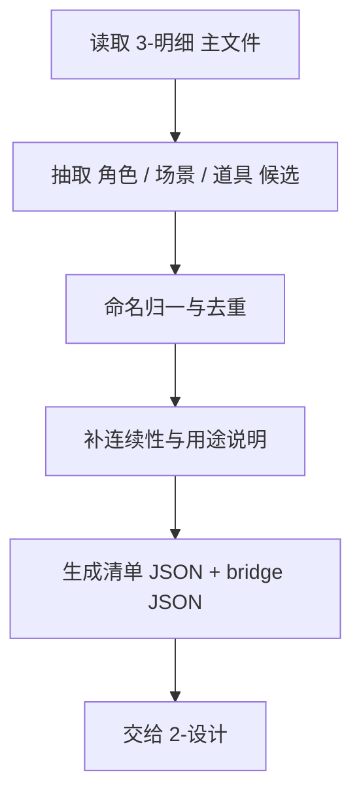
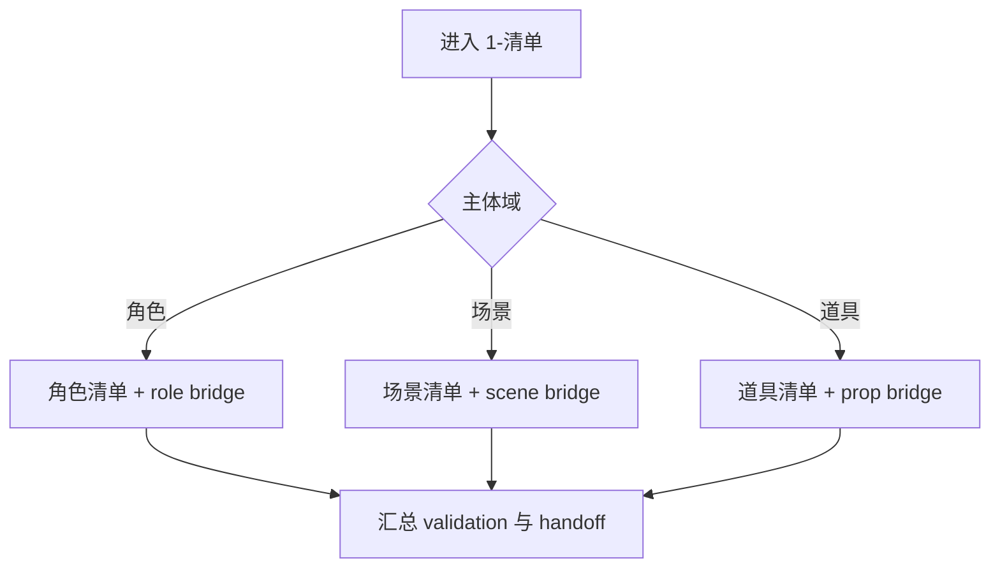

# 1-清单

## 概述

`1-清单` 是 `4-主体` 阶段的第一站。

它负责把 `3-明细` 中已经出现但仍分散在文本里的主体，统一提炼为可追溯的三类清单：

1. `角色清单`
2. `场景清单`
3. `道具清单`

交付类型：`非内容输出型`

本子技能已按最新规范重构为“主合同 + references 模块细则”结构，不改变原有分域落盘、bridge sidecar 与下游交接语义。

## When to Use

- 需要从 `3-明细` 主文件中抽出角色、场景、道具主体。
- 需要为下游 `2-设计` 准备结构化 bridge 输入。
- 需要先解决主体命名、去重、连续性与用途归一。

## When Not to Use

- 已经有稳定主体清单，只差设计定稿。
- 当前任务是审计既有设计或生成主体面板。
- 上游 `3-明细` 主文件尚未稳定，主体仍在频繁改写。

## 子技能边界

### `1-清单` 拥有

- 主体抽取。
- 主体归一与去重。
- 角色/场景/道具三类 bridge sidecar。
- 面向 `2-设计` 的证据整理。

### `1-清单` 不拥有

- 最终设计定稿。
- 设计风格裁决。
- 图像审计与二次修订。
- 面板布局生成。

## Visual Maps

- 主流程目标不是“列名录”，而是给 `2-设计` 建立单一输入面。
- `bridge JSON` 与清单 JSON 同级重要。

- 三个域可并行分析，但必须独立落盘。
- 若分域不清，优先回到脚本证据而不是臆造归类。

## Canonical Module References

| 模块 | 作用 | 真源文件 |
| --- | --- | --- |
| 思维链 | 承载字段主表、thought pass 与返工入口 | `references/chain-of-thought.md` |
| 执行流程 | 承载落点、workflow 与顾问团继承规则 | `references/execution-flow.md` |
| 类型策略 | 承载分域判定、命名归一与 fallback | `references/type-strategies.md` |
| 输出契约 | 承载固定交付件与硬规则 | `references/output-template.md` |

## Execution Summary

- `1-清单` 负责主体抽取、归一与 bridge 建档，不越权做设计定稿。
- canonical 落点仍为 `projects/<项目名>/4-主体/1-清单/`。
- 详细 workflow、落点与顾问团继承规则见 `references/execution-flow.md`。

## Output Summary

- 固定交付仍为：三类清单 JSON、三类 bridge JSON、`validation-report.md` 与 `2-设计` 下一入口。
- 固定交付件与硬规则已下沉到 `references/output-template.md`。

## Strategy Summary

- 判定顺序仍为：`分域 -> 命名归一 -> 证据充分度 -> bridge 完整度`。
- 域路由矩阵、VSM 变量与回退规则见 `references/type-strategies.md`。

## Field System Summary

- 字段体系仍保持 `FIELD-SINV-01` 到 `FIELD-SINV-04`。
- thought pass 与 pass table 见 `references/chain-of-thought.md`。

## Root-Cause Execution Contract (Mandatory)

当出现以下症状时，必须先修本合同：

- `2-设计` 不知道该消费哪些主体。
- 同一主体在不同分组里出现多个名字，没人做归一。
- 角色/场景/道具被混写在同一份清单，导致下游难消费。
- 清单只有名字，没有连续性与用途说明。

必经链路：

`Symptom -> Direct Technical Cause -> Rule Source -> Meta Rule Source -> Fix Landing Points`

优先检查：

- `Rule Source`
  - `.agents/skills/aigc/4-主体/subtypes/1-清单/SKILL.md`
  - `.agents/skills/aigc/4-主体/subtypes/1-清单/CONTEXT.md`
  - `.agents/skills/aigc/4-主体/subtypes/1-清单/references/*.md`
  - `projects/<项目名>/3-明细/第N集.md`
- `Meta Rule Source`
  - `.agents/skills/aigc/4-主体/SKILL.md`
  - `.agents/skills/aigc/SKILL.md`
  - 根 `AGENTS.md`

## Context Preload (Mandatory)

- 执行前先加载 `.agents/skills/aigc/4-主体/SKILL.md + CONTEXT.md`。
- 再加载本 `SKILL.md + CONTEXT.md`。
- 需要细则时继续读取 `references/*.md`。
- 优先级遵循：用户显式请求 > 根 `AGENTS.md` > `.agents/skills/aigc/SKILL.md` > `.agents/skills/aigc/4-主体/SKILL.md` > 本 `SKILL.md` > 各级 `CONTEXT.md`。
