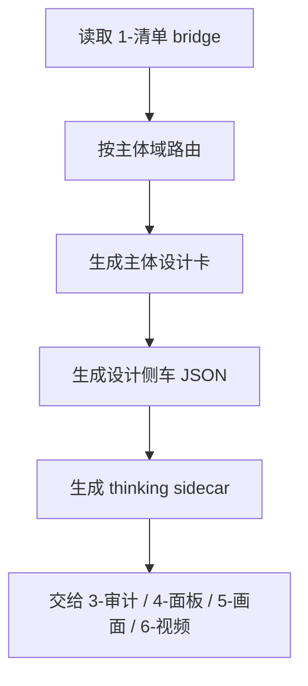
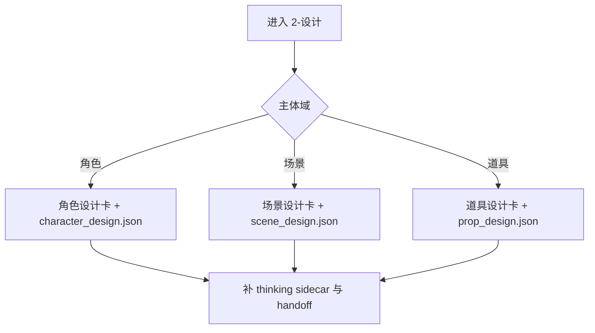

# 2-设计

## 概述

`2-设计` 是 `4-主体` 主链里的第二站。

它负责消费 `1-清单` 的主体清单与 bridge sidecar，把主体升级为可续跑的设计真源，而不是临时描述。

交付类型：`内容输出型`

本子技能已按最新规范重构为“主合同 + references 模块细则”结构，不改变原有三件套交付、路径与主链边界。

## When to Use

- 已有主体清单，需要形成角色、场景、道具的设计真源。
- 需要给 `5-画面`、`6-视频` 提供稳定主体卡或提示词入口。
- 需要把脚本层主体信息转换成可执行的设计资产。

## When Not to Use

- 还没有主体清单与 bridge sidecar。
- 当前任务只是在既有主体设计上做审计修正。
- 只需要布局化面板，而设计真源已经稳定。

## 子技能边界

### `2-设计` 拥有

- 角色/场景/道具设计卡。
- 设计侧车 JSON。
- 设计思考 sidecar。
- 下游消费接口。

### `2-设计` 不拥有

- 主体抽取与清单归一。
- 审计裁决与二次修正。
- 布局化面板输出。

## Visual Maps

- 主流程目标是把 bridge 升级为设计真源，而不是重新猜主体。
- `thinking sidecar` 与设计卡、JSON 并列为固定交付。

- 三个域可并行设计，但正式落盘要按主体与主体域分开写入。
- 若 bridge 不齐，优先补输入，不直接继续创作。

## Canonical Module References

| 模块 | 作用 | 真源文件 |
| --- | --- | --- |
| 思维链 | 承载字段主表、thought pass 与返工入口 | `references/chain-of-thought.md` |
| 执行流程 | 承载落点、workflow 与顾问团继承规则 | `references/execution-flow.md` |
| 类型策略 | 承载域路由、输入判定与 handoff 回退 | `references/type-strategies.md` |
| 输出契约 | 承载固定交付件与硬规则 | `references/output-template.md` |

## Execution Summary

- `2-设计` 负责主体设计真源，不越权回头重做 `1-清单` 抽取。
- canonical 主产物仍落在 `projects/<项目名>/4-主体/2-设计/`。
- 详细 workflow、落点与顾问团继承规则见 `references/execution-flow.md`。

## Output Summary

- 固定交付仍为：设计卡、设计 JSON、thinking sidecar、`validation-report.md` 与唯一下一入口。
- 固定交付件与硬规则已下沉到 `references/output-template.md`。

## Strategy Summary

- 判定顺序仍为：`bridge 完整度 -> 域判定 -> 三件套交付 -> 下游 handoff`。
- 域路由矩阵、VSM 变量与 fallback 见 `references/type-strategies.md`。

## Field System Summary

- 字段体系仍保持 `FIELD-SDES-01` 到 `FIELD-SDES-04`。
- thought pass 与 pass table 见 `references/chain-of-thought.md`。

## Root-Cause Execution Contract (Mandatory)

当出现以下症状时，必须先修本合同：

- `2-设计` 产物只剩空泛描述，无法给下游直接消费。
- 只有 Markdown，没有机读侧车。
- 只有 JSON，没有人读设计卡。
- 设计与 `1-清单` bridge 出现冲突，却没有说明覆盖理由。

必经链路：

`Symptom -> Direct Technical Cause -> Rule Source -> Meta Rule Source -> Fix Landing Points`

优先检查：

- `Rule Source`
  - `.agents/skills/aigc/4-主体/subtypes/2-设计/SKILL.md`
  - `.agents/skills/aigc/4-主体/subtypes/2-设计/CONTEXT.md`
  - `.agents/skills/aigc/4-主体/subtypes/2-设计/references/*.md`
  - `projects/<项目名>/4-主体/1-清单/*/*_design_bridge.json`
- `Meta Rule Source`
  - `.agents/skills/aigc/4-主体/SKILL.md`
  - `.agents/skills/aigc/SKILL.md`
  - 根 `AGENTS.md`

## Context Preload (Mandatory)

- 执行前先加载 `.agents/skills/aigc/4-主体/SKILL.md + CONTEXT.md`。
- 再加载本 `SKILL.md + CONTEXT.md`。
- 需要细则时继续读取 `references/*.md`。
- 优先级遵循：用户显式请求 > 根 `AGENTS.md` > `.agents/skills/aigc/SKILL.md` > `.agents/skills/aigc/4-主体/SKILL.md` > 本 `SKILL.md` > 各级 `CONTEXT.md`。
