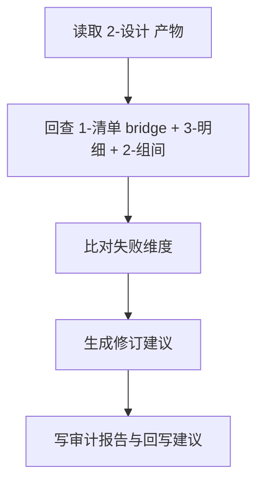
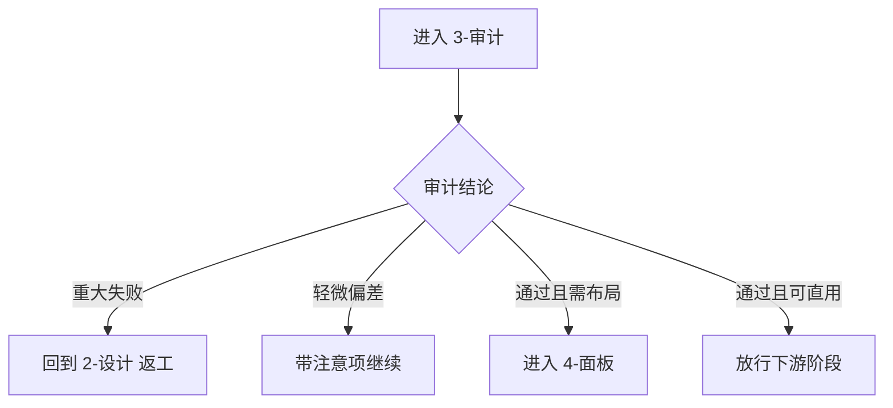

# 3-审计

## 概述

`3-审计` 是 `4-主体` 阶段在 `2-设计` 之后的可选复核层。

它负责把“主体应该长成什么”与“当前设计实际上长成什么”做同轴比对，收束为：

1. `失败维度`
2. `修订建议`
3. `回写结论`

交付类型：`非内容输出型`

本子技能已按最新规范重构为“主合同 + references 模块细则”结构，不改变原有审计闭环、证据链与返工路由语义。

## When to Use

- 需要复核角色、场景、道具设计是否偏离上游意图。
- 需要给 `2-设计` 提供结构化返工入口。
- 需要在进入 `4-面板` 或下游阶段前先做一致性审计。

## When Not to Use

- 还没有稳定的 `2-设计` 产物。
- 当前任务只是第一次出主体设计。
- 用户只要直接做布局板，不需要先复核设计。

## 子技能边界

### `3-审计` 拥有

- 设计一致性比对。
- 失败维度与优先级。
- 修订建议与回写建议。
- 审计报告。

### `3-审计` 不拥有

- 主体清单归一。
- 第一版主体设计创作。
- 面板布局输出。

## Visual Maps

- 主流程目标不是点评，而是把偏差收束成可执行返工入口。
- 每条结论都必须可回链到上游约束。

- 若关键失败项未关闭，默认不进入面板。
- 若证据链不足，先补证据再出终局裁决。

## Canonical Module References

| 模块 | 作用 | 真源文件 |
| --- | --- | --- |
| 思维链 | 承载字段主表、thought pass 与返工入口 | `references/chain-of-thought.md` |
| 执行流程 | 承载落点、workflow 与顾问团继承规则 | `references/execution-flow.md` |
| 类型策略 | 承载域路由、偏差判定与 fallback | `references/type-strategies.md` |
| 输出契约 | 承载固定交付件与硬规则 | `references/output-template.md` |

## Execution Summary

- `3-审计` 负责审计闭环，不越权代替 `2-设计` 或 `4-面板` 的执行。
- canonical 落点仍为 `projects/<项目名>/4-主体/3-审计/`。
- 详细 workflow、落点与顾问团继承规则见 `references/execution-flow.md`。

## Output Summary

- 固定交付仍为：结构化失败维度、修订建议、总报告、单主体审计文件、`writeback-plan.md` 与唯一下一入口。
- 固定交付件与硬规则已下沉到 `references/output-template.md`。

## Strategy Summary

- 判定顺序仍为：`证据链 -> 失败维度 -> 修订建议 -> 下一入口`。
- 域路由矩阵、VSM 变量与回退规则见 `references/type-strategies.md`。

## Field System Summary

- 字段体系仍保持 `FIELD-SAUD-01` 到 `FIELD-SAUD-04`。
- thought pass 与 pass table 见 `references/chain-of-thought.md`。

## Root-Cause Execution Contract (Mandatory)

当出现以下症状时，必须先修本合同：

- 审计只给主观点评，没有失败维度。
- 审计结论无法回链上游约束。
- 明明需要返工，却没有给 `2-设计` 的回写入口。
- 审计做完后，下一步仍然模糊。

必经链路：

`Symptom -> Direct Technical Cause -> Rule Source -> Meta Rule Source -> Fix Landing Points`

优先检查：

- `Rule Source`
  - `.agents/skills/aigc/4-主体/subtypes/3-审计/SKILL.md`
  - `.agents/skills/aigc/4-主体/subtypes/3-审计/CONTEXT.md`
  - `.agents/skills/aigc/4-主体/subtypes/3-审计/references/*.md`
  - `projects/<项目名>/4-主体/2-设计/`
- `Meta Rule Source`
  - `.agents/skills/aigc/4-主体/SKILL.md`
  - `.agents/skills/aigc/SKILL.md`
  - 根 `AGENTS.md`

## Context Preload (Mandatory)

- 执行前先加载 `.agents/skills/aigc/4-主体/SKILL.md + CONTEXT.md`。
- 再加载本 `SKILL.md + CONTEXT.md`。
- 需要细则时继续读取 `references/*.md`。
- 优先级遵循：用户显式请求 > 根 `AGENTS.md` > `.agents/skills/aigc/SKILL.md` > `.agents/skills/aigc/4-主体/SKILL.md` > 本 `SKILL.md` > 各级 `CONTEXT.md`。
