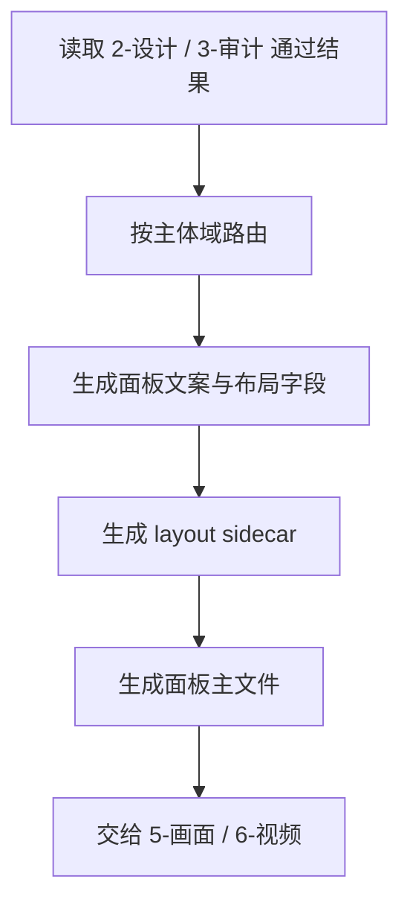
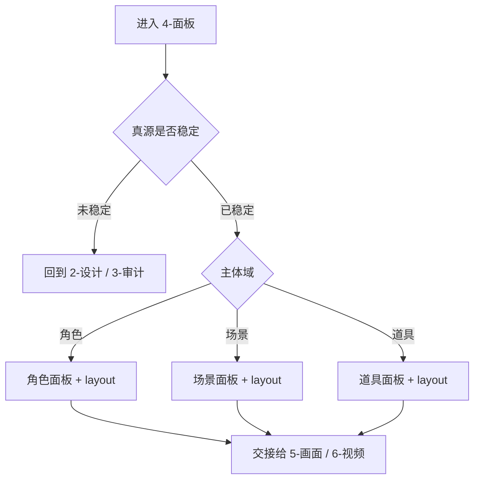

# 4-面板

## 概述

`4-面板` 是 `4-主体` 阶段在设计完成之后的布局化分支。

它不再重做主体设计，而是把已经稳定的主体真源整理成可供后续参照的面板资产：

1. `角色面板`
2. `场景面板`
3. `道具面板`

交付类型：`内容输出型`

本子技能已按最新规范重构为“主合同 + references 模块细则”结构，不改变原有 layout 语义、双产物交付与下游参照定位。

## When to Use

- 需要把主体设计升级为统一布局板、参照板或展示板。
- 需要给 `5-画面`、`6-视频` 提供更易消费的主体面。
- 需要把通过审计的设计进一步收束成布局化资产。

## When Not to Use

- 主体设计还没有稳定。
- 当前任务只是第一次出主体设计，不需要布局化。
- 还在做审计返工，尚未确定最终设计版本。

## 子技能边界

### `4-面板` 拥有

- 面板版式规划。
- 面板文案与布局字段。
- layout sidecar。
- 下游参照面。

### `4-面板` 不拥有

- 主体抽取。
- 第一版主体设计。
- 设计偏差裁决。

## Visual Maps

- 主流程目标是把稳定设计压缩成可消费参照面，而不是重新发明设计。
- 主文件与 layout sidecar 同时成立才算完成。

- 审计关键失败项未关闭时，优先回退，不继续面板化。
- 三个主体域可并行布局，但 handoff 需要统一出口。

## Canonical Module References

| 模块 | 作用 | 真源文件 |
| --- | --- | --- |
| 思维链 | 承载字段主表、thought pass 与返工入口 | `references/chain-of-thought.md` |
| 执行流程 | 承载落点、workflow 与顾问团继承规则 | `references/execution-flow.md` |
| 类型策略 | 承载域路由、真源判定与 fallback | `references/type-strategies.md` |
| 输出契约 | 承载固定交付件与硬规则 | `references/output-template.md` |

## Execution Summary

- `4-面板` 负责布局化参照，不越权重做主体设计。
- canonical 落点仍为 `projects/<项目名>/主体/4-面板/`。
- 详细 workflow、落点与顾问团继承规则见 `references/execution-flow.md`。

## Output Summary

- 固定交付仍为：面板主文件、layout sidecar、`validation-report.md`、下游参照交接说明与唯一下一入口。
- 固定交付件与硬规则已下沉到 `references/output-template.md`。

## Strategy Summary

- 判定顺序仍为：`真源稳定度 -> 域判定 -> 双产物交付 -> 下游参照目标`。
- 域路由矩阵、VSM 变量与回退规则见 `references/type-strategies.md`。

## Field System Summary

- 字段体系仍保持 `FIELD-SPNL-01` 到 `FIELD-SPNL-04`。
- thought pass 与 pass table 见 `references/chain-of-thought.md`。

## Root-Cause Execution Contract (Mandatory)

当出现以下症状时，必须先修本合同：

- 面板重新发明主体设计，而不是继承设计真源。
- 只有面板文案，没有 layout sidecar。
- 只有 layout，没有人读主文件。
- 审计尚未通过，却直接把有缺陷版本做成面板。

必经链路：

`Symptom -> Direct Technical Cause -> Rule Source -> Meta Rule Source -> Fix Landing Points`

优先检查：

- `Rule Source`
  - `.agents/skills/aigc/4-主体/subtypes/4-面板/SKILL.md`
  - `.agents/skills/aigc/4-主体/subtypes/4-面板/CONTEXT.md`
  - `.agents/skills/aigc/4-主体/subtypes/4-面板/references/*.md`
  - `projects/<项目名>/主体/2-设计/`
- `Meta Rule Source`
  - `.agents/skills/aigc/4-主体/SKILL.md`
  - `.agents/skills/aigc/SKILL.md`
  - 根 `AGENTS.md`

## Context Preload (Mandatory)

- 执行前先加载 `.agents/skills/aigc/4-主体/SKILL.md + CONTEXT.md`。
- 再加载本 `SKILL.md + CONTEXT.md`。
- 需要细则时继续读取 `references/*.md`。
- 优先级遵循：用户显式请求 > 根 `AGENTS.md` > `.agents/skills/aigc/SKILL.md` > `.agents/skills/aigc/4-主体/SKILL.md` > 本 `SKILL.md` > 各级 `CONTEXT.md`。
