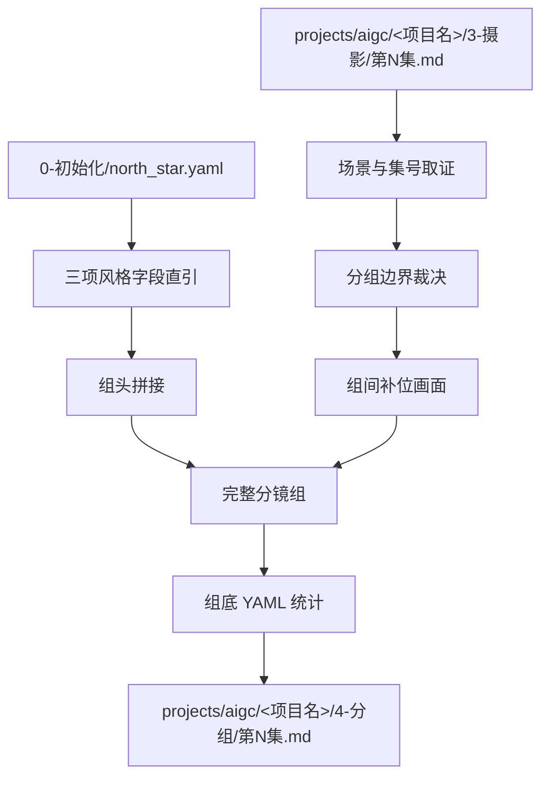
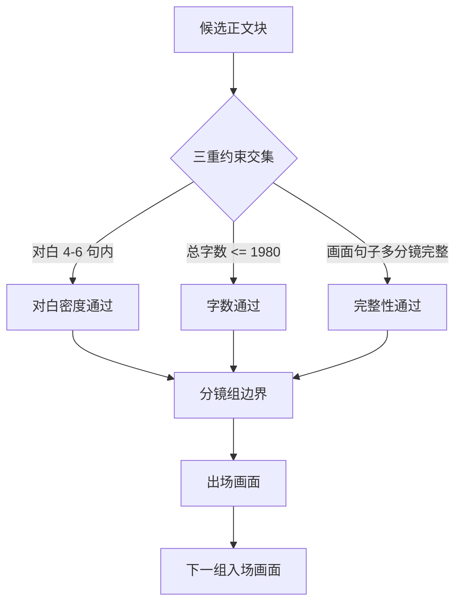

# aigc 4-分组

`4-分组` 负责把 `3-摄影` 的逐集摄影稿切分为可供后续设计、图像和视频阶段消费的完整分镜组。它不改写上游剧本正文和镜头语言，只裁决组边界、补入组间衔接用的入场/出场画面、拼接项目 `north_star.yaml` 的风格字段，并在组底部附加统计 YAML。

## Context Loading Contract

- 每次调用 `$aigc-grouping` 时，必须同时加载同目录 `CONTEXT.md`。
- 每次调用本技能时，必须同时识别并加载同目录 `types/` 中选中的类型包（单选或多选）。
- 若任务绑定 `projects/aigc/<项目名>/`，必须先加载项目根 `MEMORY.md`、`projects/aigc/<项目名>/0-初始化/north_star.yaml`，再按需加载项目根 `CONTEXT/` 或 `CONTEXT/` 中与角色、场景、道具、风格和制作约束相关的上下文文件。
- 上游正文真源固定为 `projects/aigc/<项目名>/3-摄影/第N集.md`，除非用户显式指定其他摄影稿文件。
- 冲突优先级：用户显式请求 > 根 `AGENTS.md` / meta 规则 > 本 `SKILL.md` > `references/` / `steps/` / `types/` / `review/` / `templates/` > `agents/openai.yaml` > 项目 `MEMORY.md` > 项目 `CONTEXT/` / `CONTEXT/` > 本 `CONTEXT.md`。
- 分组边界、补位画面、角色/场景/道具提取和组内完整性判断必须由 LLM 直接完成；`scripts/` 只能做读取、字数统计、ID/标题/YAML 结构检查和机械校验。

## Input Contract

Accepted input:

- 项目名、项目路径、单个 `projects/aigc/<项目名>/3-摄影/第N集.md` 文件，或多个集号范围。
- 用户要求“分组”“分镜组”“从 3-摄影 到 4-分组”“给摄影稿按分镜组切分”“添加入场画面/出场画面”等任务。
- 已完成或部分完成的 `3-摄影` 逐集稿；默认以集为单位处理 `第N集.md`。

Required input:

- 可定位、可读取的 `projects/aigc/<项目名>/3-摄影/第N集.md`。
- 可定位、可读取的 `projects/aigc/<项目名>/0-初始化/north_star.yaml`。
- 至少一个目标集号，或允许默认处理 `3-摄影/` 中全部 `第N集.md`。
- 输入正文中存在可识别的场景标题、剧本字段、对白字段、画面字段或镜头语言字段。

Optional input:

- 项目 `MEMORY.md` 中的长期偏好、禁区、衔接节奏或视觉惯性要求。
- 项目 `CONTEXT/` 或 `CONTEXT/` 中的角色表、场景表、道具表、世界观、风格和制作约束。
- 用户额外指定的最大组长、对白密度、特殊桥接画面偏好或下游视频生成限制。

Reject or clarify when:

- 上游 `3-摄影/第N集.md` 或 `0-初始化/north_star.yaml` 不存在、不可读，且用户没有提供替代真源。
- 用户要求脚本自动生成分组正文、补位画面或统计提取结论；必须改为 LLM 主创、脚本只校验。
- 用户要求改变剧情事实、改对白、删减镜头语言、重排场景顺序或把多集混写成一个分镜组。
- 当前项目只存在 legacy `5-分组/` 而用户未明确允许写入 legacy 路径时，应报告路径漂移；本技能 canonical 输出为 `4-分组/`。

## Mode Selection

| mode | 触发信号 | 输出 |
| --- | --- | --- |
| `single_episode` | 指定单个 `第N集.md` 或单个集号 | `projects/aigc/<项目名>/4-分组/第N集.md` |
| `episode_range` | 指定多个集号或集号范围 | 多个逐集分镜组稿与更新后的执行报告 |
| `all_ready_episodes` | 未指定集号但 `3-摄影/` 下有 `第N集.md` | 全部可读逐集分镜组稿 |
| `repair` | 已有分组稿 ID 错误、组过长、补位画面断裂、north_star 拼接缺失或 YAML 统计不完整 | 最小修复后的逐集分组稿与问题报告 |
| `review_only` | 用户只要求检查 `4-分组` 输出 | 审查报告，不改写正文，除非用户随后要求修复 |

## Reference Loading Guide

| 场景 | 必读文件 |
| --- | --- |
| 任意分组任务 | `steps/grouping-workflow.md`、`references/group-boundary-contract.md`、`references/north-star-projection-contract.md` |
| 入场画面、出场画面、组间惯性衔接 | `references/bridge-shot-contract.md` |
| 组底 YAML 统计、角色/场景/道具抽取 | `references/statistics-yaml-contract.md` |
| 判断输入稿、边界风险和修复策略 | `types/grouping-type-map.md` |
| 验收、修复和 review gate | `review/review-contract.md` |
| 输出样板 | `templates/output-template.md`、`templates/episode-groups.template.md` |
| 脚本辅助边界与机械校验 | `scripts/README.md` |
| 可复用经验 | `knowledge-base/grouping-heuristics.md` |
| 产品入口元数据 | `agents/openai.yaml` |

## Visual Maps

## Execution Contract

1. 读取本 `SKILL.md + CONTEXT.md`，并在项目任务中加载项目 `MEMORY.md`、`0-初始化/north_star.yaml` 与相关 `CONTEXT/` 或 `CONTEXT/`。
2. 锁定上游 `3-摄影/第N集.md`，提取集号、场景标题、正文块、对白字段、画面字段、镜头语言块和场景顺序；不得改写原正文。
3. 按 `references/north-star-projection-contract.md` 从 `north_star.yaml` 直引 `全局风格.全局风格提示词`、`类型元素.类型元素提示词`、`细分风格.画面风格`，以隐藏标题字段的三行纯内容写入每个分镜组组头。
4. 按 `references/group-boundary-contract.md` 执行边界裁决：每组同时满足对白 4-6 句弹性上限、完整组构成总字数不超过 1980 字、同一画面句子及其多分镜不被截断，并通过短组回填复核；不得仅因情绪、话题或危险信息转折切出低密度短组。
5. 按 `references/bridge-shot-contract.md` 设计 1-2 秒、通常非对白的补位画面：上一组 `出场画面：` 与下一组 `入场画面：` 必须是同一画面内容，并分别能自然承接上一组原尾帧与下一组原首帧；每集第 1 组不存在首帧补位，直接省略 `入场画面：` 段。
6. 给每个分镜组标注 `x-y-z` 格式 `分镜组ID`：`x` 为真实集号，`y` 为真实场景号，`z` 为该场景内分镜组序号；跨场景时组序号重新从 1 开始。
7. 按 `references/statistics-yaml-contract.md` 在每组底部附加 YAML 统计；统计 YAML 本身不计入 1980 字限制，也不计入 `字数统计`。
8. 写入 `projects/aigc/<项目名>/4-分组/第N集.md`，并生成或更新 `projects/aigc/<项目名>/4-分组/执行报告.md`。
9. 按 `review/review-contract.md` 执行验收；可运行 `scripts/validate_storyboard_groups.py` 做机械检查，但脚本不得替代 LLM 分组和补位画面判断。

## Script And Metadata Contract

| path | role |
| --- | --- |
| `scripts/README.md` | 说明脚本只能承担机械辅助，不替代 LLM 分组判断 |
| `scripts/validate_storyboard_groups.py` | 可选机械校验：检查分镜组 ID、风格字段、入场/出场标题、YAML 统计、字数上限和编号连续性 |
| `agents/openai.yaml` | 提供产品侧入口元数据，默认提示必须显式提到 `$aigc-grouping` |

## Field Mapping

| field_id | 输出/证据 | 内容要求 | 失败码 |
| --- | --- | --- | --- |
| `FIELD-GROUP-01` | 输入取证 | source cinematography episode、north_star、项目记忆、相关上下文、目标集号明确 | `FAIL-GROUP-01` |
| `FIELD-GROUP-02` | north_star 拼接 | 每组直引 `全局风格.全局风格提示词`、`类型元素.类型元素提示词`、`细分风格.画面风格` 三项，组头不显示标题字段、中文括号或装饰性连接符 | `FAIL-GROUP-02` |
| `FIELD-GROUP-03` | 分镜组 ID | `x-y-z` 与真实集、场、组匹配，场内组号连续 | `FAIL-GROUP-03` |
| `FIELD-GROUP-04` | 边界裁决 | 对白 4-6 句、总字数 <= 1980、画面句子及多分镜完整、短组已回填复核，不以情绪/话题/危险信息转折作为切组原则 | `FAIL-GROUP-04` |
| `FIELD-GROUP-05` | 入场/出场画面 | 组间补位同画面、1-2 秒、通常非对白，每集首组省略入场画面段 | `FAIL-GROUP-05` |
| `FIELD-GROUP-06` | 原文保真 | `3-摄影` 划定正文同步原换行，不删改字段、对白或镜头语言 | `FAIL-GROUP-06` |
| `FIELD-GROUP-07` | YAML 统计 | 每组底部含 `字数统计`、`角色`、`场景`、`道具`，且统计块不计入字数 | `FAIL-GROUP-07` |
| `FIELD-GROUP-08` | 输出落盘 | `4-分组/第N集.md` 与 `执行报告.md` 可复查 | `FAIL-GROUP-08` |

## Thought Pass Map

| step_id | pass_name | input | judgment | output |
| --- | --- | --- | --- | --- |
| `PASS-GROUP-01` | 输入与风格取证 | 摄影稿、north_star、项目上下文 | 是否具备可分组真源与三项风格字段 | `input_lock` |
| `PASS-GROUP-02` | 场景锚定 | 场景标题与正文顺序 | 真实集号、真实场景号和场内组序 | `scene_group_index` |
| `PASS-GROUP-03` | 边界裁决 | 候选正文块、对白数、字数、镜头语言块 | 是否同时满足三重约束和完整性 | `group_boundary_plan` |
| `PASS-GROUP-04` | 补位画面设计 | 当前组尾帧、下一组首帧、视觉惯性 | 出场与下一入场是否为同一可衔接画面 | `bridge_shot_pair` |
| `PASS-GROUP-05` | 统计抽取 | 完整分镜组正文 | 角色、场景、重要叙事道具是否准确 | `stats_yaml` |
| `PASS-GROUP-06` | 落盘与审查 | 分组稿 | ID、字数、补位、north_star、YAML 是否通过 | `review_result` |

## Pass Table

| pass_id | must_do | evidence | Rework Entry |
| --- | --- | --- | --- |
| `PASS-GROUP-01` | 读取上游摄影稿与 north_star 三项字段 | input manifest、字段摘录 | `references/north-star-projection-contract.md` |
| `PASS-GROUP-02` | 建立 `x-y-z` ID 映射 | 集号、场景号、场内组号表 | `references/group-boundary-contract.md` |
| `PASS-GROUP-03` | 按三重约束确定边界 | 对白数、字数估算、完整镜头块证据 | `references/group-boundary-contract.md` |
| `PASS-GROUP-04` | 设计组间补位画面 | 出场/下一入场同画面说明 | `references/bridge-shot-contract.md` |
| `PASS-GROUP-05` | 抽取角色、场景、道具统计 | 组底 YAML | `references/statistics-yaml-contract.md` |
| `PASS-GROUP-06` | 验证输出结构 | validator 输出或人工 review | `review/review-contract.md` |

## Root-Cause Execution Contract (Mandatory)

出现以下问题时，必须沿链路上溯并修复源层合同：

- 分镜组 ID 与真实集号、场景号或场内组序不匹配。
- 只按字数硬切，导致同一画面句子或其 `镜头语言` 多分镜被截断。
- 完整组构成超过 1980 字，却把 YAML 统计或补位画面漏算/错算。
- 仅因情绪、话题或危险信息转折切出低密度短组，且没有执行回填复核。
- 对白数失控，长对话超过 4 句仍强塞一组，或短对白超过 6 句仍不拆。
- 上一组 `出场画面：` 与下一组 `入场画面：` 不是同一画面内容，或无法自然连接首尾帧。
- 补位画面写成新剧情、新对白或改写原剧本事实。
- 未直引 `north_star.yaml` 的三项风格字段，或用摘要替代原文，或把字段标题、中文括号和多余连接符暴露到组头。
- YAML 统计缺角色、场景、道具，或把统计块计入 1980 字限制。
- 脚本、模板拼接或规则补句替代 LLM 的分组边界、补位画面和统计判断。

必经链路：

`Symptom -> Direct Script/Prompt Overreach -> 4-分组 Section Owner -> AGENTS.md LLM-first / Skill 2.0 Rule`

## Output Contract

### Required output

1. 逐集分组稿固定写入 `projects/aigc/<项目名>/4-分组/第N集.md`。
2. 阶段执行报告写入或更新 `projects/aigc/<项目名>/4-分组/执行报告.md`。
3. 每个分镜组必须包含：`[分镜组ID]`、组头三项 north_star 风格纯内容、从 `3-摄影` 划定的分镜剧本正文、`出场画面：`、组底 YAML 统计；第 2 组起还必须包含 `入场画面：`。
4. 每集第 1 个分镜组直接省略 `入场画面：` 段，不写 `无`，不占用字数；后续组的 `入场画面：` 必须与上一组 `出场画面：` 为同一画面内容。
5. 分镜剧本正文必须同步原换行，不改写 `3-摄影` 的字段、对白、镜头语言或场景顺序。
6. 每组正文构成总字数不超过 1980 字；统计 YAML 不计入 1980 字限制，也不计入 `字数统计`。

### Output format

| output_id | format |
| --- | --- |
| `OUTPUT-GROUP-EPISODE` | Markdown 逐集分镜组稿 |
| `OUTPUT-GROUP-REPORT` | Markdown 执行报告 |

### Output path

| output_id | canonical path |
| --- | --- |
| `OUTPUT-GROUP-EPISODE` | `projects/aigc/<项目名>/4-分组/第N集.md` |
| `OUTPUT-GROUP-REPORT` | `projects/aigc/<项目名>/4-分组/执行报告.md` |

### Naming convention

- 逐集分组稿命名为 `第N集.md`。
- 阶段报告命名为 `执行报告.md`。
- 分镜组 ID 使用 `x-y-z`：`集-场-组`，例如 `1-1-1`。
- 不创建 `第N集-分组.md`、`groups.md`、`storyboard_groups.md`、legacy `5-分组/` 等平行真源，除非用户显式指定兼容写入。

### Completion gate

- 已读取本 `SKILL.md + CONTEXT.md`，并在项目任务中加载项目 `MEMORY.md`、`0-初始化/north_star.yaml` 与相关 `CONTEXT/` 或 `CONTEXT/`。
- 上游 `3-摄影/第N集.md` 可回指，输出 frontmatter 记录 `source_cinematography_path` 与 `north_star_path`。
- 每组都直引 `全局风格.全局风格提示词`、`类型元素.类型元素提示词`、`细分风格.画面风格`，且组头不显示标题字段、中文括号或装饰性连接符。
- 每组 ID 与真实集、场、组匹配；场内组序连续。
- 每组满足对白 4-6 句弹性上限、完整组构成 <= 1980 字、画面句子及其多分镜不截断，并通过短组回填复核。
- 组间补位画面成对一致：上一组出场等于下一组入场；每集首组不输出入场画面段。
- 每组底部 YAML 统计含 `字数统计`、`角色`、`场景`、`道具`，且 YAML 统计块未被计入字数。
- 已运行 `scripts/validate_storyboard_groups.py` 或执行等价人工 review，结果写入 `执行报告.md`。
