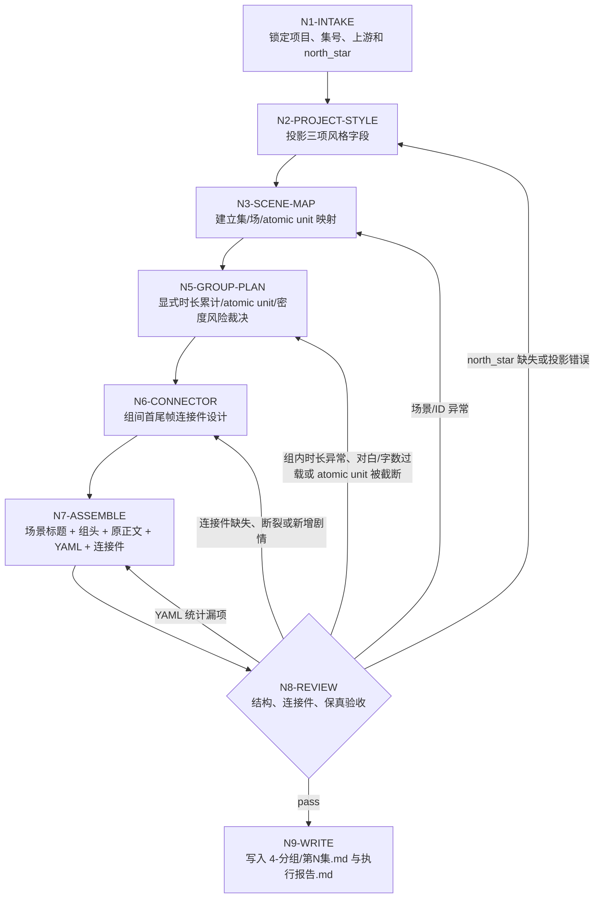
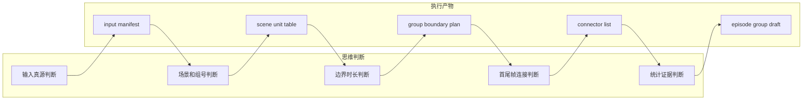
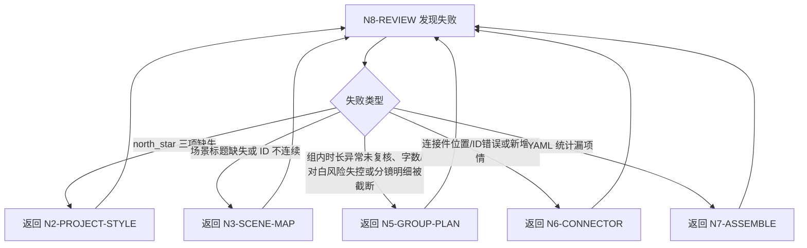

# Grouping Workflow

本文件定义 `4-分组` 的思行一体执行拓扑。

## Business Requirement Analysis

| slot | answer |
| --- | --- |
| `business_goal` | 将逐集摄影稿切成完整分镜组，供后续设计、图像和视频阶段稳定消费 |
| `business_object` | `projects/aigc/<项目名>/3-摄影/第N集.md` 与 `0-初始化/north_star.yaml` |
| `constraint_profile` | 组内显式时长累计优先接近 15 秒，通常约 12-18 秒可接受，且单组不得超过 18 秒；画面句子多分镜和对应对白承托不可截断，但不能作为超 18 秒放行理由；字数/对白只作辅助风险复核；相邻组具备 3-4 秒首尾帧连接件 |
| `success_criteria` | 每组 ID 真实、风格投影含置顶于第 1 行最前的全局固定前置词、正文保真、组间连接自然、统计 YAML 可复查 |
| `non_goals` | 不改剧情、不改对白、不重写原有分镜明细、不生成图像/视频提示词 |
| `complexity_source` | 边界裁决、组间首尾帧连接件、显式时长累计与完整性汇流 |
| `topology_fit` | 串行取证 + 场景内树形分组 + 相邻组 pairwise review + 统一验收 |

## Node Network

| node_id | objective | inputs | actions | evidence | route_out | gate |
| --- | --- | --- | --- | --- | --- | --- |
| `N1-INTAKE` | 锁定项目、集号、上游和 north_star | 用户请求、项目目录 | 定位 `3-摄影/第N集.md`、`north_star.yaml`、项目记忆和上下文 | input manifest | `N2-PROJECT-STYLE` | 必需输入可读 |
| `N2-PROJECT-STYLE` | 投影三项风格字段 | north_star | 抽取 `全局风格.全局风格提示词`、`类型元素.类型元素提示词`、`细分风格.画面风格`，并把固定前置词 `视频生成的画面风格，光影和氛围与场景参照图保持一致。需要生成现场物理互动音效、氛围感音效、环境声、自然现象声、动作声，不要生成任何字幕，不要生成背景音乐。` 放在第 1 行最前，再接全局风格原词 | style projection | `N3-SCENE-MAP` | 三项字段齐全且固定前置词已置顶于第 1 行最前 |
| `N3-SCENE-MAP` | 建立集/场/atomic unit 映射 | 摄影稿正文 | 提取场景标题、字段、分镜明细块、显式 `分镜N（约X秒）` 和对白数 | scene unit table | `N5-GROUP-PLAN` | atomic unit 不跨场景 |
| `N5-GROUP-PLAN` | 裁决组边界 | scene unit table、style projection | 按显式时长累计形成组计划：优先接近 15 秒，通常约 12-18 秒可接受；低于约 10 秒做回填复核，超过 18 秒必须拆分、重组或回退 `3-摄影` 修复，不能例外放行；字数/对白只作辅助风险检查 | group boundary plan | `N6-CONNECTOR` | 每组时长接近 15 秒、完整且 `<=18` 秒 |
| `N6-CONNECTOR` | 设计组间首尾帧连接件 | 相邻组首尾 atomic unit、style projection、场景标题 | 在第 N+1 组完成后回看第 N 组原尾帧与第 N+1 组原首帧，逐对设计 3-4 秒连接件并判断同场景/跨场景连接，内部选择依赖型/流动型/变形型/复合型/无连接方法论，先落盘场景标题行：同场景重复同一标题，跨场景写 `场景标题A ➡️ 场景标题B`；再落盘三项 north_star 风格行和具体画面连接办法；不复述端点，改写为变化过程、主体运动、运镜设计和透视适应，末尾用 `避免元素` 写负面约束，连接件 ID 固定为 `上一个分镜组ID~下一个分镜组ID` | connector list | `N7-ASSEMBLE` | 相邻组都有连接件，且不新增剧情、不使用旧入场/出场尾钩、不输出 `连接件提示：` |
| `N7-ASSEMBLE` | 组装分组稿 | group plan、connector list、style projection、scene title list | 每个分镜组标题后先写当前场景标题行，即便场景未切换也重复同一标题；再写组头、原正文、YAML 统计，并把组间连接件物理夹放在对应上下两个相邻分镜组之间；场景标题行计入 YAML `字数统计`，不计入 `时长估算` | episode group draft | `N8-REVIEW` | 正文同步原换行 |
| `N8-REVIEW` | 验收结构和质量 | 分组稿、上游、validator | 运行机械检查或人工 review，记录报告 | review result | `N9-WRITE` 或返工 | 所有 gate pass |
| `N9-WRITE` | 落盘交付 | accepted draft | 写 `4-分组/第N集.md` 与 `执行报告.md` | output files | done | 输出可复查 |

## Failure Routes

| failure | return_to |
| --- | --- |
| north_star 三项缺失 | `N2-PROJECT-STYLE`，先修复或请求授权 |
| 场景标题缺失或重复异常 | `N3-SCENE-MAP`，回上游摄影稿修复 |
| 组内累计时长低于约 10 秒，或高于 18 秒 | `N5-GROUP-PLAN`，移动完整 atomic unit；若单个 atomic unit 超 18 秒，回退 `3-摄影` 修复 |
| 场景标题行加正文超 1680 字、对白过载或旧稿缺少显式秒数 | `N5-GROUP-PLAN`，做密度风险复核或回到 `3-摄影` 补时长 |
| 同一分镜明细被截断 | `N5-GROUP-PLAN`，恢复 atomic unit |
| 连接件缺失、无法从尾帧抵达首帧，或连接件新增剧情 | `N6-CONNECTOR`，重写 3-4 秒连接件 |
| YAML 统计漏项 | `N7-ASSEMBLE`，重抽统计 |
| validator 失败 | `N8-REVIEW`，按 fail_code 返工 |
