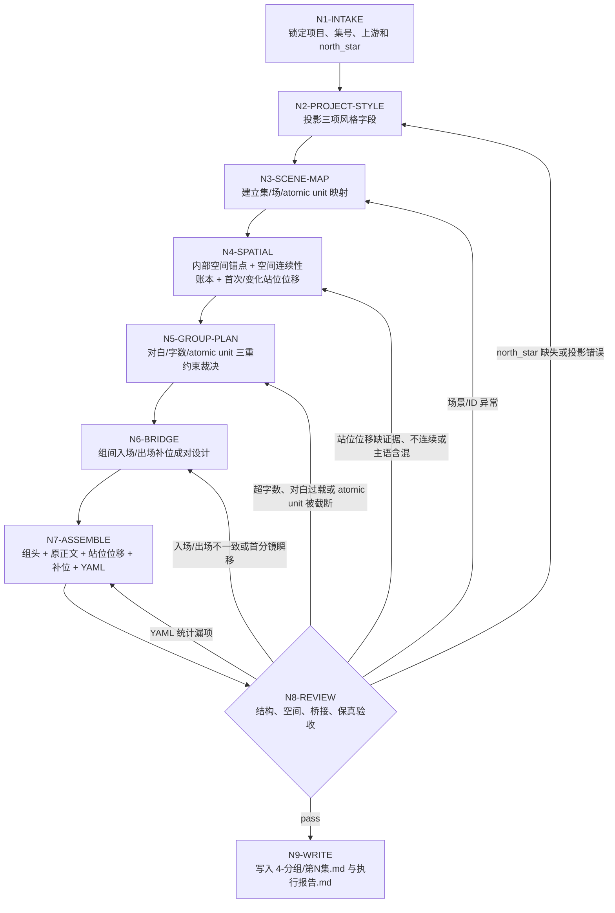
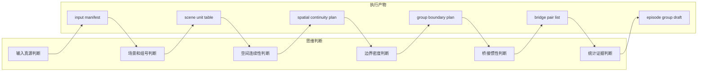
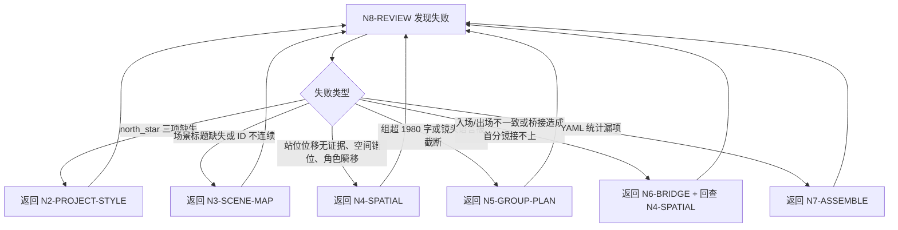

# Grouping Workflow

本文件定义 `4-分组` 的思行一体执行拓扑。

## Business Requirement Analysis

| slot | answer |
| --- | --- |
| `business_goal` | 将逐集摄影稿切成完整分镜组，供后续设计、图像和视频阶段稳定消费 |
| `business_object` | `projects/aigc/<项目名>/3-摄影/第N集.md` 与 `0-初始化/north_star.yaml` |
| `constraint_profile` | 对白 4-6 句、完整组构成 <= 1980 字、画面句子多分镜不可截断、站位位移主语、空间参照和多角色顺位明确、站位位移与剧情动作和上一组尾帧连续、连续无变化分镜不重复输出、补位画面成对一致 |
| `success_criteria` | 每组 ID 真实、风格投影含置顶于第 1 行最前的全局固定前置词、首次锁定及变化分镜含明确角色名主语的站位位移且不输出独立空间锚点字段、空间移动可由上游分镜证据或组间补位推导、正文保真、桥接自然、统计 YAML 可复查 |
| `non_goals` | 不改剧情、不改对白、不重写原有镜头语言、不生成图像/视频提示词 |
| `complexity_source` | 边界裁决、空间一致性、组间桥接、字数与完整性汇流 |
| `topology_fit` | 串行取证 + 空间锚定 + 场景内树形分组 + 相邻组 pairwise review + 统一验收 |

## Node Network

| node_id | objective | inputs | actions | evidence | route_out | gate |
| --- | --- | --- | --- | --- | --- | --- |
| `N1-INTAKE` | 锁定项目、集号、上游和 north_star | 用户请求、项目目录 | 定位 `3-摄影/第N集.md`、`north_star.yaml`、项目记忆和上下文 | input manifest | `N2-PROJECT-STYLE` | 必需输入可读 |
| `N2-PROJECT-STYLE` | 投影三项风格字段 | north_star | 抽取 `全局风格.全局风格提示词`、`类型元素.类型元素提示词`、`细分风格.画面风格`，并把固定前置词 `视频生成的画面风格，光影和氛围与场景参照图保持一致。不生成文字字幕和BGM，仅生成物理互动音效与环境和氛围音效。` 放在第 1 行最前，再接全局风格原词 | style projection | `N3-SCENE-MAP` | 三项字段齐全且固定前置词已置顶于第 1 行最前 |
| `N3-SCENE-MAP` | 建立集/场/atomic unit 映射 | 摄影稿正文 | 提取场景标题、字段、镜头语言块、对白数和候选空间参照点 | scene unit table | `N4-SPATIAL` | atomic unit 不跨场景 |
| `N4-SPATIAL` | 提取内部空间锚点、建立空间连续性账本与站位位移 | scene unit table、镜头语言、分镜明细、上一组出场/本组入场补位候选 | 每组提取 1 个或多个内部空间锚点；内部记录 entry_state、previous_state、shot_evidence、allowed_delta、exit_state；为首次锁定和发生变化的 `分镜N:` 补入对应 `站位和位移：` 辅助行；主语使用明确角色名，涉及多角色时明确顺位关系；连续无变化分镜沿用最近一次锁定，不输出独立 `空间锚点：` 字段 | spatial continuity plan | `N5-GROUP-PLAN` | 锚点为真实空间位置参照点；站位位移分镜归属、主语和多角色顺位明确，且所有位移均由当前分镜证据、上一分镜状态或组间补位支持 |
| `N5-GROUP-PLAN` | 裁决组边界 | scene unit table、style projection、spatial continuity plan | 按三重约束形成组计划，预留补位画面和站位位移字数 | group boundary plan | `N6-BRIDGE` | 每组候选 <= 1980 且完整 |
| `N6-BRIDGE` | 设计入场/出场补位 | 相邻组首尾 atomic unit、空间连续性账本 | 逐对设计同一桥接画面，每集首组省略入场画面段；复核上一组 exit_state 与下一组 entry_state 能接上 | bridge pair list | `N7-ASSEMBLE` | 相邻桥接画面一致，且不造成角色瞬移或方位倒置 |
| `N7-ASSEMBLE` | 组装分组稿 | group plan、bridge pair、style projection、spatial continuity plan | 写组头、入场、原正文、首次锁定及变化分镜站位位移、出场、YAML 统计；不写独立空间锚点字段 | episode group draft | `N8-REVIEW` | 正文同步原换行，辅助行不改原文 |
| `N8-REVIEW` | 验收结构和质量 | 分组稿、上游、validator | 运行机械检查或人工 review，记录报告 | review result | `N9-WRITE` 或返工 | 所有 gate pass |
| `N9-WRITE` | 落盘交付 | accepted draft | 写 `4-分组/第N集.md` 与 `执行报告.md` | output files | done | 输出可复查 |

## Failure Routes

| failure | return_to |
| --- | --- |
| north_star 三项缺失 | `N2-PROJECT-STYLE`，先修复或请求授权 |
| 场景标题缺失或重复异常 | `N3-SCENE-MAP`，回上游摄影稿修复 |
| 站位位移缺少空间参照或空间参照抽象化 | `N4-SPATIAL`，回到画面和镜头语言提取真实内部空间参照点 |
| 缺少首次站位锁定、变化分镜缺站位位移，或站位位移使用模糊主语、缺方位/运动方向/多角色顺位 | `N4-SPATIAL`，按首次锁定和变化分镜用明确角色名重写辅助行 |
| 站位位移像造句拼词、与剧情动作不符、从上一分镜或上一组无法接续 | `N4-SPATIAL`，重建空间连续性账本，只保留由当前分镜证据、上一分镜状态或入场/出场补位支持的位移 |
| 组超 1980 字 | `N5-GROUP-PLAN`，移动完整 atomic unit |
| 同一镜头语言被截断 | `N5-GROUP-PLAN`，恢复 atomic unit |
| 出场/入场不一致，或桥接后导致下一组首分镜瞬移 | `N6-BRIDGE`，成对重写，并回到 `N4-SPATIAL` 校正下一组首条站位位移 |
| YAML 统计漏项 | `N7-ASSEMBLE`，重抽统计 |
| validator 失败 | `N8-REVIEW`，按 fail_code 返工 |
