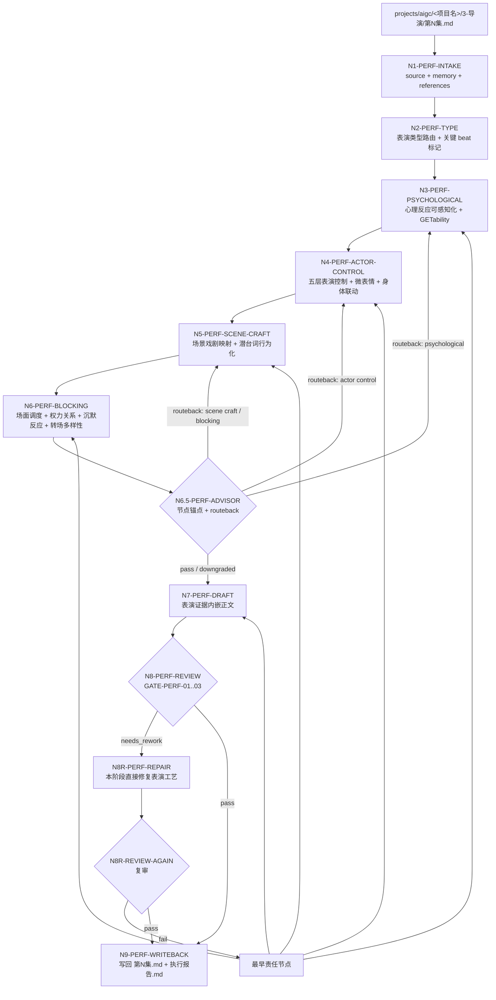
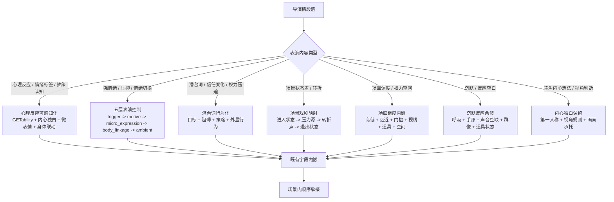

# aigc 4-表演

`4-表演` 负责在 `3-导演` 逐集稿基础上，把导演级戏剧决策转化为可执行的演员表演材料。它注入心理反应可感知化、演员演技五层控制、潜台词行为化、场景戏剧映射、场面调度/权力关系、沉默反应余波和主角内心独白保留。它不处理保真、对白冻结、字段格式、slugline（归属 `2-编剧`），不处理导演创作内核、高潮画面、视觉美学、氛围意境（归属 `3-导演`），也不生成分镜明细、摄影方案或图像/视频资产。它只在导演稿已有字段中增加表演密度、微表情、身体联动、环境声承托和空间关系，让导演决策变成演员能演、镜头能拍、观众能 GET 的材料。

`4-表演` 的核心表演工艺必须由 LLM 直接完成；`scripts/` 只做机械校验。若项目或用户启用 subagents，本阶段只把 subagents 作为表演监制顾问使用，用于节点级风险提示、表演取舍和局部 patch，不允许 subagents 直接主创或改写 canonical 表演稿。

## Context Loading Contract

- 每次调用 `$aigc-performance` 时，必须同时加载同目录 `CONTEXT.md`。
- 每次调用本技能时，必须同时加载同目录 `CONTEXT.md`。
- 每次调用本技能时，必须同时识别并加载同目录 `types/` 中选中的类型包（单选或多选），至少以 `types/type-map.md` 建立 `performance_type_profile`。
- 若任务绑定 `projects/aigc/<项目名>/`，必须先加载项目根 `MEMORY.md`、`0-初始化/north_star.yaml` 与 `team.yaml`，再按需加载项目根 `CONTEXT/` 中与表演、角色、心理、声音或制作约束相关的上下文文件。
- 若本阶段启动 subagents 模式（包含用户显式要求或项目 `team.yaml` 声明启用），必须读取 `../_shared/team-advisor-consultation-contract.md`，优先解析 `team.yaml.roles.supervision.stage_profiles."4-表演"` 作为表演监制载入 profile，再按共享合同回退旧字段；主 agent 必须基于本技能当前 `Thought Pass Map`、`steps/directing-workflow.md` 节点、目标集上下文和当前表演判断阶段动态派生顾问问题，并在 LLM 表演工艺注入前把可执行结论沉淀为 `advisor_consultation_packet`。
- 上游正文真源固定为 `projects/aigc/<项目名>/3-导演/第N集.md`，除非用户显式指定其他导演稿文件。
- 冲突优先级：用户显式请求 > 根 `AGENTS.md` / meta 规则 > 本 `SKILL.md` > `references/` / `steps/` / `types/` / `review/` / `templates/` > `agents/openai.yaml` > 项目 `MEMORY.md` > 项目 `CONTEXT/` > 本 `CONTEXT.md`。
- 新的稳定失败模式或可复用打法先写入 `CONTEXT.md`；只有稳定为强制规则后再晋升到 `SKILL.md` 或对应分区。
- 核心表演工艺判断必须由 LLM 直接完成；`scripts/` 只能做读取、标记检查、字段覆盖统计和机械校验。

## Multi-Subskill Continuous Workflow

当本主技能包被整体调用时，视为用户已授权按本级声明的同级子技能包、阶段分区或内部连续节点自动完成整个技能组任务；在满足本技能必要输入、显式选择和安全门后，不再为"是否继续下一步"额外确认。

- 无序号同级子技能包默认全选并发执行，由本主技能包汇总、裁决和写回唯一 canonical 输出。
- 数字序号子技能包或节点（如 `N1-PERF-INTAKE`、`N2-PERF-TYPE`、`N3-PERF-PSYCHOLOGICAL`）默认按数字升序串行执行，前一节点产物自动作为后一节点输入。
- 卫星技能只承担查询、恢复、审查承接或辅助动作；不会因连续调度自动改写 `4-表演` canonical 输出，除非父级合同或用户明确要求回接。
- 连续调度不得绕过本技能的阻断门：缺少必需输入、上游导演稿不可读、破坏性覆盖未授权、子技能缺失或路线歧义会造成错误 canonical 写回时，必须先停下并给出最小澄清或阻断报告。
- 每个被调度的子技能包仍必须加载自身 `SKILL.md + CONTEXT.md`；脚本只能承担机械辅助，不得替代 LLM 表演工艺判断或父级最终裁决。

## Input Contract

Accepted input:

- 项目名、项目路径、单个 `projects/aigc/<项目名>/3-导演/第N集.md` 文件，或多个集号范围。
- 用户要求"表演""注入表演""演员演技""心理反应""场面调度""从 3-导演 到 4-表演"等任务。
- 已完成或部分完成的 `3-导演` 逐集稿；默认以集为单位处理 `第N集.md`。

Required input:

- 可定位、可读取的 `3-导演/第N集.md`。
- 至少一个目标集号，或允许默认处理 `3-导演/` 中全部 `第N集.md`。
- 输入正文中存在可识别的心理反应、潜台词、情绪、权力关系、沉默反应或演员任务内容。

Optional input:

- 项目 `MEMORY.md` 中的长期表演偏好、角色口径、情绪禁区、声音倾向。
- 项目 `0-初始化/north_star.yaml` 中的核心创作北极星、类型承诺、表演方向。
- 项目 `team.yaml` 中的团队配置。
- 项目 `CONTEXT/` 中的角色、世界观、类型和制作约束。
- 用户额外指定的参考演员风格、表演强度或制作限制。

Reject or clarify when:

- 上游 `3-导演/第N集.md` 不存在、不可读，或正文缺少可处理内容。
- 用户要求重写剧情、改对白、删减原导演内容、合并集数或改变场景顺序。
- 用户要求直接生成分镜明细、摄影方案、图像提示词或视频请求；这些应转交下游阶段。
- 用户要求脚本自动生成表演正文；必须改为 LLM 主创、脚本只校验。

## Mode Selection

| mode | 触发信号 | 输出 |
| --- | --- | --- |
| `single_episode` | 指定单个 `第N集.md` 或单个集号 | `projects/aigc/<项目名>/4-表演/第N集.md` |
| `episode_range` | 指定多个集号或集号范围 | 多个逐集表演稿与更新后的执行报告 |
| `all_ready_episodes` | 未指定集号但 `3-导演/` 下有 `第N集.md` | 全部可读逐集表演稿 |
| `repair` | 已有表演稿缺失心理反应承托、情绪只停留在标签、潜台词未行为化、场面调度写成摄影方案、或场景末尾堆总结块 | 最小修复后的逐集表演稿与问题报告 |
| `stage_end_review_repair` | 任一非 `review_only` 表演任务完成候选稿后自动进入 | 阶段内 review -> 直接修复表演工艺 -> 复审 -> canonical 写回 |
| `review_only` | 用户只要求检查 `4-表演` 输出 | 审查报告，不改写正文，除非用户随后要求修复 |

## Subagents Execution Mechanism

当 `4-表演` 启动 subagents 模式时，执行语义固定为"项目监制顾问团请教 -> 表演参谋汇流 -> 上下文沉淀 -> 后续表演任务消费"，而不是让 subagents 直接主创、改写上游导演稿或替代 LLM 表演工艺注入。

1. 主 agent 先读取项目 `team.yaml`，按 `../_shared/team-advisor-consultation-contract.md` 的 `Team Roster Resolution` 解析表演阶段监制 roster；优先使用 `roles.supervision.stage_profiles."4-表演".members / members_ref`，再按共享合同回退到通用 `roles.supervision.members`、旧 `roles.supervising.*`、旧 `roles.production.*`、`team_setup.shared_agents` 或 `roles.planning.members`，必要时才按 team 根索引动态补位并记录原因。
2. 被启动的 subagents 作为表演监制顾问运行：围绕当前集 `3-导演` 上游正文、项目 `MEMORY.md`、`north_star.yaml`、相关 `CONTEXT/`、本技能的 `PASS-PERF-*` 思维通过点、`N*-PERF-*` 执行节点、review gate 和当前表演判断阶段，代入各自角色意识、创作风格和专业水准提出参谋建议。
3. 顾问问题不得固定为一组表演字段；必须从当前节点的心理反应、五层表演控制、潜台词行为化、场景戏剧映射、场面调度、沉默余波、动作客观性或 review gate 派生。问题必须能推动当前节点执行，不得停留在泛泛"更有表演感"。
4. 主 agent 负责裁决、去重和汇流，把顾问建议压缩成 `advisor_consultation_packet.must_do / must_not_do / inspiration_to_use / execution_brief`，并保留必要的 `node_ref / pass_ref / gate_ref / role_lens` 摘要，作为 LLM 表演工艺注入、阶段内修复和复审的额外上下文继续执行后续任务。
5. `advisor_consultation_packet` 不拥有上游导演稿原文、对白、场景顺序、字段合同或 canonical 写回权；顾问建议若与上游真源或本技能合同冲突，必须舍弃或降级为风险提示。
6. 若真实 subagent dispatch 被 system / developer / tool / user 上层策略阻断，必须在执行报告中记录阻断层级、原计划顾问路径、实际降级路径和未启动成员；不得把主 agent 本地顺序扮演写成真实 subagents 已执行。

## Reference Loading Guide

| 场景 | 必读文件 |
| --- | --- |
| 任意表演注入任务 | `references/psychological-reaction-contract.md`、`references/performance-and-scene-craft-contract.md`、`references/actor-performance-control-contract.md` |
| 表演创作阶段启动 subagents 模式 / team advisor runtime | `../_shared/team-advisor-consultation-contract.md`，并按本 `Subagents Execution Mechanism` 执行 |
| 心理反应字段、主角内心独白保留、主观内压可感知化、GETability 标准 | `references/psychological-reaction-contract.md` |
| 场景戏剧功能、潜台词行为化、场面调度/权力关系、沉默反应、演员任务、转场多样性 | `references/performance-and-scene-craft-contract.md` |
| 角色演技五层控制：触发点、情绪动机、微表情、身体联动、环境声、非对称瑕疵和微动态限制 | `references/actor-performance-control-contract.md` |
| 斯坦尼斯拉夫斯基体系·方法派表演技术：感知锚定法、形体动作分析、三层情绪调用、情感瞬间控制、演员任务规划、具身化技术 | `references/stanislavski-method-reference.md` |
| 类型画像、证据结构、routeback 目标与报告字段统一 | `types/type-map.md`、`types/performance-evidence-type-map.md` |
| 验收、修复和 review gate | `review/review-contract.md` |
| 输出样板 | `templates/output-template.md`、`templates/episode-performance.template.md` |
| 脚本辅助边界与机械校验 | `scripts/README.md` |
| 可复用经验 | `knowledge-base/directing-heuristics.md` |
| 产品入口元数据 | `agents/openai.yaml` |

## Output Contract

### Required output

1. 逐集表演稿固定写入 `projects/aigc/<项目名>/4-表演/第N集.md`。
2. 阶段执行报告写入或更新 `projects/aigc/<项目名>/4-表演/执行报告.md`。
3. 每个逐集表演稿必须完整保留 `3-导演/第N集.md` 原结构，在保持导演稿事实、对白、场景顺序和字段标签不变的前提下，为心理反应、演员任务、潜台词行为、场面调度、沉默反应和主角内心独白注入表演密度。
4. 注入结果不新增正文字段体系（如 `演技提示词`、`表情控制公式`、`演员调度公式`），全部嵌入既有画面、声音、表演、道具和反应字段。
5. 注入后 `心理反应` 必须满足 GETability 标准：每条至少有一个可见、可听或可演通道，关键心理 beat 至少两个。
6. 关键情绪 beat 必须完成五层表演控制证据：触发点、情绪动机（表层/压制/隐藏至少两层）、微表情变量、非面部身体变量和环境声或微动态限制；执行报告必须说明取舍。
7. 潜台词必须转为带目的的行为，不得停留在情绪标签或心理结论。
8. 规划层 `表演提示` 和 `场面调度` 必须拆入对应剧本句段的既有字段，不得在场景末尾或分镜组末尾以总结块形式出现。
9. `内心独白（主角）` 引号内主角自指统一为第一人称；第三人称只用于指向其他角色、引用文本，或有明确自我疏离创作留证。
10. 主角视角下对他人行为的判断不得写成客观第三方概括，已改入主角内心独白或主角反应。

### Output format

| output_id | format |
| --- | --- |
| `OUTPUT-PERF-EPISODE` | Markdown 表演稿 |
| `OUTPUT-PERF-REPORT` | Markdown 执行报告 |

### Output path

| output_id | canonical path |
| --- | --- |
| `OUTPUT-PERF-EPISODE` | `projects/aigc/<项目名>/4-表演/第N集.md` |
| `OUTPUT-PERF-REPORT` | `projects/aigc/<项目名>/4-表演/执行报告.md` |

### Naming convention

- 逐集表演稿命名为 `第N集.md`。
- 阶段报告命名为 `执行报告.md`。
- 不创建 `第N集-表演.md`、`performance.md` 等平行真源。

### Completion gate

- 已读取本 `SKILL.md + CONTEXT.md`，并在项目任务中加载项目 `MEMORY.md`、`0-初始化/north_star.yaml`、`team.yaml` 与相关 `CONTEXT/`。
- 上游 `3-导演/第N集.md` 可回指，输出 frontmatter 记录 `source_directing_path`。
- 上游剧情事实、信息量、对白、场景顺序和字段标签完整保留，无摘要、删减或自由改写。
- 对白逐字保真，字段标题固定为 `对白（角色名，语态/状态短语）`；引号内没有动作描写。
- 每条 `心理反应` 都有明确主体、上游触发点，且至少包含一个可见、可听或可演通道；关键心理 beat 至少两个通道。
- 心理反应没有停留在"意识到/觉得/明白/崩溃/震惊/害怕"等抽象解释；已转成微表情、肢体动作、生理反应、呼吸、声音、道具或空间变化。
- 关键情绪 beat 已完成五层表演控制：触发点、情绪动机（至少两层）、微表情、身体联动、环境声或微动态限制；执行报告包含 `actor_performance_control_evidence`。
- `内心独白（主角）` 引号内主角自指已统一为第一人称；第三人称只指向其他角色、引用文本，或有明确自我疏离留证。
- 主角视角下对他人行为的判断已进入主角内心独白或主角反应，没有写成客观第三方概括。
- 动作字段只写可实拍的客观动作、神态、语气和生理反应，没有"试图、想要、打算、意图"等主观预判词。
- "感到恶心/难受/愤怒"等主观情绪已转成微表情、肢体动作、生理反应、声线变化或主角内心独白。
- 启动 subagents 模式时，已按 `team.yaml` 表演阶段监制 profile 形成带 `node_ref / pass_ref / gate_ref / role_lens` 来源锚点的 `advisor_consultation_packet`，并把节点级参谋指导作为后续 LLM 表演工艺注入、阶段内修复和复审上下文；若被上层阻断，执行报告已记录降级说明。
- 潜台词已转为带目的的行为，没有只写情绪结论或心理标签。
- 场景状态差已按 `scene_turn_pass` 提取：进入状态、压力源、转折点、退出状态，并落入画面、声音、道具、表演、群像反应或环境字段。
- 沉默反应已写成可见/可听状态变化，没有用新增对白替代沉默。
- 权力关系通过空间站位、高低、远近、门槛、视线、道具归属或身体距离表现，没有只写关系结论。
- 规划层 `表演提示` 和 `场面调度` 已拆入对应剧本句段，没有在场景末尾或分镜组末尾以总结块列出。
- `场面调度` 只写人物、空间、道具、视线和权力关系，没有写摄影机位、景别、镜头运动或分镜编号。
- 转场和潜台词没有连续依赖同一种视线动作（"看向远方/避开对方/顺着视线望去"），已从声音、道具、群像、空间、动作中断中多元选择。
- 终稿没有内部任务说明、规则复述或占位句泄露。
- 已运行 `scripts/validate_performance_injection.py` 或执行等价人工 review；若发现阻断项，已在本阶段内完成最小直接修复并复审通过，结果写入 `执行报告.md`。

## Stage-End Review-Repair Contract

`4-表演` 不另设独立"表演润色"阶段。每次生成或修复候选表演稿后，必须在本阶段内部完成末段审计和直接修复闭环，只有复审通过的结果才允许写回 canonical `4-表演/第N集.md`。

固定执行语义：

1. `N7-PERF-DRAFT` 产物先视为 `candidate_performance`，不是终稿。
2. `N8-PERF-REVIEW` 按 `review/review-contract.md` 审计心理反应可感知化、五层表演控制、潜台词行为化、场景状态差、场面调度内嵌、沉默反应、主角内心独白第一人称、主角视角判断、动作字段客观可拍、主观情绪转译、转场多样性、占位泄露和原文保真。
3. 若 verdict 为 `needs_rework`，必须在本阶段直接执行 `N8R-PERF-REPAIR`，只修表演密度、微表情、身体联动、环境声、场面调度内嵌、沉默承托、内心独白人称、动作字段纯度、潜台词行为化和格式证据；不得改写上游剧情事实、对白和事件顺序。
4. 修复后必须执行 `N8R-REVIEW-AGAIN`；复审仍失败时继续最小修复循环，或在源层冲突、输入缺失、权限阻断时输出阻断报告，不得把失败稿推进下游。
5. `review_only` 只产出审查报告，不自动修复；除此之外的生成、批量和 repair 模式都默认启用本闭环。
6. `执行报告.md` 必须记录本轮 review verdict、repair actions、复审结果、未修复风险和是否允许进入下游阶段。

## Field Mapping

| field_id | 输出/证据 | 内容要求 | 失败码 |
| --- | --- | --- | --- |
| `FIELD-PERF-01` | 输入取证 | source directing episode、项目记忆、north star、team 配置、相关上下文、目标集号明确 | `FAIL-PERF-01` |
| `FIELD-PERF-02` | 心理反应可感知化 | 每条 `心理反应` 有主体、上游触发点，至少一个可见/可听/可演通道；关键 beat 至少两个；没有抽象解释 | `FAIL-PERF-02` |
| `FIELD-PERF-03` | 五层表演控制 | 关键情绪 beat 有触发点、情绪动机（至少两层）、微表情变量、非面部身体变量和环境声或微动态限制；不只有情绪标签 | `FAIL-PERF-03` |
| `FIELD-PERF-04` | 潜台词行为化 | 潜台词、信任变化、权力压迫、未出口对白已转为带目的的行为（目标+阻碍+策略+外显），没有停留在情绪结论 | `FAIL-PERF-04` |
| `FIELD-PERF-05` | 场景戏剧映射 | 每个关键场景有 `scene_dramatic_map`：进入状态、压力源、转折点、退出状态；转折落入既有字段 | `FAIL-PERF-05` |
| `FIELD-PERF-06` | 场面调度内嵌 | `表演提示` 和 `场面调度` 已拆入对应剧本句段的既有字段，没有场景末尾总结块；场面调度不写摄影方案 | `FAIL-PERF-06` |
| `FIELD-PERF-07` | 主角内心独白 | 引号内主角自指为第一人称；主角视角判断不写成客观第三方概括 | `FAIL-PERF-07` |
| `FIELD-PERF-08` | 动作字段客观可拍 | 动作字段只写可实拍客观动作、神态、语气和生理反应；无"试图/想要/打算/意图"等主观预判词；主观情绪已转译 | `FAIL-PERF-08` |
| `FIELD-PERF-09` | 沉默反应 | 沉默已写成可见/可听状态变化，没有用新增对白替代 | `FAIL-PERF-09` |
| `FIELD-PERF-10` | 转场多样性 | 转场和潜台词没有连续依赖视线动作，已多元选择声音/道具/群像/空间/动作中断 | `FAIL-PERF-10` |
| `FIELD-PERF-11` | 原文保真 | 上游事实、对白、场景顺序和字段标签未被改写 | `FAIL-PERF-11` |
| `FIELD-PERF-12` | 输出落盘 | `4-表演/第N集.md` 与 `执行报告.md` 可复查 | `FAIL-PERF-12` |
| `FIELD-PERF-13` | 创作证据 | 执行报告包含 `psychological_reaction_evidence`、`actor_performance_control_evidence`、`protagonist_inner_voice_evidence`、`objective_action_purity_evidence`、`scene_dramatic_map`、`performance_task_map`、`blocking_power_map` 和 `integration_targets` | `FAIL-PERF-13` |
| `FIELD-PERF-13A` | Team advisor consult | 启动 subagents 模式时已按 `team.yaml.roles.supervision.stage_profiles."4-表演"` 或共享合同回退路径请教项目监制顾问，顾问问题同步于当前 `PASS-PERF-*` / `N*-PERF-*` 思维·执行节点，并把角色意识、创作风格、专业水准转化为后续任务上下文；阻断时有降级报告 | `FAIL-PERF-13A` |
| `FIELD-PERF-14` | 占位泄露 | 终稿无内部规则句、模板占位句或任务说明 | `FAIL-PERF-14` |

## Thought Pass Map

| step_id | pass_name | input | judgment | output |
| --- | --- | --- | --- | --- |
| `PASS-PERF-01` | 输入取证 | `3-导演/第N集.md`、项目记忆、north star、team 与相关 `CONTEXT/` | 是否具备可承接导演稿与目标集号 | `input_lock` |
| `PASS-PERF-02` | 表演类型路由 | 导演稿字段行、上游正文、`psychological-reaction-contract.md`、`performance-and-scene-craft-contract.md`、`actor-performance-control-contract.md`、`stanislavski-method-reference.md` | 当前内容属于心理反应、情绪触发、潜台词行为、场面调度、沉默反应还是主角内心独白；哪些场景需要五层表演控制；调用情绪记忆调用法 / 形体动作分析法进行方法选择 | `performance_task_map` |
| `PASS-PERF-03` | 心理反应可感知化 | 导演稿中所有 `心理反应`、情绪描述和心理解释、`stanislavski-method-reference.md` | 每条心理反应是否有主体、触发点、至少一个可见/可听/可演通道；是否需要转入 `内心独白（主角）`、`表情特写`、`角色动作` 或 `对白画面`；调用感知锚定法（"假使"激活链）进行触发点定位和身体先行 | `psychological_reaction_evidence`、`protagonist_inner_voice_evidence` |
| `PASS-PERF-04` | 五层表演控制 | 关键情绪 beat、`performance_task_map`、`actor-performance-control-contract.md`、`stanislavski-method-reference.md` | 触发点是否明确；情绪动机是否至少两层（表层/压制/隐藏）；微表情变量和非面部身体变量是否到位；环境声或微动态限制是否承托；调用三层情绪执行模板和情感瞬间与微动态控制进行 micro_expression、micro_dynamics 处理 | `actor_performance_control_evidence` |
| `PASS-PERF-05` | 场景戏剧映射 | 场景表、上游正文、`performance-and-scene-craft-contract.md`、`stanislavski-method-reference.md` | 每个关键场景是否有进入状态、压力源、转折点和退出状态；转折是否落入既有字段而非解释性新增；调用形体动作分析法和注意力集中法进行 entry_state、turning_point 处理 | `scene_dramatic_map` |
| `PASS-PERF-06` | 潜台词行为化 | 上游潜台词、信任变化、权力压迫、未出口对白、`performance-and-scene-craft-contract.md`、`stanislavski-method-reference.md` | 潜台词是否已转为带目的的行为（目标+阻碍+策略+外显）；转场是否多元，没有连续依赖视线动作；调用演员任务规划法（最高任务→贯穿动作）构建 performance_task_map | `performance_task_map`（更新） |
| `PASS-PERF-07` | 场面调度与权力关系 | 场景表、空间关系、权力变化、`performance-and-scene-craft-contract.md`、`stanislavski-method-reference.md` | 权力关系是否通过高低/远近/门槛/视线/道具/空间隔离表现；场面调度是否只写人物空间道具视线关系；是否已拆入对应 beat 而非场景末尾总结；调用注意力集中与舞台现实法进行 blocking_power_map 构建 | `blocking_power_map` |
| `PASS-PERF-08` | 沉默与反应余波 | 上游沉默、反应空白、声音空缺、`performance-and-scene-craft-contract.md`、`stanislavski-method-reference.md` | 沉默是否已写成可见/可听状态变化；反应余波是否用呼吸/手部/道具/群像/声音承托；没有用新增对白替代；调用情感瞬间与微动态控制进行 micro_dynamics 余波处理 | `integration_targets` |
| `PASS-PERF-09` | 主角内心独白与视角规则 | 主角内心想法、主角判断、主角视角、`psychological-reaction-contract.md`、`stanislavski-method-reference.md` | 主角自指是否统一为第一人称；主角视角判断是否进入主角内心独白而非客观概括；非主角心理是否有全知旁白断言；调用自传性代入和具身化技术强化第一人称沉浸感 | `protagonist_inner_voice_evidence`（更新） |
| `PASS-PERF-10` | 动作字段纯度检查 | 所有 `角色动作`、`动作画面` | 是否只写可实拍客观动作、神态、语气和生理反应；是否清除"试图/想要/打算/意图"等主观预判词；主观情绪是否已转译 | `objective_action_purity_evidence` |
| `PASS-PERF-10A` | 顾问请教汇流 | `team.yaml`、共享顾问合同、当前 `PASS-PERF-*` / `N*-PERF-*` 节点、表演任务画像与 review gate | 是否已基于当前思维·执行节点向项目监制顾问提出表演参谋问题，并将其角色意识、创作风格和专业水准汇流为可执行上下文 | `advisor_consultation_packet` |
| `PASS-PERF-11` | LLM 表演工艺投影 | `psychological_reaction_evidence`、`actor_performance_control_evidence`、`scene_dramatic_map`、`performance_task_map`、`blocking_power_map`、`protagonist_inner_voice_evidence`、`integration_targets`、上游正文 | 是否把全部表演规划证据嵌入既有字段，形成完整表演稿；是否保持原文保真 | `candidate_performance` |
| `PASS-PERF-12` | 审查修复闭环 | candidate 表演稿、review gate、上游真源 | 是否覆盖心理反应可感知化、五层表演控制、潜台词行为化、场景状态差、场面调度内嵌、沉默反应、内心独白人称、动作纯度和原文保真；阻断项是否已在本阶段最小修复并复审通过 | review result、repair result |

## Pass Table

| pass_id | pass standard | fail code | Rework Entry |
| --- | --- | --- | --- |
| `PASS-PERF-01` | 上游导演稿可读、项目语境和目标集号明确 | `FAIL-PERF-01` | `Input Contract` |
| `PASS-PERF-02` | 每个内容单元被正确分类为心理反应/情绪/潜台词/场面调度/沉默/内心独白，并标记需要五层表演控制的关键 beat | `FAIL-PERF-03` | `references/performance-and-scene-craft-contract.md`、`references/stanislavski-method-reference.md` |
| `PASS-PERF-03` | 心理反应有主体、触发点、GETability 通道；抽象解释已转译；需要语言化的内容已转入内心独白 | `FAIL-PERF-02` | `references/psychological-reaction-contract.md`、`references/stanislavski-method-reference.md`（感知锚定法） |
| `PASS-PERF-04` | 关键情绪 beat 有五层证据；不只有情绪标签或模板化表情 | `FAIL-PERF-03` | `references/actor-performance-control-contract.md`、`references/stanislavski-method-reference.md`（三层情绪模板、情感瞬间与微动态控制） |
| `PASS-PERF-05` | 关键场景有状态差；转折落入既有字段 | `FAIL-PERF-05` | `references/performance-and-scene-craft-contract.md`、`references/stanislavski-method-reference.md`（形体动作分析法、注意力集中法） |
| `PASS-PERF-06` | 潜台词已转为带目的的行为；转场多元不固定 | `FAIL-PERF-04` | `references/performance-and-scene-craft-contract.md`、`references/stanislavski-method-reference.md`（演员任务规划法） |
| `PASS-PERF-07` | 权力关系通过可拍变量表现；场面调度已拆入 beat | `FAIL-PERF-06` | `references/performance-and-scene-craft-contract.md`、`references/stanislavski-method-reference.md`（注意力集中与舞台现实法） |
| `PASS-PERF-08` | 沉默已写成状态变化；没有新增对白替代 | `FAIL-PERF-09` | `references/performance-and-scene-craft-contract.md`、`references/stanislavski-method-reference.md`（情感瞬间与微动态控制） |
| `PASS-PERF-09` | 主角内心独白第一人称；主角视角不写客观概括 | `FAIL-PERF-07` | `references/psychological-reaction-contract.md`、`references/stanislavski-method-reference.md`（自传性代入、具身化技术） |
| `PASS-PERF-10` | 动作字段客观可拍；无主观意图词；主观情绪已转译 | `FAIL-PERF-08` | `references/actor-performance-control-contract.md`、`references/stanislavski-method-reference.md`（形体动作分析法） |
| `PASS-PERF-10A` | 启动 subagents 模式时完成项目表演监制顾问请教、上下文沉淀或记录降级；顾问问题必须同步于当前思维·执行节点 | `FAIL-PERF-13A` | `../_shared/team-advisor-consultation-contract.md` + 本 `Subagents Execution Mechanism` |
| `PASS-PERF-11` | 全部表演证据嵌入既有字段；原文保真 | `FAIL-PERF-11` | `references/performance-and-scene-craft-contract.md` |
| `PASS-PERF-12` | review 阻断项已直接修复并复审；未通过时不写 canonical 终稿 | `FAIL-PERF-12` | `Stage-End Review-Repair Contract` |

## Pass-to-Node Mapping Table

Pass 是思维/验收通过点，node 是执行节点；`N6.5-PERF-ADVISOR` 是条件顾问节点，对应 `PASS-PERF-10A`，不得被跳过或误并入 `N7-PERF-DRAFT`。

| pass_id | node_id | pass_standard | evidence_consumed | output_evidence |
| --- | --- | --- | --- | --- |
| `PASS-PERF-01` | `N1-PERF-INTAKE` | 上游导演稿可读、项目语境和目标集号明确 | source directing episode、项目 `MEMORY.md`、north star、team 配置 | `source_directing_path`、`reference_load_manifest` |
| `PASS-PERF-02` | `N2-PERF-TYPE` | 表演类型画像和关键 beat 标记成立 | 导演稿字段行、`types/type-map.md`、`types/performance-evidence-type-map.md`、核心 references | `performance_type_profile`、`performance_task_map` |
| `PASS-PERF-03` | `N3-PERF-PSYCHOLOGICAL` | 心理反应有主体、触发点和 GETability 通道 | `psychological-reaction-contract.md`、导演稿心理/情绪字段 | `psychological_reaction_evidence`、`protagonist_inner_voice_evidence` |
| `PASS-PERF-04` | `N4-PERF-ACTOR-CONTROL` | 关键情绪 beat 有五层表演证据 | `performance_task_map`、`actor-performance-control-contract.md` | `actor_performance_control_evidence`、`integration_targets` |
| `PASS-PERF-05` | `N5-PERF-SCENE-CRAFT` | 关键场景有状态差，转折落入既有字段 | 场景表、上游正文、`performance-and-scene-craft-contract.md` | `scene_dramatic_map` |
| `PASS-PERF-06` | `N5-PERF-SCENE-CRAFT` | 潜台词已转为带目的的行为，转场变量多元 | 潜台词、权力压迫、未出口对白 | `performance_task_map`、`silence_reaction_map` |
| `PASS-PERF-07` | `N6-PERF-BLOCKING` | 权力关系通过可拍变量表现，场面调度已拆入 beat | 场景空间、`scene_dramatic_map`、`performance_task_map` | `blocking_power_map`、`integration_targets` |
| `PASS-PERF-08` | `N5-PERF-SCENE-CRAFT` | 沉默已写成状态变化，没有新增对白替代 | 沉默、反应空白、声音空缺 | `silence_reaction_map`、`integration_targets` |
| `PASS-PERF-09` | `N3-PERF-PSYCHOLOGICAL` | 主角内心独白第一人称，主角视角不写客观概括 | 主角内心想法、主角判断、主角视角 | `protagonist_inner_voice_evidence` |
| `PASS-PERF-10` | `N5-PERF-SCENE-CRAFT` / `N7-PERF-DRAFT` | 动作字段客观可拍，主观情绪已转译 | 动作字段、情绪字段抽查 | `objective_action_purity_evidence` |
| `PASS-PERF-10A` | `N6.5-PERF-ADVISOR` | 表演监制顾问请教完成、上下文沉淀或记录降级 | `team.yaml`、共享顾问合同、当前 pass/node/gate | `advisor_consultation_packet`、降级报告 |
| `PASS-PERF-11` | `N7-PERF-DRAFT` | 全部表演证据嵌入既有字段，原文保真 | 所有 planning evidence、`advisor_consultation_packet` | candidate `第N集.md`、`faithful_performance_trace` |
| `PASS-PERF-12` | `N8-PERF-REVIEW` / `N8R-PERF-REPAIR` / `N8R-REVIEW-AGAIN` / `N9-PERF-WRITEBACK` | 阻断项已最小修复并复审通过；未通过时不写 canonical 终稿 | candidate 表演稿、review gate、上游真源 | `review_result`、`repair_result`、final path |

## Root-Cause Execution Contract (Mandatory)

出现以下问题时，必须沿链路上溯并修复源层合同：

- `心理反应` 只能靠字段标题理解，正文没有可见/可听/可演载体；只写"意识到/觉得/明白/崩溃/震惊/害怕"等抽象认知；缺少感知锚定法的上游信号激活和身体先行。
- 关键情绪 beat 只有"愤怒/难过/开心/紧张/害羞"等情绪标签或皱眉/瞪眼/流泪/大笑等模板化表情，缺少上游触发点、情绪动机（表层/压制/隐藏）、微表情、身体联动、环境声或微动态限制；未调用三层情绪执行模板或情感瞬间控制。
- 潜台词、信任变化、权力压迫、未出口对白仍停留在"他不信任她""她是在试探他""两人关系发生变化"等结论句，未转为带目的的行为。
- `角色动作` / `动作画面` 混入"试图、想要、打算、意图"等主观预判词，或把主观情绪直接写入终稿。
- "感到恶心/难受/愤怒"等主观情绪被直接写入终稿，未转成微表情、肢体动作、生理反应、声线变化或主角内心独白。
- 主角视角下对他人行为的判断被写成客观第三方概括，未改入主角内心独白或主角反应。
- `内心独白（主角）` 引号内主角自指仍为第三人称"他/她/其/角色名"，导致角色心声变成旁白口吻。
- 规划层 `表演提示` 或 `场面调度` 在场景末尾以总结块列出，未拆入对应 beat 的既有字段。
- `场面调度` 写成摄影机位、景别、镜头运动或分镜方案，造成越权到下游摄影。
- 沉默和反应只写空白，未用呼吸、手部、道具、群像、声音空缺或动作余波承托。
- 连续两个 beat 以上用视线承担未出口信息或下一场压力，没有从声音、道具、群像、空间或动作中断中多元选择。
- 没有 `scene_dramatic_map`，关键场景只有平铺直叙，没有状态差。
- 终稿有 `心理反应` 字段的下游，但字段内容只是心理散文、作者解释、抽象想象或因果论文。
- 规划层五层表演控制证据缺失：无法说明触发点、无法区分表层/压制/隐藏情绪、没有微表情变量或非面部身体变量。
- 终稿泄露内部任务说明、规则复述或模板占位句。
- 声音字段与画面字段混写，或没有就近配对。
- 为补足表演质量新增与当前主线无关的人物过往、物品来历或回忆性信息。
- 脚本或模板拼接替代 LLM 的表演工艺判断。
- 启动 subagents 模式时跳过 `team.yaml` 表演阶段监制 profile、没有把表演参谋指导沉淀为后续上下文，或把主 agent 本地模拟顾问当成真实 dispatch。
- review 发现阻断项后未在本阶段直接修复和复审，却把候选稿写成终稿或推进下游。

必经链路：

`Symptom -> Direct Script/Prompt Overreach -> 4-表演 Section Owner -> AGENTS.md LLM-first / Skill 2.0 Rule`

## Script And Metadata Contract

| path | role |
| --- | --- |
| `scripts/README.md` | 说明脚本只做机械辅助，不替代 LLM 表演工艺判断 |
| `scripts/validate_performance_injection.py` | 可选机械校验：检查心理反应是否有 GETability 通道、表演提示/场面调度是否仍留在场景末尾、动作字段是否有主观意图词 |
| `agents/openai.yaml` | 提供产品侧入口元数据，默认提示必须显式提到 `$aigc-performance` |

## Visual Maps

## Review Gates

| gate_id | gate_name | check scope | blocking |
| --- | --- | --- | --- |
| `GATE-PERF-01` | 表演任务 + 心理反应 + 演员控制 + 主角内心独白 + 动作字段纯度 | `psychological_reaction_evidence`、`actor_performance_control_evidence`、`protagonist_inner_voice_evidence`、`objective_action_purity_evidence`、`scene_dramatic_map`、`performance_task_map` | blocking |
| `GATE-PERF-02` | 表演/调度集成（场景末尾无总结块） | `blocking_power_map`、`integration_targets`、终稿无场景末尾表演提示/场面调度总结块、场面调度不写摄影方案 | blocking |
| `GATE-PERF-03` | 顾问汇流 + 节点 ledger + 复审闭环 | `advisor_consultation_packet` 或降级报告、`thinking_action_node_ledger`、`review_result`、`repair_result`、re-review verdict | blocking |
