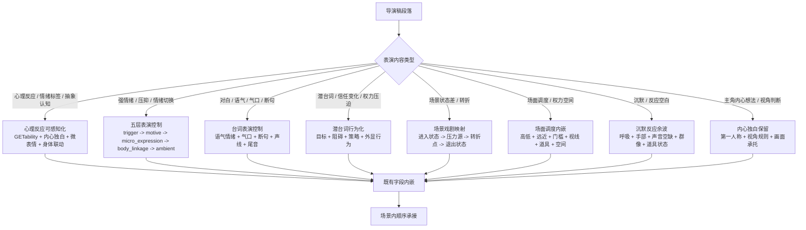

# aigc 4-表演

`4-表演` 负责在 `3-导演` 逐集稿基础上，把导演级戏剧决策转化为可执行的演员表演材料。它注入心理反应可感知化、演员演技五层控制、台词表演、潜台词行为化、场景戏剧映射、场面调度/权力关系、沉默反应余波和主角内心独白保留。它不处理保真、对白冻结、字段格式、slugline（归属 `2-编剧`），不处理导演创作内核、高潮画面、视觉美学、氛围意境（归属 `3-导演`），也不生成分镜明细、摄影方案或图像/视频资产。它只在导演稿已有字段中增加表演密度、微表情、身体联动、台词语气情绪、气口断句、环境声承托和空间关系，让导演决策变成演员能演、镜头能拍、观众能 GET 的材料。

`4-表演` 的核心表演工艺必须由 LLM 直接完成；`scripts/` 只做机械校验。若项目或用户执行顾问与复核流程，本阶段只把 顾问与复核流程 作为表演监制顾问使用，用于节点级风险提示、表演取舍和局部 patch，不允许 顾问或复核结论直接主创或改写 canonical 表演稿。

## Context Loading Contract

- 每次调用 `$aigc-performance` 时，必须同时加载同目录 `CONTEXT.md`。
- 每次调用本技能时，必须同时加载同目录 `CONTEXT.md`。
- 每次调用本技能时，必须同时识别并加载同目录 `types/` 中选中的类型包（单选或多选），至少以 `types/type-map.md` 建立 `performance_type_profile`。
- 若任务绑定 `projects/aigc/<项目名>/`，必须先加载项目根 `MEMORY.md`、`0-初始化/north_star.yaml` 与 `team.yaml`，再按需加载项目根 `CONTEXT/` 中与表演、角色、心理、声音或制作约束相关的上下文文件。
- 若本阶段执行顾问与复核流程（包含用户显式要求或项目 `team.yaml` 声明启用），必须读取 `../_shared/team-advisor-consultation-contract.md`，优先解析 `team.yaml.roles.supervision.stage_profiles."4-表演"` 作为表演监制载入 profile，再按共享合同回退旧字段；主 agent 必须基于本技能当前 `Thought Pass Map`、`steps/directing-workflow.md` 节点、目标集上下文和当前表演判断阶段动态派生顾问问题，并在 LLM 表演工艺注入前把可执行结论沉淀为 `advisor_consultation_packet`。
- 上游正文真源固定为 `projects/aigc/<项目名>/3-导演/第N集.md`，除非用户显式指定其他导演稿文件。
- 冲突优先级：用户显式请求 > 根 `AGENTS.md` / meta 规则 > 本 `SKILL.md` > `references/` / `steps/` / `types/` / `review/` / `templates/` > `agents/openai.yaml` > 项目 `MEMORY.md` > 项目 `CONTEXT/` > 本 `CONTEXT.md`。
- 新的稳定失败模式或可复用打法先写入 `CONTEXT.md`；只有稳定为强制规则后再晋升到 `SKILL.md` 或对应分区。
- 核心表演工艺判断必须由 LLM 直接完成；`scripts/` 只能做读取、标记检查、字段覆盖统计和机械校验。

## Multi-Subskill Continuous Workflow

当本主技能包被整体调用时，视为用户已授权按本级声明的同级子技能包、阶段分区或内部连续节点自动完成整个技能组任务；在满足本技能必要输入、显式选择和安全门后，不再为"是否继续下一步"额外确认。

- 无序号同级子技能包默认全选并发执行，由本主技能包汇总、裁决和写回唯一 canonical 输出。
- 数字序号子技能包或节点（如 `N1-PERF-INTAKE`、`N2-PERF-TYPE`、`N3-PERF-PSYCHOLOGICAL`）默认按数字升序串行执行，前一节点产物自动作为后一节点输入。
- 卫星技能只承担查询、恢复、审查承接或辅助动作；不会因连续调度自动改写 `4-表演` canonical 输出，除非父级合同或用户明确要求回接。
- 连续调度不得绕过本技能的阻断门：缺少必需输入、上游导演稿不可读、破坏性覆盖未授权、子技能缺失或路线歧义会造成错误 canonical 写回时，必须先停下并给出最小澄清或不可用说明。
- 每个被调度的子技能包仍必须加载自身 `SKILL.md + CONTEXT.md`；脚本只能承担机械辅助，不得替代 LLM 表演工艺判断或父级最终裁决。

## Input Contract

Accepted input:

- 项目名、项目路径、单个 `projects/aigc/<项目名>/3-导演/第N集.md` 文件，或多个集号范围。
- 用户要求"表演""注入表演""演员演技""心理反应""场面调度""从 3-导演 到 4-表演"等任务。
- 已完成或部分完成的 `3-导演` 逐集稿；默认以集为单位处理 `第N集.md`。

Required input:

- 可定位、可读取的 `3-导演/第N集.md`。
- 至少一个目标集号，或允许默认处理 `3-导演/` 中全部 `第N集.md`。
- 输入正文中存在可识别的心理反应、潜台词、情绪、权力关系、沉默反应或演员任务内容。

Optional input:

- 项目 `MEMORY.md` 中的长期表演偏好、角色口径、情绪禁区、声音倾向。
- 项目 `0-初始化/north_star.yaml` 中的核心创作北极星、类型承诺、表演方向。
- 项目 `team.yaml` 中的团队配置。
- 项目 `CONTEXT/` 中的角色、世界观、类型和制作约束。
- 用户额外指定的参考演员风格、表演强度或制作限制。

Reject or clarify when:

- 上游 `3-导演/第N集.md` 不存在、不可读，或正文缺少可处理内容。
- 用户要求重写剧情、改对白、删减原导演内容、合并集数或改变场景顺序。
- 用户要求直接生成分镜明细、摄影方案、图像提示词或视频请求；这些应转交下游阶段。
- 用户要求脚本自动生成表演正文；必须改为 LLM 主创、脚本只校验。

## Mode Selection

| mode | 触发信号 | 输出 |
| --- | --- | --- |
| `single_episode` | 指定单个 `第N集.md` 或单个集号 | `projects/aigc/<项目名>/4-表演/第N集.md` |
| `episode_range` | 指定多个集号或集号范围 | 多个逐集表演稿与更新后的执行报告 |
| `all_ready_episodes` | 未指定集号但 `3-导演/` 下有 `第N集.md` | 全部可读逐集表演稿 |
| `repair` | 已有表演稿缺失心理反应承托、情绪只停留在标签、潜台词未行为化、场面调度写成摄影方案、或场景末尾堆总结块 | 最小修复后的逐集表演稿与问题报告 |
| `stage_end_review_repair` | 任一非 `review_only` 表演任务完成候选稿后自动进入 | 阶段内 review -> 直接修复表演工艺 -> 复审 -> canonical 写回 |
| `review_only` | 用户只要求检查 `4-表演` 输出 | 审查报告，不改写正文，除非用户随后要求修复 |

## Advisor Consultation Mechanism

当 `4-表演` 执行顾问与复核流程时，执行语义固定为"项目监制顾问团请教 -> 表演参谋汇流 -> 上下文沉淀 -> 后续表演任务消费"，而不是让顾问或复核结论直接主创、改写上游导演稿或替代 LLM 表演工艺注入。

1. 主 agent 先读取项目 `team.yaml`，按 `../_shared/team-advisor-consultation-contract.md` 的 `Team Roster Resolution` 解析表演阶段监制 roster；优先使用 `roles.supervision.stage_profiles."4-表演".members / members_ref`，再按共享合同回退到通用 `roles.supervision.members`、旧 `roles.supervising.*`、旧 `roles.production.*`、`team_setup.shared_agents` 或 `roles.planning.members`，必要时才按 team 根索引动态补位并记录原因。
2. 该流程中的顾问作为表演监制顾问运行：围绕当前集 `3-导演` 上游正文、项目 `MEMORY.md`、`north_star.yaml`、相关 `CONTEXT/`、本技能的 `PASS-PERF-*` 思维通过点、`N*-PERF-*` 执行节点、review gate 和当前表演判断阶段，代入各自角色意识、创作风格和专业水准提出参谋建议。
3. 顾问问题不得固定为一组表演字段；必须从当前节点的心理反应、五层表演控制、台词表演、潜台词行为化、场景戏剧映射、场面调度、沉默余波、动作客观性或 review gate 派生。问题必须能推动当前节点执行，不得停留在泛泛"更有表演感"。
4. 主 agent 负责裁决、去重和汇流，把顾问建议压缩成 `advisor_consultation_packet.must_do / must_not_do / inspiration_to_use / execution_brief`，并保留必要的 `node_ref / pass_ref / gate_ref / role_lens` 摘要，作为 LLM 表演工艺注入、阶段内修复和复审的额外上下文继续执行后续任务。
5. `advisor_consultation_packet` 不拥有上游导演稿原文、对白、场景顺序、字段合同或 canonical 写回权；顾问建议若与上游真源或本技能合同冲突，必须舍弃或降级为风险提示。
6. 若外部顾问与复核 provider 不可用，直接使用本地顾问与复核流程；不得把主 agent 本地顺序扮演写成外部 provider 已执行。

## Reference Loading Guide

| 场景 | 必读文件 |
| --- | --- |
| 任意表演注入任务 | `references/psychological-reaction-contract.md`、`references/performance-and-scene-craft-contract.md`、`references/actor-performance-control-contract.md` |
| 表演创作阶段执行顾问与复核流程 / team advisor runtime | `../_shared/team-advisor-consultation-contract.md`，并按本 `Advisor Consultation Mechanism` 执行 |
| 人物动作链优先、空间可达性、情绪动作经济、道具/环境准入 | `../_shared/action-first-continuity-contract.md`、`references/performance-and-scene-craft-contract.md` |
| 角色活人感、当下小事、下意识反应、情绪落点、多人动作-反应分工 | `../_shared/lived-in-character-behavior-contract.md`、`references/performance-and-scene-craft-contract.md`、`references/actor-performance-control-contract.md` |
| 导演层表演风格基调、外放度、身体性、声线、面具/真实轴和转变触发 | `../3-导演/references/performance-style-directive-contract.md`，并消费上游 `performance_style_directive` |
| 观众心理、冲突遗产、知情层级、期待/恐惧/渴望对表演张力的影响 | `../_shared/audience-psychology-model-contract.md`，并消费上游 `audience_psychology_map` / `conflict_legacy_transfer` |
| 跨阶段情绪节奏、场景情绪音域、类型情绪底色与表演强度预算 | `../_shared/emotional-rhythm-map-contract.md`，并消费上游 `emotional_rhythm_map.scene_emotional_register` / `genre_emotional_coloring` |
| 心理反应字段、主角内心独白保留、主观内压可感知化、GETability 标准 | `references/psychological-reaction-contract.md` |
| 场景戏剧功能、台词表演、潜台词行为化、场面调度/权力关系、沉默反应、演员任务、转场多样性 | `references/performance-and-scene-craft-contract.md` |
| 角色演技五层控制与台词声线控制：触发点、情绪动机、微表情、身体联动、语气情绪、气口、断句、环境声、非对称瑕疵、情绪切换瞬间和微动态限制 | `references/actor-performance-control-contract.md` |
| 角色发展弧线、表演演进、关键弧线锚点和跨场景状态承接 | `references/character-arc-performance-contract.md` |
| 群戏表演层次、前景行动者/反应者、中景知情者、背景参与者和动态换层 | `references/ensemble-performance-contract.md` |
| 生理真实性、强情绪/运动/恐惧/冷热之后的身体残留与过渡 | `references/physiological-realism-contract.md` |
| 斯坦尼斯拉夫斯基体系·方法派表演技术：感知锚定法、形体动作分析、三层情绪调用、情感瞬间控制、演员任务规划、具身化技术 | `references/stanislavski-method-reference.md` |
| 类型画像、证据结构、routeback 目标与报告字段统一 | `types/type-map.md`、`types/performance-evidence-type-map.md` |
| 验收、修复和 review gate | `review/review-contract.md` |
| 输出样板 | `templates/output-template.md`、`templates/episode-performance.template.md` |
| 脚本辅助边界与机械校验 | `scripts/README.md` |
| 可复用经验 | `knowledge-base/directing-heuristics.md` |
| 产品入口元数据 | `agents/openai.yaml` |

## Output Contract

### Required output

1. 逐集表演稿固定写入 `projects/aigc/<项目名>/4-表演/第N集.md`。
2. 阶段执行报告写入或更新 `projects/aigc/<项目名>/4-表演/执行报告.md`。
3. 每个逐集表演稿必须完整保留 `3-导演/第N集.md` 原结构，在保持导演稿事实、对白、场景顺序和字段标签不变的前提下，为心理反应、演员任务、台词表演、潜台词行为、场面调度、沉默反应和主角内心独白注入表演密度；上游已有 `表情特写` 时必须视为正式面部表演落点保留并精修，不得吞并回泛化 `心理反应`。
4. 注入结果不新增正文字段体系（如 `演技提示词`、`表情控制公式`、`演员调度公式`），全部嵌入既有画面、声音、表演、道具和反应字段。
5. 注入后 `心理反应` 必须满足 GETability 标准：每条至少有一个可见、可听或可演通道，关键心理 beat 至少两个。
6. 关键情绪 beat 必须完成五层表演控制证据：触发点、情绪动机（表层/压制/隐藏至少两层）、微表情变量、非面部身体变量和环境声或微动态限制；执行报告必须说明取舍。
7. 每段对白必须完成台词表演标注：`对白（角色，语气/情绪/状态短语）` 第二项不得缺失，且 `对白画面` 或相邻字段必须就近承托气口、断句、停顿、声线、重音、尾音或对手反应；不得改写引号内原对白。
8. 潜台词必须转为带目的的行为，不得停留在情绪标签或心理结论。
9. 规划层 `表演提示` 和 `场面调度` 必须拆入对应剧本句段的既有字段，不得在场景末尾或分镜组末尾以总结块形式出现。
10. `内心独白（主角）` 引号内主角自指统一为第一人称；第三人称只用于指向其他角色、引用文本，或有明确自我疏离创作留证。
11. 主角视角下对他人行为的判断不得写成客观第三方概括，已改入主角内心独白或主角反应。
12. 人物行动链必须连续：每个关键动作、沉默、心理反应和道具互动都能读出人物当前姿态、位置、朝向、动作向量、可达对象和退出状态；强情绪 beat 默认收敛为最有效的 1-2 个外显动作，不用无互动道具或环境反应填充表演。
13. 关键人物 beat 必须避免“空闲摆拍”：单人 beat 有场景内成立的当前小事、下意识反应和情绪落点；多人 beat 明确谁行动、谁反应，其他角色不抢戏，不用随机忙动作伪装真实。

### Output format

| output_id | format |
| --- | --- |
| `OUTPUT-PERF-EPISODE` | Markdown 表演稿 |
| `OUTPUT-PERF-REPORT` | Markdown 执行报告 |

### Output path

| output_id | canonical path |
| --- | --- |
| `OUTPUT-PERF-EPISODE` | `projects/aigc/<项目名>/4-表演/第N集.md` |
| `OUTPUT-PERF-REPORT` | `projects/aigc/<项目名>/4-表演/执行报告.md` |

### Naming convention

- 逐集表演稿命名为 `第N集.md`。
- 阶段报告命名为 `执行报告.md`。
- 不创建 `第N集-表演.md`、`performance.md` 等平行真源。

### Completion gate

- 已读取本 `SKILL.md + CONTEXT.md`，并在项目任务中加载项目 `MEMORY.md`、`0-初始化/north_star.yaml`、`team.yaml` 与相关 `CONTEXT/`。
- 上游 `3-导演/第N集.md` 可回指，输出 frontmatter 记录 `source_directing_path`。
- 上游剧情事实、信息量、对白、场景顺序和字段标签完整保留，无摘要、删减或自由改写。
- 对白逐字保真，字段标题固定为 `对白（角色名，语气/情绪/状态短语）`；引号内没有动作描写；每段对白都有明确台词表演锚点。
- 每条 `心理反应` 都有明确主体、上游触发点，且至少包含一个可见、可听或可演通道；关键心理 beat 至少两个通道。
- 心理反应没有停留在"意识到/觉得/明白/崩溃/震惊/害怕"等抽象解释；已转成微表情、肢体动作、生理反应、呼吸、声音、道具或空间变化。
- 上游已有 `表情特写` 时已保留字段并细化为眉、眼、嘴、鼻翼、咬肌、下颌、喉头、眨眼频率或皮肤状态等具体面部变化；若新增 `表情特写`，必须来自关键情绪触发或台词/沉默压力，不得只写情绪标签或摄影指令。
- 关键情绪 beat 已完成五层表演控制：触发点、情绪动机（至少两层）、微表情、身体联动、环境声或微动态限制；执行报告包含 `actor_performance_control_evidence`。
- 每段 `对白（角色，...）` 第二项写清语气、情绪或状态；关键对白已在 `对白画面` 或相邻字段写出气口、断句、停顿、声线、重音、尾音或对手反应；执行报告包含 `dialogue_performance_evidence`。
- `内心独白（主角）` 引号内主角自指已统一为第一人称；第三人称只指向其他角色、引用文本，或有明确自我疏离留证。
- 主角视角下对他人行为的判断已进入主角内心独白或主角反应，没有写成客观第三方概括。
- 动作字段只写可实拍的客观动作、神态、语气和生理反应，没有"试图、想要、打算、意图"等主观预判词。
- "感到恶心/难受/愤怒"等主观情绪已转成微表情、肢体动作、生理反应、声线变化或主角内心独白。
- 执行顾问与复核流程时，已按 `team.yaml` 表演阶段监制 profile 形成带 `node_ref / pass_ref / gate_ref / role_lens` 来源锚点的 `advisor_consultation_packet`，并把节点级参谋指导作为后续 LLM 表演工艺注入、阶段内修复和复审上下文；若不可用，直接使用本地流程。
- 潜台词已转为带目的的行为，没有只写情绪结论或心理标签。
- 场景状态差已按 `scene_turn_pass` 提取：进入状态、压力源、转折点、退出状态，并落入画面、声音、道具、表演、群像反应或环境字段。
- 沉默反应已写成可见/可听状态变化，没有用新增对白替代沉默。
- 权力关系通过空间站位、高低、远近、门槛、视线、道具归属或身体距离表现，没有只写关系结论。
- 道具承托已通过道具互动准入检查：只有角色与道具发生明确互动、道具承担关键信息/规则/证据/危险源、或需要必要环境交代时才写道具；无互动道具不被硬写成倒影、涟漪、碰撞声、阴影压物等孤立表演镜头。
- 已通过人物动作链与空间可达性检查：角色从上一状态到当前动作有可见路径，触碰/取用/查看/避开对象前能读出距离、方向和遮挡关系；情绪动作不过度堆叠，未用低信息擦拭、抽泣、避视、摸物或环境物反应打断原本连续的身体动作。
- 已通过角色活人感检查：关键人物 beat 能读出角色当前小事、下意识反应和情绪落点；多人场面已区分 `action_driver` 和 `reaction_receiver`，没有让所有角色同等强度表演或随机加无动机小动作。
- 已消费 `3-导演` 的 `performance_style_directive`：关键角色表演外放度、身体性、声线、面具/真实轴和风格转变触发进入 `performance_task_map`、`actor_performance_control_evidence` 与 `integration_targets`，不得让表演微操脱离导演风格基调。
- 已消费 `audience_psychology_map` 与 `conflict_legacy_transfer`：关键场景知道观众比角色多/少知道什么、观众期待/恐惧/渴望什么，并据此调整知情层级、压制程度、沉默长度、反应强度和群戏注意力分配。
- 已消费 `emotional_rhythm_map.scene_emotional_register` 与 `genre_emotional_coloring`：`suppressed/cold` 等场景不演满，`violent/released` 等场景保留爆发空间；类型底色持续影响强度预算。
- 执行报告包含 `performance_style_consumption_evidence`、`audience_psychology_performance_evidence`、`emotional_register_performance_evidence`，并将其纳入 review。
- 执行报告包含 `monologue_budget_evidence`：内心独白、旁白和解释性心理文字没有超过影视呈现预算；若上游已超预算，必须在本阶段以表演/动作/沉默/可感知反应回收，不改写对白或事实。
- 规划层 `表演提示` 和 `场面调度` 已拆入对应剧本句段，没有在场景末尾或分镜组末尾以总结块列出。
- `场面调度` 只写人物、空间、道具、视线和权力关系，没有写摄影机位、景别、镜头运动或分镜编号。
- 转场和潜台词没有连续依赖同一种视线动作（"看向远方/避开对方/顺着视线望去"），已从声音、道具、群像、空间、动作中断中多元选择。
- 终稿没有内部任务说明、规则复述或占位句泄露。
- 已运行 `scripts/validate_performance_injection.py` 或执行等价人工 review；若发现阻断项，已在本阶段内完成最小直接修复并复审通过，结果写入 `执行报告.md`。

## Stage-End Review-Repair Contract

`4-表演` 不另设独立"表演润色"阶段。每次生成或修复候选表演稿后，必须在本阶段内部完成末段审计和直接修复闭环，只有复审通过的结果才允许写回 canonical `4-表演/第N集.md`。

固定执行语义：

1. `N7-PERF-DRAFT` 产物先视为 `candidate_performance`，不是终稿。
2. `N8-PERF-REVIEW` 按 `review/review-contract.md` 审计心理反应可感知化、五层表演控制、台词表演、潜台词行为化、场景状态差、场面调度内嵌、沉默反应、道具互动准入、主角内心独白第一人称、主角视角判断、动作字段客观可拍、主观情绪转译、转场多样性、占位泄露和原文保真。
3. 若 verdict 为 `needs_rework`，必须在本阶段直接执行 `N8R-PERF-REPAIR`，只修表演密度、微表情、身体联动、台词语气情绪、气口断句、环境声、场面调度内嵌、沉默承托、无互动道具冗余、内心独白人称、动作字段纯度、潜台词行为化和格式证据；不得改写上游剧情事实、对白和事件顺序。
4. 修复后必须执行 `N8R-REVIEW-AGAIN`；复审仍失败时继续最小修复循环，或在源层冲突、输入缺失、权限不可用时输出不可用说明，不得把失败稿推进下游。
5. `review_only` 只产出审查报告，不自动修复；除此之外的生成、批量和 repair 模式都默认启用本闭环。
6. `执行报告.md` 必须记录本轮 review verdict、repair actions、复审结果、未修复风险和是否允许进入下游阶段。

## Field Mapping

| field_id | 输出/证据 | 内容要求 | 失败码 |
| --- | --- | --- | --- |
| `FIELD-PERF-01` | 输入取证 | source directing episode、项目记忆、north star、team 配置、相关上下文、目标集号明确 | `FAIL-PERF-01` |
| `FIELD-PERF-02` | 心理反应可感知化 | 每条 `心理反应` 有主体、上游触发点，至少一个可见/可听/可演通道；关键 beat 至少两个；没有抽象解释 | `FAIL-PERF-02` |
| `FIELD-PERF-03` | 五层表演控制 | 关键情绪 beat 有触发点、情绪动机（至少两层）、微表情变量、非面部身体变量和环境声或微动态限制；不只有情绪标签 | `FAIL-PERF-03` |
| `FIELD-PERF-03A` | 台词表演 | 每段对白的 `对白（角色，状态）` 第二项写清语气/情绪/状态，关键对白有气口、断句、停顿、声线、重音、尾音或对手反应承托；引号内对白未被改写 | `FAIL-PERF-03A` |
| `FIELD-PERF-04` | 潜台词行为化 | 潜台词、信任变化、权力压迫、未出口对白已转为带目的的行为（目标+阻碍+策略+外显），没有停留在情绪结论 | `FAIL-PERF-04` |
| `FIELD-PERF-05` | 场景戏剧映射 | 每个关键场景有 `scene_dramatic_map`：进入状态、压力源、转折点、退出状态；转折落入既有字段 | `FAIL-PERF-05` |
| `FIELD-PERF-06` | 场面调度内嵌 | `表演提示` 和 `场面调度` 已拆入对应剧本句段的既有字段，没有场景末尾总结块；场面调度不写摄影方案 | `FAIL-PERF-06` |
| `FIELD-PERF-07` | 主角内心独白 | 引号内主角自指为第一人称；主角视角判断不写成客观第三方概括 | `FAIL-PERF-07` |
| `FIELD-PERF-08` | 动作字段客观可拍 | 动作字段只写可实拍客观动作、神态、语气和生理反应；无"试图/想要/打算/意图"等主观预判词；主观情绪已转译 | `FAIL-PERF-08` |
| `FIELD-PERF-09` | 沉默反应 | 沉默已写成可见/可听状态变化，没有用新增对白替代 | `FAIL-PERF-09` |
| `FIELD-PERF-10` | 转场多样性 | 转场和潜台词没有连续依赖视线动作，已多元选择声音/道具/群像/空间/动作中断 | `FAIL-PERF-10` |
| `FIELD-PERF-11` | 原文保真 | 上游事实、对白、场景顺序和字段标签未被改写 | `FAIL-PERF-11` |
| `FIELD-PERF-12` | 输出落盘 | `4-表演/第N集.md` 与 `执行报告.md` 可复查 | `FAIL-PERF-12` |
| `FIELD-PERF-13` | 创作证据 | 执行报告包含 `psychological_reaction_evidence`、`actor_performance_control_evidence`、`dialogue_performance_evidence`、`protagonist_inner_voice_evidence`、`objective_action_purity_evidence`、`scene_dramatic_map`、`performance_task_map`、`blocking_power_map` 和 `integration_targets` | `FAIL-PERF-13` |
| `FIELD-PERF-13A` | Team advisor consult | 执行顾问与复核流程时已按 `team.yaml.roles.supervision.stage_profiles."4-表演"` 或共享合同回退路径请教项目监制顾问，顾问问题同步于当前 `PASS-PERF-*` / `N*-PERF-*` 思维·执行节点，并把角色意识、创作风格、专业水准转化为后续任务上下文；不可用时有本地 checklist 结果 | `FAIL-PERF-13A` |
| `FIELD-PERF-14` | 占位泄露 | 终稿无内部规则句、模板占位句或任务说明 | `FAIL-PERF-14` |
| `FIELD-PERF-15` | 道具互动准入 | 道具只在角色明确互动、关键剧情/规则/证据/危险源、或必要环境交代时进入表演承托；无互动道具不写孤立倒影、涟漪、碰撞声或阴影压物 | `FAIL-PERF-15` |
| `FIELD-PERF-16` | 动作链与空间可达 | 关键 beat 有人物 entry_state/action_vector/reachable_target/exit_state；触碰或取用对象前空间关系可达；强情绪 beat 收敛为少数有效外显动作，不堆叠低信息动作或无互动环境反应 | `FAIL-ACTION-FIRST-02` / `FAIL-ACTION-FIRST-03` |
| `FIELD-PERF-17` | 活人感行为与动作-反应分工 | 单人关键 beat 有场景内成立的 `micro_activity/subconscious_response/emotional_landing`；多人 beat 有 `action_driver/reaction_receiver`，其余角色不抢戏；小事不随机、不绕过道具准入 | `FAIL-LIVED-IN-01` / `FAIL-LIVED-IN-02` / `FAIL-LIVED-IN-03` / `FAIL-LIVED-IN-04` |
| `FIELD-PERF-18` | 角色弧线表演 | 关键角色有 `character_arc_profile`，表演强度、压抑/释放方向和本集变化能回指弧线阶段与锚点 | `FAIL-CHARACTER-ARC-PERFORMANCE` |
| `FIELD-PERF-19` | 群戏表演层次 | 多人场面有 `ensemble_layers`，区分 foreground_driver / foreground_reactor / midground_aware / background_ambient，避免人人同强度 | `FAIL-ENSEMBLE-PERFORMANCE` |
| `FIELD-PERF-20` | 生理真实性 | 强情绪、奔跑、恐惧、震惊、哭泣、冷热之后有 `physiological_realism_evidence` 和合理身体残留/过渡 | `FAIL-PHYSIOLOGICAL-REALISM` |
| `FIELD-PERF-21` | 导演表演风格消费 | `performance_style_directive` 已进入角色表演强度、声线、身体性、面具/真实轴和转变触发的实际取舍 | `FAIL-PERFORMANCE-STYLE-CONSUMPTION` |
| `FIELD-PERF-22` | 观众心理消费 | `audience_psychology_map` 与 `conflict_legacy_transfer` 已进入知情层级、反应强度、沉默/揭示节奏和群戏注意力分配 | `FAIL-AUDIENCE-PSYCHOLOGY-CONSUMPTION` |
| `FIELD-PERF-23` | 情绪节奏消费 | `emotional_rhythm_map.scene_emotional_register` 与 `genre_emotional_coloring` 已进入表演强度预算、五层控制取舍和场景情绪音域 | `FAIL-EMOTIONAL-RHYTHM-CONSUMPTION` |
| `FIELD-PERF-24` | 独白预算 | 内心独白、旁白和解释性心理文字没有超过影视呈现预算；超预算时已回收到可见/可听/可演的表演、动作、沉默或反应 | `FAIL-MONOLOGUE-BUDGET` |

## Thought Pass Map

| step_id | pass_name | input | judgment | output |
| --- | --- | --- | --- | --- |
| `PASS-PERF-01` | 输入取证 | `3-导演/第N集.md`、项目记忆、north star、team 与相关 `CONTEXT/` | 是否具备可承接导演稿与目标集号 | `input_lock` |
| `PASS-PERF-02` | 表演类型路由 | 导演稿字段行、上游正文、`performance_style_directive`、`audience_psychology_map`、`emotional_rhythm_map`、`psychological-reaction-contract.md`、`performance-and-scene-craft-contract.md`、`actor-performance-control-contract.md`、`stanislavski-method-reference.md` | 当前内容属于心理反应、情绪触发、台词表演、潜台词行为、场面调度、沉默反应还是主角内心独白；哪些场景需要五层表演控制或逐句台词表演控制；导演表演风格、观众知情层级和场景情绪音域如何限制外放度与强度预算；调用情绪记忆调用法 / 形体动作分析法进行方法选择 | `performance_task_map`、`performance_style_consumption_evidence`、`audience_psychology_performance_evidence`、`emotional_register_performance_evidence` |
| `PASS-PERF-03` | 心理反应可感知化 | 导演稿中所有 `心理反应`、情绪描述和心理解释、`stanislavski-method-reference.md` | 每条心理反应是否有主体、触发点、至少一个可见/可听/可演通道；是否需要转入 `内心独白（主角）`、`表情特写`、`角色动作` 或 `对白画面`；调用感知锚定法（"假使"激活链）进行触发点定位和身体先行 | `psychological_reaction_evidence`、`protagonist_inner_voice_evidence` |
| `PASS-PERF-04` | 五层表演控制 | 关键情绪 beat、`performance_task_map`、`actor-performance-control-contract.md`、`stanislavski-method-reference.md` | 触发点是否明确；情绪动机是否至少两层（表层/压制/隐藏）；微表情变量和非面部身体变量是否到位；环境声或微动态限制是否承托；台词是否写清语气、情绪、气口、断句和声线；调用三层情绪执行模板和情感瞬间与微动态控制进行 micro_expression、micro_dynamics、dialogue_delivery 处理 | `actor_performance_control_evidence`、`dialogue_performance_evidence` |
| `PASS-PERF-05` | 场景戏剧映射 | 场景表、上游正文、`performance-and-scene-craft-contract.md`、`../_shared/action-first-continuity-contract.md`、`stanislavski-method-reference.md` | 每个关键场景是否有进入状态、压力源、转折点和退出状态；人物动作向量、空间可达对象和下一状态是否连续；转折是否落入既有字段而非解释性新增；调用形体动作分析法和注意力集中法进行 entry_state、turning_point 处理 | `scene_dramatic_map`、`action_first_continuity_check` |
| `PASS-PERF-06` | 潜台词行为化 | 上游潜台词、信任变化、权力压迫、未出口对白、`performance-and-scene-craft-contract.md`、`stanislavski-method-reference.md` | 潜台词是否已转为带目的的行为（目标+阻碍+策略+外显）；转场是否多元，没有连续依赖视线动作；调用演员任务规划法（最高任务→贯穿动作）构建 performance_task_map | `performance_task_map`（更新） |
| `PASS-PERF-07` | 场面调度与权力关系 | 场景表、空间关系、权力变化、`performance-and-scene-craft-contract.md`、`stanislavski-method-reference.md` | 权力关系是否通过高低/远近/门槛/视线/道具/空间隔离表现；场面调度是否只写人物空间道具视线关系；是否已拆入对应 beat 而非场景末尾总结；调用注意力集中与舞台现实法进行 blocking_power_map 构建 | `blocking_power_map` |
| `PASS-PERF-08` | 沉默与反应余波 | 上游沉默、反应空白、声音空缺、`performance-and-scene-craft-contract.md`、`stanislavski-method-reference.md` | 沉默是否已写成可见/可听状态变化；反应余波是否优先用呼吸、手部、身体距离、群像或声音承托；若使用道具，是否通过道具互动准入而非孤立物件反应；没有用新增对白替代；调用情感瞬间与微动态控制进行 micro_dynamics 余波处理 | `integration_targets` |
| `PASS-PERF-08B` | 情绪动作经济与可达性 | 强情绪、沉默、道具互动、空间移动、`../_shared/action-first-continuity-contract.md` | 当前 beat 是否保留最有效的少数外显动作；角色与对象是否空间可达；是否删除或降级了不改变状态差的动作堆叠和无互动环境/道具反应 | `action_first_continuity_check`、`emotional_action_economy_evidence` |
| `PASS-PERF-08C` | 活人感小事与动作-反应 | 关键人物 beat、多人场面、`../_shared/lived-in-character-behavior-contract.md` | 角色是否有当前场景内成立的小事、下意识反应和情绪落点；多人场面是否明确谁行动、谁反应，其他角色不抢戏；小事是否有动机且通过动作链/道具准入 | `lived_in_behavior_evidence`、`action_reaction_pair_map` |
| `PASS-PERF-09` | 主角内心独白与视角规则 | 主角内心想法、主角判断、主角视角、`psychological-reaction-contract.md`、`stanislavski-method-reference.md` | 主角自指是否统一为第一人称；主角视角判断是否进入主角内心独白而非客观概括；非主角心理是否有全知旁白断言；调用自传性代入和具身化技术强化第一人称沉浸感 | `protagonist_inner_voice_evidence`（更新） |
| `PASS-PERF-10` | 动作字段纯度检查 | 所有 `角色动作`、`动作画面` | 是否只写可实拍客观动作、神态、语气和生理反应；是否清除"试图/想要/打算/意图"等主观预判词；主观情绪是否已转译 | `objective_action_purity_evidence` |
| `PASS-PERF-10B` | 独白预算与心理外显 | `内心独白`、`旁白`、解释性心理文字、`audience_psychology_map`、`emotional_rhythm_map` | 内心独白、旁白和解释性心理文字是否挤占影视呈现；是否可用表演、动作、沉默、呼吸、视线、声线、道具互动或群像反应回收 | `monologue_budget_evidence`、`psychological_externalization_targets` |
| `PASS-PERF-10A` | 顾问请教汇流 | `team.yaml`、共享顾问合同、当前 `PASS-PERF-*` / `N*-PERF-*` 节点、表演任务画像与 review gate | 是否已基于当前思维·执行节点向项目监制顾问提出表演参谋问题，并将其角色意识、创作风格和专业水准汇流为可执行上下文 | `advisor_consultation_packet` |
| `PASS-PERF-11` | LLM 表演工艺投影 | `psychological_reaction_evidence`、`actor_performance_control_evidence`、`dialogue_performance_evidence`、`scene_dramatic_map`、`performance_task_map`、`blocking_power_map`、`protagonist_inner_voice_evidence`、`integration_targets`、上游正文 | 是否把全部表演规划证据嵌入既有字段，形成完整表演稿；是否保持原文保真 | `candidate_performance` |
| `PASS-PERF-12` | 审查修复闭环 | candidate 表演稿、review gate、上游真源 | 是否覆盖心理反应可感知化、五层表演控制、台词表演、潜台词行为化、场景状态差、场面调度内嵌、沉默反应、内心独白人称、动作纯度和原文保真；阻断项是否已在本阶段最小修复并复审通过 | review result、repair result |

## Pass Table

| pass_id | pass standard | fail code | Rework Entry |
| --- | --- | --- | --- |
| `PASS-PERF-01` | 上游导演稿可读、项目语境和目标集号明确 | `FAIL-PERF-01` | `Input Contract` |
| `PASS-PERF-02` | 每个内容单元被正确分类为心理反应/情绪/台词表演/潜台词/场面调度/沉默/内心独白，并标记需要五层表演控制或逐句台词表演控制的关键 beat；导演表演风格、观众心理和情绪音域已进入强度预算 | `FAIL-PERF-03` / `FAIL-PERF-03A` / `FAIL-PERFORMANCE-STYLE-CONSUMPTION` / `FAIL-AUDIENCE-PSYCHOLOGY-CONSUMPTION` / `FAIL-EMOTIONAL-RHYTHM-CONSUMPTION` | `references/performance-and-scene-craft-contract.md`、`../3-导演/references/performance-style-directive-contract.md`、`../_shared/audience-psychology-model-contract.md`、`../_shared/emotional-rhythm-map-contract.md`、`references/stanislavski-method-reference.md` |
| `PASS-PERF-03` | 心理反应有主体、触发点、GETability 通道；抽象解释已转译；需要语言化的内容已转入内心独白 | `FAIL-PERF-02` | `references/psychological-reaction-contract.md`、`references/stanislavski-method-reference.md`（感知锚定法） |
| `PASS-PERF-04` | 关键情绪 beat 有五层证据；不只有情绪标签或模板化表情；每段对白有语气情绪和气口断句等台词表演锚点 | `FAIL-PERF-03` / `FAIL-PERF-03A` | `references/actor-performance-control-contract.md`、`references/performance-and-scene-craft-contract.md`、`references/stanislavski-method-reference.md`（三层情绪模板、情感瞬间与微动态控制） |
| `PASS-PERF-05` | 关键场景有状态差；转折落入既有字段 | `FAIL-PERF-05` | `references/performance-and-scene-craft-contract.md`、`references/stanislavski-method-reference.md`（形体动作分析法、注意力集中法） |
| `PASS-PERF-06` | 潜台词已转为带目的的行为；转场多元不固定 | `FAIL-PERF-04` | `references/performance-and-scene-craft-contract.md`、`references/stanislavski-method-reference.md`（演员任务规划法） |
| `PASS-PERF-07` | 权力关系通过可拍变量表现；场面调度已拆入 beat | `FAIL-PERF-06` | `references/performance-and-scene-craft-contract.md`、`references/stanislavski-method-reference.md`（注意力集中与舞台现实法） |
| `PASS-PERF-08` | 沉默已写成状态变化；没有新增对白替代 | `FAIL-PERF-09` | `references/performance-and-scene-craft-contract.md`、`references/stanislavski-method-reference.md`（情感瞬间与微动态控制） |
| `PASS-PERF-08A` | 道具承托通过准入：有互动、有关键道具功能或有必要环境交代；无互动物件镜头已删除或降级 | `FAIL-PERF-15` | `references/performance-and-scene-craft-contract.md#Prop-Interaction-Economy-Rule` |
| `PASS-PERF-08B` | 人物动作链连续，空间可达，强情绪动作不过度堆叠；无互动环境/道具反应不会打断表演 | `FAIL-ACTION-FIRST-02` / `FAIL-ACTION-FIRST-03` | `../_shared/action-first-continuity-contract.md`、`references/performance-and-scene-craft-contract.md#Actor-Action-Chain-And-Reachability-Rule` |
| `PASS-PERF-08C` | 角色不是空闲摆拍：关键 beat 有当前小事、下意识反应和情绪落点；多人戏有行动者/反应者分工，随机忙动作被删除 | `FAIL-LIVED-IN-01` / `FAIL-LIVED-IN-02` / `FAIL-LIVED-IN-03` / `FAIL-LIVED-IN-04` | `../_shared/lived-in-character-behavior-contract.md`、`references/performance-and-scene-craft-contract.md#Lived-In-Behavior-And-Action-Reaction-Rule` |
| `PASS-PERF-09` | 主角内心独白第一人称；主角视角不写客观概括 | `FAIL-PERF-07` | `references/psychological-reaction-contract.md`、`references/stanislavski-method-reference.md`（自传性代入、具身化技术） |
| `PASS-PERF-10` | 动作字段客观可拍；无主观意图词；主观情绪已转译 | `FAIL-PERF-08` | `references/actor-performance-control-contract.md`、`references/stanislavski-method-reference.md`（形体动作分析法） |
| `PASS-PERF-10B` | 内心独白、旁白和解释性心理文字没有超过影视呈现预算；可外显内容已转成表演、动作、沉默或可感知反应 | `FAIL-MONOLOGUE-BUDGET` | `references/psychological-reaction-contract.md`、`references/performance-and-scene-craft-contract.md`、`../_shared/emotional-rhythm-map-contract.md` |
| `PASS-PERF-10A` | 执行顾问与复核流程时完成项目表演监制顾问请教、上下文沉淀或使用本地流程；顾问问题必须同步于当前思维·执行节点 | `FAIL-PERF-13A` | `../_shared/team-advisor-consultation-contract.md` + 本 `Advisor Consultation Mechanism` |
| `PASS-PERF-11` | 全部表演证据嵌入既有字段；原文保真 | `FAIL-PERF-11` | `references/performance-and-scene-craft-contract.md` |
| `PASS-PERF-12` | review 阻断项已直接修复并复审；未通过时不写 canonical 终稿 | `FAIL-PERF-12` | `Stage-End Review-Repair Contract` |

## Pass-to-Node Mapping Table

Pass 是思维/验收通过点，node 是执行节点；`N6.5-PERF-ADVISOR` 是条件顾问节点，对应 `PASS-PERF-10A`，不得被跳过或误并入 `N7-PERF-DRAFT`。

| pass_id | node_id | pass_standard | evidence_consumed | output_evidence |
| --- | --- | --- | --- | --- |
| `PASS-PERF-01` | `N1-PERF-INTAKE` | 上游导演稿可读、项目语境和目标集号明确 | source directing episode、项目 `MEMORY.md`、north star、team 配置 | `source_directing_path`、`reference_load_manifest` |
| `PASS-PERF-02` | `N2-PERF-TYPE` | 表演类型画像和关键 beat 标记成立，且导演表演风格、观众心理和情绪音域已进入强度预算 | 导演稿字段行、`performance_style_directive`、`audience_psychology_map`、`emotional_rhythm_map`、`types/type-map.md`、`types/performance-evidence-type-map.md`、核心 references | `performance_type_profile`、`performance_task_map`、`performance_style_consumption_evidence`、`audience_psychology_performance_evidence`、`emotional_register_performance_evidence` |
| `PASS-PERF-03` | `N3-PERF-PSYCHOLOGICAL` | 心理反应有主体、触发点和 GETability 通道 | `psychological-reaction-contract.md`、导演稿心理/情绪字段 | `psychological_reaction_evidence`、`protagonist_inner_voice_evidence` |
| `PASS-PERF-04` | `N4-PERF-ACTOR-CONTROL` | 关键情绪 beat 有五层表演证据，且对白表演有语气情绪、气口断句和声线控制 | `performance_task_map`、`actor-performance-control-contract.md`、`performance-and-scene-craft-contract.md` | `actor_performance_control_evidence`、`dialogue_performance_evidence`、`integration_targets` |
| `PASS-PERF-05` | `N5-PERF-SCENE-CRAFT` | 关键场景有状态差，转折落入既有字段 | 场景表、上游正文、`performance-and-scene-craft-contract.md` | `scene_dramatic_map` |
| `PASS-PERF-06` | `N5-PERF-SCENE-CRAFT` | 潜台词已转为带目的的行为，转场变量多元 | 潜台词、权力压迫、未出口对白 | `performance_task_map`、`silence_reaction_map` |
| `PASS-PERF-07` | `N6-PERF-BLOCKING` | 权力关系通过可拍变量表现，场面调度已拆入 beat | 场景空间、`scene_dramatic_map`、`performance_task_map` | `blocking_power_map`、`integration_targets` |
| `PASS-PERF-08` | `N5-PERF-SCENE-CRAFT` | 沉默已写成状态变化，没有新增对白替代 | 沉默、反应空白、声音空缺 | `silence_reaction_map`、`integration_targets` |
| `PASS-PERF-08A` | `N5-PERF-SCENE-CRAFT` / `N7-PERF-DRAFT` | 道具承托通过互动准入，未通过的普通物件已删除或降级为背景 | `performance-and-scene-craft-contract.md`、沉默/潜台词/道具字段抽查 | `prop_interaction_economy_evidence`、`integration_targets` |
| `PASS-PERF-08B` | `N5-PERF-SCENE-CRAFT` / `N7-PERF-DRAFT` | 动作链与空间可达性通过；强情绪 beat 已收敛为有效外显动作 | `../_shared/action-first-continuity-contract.md`、动作/沉默/道具互动字段抽查 | `action_first_continuity_check`、`emotional_action_economy_evidence` |
| `PASS-PERF-08C` | `N5-PERF-SCENE-CRAFT` / `N7-PERF-DRAFT` | 活人感小事与动作-反应分工通过；随机忙动作和多人同强度表演已删除或降级 | `../_shared/lived-in-character-behavior-contract.md`、关键人物 beat 与多人场面抽查 | `lived_in_behavior_evidence`、`action_reaction_pair_map` |
| `PASS-PERF-09` | `N3-PERF-PSYCHOLOGICAL` | 主角内心独白第一人称，主角视角不写客观概括 | 主角内心想法、主角判断、主角视角 | `protagonist_inner_voice_evidence` |
| `PASS-PERF-10` | `N5-PERF-SCENE-CRAFT` / `N7-PERF-DRAFT` | 动作字段客观可拍，主观情绪已转译 | 动作字段、情绪字段抽查 | `objective_action_purity_evidence` |
| `PASS-PERF-10A` | `N6.5-PERF-ADVISOR` | 表演监制顾问请教完成、上下文沉淀或使用本地流程 | `team.yaml`、共享顾问合同、当前 pass/node/gate | `advisor_consultation_packet`、本地 checklist 结果 |
| `PASS-PERF-10B` | `N3-PERF-PSYCHOLOGICAL` / `N5-PERF-SCENE-CRAFT` / `N7-PERF-DRAFT` | 独白、旁白和解释性心理文字预算通过；可外显内容已转为表演/动作/沉默/反应 | `psychological_reaction_evidence`、`scene_dramatic_map`、`audience_psychology_map`、`emotional_rhythm_map` | `monologue_budget_evidence`、`psychological_externalization_targets` |
| `PASS-PERF-11` | `N7-PERF-DRAFT` | 全部表演证据嵌入既有字段，原文保真 | 所有 planning evidence、`performance_style_consumption_evidence`、`audience_psychology_performance_evidence`、`emotional_register_performance_evidence`、`monologue_budget_evidence`、`advisor_consultation_packet` | candidate `第N集.md`、`faithful_performance_trace` |
| `PASS-PERF-12` | `N8-PERF-REVIEW` / `N8R-PERF-REPAIR` / `N8R-REVIEW-AGAIN` / `N9-PERF-WRITEBACK` | 阻断项已最小修复并复审通过；未通过时不写 canonical 终稿 | candidate 表演稿、review gate、上游真源 | `review_result`、`repair_result`、final path |

## Root-Cause Execution Contract (Mandatory)

出现以下问题时，必须沿链路上溯并修复源层合同：

- `心理反应` 只能靠字段标题理解，正文没有可见/可听/可演载体；只写"意识到/觉得/明白/崩溃/震惊/害怕"等抽象认知；缺少感知锚定法的上游信号激活和身体先行。
- 关键情绪 beat 只有"愤怒/难过/开心/紧张/害羞"等情绪标签或皱眉/瞪眼/流泪/大笑等模板化表情，缺少上游触发点、情绪动机（表层/压制/隐藏）、微表情、身体联动、环境声或微动态限制；未调用三层情绪执行模板或情感瞬间控制。
- 每段对白缺少明确语气、情绪或状态；`对白（角色）` 省略第二项；`对白画面` 没有气口、断句、停顿、声线、重音、尾音或对手反应承托；或为了补台词表演而改写引号内原对白。
- 潜台词、信任变化、权力压迫、未出口对白仍停留在"他不信任她""她是在试探他""两人关系发生变化"等结论句，未转为带目的的行为。
- `角色动作` / `动作画面` 混入"试图、想要、打算、意图"等主观预判词，或把主观情绪直接写入终稿。
- "感到恶心/难受/愤怒"等主观情绪被直接写入终稿，未转成微表情、肢体动作、生理反应、声线变化或主角内心独白。
- 主角视角下对他人行为的判断被写成客观第三方概括，未改入主角内心独白或主角反应。
- `内心独白（主角）` 引号内主角自指仍为第三人称"他/她/其/角色名"，导致角色心声变成旁白口吻。
- 规划层 `表演提示` 或 `场面调度` 在场景末尾以总结块列出，未拆入对应 beat 的既有字段。
- `场面调度` 写成摄影机位、景别、镜头运动或分镜方案，造成越权到下游摄影。
- 沉默和反应只写空白，未用呼吸、手部、道具、群像、声音空缺或动作余波承托。
- 为了填充沉默、潜台词或权力关系，硬加入没有角色互动、没有关键信息功能、也不是必要环境交代的道具镜头；例如倒影压住物件、水杯泛起涟漪、餐具轻响、无关纸角或桌面边缘抢走人物动作衔接。
- 角色像空闲摆拍或只展示脸部细节，缺少当前行为任务、下意识反应和情绪落点；或多人场面中所有角色同等强度表演，缺少行动者/反应者因果焦点。
- 为了让人物“更真实”而随机加入无动机忙动作、无关生活小事或无互动道具，导致动作链、表演重点或下游镜头衔接变乱。
- 连续两个 beat 以上用视线承担未出口信息或下一场压力，没有从声音、道具、群像、空间或动作中断中多元选择。
- 没有 `scene_dramatic_map`，关键场景只有平铺直叙，没有状态差。
- 终稿有 `心理反应` 字段的下游，但字段内容只是心理散文、作者解释、抽象想象或因果论文。
- 规划层五层表演控制证据缺失：无法说明触发点、无法区分表层/压制/隐藏情绪、没有微表情变量或非面部身体变量。
- 终稿泄露内部任务说明、规则复述或模板占位句。
- 声音字段与画面字段混写，或没有就近配对。
- 为补足表演质量新增与当前主线无关的人物过往、物品来历或回忆性信息。
- 脚本或模板拼接替代 LLM 的表演工艺判断。
- 执行顾问与复核流程时跳过 `team.yaml` 表演阶段监制 profile、没有把表演参谋指导沉淀为后续上下文，或把主 agent 本地模拟顾问说成外部 provider 调度。
- review 发现阻断项后未在本阶段直接修复和复审，却把候选稿写成终稿或推进下游。

必经链路：

`Symptom -> Direct Script/Prompt Overreach -> 4-表演 Section Owner -> AGENTS.md LLM-first / Skill 2.0 Rule`

## Script And Metadata Contract

| path | role |
| --- | --- |
| `scripts/README.md` | 说明脚本只做机械辅助，不替代 LLM 表演工艺判断 |
| `scripts/validate_performance_injection.py` | 可选机械校验：检查心理反应是否有 GETability 通道、表演提示/场面调度是否仍留在场景末尾、动作字段是否有主观意图词 |
| `agents/openai.yaml` | 提供产品侧入口元数据，默认提示必须显式提到 `$aigc-performance` |

## Visual Maps

## Review Gates

| gate_id | gate_name | check scope | blocking |
| --- | --- | --- | --- |
| `GATE-PERF-01` | 表演任务 + 心理反应 + 演员控制 + 台词表演 + 主角内心独白 + 动作字段纯度 | `psychological_reaction_evidence`、`actor_performance_control_evidence`、`dialogue_performance_evidence`、`protagonist_inner_voice_evidence`、`objective_action_purity_evidence`、`scene_dramatic_map`、`performance_task_map` | blocking |
| `GATE-PERF-02` | 表演/调度集成（场景末尾无总结块） | `blocking_power_map`、`integration_targets`、终稿无场景末尾表演提示/场面调度总结块、场面调度不写摄影方案 | blocking |
| `GATE-PERF-03` | 顾问汇流 + 节点 ledger + 复审闭环 | `advisor_consultation_packet` 或本地 checklist 结果、`thinking_action_node_ledger`、`review_result`、`repair_result`、re-review verdict | blocking |
| `GATE-PERF-04` | 道具互动准入 | `prop_interaction_economy_evidence`、终稿无无互动道具倒影/涟漪/碰撞声/阴影压物抢焦 | blocking |
| `GATE-PERF-05` | 动作链与空间可达 | `action_first_continuity_check`、关键 beat 可读出姿态/位置/朝向/动作向量/可达对象/退出状态，强情绪动作不过度堆叠 | blocking |
| `GATE-PERF-06` | 活人感行为与动作-反应分工 | `lived_in_behavior_evidence`、`action_reaction_pair_map`，关键单人 beat 有当前小事/下意识反应/情绪落点，多人 beat 有行动者/反应者焦点 | blocking |
| `GATE-PERF-07` | 角色弧线表演 | `character_arc_profile`、`character_arc_performance_evidence`，关键角色表演能体现本集起点、变化方向、转折锚点和跨场景演进 | blocking |
| `GATE-PERF-08` | 群戏表演层次 | `ensemble_layers`、`ensemble_performance_evidence`，多人场面有前景行动者/反应者、中景知情者和背景参与者层次，强度不平均 | blocking |
| `GATE-PERF-09` | 生理真实性 | `physiological_realism_evidence`，强情绪或强身体状态后有眼、呼吸、肌肉、汗、冷颤、声线等残留和过渡 | blocking |
| `GATE-PERF-10` | 导演表演风格消费 | `performance_style_consumption_evidence`，关键角色的外放度、身体性、声线、面具/真实轴和转变触发已限制具体表演取舍 | blocking |
| `GATE-PERF-11` | 观众心理消费 | `audience_psychology_performance_evidence`，关键场景的知情层级、反应强度、沉默长度和群戏注意力分配能回指观众期待/恐惧/渴望和冲突遗产 | blocking |
| `GATE-PERF-12` | 情绪节奏消费 | `emotional_register_performance_evidence`，场景情绪音域和类型底色已决定表演强度预算，没有每场同强度演满 | blocking |
| `GATE-PERF-13` | 独白预算 | `monologue_budget_evidence`，内心独白、旁白和解释性心理文字未挤占影视呈现；可外显内容已回收到表演、动作、沉默或可感知反应 | blocking |
