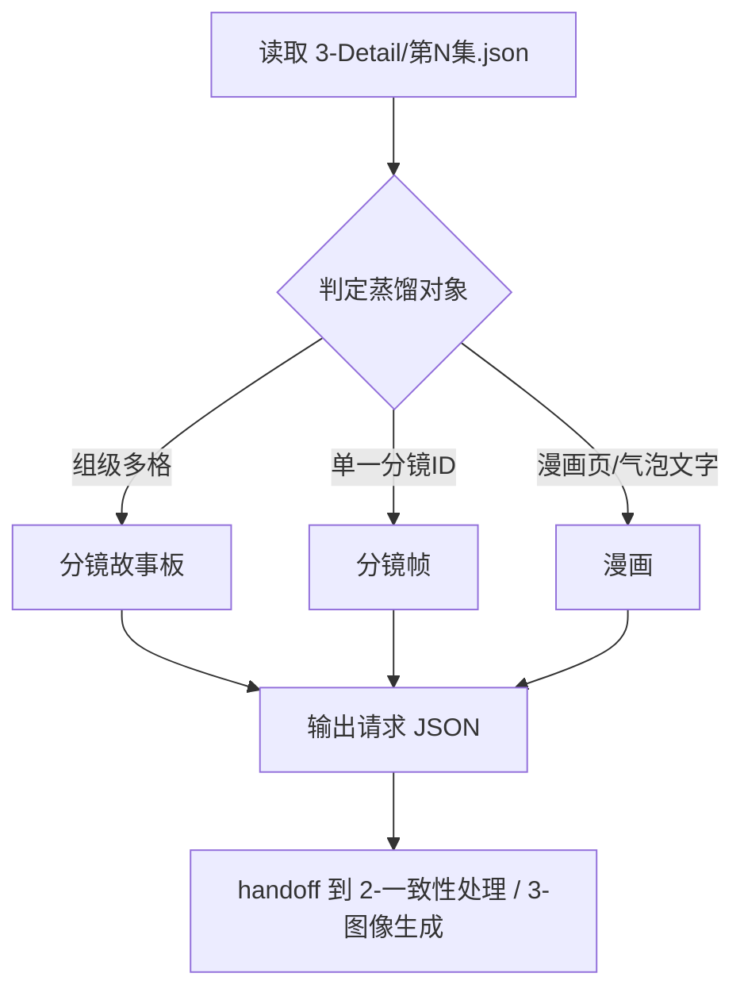
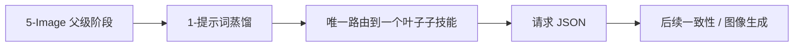

# 5-Image / 1-提示词蒸馏

## 概述

`1-提示词蒸馏` 是 `5-Image` 阶段的父级提示词收口层。

它不直接替代 `分镜故事板`、`分镜帧`、`漫画` 这三个叶子子技能，而是负责先回答一个更上游的问题：

**当前这轮画面任务，到底要把什么对象蒸馏成哪一种图像请求 JSON。**

因此，本层的职责是：

1. 锁定当前任务对象是 `分镜组`、`单一分镜ID` 还是 `漫画页`
2. 在三个叶子子技能之间做唯一且互斥的路由裁决
3. 把 `1-提示词蒸馏` 的产物固定为可 handoff 的图像请求 JSON，而不是直接图片
4. 为后续 `2-一致性处理` 与 `3-图像生成` 保留清晰边界

交付类型：`内容输出型`

## When to Use

- 需要进入 `5-Image` 的第一层执行，但用户还没明确说是 `分镜故事板`、`分镜帧` 还是 `漫画`。
- 需要把已有 `projects/<项目名>/3-Detail/第N集.json` 内容先蒸馏成图像请求 JSON。
- 需要在进入一致性处理或真实生成前，先完成 prompt 包和请求骨架收口。

## When Not to Use

- 任务已经明确命中某个叶子子技能，且不需要父级再做路由裁决。
- 当前工作已经进入 `2-一致性处理` 或 `3-图像生成`。
- 上游 `3-Detail/第N集.json` 尚未形成可消费的 `分镜组列表[]` 或明确 `分镜ID`。

## 子技能边界

### `1-提示词蒸馏` 拥有

- `分镜故事板 / 分镜帧 / 漫画` 的父级唯一入口
- 三个叶子子技能之间的互斥路由合同
- “先蒸馏请求 JSON，后做一致性与生成”的阶段边界
- 从 `5-Image` 父级路由到叶子对象的第一层裁决

### `1-提示词蒸馏` 不拥有

- 任何叶子子技能的对象内 prompt 细节
- 一致性二次处理规则
- 实际图片生成与模型调度
- 上游镜头事实改写

## 核心约束（Mandatory）

- 本层是父级路由技能，不并行生成三份叶子产物；默认只允许命中一个叶子子技能。
- 尽管 `分镜故事板`、`分镜帧`、`漫画` 目录名都不带数字序号，但本层已显式覆写“无序目录默认并发”规则：这里三者是互斥 sibling，不是默认并发 tranche。
- 若用户只说“做 1-提示词蒸馏”或“先蒸馏画面提示词”，默认先进入 `分镜故事板`；只有在单帧锚点或漫画页意图明确时，才改路由到 `分镜帧` 或 `漫画`。
- 本层的主产物是请求 JSON 合同和 handoff 准备，不是图片文件。
- 若上游对象不成立，应停止在本层并回退到 `5-Image` 父级或更上游阶段补齐输入。

## Visual Maps

## Route Summary

- 默认入口：`分镜故事板`
- 单一 `分镜ID`、首帧、关键帧、单镜头静帧诉求：进入 `分镜帧`
- 9:16 漫画页、气泡文字、旁白框、漫画阅读节奏诉求：进入 `漫画`
- 若一个请求同时混有多种对象，先拆成多个独立任务，不在本层强行并发聚合

## Execution Summary

1. 先读取 `5-Image` 父级已经锁定的权威输入。
2. 再判当前对象是组级、帧级还是漫画页级。
3. 只向一个叶子子技能派发执行。
4. 由叶子子技能生成对应的图像请求 JSON。
5. 把 handoff 关系继续交给后续 `2-一致性处理` 或 `3-图像生成`。

## Output Summary

- 本层自己不定义第二套并行输出模板。
- 叶子子技能分别拥有各自的 canonical landing：
  - `分镜故事板`
  - `分镜帧`
  - `漫画`
- 本层只拥有父级路由、对象边界和 handoff 总合同。

## Field Master

| field_id | 输出位置/字段 | 内容要求 | 默认责任 Step | 质量维度 | 失败码 |
| --- | --- | --- | --- | --- | --- |
| FIELD-VPD-ROOT-01 | 父级路由结论 | 锁定唯一叶子入口与排除理由 | S1 | 路由清晰度 | FAIL-VPD-ROOT-01 |
| FIELD-VPD-INPUT-02 | 输入清单 | 明确当前蒸馏对象的合法输入 | S2 | 输入完备性 | FAIL-VPD-INPUT-02 |
| FIELD-VPD-OBJECT-03 | 对象裁决 | 明确是组级、帧级还是漫画页级 | S3 | 对象判定准确性 | FAIL-VPD-OBJECT-03 |
| FIELD-VPD-HANDOFF-04 | handoff 说明 | 给出后续一致性/图像生成下一入口 | S4 | 交接可执行性 | FAIL-VPD-HANDOFF-04 |

## Thought Pass Map

| step_id | 聚焦字段 | 核心问题 | 生成动作 | 未达标信号 |
| --- | --- | --- | --- | --- |
| S1 | FIELD-VPD-ROOT-01 | 这轮该命中哪个叶子入口 | 锁定唯一叶子路径 | 同时给多个无序入口 |
| S2 | FIELD-VPD-INPUT-02 | 当前输入是否足以蒸馏 | 核对主 JSON 与对象锚点 | 输入不完整却继续路由 |
| S3 | FIELD-VPD-OBJECT-03 | 当前对象属于哪种蒸馏类型 | 做组级/帧级/漫画页裁决 | 组级与帧级混判 |
| S4 | FIELD-VPD-HANDOFF-04 | 当前结果如何交给下游 | 写清 handoff 目标与边界 | 只做路由，不留下一步 |

## Pass Table

| field_id | Pass Standard | Fail Code | Rework Entry |
| --- | --- | --- | --- |
| FIELD-VPD-ROOT-01 | 叶子入口唯一且排除理由清楚 | FAIL-VPD-ROOT-01 | S1 |
| FIELD-VPD-INPUT-02 | 输入链合法且可消费 | FAIL-VPD-INPUT-02 | S2 |
| FIELD-VPD-OBJECT-03 | 对象裁决与用户任务一致 | FAIL-VPD-OBJECT-03 | S3 |
| FIELD-VPD-HANDOFF-04 | 下一入口与边界明确 | FAIL-VPD-HANDOFF-04 | S4 |

## Root-Cause Execution Contract (Mandatory)

当出现以下症状时，必须先修本父级合同：

- 三个叶子子技能都存在，但不知道先进入哪一个
- 无序 sibling 被误当成默认并发批次
- 请求本应是单帧，却被错误推进到组级故事板
- `1-提示词蒸馏` 被误做成“直接出图”，没有留下请求 JSON handoff
- 叶子子技能各自成立，但 `2-一致性处理` / `3-图像生成` 接不上

必经链路：

`Symptom -> Direct Technical Cause -> Rule Source -> Meta Rule Source -> Fix Landing Points`

优先检查：

- `Rule Source`
  - `.agents/skills/aigc/5-Image/1-提示词蒸馏/SKILL.md`
  - `.agents/skills/aigc/5-Image/1-提示词蒸馏/CONTEXT.md`
  - `.agents/skills/aigc/5-Image/1-提示词蒸馏/分镜故事板/SKILL.md`
  - `.agents/skills/aigc/5-Image/1-提示词蒸馏/分镜帧/SKILL.md`
  - `.agents/skills/aigc/5-Image/1-提示词蒸馏/漫画/SKILL.md`
- `Meta Rule Source`
  - `.agents/skills/aigc/SKILL.md`
  - 根 `AGENTS.md`

## SKILL / CONTEXT 分工（Mandatory）

- `SKILL.md` 锁定本层父级入口、互斥路由、输出边界与 handoff 责任。
- `CONTEXT.md` 沉淀本层常见误判、修复顺序、复用 heuristic 与里程碑案例。
- 只有经过多轮验证的经验，才允许从 `CONTEXT.md` 晋升回本 `SKILL.md` 或更上层合同。

## Context Preload (Mandatory)

- 当前仓没有独立的 `.agents/skills/aigc/5-Image/SKILL.md` 阶段根合同；执行前直接加载 `.agents/skills/aigc/SKILL.md`。
- 再加载本 `SKILL.md + CONTEXT.md`。
- 命中叶子对象后，继续加载对应子技能的 `SKILL.md + CONTEXT.md`。
- 优先级遵循：用户显式请求 > 根 `AGENTS.md` > `.agents/skills/aigc/SKILL.md` > 本 `SKILL.md` > 各级 `CONTEXT.md`。
