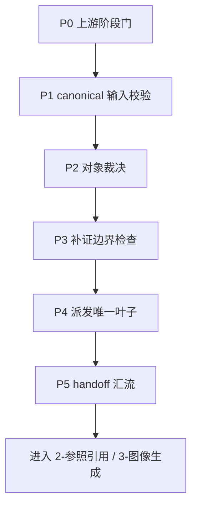
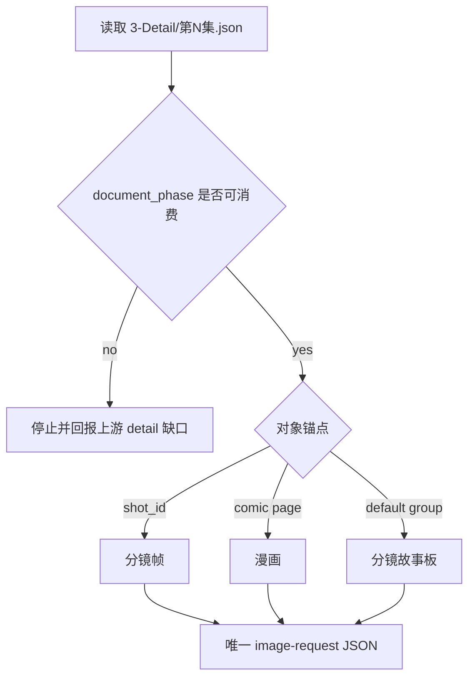
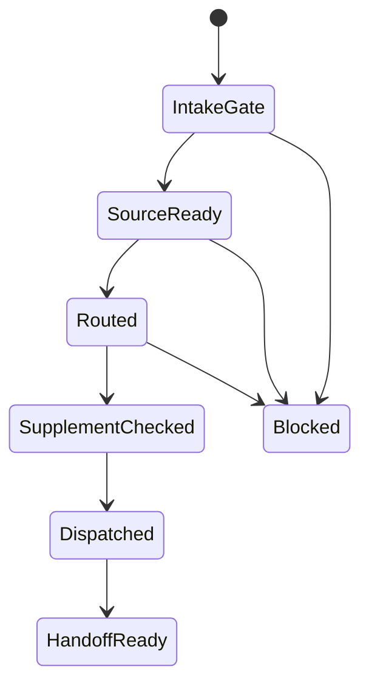
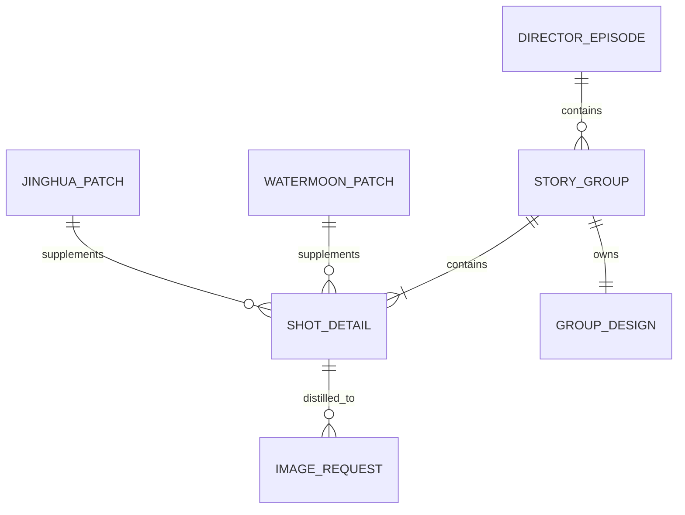

# 5-Image / 1-提示词蒸馏

## Mode Selection

- 当前任务属于 `既有优化`：保留 `分镜故事板 / 分镜帧 / 漫画` 三个叶子入口，但把父层升级为按 `skill-知行合一` 收束的单一 `SKILL.md` 真源。
- `复杂链路的骨架 / 细则分层 = false`：当前父层不再把路由门、输入门、handoff 门拆到平行 `references/`；规范性合同全部留在本文件。
- 父层仍是父技能，不直接生成图片、不替代叶子 prompt 细节、不创建本地 `subagent team`。

## 概述

`1-提示词蒸馏` 是 `5-Image` 阶段消费 `3-Detail` canonical 输出的第一道父级收口层。

它要先回答的不是“怎么写 prompt”，而是：

**当前这一轮，`3-Detail` 已经稳定给出了什么画面事实，这些事实应该被蒸馏成哪一种图像请求 JSON。**

因此，父层必须同时锁定：

1. 上游第一真源是否已达到可消费状态
2. 当前对象是组级 storyboard、单一 `分镜ID`，还是漫画页
3. 本轮只命中一个叶子入口，还是应先回上游补齐
4. 下游收到的主产物是请求 JSON，而不是图片

## Parent Positioning

### `1-提示词蒸馏` 拥有

- `3-Detail -> 5-Image` 的阶段入口判定
- 三个叶子子技能之间的互斥路由合同
- `metadata.document_phase`、`分镜组列表[]`、`分镜切换` 与镜级 canonical 字段的父级输入门
- `3-Detail` sidecar 只作补证、不反客为主的真源边界
- “先请求 JSON，后做一致性 / 生成”的 handoff 总合同

### `1-提示词蒸馏` 不拥有

- 叶子子技能内部的 prompt 结构细节
- 一致性处理与真实图片生成
- 上游 `3-Detail` 字段改写
- 第二套并行 image-request 模板真源

## Shared Canonical Sources (Mandatory)

- `.agents/skills/aigc/SKILL.md`
- `.agents/skills/aigc/3-Detail/SKILL.md`
- `.agents/skills/aigc/_shared/director_episode_output.schema.json`
- `.agents/skills/aigc/5-Image/_shared/image-generation-input.template.json`
- `.agents/skills/aigc/5-Image/1-提示词蒸馏/分镜故事板/SKILL.md`
- `.agents/skills/aigc/5-Image/1-提示词蒸馏/分镜帧/SKILL.md`
- `.agents/skills/aigc/5-Image/1-提示词蒸馏/漫画/SKILL.md`
- `projects/aigc/<项目名>/3-Detail/第N集.json`
- `projects/aigc/<项目名>/3-Detail/水月/第N集.field-patch.json`（可选补证）
- `projects/aigc/<项目名>/3-Detail/镜花/第N集.field-patch.json`（可选补证）

硬规则：

1. `projects/aigc/<项目名>/3-Detail/第N集.json` 是父层第一结构化真源。
2. `水月 / 镜花` sidecar 只在 canonical JSON 局部缺口时作为补证读取，不能替代 `第N集.json`。
3. 父层只做路由与 handoff，不在本层改写 `3-Detail` 字段。
4. 父层不创建第二套输出模板；叶子全部继承 `.agents/skills/aigc/5-Image/_shared/image-generation-input.template.json`。

## Business Requirement Analysis Contract (Mandatory)

| analysis_slot | 当前结论 |
| --- | --- |
| `business_goal` | 把 `3-Detail` 已稳定落位的组级/镜级事实，路由到唯一正确的图像请求 JSON 蒸馏叶子入口，并确保产物可继续 handoff 给 `2-参照引用 / 3-图像生成`。 |
| `business_object` | `projects/aigc/<项目名>/3-Detail/第N集.json` 中的 `metadata.document_phase`、`final_output.main_content.分镜组列表[]`、组级 `组间设计`、组级 `分镜切换`、镜级 `分镜明细[]`，以及可选 `水月 / 镜花` sidecar。 |
| `constraint_profile` | 只消费 `detail_in_progress | ready` 的 `3-Detail` 输出；只命中一个叶子；sidecar 只作补证；主产物必须是 image-request JSON；不得改写上游字段。 |
| `success_criteria` | 路由唯一、输入真源成立、对象锚点稳定、叶子收到的事实足以蒸馏，并且 handoff 指向后续阶段时无歧义。 |
| `non_goals` | 不直接出图、不在父层拼叶子 prompt、不并发三份叶子产物、不替 `3-Detail` 修复缺口。 |
| `complexity_source` | 复杂度主要来自阶段就绪门、对象判定门、补证边界和下游 handoff，而不是 prompt 文案本身。 |
| `topology_fit` | 采用“串行主干 + 条件补证支路 + 单一汇流”的父技能拓扑：先锁输入与 readiness，再做对象裁决，再派发唯一叶子，最后统一 handoff。 |
| `step_strategy` | 父层只维护总输入合同、对象路由、补证边界、handoff 门；叶子继续维护对象内蒸馏细则。 |

## Context Preload (Mandatory)

加载顺序固定为：

1. 根 `AGENTS.md`
2. `.agents/skills/aigc/SKILL.md + CONTEXT.md`
3. `.agents/skills/aigc/3-Detail/SKILL.md + CONTEXT.md`
4. 本 `SKILL.md + CONTEXT.md`
5. `.agents/skills/aigc/_shared/director_episode_output.schema.json`
6. `.agents/skills/aigc/5-Image/_shared/image-generation-input.template.json`
7. `projects/aigc/<项目名>/3-Detail/第N集.json`
8. `projects/aigc/<项目名>/3-Detail/水月/第N集.field-patch.json`（若存在）
9. `projects/aigc/<项目名>/3-Detail/镜花/第N集.field-patch.json`（若存在）
10. 命中叶子后的对应 `SKILL.md + CONTEXT.md`

## Total Input Contract (Mandatory)

### 必需输入

- `projects/aigc/<项目名>/3-Detail/第N集.json`
- `.agents/skills/aigc/_shared/director_episode_output.schema.json`

### 推荐输入

- 父级或用户显式提供的 `group_id / shot_id / output_mode`
- `projects/aigc/<项目名>/3-Detail/水月/第N集.field-patch.json`
- `projects/aigc/<项目名>/3-Detail/镜花/第N集.field-patch.json`

### Readiness Gate

父层在路由前必须同时检查：

1. `metadata.document_phase in {detail_in_progress, ready}`
2. `final_output.main_content.分镜组列表[]` 存在
3. 命中组至少具备：
   - `分镜组ID`
   - `剧本正文`
   - `组间设计.全局风格`
   - `组间设计.类型元素`
   - `组间设计.导演意图`
   - `组间设计.出场角色及穿搭`
   - `分镜切换`
   - `分镜明细[]`
4. `分镜明细[]` 中的镜级 canonical 字段可被叶子消费：
   - `分镜ID`
   - `角色背景面`
   - `角色站位走位`
   - `道具及状态`
   - `分镜表现`

若 `document_phase` 仍是 `bootstrapped / directing_in_progress`，或 group / shot canonical 字段壳未成立，必须停止在本层并回报上游缺口。

## Dispatch And Supplemental Evidence Contract (Mandatory)

### 对象裁决优先级

`显式 shot_id > 明确漫画页诉求 > 默认组级 storyboard`

### 路由规则

1. 用户或父级显式给出单一 `分镜ID`、首帧、关键帧、单镜头静帧：进入 `分镜帧`
2. 用户显式要求 9:16 漫画页、气泡文字、漫画阅读节奏：进入 `漫画`
3. 其余默认组级蒸馏：进入 `分镜故事板`
4. 一个请求混有多个对象时，不在本层并发聚合；必须拆任务

### 补证规则

1. `水月` sidecar 只补：
   - `出场角色及穿搭`
   - `角色背景面`
   - `角色站位走位`
   - `道具及状态`
   - `镜头消费提示`
2. `镜花` sidecar 只补：
   - shot skeleton
   - `beat_refs[]`
   - cinematic 字段
3. 若 canonical JSON 已具备完整可消费字段，父层不得优先读 sidecar。
4. 若 sidecar 与 canonical JSON 冲突，以 `3-Detail/第N集.json` 为准，并回报 `3-Detail` 源层缺口。

## Topology Contract (Mandatory)

- 主干节点固定为：
  - `P0 上游阶段门`
  - `P1 canonical 输入校验`
  - `P2 对象裁决`
  - `P3 补证边界检查`
  - `P4 唯一叶子派发`
  - `P5 handoff 汇流`
- 条件支路只有：
  - `B1 水月 / 镜花 sidecar 补证`
  - `B2 对象冲突时回退上游拆任务`
- 任一失败都必须返回具体门位，不得跳过
- 只有 `P5` 可宣告本层完成

## Visual Maps

## Thinking-Action Node Contract (Mandatory)

| node_id | objective | inputs | actions | evidence | route_out | gate |
| --- | --- | --- | --- | --- | --- | --- |
| `P0-stage-gate` | 判断是否可从 `3-Detail` 进入 `5-Image` | `metadata.document_phase`、父级阶段边界 | 拦截未就绪 episode，锁定本层只做请求蒸馏 | `stage_gate_note` | `ready -> P1`；`blocked -> 停止` | phase 合法前不得继续 |
| `P1-input-validate` | 校验 canonical JSON 是否具备组级/镜级消费壳 | episode JSON、shared schema | 检查 `分镜组列表[]`、`组间设计`、`分镜明细[]`、shot canonical 字段 | `input_audit` | `pass -> P2`；`fail -> 停止` | 输入壳不成立不得路由 |
| `P2-object-route` | 裁决组级 / 帧级 / 漫画页对象 | 用户意图、显式锚点、父层默认策略 | 锁定唯一叶子并给出排除理由 | `route_decision` | `sheet/frame/comic -> P3`；`mixed -> B2` | 只能命中一个叶子 |
| `P3-supplement-check` | 决定是否需要读取 sidecar 补证 | canonical JSON、可选 `水月/镜花` sidecar | 仅在 canonical 字段局部缺口时登记补证入口 | `supplement_note` | `direct -> P4`；`supplement -> P4` | sidecar 不得替代主真源 |
| `P4-leaf-dispatch` | 向唯一叶子派发对象与边界 | 路由结论、对象锚点、补证说明 | 派发唯一叶子，并附带只读边界与 handoff 目标 | `dispatch_packet` | `success -> P5`；`leaf_mismatch -> 回 P2` | 未形成唯一派发包不得继续 |
| `P5-handoff-converge` | 统一收束到 image-request JSON handoff | 叶子产物、输出模式、下游入口 | 检查主产物是请求 JSON，并写清下一入口 | `handoff_note` | `pass -> 完成`；`fail -> 回目标节点` | 仅本节点可结案 |

## Field Master

| field_id | 输出位置/字段 | 内容要求 | 默认责任节点 | 质量维度 | 失败码 |
| --- | --- | --- | --- | --- | --- |
| `FIELD-VPD-STAGE-01` | 父级阶段门 | 只允许消费 `detail_in_progress | ready` 的 `3-Detail` episode | `P0` | 阶段就绪性 | `FAIL-VPD-STAGE-01` |
| `FIELD-VPD-INPUT-02` | 输入审计 | 明确 `分镜组列表[]`、`组间设计`、`分镜明细[]` 与镜级 canonical 字段是否可消费 | `P1` | 输入完备性 | `FAIL-VPD-INPUT-02` |
| `FIELD-VPD-ROUTE-03` | 路由结论 | 叶子入口唯一且排除理由明确 | `P2` | 路由清晰度 | `FAIL-VPD-ROUTE-03` |
| `FIELD-VPD-SUPPLEMENT-04` | 补证说明 | sidecar 是否读取、为何读取、读取边界 | `P3` | 真源边界稳定性 | `FAIL-VPD-SUPPLEMENT-04` |
| `FIELD-VPD-HANDOFF-05` | handoff 说明 | 叶子产物是请求 JSON，并可继续交给后续阶段 | `P5` | 交接可执行性 | `FAIL-VPD-HANDOFF-05` |

## Thought Pass Map

| step_id | 聚焦字段 | 核心问题 | 生成动作 | 未达标信号 |
| --- | --- | --- | --- | --- |
| `P0` | `FIELD-VPD-STAGE-01` | 当前 `3-Detail` episode 是否已到可消费阶段 | 锁定或阻断阶段入口 | phase 仍是 `bootstrapped/directing_in_progress` |
| `P1` | `FIELD-VPD-INPUT-02` | 组级与镜级 canonical 字段是否足以被叶子消费 | 做 shared schema 输入审计 | 只有壳没有可用组/镜字段 |
| `P2` | `FIELD-VPD-ROUTE-03` | 当前对象到底属于哪个叶子 | 裁决唯一叶子与排除理由 | 同时命中多个对象类型 |
| `P3` | `FIELD-VPD-SUPPLEMENT-04` | 是否需要 sidecar 补证，以及补到什么边界 | 登记只读补证说明 | sidecar 被误当主真源 |
| `P5` | `FIELD-VPD-HANDOFF-05` | 当前结果是否已形成可交接的 image-request JSON | 写明下游入口与模式 | 叶子产物变成图片或缺少下一入口 |

## Root-Cause Execution Contract (Mandatory)

当出现以下症状时，必须先修父层合同：

- `3-Detail` 明明完成了，但 `1-提示词蒸馏` 还按旧路径或旧字段取数
- 明明只该命中一个叶子，却并发生成多份请求
- sidecar 被误当成主真源，覆盖了 canonical JSON
- `3-Detail` phase 未就绪，却直接进入蒸馏
- 下游拿到的不是请求 JSON，而是图片或混杂产物

必经链路：

`Symptom -> Direct Technical Cause -> Rule Source -> Meta Rule Source -> Fix Landing Points`

优先检查：

- `Rule Source`
  - `.agents/skills/aigc/5-Image/1-提示词蒸馏/SKILL.md`
  - `.agents/skills/aigc/5-Image/1-提示词蒸馏/CONTEXT.md`
  - `.agents/skills/aigc/3-Detail/SKILL.md`
  - `.agents/skills/aigc/_shared/director_episode_output.schema.json`
- `Meta Rule Source`
  - `.agents/skills/aigc/SKILL.md`
  - 根 `AGENTS.md`

## SKILL / CONTEXT 分工（Mandatory）

- `SKILL.md` 锁定父级阶段门、输入门、对象路由、补证边界与 handoff 责任。
- `CONTEXT.md` 沉淀误路由、真源漂移、补证边界失稳等经验模式。
- 只有经过复用验证的经验，才允许从 `CONTEXT.md` 晋升回本合同。
