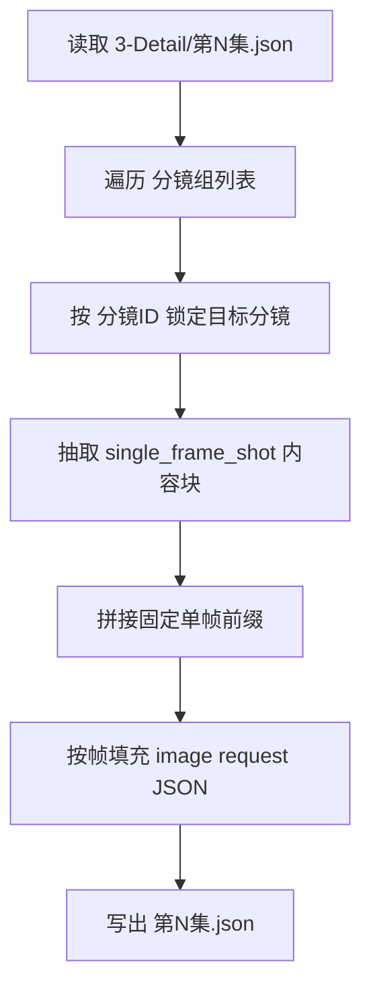

# 5-Image / 分镜帧

## 概述

`分镜帧` 负责把 `projects/<项目名>/3-Detail/第N集.json` 中某一个明确分镜，整理为单一 `分镜ID` 的图像生成请求 JSON。

交付类型：`内容输出型`

本子技能的 canonical truth 已收束为本 `SKILL.md`。此前分散在 `references/` 下的思维链、执行流程、类型策略与输出契约，现统一并入本合同，不再以 `references` 作为并行规范载体。

当前设计重点不是直接生成图片，而是先把目标分镜整理成：

1. 共享模板兼容的 `meta`
2. 面向单帧图像的 `prompt_style`
3. 图像生成侧 `model` 参数骨架与参照图预留位
4. 由固定单帧前缀与 `single_frame_shot` 内容块拼成的 `prompt`
5. 对应的 `prompt_char_count`

其中：

- 上游默认路径固定为 `projects/<项目名>/3-Detail/第N集.json`
- shared schema 固定为 `.agents/skills/aigc/_shared/director_episode_output.schema.json`
- shared JSON 模板固定为 `.agents/skills/aigc/5-Image/_shared/image-generation-input.template.json`
- 当前只输出 `json`，不输出 `.txt`
- `single_frame_shot` 内容按目标分镜与所属分镜组上下文组织，不做文字压缩

## When to Use

- 需要把单一 `分镜ID` 整理成单帧图像生成请求 JSON。
- 需要从上游脚本中抽出某一镜的静态画面锚点。
- 用户明确说“单帧 / 首帧 / 按分镜ID 出图”。
- 需要先完成 `1-提示词蒸馏`，后续再进入 `2-图像生成` 或其他下游生成/一致性处理链。

## When Not to Use

- 任务是整组多格 storyboard，应进入 `分镜故事板`。
- 任务是气泡文字、漫画页布局或 9:16 漫画改编，应进入 `漫画`。
- 当前还无法确定唯一 `分镜ID`。

## 子技能边界

### `分镜帧` 拥有

- 单一 `分镜ID` -> 图像请求条目的一对一转换合同
- `single_frame_shot` 的单帧内容归纳规则
- 固定单帧前缀的 prompt 组织规则
- 对 `5-Image/_shared` 图像入参模板的局部填充规则

### `分镜帧` 不拥有

- 组级 storyboard sheet 合同
- 漫画页文字系统与版式规划
- 一致性二次处理与真实图片生成
- 上游镜头事实改写

## Visual Maps



## Canonical Inputs

- `projects/<项目名>/3-Detail/第N集.json`
- `.agents/skills/aigc/_shared/director_episode_output.schema.json`
- `.agents/skills/aigc/5-Image/_shared/image-generation-input.template.json`

## Canonical Landing

- 子路径根目录：`projects/<项目名>/5-Image/分镜帧/`
- 单集目录：`projects/<项目名>/5-Image/分镜帧/第N集/`
- 汇总 JSON：`projects/<项目名>/5-Image/分镜帧/第N集/第N集.json`
- 汇总清单：`projects/<项目名>/5-Image/分镜帧/第N集/_manifest.json`（可选）

## 输入合同

### 必需输入

- `projects/<项目名>/3-Detail/第N集.json`
- `.agents/skills/aigc/5-Image/_shared/image-generation-input.template.json`
- 可唯一定位的 `分镜ID`

### 推荐输入

- `projects/<项目名>/4-Design/` 下的角色、场景、道具参考
- 既有 `projects/<项目名>/5-Image/` 历史 prompt、参考图或单帧产物

### 输入处理原则

1. `projects/<项目名>/3-Detail/第N集.json` 必须满足 `.agents/skills/aigc/_shared/director_episode_output.schema.json` 的 `metadata / thinking_chain / final_output` 三段式结构。
2. 目标分镜固定从 `final_output.main_content.分镜组列表[].分镜明细[]` 锁定，并保留所属 `分镜组ID / 剧本正文 / 组间设计` 作为上下文。
3. `分镜ID` 必须遵循四段式：`episode-scene-group-frame`。
4. `single_frame_shot` 只归纳当前帧可见画面，不复述整段对白或整组剧情。

## Mandatory Workflow

1. 读取上层 `.agents/skills/aigc/5-Image/1-提示词蒸馏/SKILL.md + CONTEXT.md`。
2. 读取 `projects/<项目名>/3-Detail/第N集.json`，锁定 `final_output.main_content.分镜组列表`。
3. 遍历分镜组并按 `分镜明细[].分镜ID` 锁定当前单集里唯一目标 `分镜ID`，同时保留所属 `分镜组ID / 剧本正文 / 组间设计`。
4. 从目标 `分镜明细` 与所属分镜组上下文中组织 `single_frame_shot` 内容块，优先保留：
   - `分镜组ID`
   - 所属组 `剧本正文`
   - 所属组 `组间设计`
   - 目标 `分镜ID`
   - 目标分镜的镜级字段
5. 以共享模板为骨架填充 `meta + prompt_style + model + prompt + prompt_char_count`；其中 `prompt` 固定为“单帧前缀 + single_frame_shot”。
6. 如有 `4-Design` 参考资产或既有单帧资产，则只把它们登记到 `model.reference_images / image_markers` 的预留位。
7. 写入单集 `第N集.json`；仅在任务要求 `full_trace` 时额外输出 `_manifest.json`。

## Prompt Assembly Rules

1. 固定前缀必须逐字保留：

   ```text
   Create a single cinematic frame based on the following shot breakdown.
   Render only the specified shot moment as one full-frame image (no multi-panel layout).
   Do not add any text, subtitles, speech bubbles, or graphic overlays.
   Preserve the shot's composition, camera angle, subject positions, and atmosphere as the primary visual focus.
   ```

2. `single_frame_shot` 必须紧随其后，不插入额外模板说明。
3. `single_frame_shot` 只允许服务当前唯一 `分镜ID`，不得扩写成整组多镜头摘要。
4. 若上游内容存在空缺，允许保守留空，不得为凑完整度虚构镜头事实。

## Output Contract

### 单输出落点

- `projects/<项目名>/5-Image/分镜帧/第N集/第N集.json`
- `projects/<项目名>/5-Image/分镜帧/第N集/_manifest.json`（仅当本轮要求 `full_trace` 时）

### 子技能负责填充的 JSON 字段

1. `meta`
2. `prompt_style`
3. `model`
4. `prompt`
5. `prompt_char_count`

### 硬规则

1. `第N集.json` 是 canonical completeness carrier；结构完整性、字段齐全性和下游工具消费能力一律以 JSON 为准。
2. 当前模式只输出 JSON，不输出 `.txt` 派生视图。
3. 每个目标 `分镜ID` 在 `第N集.json` 中只生成 1 条请求对象。
4. `prompt` 必须严格由以下固定前缀开头：

   ```text
   Create a single cinematic frame based on the following shot breakdown.
   Render only the specified shot moment as one full-frame image (no multi-panel layout).
   Do not add any text, subtitles, speech bubbles, or graphic overlays.
   Preserve the shot's composition, camera angle, subject positions, and atmosphere as the primary visual focus.
   ```

5. 固定前缀之后必须直接拼接 `single_frame_shot` 内容块。
6. `single_frame_shot` 必须覆盖目标分镜所属组的 `分镜组ID`、`剧本正文`、`组间设计.全局风格`、`组间设计.类型元素`、`组间设计.导演意图` 与目标 `分镜明细`。
7. `single_frame_shot` 必须收束到当前单一 `分镜ID` 的可见画面，不得扩写为整组多镜头摘要。
8. `single_frame_shot` 的内容允许直接使用上游信息，不做文字压缩，也不虚构补写上游没有的镜头事实。
9. `meta.shot_level` 固定为 `storyboard_frame`；`meta.group_id` 与长度为 1 的 `meta.source_shot_ids` 必须能完整回链该帧。
10. `prompt_style.type` 固定服务单帧图像；`prompt_style.language` 默认标记为 `mixed`，以容纳固定英文前缀与上游原文内容。
11. `model` 必须保持图像侧参数骨架完整；`reference_images` 与 `image_markers` 在缺图时也必须保留空骨架，不得删除。
12. `prompt_char_count` 必须与实际 `prompt` 内容一致。
13. 只有用户或父级明确要求时，才额外输出 `_manifest.json`；否则默认 `json_only`。

### `_manifest.json` 最低要求

1. `episode_id`
2. `source_file`
3. `output_mode`
4. `json_file`
5. `shot_count`
6. `shots[].group_id`
7. `shots[].shot_id`
8. `shots[].prompt_char_count`
9. `shots[].has_reference_slots`
10. `shots[].exception_note`

## Handoff Rule

- 本子技能不承担组级 storyboard，也不承担漫画页节奏改编。
- 当前产物默认交给 `5-Image/2-图像生成` 或其他下游消费链继续处理。
- 本子技能本身不负责真实图片生成。

## Strategy Summary

- 判定顺序固定为：`唯一 ID 是否成立 -> single_frame_shot 内容块是否完整 -> 是否只需 JSON -> 共享模板字段是否齐全`
- 若无法确认唯一 `分镜ID`，立即停止并回报上游缺口
- 若 `single_frame_shot` 信息不完整，允许保守输出，但必须显式保留缺口
- unknown 默认路由：仍按 `json_only` 执行，但必须说明哪些字段留空

## Type-Specific Handling

### 变量登记表

| var_id | 变量层级 | 观测信号 | 状态集合 | 检测方法 | 优先级 |
| --- | --- | --- | --- | --- | --- |
| V-SB-FRAME-01 | 输入 | 目标分镜结构是否完整 | `ready/incomplete` | 检查 `分镜组ID/剧本正文/组间设计/目标分镜明细` | P0 |
| V-SB-FRAME-02 | 内容块 | `single_frame_shot` 内容块是否完整 | `ready/partial` | 检查目标镜级字段与所属组上下文是否齐全 | P1 |
| V-SB-FRAME-03 | 输出要求 | 本轮只要 JSON 还是 JSON+manifest | `json_only/full_trace` | 结合用户目标与父级要求 | P1 |

### 情况判定表

| case_id | 触发谓词 | 置信度阈值 | 互斥关系 | 可并发关系 |
| --- | --- | --- | --- | --- |
| C-SB-FRAME-01 | `V-SB-FRAME-01=incomplete` | 1.0 | 互斥全部生成路由 | 无 |
| C-SB-FRAME-02 | `V-SB-FRAME-02=ready` | 0.95 | 互斥 C-SB-FRAME-03 | 可并发 C-SB-FRAME-04 |
| C-SB-FRAME-03 | `V-SB-FRAME-02=partial` | 0.90 | 互斥 C-SB-FRAME-02 | 可并发 C-SB-FRAME-04 |
| C-SB-FRAME-04 | `V-SB-FRAME-03=full_trace` | 0.90 | 无 | 可并发 C-SB-FRAME-02/C-SB-FRAME-03 |

### 策略映射矩阵

| case_id | strategy_id | 执行步骤 | 质量门禁 | fallback_strategy_id | 升级条件 |
| --- | --- | --- | --- | --- | --- |
| C-SB-FRAME-01 | S-FRAME-BACKTRACK | 停止并报告上游缺口 | 不伪造缺失分镜或上游字段 | S-FRAME-PAUSE | 上游缺口持续存在 |
| C-SB-FRAME-02 | S-FRAME-MAINLINE | 用完整 `single_frame_shot` 填充共享模板 | 固定前缀、目标镜级字段和所属组上下文全部成立 | S-FRAME-PAUSE | 模板字段被局部删改 |
| C-SB-FRAME-03 | S-FRAME-PARTIAL | 保守填充已有内容，不虚构缺失字段 | 输出仍可回链真实上游内容 | S-FRAME-PAUSE | 缺口影响后续生成消费 |
| C-SB-FRAME-04 | S-FRAME-FULL-TRACE | 输出 JSON + manifest | 两文件互相可追溯 | S-FRAME-MAINLINE | 本轮只要求 `json_only` |

## Field Master

| field_id | 输出位置/字段 | 内容要求 | 默认责任 Step | 质量维度 | 失败码 |
| --- | --- | --- | --- | --- | --- |
| FIELD-SB-FRAME-01 | `prompt_style.type / prompt_style.language / prompt_style.char_limit / meta.shot_level / meta.group_id / meta.source_shot_ids` | 以独立 `prompt_style` 声明单帧图像提示词约束，并锁定组级归属与单一目标 `分镜ID` | S1 | 输入覆盖完整度 | FAIL-SB-FRAME-01 |
| FIELD-SB-FRAME-02 | `prompt / prompt_char_count` | prompt 必须由固定单帧前缀与完整 `single_frame_shot` 内容块组成，且顶层字数统计一致 | S2-S3 | Prompt 蒸馏稳定性 | FAIL-SB-FRAME-02 |
| FIELD-SB-FRAME-03 | `model.model_version / model.ratio / model.image_size / model.output_format / model.num_images / model.reference_images / model.image_markers` | `model` 必须保持图像侧模板骨架完整；无图时也保留参照槽位 | S4 | 模板兼容性 | FAIL-SB-FRAME-03 |
| FIELD-SB-FRAME-04 | `第N集.json / _manifest.json` | 输出文件可追溯、可继续 handoff 给后续处理与图像生成 | S5 | 输出可消费性 | FAIL-SB-FRAME-04 |

## Thought Pass Map

| step_id | 聚焦字段 | 核心问题 | 生成动作 | 未达标信号 |
| --- | --- | --- | --- | --- |
| S1 | FIELD-SB-FRAME-01 | 当前目标 `分镜ID` 是谁，属于哪个 `分镜组` | 锁定 `prompt_style + shot_level + group_id + source_shot_ids` | 分镜定位冲突或缺失 |
| S2 | FIELD-SB-FRAME-02 | `single_frame_shot` 需要覆盖哪些上游字段 | 提取所属组 `剧本正文 + 组间设计` 与目标 `分镜明细` | 漏掉组级字段或目标镜级字段 |
| S3 | FIELD-SB-FRAME-02 | prompt 是否严格满足“固定单帧前缀 + single_frame_shot” | 逐字保留固定前缀并拼接内容块 | 前缀缺失、顺序错误或额外插入说明 |
| S4 | FIELD-SB-FRAME-03 | 图像请求模板字段是否完整且不虚构参照图 | 保留图像侧参数骨架与参照图槽位 | 删字段、乱序或擅自补图 |
| S5 | FIELD-SB-FRAME-04 | 输出是否已形成可 handoff 的单集 JSON | 写 `第N集.json`，按需补 `_manifest.json` | 仍把图片落盘当主产物或缺少 JSON |

## Pass Table

| field_id | Pass Standard | Fail Code | Rework Entry |
| --- | --- | --- | --- |
| FIELD-SB-FRAME-01 | `prompt_style.type / meta.shot_level` 合法，且 `group_id` 与长度为 1 的 `source_shot_ids` 同时成立 | FAIL-SB-FRAME-01 | S1 |
| FIELD-SB-FRAME-02 | prompt 满足固定前缀、完整 `single_frame_shot` 与顶层字数统计 | FAIL-SB-FRAME-02 | S2-S3 |
| FIELD-SB-FRAME-03 | 图像侧 `model` 骨架完整，`reference_images` 与 `image_markers` 保持共享模板兼容 | FAIL-SB-FRAME-03 | S4 |
| FIELD-SB-FRAME-04 | `第N集.json` 可追溯可 handoff；若要求 `full_trace`，则 `_manifest.json` 同步成立 | FAIL-SB-FRAME-04 | S5 |

## Root-Cause Execution Contract (Mandatory)

当出现以下症状时，必须先修本子技能合同：

- `分镜ID` 仍停留在组内局部编号，无法全局回链
- 仍把图片落盘当主产物，而不是单帧图像请求 JSON
- `single_frame_shot` 变成整组剧情梗概或大段对白
- prompt 没有以固定单帧前缀开头
- 共享模板字段被删改，尤其是 `reference_images` 或 `image_markers`

必经链路：

`Symptom -> Direct Technical Cause -> Rule Source -> Meta Rule Source -> Fix Landing Points`

优先检查：

- `Rule Source`
  - `.agents/skills/aigc/5-Image/1-提示词蒸馏/分镜帧/SKILL.md`
  - `.agents/skills/aigc/5-Image/1-提示词蒸馏/分镜帧/CONTEXT.md`
- `Meta Rule Source`
  - `.agents/skills/aigc/5-Image/1-提示词蒸馏/SKILL.md`
  - `.agents/skills/aigc/SKILL.md`
  - 根 `AGENTS.md`

## Context Preload (Mandatory)

- 执行前先加载 `.agents/skills/aigc/SKILL.md`。
- 再加载 `.agents/skills/aigc/5-Image/1-提示词蒸馏/SKILL.md + CONTEXT.md`。
- 再加载本 `SKILL.md + CONTEXT.md`。
- 建议同时读取 `.agents/skills/aigc/5-Image/_shared/image-generation-input.template.json`。
- 优先级遵循：用户显式请求 > 根 `AGENTS.md` > `.agents/skills/aigc/SKILL.md` > `.agents/skills/aigc/5-Image/1-提示词蒸馏/SKILL.md` > 本 `SKILL.md` > 各级 `CONTEXT.md`。
