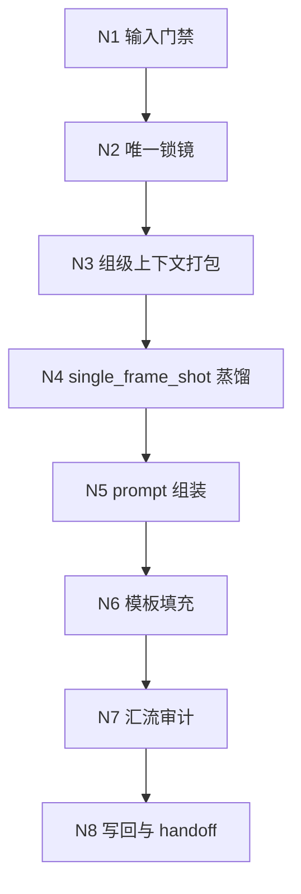
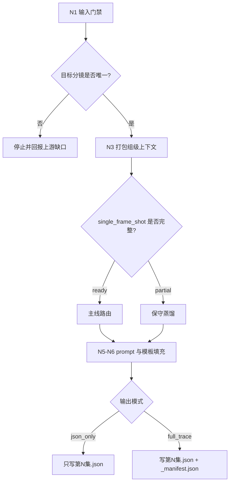
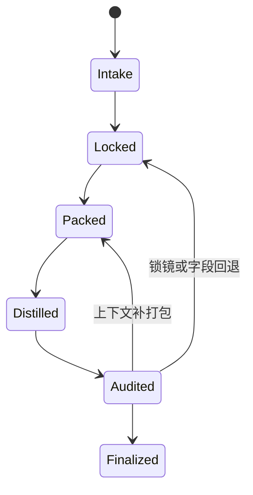

# 5-Image / 1-提示词蒸馏 / 分镜帧

## Context Loading Contract

- 每次调用本技能时，必须同时加载同目录 `CONTEXT.md` 作为预加载上下文。
- 若同目录 `CONTEXT.md` 缺失，应先补齐最小知识库骨架，或向用户明确报告阻塞；不得在未检查该上下文的情况下执行技能。
- 冲突优先级：用户显式请求 > 仓库/全局 `AGENTS.md` > 本 `SKILL.md` > 同目录 `CONTEXT.md`。

## Mode Selection

- 本技能已按 `skill-知行合一` 重排为“单一 `SKILL.md` 真源 + 思行节点网络”。
- 当前显式采用：`复杂链路的骨架 / 细则分层 = false`。
- 这意味着复杂节点细则、门禁、回退、字段映射与审计规则全部内收在本文件，不再拆回 `references/`。
- 当前不创建本地 `team.md`、`subagent` roster 或额外子技能目录；`分镜帧` 仍是确定性叶子蒸馏单元，但其内部能力面已改写为知行合一节点网络。

## 概述

`分镜帧` 负责把 `projects/aigc/<项目名>/3-Detail/第N集.json` 中某一个可唯一定位的 `分镜ID`，蒸馏为单帧图像生成请求 JSON。

本技能不负责真实出图，不改写上游镜头事实，也不把多镜头拼成一条请求。它只负责把单一帧级对象稳定收束成下游可消费的请求对象。

当前交付焦点固定为：

1. 共享模板兼容的 `meta`
2. 面向单帧图像的 `prompt_style`
3. 图像生成侧 `model` 参数骨架与参照图预留位
4. 由固定英文前缀、组级设计块与单镜融写行拼成的 `prompt`
5. 对应的 `prompt_char_count`

## When to Use

- 需要把单一 `分镜ID` 整理成单帧图像生成请求 JSON。
- 用户明确说“单帧 / 首帧 / 单镜头静帧 / 关键帧 / 按分镜ID出图”。
- 需要先完成 `1-提示词蒸馏`，后续再进入 `2-参照引用` 或 `3-图像生成`。
- 需要保留目标分镜所属组的必要上下文，但最终只服务当前唯一 `分镜ID`。

## When Not to Use

- 目标是整组多格 storyboard，应进入 `分镜故事板`。
- 目标是漫画页、气泡文字、旁白框或漫画阅读节奏，应进入 `漫画`。
- 上游 `3-Detail/第N集.json` 尚未形成合法 `分镜组列表`、`metadata.document_phase` 未到 `detail_in_progress | ready`，或当前无法确认唯一 `分镜ID`。
- 任务想把多个 `分镜ID` 合并成一条请求；本技能只处理“一镜一条”。

## Truth Ownership

### `分镜帧` 拥有

- 单一 `分镜ID -> 1 条图像请求对象` 的转换合同
- `正文切分参考[] -> 正文回指 -> 单镜融写行` 的桥接规则
- 固定英文前缀 + 组级设计块 + 单镜融写行 的 prompt 组织规则
- 对 `.agents/skills/aigc/5-Image/_shared/image-generation-input.template.json` 的局部填充规则
- `json_only / full_trace` 两种输出模式下的单集落盘合同

### `分镜帧` 不拥有

- 父级 `1-提示词蒸馏` 的对象裁决与互斥路由权
- 组级故事板合同与漫画页合同
- 一致性二次处理与真实图片生成
- 上游导演 JSON 的事实改写
- 第二套 `references/` 规范真源或平行私有模板

## Canonical Source Governance

- 当前 `SKILL.md` 是本技能唯一规范真源。
- `CONTEXT.md` 仅承载经验层：Type Map、Repair Playbook、Reusable Heuristics。
- `.agents/skills/aigc/5-Image/_shared/image-generation-input.template.json` 是共享模板真源；本技能只做局部填充，不复制平行模板。
- `.agents/skills/aigc/5-Image/1-提示词蒸馏/分镜帧/prompt-assembly-spec.md` 是本叶子的句法装配真源。
- `.agents/skills/aigc/5-Image/1-提示词蒸馏/分镜帧/scripts/generate_episode_packets.py` 是本叶子的 canonical runner。
- `.agents/skills/aigc/5-Image/1-提示词蒸馏/_shared/prompt_bridge_helpers.py` 是 `分镜帧 / 分镜故事板` 共享的 script bridge runtime 真源。
- 相关“子技能包能力面”当前以内收节点方式治理，不另起本地子目录；若未来真有稳定独立边界，应显式升格为父级声明的受治理子技能，而不是重新拆回多份文档。

## Total Input Contract (Mandatory)

### Business Goal

把上游编导根文件中的单一 `分镜ID`，稳定投影成一条可 handoff 的单帧图像请求对象，供后续一致性处理或图像生成继续消费。

### Business Object

- 第一结构化真源：`projects/aigc/<项目名>/3-Detail/第N集.json`
- 目标对象：`final_output.main_content.分镜组列表[].分镜明细[]` 中的单一 `分镜ID`
- 业务投影：`组级设计块 + 单镜融写行`
- 最终载体：`projects/aigc/<项目名>/5-Image/分镜帧/第N集/第N集.json`

### Constraints

1. 目标 `分镜ID` 必须可唯一定位。
2. 单镜融写行只能服务当前唯一 `分镜ID`，不得扩写为整组多镜头摘要。
3. `prompt` 必须严格由固定英文前缀开头，并继续组织为 `组级设计块 + xx秒-xx秒｜分镜<组内序号>：...`。
4. 共享模板字段骨架必须完整保留，尤其是 `reference_images` 与 `image_markers`。
5. 缺失字段允许保守留空，不得虚构新镜头事实。

### Non-Goals

- 不直接生成图片
- 不重写 `3-Detail` 上游事实
- 不并发处理多个对象类型
- 不创建 `.txt` 派生视图
- 不把本技能升级成多角色 team 或 subagent 网络

### Success Criteria

1. `分镜ID`、`group_id`、`source_shot_ids` 可完整回链到唯一目标分镜。
2. `prompt` 满足“固定英文前缀 + 组级设计块 + 单镜融写行”。
3. `model` 骨架完整，空参照槽位仍保留。
4. `第N集.json` 可被后续阶段直接消费。
5. 若要求 `full_trace`，则 `_manifest.json` 与 `第N集.json` 互相可追溯。

### Evidence Sources

- `projects/aigc/<项目名>/3-Detail/第N集.json`
- `.agents/skills/aigc/_shared/director_episode_output.schema.json`
- `.agents/skills/aigc/5-Image/_shared/image-generation-input.template.json`
- `projects/aigc/<项目名>/4-Design/` 下参考资产，仅用于 `reference_images / image_markers` 槽位登记

## Canonical Inputs And Landing

### Canonical Inputs

- `projects/aigc/<项目名>/3-Detail/第N集.json`
- `.agents/skills/aigc/_shared/director_episode_output.schema.json`
- `.agents/skills/aigc/5-Image/_shared/image-generation-input.template.json`
- 一个可唯一定位的 `分镜ID`
- 可选 `projects/aigc/<项目名>/3-Detail/水月/第N集.field-patch.json`
- 可选 `projects/aigc/<项目名>/3-Detail/镜花/第N集.field-patch.json`

### Readiness Gate

进入单帧蒸馏前，必须确认：

1. `metadata.document_phase in {detail_in_progress, ready}`
2. 目标分镜所属组具备 `组间设计.出场角色及穿搭`
3. 目标分镜所属组具备 `正文切分参考[]`，且目标分镜具备 `正文回指`
4. 目标分镜至少具备 `角色表现 / 运动表现 / 氛围表现 / 视觉强化 / 分镜构图 / 摄影美学 / 运镜手法 / 转场特效`

若当前项目仍在兼容过渡期，可短期回退读取 `角色背景面 / 角色站位走位 / 道具及状态 / 分镜表现`，但它们只允许作为补证，不得重新定义单帧上下文的第一真相。

### Canonical Landing

- 子路径根目录：`projects/aigc/<项目名>/5-Image/分镜帧/`
- 单集目录：`projects/aigc/<项目名>/5-Image/分镜帧/第N集/`
- 汇总 JSON：`projects/aigc/<项目名>/5-Image/分镜帧/第N集/第N集.json`
- 汇总清单：`projects/aigc/<项目名>/5-Image/分镜帧/第N集/_manifest.json`，仅在 `full_trace` 时输出

### Script Entrypoint

- canonical runner：`.agents/skills/aigc/5-Image/1-提示词蒸馏/分镜帧/scripts/generate_episode_packets.py`
- 句法 spec：`.agents/skills/aigc/5-Image/1-提示词蒸馏/分镜帧/prompt-assembly-spec.md`
- 标准执行命令：
  - `python3 .agents/skills/aigc/5-Image/1-提示词蒸馏/分镜帧/scripts/generate_episode_packets.py --project <项目名> --episode 第N集`
  - `python3 .agents/skills/aigc/5-Image/1-提示词蒸馏/分镜帧/scripts/generate_episode_packets.py --project <项目名> --episode 第N集 --shot-id <分镜ID>`

## Visual Maps







## Internal Capability Fusion Contract (Mandatory)

`分镜帧` 不再把局部判断拆成零散 checklist。以下能力面全部内收为本 `SKILL.md` 内部节点：

| 能力面 | 作用 | 典型证据 | 何时触发 |
| --- | --- | --- | --- |
| `input_gate_engine` | 校验当前任务是否确属帧级蒸馏，且输入真源与阶段就绪门齐备 | `input_lock_note`、缺口列表 | 每次进入本技能时必须触发 |
| `shot_locator_engine` | 在 `分镜组列表[].分镜明细[]` 中唯一锁定目标分镜与所属分镜组 | `shot_lock_record` | 输入门禁通过后必触发 |
| `context_pack_engine` | 把组级事实与镜级事实打成单帧蒸馏可消费的上下文包 | `frame_context_pack` | 目标分镜锁定后必触发 |
| `single_frame_distill_engine` | 生成只服务当前帧的 `single_frame_shot` | `single_frame_shot`、`coverage_note` | 上下文包形成后必触发 |
| `prompt_contract_engine` | 把固定前缀与 `single_frame_shot` 组装成 prompt，并校验字数统计 | `prompt_draft`、`prompt_char_count` | 蒸馏内容块后必触发 |
| `template_writeback_engine` | 维持共享模板骨架、决定输出模式并落盘 | `writeback_patch`、`manifest_note` | prompt 合同通过后必触发 |

硬规则：

1. 这些能力面是本技能内部节点，不是额外子技能真源。
2. 任一能力面都不得绕过父级对象裁决直接扩权到 `分镜故事板` 或 `漫画`。
3. 写回权只归当前技能主合同所有，不归任何补充说明或 sidecar。

## Topology Contract (Mandatory)

### Topology Fit

本技能采用 `串行主干 + 条件回退 + 输出模式分叉 + 单一汇流` 的知行合一叶子拓扑：

1. 串行主干：
   - 输入门禁
   - 唯一锁镜
   - 上下文打包
   - 内容蒸馏
   - prompt 组装
   - 模板填充
2. 条件回退：
   - 目标分镜不唯一时立即停机
   - `single_frame_shot` 不完整时走保守蒸馏，不得伪造补全
3. 输出模式分叉：
   - `json_only`
   - `full_trace`
4. 单一汇流：
   - 所有支路最终只能汇流到同一 `第N集.json`

### Ordered / Unordered Rules

- `N1 -> N2 -> N3 -> N4 -> N5 -> N6 -> N7 -> N8` 固定串行。
- `N4` 允许按 `ready / partial` 走两条局部策略，但两条策略都必须回到同一 `N5`。
- `N7` 决定 `json_only / full_trace`，但两路都必须汇流到同一 canonical landing。
- 本技能不拥有 sibling 并发权，也不在本地把多个 `分镜ID` 作为批量并行 tranche。

## Thinking-Action Node Contract (Mandatory)

每个思行节点至少要定义以下字段：

| slot | 要求 |
| --- | --- |
| `node_id` | 稳定节点标识 |
| `objective` | 该节点要解决的判断/动作目标 |
| `inputs` | 进入该节点的输入与依赖 |
| `actions` | 该节点真正执行的动作 |
| `evidence` | 该节点留下的证据、产物或验证结果 |
| `route_out` | 成功、失败、分支时分别流向何处 |
| `gate` | 是否允许进入最终汇流 |

## Thinking-Action Node Network

| node_id | 对应 Step | 聚焦字段 | objective | actions | evidence | route_out | gate |
| --- | --- | --- | --- | --- | --- | --- | --- |
| `N1-INPUT-GATE` | S1 | `FIELD-SB-FRAME-01` | 锁定当前任务确属帧级蒸馏，且核心输入存在 | 读取父级合同、episode JSON、共享模板、可选 sidecar 与目标 `分镜ID`，检查阶段边界与文件存在性 | `input_lock_note`、缺口列表 | pass -> `N2`；fail -> 结束并回报缺口 | 输入齐备前不得继续 |
| `N2-SHOT-LOCK` | S2 | `FIELD-SB-FRAME-01` | 在 `分镜组列表[].分镜明细[]` 中唯一定位目标分镜 | 遍历分镜组，锁定 `group_id + shot_id + source_shot_ids`，排除重号或缺号 | `shot_lock_record` | pass -> `N3`；fail -> 回 `S1/S2` | 唯一定位成立后才可蒸馏 |
| `N3-CONTEXT-PACK` | S3 | `FIELD-SB-FRAME-02` | 打包当前帧需要继承的组级与镜级上下文 | 提取 `分镜组ID / 剧本正文 / 正文切分参考[] / 组间设计 / 目标分镜明细.正文回指`，形成 `frame_context_pack` | `frame_context_pack`、字段覆盖清单 | pass -> `N4`；fail -> 回 `S2/S3` | 上下文包须可回链真实上游 |
| `N4-SINGLE-FRAME-DISTILL` | S4 | `FIELD-SB-FRAME-02` | 生成只服务当前帧的 `single_frame_shot` | 按单帧可见事实收缩内容块，区分 `ready / partial` 两种完整度 | `single_frame_shot`、`coverage_note` | ready/partial -> `N5`；fail -> 回 `S3/S4` | 不得写成整组剧情摘要 |
| `N5-PROMPT-ASSEMBLY` | S5 | `FIELD-SB-FRAME-02` | 让 prompt 严格满足固定前缀合同与字数统计 | 逐字保留固定前缀，拼接 `single_frame_shot`，计算 `prompt_char_count` | `prompt_draft`、`prompt_char_count` | pass -> `N6`；fail -> 回 `S4/S5` | 固定前缀与内容顺序不得漂移 |
| `N6-TEMPLATE-FILL` | S6 | `FIELD-SB-FRAME-01` `FIELD-SB-FRAME-03` | 以共享模板为骨架填充 `meta / prompt_style / model` | 写入 `shot_level / group_id / source_shot_ids / prompt_style / model`，保留空参照槽位 | `request_entry_patch` | pass -> `N7`；fail -> 回 `S5/S6` | 模板字段骨架必须完整 |
| `N7-CONVERGENCE-AUDIT` | S7 | `FIELD-SB-FRAME-04` | 在落盘前统一审计合同、完整度与输出模式 | 检查输入回链、prompt 合同、模板兼容性、`json_only/full_trace` 路由 | `audit_report`、`output_mode_note` | pass -> `N8`；fail -> 回目标节点返工 | 审计通过后才可写回 |
| `N8-WRITEBACK-HANDOFF` | S8 | `FIELD-SB-FRAME-04` | 写入单集 JSON，并按需补 manifest，完成 handoff | 生成 `第N集.json`，可选 `_manifest.json`，附带思考过程摘要与下一入口 | `第N集.json`、可选 `_manifest.json`、`handoff_note` | Final | 仅本技能拥有最终写回权 |

## Node Detail Cards (Mandatory)

### `N1-INPUT-GATE`

| 从哪些方面着手 | 一步一步怎么做 | 未达标信号 |
| --- | --- | --- |
| 阶段边界 | 1. 读取父级 `1-提示词蒸馏` 合同。2. 确认当前对象是“单一 `分镜ID`”。3. 排除故事板/漫画意图。 | 明明是组级或漫画诉求，却直接进入本技能 |
| 真源存在性 | 1. 检查 `3-Detail/第N集.json`。2. 检查 `metadata.document_phase`。3. 检查共享 schema 与模板。4. 仅按需登记 `水月/镜花` sidecar。 | 缺少 episode JSON、phase 未就绪、模板或 schema |
| 输入最小集 | 1. 检查 `分镜ID` 是否提供。2. 检查文件能否读取。3. 记录缺口。 | 没有 `分镜ID` 仍继续运行 |

### `N2-SHOT-LOCK`

| 从哪些方面着手 | 一步一步怎么做 | 未达标信号 |
| --- | --- | --- |
| 唯一性 | 1. 遍历 `分镜组列表[]`。2. 在 `分镜明细[]` 中匹配目标 `分镜ID`。3. 确认只命中一次。 | 命中 0 次或多次 |
| 组级归属 | 1. 记录所属 `分镜组ID`。2. 记录组内顺序。3. 回链 `source_shot_ids`。 | 只找到镜头，没找到所属组 |
| 命名合法性 | 1. 检查 `分镜ID` 四段式。2. 标记异常 ID。3. 必要时停止。 | 仍是局部编号或非 canonical ID |

### `N3-CONTEXT-PACK`

| 从哪些方面着手 | 一步一步怎么做 | 未达标信号 |
| --- | --- | --- |
| 组级事实 | 1. 提取 `分镜组ID`。2. 提取 `剧本正文 / 正文切分参考[]`。3. 提取 `组间设计.全局风格 / 类型元素 / 导演意图 / 出场角色及穿搭`。 | 组级关键字段缺失 |
| 正文桥接 | 1. 读取目标分镜 `正文回指`。2. 用 `beat_refs[]` 回链 `正文切分参考[]`。3. 只在桥接失败时回退整组 `剧本正文`。 | 仍靠整组正文临场猜边界 |
| 镜级事实 | 1. 提取目标 `分镜明细`。2. 优先保留 `角色表现 / 运动表现 / 氛围表现 / 视觉强化 / 分镜构图 / 摄影美学 / 运镜手法 / 转场特效`。3. legacy `角色背景面 / 角色站位走位 / 道具及状态 / 分镜表现` 只作补证。4. 不改写镜头事实。 | 镜级字段被压成模糊摘要或退回 compatibility projection 主路径 |
| 证据打包 | 1. 把组级与镜级合成 `frame_context_pack`。2. 标记缺失字段。3. 为 `N4` 提供可审计输入。 | 上下文包无法解释后续 prompt 来源 |

### `N4-SINGLE-FRAME-DISTILL`

| 从哪些方面着手 | 一步一步怎么做 | 未达标信号 |
| --- | --- | --- |
| 对象边界 | 1. 只围绕当前 `分镜ID`。2. 保留必要组级上下文。3. 禁止扩写为整组剧情摘要。 | `single_frame_shot` 变成组级 synopsis |
| 可见画面 | 1. 优先收当前帧可见画面。2. 仅补必要的前情约束。3. 不复述整段对白。 | 内容主要在讲整组剧情 |
| 保守退化 | 1. 若字段完整，标记 `ready`。2. 若字段不足，标记 `partial`。3. 保留缺口而不虚构补写。 | 为求完整擅自补写镜头事实 |

### `N5-PROMPT-ASSEMBLY`

| 从哪些方面着手 | 一步一步怎么做 | 未达标信号 |
| --- | --- | --- |
| 固定前缀 | 1. 逐字粘贴固定前缀。2. 不改写、不删句。3. 不插入中间说明。 | 前缀被改动或被挪位 |
| 内容拼接 | 1. 固定前缀后直接拼 `single_frame_shot`。2. 不再追加私有模板。3. 校验顺序。 | 前缀与内容块之间插入额外说明 |
| 字数统计 | 1. 生成最终 `prompt`。2. 统计 `prompt_char_count`。3. 与实际内容对齐。 | 字数统计与实际内容不一致 |

### `N6-TEMPLATE-FILL`

| 从哪些方面着手 | 一步一步怎么做 | 未达标信号 |
| --- | --- | --- |
| `meta` 回链 | 1. 写 `meta.shot_level=storyboard_frame`。2. 写 `meta.group_id`。3. 写长度为 1 的 `meta.source_shot_ids`。 | 无法从 JSON 直接回链目标分镜 |
| `prompt_style` | 1. 标注单帧类型。2. 默认 `language=mixed`。3. 保留字符限制位。 | 类型与帧级任务不匹配 |
| `model` 骨架 | 1. 保留图像侧参数骨架。2. 保留 `reference_images` 空数组/槽位。3. 保留 `image_markers`。 | 删字段或伪造参照图 |

### `N7-CONVERGENCE-AUDIT`

| 从哪些方面着手 | 一步一步怎么做 | 未达标信号 |
| --- | --- | --- |
| 合同一致性 | 1. 检查 `prompt` 是否满足固定前缀合同。2. 检查 `single_frame_shot` 是否仍是单帧对象。3. 检查模板骨架是否完整。 | prompt 合同、对象边界或模板骨架漂移 |
| 输出模式 | 1. 判断本轮是 `json_only` 还是 `full_trace`。2. 记录原因。3. 决定是否生成 `_manifest.json`。 | 默认把 manifest 当必出项或完全忽略 |
| 回退入口 | 1. 若锁镜出错，回 `N2`。2. 若内容块漂移，回 `N4`。3. 若模板漂移，回 `N6`。 | 出错时只报失败，不指向返工节点 |

### `N8-WRITEBACK-HANDOFF`

| 从哪些方面着手 | 一步一步怎么做 | 未达标信号 |
| --- | --- | --- |
| JSON 主产物 | 1. 写 `第N集.json`。2. 确保每个 `分镜ID` 只 1 条请求对象。3. 保持可 handoff。 | 仍把图片落盘当主产物 |
| trace 侧车 | 1. 仅在 `full_trace` 时输出 `_manifest.json`。2. 写入关键追溯字段。3. 不让 manifest 争夺主产物。 | manifest 成为第二主真源 |
| 用户侧闭环 | 1. 附带思考过程摘要。2. 附带核心证据。3. 指向下一入口。 | 只有结果，没有为何这样路由与验收 |

## Mandatory Workflow

1. 读取 `.agents/skills/aigc/SKILL.md`。
2. 读取 `.agents/skills/aigc/5-Image/1-提示词蒸馏/SKILL.md + CONTEXT.md`，确认本轮明确命中 `分镜帧`。
3. 读取 `projects/aigc/<项目名>/3-Detail/第N集.json`，锁定 `final_output.main_content.分镜组列表`。
4. 遍历分镜组并按 `分镜明细[].分镜ID` 唯一锁定目标分镜，同时记录所属 `分镜组ID / 剧本正文 / 组间设计`。
5. 以目标分镜与所属组上下文组织“组级设计块 + 单镜融写行”，并通过 `正文切分参考[] -> 正文回指` 融入原剧本片段，只保留当前帧所需组级上下文与镜级事实。
6. 以共享模板为骨架填充 `meta + prompt_style + model + prompt + prompt_char_count`。
7. 若存在 `4-Design` 参考资产，只登记到 `model.reference_images / image_markers` 的预留位。
8. 写入单集 `第N集.json`；仅在任务要求 `full_trace` 时额外输出 `_manifest.json`。

## Prompt Assembly Rules

1. 固定前缀必须逐字保留：

   ```text
   Create a single cinematic frame based on the following shot breakdown.
   Render only the specified shot moment as one full-frame image (no multi-panel layout).
   Do not add any text, subtitles, speech bubbles, or graphic overlays.
   Preserve the shot's composition, camera angle, subject positions, and atmosphere as the primary visual focus.
   ```

2. 固定前缀之后必须先写组级设计块，再写 `xx秒-xx秒｜分镜<组内序号>：` 单镜融写行，不插入额外模板说明。
3. 单镜融写行只允许服务当前唯一 `分镜ID`，不得扩写成整组多镜头摘要，也不得单独保留 A 段整组 `剧本正文`。
4. 若上游内容存在空缺，允许保守留空，不得为凑完整度虚构镜头事实。

## Type System

### 变量登记表

| var_id | 变量层级 | 观测信号 | 状态集合 | 检测方法 | 优先级 |
| --- | --- | --- | --- | --- | --- |
| V-SB-FRAME-01 | 输入 | 目标分镜结构是否完整 | `ready/incomplete` | 检查 `分镜组ID/剧本正文/组间设计/目标分镜明细` | P0 |
| V-SB-FRAME-02 | 内容块 | `single_frame_shot` 内容块是否完整 | `ready/partial` | 检查目标镜级字段与所属组上下文是否齐全 | P1 |
| V-SB-FRAME-03 | 输出要求 | 本轮只要 JSON 还是 JSON+manifest | `json_only/full_trace` | 结合用户目标与父级要求 | P1 |

### 情况判定表

| case_id | 触发谓词 | 置信度阈值 | 互斥关系 | 可并发关系 |
| --- | --- | --- | --- | --- |
| C-SB-FRAME-01 | `V-SB-FRAME-01=incomplete` | 1.0 | 互斥全部生成路由 | 无 |
| C-SB-FRAME-02 | `V-SB-FRAME-02=ready` | 0.95 | 互斥 C-SB-FRAME-03 | 可并发 C-SB-FRAME-04 |
| C-SB-FRAME-03 | `V-SB-FRAME-02=partial` | 0.90 | 互斥 C-SB-FRAME-02 | 可并发 C-SB-FRAME-04 |
| C-SB-FRAME-04 | `V-SB-FRAME-03=full_trace` | 0.90 | 无 | 可并发 C-SB-FRAME-02/C-SB-FRAME-03 |

### 策略映射矩阵

| case_id | strategy_id | 执行步骤 | 质量门禁 | fallback_strategy_id | 升级条件 |
| --- | --- | --- | --- | --- | --- |
| C-SB-FRAME-01 | S-FRAME-BACKTRACK | 停止并报告上游缺口 | 不伪造缺失分镜或上游字段 | S-FRAME-PAUSE | 上游缺口持续存在 |
| C-SB-FRAME-02 | S-FRAME-MAINLINE | 用完整 `single_frame_shot` 填充共享模板 | 固定前缀、目标镜级字段和所属组上下文全部成立 | S-FRAME-PAUSE | 模板字段被局部删改 |
| C-SB-FRAME-03 | S-FRAME-PARTIAL | 保守填充已有内容，不虚构缺失字段 | 输出仍可回链真实上游内容 | S-FRAME-PAUSE | 缺口影响后续消费 |
| C-SB-FRAME-04 | S-FRAME-FULL-TRACE | 输出 JSON + manifest | 两文件互相可追溯 | S-FRAME-MAINLINE | 本轮只要求 `json_only` |

## Convergence And Audit Contract (Mandatory)

### 审计维度

- `input_traceability`：`分镜ID / group_id / source_shot_ids` 是否能同时回链
- `object_boundary`：`single_frame_shot` 是否仍是单帧对象
- `prompt_integrity`：是否严格满足“固定前缀 + single_frame_shot”
- `template_compatibility`：共享模板骨架是否完整
- `handoff_readiness`：下游是否可直接消费 `第N集.json`

### 回退规则

- 锁镜失败：回 `N1/N2`
- 上下文包漏字段：回 `N3`
- `single_frame_shot` 越界：回 `N4`
- prompt 合同漂移：回 `N5`
- 模板骨架破坏：回 `N6`

## One-Shot Output Contract (Mandatory)

本技能的 canonical business output 不变，仍然只收束到以下业务真源：

1. `projects/aigc/<项目名>/5-Image/分镜帧/第N集/第N集.json`
2. `projects/aigc/<项目名>/5-Image/分镜帧/第N集/_manifest.json`，仅在 `full_trace` 时输出

额外输出要求：

- 对用户或父级的闭环说明必须附带 `思考过程` 摘要，用于说明：
  - 为什么命中 `分镜帧`
  - 为什么当前 `分镜ID` 唯一成立
  - `single_frame_shot` 采用了哪种完整度策略
  - 是否走了 `json_only` 或 `full_trace`
- `思考过程` 只作为说明与复核接口，不与业务 JSON 争夺 canonical truth

### Output Hard Rules

1. `第N集.json` 是 canonical completeness carrier；结构完整性、字段齐全性和下游消费能力一律以 JSON 为准。
2. 当前模式只输出 JSON，不输出 `.txt` 派生视图。
3. 每个目标 `分镜ID` 在 `第N集.json` 中只生成 1 条请求对象。
4. `meta.shot_level` 固定为 `storyboard_frame`；`meta.group_id` 与长度为 1 的 `meta.source_shot_ids` 必须能完整回链该帧。
5. `prompt_style.type` 固定服务单帧图像；`prompt_style.language` 默认标记为 `mixed`。
6. `model` 必须保持图像侧参数骨架完整；`reference_images` 与 `image_markers` 在缺图时也必须保留空骨架。
7. `prompt_char_count` 必须与实际 `prompt` 内容一致。
8. 只有用户或父级明确要求时，才额外输出 `_manifest.json`；否则默认 `json_only`。

### `_manifest.json` 最低要求

1. `episode_id`
2. `source_file`
3. `output_mode`
4. `json_file`
5. `shot_count`
6. `shots[].group_id`
7. `shots[].shot_id`
8. `shots[].prompt_char_count`
9. `shots[].has_reference_slots`
10. `shots[].exception_note`

## Handoff Contract

- 本技能默认先把结果继续交给 `5-Image/2-参照引用`；若明确 `prompt_only`，也可直接交给 `5-Image/3-图像生成`。
- 本技能本身不负责真实图片生成。
- `_manifest.json` 只承载异常说明与追溯证据，不得升级为第二主产物。

## Field Master

| field_id | 输出位置/字段 | 内容要求 | 默认责任 Step | 质量维度 | 失败码 |
| --- | --- | --- | --- | --- | --- |
| FIELD-SB-FRAME-01 | `prompt_style.type / prompt_style.language / prompt_style.char_limit / meta.shot_level / meta.group_id / meta.source_shot_ids` | 以独立 `prompt_style` 声明单帧图像提示词约束，并锁定组级归属与单一目标 `分镜ID` | S1-S2-S6 | 输入覆盖完整度 | FAIL-SB-FRAME-01 |
| FIELD-SB-FRAME-02 | `prompt / prompt_char_count` | prompt 必须由固定英文前缀、组级设计块与完整或保守退化后的单镜融写行组成，且顶层字数统计一致；镜级行必须显式消费 `正文回指`，并以 `xx秒-xx秒｜分镜<组内序号>：` 起行 | S3-S4-S5 | Prompt 蒸馏稳定性 | FAIL-SB-FRAME-02 |
| FIELD-SB-FRAME-03 | `model.model_version / model.ratio / model.image_size / model.output_format / model.num_images / model.reference_images / model.image_markers` | `model` 必须保持图像侧模板骨架完整；无图时也保留参照槽位 | S6 | 模板兼容性 | FAIL-SB-FRAME-03 |
| FIELD-SB-FRAME-04 | `第N集.json / _manifest.json` | 输出文件可追溯、可 handoff，且模式路由与说明一致 | S7-S8 | 输出可消费性 | FAIL-SB-FRAME-04 |

## Thought Pass Map

| step_id | 聚焦字段 | 核心问题 | 生成动作 | 未达标信号 |
| --- | --- | --- | --- | --- |
| S1 | FIELD-SB-FRAME-01 | 当前任务是不是单帧蒸馏，且输入是否齐备 | 锁定阶段边界与最小输入集 | 没有 `分镜ID` 仍继续 |
| S2 | FIELD-SB-FRAME-01 | 当前目标 `分镜ID` 是谁，属于哪个 `分镜组` | 唯一锁镜并建立回链 | 命中 0 次或多次 |
| S3 | FIELD-SB-FRAME-02 | 该帧真正需要继承哪些组级与镜级事实 | 打包 `frame_context_pack` | 漏掉组级关键字段或镜级字段 |
| S4 | FIELD-SB-FRAME-02 | `single_frame_shot` 应该如何只服务当前帧 | 生成 `ready / partial` 两种蒸馏结果 | 变成整组剧情摘要 |
| S5 | FIELD-SB-FRAME-02 | prompt 是否严格满足固定前缀合同 | 逐字保留前缀并拼接内容块 | 前缀缺失、顺序错误或额外插入说明 |
| S6 | FIELD-SB-FRAME-01 / FIELD-SB-FRAME-03 | 共享模板字段是否完整且不虚构参照图 | 写 `meta / prompt_style / model` | 删字段、乱序或擅自补图 |
| S7 | FIELD-SB-FRAME-04 | 当前结果是否允许汇流与落盘 | 执行模式裁决与汇流审计 | 未审计就直接写回 |
| S8 | FIELD-SB-FRAME-04 | 如何形成唯一 final output 并交给下游 | 写 `第N集.json`、按需补 manifest、输出思考过程摘要 | 出现多个主产物或没有下一入口 |

## Pass Table

| field_id | Pass Standard | Fail Code | Rework Entry |
| --- | --- | --- | --- |
| FIELD-SB-FRAME-01 | `prompt_style.type / meta.shot_level` 合法，且 `group_id` 与长度为 1 的 `source_shot_ids` 同时成立 | FAIL-SB-FRAME-01 | S1-S2-S6 |
| FIELD-SB-FRAME-02 | prompt 满足固定前缀、单帧内容边界与顶层字数统计 | FAIL-SB-FRAME-02 | S3-S5 |
| FIELD-SB-FRAME-03 | 图像侧 `model` 骨架完整，`reference_images` 与 `image_markers` 保持共享模板兼容 | FAIL-SB-FRAME-03 | S6 |
| FIELD-SB-FRAME-04 | `第N集.json` 可追溯可 handoff；若要求 `full_trace`，则 `_manifest.json` 同步成立 | FAIL-SB-FRAME-04 | S7-S8 |

## Root-Cause Execution Contract (Mandatory)

当出现以下症状时，必须先修本技能合同，而不是直接润色 prompt：

- `分镜ID` 仍停留在组内局部编号，无法全局回链
- 仍把图片落盘当主产物，而不是单帧图像请求 JSON
- 单镜融写行变成整组剧情梗概或大段对白
- prompt 没有以固定英文前缀开头，或恢复了独立 A 段整组 `剧本正文`
- 共享模板字段被删改，尤其是 `reference_images` 或 `image_markers`
- 已有步骤很多，但无法说明每一步为什么能继续往下走

必经链路：

`Symptom -> Direct Technical Cause -> Rule Source -> Meta Rule Source -> Fix Landing Points`

优先检查：

- `Rule Source`
  - `.agents/skills/aigc/5-Image/1-提示词蒸馏/分镜帧/SKILL.md`
  - `.agents/skills/aigc/5-Image/1-提示词蒸馏/分镜帧/CONTEXT.md`
- `Meta Rule Source`
  - `.agents/skills/aigc/5-Image/1-提示词蒸馏/SKILL.md`
  - `.agents/skills/aigc/SKILL.md`
  - 根 `AGENTS.md`
  - `/Users/vincentlee/.codex/skills/meta/构建/技能/skill-知行合一/SKILL.md`

## Context Preload (Mandatory)

- 执行前先加载 `.agents/skills/aigc/SKILL.md`。
- 再加载 `.agents/skills/aigc/5-Image/1-提示词蒸馏/SKILL.md + CONTEXT.md`。
- 再加载本 `SKILL.md + CONTEXT.md`。
- 按需读取 `.agents/skills/aigc/5-Image/_shared/image-generation-input.template.json`。
- 优先级遵循：用户显式请求 > 根 `AGENTS.md` > `.agents/skills/aigc/SKILL.md` > `.agents/skills/aigc/5-Image/1-提示词蒸馏/SKILL.md` > 本 `SKILL.md` > 各级 `CONTEXT.md`。
