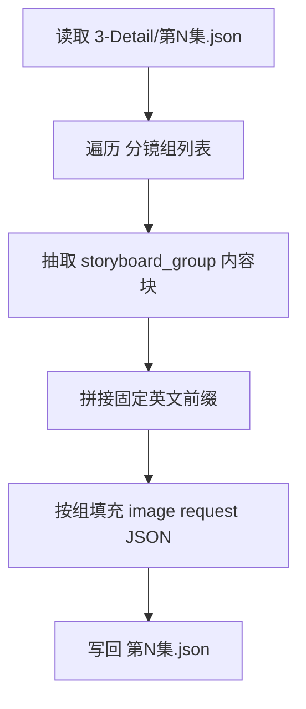
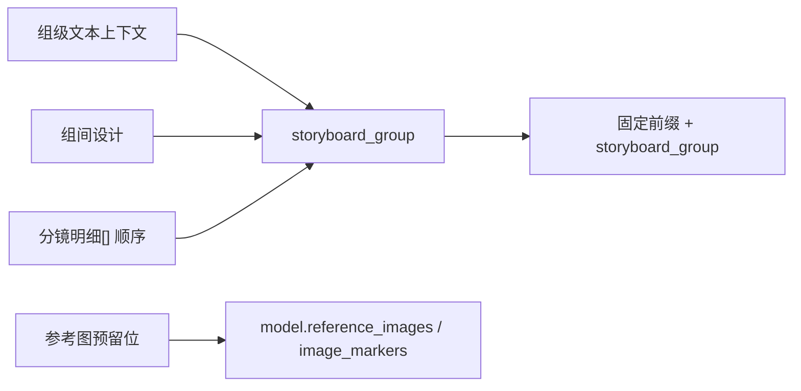

# 5-Image / 分镜故事板

## 概述

`分镜故事板` 是 `5-Image / 1-提示词蒸馏` 下的组级叶子子技能，负责把 `projects/<项目名>/3-Detail/第N集.json` 中符合 `.agents/skills/aigc/_shared/director_episode_output.schema.json` 的 `final_output.main_content.分镜组列表[]`，收口为 **每个分镜组 1 条多格 storyboard 图像请求 JSON**。

交付类型：`内容输出型`

本子技能的唯一规范真源是当前 `SKILL.md`。原分文件载体中的执行流程、字段系统、类型策略与输出契约已全部并入本文件；`CONTEXT.md` 只保留经验层，不再承载第二套规范合同。

当前设计重点不是直接生成图片，而是先把每个分镜组整理成：

1. 共享模板兼容的 `meta`
2. 面向多格故事板的 `prompt_style`
3. 图像生成侧 `model` 参数骨架与参照图预留位
4. 由固定英文前缀与 `storyboard_group` 内容块拼成的 `prompt`
5. 对应的 `prompt_char_count`

其中：

- 上游默认路径固定为 `projects/<项目名>/3-Detail/第N集.json`
- shared schema 固定为 `.agents/skills/aigc/_shared/director_episode_output.schema.json`
- shared JSON 模板固定为 `.agents/skills/aigc/5-Image/_shared/image-generation-input.template.json`
- 当前只输出 `json`，不输出 `.txt`
- `storyboard_group` 内容可以直接使用上游信息，不做文字压缩

## When to Use

- 需要把一个分镜组整理成多格 storyboard 的图像生成请求 JSON。
- 用户说的是“storyboard / 故事板 / 多格分镜”，而不是单帧或漫画页。
- 需要先完成 `1-提示词蒸馏`，后续再进入 `2-一致性处理` 或 `3-图像生成`。

## When Not to Use

- 目标是按单一 `分镜ID` 生成首帧或单帧图，应进入 `分镜帧`。
- 目标是 9:16 漫画单页、气泡文字与漫画页节奏，应进入 `漫画`。
- 上游 `projects/<项目名>/3-Detail/第N集.json` 还没有形成合法 `分镜组列表`，或 shared schema 口径未对齐。

## 子技能边界

### `分镜故事板` 拥有

- 分镜组 -> 图像请求条目的一对一转换合同
- 固定前缀 + `storyboard_group` 的 prompt 组织规则
- 对 `5-Image/_shared` 图像入参模板的局部填充规则
- `json_only / full_trace` 的组级输出模式裁决

### `分镜故事板` 不拥有

- 单帧级输出合同
- 漫画页文字系统与版式规划
- 一致性二次处理与真实图片生成
- 上游镜头事实重写
- 第二套分文件规范载体或私有模板真源

## Canonical Source Governance

- 当前 `SKILL.md` 是本子技能唯一规范真源。
- `CONTEXT.md` 仅承载 Type Map、Repair Playbook、Reusable Heuristics 与 Case Log。
- `.agents/skills/aigc/5-Image/_shared/image-generation-input.template.json` 是共享模板真源；本子技能只做局部填充，不维护平行模板。
- 若未来出现真正可独立治理的专门化角色，应升格为显式父子技能或 subagent 合同，而不是重新拆回旧分文件载体。

## Visual Maps





## Canonical Inputs

- `projects/<项目名>/3-Detail/第N集.json`
- `.agents/skills/aigc/_shared/director_episode_output.schema.json`
- `.agents/skills/aigc/5-Image/_shared/image-generation-input.template.json`

## Canonical Landing

- 子路径根目录：`projects/<项目名>/5-Image/分镜故事板/`
- 单集目录：`projects/<项目名>/5-Image/分镜故事板/第N集/`
- 汇总 JSON：`projects/<项目名>/5-Image/分镜故事板/第N集/第N集.json`
- 汇总清单：`projects/<项目名>/5-Image/分镜故事板/第N集/_manifest.json`（仅当本轮要求 `full_trace` 时）

## 输入合同

### 必需输入

- `projects/<项目名>/3-Detail/第N集.json`
- `.agents/skills/aigc/_shared/director_episode_output.schema.json`
- `.agents/skills/aigc/5-Image/_shared/image-generation-input.template.json`
- `final_output.main_content.分镜组列表[]`

### 推荐输入

- `projects/<项目名>/3-Detail/evidence/` 下相关 sidecar 作为人工可读证据
- `projects/<项目名>/4-Design/` 下的角色、场景、道具参考图

### 输入处理原则

1. 一切组级/镜级事实以上游 `projects/<项目名>/3-Detail/第N集.json` 为准。
2. `3-Detail/evidence/` 下相关 sidecar 若存在，只作为人工可读校对证据，不构成第二真源。
3. `4-Design` 只作为后续参照图槽位来源，不反向修改镜头事实。
4. 当前阶段允许直接使用上游内容，不做压缩；但不得虚构新镜头。

## Mandatory Workflow

1. 读取上层 `.agents/skills/aigc/5-Image/SKILL.md + CONTEXT.md`。
2. 读取 `.agents/skills/aigc/5-Image/1-提示词蒸馏/SKILL.md + CONTEXT.md`。
3. 读取 `projects/<项目名>/3-Detail/第N集.json`，校验其符合 `.agents/skills/aigc/_shared/director_episode_output.schema.json` 的共享字段壳。
4. 从 `final_output.main_content.分镜组列表[]` 遍历每个分镜组，提取：
   - `分镜组ID`
   - `剧本正文`
   - `组间设计.全局风格`
   - `组间设计.类型元素`
   - `组间设计.导演意图`
   - 全部按原顺序排列的 `分镜明细[]`
5. 将上述内容组织为 `storyboard_group` 内容块；内容允许直接使用，不做文字压缩。
6. 以共享模板为骨架填充 `meta + prompt_style + model + prompt + prompt_char_count`；其中 `prompt` 固定为“英文前缀 + storyboard_group”。
7. 如有 `4-Design` 参考资产，则只把它们登记到 `model.reference_images / image_markers` 的预留位；若需人工复核，可回读 `3-Detail/evidence/` 下相关 sidecar。
8. 写入单集 `第N集.json`；仅在任务要求 `full_trace` 时额外输出 `_manifest.json`。

## Prompt Assembly Rules

1. 固定前缀必须逐字保留：

   ```text
   Create a multi-panel storyboard based on the following shot breakdown.
   Add the shot sequence number in the bottom-left corner of each panel (no other text).
   Auto-adapt the panel layout grid based on the total number of shots.
   ```

2. `storyboard_group` 必须紧随其后，不插入额外模板说明。
3. `storyboard_group` 的镜级内容必须保持与上游 `分镜明细[]` 一致的顺序。
4. 若上游内容存在空缺，允许保守留空，不得为凑完整度虚构镜头事实。

## Handoff Rule

- 本子技能的消费单位是分镜组，不下沉为单帧执行面。
- 当前产物默认交给 `5-Image/2-一致性处理` 与 `5-Image/3-图像生成` 继续消费。
- 本子技能本身不负责真实图片生成。

## Output Contract

### 单输出落点

- `projects/<项目名>/5-Image/分镜故事板/第N集/第N集.json`
- `projects/<项目名>/5-Image/分镜故事板/第N集/_manifest.json`（仅当本轮要求 `full_trace` 时）

### 子技能负责填充的 JSON 字段

1. `meta`
2. `prompt_style`
3. `model`
4. `prompt`
5. `prompt_char_count`

### 硬规则

1. `第N集.json` 是 canonical completeness carrier；结构完整性、字段齐全性和下游工具消费能力一律以 JSON 为准。
2. 当前模式只输出 JSON，不输出 `.txt` 派生视图。
3. 每个分镜组在 `第N集.json` 中只生成 1 条请求对象。
4. `prompt` 必须严格由固定前缀开头，并直接拼接 `storyboard_group` 内容块。
5. `storyboard_group` 必须覆盖该分镜组的 `分镜组ID`、`剧本正文`、`组间设计.全局风格`、`组间设计.类型元素`、`组间设计.导演意图` 与全部按原顺序排列的 `分镜明细[]`。
6. `storyboard_group` 的内容允许直接使用上游信息，不做文字压缩，也不虚构补写上游没有的镜头事实。
7. `meta.shot_level` 固定为 `storyboard_group`；`meta.group_id` 与 `meta.source_shot_ids` 必须能完整回链该组。
8. `prompt_style.type` 固定服务多格故事板；`prompt_style.language` 默认标记为 `mixed`，以容纳固定英文前缀与上游原文内容。
9. `model` 必须保持图像侧参数骨架完整；`reference_images` 与 `image_markers` 在缺图时也必须保留空骨架，不得删除。
10. `prompt_char_count` 必须与实际 `prompt` 内容一致。
11. 默认输出模式为 `json_only`；只有用户或父级明确要求时，才额外输出 `_manifest.json`。
12. 禁止把图片落盘当主产物；图片生成与一致性处理属于后续子技能。

### `_manifest.json` 最低要求

1. `episode_id`
2. `source_file`
3. `output_mode`
4. `json_file`
5. `group_count`
6. `groups[].group_id`
7. `groups[].source_shot_ids`
8. `groups[].prompt_char_count`
9. `groups[].has_reference_slots`
10. `groups[].exception_note`

## Execution Summary

- 每个 `分镜组` 只生成 1 条图像请求对象。
- `prompt` 固定由英文前缀与 `storyboard_group` 内容块组成。
- `storyboard_group` 必须覆盖该组的 `剧本正文`、`组间设计` 与全部 `分镜明细[]`。
- 当前只输出 `第N集.json`；后续一致性处理与真实生成由其他子技能继续消费。
- `prompt_style` 独立承载类型、语言和可选字数限制。
- `prompt_char_count` 位于顶层，用于统计和验收。
- `model.reference_images` 保留上传顺序位。
- `model.image_markers` 承担图片 URL、关联主体和 `图1/图2/...` 顺序标记。

## Strategy Summary

- 判定顺序：`shared group list -> storyboard_group 内容完整度 -> 输出模式 -> 共享模板骨架完整度`
- 若 shared schema 无法确认分镜组结构，立即停止并回退上游补齐输入。
- 若 `storyboard_group` 只有部分字段，按保守模式输出已有内容，不虚构缺失字段。
- unknown 默认路由仍按 `json_only` 执行，但必须显式说明哪些字段保守留空。

## Type Strategy Matrix

### 变量登记表

| var_id | 变量层级 | 观测信号 | 状态集合 | 检测方法 | 优先级 |
| --- | --- | --- | --- | --- | --- |
| V-SB-SHEET-01 | 输入 | 分镜组结构是否完整 | `ready/incomplete` | 检查 `分镜组ID/剧本正文/组间设计/分镜明细` | P0 |
| V-SB-SHEET-02 | prompt 内容块 | `storyboard_group` 内容块是否完整 | `ready/partial` | 检查组级字段与镜级顺序是否齐全 | P1 |
| V-SB-SHEET-03 | 输出要求 | 本轮只要 JSON 还是 JSON+manifest | `json_only/full_trace` | 结合用户目标与父级要求 | P1 |

### 情况判定表

| case_id | 触发谓词 | 置信度阈值 | 互斥关系 | 可并发关系 |
| --- | --- | --- | --- | --- |
| C-SB-SHEET-01 | `V-SB-SHEET-01=incomplete` | 1.0 | 互斥全部生成路由 | 无 |
| C-SB-SHEET-02 | `V-SB-SHEET-02=ready` | 0.95 | 互斥 C-SB-SHEET-03 | 可并发 C-SB-SHEET-04 |
| C-SB-SHEET-03 | `V-SB-SHEET-02=partial` | 0.90 | 互斥 C-SB-SHEET-02 | 可并发 C-SB-SHEET-04 |
| C-SB-SHEET-04 | `V-SB-SHEET-03=full_trace` | 0.90 | 无 | 可并发 C-SB-SHEET-02/C-SB-SHEET-03 |

### 策略映射矩阵

| case_id | strategy_id | 执行步骤 | 质量门禁 | fallback_strategy_id | 升级条件 |
| --- | --- | --- | --- | --- | --- |
| C-SB-SHEET-01 | S-SHEET-BACKTRACK | 停止并报告上游缺口 | 不伪造缺失组或镜头事实 | S-SHEET-PAUSE | 上游缺口持续存在 |
| C-SB-SHEET-02 | S-SHEET-MAINLINE | 用完整 `storyboard_group` 填充共享模板 | 固定前缀、组级字段和镜级顺序全部成立 | S-SHEET-PAUSE | 模板字段被局部删改 |
| C-SB-SHEET-03 | S-SHEET-PARTIAL | 保守填充已有内容，不虚构缺失字段 | 输出仍可回链真实上游内容 | S-SHEET-PAUSE | 缺口影响后续生成消费 |
| C-SB-SHEET-04 | S-SHEET-FULL-TRACE | 输出 JSON + manifest | 两文件互相可追溯 | S-SHEET-MAINLINE | 本轮只要求 `json_only` |

## Field Master

| field_id | 输出位置/字段 | 内容要求 | 默认责任 Step | 质量维度 | 失败码 |
| --- | --- | --- | --- | --- | --- |
| FIELD-SB-SHEET-01 | `prompt_style.type / prompt_style.language / prompt_style.char_limit / meta.shot_level / meta.group_id / meta.source_shot_ids` | 以独立 `prompt_style` 声明多格故事板提示词约束，并锁定组级来源与镜头顺序 | S1 | 输入覆盖完整度 | FAIL-SB-SHEET-01 |
| FIELD-SB-SHEET-02 | `prompt / prompt_char_count` | prompt 必须由固定英文前缀与完整 `storyboard_group` 内容块组成，且字数统计位于顶层 | S2-S3 | Prompt 蒸馏稳定性 | FAIL-SB-SHEET-02 |
| FIELD-SB-SHEET-03 | `model.model_version / model.ratio / model.image_size / model.output_format / model.num_images / model.reference_images / model.image_markers` | `model` 必须保持图像侧模板骨架完整；无图时也保留参照槽位 | S4 | 模板兼容性 | FAIL-SB-SHEET-03 |
| FIELD-SB-SHEET-04 | `第N集.json / _manifest.json` | 输出文件可追溯、可继续 handoff 给后续一致性处理与图像生成 | S5 | 输出可消费性 | FAIL-SB-SHEET-04 |

## Thought Pass Map

| step_id | 聚焦字段 | 核心问题 | 生成动作 | 未达标信号 |
| --- | --- | --- | --- | --- |
| S1 | FIELD-SB-SHEET-01 | 当前目标分镜组是谁，组内镜头顺序是否稳定 | 锁定 `prompt_style + shot_level + group_id + source_shot_ids` | 组定位冲突或镜头顺序缺失 |
| S2 | FIELD-SB-SHEET-02 | `storyboard_group` 需要覆盖哪些上游字段 | 提取 `剧本正文 + 组间设计 + 全部 分镜明细[]` | 漏掉组级字段或镜级字段 |
| S3 | FIELD-SB-SHEET-02 | prompt 是否严格满足“固定前缀 + storyboard_group” | 逐字保留固定前缀并拼接内容块 | 前缀缺失、顺序错误或额外插入说明 |
| S4 | FIELD-SB-SHEET-03 | 图像请求模板字段是否完整且不虚构参照图 | 保留图像侧参数骨架与参照图槽位 | 删字段、乱序或擅自补图 |
| S5 | FIELD-SB-SHEET-04 | 输出是否已形成可 handoff 的单集 JSON | 写 `第N集.json`，按需补 `_manifest.json` | 仍把图片落盘当主产物或缺少 JSON |

## Pass Table

| field_id | Pass Standard | Fail Code | Rework Entry |
| --- | --- | --- | --- |
| FIELD-SB-SHEET-01 | `prompt_style.type / meta.shot_level` 合法，且 `group_id` 与有序 `source_shot_ids` 同时成立 | FAIL-SB-SHEET-01 | S1 |
| FIELD-SB-SHEET-02 | prompt 满足固定前缀、完整 `storyboard_group` 与顶层字数统计 | FAIL-SB-SHEET-02 | S2-S3 |
| FIELD-SB-SHEET-03 | 图像侧 `model` 骨架完整，`reference_images` 与 `image_markers` 保持共享模板兼容 | FAIL-SB-SHEET-03 | S4 |
| FIELD-SB-SHEET-04 | `第N集.json` 可追溯可 handoff；若要求 `full_trace`，则 `_manifest.json` 同步成立 | FAIL-SB-SHEET-04 | S5 |

## Root-Cause Execution Contract (Mandatory)

当出现以下症状时，必须先修本子技能合同：

- 仍把图片落盘当主产物，而不是组级图像请求 JSON
- prompt 没有以固定英文前缀开头
- `storyboard_group` 没覆盖完整组级与镜级信息
- 共享模板字段被删改，尤其是 `reference_images` 或 `image_markers`
- 输出规则又被拆回第二套局部规范载体

必经链路：

`Symptom -> Direct Technical Cause -> Rule Source -> Meta Rule Source -> Fix Landing Points`

优先检查：

- `Rule Source`
  - `.agents/skills/aigc/5-Image/1-提示词蒸馏/分镜故事板/SKILL.md`
  - `.agents/skills/aigc/5-Image/1-提示词蒸馏/分镜故事板/CONTEXT.md`
- `Meta Rule Source`
  - `.agents/skills/aigc/5-Image/1-提示词蒸馏/SKILL.md`
  - `.agents/skills/aigc/5-Image/SKILL.md`
  - `.agents/skills/aigc/SKILL.md`
  - 根 `AGENTS.md`

对用户的闭环输出固定包含：

1. 根因位置
2. 立即修复
3. 系统预防修复

## SKILL / CONTEXT 分工（Mandatory）

- `SKILL.md` 锁定输入、落点、workflow、prompt、类型策略、字段系统与输出门禁。
- `CONTEXT.md` 沉淀本层常见误判、修复顺序、复用 heuristic 与里程碑案例。
- 若经验已稳定，不再下沉到 `references`，而是直接晋升回当前 `SKILL.md` 单文件真源。

## Context Preload (Mandatory)

- 执行前先加载 `.agents/skills/aigc/5-Image/SKILL.md + CONTEXT.md`。
- 再加载 `.agents/skills/aigc/5-Image/1-提示词蒸馏/SKILL.md + CONTEXT.md`。
- 最后加载本 `SKILL.md + CONTEXT.md`。
- 建议同时读取 `.agents/skills/aigc/5-Image/_shared/image-generation-input.template.json`。
- 优先级遵循：用户显式请求 > 根 `AGENTS.md` > `.agents/skills/aigc/SKILL.md` > `.agents/skills/aigc/5-Image/SKILL.md` > `.agents/skills/aigc/5-Image/1-提示词蒸馏/SKILL.md` > 本 `SKILL.md` > 各级 `CONTEXT.md`。
