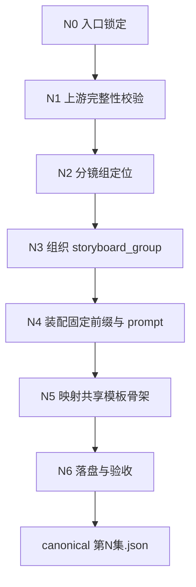
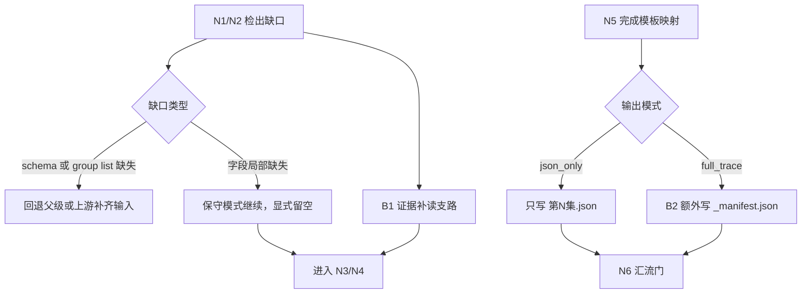
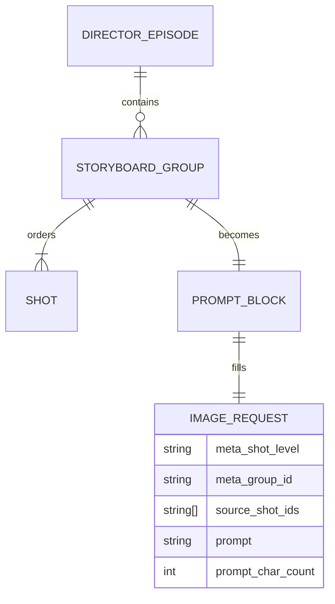
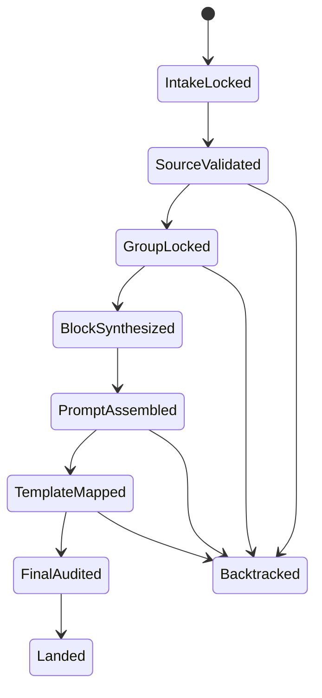

# 5-Image / 1-提示词蒸馏 / 分镜故事板

## Context Loading Contract

- 每次调用本技能时，必须同时加载同目录 `CONTEXT.md` 作为预加载上下文。
- 若同目录 `CONTEXT.md` 缺失，应先补齐最小知识库骨架，或向用户明确报告阻塞；不得在未检查该上下文的情况下执行技能。
- 冲突优先级：用户显式请求 > 仓库/全局 `AGENTS.md` > 本 `SKILL.md` > 同目录 `CONTEXT.md`。

## Mode Selection

- 当前任务属于 `既有优化`：保留现有 `分镜组 -> 多格 storyboard 图像请求 JSON` 的业务口径、字段骨架、共享模板、落盘路径与 handoff 责任，只把合同重构为知行合一单文件思行网络。
- `复杂链路的骨架 / 细则分层` 固定为 `false`：本技能不再把复杂节点细则下沉到 `references/`，所有规范性节点、回退门、字段映射与验收规则都保留在当前 `SKILL.md`。
- 本技能仍然是叶子执行单元，不引入本地 `subagent team`、`team.md` 或第二条并行总线。

## 概述

`分镜故事板` 是 `5-Image / 1-提示词蒸馏` 下的组级叶子子技能，负责把 `projects/aigc/<项目名>/3-Detail/第N集.json` 中符合 `.agents/skills/aigc/_shared/director_episode_output.schema.json` 的 `final_output.main_content.分镜组列表[]`，收口为 **每个分镜组 1 条多格 storyboard 图像请求 JSON**。

本技能只负责图像请求 JSON 蒸馏，不负责真实图片生成，也不改写上游镜头事实。

当前 canonical business output 固定为：

1. 共享模板兼容的 `meta`
2. 面向多格 storyboard 的 `prompt_style`
3. 图像生成侧 `model` 参数骨架与参照图预留位
4. 由固定英文前缀与 `storyboard_group` 内容块拼成的 `prompt`
5. 对应的 `prompt_char_count`

固定边界：

- 上游第一事实源固定为 `projects/aigc/<项目名>/3-Detail/第N集.json`
- shared schema 固定为 `.agents/skills/aigc/_shared/director_episode_output.schema.json`
- shared JSON 模板固定为 `.agents/skills/aigc/5-Image/_shared/image-generation-input.template.json`
- 默认业务输出模式固定为 `json_only`
- `full_trace` 只额外补 `_manifest.json`，不污染 canonical JSON
- `思考过程` 属于执行闭环证据层：默认留在调用回复中；仅在 `full_trace` 时允许浓缩到 `_manifest.json` 的说明字段或调用侧审计摘要，不得反向挤入业务真源字段

## When to Use

- 需要把一个分镜组整理成多格 storyboard 的图像生成请求 JSON。
- 用户说的是“storyboard / 故事板 / 多格分镜 / 一组多格图像请求”，而不是单帧或漫画页。
- 当前任务位于 `1-提示词蒸馏`，后续还要交给 `2-参照引用` 或 `3-图像生成`。
- 父级 `1-提示词蒸馏` 已经把对象裁决到组级，多对象混合问题已经被拆开。

## When Not to Use

- 目标是按单一 `分镜ID` 生成首帧或单帧图，应进入 `分镜帧`。
- 目标是 9:16 漫画单页、气泡文字与漫画页节奏，应进入 `漫画`。
- 上游 `3-Detail/第N集.json` 还没有形成合法 `分镜组列表[]`。
- 当前任务想直接出图，而不是先产出请求 JSON。

## Truth Ownership

### `分镜故事板` 拥有

- 分镜组 -> 图像请求条目的一对一转换合同
- 固定英文前缀 + `storyboard_group` 的 prompt 组织规则
- 对 `5-Image/_shared` 图像入参模板的局部填充规则
- `json_only / full_trace` 的组级输出模式裁决
- 组级蒸馏所需的思维·执行节点、回退门和汇流门

### `分镜故事板` 不拥有

- 单帧级输出合同
- 漫画页文字系统与版式规划
- 一致性二次处理与真实图片生成
- 上游镜头事实重写
- 第二套分文件规范载体、私有模板真源或隐藏思维链文档

## Total Input Contract

| 输入槽位 | 固定要求 |
| --- | --- |
| `business_goal` | 把一个分镜组稳定蒸馏成后续可消费的多格 storyboard 图像请求 JSON |
| `business_object` | `final_output.main_content.分镜组列表[]` 中的单个可回链分镜组 |
| `task_goal` | 生成 `meta + prompt_style + model + prompt + prompt_char_count` 并写入单集 `第N集.json` |
| `constraints` | 不压缩镜头事实、不虚构信息、不直接生成图片、不引入第二真源、不破坏共享模板骨架 |
| `non_goals` | 不做对象路由、不做单帧蒸馏、不做漫画页蒸馏、不做一致性处理、不做模型提交 |
| `success_criteria` | 分镜组可唯一回链；`storyboard_group` 覆盖完整；固定前缀逐字保留；共享模板骨架完整；输出可 handoff |
| `evidence_sources` | `3-Detail/第N集.json`、shared schema、shared image template、可选 `3-Detail/水月/第N集.field-patch.json`、`3-Detail/镜花/第N集.field-patch.json` 与 `4-Design/` |
| `canonical_output` | `projects/aigc/<项目名>/5-Image/分镜故事板/第N集/第N集.json` |

### 强制加载顺序

1. 根 `.agents/skills/aigc/SKILL.md`
2. 阶段父级 `.agents/skills/aigc/5-Image/SKILL.md + CONTEXT.md`
3. 父级 `.agents/skills/aigc/5-Image/1-提示词蒸馏/SKILL.md + CONTEXT.md`
4. 本 `SKILL.md + CONTEXT.md`
5. `.agents/skills/aigc/5-Image/_shared/image-generation-input.template.json`

说明：

- 图像阶段父级真源固定为 `.agents/skills/aigc/5-Image/SKILL.md`；本技能不得绕过该阶段根直接冒充 stage 入口。
- `3-Detail/水月/第N集.field-patch.json` 与 `3-Detail/镜花/第N集.field-patch.json` 只作为补证或人工核对入口，不能覆盖 `3-Detail/第N集.json` 的第一结构化真源地位。

## Canonical Inputs

- `projects/aigc/<项目名>/3-Detail/第N集.json`
- `.agents/skills/aigc/_shared/director_episode_output.schema.json`
- `.agents/skills/aigc/5-Image/_shared/image-generation-input.template.json`

### 推荐补充输入

- `projects/aigc/<项目名>/3-Detail/水月/第N集.field-patch.json`：仅在核对 `出场角色及穿搭 / factual` 缺口时读取
- `projects/aigc/<项目名>/3-Detail/镜花/第N集.field-patch.json`：仅在核对 shot skeleton 或 cinematic 缺口时读取
- `projects/aigc/<项目名>/4-Design/` 下角色、场景、道具参考：仅登记到 `model.reference_images / image_markers`

### Readiness Gate

进入组级蒸馏前，必须确认：

1. `metadata.document_phase in {detail_in_progress, ready}`
2. 目标组具备 `组间设计.出场角色及穿搭`
3. 目标组的 `分镜明细[]` 至少能回链：
   - `分镜ID`
   - `角色表现`
   - `运动表现`
   - `氛围表现`
   - `视觉强化`
   - `分镜构图`
   - `摄影美学`
   - `运镜手法`
   - `转场特效`

若目标组仍处于过渡项目，可短期回退读取 `角色背景面 / 角色站位走位 / 道具及状态 / 分镜表现`，但它们只允许作为 compatibility projection，不得重新升格为第一真相。

## Canonical Landing

- 子路径根目录：`projects/aigc/<项目名>/5-Image/分镜故事板/`
- 单集目录：`projects/aigc/<项目名>/5-Image/分镜故事板/第N集/`
- 汇总 JSON：`projects/aigc/<项目名>/5-Image/分镜故事板/第N集/第N集.json`
- 汇总清单：`projects/aigc/<项目名>/5-Image/分镜故事板/第N集/_manifest.json`（仅当本轮要求 `full_trace` 时）

## Business Requirement Analysis Contract

### 业务复杂度判断

- 主复杂度不在对象路由，而在 **组边界锁定 -> 组级信息覆盖 -> prompt 装配 -> 模板兼容 -> 单次落盘可交接**。
- 该任务不适合做假并行：核心业务依赖是强顺序链，只有证据补充与 `full_trace` sidecar 是条件支路。
- 因此采用 **混合型知行网络**：
  - 主干串行：保证每一步都建立在上一层确定事实之上
  - 条件侧支：只处理可选证据读取与可选 `_manifest.json`
  - 汇流门：统一在落盘前检查 prompt、模板骨架和输出模式是否同时成立

### 选择该拓扑而不是其他拓扑的理由

- 不采用纯线性 checklist：因为本技能存在 `json_only / full_trace`、证据补读、缺口回退等条件路由，不能把它们伪装成一条无分叉路径。
- 不采用网状并行：因为 `storyboard_group`、`prompt`、`model`、落盘之间有严格前后依赖，并行只会制造半成品竞争。
- 不采用多智能体：因为主要矛盾不是角色隔离，而是单对象蒸馏的节点门禁和口径收束。

## Topology Contract

- 主干节点固定为：`N0 入口锁定 -> N1 上游完整性校验 -> N2 分镜组定位 -> N3 storyboard_group 组织 -> N4 prompt 装配 -> N5 模板映射 -> N6 落盘与验收`
- 条件支路只有两类：
  - `B1 证据补读支路`：仅在 `3-Detail/第N集.json` 组级或镜级 canonical 字段不足以支撑人工核对时，按需补读 `水月 / 镜花` sidecar
  - `B2 full_trace 支路`：仅在用户或父级明确要求时输出 `_manifest.json`
- 任一失败都必须回退到具体节点，而不是跳过或整盘重来
- 只有 `N6` 通过汇流门，才允许宣布完成

## Visual Maps









## Thinking-Action Node Contract

| node_id | objective | inputs | actions | evidence | route_out | gate |
| --- | --- | --- | --- | --- | --- | --- |
| `N0-intake-lock` | 锁定本轮就是“组级 storyboard 请求 JSON 蒸馏” | 用户意图、父级路由结论、本技能合同 | 冻结对象类型、输出模式默认值、非目标 | 路由结论、对象边界说明 | `success -> N1`；`wrong_object -> 回父级重路由` | 未锁定对象不得进入主干 |
| `N1-source-validate` | 校验 shared schema 与上游 episode JSON 是否可消费 | `3-Detail/第N集.json`、shared schema | 检查 `document_phase`、结构壳、`分镜组列表[]`、关键字段存在性 | 输入完整性判定、缺口说明 | `ready -> N2`；`partial -> B1/N2`；`broken -> 停止` | 上游结构不成立不得继续 |
| `N2-group-lock` | 锁定当前要蒸馏的分镜组与镜头顺序 | `分镜组列表[]`、父级或用户提供的组锚点 | 定位目标组、收集 `source_shot_ids`、确认顺序 | 目标 `group_id`、有序 `source_shot_ids` | `success -> N3`；`ambiguous -> 回父级/用户澄清` | 组定位唯一且镜头顺序稳定 |
| `N3-block-synthesize` | 组织完整 `storyboard_group` 内容块 | 目标组、可选 evidence sidecar | 提取组级字段与全部 `分镜明细[]`，必要时保守留空 | `storyboard_group` 草稿、字段覆盖检查 | `complete -> N4`；`partial -> N4`；`missing_core -> 回 N1/N2` | 核心组字段必须可回链 |
| `N4-prompt-assemble` | 生成固定前缀 + `storyboard_group` 的 prompt | 固定英文前缀、内容块 | 逐字保留前缀、直接拼接、统计字数 | `prompt`、`prompt_char_count` | `success -> N5`；`prefix_drift -> 回 N4` | prompt 结构成立 |
| `N5-template-map` | 将 prompt 与组信息映射到共享模板骨架 | shared image template、prompt、组信息、可选 design refs | 填充 `meta/prompt_style/model`，登记参照图槽位 | 单条 image request 对象 | `success -> N6`；`template_drift -> 回 N5` | 模板骨架完整且兼容 |
| `N6-land-audit` | 形成唯一 canonical output 并通过汇流门 | image request 对象、输出模式 | 写 `第N集.json`，按需补 `_manifest.json`，执行最终验收 | 落盘路径、审计结果、handoff 结论 | `pass -> 完成`；`fail -> 回具体失败节点` | 只有本节点可以宣告完成 |

## Node Playbook

### N0 `intake-lock`

#### 着手面

- 当前对象是不是组级 storyboard，而非单帧或漫画页
- 本轮输出是不是请求 JSON，而非图片
- `json_only / full_trace` 是否已有明确指令
- 父级 `1-提示词蒸馏` 是否已经完成唯一路由

#### 一步一步

1. 先读取父级路由结论或用户显式指定，确认当前对象是“分镜组”。
2. 若用户只说“做画面提示词蒸馏”，且父级未另行裁决，则继承父级默认入口 `分镜故事板`。
3. 锁定默认输出模式为 `json_only`；只有用户或父级明确要求时才改成 `full_trace`。
4. 显式写明非目标：不直接出图、不改写上游事实、不处理单帧、不处理漫画。

#### 回退门

- 若对象其实是单帧或漫画页，立即回父级重路由。
- 若输出期望是图片或视频，停止并指出本技能只负责请求 JSON。

### N1 `source-validate`

#### 着手面

- `3-Detail/第N集.json` 是否符合 shared schema 的三段式壳
- `metadata.document_phase` 是否已到 `detail_in_progress | ready`
- `final_output.main_content.分镜组列表[]` 是否存在
- 组内是否包含 `分镜组ID / 剧本正文 / 组间设计 / 分镜切换 / 分镜明细[]`
- 缺口是“全局缺口”还是“局部缺口”

#### 一步一步

1. 读取 `projects/aigc/<项目名>/3-Detail/第N集.json`。
2. 对照 `.agents/skills/aigc/_shared/director_episode_output.schema.json` 检查 shared 壳是否成立。
3. 检查 `分镜组列表[]` 是否存在且至少含一个可消费组。
4. 检查 `metadata.document_phase` 是否处于 `detail_in_progress | ready`；若不是，直接停止并回报上游阶段缺口。
5. 将缺口拆成两类：
   - 全局缺口：`分镜组列表[]` 缺失、shared 壳破坏
   - 局部缺口：`出场角色及穿搭` 或镜级 canonical 字段局部缺失，但组结构仍成立
6. 全局缺口直接停止；局部缺口可带着保守留空标记继续。

#### 条件支路 `B1`

- 仅当局部缺口影响人工理解，但不影响组结构时，按需补读 `3-Detail/水月/第N集.field-patch.json` 与 `3-Detail/镜花/第N集.field-patch.json`。
- 该支路只补“解释能力”，不改写第一事实源。

### N2 `group-lock`

#### 着手面

- 目标组是谁
- 目标组是否唯一
- 组内镜头顺序是否稳定
- `source_shot_ids` 是否可完整回链

#### 一步一步

1. 若父级或用户指定了 `group_id`，优先按该锚点定位。
2. 若没有显式锚点，则以当前任务上下文默认消费“本轮命中分镜组”。
3. 读取目标组的 `分镜明细[]`，按原顺序抽取 `source_shot_ids`。
4. 检查是否存在镜头顺序冲突、重复 `group_id`、空 `分镜明细[]`。
5. 只有在组唯一且顺序稳定时，才允许进入 `N3`。

#### 回退门

- 组不唯一：回父级或用户澄清，不允许猜测。
- 组存在但镜头顺序损坏：回 `N1` 作为输入缺口处理。

### N3 `block-synthesize`

#### 着手面

- `storyboard_group` 要覆盖哪些组级字段
- `分镜明细[]` 要如何保留原顺序
- 局部缺失字段如何保守留空
- 是否需要附带人工核对证据

#### 一步一步

1. 固定抽取以下组级字段：
   - `分镜组ID`
   - `剧本正文`
   - `组间设计.全局风格`
   - `组间设计.类型元素`
   - `组间设计.导演意图`
   - `组间设计.出场角色及穿搭`
2. 按上游原顺序拼入全部 `分镜明细[]`，并保留 `角色背景面 / 角色站位走位 / 道具及状态 / 分镜表现`。
3. 严禁压缩、重写或脑补镜头事实；只允许做结构化整理。
4. 若某组级字段为空，但镜头顺序和组边界仍成立，则显式保守留空。
5. 形成 `storyboard_group` 内容块，并做字段覆盖检查。

#### 通过标准

- 组边界可回链
- 全部镜头顺序完整保留
- 缺失字段已显式保守留空

### N4 `prompt-assemble`

#### 着手面

- 固定前缀是否逐字保留
- `storyboard_group` 是否直接紧随其后
- 是否混入了额外模板说明
- 字数统计是否与 prompt 实值一致

#### 固定前缀

```text
Create a multi-panel storyboard based on the following shot breakdown.
Add the shot sequence number in the bottom-left corner of each panel (no other text).
Auto-adapt the panel layout grid based on the total number of shots.
```

#### 一步一步

1. 逐字放入固定前缀。
2. 前缀之后直接拼接 `storyboard_group`，中间不得插入其他说明。
3. 检查 `storyboard_group` 内镜头顺序仍与上游一致。
4. 统计完整 `prompt` 字符数并写入 `prompt_char_count`。
5. 若前缀丢失、顺序错乱、插入了额外说明，直接回到本节点重做。

### N5 `template-map`

#### 着手面

- `meta` 是否锁定组级来源
- `prompt_style` 是否服务多格 storyboard
- `model` 是否保留完整骨架
- 参考图是否只登记槽位而不伪造内容

#### 一步一步

1. 读取 `.agents/skills/aigc/5-Image/_shared/image-generation-input.template.json`。
2. 填充 `meta.shot_level=storyboard_group`、`meta.group_id`、`meta.source_shot_ids`。
3. 填充 `prompt_style.type`、`prompt_style.language`、可选 `char_limit`。
4. 写入 `prompt` 与 `prompt_char_count`。
5. 保持 `model.model_version / ratio / image_size / output_format / num_images / reference_images / image_markers` 骨架完整。
6. 若有 `4-Design` 参考资产，只登记到 `reference_images / image_markers`，不改写镜头事实。
7. 若缺图，也必须保留空槽位，不得删除字段。

### N6 `land-audit`

#### 着手面

- `第N集.json` 是否仍是唯一业务真源
- `full_trace` 是否需要 `_manifest.json`
- handoff 给下游是否成立
- 失败应回退到哪个具体节点

#### 一步一步

1. 将每个分镜组的单条请求对象写入 `projects/aigc/<项目名>/5-Image/分镜故事板/第N集/第N集.json`。
2. 若模式是 `full_trace`，额外生成 `_manifest.json`，用于承载可追溯摘要与思考过程浓缩说明。
3. 执行最终汇流检查：
   - prompt 结构正确
   - 模板骨架完整
   - 输出模式与落盘文件一致
   - `meta.group_id / source_shot_ids` 可回链
4. 只有全部成立，才允许宣布完成并交接给下一阶段。

## Mandatory Workflow

1. 读取根 `aigc` 与父级 `1-提示词蒸馏` 合同，锁定本轮已命中 `分镜故事板`。
2. 执行 `N0`，冻结对象边界、非目标和默认输出模式。
3. 执行 `N1`，检查 `3-Detail/第N集.json` 与 shared schema 的结构完整性。
4. 执行 `N2`，锁定唯一目标分镜组与其有序 `source_shot_ids`。
5. 执行 `N3`，整理 `storyboard_group` 内容块，必要时通过 `B1` 补读证据。
6. 执行 `N4`，用固定英文前缀装配 `prompt` 并计算 `prompt_char_count`。
7. 执行 `N5`，把组信息和 prompt 映射到 shared image template 骨架。
8. 执行 `N6`，写 `第N集.json`；若要求 `full_trace`，走 `B2` 额外输出 `_manifest.json`。
9. 通过汇流门后，把 handoff 关系明确交给 `2-参照引用` 或 `3-图像生成`。

## Convergence Contract

### 允许汇流的前提

- `N2` 已锁定唯一目标组
- `N3` 已形成可回链的 `storyboard_group`
- `N4` 的 prompt 符合“固定前缀 + 内容块”
- `N5` 的 shared template 骨架完整
- `N6` 的落盘文件与输出模式一致

### 必须回退的条件

- 上游组结构不存在：回退到父级或更上游输入补齐
- `group_id` 冲突或顺序不稳定：回退到 `N2`
- `storyboard_group` 漏掉核心字段：回退到 `N3`
- prompt 前缀漂移：回退到 `N4`
- shared template 字段被删改：回退到 `N5`
- `第N集.json` 与 `_manifest.json` 不可追溯：回退到 `N6`

## One-Shot Output Contract

### 唯一业务输出

- `projects/aigc/<项目名>/5-Image/分镜故事板/第N集/第N集.json`

### 条件侧车

- `projects/aigc/<项目名>/5-Image/分镜故事板/第N集/_manifest.json`（仅当 `full_trace`）

### 只输出什么

1. `meta`
2. `prompt_style`
3. `model`
4. `prompt`
5. `prompt_char_count`

### 不输出什么

- 图片文件
- `.txt` prompt 派生视图
- 第二套私有模板
- 平行业务真源

### 思考过程承载规则

- 默认 `json_only`：思考过程以调用侧执行摘要承载，不写入 canonical JSON。
- `full_trace`：允许把节点路由摘要、缺口说明和汇流依据压缩到 `_manifest.json` 或调用侧审计说明，但不得写成长篇草稿。

## Output Contract

### 硬规则

1. 每个分镜组在 `第N集.json` 中只生成 1 条请求对象。
2. `prompt` 必须严格由固定英文前缀开头，并直接拼接 `storyboard_group`。
3. `storyboard_group` 必须覆盖该分镜组的 `分镜组ID`、`剧本正文`、`组间设计.全局风格`、`组间设计.类型元素`、`组间设计.导演意图`、`组间设计.出场角色及穿搭` 与全部按原顺序排列的 `分镜明细[]`；镜级至少保留 `角色背景面 / 角色站位走位 / 道具及状态 / 分镜表现`。
4. `storyboard_group` 的内容允许直接使用上游信息，不做文字压缩，也不虚构补写上游没有的镜头事实。
5. `meta.shot_level` 固定为 `storyboard_group`；`meta.group_id` 与 `meta.source_shot_ids` 必须能完整回链该组。
6. `prompt_style.type` 固定服务多格故事板；`prompt_style.language` 默认标记为 `mixed`。
7. `model` 必须保持图像侧参数骨架完整；`reference_images` 与 `image_markers` 在缺图时也必须保留空骨架。
8. `prompt_char_count` 必须与实际 `prompt` 内容一致。
9. 默认输出模式为 `json_only`；只有用户或父级明确要求时，才额外输出 `_manifest.json`。
10. 图片参照绑定与真实生成属于后续子技能，本技能不得越权执行。

### `_manifest.json` 最低要求

1. `episode_id`
2. `source_file`
3. `output_mode`
4. `json_file`
5. `group_count`
6. `groups[].group_id`
7. `groups[].source_shot_ids`
8. `groups[].prompt_char_count`
9. `groups[].has_reference_slots`
10. `groups[].exception_note`

### 可选补充字段

- `groups[].thinking_process_summary`
- `groups[].backtrack_note`

## Handoff Contract

- 本技能的消费单位是分镜组，不下沉为单帧执行面。
- 当前产物默认先交给 `5-Image/2-参照引用`；若明确 `prompt_only`，也可直接交给 `5-Image/3-图像生成`。
- 本技能本身不负责真实图片生成。

## Type Strategy Matrix

### 变量登记表

| var_id | 变量层级 | 观测信号 | 状态集合 | 检测方法 | 优先级 |
| --- | --- | --- | --- | --- | --- |
| V-SB-SHEET-01 | 输入 | 分镜组结构是否完整 | `ready/incomplete` | 检查 `分镜组ID/剧本正文/组间设计/分镜明细` | P0 |
| V-SB-SHEET-02 | prompt 内容块 | `storyboard_group` 内容块是否完整 | `ready/partial` | 检查组级字段与镜级顺序是否齐全 | P1 |
| V-SB-SHEET-03 | 输出要求 | 本轮只要 JSON 还是 JSON+manifest | `json_only/full_trace` | 结合用户目标与父级要求 | P1 |
| V-SB-SHEET-04 | 模板骨架 | shared image template 是否完整 | `stable/drifted` | 检查 `meta/prompt_style/model` 槽位 | P0 |

### 情况判定表

| case_id | 触发谓词 | 置信度阈值 | 互斥关系 | 可并发关系 |
| --- | --- | --- | --- | --- |
| C-SB-SHEET-01 | `V-SB-SHEET-01=incomplete` | 1.0 | 互斥全部生成路由 | 无 |
| C-SB-SHEET-02 | `V-SB-SHEET-02=ready` | 0.95 | 互斥 C-SB-SHEET-03 | 可并发 C-SB-SHEET-04 |
| C-SB-SHEET-03 | `V-SB-SHEET-02=partial` | 0.90 | 互斥 C-SB-SHEET-02 | 可并发 C-SB-SHEET-04 |
| C-SB-SHEET-04 | `V-SB-SHEET-03=full_trace` | 0.90 | 无 | 可并发 C-SB-SHEET-02/C-SB-SHEET-03 |
| C-SB-SHEET-05 | `V-SB-SHEET-04=drifted` | 1.0 | 互斥全部落盘路由 | 无 |

### 策略映射矩阵

| case_id | strategy_id | 执行步骤 | 质量门禁 | fallback_strategy_id | 升级条件 |
| --- | --- | --- | --- | --- | --- |
| C-SB-SHEET-01 | S-SHEET-BACKTRACK | 停止并报告上游缺口 | 不伪造缺失组或镜头事实 | S-SHEET-PAUSE | 上游缺口持续存在 |
| C-SB-SHEET-02 | S-SHEET-MAINLINE | 用完整 `storyboard_group` 填充共享模板 | 固定前缀、组级字段和镜级顺序全部成立 | S-SHEET-PAUSE | 模板字段被局部删改 |
| C-SB-SHEET-03 | S-SHEET-PARTIAL | 保守填充已有内容，不虚构缺失字段 | 输出仍可回链真实上游内容 | S-SHEET-PAUSE | 缺口影响后续生成消费 |
| C-SB-SHEET-04 | S-SHEET-FULL-TRACE | 输出 JSON + manifest | 两文件互相可追溯 | S-SHEET-MAINLINE | 本轮只要求 `json_only` |
| C-SB-SHEET-05 | S-SHEET-TEMPLATE-REPAIR | 恢复共享模板骨架后再落盘 | `model/reference_images/image_markers` 不得缺槽位 | S-SHEET-PAUSE | 模板真源持续漂移 |

## Field Master

| field_id | 输出位置/字段 | 内容要求 | 默认责任 Node | 质量维度 | 失败码 |
| --- | --- | --- | --- | --- | --- |
| FIELD-SB-SHEET-01 | `prompt_style.type / prompt_style.language / prompt_style.char_limit / meta.shot_level / meta.group_id / meta.source_shot_ids` | 以独立 `prompt_style` 声明多格故事板提示词约束，并锁定组级来源与镜头顺序 | N2-N5 | 输入覆盖完整度 | FAIL-SB-SHEET-01 |
| FIELD-SB-SHEET-02 | `prompt / prompt_char_count` | prompt 必须由固定英文前缀与完整 `storyboard_group` 内容块组成，且字数统计位于顶层 | N3-N4 | Prompt 蒸馏稳定性 | FAIL-SB-SHEET-02 |
| FIELD-SB-SHEET-03 | `model.model_version / model.ratio / model.image_size / model.output_format / model.num_images / model.reference_images / model.image_markers` | `model` 必须保持图像侧模板骨架完整；无图时也保留参照槽位 | N5 | 模板兼容性 | FAIL-SB-SHEET-03 |
| FIELD-SB-SHEET-04 | `第N集.json / _manifest.json` | 输出文件可追溯、可继续 handoff 给后续一致性处理与图像生成 | N6 | 输出可消费性 | FAIL-SB-SHEET-04 |

## Thought Pass Map

| step_id | 聚焦字段 | 核心问题 | 生成动作 | 未达标信号 |
| --- | --- | --- | --- | --- |
| N0 | 输入边界 | 当前任务是不是组级 storyboard JSON 蒸馏 | 锁定对象、输出模式与非目标 | 对象混判、输出目标漂移 |
| N1 | 上游输入 | `3-Detail/第N集.json` 与 shared schema 是否可消费 | 校验 shared 壳与组列表完整性 | 组列表缺失、schema 壳破坏 |
| N2 | FIELD-SB-SHEET-01 | 当前目标分镜组是谁，组内镜头顺序是否稳定 | 锁定 `group_id + source_shot_ids` | 组定位冲突或镜头顺序缺失 |
| N3 | FIELD-SB-SHEET-02 | `storyboard_group` 需要覆盖哪些上游字段 | 提取 `剧本正文 + 组间设计 + 全部 分镜明细[]` | 漏掉组级字段或镜级字段 |
| N4 | FIELD-SB-SHEET-02 | prompt 是否严格满足“固定前缀 + storyboard_group” | 逐字保留固定前缀并拼接内容块 | 前缀缺失、顺序错误或额外插入说明 |
| N5 | FIELD-SB-SHEET-01/FIELD-SB-SHEET-03 | 图像请求模板字段是否完整且不虚构参照图 | 保留图像侧参数骨架与参照图槽位 | 删字段、乱序或擅自补图 |
| N6 | FIELD-SB-SHEET-04 | 输出是否已形成可 handoff 的单集 JSON | 写 `第N集.json`，按需补 `_manifest.json` 并执行审计 | 仍把图片落盘当主产物或缺少 JSON |

## Pass Table

| field_id | Pass Standard | Fail Code | Rework Entry |
| --- | --- | --- | --- |
| FIELD-SB-SHEET-01 | `prompt_style.type / meta.shot_level` 合法，且 `group_id` 与有序 `source_shot_ids` 同时成立 | FAIL-SB-SHEET-01 | N2-N5 |
| FIELD-SB-SHEET-02 | prompt 满足固定前缀、完整 `storyboard_group` 与顶层字数统计 | FAIL-SB-SHEET-02 | N3-N4 |
| FIELD-SB-SHEET-03 | 图像侧 `model` 骨架完整，`reference_images` 与 `image_markers` 保持共享模板兼容 | FAIL-SB-SHEET-03 | N5 |
| FIELD-SB-SHEET-04 | `第N集.json` 可追溯可 handoff；若要求 `full_trace`，则 `_manifest.json` 同步成立 | FAIL-SB-SHEET-04 | N6 |

## Audit Contract

### 质量评估面

- `contract_compliance`：是否遵守组级输入、固定前缀、共享模板与输出模式约束
- `input_coverage`：是否完整覆盖组级字段与镜级顺序
- `prompt_integrity`：是否满足“固定前缀 + storyboard_group”
- `template_compatibility`：是否与共享模板保持兼容
- `handoff_readiness`：下游是否可直接继续消费 `第N集.json`

### 用户闭环

若失败，必须返回：

1. 根因位置
2. 立即修复
3. 系统预防修复

## Root-Cause Execution Contract (Mandatory)

当出现以下症状时，必须先修本子技能合同：

- 仍把图片落盘当主产物，而不是组级图像请求 JSON
- prompt 没有以固定英文前缀开头
- `storyboard_group` 没覆盖完整组级与镜级信息
- 共享模板字段被删改，尤其是 `reference_images` 或 `image_markers`
- 输出规则又被拆回第二套局部规范载体
- 仍绕过 `.agents/skills/aigc/5-Image/SKILL.md`，把本叶子误当成阶段入口
- 节点没有 `route_out / gate`，导致做完局部动作却无法结案

必经链路：

`Symptom -> Direct Technical Cause -> Rule Source -> Meta Rule Source -> Fix Landing Points`

优先检查：

- `Rule Source`
  - `.agents/skills/aigc/5-Image/1-提示词蒸馏/分镜故事板/SKILL.md`
  - `.agents/skills/aigc/5-Image/1-提示词蒸馏/分镜故事板/CONTEXT.md`
- `Meta Rule Source`
  - `.agents/skills/aigc/5-Image/1-提示词蒸馏/SKILL.md`
  - `.agents/skills/aigc/SKILL.md`
  - 根 `AGENTS.md`

## SKILL / CONTEXT 分工（Mandatory）

- `SKILL.md` 锁定总输入合同、拓扑、节点六槽位、汇流门、字段系统、输出门禁与 handoff 责任。
- `CONTEXT.md` 沉淀本层常见误判、修复顺序、复用 heuristic 与里程碑案例。
- 因为本技能设置了 `复杂链路的骨架 / 细则分层: false`，稳定规则应直接晋升回当前 `SKILL.md`，而不是再拆 `references/`。

## Legacy Migration Status

- 当前技能继续保持“单文件真源”状态，不回退到 `references/` 分拆。
- 这次重构属于 **单文件真源内的结构升级**：从“线性规则段落”升级为“知行合一思行网络”。
