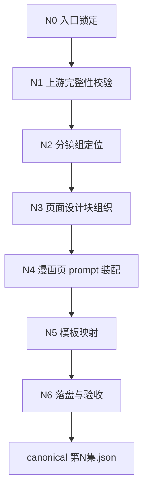
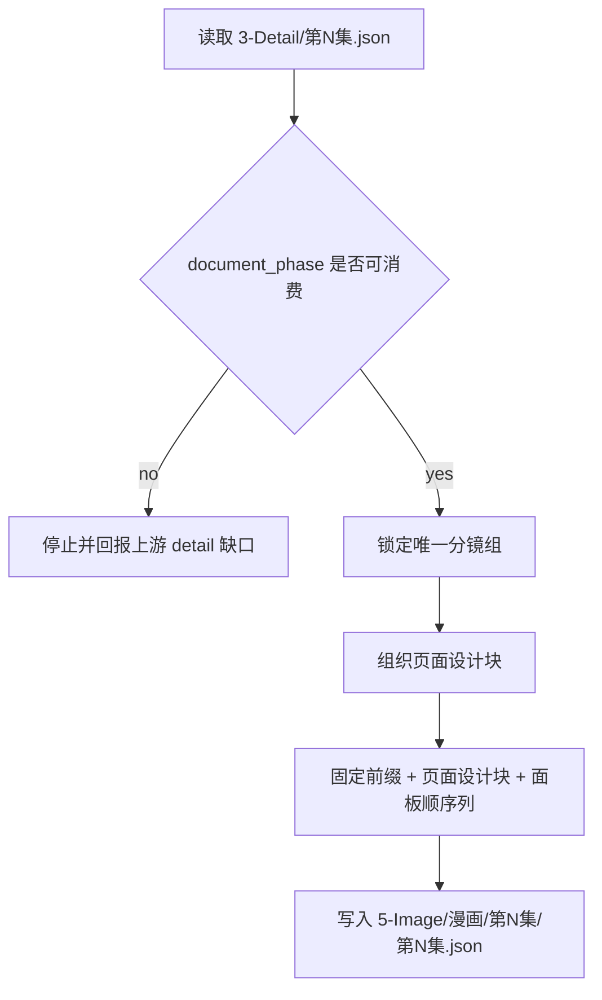

# 5-Image / 1-提示词蒸馏 / 漫画

## Context Loading Contract

- 每次调用本技能时，必须同时加载同目录 `CONTEXT.md` 作为预加载上下文。
- 若同目录 `CONTEXT.md` 缺失，应先补齐最小知识库骨架，或向用户明确报告阻塞；不得在未检查该上下文的情况下执行技能。
- 冲突优先级：用户显式请求 > 仓库/全局 `AGENTS.md` > 本 `SKILL.md` > 同目录 `CONTEXT.md`。

## 概述

`漫画` 是 `5-Image / 1-提示词蒸馏` 下的漫画页叶子技能，负责把 `projects/aigc/<项目名>/3-Detail/第N集.json` 中一个可唯一锁定的分镜组，蒸馏成 **1 条 9:16 漫画页图像请求 JSON**。

它不负责真实出图，不改写上游编导事实，也不把多个对象类型混成同一请求。它只负责把“组级剧情推进 + 镜头顺序 + 漫画阅读节奏 + 页面构图目标”稳定收束为后续可继续 handoff 的请求对象。

当前交付焦点固定为：

1. 共享模板兼容的 `meta`
2. 面向漫画页的 `prompt_style`
3. 图像生成侧 `model` 参数骨架与参照图预留位
4. 由固定英文前缀、页面设计块与面板顺序列拼成的 `prompt`
5. 对应的 `prompt_char_count`

## When to Use

- 用户明确说的是 `漫画页 / comic page / 9:16 漫画 / 气泡文字 / 旁白框 / 漫画阅读节奏`。
- 需要先完成图像请求 JSON 蒸馏，后续再进入 `2-参照引用` 或 `3-图像生成`。
- 当前对象是组级剧情推进，但目标媒介不是多格 storyboard，而是单页漫画阅读体验。

## When Not to Use

- 目标是多格故事板图像请求，应进入 `分镜故事板`。
- 目标是单一 `分镜ID` 对应的首帧、关键帧或单帧图，应进入 `分镜帧`。
- 上游 `3-Detail/第N集.json` 尚未形成合法 `分镜组列表[]`，或 `metadata.document_phase` 未到 `detail_in_progress | ready`。
- 任务想直接生成图片，而不是先产出请求 JSON。

## Truth Ownership

### `漫画` 拥有

- 分镜组 -> 单页漫画图像请求对象 的一对一转换合同
- 固定英文前缀 + 页面设计块 + 面板顺序列 的 prompt 组织规则
- 9:16 漫画页阅读节奏、页内镜头顺序与文字承载预留的页面化表达
- 对 `.agents/skills/aigc/5-Image/_shared/image-generation-input.template.json` 的局部填充规则
- `json_only / full_trace` 的漫画页输出模式裁决

### `漫画` 不拥有

- 父级 `1-提示词蒸馏` 的对象裁决与互斥路由权
- 单帧合同与组级 storyboard 合同
- 一致性二次处理与真实图片生成
- 上游导演 JSON 的事实改写
- 第二套并行模板真源

## Shared Canonical Sources (Mandatory)

- `.agents/skills/aigc/SKILL.md`
- `.agents/skills/aigc/5-Image/SKILL.md`
- `.agents/skills/aigc/5-Image/1-提示词蒸馏/SKILL.md`
- `.agents/skills/aigc/_shared/director_episode_output.schema.json`
- `.agents/skills/aigc/5-Image/_shared/image-generation-input.template.json`
- `projects/aigc/<项目名>/3-Detail/第N集.json`
- `projects/aigc/<项目名>/3-Detail/水月/第N集.field-patch.json`（可选补证）
- `projects/aigc/<项目名>/3-Detail/镜花/第N集.field-patch.json`（可选补证）

硬规则：

1. `projects/aigc/<项目名>/3-Detail/第N集.json` 是本叶子的第一结构化真源。
2. `水月 / 镜花` sidecar 只在 canonical JSON 局部缺口时作为补证读取，不能替代 `第N集.json`。
3. 本叶子只做漫画页请求 JSON 蒸馏，不在本层改写 `3-Detail` 字段。
4. 本叶子不创建第二套输出模板，必须复用 `.agents/skills/aigc/5-Image/_shared/image-generation-input.template.json`。

## Total Input Contract (Mandatory)

| 输入槽位 | 固定要求 |
| --- | --- |
| `business_goal` | 把一个分镜组稳定蒸馏成后续可消费的 9:16 漫画页图像请求 JSON |
| `business_object` | `final_output.main_content.分镜组列表[]` 中的单个可回链分镜组 |
| `task_goal` | 生成 `meta + prompt_style + model + prompt + prompt_char_count` 并写入单集 `第N集.json` |
| `constraints` | 不虚构新增剧情、不打乱镜头顺序、不直接生成图片、不破坏共享模板骨架 |
| `non_goals` | 不做对象路由、不做单帧蒸馏、不做故事板蒸馏、不做模型提交 |
| `success_criteria` | 分镜组可唯一回链；页面设计块覆盖组级设计与面板顺序；固定前缀逐字保留；输出可 handoff |
| `evidence_sources` | `3-Detail/第N集.json`、shared schema、shared image template、可选 `水月 / 镜花` sidecar 与 `4-Design` 参考资产 |
| `canonical_output` | `projects/aigc/<项目名>/5-Image/漫画/第N集/第N集.json` |

### Readiness Gate

进入漫画页蒸馏前，必须确认：

1. `metadata.document_phase in {detail_in_progress, ready}`
2. 目标组具备 `剧本正文`
3. 目标组具备 `正文切分参考[]`
4. 目标组具备 `组间设计.全局风格 / 类型元素 / 导演意图 / 出场角色及穿搭`
5. 目标组具备有序 `分镜明细[]`，且镜级 canonical 字段至少能回链：
   - `分镜ID`
   - `正文回指`
   - `角色表现`
   - `运动表现`
   - `氛围表现`
   - `视觉强化`
   - `分镜构图`
   - `摄影美学`
   - `运镜手法`
   - `转场特效`

若目标组仍处于兼容过渡期，可短期回退读取 `角色背景面 / 角色站位走位 / 道具及状态 / 分镜表现`，但它们只允许作为 compatibility projection，不得重新升格为第一真相。

## Canonical Landing

- 子路径根目录：`projects/aigc/<项目名>/5-Image/漫画/`
- 单集目录：`projects/aigc/<项目名>/5-Image/漫画/第N集/`
- 汇总 JSON：`projects/aigc/<项目名>/5-Image/漫画/第N集/第N集.json`
- 汇总清单：`projects/aigc/<项目名>/5-Image/漫画/第N集/_manifest.json`（仅当本轮要求 `full_trace` 时）

## Business Requirement Analysis Contract (Mandatory)

| analysis_slot | 当前结论 |
| --- | --- |
| `business_goal` | 把一个分镜组收束为单页 9:16 漫画请求对象，保留镜头顺序、漫画阅读节奏与文字承载预留。 |
| `business_object` | `3-Detail/第N集.json` 中单个目标分镜组的组级设计、正文切分参考与有序镜级事实。 |
| `constraint_profile` | 只消费 `detail_in_progress | ready` 的 `3-Detail` 输出；只命中一个分镜组；主产物必须是 image-request JSON；不得改写上游字段。 |
| `success_criteria` | 路由唯一、页内顺序稳定、prompt 明确表达漫画页构图与阅读节奏、下游可继续消费。 |
| `non_goals` | 不直接出图、不生成第二套页面脚本、不在本层写对白文案真源、不并发多个对象类型。 |
| `complexity_source` | 复杂度主要来自“镜头组 -> 漫画页” 的页面化重排与文字承载预留，而不是对象路由。 |
| `topology_fit` | 采用“串行主干 + 条件补证 + 单一汇流”的叶子拓扑：先锁输入，再锁页面对象，再做页面化蒸馏，最后统一 handoff。 |
| `step_strategy` | 本叶子只维护漫画页输入门、页面设计块、prompt 合同、模板映射与写回审计。 |

## Visual Maps

## Thinking-Action Node Contract (Mandatory)

| node_id | objective | inputs | actions | evidence | route_out | gate |
| --- | --- | --- | --- | --- | --- | --- |
| `N0-intake-lock` | 锁定本轮就是“漫画页请求 JSON 蒸馏” | 用户意图、父级路由结论、本技能合同 | 冻结对象类型、输出模式默认值、非目标 | 路由结论、对象边界说明 | `success -> N1`；`wrong_object -> 回父级重路由` | 未锁定对象不得进入主干 |
| `N1-source-validate` | 校验 shared schema 与上游 episode JSON 是否可消费 | `3-Detail/第N集.json`、shared schema | 检查 `document_phase`、结构壳、`分镜组列表[]` 与关键字段存在性 | 输入完整性判定、缺口说明 | `ready -> N2`；`partial -> N2`；`broken -> 停止` | 上游结构不成立不得继续 |
| `N2-group-lock` | 锁定当前漫画页对应的唯一分镜组 | `分镜组列表[]`、用户或父级提供的组锚点 | 定位目标组、收集 `source_shot_ids`、确认镜头顺序 | `group_lock_record` | `success -> N3`；`ambiguous -> 回父级/用户澄清` | 组定位唯一且镜头顺序稳定 |
| `N3-page-block-synthesize` | 组织页面设计块与面板顺序列 | 目标组、可选 evidence sidecar | 提取组级字段、镜级顺序、阅读节奏、气泡/旁白承载预留 | `comic_page_block` 草稿、字段覆盖检查 | `complete -> N4`；`partial -> N4`；`missing_core -> 回 N1/N2` | 核心组字段必须可回链 |
| `N4-prompt-assemble` | 生成固定前缀 + 页面设计块 + 面板顺序列 的 prompt | 固定英文前缀、页面内容块 | 逐字保留前缀、直接拼接、统计字数 | `prompt`、`prompt_char_count` | `success -> N5`；`prefix_drift -> 回 N4` | prompt 结构成立 |
| `N5-template-map` | 将 prompt 与页信息映射到共享模板骨架 | shared image template、prompt、页信息、可选 design refs | 填充 `meta/prompt_style/model`，登记参照图槽位 | 单条 image request 对象 | `success -> N6`；`template_drift -> 回 N5` | 模板骨架完整且兼容 |
| `N6-land-audit` | 形成唯一 canonical output 并通过汇流门 | image request 对象、输出模式 | 写 `第N集.json`，按需补 `_manifest.json`，执行最终验收 | 落盘路径、审计结果、handoff 结论 | `pass -> 完成`；`fail -> 回具体失败节点` | 只有本节点可以宣告完成 |

## Field Master

| field_id | 输出位置/字段 | 内容要求 | 默认责任节点 | 质量维度 | 失败码 |
| --- | --- | --- | --- | --- | --- |
| `FIELD-COMIC-PAGE-01` | `prompt_style.type / meta.shot_level / meta.group_id / meta.source_shot_ids` | 声明漫画页类型，并锁定组级来源与镜头顺序 | `N2-N5` | 输入覆盖完整度 | `FAIL-COMIC-PAGE-01` |
| `FIELD-COMIC-PAGE-02` | `prompt` | 满足固定前缀、页面设计块与面板顺序列 | `N3-N4` | prompt 完整性 | `FAIL-COMIC-PAGE-02` |
| `FIELD-COMIC-PAGE-03` | `model.reference_images / image_markers` | 保留共享模板骨架，并可继续 handoff | `N5` | 模板兼容性 | `FAIL-COMIC-PAGE-03` |
| `FIELD-COMIC-PAGE-04` | `第N集.json / _manifest.json` | 输出文件可追溯、可继续交给 `2-参照引用 / 3-图像生成` | `N6` | 输出可消费性 | `FAIL-COMIC-PAGE-04` |

## Thought Pass Map

| step_id | 聚焦字段 | 核心问题 | 生成动作 | 未达标信号 |
| --- | --- | --- | --- | --- |
| `N0` | `FIELD-COMIC-PAGE-01` | 当前任务是不是漫画页对象 | 锁定对象与非目标 | 其实是故事板或单帧 |
| `N1` | `FIELD-COMIC-PAGE-01` | `3-Detail` 输入与 shared schema 是否可消费 | 校验阶段就绪门与组壳 | phase 未就绪、组壳破坏 |
| `N2` | `FIELD-COMIC-PAGE-01` | 当前漫画页对应哪个唯一分镜组 | 锁定 `group_id + source_shot_ids` | 组定位歧义 |
| `N3` | `FIELD-COMIC-PAGE-02` | 页面设计块需要覆盖哪些事实 | 提取组级设计、镜头顺序与文字承载预留 | 只剩抽象风格，没有页内节奏 |
| `N4` | `FIELD-COMIC-PAGE-02` | prompt 是否严格满足“固定前缀 + 页面设计块 + 面板顺序列” | 逐字保留前缀并拼接内容块 | 前缀缺失、顺序错误 |
| `N5` | `FIELD-COMIC-PAGE-03` | 共享模板骨架是否完整承接漫画页对象 | 映射 `meta/prompt_style/model` | 模板字段删改 |
| `N6` | `FIELD-COMIC-PAGE-04` | 输出是否已形成可 handoff 的单集 JSON | 写 `第N集.json`，按需补 `_manifest.json` 并执行审计 | 仍把图片当主产物 |

## Pass Table

| field_id | Pass Standard | Fail Code | Rework Entry |
| --- | --- | --- | --- |
| `FIELD-COMIC-PAGE-01` | `prompt_style.type / meta.shot_level` 合法，且 `group_id` 与有序 `source_shot_ids` 同时成立 | `FAIL-COMIC-PAGE-01` | `N2-N5` |
| `FIELD-COMIC-PAGE-02` | prompt 满足固定前缀、完整页面设计块与字数统计 | `FAIL-COMIC-PAGE-02` | `N3-N4` |
| `FIELD-COMIC-PAGE-03` | 模板骨架完整，可保留 `reference_images / image_markers` | `FAIL-COMIC-PAGE-03` | `N5` |
| `FIELD-COMIC-PAGE-04` | `第N集.json` 可追溯可 handoff；若要求 `full_trace`，则 `_manifest.json` 同步成立 | `FAIL-COMIC-PAGE-04` | `N6` |

## Root-Cause Execution Contract (Mandatory)

当出现以下症状时，必须先修本叶子合同：

- 明明是漫画页诉求，却被当成故事板或单帧对象
- prompt 没有页面阅读节奏，只剩抽象场景描述
- 共享模板骨架被删改，导致后续 `2-参照引用 / 3-图像生成` 无法继续消费
- 上游 `3-Detail` 未就绪，却直接进入蒸馏

必经链路：

`Symptom -> Direct Technical Cause -> Rule Source -> Meta Rule Source -> Fix Landing Points`

优先检查：

- `Rule Source`
  - `.agents/skills/aigc/5-Image/1-提示词蒸馏/漫画/SKILL.md`
  - `.agents/skills/aigc/5-Image/1-提示词蒸馏/漫画/CONTEXT.md`
  - `.agents/skills/aigc/5-Image/1-提示词蒸馏/SKILL.md`
  - `.agents/skills/aigc/_shared/director_episode_output.schema.json`
- `Meta Rule Source`
  - `.agents/skills/aigc/SKILL.md`
  - 根 `AGENTS.md`

## SKILL / CONTEXT 分工（Mandatory）

- `SKILL.md` 锁定漫画页输入门、页面设计块、prompt 合同、模板映射与写回审计。
- `CONTEXT.md` 沉淀对象误路由、页面节奏漂移、模板骨架失稳等经验模式。
- 只有经过复用验证的经验，才允许从 `CONTEXT.md` 晋升回本合同。
