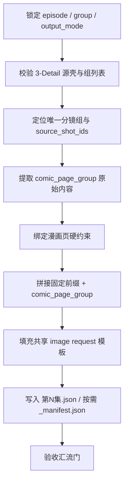
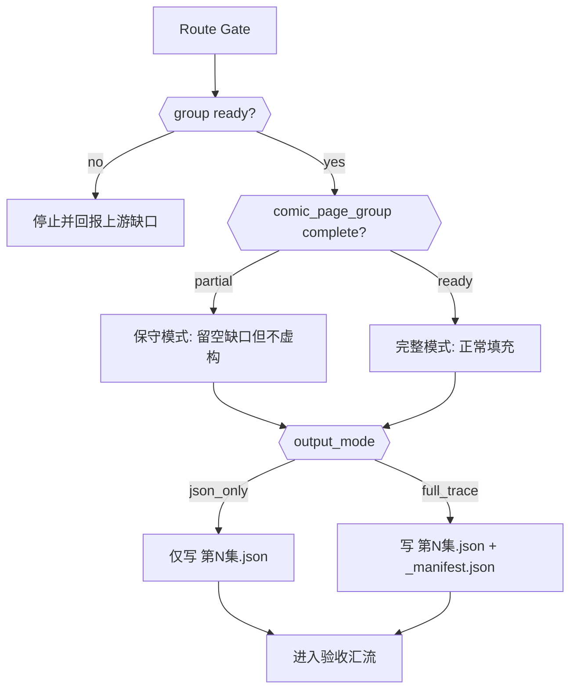
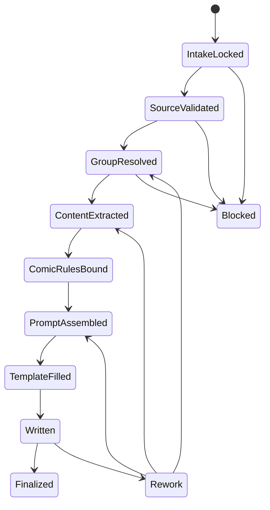
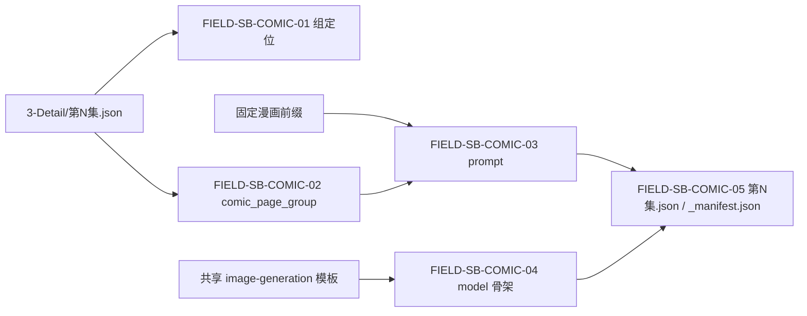

# 5-Image / 1-提示词蒸馏 / 漫画

## Context Loading Contract

- 每次调用本技能时，必须同时加载同目录 `CONTEXT.md` 作为预加载上下文。
- 若同目录 `CONTEXT.md` 缺失，应先补齐最小知识库骨架，或向用户明确报告阻塞；不得在未检查该上下文的情况下执行技能。
- 冲突优先级：用户显式请求 > 仓库/全局 `AGENTS.md` > 本 `SKILL.md` > 同目录 `CONTEXT.md`。

## 概述

`漫画` 是 `5-Image / 1-提示词蒸馏` 下的组级叶子子技能，负责把 `projects/aigc/<项目名>/3-Detail/第N集.json` 中一个可唯一回链的 `分镜组`，收束为 **每个分镜组 1 条漫画页图像请求 JSON**。

本轮重构遵循 `skill-知行合一`，但不改变既有业务机制：

- 上游真源仍是 `projects/aigc/<项目名>/3-Detail/第N集.json`
- shared schema 仍是 `.agents/skills/aigc/_shared/director_episode_output.schema.json`
- shared JSON 模板仍是 `.agents/skills/aigc/5-Image/_shared/image-generation-input.template.json`
- canonical 输出仍是 `projects/aigc/<项目名>/5-Image/漫画/第N集/第N集.json`
- `prompt` 仍由固定漫画前缀 + `comic_page_group` 构成
- `1 shot = 1 panel` 与文字归属约束仍是 prompt 的硬门槛

变化只发生在合同表达层：把业务分析、路由、节点、汇流、验收与输出收束到同一 `SKILL.md` 真源中，不再依赖任何平行的 `references/` 规范载体。

## Skill Execution Rule (Mandatory)

`漫画` 作为确定性的叶子蒸馏技能，直接由本技能完成执行闭环，不再拆出本地 `subagent team`、`team.md`、平行 `references/` 或第二套私有模板。

```yaml
thinking_action_mode: enabled
skeleton_detail_split: false
local_subagent_team: false
parallel_sibling_dispatch: false
```

硬规则：

1. 本技能负责从 `分镜组` 直接生成漫画图像请求 JSON，不负责真实出图。
2. 本技能必须在单一 `SKILL.md` 内同时写清业务分析、步骤、节点、门禁与输出合同。
3. 本技能不得把复杂细则下沉到 `references/`；当前配置已显式声明 `skeleton_detail_split: false`。
4. 本技能不得新增第二份规范真源，例如私有 prompt 模板、平行 chain-of-thought 文档或并行的执行 runbook。
5. 本技能默认只处理一个已锁定的 `分镜组`；若请求混入 `分镜故事板 / 分镜帧 / 漫画` 多种对象，必须先回父级 `1-提示词蒸馏` 重裁路由。

## Business Requirement Analysis Contract (Mandatory)

在进入节点编排前，先锁定本技能到底要解决什么业务问题，而不是直接开始拼 prompt。

| analysis_slot | 当前结论 |
| --- | --- |
| `business_goal` | 把一个可唯一定位的 `分镜组` 收束成可继续 handoff 给一致性处理或图像生成的漫画页图像请求 JSON |
| `business_object` | `3-Detail/第N集.json` 中的组级事实、镜级顺序、组间设计（含 `出场角色及穿搭`）、镜级 canonical 字段，以及共享图像请求模板 |
| `constraint_profile` | 不改写上游镜头事实；不虚构对白/旁白/镜头；固定漫画前缀必须逐字保留；`1 shot = 1 panel` 必须显式进入 prompt |
| `success_criteria` | 组定位唯一、`comic_page_group` 覆盖完整、prompt 约束正确、模板骨架完整、输出 JSON 可追溯可 handoff |
| `non_goals` | 不直接生成图片、不负责一致性处理、不改写导演意图、不把漫画页渲染结果当主产物 |
| `complexity_source` | 组定位、组内容提取、漫画约束绑定、prompt 拼接、共享模板填充、`json_only/full_trace` 双模式验收 |
| `topology_fit` | 采用“串行主干 + 条件分支 + 最终汇流”的单技能思行网络：前段锁定组与源壳，中段构建 `comic_page_group` 与 prompt，后段做模板填充、落盘与验收 |
| `step_strategy` | 不做骨架/细则分拆，直接在主 `SKILL.md` 中把每个节点写细，确保执行者无需回查额外规范文件 |

## Context Preload (Mandatory)

加载顺序固定为：

1. 根 `AGENTS.md`
2. `.agents/skills/aigc/SKILL.md + CONTEXT.md`
3. `.agents/skills/aigc/5-Image/1-提示词蒸馏/SKILL.md + CONTEXT.md`
4. 本 `SKILL.md + CONTEXT.md`
5. `.agents/skills/aigc/_shared/director_episode_output.schema.json`
6. `.agents/skills/aigc/5-Image/_shared/image-generation-input.template.json`
7. `projects/aigc/<项目名>/3-Detail/第N集.json`
8. `projects/aigc/<项目名>/3-Detail/水月/第N集.field-patch.json`、`projects/aigc/<项目名>/3-Detail/镜花/第N集.field-patch.json` 与 `projects/aigc/<项目名>/4-Design/` 下仅与当前组相关的补充证据（按需）

## Shared Canonical Sources (Mandatory)

- 强制读取：`.agents/skills/aigc/5-Image/1-提示词蒸馏/SKILL.md`
- 强制读取：`.agents/skills/aigc/_shared/director_episode_output.schema.json`
- 强制读取：`.agents/skills/aigc/5-Image/_shared/image-generation-input.template.json`
- 强制读取：`projects/aigc/<项目名>/3-Detail/第N集.json`

硬规则：

1. `projects/aigc/<项目名>/3-Detail/第N集.json` 是组级与镜级事实的第一真源。
2. `.agents/skills/aigc/5-Image/_shared/image-generation-input.template.json` 是图像请求骨架的唯一模板真源。
3. `3-Detail/水月/第N集.field-patch.json` 与 `3-Detail/镜花/第N集.field-patch.json` 只作为补充校对证据，不替代 `第N集.json`。
4. `4-Design` 只作为参照图槽位来源，不得反向改写 `分镜组` 事实。
5. 当前技能包不得重建 `references/` 规范分层；所有规范细则必须留在本 `SKILL.md`。

## Total Input Contract

### 必需输入

- `projects/aigc/<项目名>/3-Detail/第N集.json`
- `.agents/skills/aigc/_shared/director_episode_output.schema.json`
- `.agents/skills/aigc/5-Image/_shared/image-generation-input.template.json`
- 一个可唯一回链的 `分镜组`

### 可选输入

- `projects/aigc/<项目名>/3-Detail/水月/第N集.field-patch.json`
- `projects/aigc/<项目名>/3-Detail/镜花/第N集.field-patch.json`
- `projects/aigc/<项目名>/4-Design/` 下角色、场景、道具参考图
- 父级 `1-提示词蒸馏` 给出的 `output_mode` 要求

### Readiness Gate

进入漫画页蒸馏前，必须确认：

1. `metadata.document_phase in {detail_in_progress, ready}`
2. 目标组具备 `组间设计.出场角色及穿搭`
3. 目标组的 `分镜明细[]` 至少能回链 `角色背景面 / 角色站位走位 / 道具及状态 / 分镜表现`

### 禁止输入

- 与当前组无关的其他组事实
- 任何要求直接输出页图图片的指令
- 用于替代共享模板的私有模板 JSON
- 将对白、独白、旁白从原镜头上下文中剥离后再自由重组的改写方案

### 输入处理原则

1. 先锁定当前任务已命中 `漫画`，再进入组级执行。
2. 先证明 `分镜组` 可唯一定位，再处理 prompt。
3. 先保留原镜头顺序，再施加漫画页约束。
4. 缺失字段允许保守留空，但不得虚构新镜头、新对白或新导演意图。
5. 任何补充参考都只能填入 `reference_images / image_markers`，不能改写 prompt 的事实基座。

## Visual Maps









## Topology Contract (Mandatory)

### Topology Fit

本技能采用 `串行主干 + 条件分支 + 最终汇流`：

1. 串行主干
   - 锁定任务与输出模式
   - 校验 `3-Detail` 源壳
   - 定位唯一 `分镜组`
   - 提取 `comic_page_group`
   - 绑定漫画页硬约束
   - 拼接 prompt
   - 填充模板
2. 条件分支
   - `comic_page_group` 完整 or 部分缺口
   - `json_only` or `full_trace`
3. 最终汇流
   - `第N集.json`
   - 按需 `_manifest.json`
   - 统一验收、失败码与返工入口

### Route Priority (Mandatory)

`目标分镜组唯一性 > 组内容完整度 > 输出模式 > 模板骨架完整度`

- 先确认有没有唯一 `分镜组`
- 再确认 `comic_page_group` 是 `ready` 还是 `partial`
- 再确认是 `json_only` 还是 `full_trace`
- 最后确认共享模板骨架是否保持完整

### Variable Register

| var_id | 观测信号 | 状态集合 | 检测方法 | 优先级 |
| --- | --- | --- | --- | --- |
| V-SB-COMIC-01 | 当前 `分镜组` 是否可唯一定位 | `ready/incomplete/conflict` | 检查 `分镜组ID` 与有序 `分镜明细[]` | P0 |
| V-SB-COMIC-02 | `comic_page_group` 内容块是否完整 | `ready/partial` | 检查 `剧本正文 + 组间设计 + 分镜明细[]` | P0 |
| V-SB-COMIC-03 | 漫画硬约束是否已绑定 | `bound/missing` | 检查 `1 shot = 1 panel` 与文字归属说明 | P0 |
| V-SB-COMIC-04 | 输出模式 | `json_only/full_trace` | 读取父级要求或用户显式请求 | P1 |
| V-SB-COMIC-05 | 共享模板骨架是否完整 | `ready/drifted` | 检查 `model + reference_images + image_markers` | P0 |

### Scenario Table

| case_id | 触发谓词 | 主策略 | fallback |
| --- | --- | --- | --- |
| C-SB-COMIC-01 | `V-SB-COMIC-01 in {incomplete, conflict}` | 停止执行并返回上游缺口 | 无 |
| C-SB-COMIC-02 | `V-SB-COMIC-02=ready and V-SB-COMIC-03=bound` | 主线完整填充 | C-SB-COMIC-03 |
| C-SB-COMIC-03 | `V-SB-COMIC-02=partial` | 保守填充已有内容，不虚构缺失字段 | C-SB-COMIC-01 |
| C-SB-COMIC-04 | `V-SB-COMIC-04=full_trace` | 生成 JSON + manifest | C-SB-COMIC-02 |
| C-SB-COMIC-05 | `V-SB-COMIC-05=drifted` | 先修共享模板兼容性再继续 | C-SB-COMIC-01 |

### Strategy Mapping Matrix

| case_id | strategy_id | 执行步骤 | 质量门禁 | fallback_strategy_id | 升级条件 |
| --- | --- | --- | --- | --- | --- |
| C-SB-COMIC-01 | S-COMIC-BACKTRACK | 停止并报告组定位缺口 | 不伪造组或镜头事实 | 无 | 上游结构长期缺失 |
| C-SB-COMIC-02 | S-COMIC-MAINLINE | 完整生成 `comic_page_group + prompt + model` | 固定前缀、漫画约束、模板骨架全部成立 | S-COMIC-PARTIAL | 任一组级字段缺失 |
| C-SB-COMIC-03 | S-COMIC-PARTIAL | 保守留空缺口字段并完成可追溯输出 | 不补写不存在的对白/镜头 | S-COMIC-BACKTRACK | 缺口已影响下游消费 |
| C-SB-COMIC-04 | S-COMIC-FULL-TRACE | 写 `第N集.json + _manifest.json` | 两文件能互相追溯同一组 | S-COMIC-MAINLINE | 实际只需 `json_only` |
| C-SB-COMIC-05 | S-COMIC-TEMPLATE-REPAIR | 先恢复 shared template 骨架 | `reference_images / image_markers` 不得丢失 | S-COMIC-BACKTRACK | 漂移来自共享真源缺口 |

## Thinking-Action Node Contract (Mandatory)

每个关键节点必须同时描述判断与动作，至少覆盖以下槽位：

| slot | 要求 |
| --- | --- |
| `node_id` | 稳定节点标识 |
| `objective` | 该节点要解决的判断/动作目标 |
| `inputs` | 进入该节点的输入与依赖 |
| `actions` | 该节点真正执行的动作 |
| `evidence` | 该节点留下的证据、产物或验证结果 |
| `route_out` | 成功、失败、分支时分别流向何处 |
| `gate` | 是否允许进入最终汇流 |

## Thinking-Action Node Network

| node_id | 对应 Step | 聚焦字段 | objective | actions | evidence | route_out | gate |
| --- | --- | --- | --- | --- | --- | --- | --- |
| N1-INTAKE-LOCK | S1 | `FIELD-SB-COMIC-01` | 锁定当前任务是否确实命中 `漫画`，并确定 `episode_id / group_id / output_mode` | 读取父级路由结论、用户显式要求与目标单元 | 路由结论、目标组锚点、输出模式 | 成功 -> N2；对象混杂 -> 回父级；缺锚点 -> 阻塞 | 只有对象唯一时才可继续 |
| N2-SOURCE-SHELL-GATE | S2 | `FIELD-SB-COMIC-01` | 验证 `3-Detail/第N集.json` 是否具备 shared schema 字段壳与组列表 | 检查 `metadata.document_phase`、`final_output`、`分镜组列表[]` 与模板读取可用性 | 源壳通过/失败结论 | 通过 -> N3；失败 -> 阻塞 | shared schema 不成立不得继续 |
| N3-GROUP-RESOLVE | S3 | `FIELD-SB-COMIC-01` | 锁定唯一 `分镜组` 与有序 `source_shot_ids` | 按 `分镜组ID` 与组内 `分镜明细[]` 排序回链 | 目标组对象、`source_shot_ids`、冲突说明 | 唯一 -> N4；冲突/缺失 -> 阻塞 | 组与镜头顺序唯一后才可继续 |
| N4-CONTENT-EXTRACT | S4 | `FIELD-SB-COMIC-02` | 提取 `comic_page_group` 的事实基座 | 抽取 `剧本正文 + 组间设计（含 出场角色及穿搭） + 分镜明细[]`，保留原顺序与原文措辞，并保留 `角色背景面 / 角色站位走位 / 道具及状态 / 分镜表现` | `comic_page_group` 原始内容块 | 完整 -> N5；部分缺口 -> N5 | 提取结果必须可回链上游字段 |
| N5-COMIC-RULE-BIND | S5 | `FIELD-SB-COMIC-02` | 把漫画页特有硬约束绑定到内容块与 `prompt_style` | 明确 `1 shot = 1 panel`、对白/独白/旁白只能落在对应 panel、`prompt_style.type/language` | 漫画约束清单、`prompt_style` 草案 | 成功 -> N6；约束缺失 -> 回到 N4/N5 | 硬约束进入 prompt 前必须齐备 |
| N6-PROMPT-ASSEMBLY | S6 | `FIELD-SB-COMIC-03` | 生成唯一合法的 `prompt` 与 `prompt_char_count` | 逐字保留固定前缀并直接拼接 `comic_page_group` | 最终 `prompt`、字数统计 | 成功 -> N7；前缀/顺序错误 -> 回到 N5/N6 | prompt 完整后才可填模板 |
| N7-TEMPLATE-FILL | S7 | `FIELD-SB-COMIC-04` | 以共享模板为骨架填充 `meta + model`，并保留参照图槽位 | 填充 `shot_level/group_id/source_shot_ids`、保留 `reference_images / image_markers`、接入可选参考图 | 结构完整的请求对象草案 | 成功 -> N8；模板漂移 -> 回到 N2/N7 | 模板骨架必须兼容共享真源 |
| N8-WRITEBACK | S8 | `FIELD-SB-COMIC-05` | 将请求对象落到 canonical 文件 | 写 `第N集.json`，按需输出 `_manifest.json` | 文件落盘结果、group 级清单 | 成功 -> N9；落盘缺口 -> 回到 N7/N8 | 只有 canonical 文件就绪才可验收 |
| N9-ACCEPTANCE-GATE | S9 | `FIELD-SB-COMIC-05` | 验证本轮输出是否可 handoff 给后续阶段 | 校验契约、覆盖、prompt、模板兼容与输出模式一致性 | PASS/FAIL、失败码、返工入口 | pass -> Final；fail -> 对应返工节点 | 所有字段和文件都达标才允许结案 |

## Node Execution Playbook (Mandatory)

### Step 1. `N1-INTAKE-LOCK`

| aspect | 要求 |
| --- | --- |
| `先看什么` | 先看父级 `1-提示词蒸馏` 是否已把当前任务裁定为 `漫画`，再看用户是否指定 `episode_id / group_id / output_mode` |
| `必须锁定` | `episode_id`、目标 `分镜组ID`、`json_only/full_trace`、当前只处理 1 个组 |
| `执行动作` | 记录当前轮只处理一个 `分镜组`；若用户混说单帧或故事板，立即回父级重裁而不是在本技能里兼容 |
| `常见错误` | 直接按“漫画页”关键词进入执行，但没有锁定具体组；或把多个组一起拼成一个请求 |
| `完成信号` | 已有唯一目标组锚点与输出模式，且对象类型明确是 `漫画` |
| `失败回退` | 回父级路由，不在本技能内继续猜对象 |

### Step 2. `N2-SOURCE-SHELL-GATE`

| aspect | 要求 |
| --- | --- |
| `先看什么` | 检查 `3-Detail/第N集.json` 是否存在，且具备 `metadata.document_phase`、`metadata / final_output.main_content.分镜组列表[]` |
| `必须锁定` | shared schema 壳、组列表存在性、共享模板文件可读 |
| `执行动作` | 校验 JSON 结构与共享模板骨架，确认后续读取不会落到旧路径或私有模板 |
| `常见错误` | 只看到了 `分镜组ID` 就继续执行，没有确认 `分镜明细[]`、`组间设计` 是否存在 |
| `完成信号` | 已确认上游 JSON 与 shared template 都可消费 |
| `失败回退` | 停止并报告缺的是源壳还是模板，不得跳过校验 |

### Step 3. `N3-GROUP-RESOLVE`

| aspect | 要求 |
| --- | --- |
| `先看什么` | 在 `分镜组列表[]` 中定位目标组，并检查组内 `分镜明细[]` 是否按原顺序可回链 |
| `必须锁定` | `meta.group_id`、有序 `meta.source_shot_ids`、目标组唯一性 |
| `执行动作` | 遍历组列表，取当前组全部 `分镜ID`，按上游顺序生成 `source_shot_ids` |
| `常见错误` | 锁定了组但丢失组内镜头顺序；或组 ID 冲突时仍继续向下游输出 |
| `完成信号` | 当前组唯一成立，且 `source_shot_ids` 能完整回链 |
| `失败回退` | 报告组定位冲突或缺失，回到上游补齐输入 |

### Step 4. `N4-CONTENT-EXTRACT`

| aspect | 要求 |
| --- | --- |
| `先看什么` | 看目标组是否具备 `剧本正文`、`组间设计.全局风格`、`组间设计.类型元素`、`组间设计.导演意图`、`组间设计.出场角色及穿搭` 与全部 `分镜明细[]`，并确认镜级 canonical 字段可回链 |
| `必须锁定` | `comic_page_group` 的事实基座来自同一组，不混入其他组内容 |
| `执行动作` | 按原顺序提取组级与镜级字段，构造 `comic_page_group` 原始内容块 |
| `常见错误` | 只抽镜头摘要，漏掉组级风格或导演意图；或为了压缩字数删除原镜头细节 |
| `完成信号` | `comic_page_group` 已包含组级字段与按顺序排列的全部镜级字段 |
| `失败回退` | 若字段缺失，标记 `partial` 并保守留空，不得补写 |

### Step 5. `N5-COMIC-RULE-BIND`

| aspect | 要求 |
| --- | --- |
| `先看什么` | 检查 `comic_page_group` 是否已经足够承载漫画页约束，而不需要改写上游事实 |
| `必须锁定` | `1 shot = 1 panel`、对白/独白/旁白只能出现在对应 panel 内、`prompt_style.type` 固定服务漫画单页、`prompt_style.language=mixed` |
| `执行动作` | 把漫画页约束绑定到 prompt 逻辑与 `prompt_style`，但不把这些约束伪装成上游事实字段 |
| `常见错误` | 只在脑中记住漫画约束，却没有让它显式进入 prompt；或把台词与面板关系写得过于抽象 |
| `完成信号` | 漫画硬约束已显式写入本轮 prompt 生成逻辑 |
| `失败回退` | 回到本步骤补约束，不允许跳到模板填充 |

### Step 6. `N6-PROMPT-ASSEMBLY`

| aspect | 要求 |
| --- | --- |
| `先看什么` | 检查固定前缀是否逐字保留，且其后紧跟 `comic_page_group` |
| `必须锁定` | `prompt = 固定前缀 + comic_page_group`，中间不插入额外说明 |
| `执行动作` | 拼接前缀与内容块，计算 `prompt_char_count`，确认顺序与字数一致 |
| `常见错误` | 在固定前缀后插入自创提示、把 `comic_page_group` 改成摘要、或忘记更新字数统计 |
| `完成信号` | `prompt` 与 `prompt_char_count` 一致，且前缀、顺序、漫画约束全部成立 |
| `失败回退` | 回到本步骤修拼接，不得带错字数进入下游 |

### Step 7. `N7-TEMPLATE-FILL`

| aspect | 要求 |
| --- | --- |
| `先看什么` | 看共享模板中的 `meta / model / reference_images / image_markers` 是否完整 |
| `必须锁定` | `meta.shot_level=storyboard_group`、`meta.group_id`、`meta.source_shot_ids`、`model` 骨架、空参照槽位保留 |
| `执行动作` | 在共享模板基础上填字段，并把 `4-Design` 参考资产只登记到槽位，不改写 prompt 主体 |
| `常见错误` | 删除空数组、擅自新增私有字段、把参考图说明写进 prompt 主体导致事实漂移 |
| `完成信号` | 结构完整的请求对象已形成，且仍兼容共享模板 |
| `失败回退` | 若模板漂移，优先修共享模板兼容，不得临时造本地模板 |

### Step 8. `N8-WRITEBACK`

| aspect | 要求 |
| --- | --- |
| `先看什么` | 确认 canonical 落点是 `projects/aigc/<项目名>/5-Image/漫画/第N集/第N集.json` |
| `必须锁定` | 每个分镜组只生成 1 条请求对象；仅在 `full_trace` 时输出 `_manifest.json` |
| `执行动作` | 写单集 JSON，若 `full_trace` 则写 manifest，并保持同一 `group_id` 的追溯一致性 |
| `常见错误` | 把图片落盘当主产物；或无条件生成 `_manifest.json`；或多个组混写成一条对象 |
| `完成信号` | canonical 文件已落盘，且条目与当前组一一对应 |
| `失败回退` | 回到模板填充或输出模式判定，不得就地忽略缺项 |

### Step 9. `N9-ACCEPTANCE-GATE`

| aspect | 要求 |
| --- | --- |
| `先看什么` | 从契约遵循、输入覆盖、prompt 完整性、模板兼容和 handoff readiness 五个面复核 |
| `必须锁定` | 失败码、返工入口、当前轮最终状态 `pass/fail` |
| `执行动作` | 对照 `Field Master / Thought Pass Map / Pass Table` 逐项验收 |
| `常见错误` | 只看 JSON 写出来了就当完成，没有复核 `1 shot = 1 panel` 或模板骨架 |
| `完成信号` | 所有字段通过，输出能继续被后续阶段消费 |
| `失败回退` | 回到对应节点返工，而不是整盘重写 |

## Mandatory Workflow

1. 读取父级 `.agents/skills/aigc/5-Image/1-提示词蒸馏/SKILL.md + CONTEXT.md`，确认当前命中 `漫画`。
2. 锁定 `episode_id / group_id / output_mode`，拒绝把多对象请求混入本技能。
3. 读取 `projects/aigc/<项目名>/3-Detail/第N集.json`，校验其 shared schema 字段壳。
4. 在 `final_output.main_content.分镜组列表[]` 中定位唯一目标组，并回链有序 `source_shot_ids`。
5. 提取该组的 `剧本正文`、`组间设计` 与全部按原顺序排列的 `分镜明细[]`，形成 `comic_page_group`。
6. 显式绑定漫画页硬约束：`1 shot = 1 panel`，且对白/独白/旁白只能放在对应 panel 内。
7. 用固定前缀逐字拼接 `prompt`，同步写出 `prompt_char_count`。
8. 以共享模板为骨架填充 `meta + prompt_style + model + prompt + prompt_char_count`，保留 `reference_images / image_markers` 槽位。
9. 写 `第N集.json`；仅在 `full_trace` 时额外输出 `_manifest.json`。
10. 运行验收汇流门，给出 PASS/FAIL、失败码与返工入口。

## Prompt Assembly Rules

1. 固定前缀必须逐字保留：

   ```text
   Create a single comic page based on the following storyboard group.
   Keep exactly one panel per shot in the original sequence.
   Place dialogue, monologue, and narration only inside their corresponding panels.
   Auto-adapt the comic page layout based on the total number of shots.
   ```

2. `prompt` 必须严格等于“固定前缀 + comic_page_group”，中间不得插入额外模板说明。
3. `comic_page_group` 必须覆盖：
   - `分镜组ID`
   - `剧本正文`
   - `组间设计.全局风格`
   - `组间设计.类型元素`
   - `组间设计.导演意图`
   - 全部按原顺序排列的 `分镜明细[]`
4. `comic_page_group` 必须显式表达 `1 shot = 1 panel`，并要求对白、独白、旁白只能落在对应 panel 内。
5. 若上游内容存在空缺，允许保守留空，不得为凑完整度虚构镜头事实。

## Convergence Contract (Mandatory)

只有同时满足以下条件，本技能才允许宣布完成：

1. `分镜组` 唯一成立，且 `meta.group_id + meta.source_shot_ids` 能完整回链。
2. `comic_page_group` 已覆盖可用的组级与镜级事实，并明确标出缺口是否为保守留空。
3. 漫画硬约束已绑定：`1 shot = 1 panel` 与文字归属要求均已进入 prompt。
4. `prompt` 严格满足“固定前缀 + comic_page_group”，且字数统计一致。
5. `model` 骨架完整，`reference_images / image_markers` 没被删改。
6. `第N集.json` 已落到 canonical 位置。
7. 若 `output_mode=full_trace`，则 `_manifest.json` 与 `第N集.json` 可互相回链。
8. 验收结论已明确 `pass/fail`、失败码与返工入口。

若未满足：

- 组定位问题 -> 回到 `N1/N3`
- 内容块缺口 -> 回到 `N4/N5`
- prompt 问题 -> 回到 `N5/N6`
- 模板问题 -> 回到 `N2/N7`
- 输出问题 -> 回到 `N8/N9`

## One-Shot Output Contract (Mandatory)

本技能的一次性输出不是多份平行半成品，而是同一 bundle 内的两个 canonical 结果，加上压缩的思行裁决摘要：

### A. 组级漫画图像请求 JSON（Mandatory）

`projects/aigc/<项目名>/5-Image/漫画/第N集/第N集.json`

最小要求：

- 每个 `分镜组` 只生成 1 条请求对象
- 必须包含 `meta / prompt_style / model / prompt / prompt_char_count`
- `meta.shot_level` 固定为 `storyboard_group`
- `prompt_style.type` 固定服务漫画单页
- `prompt_style.language` 默认 `mixed`

### B. 执行清单 `_manifest.json`（Conditional）

`projects/aigc/<项目名>/5-Image/漫画/第N集/_manifest.json`

只在 `output_mode=full_trace` 时输出。最低要求：

1. `episode_id`
2. `source_file`
3. `output_mode`
4. `json_file`
5. `group_count`
6. `groups[].group_id`
7. `groups[].source_shot_ids`
8. `groups[].prompt_char_count`
9. `groups[].has_reference_slots`
10. `groups[].exception_note`

### C. 思行裁决摘要（Mandatory, Non-sidecar）

- 不额外挂第二份 `思考过程` sidecar。
- 当 `full_trace` 开启时，思行裁决摘要压缩进 `_manifest.json` 的 `output_mode / exception_note` 与用户闭环说明。
- 当 `json_only` 执行时，思行裁决摘要只出现在用户闭环，不改变 canonical 文件结构。

## Quality And Audit Contract

### 评分矩阵

| 维度 | 指标 | 分值 |
| --- | --- | --- |
| 维度0: 契约遵循 | 是否遵守单组输入、固定前缀、漫画约束、共享模板与输出模式合同 | __/10 |
| 维度1 | 组定位与镜头顺序正确性 | __/10 |
| 维度2 | `comic_page_group` 覆盖完整性 | __/10 |
| 维度3 | 漫画约束绑定正确性 | __/10 |
| 维度4 | prompt 完整性与字数一致性 | __/10 |
| 维度5 | 模板兼容性与参照图槽位保留 | __/10 |
| 维度6 | 输出可追溯性与 handoff readiness | __/10 |

## Field Master

| field_id | 输出位置/字段 | 内容要求 | 默认责任 Step | 质量维度 | 失败码 |
| --- | --- | --- | --- | --- | --- |
| FIELD-SB-COMIC-01 | `meta.shot_level / meta.group_id / meta.source_shot_ids` | 锁定组级来源、镜头顺序与唯一目标组 | S1-S3 | 输入覆盖完整度 | FAIL-SB-COMIC-01 |
| FIELD-SB-COMIC-02 | `comic_page_group` | 覆盖 `剧本正文 + 组间设计 + 分镜明细[]`，不虚构新事实 | S4-S5 | 内容提取完整度 | FAIL-SB-COMIC-02 |
| FIELD-SB-COMIC-03 | `prompt_style / prompt / prompt_char_count` | 固定前缀、漫画约束与字数统计全部成立 | S5-S6 | Prompt 蒸馏稳定性 | FAIL-SB-COMIC-03 |
| FIELD-SB-COMIC-04 | `model.model_version / model.ratio / model.image_size / model.output_format / model.num_images / model.reference_images / model.image_markers` | `model` 必须保持共享模板骨架完整；无图时也保留参照槽位 | S7 | 模板兼容性 | FAIL-SB-COMIC-04 |
| FIELD-SB-COMIC-05 | `第N集.json / _manifest.json` | 输出文件可追溯，可继续 handoff 给后续阶段消费 | S8-S9 | 输出可消费性 | FAIL-SB-COMIC-05 |

## Thought Pass Map

| step_id | 聚焦字段 | 核心问题 | 生成动作 | 未达标信号 |
| --- | --- | --- | --- | --- |
| S1 | FIELD-SB-COMIC-01 | 当前轮是否真的命中 `漫画` 且目标组唯一 | 锁定 `episode_id / group_id / output_mode` | 多对象混跑或无组锚点 |
| S2 | FIELD-SB-COMIC-01 | `3-Detail` 源壳与共享模板是否可消费 | 校验 JSON 结构与 shared template | 源壳缺段或模板漂移 |
| S3 | FIELD-SB-COMIC-01 | 目标组是谁，镜头顺序是否稳定 | 提取唯一 `group_id + source_shot_ids` | 组冲突或顺序缺失 |
| S4 | FIELD-SB-COMIC-02 | `comic_page_group` 需要覆盖哪些上游字段 | 提取 `剧本正文 + 组间设计 + 分镜明细[]` | 漏组级字段或镜级字段 |
| S5 | FIELD-SB-COMIC-02 / 03 | 漫画页硬约束如何进入请求对象 | 绑定 `1 shot = 1 panel` 与文字归属，生成 `prompt_style` 草案 | 约束只在脑中存在，没进合同 |
| S6 | FIELD-SB-COMIC-03 | `prompt` 是否严格满足“固定前缀 + comic_page_group” | 逐字保留固定前缀并计算字数 | 前缀缺失、顺序错误或字数不一致 |
| S7 | FIELD-SB-COMIC-04 | 图像请求模板字段是否完整且不虚构参照图 | 保留图像侧参数骨架与参照图槽位 | 删字段、乱序或擅自补图 |
| S8 | FIELD-SB-COMIC-05 | 输出是否已形成 canonical 文件 | 写 `第N集.json`，按需补 `_manifest.json` | 写错落点、混多组或缺文件 |
| S9 | FIELD-SB-COMIC-05 | 当前输出是否可 handoff 给下游 | 跑验收汇流并给出失败码与返工入口 | 只有文件，没有验收结论 |

## Pass Table

| field_id | Pass Standard | Fail Code | Rework Entry |
| --- | --- | --- | --- |
| FIELD-SB-COMIC-01 | `group_id` 唯一，`source_shot_ids` 顺序稳定，且 `shot_level=storyboard_group` | FAIL-SB-COMIC-01 | S1-S3 |
| FIELD-SB-COMIC-02 | `comic_page_group` 覆盖真实组级/镜级事实，缺口仅保守留空 | FAIL-SB-COMIC-02 | S4-S5 |
| FIELD-SB-COMIC-03 | prompt 满足固定前缀、漫画硬约束与字数一致 | FAIL-SB-COMIC-03 | S5-S6 |
| FIELD-SB-COMIC-04 | 图像侧 `model` 骨架完整，`reference_images` 与 `image_markers` 保持共享模板兼容 | FAIL-SB-COMIC-04 | S7 |
| FIELD-SB-COMIC-05 | `第N集.json` 可追溯可 handoff；若要求 `full_trace`，则 `_manifest.json` 同步成立 | FAIL-SB-COMIC-05 | S8-S9 |

## Root-Cause Execution Contract (Mandatory)

当出现以下症状时，必须先修本子技能合同：

- 仍把图片落盘当主产物，而不是漫画图像请求 JSON
- 目标组不能唯一定位，却继续执行
- `comic_page_group` 漏掉组级或镜级信息
- `1 shot = 1 panel` 或文字归属约束没有进入 prompt
- 共享模板字段被删改，尤其是 `reference_images` 或 `image_markers`
- 再次把规范内容拆回 `references/`，形成第二套真源

必经链路：

`Symptom -> Direct Technical Cause -> Rule Source -> Meta Rule Source -> Fix Landing Points`

优先检查：

- `Rule Source`
  - `.agents/skills/aigc/5-Image/1-提示词蒸馏/漫画/SKILL.md`
  - `.agents/skills/aigc/5-Image/1-提示词蒸馏/漫画/CONTEXT.md`
  - `.agents/skills/aigc/5-Image/1-提示词蒸馏/SKILL.md`
  - `.agents/skills/aigc/_shared/director_episode_output.schema.json`
  - `.agents/skills/aigc/5-Image/_shared/image-generation-input.template.json`
- `Meta Rule Source`
  - `.agents/skills/aigc/SKILL.md`
  - `/Users/vincentlee/.codex/skills/meta/构建/技能/skill-知行合一/SKILL.md`
  - 根 `AGENTS.md`

若需要继续上溯，应先回到 `.agents/skills/aigc/5-Image/SKILL.md` 阶段父级，再回到根 `aigc`；不得再把上溯链截断在 `1-提示词蒸馏` 父级。

## SKILL / CONTEXT 分工（Mandatory）

- `SKILL.md` 锁定业务分析、输入输出、节点网络、workflow、类型策略、字段表、质量门槛与闭环合同。
- `CONTEXT.md` 只保留失败模式、修复 playbook、复用 heuristic 与里程碑案例。
- 稳定经验可从 `CONTEXT.md` 晋升回本 `SKILL.md`；未经验证的经验不得拆成新的规范 sidecar。

## Completion Criteria

- 已按知行合一方式把业务分析、拓扑、节点、汇流与输出收束到单一 `SKILL.md`。
- 已明确声明 `skeleton_detail_split: false`，且不再依赖 `references/`。
- 已保留现有漫画 prompt 与共享模板机制，不改业务边界。
- 已把每个思行节点细化到可直接执行、可定位返工入口。
- 已完成字段级验收门，且输出仍是 `第N集.json` 为主、`_manifest.json` 为条件附属。
