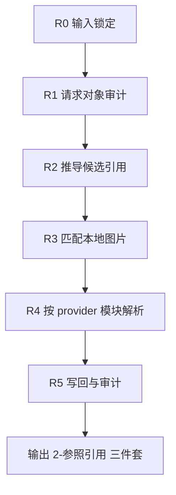
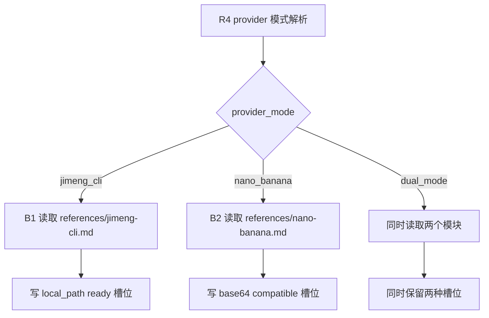
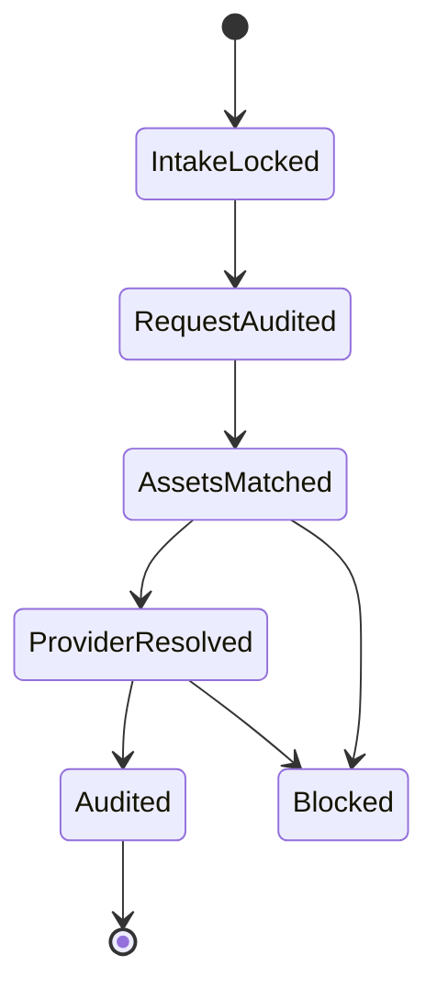

# aigc 5-Image / 2-参照引用

## Context Loading Contract

- 每次调用本技能时，必须同时加载同目录 `CONTEXT.md` 作为预加载上下文。
- 若同目录 `CONTEXT.md` 缺失，应先补齐最小知识库骨架，或向用户明确报告阻塞；不得在未检查该上下文的情况下执行技能。
- 冲突优先级：用户显式请求 > 仓库/全局 `AGENTS.md` > 本 `SKILL.md` > 同目录 `CONTEXT.md`。

## Mode Selection

- 当前任务属于 `原生创建 + 既有优化`：目录已存在但无真源合同，且必须承接 `1-提示词蒸馏` 的既有请求 JSON。
- `复杂链路的骨架 / 细则分层 = true`：本 `SKILL.md` 负责总输入、总输出、路由、节点与验收；provider-specific 细则下沉到 `references/`。
- 默认工作模式不是单 provider 绑定，而是 `dual_mode`：先保持 provider-neutral 引用真源，再按目标 provider 解析为 `即梦 CLI` 本地路径或 `NANO-banana` BASE64 兼容载体。

## 概述

`2-参照引用` 是 `5-Image` 阶段里承接“稳定请求对象 -> 本地图片引用绑定 -> provider-ready 引用解析骨架 -> 严格校验”的叶子父技能。

它不重新写 prompt，也不直接生成图片。它只负责把已经存在于项目本地的图片资产，绑定进 `reference_images / image_markers`，并把同一批引用准备成：

1. `即梦 CLI` 可直接消费的本地图片路径
2. `NANO-banana` 可继续编码为 BASE64 的兼容槽位
3. 若 provider 尚未锁定，则维持 `dual_mode` 可续跑态

## Single Truth Boundary

### `2-参照引用` 拥有

- 从 `1-提示词蒸馏` 请求 JSON 绑定本地图片引用的总合同
- provider-neutral `reference_images / image_markers` 真源
- `jimeng_cli / nano_banana / dual_mode` 三种引用模式裁决
- 绑定后 `第N集.json + _manifest.json + match-report.md` 的落盘与严格校验

### `2-参照引用` 不拥有

- 改写 `1-提示词蒸馏` 的 prompt 或镜头事实
- 直接进入 provider 提交
- 伪造网络 URL、外部路径或不存在的图片
- 在有歧义时猜测性绑定

## Shared Canonical Sources (Mandatory)

- `.agents/skills/aigc/SKILL.md`
- `.agents/skills/aigc/5-Image/1-提示词蒸馏/SKILL.md`
- `.agents/skills/aigc/3-Detail/_shared/episode_detail.json`
- `.agents/skills/aigc/_shared/detail_root_adapter.py`
- `.agents/skills/aigc/5-Image/_shared/image-generation-input.template.json`
- `projects/aigc/<项目名>/5-Image/分镜故事板/<第N集>/<第N集>.json`
- `projects/aigc/<项目名>/5-Image/分镜帧/<第N集>/<第N集>.json`
- `projects/aigc/<项目名>/5-Image/漫画/<第N集>/<第N集>.json`
- `projects/aigc/<项目名>/Assets/`
- `projects/aigc/<项目名>/4-Design/`
- [references/jimeng-cli.md](references/jimeng-cli.md)
- [references/nano-banana.md](references/nano-banana.md)

硬规则：

1. `1-提示词蒸馏` 请求 JSON 是第一请求真源。
2. `reference_images / image_markers` 是本阶段唯一引用真源。
3. provider-specific 解析结果只能写进 `image_markers[].provider_variants.*`，不得覆盖 provider-neutral `image_ref / ref_kind`。
4. 若 provider 未锁定，默认保持 `dual_mode`，不得提前丢掉另一种兼容槽位。

## Reference Module Selection Contract

### 固定模块

- `即梦 CLI` 模块：`references/jimeng-cli.md`
- `NANO-banana` 模块：`references/nano-banana.md`

### 选择机制

1. 用户显式要求 `即梦 CLI`：加载 `references/jimeng-cli.md`
2. 用户显式要求 `NANO-banana`：加载 `references/nano-banana.md`
3. 用户要求“双模式”或未明确 provider：同时加载两个模块，并进入 `dual_mode`
4. `dual_mode` 下的默认策略：
   - provider-neutral 真源始终写入本地 canonical `image_ref`
   - `jimeng_cli` 变体立即解析为本地路径
   - `nano_banana` 变体默认标记为 `pending_encode`，由 `3-图像生成` 再决定是否实编码为 BASE64

## Business Requirement Analysis Contract (Mandatory)

| analysis_slot | 当前结论 |
| --- | --- |
| `business_goal` | 把 `1-提示词蒸馏` 的 image-request JSON 绑定到真实本地图片，并保持 provider-neutral + provider-specific 双层兼容。 |
| `business_object` | `1-提示词蒸馏` 输出 JSON、项目本地图片资产、共享 image-generation 模板，以及仅在需要组级角色锚点时由 `detail_root_adapter` 从 canonical detail root 投影出的 compat group 视图。 |
| `constraint_profile` | 只绑定本地真实文件；外部 URL 不是本阶段主真源；`即梦 CLI` 需要本地路径；`NANO-banana` 需要 BASE64-compatible 槽位；provider 未锁定时不得过早丢失兼容性。 |
| `success_criteria` | `reference_images / image_markers` 能回链真实本地文件；`jimeng_cli` 本地路径 ready；`nano_banana` 兼容槽位 ready 或 pending_encode；三件套落盘可复核。 |
| `non_goals` | 不生成图片、不直接提交 provider、不重新改 prompt、不伪造远程资源。 |
| `complexity_source` | 当前复杂度来自 provider-neutral 与 provider-specific 双层并存、来源资产判型、歧义控制和双模式选择。 |
| `topology_fit` | 采用“串行主干 + provider 模块侧支 + 最终汇流”拓扑：先锁输入，再定位图片资产，再按 provider 模块写兼容槽位，最后统一审计。 |
| `step_strategy` | 主合同只写总路由、主节点、验收与落盘；provider-specific 细则放在两个 reference 模块。 |

## Context Preload (Mandatory)

1. 根 `AGENTS.md`
2. `.agents/skills/aigc/SKILL.md + CONTEXT.md`
3. `.agents/skills/aigc/5-Image/SKILL.md + CONTEXT.md`
4. `.agents/skills/aigc/5-Image/1-提示词蒸馏/SKILL.md + CONTEXT.md`
5. 本 `SKILL.md + CONTEXT.md`
6. `.agents/skills/aigc/5-Image/_shared/image-generation-input.template.json`
7. 命中的 `1-提示词蒸馏` 请求 JSON
8. `projects/aigc/<项目名>/Assets/` 与 `projects/aigc/<项目名>/4-Design/`
9. 命中的 `references/*.md`

## Total Input Contract (Mandatory)

### 必需输入

- 一份来自 `1-提示词蒸馏` 的稳定请求 JSON
- `.agents/skills/aigc/5-Image/_shared/image-generation-input.template.json`

### 推荐输入

- `projects/aigc/<项目名>/Assets/`
- `projects/aigc/<项目名>/4-Design/`
- 用户或上游显式给出的 `provider_mode`

### Readiness Gate

进入绑定前必须确认：

1. 请求 JSON 已存在 `meta / prompt_style / model / prompt / prompt_char_count`
2. `model.reference_images` 与 `model.image_markers` 字段存在
3. 若 `meta.source_tranche` 缺失，可从路径或 `shot_level` 推断
4. 引用来源必须是本地文件，不是外部 URL 主链
5. 若需要回看 `3-Detail` 组级角色锚点，只允许通过 `.agents/skills/aigc/_shared/detail_root_adapter.py` 从 canonical `episode_detail.json` 投影 compat `组间设计.出场角色及穿搭`；不得把旧 detail 壳重新声明为第一真源

## Candidate Derivation And Ambiguity Gate (Mandatory)

`R2/R3` 的核心不是“凡是文本里出现过的资产名都绑定”，而是只把能被当前请求对象唯一证明的本地图片写入 `reference_images / image_markers`。

### 允许绑定的证据等级

| evidence_level | 可绑定条件 | 示例 | 默认动作 |
| --- | --- | --- | --- |
| `explicit_subject` | `related_subject`、组级 `出场角色及穿搭`、shot 级角色字段中出现完整角色名，且 `Assets/角色/` 只有唯一同名图片 | `林澄` -> `Assets/角色/第1集/林澄.jpg` | 允许绑定 |
| `explicit_scene_anchor` | 组标题、shot `角色背景面` 或 `分镜表现` 中出现完整场景名，且该场景是本组主空间锚点 | `黑暗卧室与床头`、`楼道` | 允许绑定，默认每组不超过 2 个主场景锚点 |
| `explicit_prop_full_name` | 出现完整道具规范名或不含编号的完整复合名，且只命中一张道具图 | `水龙头和床边拖鞋`、`滴答声效字和门` | 允许绑定 |
| `provider_required_ref` | 上游请求已在 `image_markers[].related_subject` 或等价字段显式要求某引用 | 明确的 `related_subject` | 允许绑定 |

### 禁止直接绑定的弱证据

以下信号只能进入 `candidate_requests / ambiguous_candidates / rejected_candidates`，不得直接写入 `reference_images`：

1. 单字或泛词：`门`、`灯`、`墙`、`水`、`床`、`地面`。
2. 高复用场景词：`卫生间`、`吊顶`、`楼道`、`洗手池`、`门板`，除非它是组级主空间锚点且同类候选唯一。
3. 子串命中：因为 `卫生间门` 命中 `卫生间` 或 `门`，因为 `楼道灯` 命中 `楼道` 或 `灯`。
4. 一个 token 同时命中 2 张及以上资产，例如 `门 -> 门 / 卫生间门 / 木门 / 出租屋门`。
5. 只靠 prompt 全文包含而没有字段位证据的匹配。

### 候选裁决规则

1. 每个候选必须写出 `match_reason`、`evidence_level`、`evidence_field` 与 `confidence`。
2. `confidence < 0.75` 或候选集合存在同 token 多义时，默认不绑定。
3. 同一组默认绑定上限：
   - 角色：按 `出场角色及穿搭` 中真实出场者绑定。
   - 场景：最多 2 个主空间锚点。
   - 道具：只绑定完整复合名或上游显式 `related_subject`。
4. 如果绑定上限会丢失关键引用，必须在 `match-report.md` 中说明 `override_reason`；不得静默过量绑定。
5. `match-report.md` 必须同时列出：
   - `bound_assets`
   - `ambiguous_candidates`
   - `rejected_candidates`
   - 每个候选的 `match_reason / evidence_level / evidence_field / confidence`

## Canonical Landing

- 根目录：`projects/aigc/<项目名>/5-Image/2-参照引用/`
- 模式目录：`projects/aigc/<项目名>/5-Image/2-参照引用/<jimeng_cli|nano_banana|dual_mode>/<source_tranche>/<第N集>/`
- 主文件：`projects/aigc/<项目名>/5-Image/2-参照引用/<mode>/<source_tranche>/<第N集>/<第N集>.json`
- manifest：`projects/aigc/<项目名>/5-Image/2-参照引用/<mode>/<source_tranche>/<第N集>/_manifest.json`
- 报告：`projects/aigc/<项目名>/5-Image/2-参照引用/<mode>/<source_tranche>/<第N集>/match-report.md`

## Validation Script Contract (Mandatory)

本技能的本地执行入口为：

```bash
python3 .agents/skills/aigc/5-Image/2-参照引用/scripts/bind_reference_assets.py --help
python3 .agents/skills/aigc/5-Image/2-参照引用/scripts/bind_reference_assets.py \
  --project "<项目名>" \
  --episode 第N集 \
  --source-tranche 漫画 \
  --provider-mode dual_mode \
  --dry-run
```

执行脚本必须遵循保守绑定策略：

1. 自动绑定只允许使用结构化强证据：`group_id / source_shot_ids / 组间设计.出场角色及穿搭 / image_markers[].related_subject`。
   其中 `组间设计.出场角色及穿搭` 仅允许作为由 `detail_root_adapter` 从 canonical detail root 投影出的 compat 证据位。
2. 对 `角色` 默认只接受完整角色名与 `Assets/角色/` 中唯一同名图片。
3. 对 `场景 / 道具` 默认只接受上游已显式写入 `image_markers[].related_subject` 的完整非泛词主体；不得从 prompt 全文泛扫后直接绑定。
4. `门 / 灯 / 墙 / 水 / 床 / 地面 / 卫生间 / 吊顶 / 楼道 / 洗手池 / 门板` 等泛词、子串、多义候选必须进入报告的 `ambiguous_candidates / rejected_candidates / skipped_candidates`，不得写入 `reference_images`。
5. 脚本写回后必须立即通过本节审计入口；`--strict` 失败时不得继续进入 `3-图像生成`。

本技能的本地防回归入口为：

```bash
python3 .agents/skills/aigc/5-Image/2-参照引用/scripts/audit_reference_binding.py \
  --bound-json projects/aigc/<项目名>/5-Image/2-参照引用/<mode>/<source_tranche>/<第N集>/<第N集>.json \
  --manifest projects/aigc/<项目名>/5-Image/2-参照引用/<mode>/<source_tranche>/<第N集>/_manifest.json \
  --assets projects/aigc/<项目名>/Assets/selected-4-design-assets.json
```

审计脚本至少检查：

1. 主 JSON 与 manifest 必须存在 `next_entry`。
2. `reference_images[]` 与 `image_markers[]` 一一可回链。
3. 所有本地路径真实存在。
4. `jimeng_cli` 只能写本地路径，`nano_banana` 不得写伪 BASE64。
5. 泛词或子串导致的疑似过量绑定必须报 warning；同组 reference count 异常高时必须报 warning。
6. `--strict` 下 warning 升级为失败。

## Topology Contract (Mandatory)

- 主干节点：
  - `R0 输入锁定`
  - `R1 请求对象审计`
  - `R2 引用候选推导`
  - `R3 本地图片匹配`
  - `R4 provider 模式解析`
  - `R5 写回与审计`
- 条件支路：
  - `B1 即梦 CLI 模块`
  - `B2 NANO-banana 模块`
- 只有 `R5` 可宣告完成

## Visual Maps







## Thinking-Action Node Network

| node_id | objective | actions | evidence | route_out | gate |
| --- | --- | --- | --- | --- | --- |
| `R0-intake-lock` | 锁定 source request 与目标模式 | 读取输入 JSON，决定 `jimeng_cli / nano_banana / dual_mode` | `intake_note` | `R1` | 未锁模式不得继续 |
| `R1-request-audit` | 校验请求对象结构与模板兼容性 | 检查 `meta/prompt/model`、引用骨架、source tranche | `request_audit` | `R2` 或阻断 | 空壳请求不得继续 |
| `R2-candidate-derive` | 推导该绑定哪些本地图片 | 从 `source_tranche / group_id / shot_id / related_subject` 与字段位证据推导候选，写 `match_reason / evidence_level / evidence_field / confidence` | `candidate_requests / ambiguous_candidates / rejected_candidates` | `R3` | 无依据、泛词、子串命中不得直接绑定 |
| `R3-local-match` | 绑定真实且唯一的本地图片 | 扫描 `Assets/` 与 `4-Design/`，只放行唯一高置信候选；多义 token 和同类候选进入歧义清单 | `match_results` | `R4` 或阻断 | 歧义文件、过量绑定、无字段证据不得放行 |
| `R4-provider-resolve` | 生成 provider-specific 兼容槽位 | 按命中 reference 模块写 `provider_variants.*` | `provider_resolution_note` | `R5` | 未写明 provider 兼容态不得结束 |
| `R5-writeback-audit` | 写回三件套并审计 | 落盘 JSON/manifest/report，给出下一入口 | `validation_report` | `Done` | 仅本节点可宣告完成 |

## Workflow

1. 读取 `1-提示词蒸馏` 请求 JSON。
2. 审计模板字段是否兼容 `v2` 双模式骨架；若是旧 `image_url` 结构，统一升级为 `image_ref + ref_kind + provider_variants`。
3. 从路径、`shot_level`、`group_id`、`source_shot_ids`、`related_subject` 与字段位证据推导图片候选；不得把 prompt 全文包含当作直接绑定依据。
4. 在 `Assets/` 与 `4-Design/` 中只绑定真实且唯一的高置信本地图片；泛词、子串命中和多义 token 必须进入 `ambiguous_candidates / rejected_candidates / skipped_candidates`。
5. 按 provider 模式写入：
   - `jimeng_cli`: `resolved_input=本地路径`，`resolution_status=ready`
   - `nano_banana`: 默认 `resolved_input=""`，`resolution_status=pending_encode`
   - `dual_mode`: 同时保留两种槽位
6. 写回 `2-参照引用` 三件套，并显式写入 `next_entry`。
7. 运行 `scripts/audit_reference_binding.py`；若存在 warning，必须在 `match-report.md` 中说明是否阻断或为何允许覆盖。

## Output Contract

最低交付：

1. 绑定后的 `第N集.json`
2. `_manifest.json`
3. `match-report.md`
4. `next_entry`

硬规则：

1. `reference_images[]` 只存 canonical 本地图片引用。
2. `image_markers[].image_ref` 与 `reference_images[]` 必须一一可回链。
3. `image_markers[].provider_variants.jimeng_cli.resolved_input` 只能是本地路径。
4. `image_markers[].provider_variants.nano_banana.resolution_status` 允许为 `pending_encode`，但不得写入虚构 BASE64。
5. 若 `provider_mode=dual_mode`，不得删除任何一方 provider 槽位。
6. `第N集.json` 与 `_manifest.json` 必须同时包含 `next_entry`；`match-report.md` 必须展示下一入口。
7. `match-report.md` 不得只列已绑定资产，还必须列 `ambiguous_candidates / rejected_candidates`，否则不能证明 R2/R3 门已执行。

## Field Master

| field_id | 输出位置/字段 | 内容要求 | 默认责任 Node | 质量维度 | 失败码 |
| --- | --- | --- | --- | --- | --- |
| `FIELD-IMGREF-ROOT-01` | `第N集.json / mode + source_tranche` | 明确当前绑定输出属于哪种 provider mode 与 source tranche | `R0` | 路径可追溯性 | `FAIL-IMGREF-ROOT-01` |
| `FIELD-IMGREF-CANDIDATE-02` | `match-report.md / candidate_requests` | 候选必须带 `match_reason / evidence_level / evidence_field / confidence` | `R2` | 候选推导可解释性 | `FAIL-IMGREF-CANDIDATE-02` |
| `FIELD-IMGREF-SLOT-03` | `reference_images / image_markers` | provider-neutral 引用真源完整且顺序稳定 | `R3-R4` | 引用真值完整性 | `FAIL-IMGREF-SLOT-03` |
| `FIELD-IMGREF-PROVIDER-04` | `provider_variants.*` | `jimeng_cli / nano_banana / dual_mode` 槽位与解析状态正确 | `R4` | provider 兼容性 | `FAIL-IMGREF-PROVIDER-04` |
| `FIELD-IMGREF-AUDIT-05` | `_manifest.json + match-report.md` | 三件套能解释绑定、跳过、歧义与下一入口 | `R5` | 审计可读性 | `FAIL-IMGREF-AUDIT-05` |

## Thought Pass Map

| step_id | 聚焦字段 | 核心问题 | 生成动作 | 未达标信号 |
| --- | --- | --- | --- | --- |
| `R0` | `FIELD-IMGREF-ROOT-01` | 当前请求对象来自哪条上游链、要落到哪个 mode | 锁定输入与 provider mode | 输入来源不清、mode 未锁 |
| `R1-R2` | `FIELD-IMGREF-CANDIDATE-02` | 哪些候选真的有结构化证据支撑 | 生成候选与歧义清单 | 只靠 prompt 全文或泛词绑定 |
| `R3-R4` | `FIELD-IMGREF-SLOT-03` / `FIELD-IMGREF-PROVIDER-04` | 哪些图片可安全绑定，provider 槽位如何解析 | 绑定真实本地引用并写 provider 兼容槽位 | 路径虚构、重复、provider 语义错位 |
| `R5` | `FIELD-IMGREF-AUDIT-05` | 当前三件套是否足以继续 handoff | 写回 JSON/manifest/report 与 next_entry | 绑定结果不可复核或缺下一入口 |

## Pass Table

| field_id | Pass Standard | Fail Code | Rework Entry |
| --- | --- | --- | --- |
| `FIELD-IMGREF-ROOT-01` | 输出位于 `5-Image/2-参照引用/<mode>/<source_tranche>/<第N集>/` | `FAIL-IMGREF-ROOT-01` | `R0` |
| `FIELD-IMGREF-CANDIDATE-02` | 候选来源与证据字段可回读，不靠猜测绑定 | `FAIL-IMGREF-CANDIDATE-02` | `R1-R2` |
| `FIELD-IMGREF-SLOT-03` | `reference_images / image_markers` 只含真实本地引用且顺序稳定 | `FAIL-IMGREF-SLOT-03` | `R3-R4` |
| `FIELD-IMGREF-PROVIDER-04` | provider-specific 槽位与解析状态符合当前 mode | `FAIL-IMGREF-PROVIDER-04` | `R4` |
| `FIELD-IMGREF-AUDIT-05` | `_manifest.json + match-report.md` 可解释绑定、跳过、歧义与下一入口 | `FAIL-IMGREF-AUDIT-05` | `R5` |

## Root-Cause Execution Contract (Mandatory)

当出现以下症状时，先修本技能源层：

- 请求对象已存在，但引用字段仍是旧 `image_url`
- `即梦 CLI` 槽位被写成 URL 或外部路径
- `NANO-banana` 槽位提前塞入伪 BASE64
- 双模式下只保留了一边 provider 槽位
- `3-图像生成` 收到的请求对象仍无法判断 provider 输入该怎么解析
- 泛词、子串或全文包含匹配导致每组绑定大量重叠资产
- `next_entry` 未写入主 JSON、manifest 或 match-report

链路固定为：

`Symptom -> Direct Technical Cause -> Rule Source -> Meta Rule Source -> Fix Landing Points`

优先检查：

- `Rule Source`
  - `.agents/skills/aigc/5-Image/2-参照引用/SKILL.md`
  - `.agents/skills/aigc/5-Image/2-参照引用/CONTEXT.md`
  - `.agents/skills/aigc/5-Image/2-参照引用/references/jimeng-cli.md`
  - `.agents/skills/aigc/5-Image/2-参照引用/references/nano-banana.md`
- `Meta Rule Source`
  - `.agents/skills/aigc/5-Image/1-提示词蒸馏/SKILL.md`
  - `.agents/skills/aigc/SKILL.md`
  - 根 `AGENTS.md`
