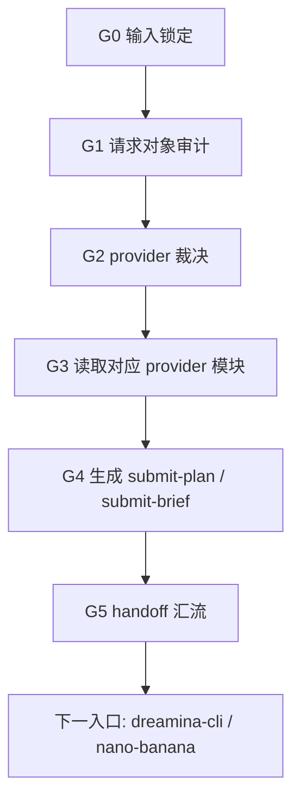
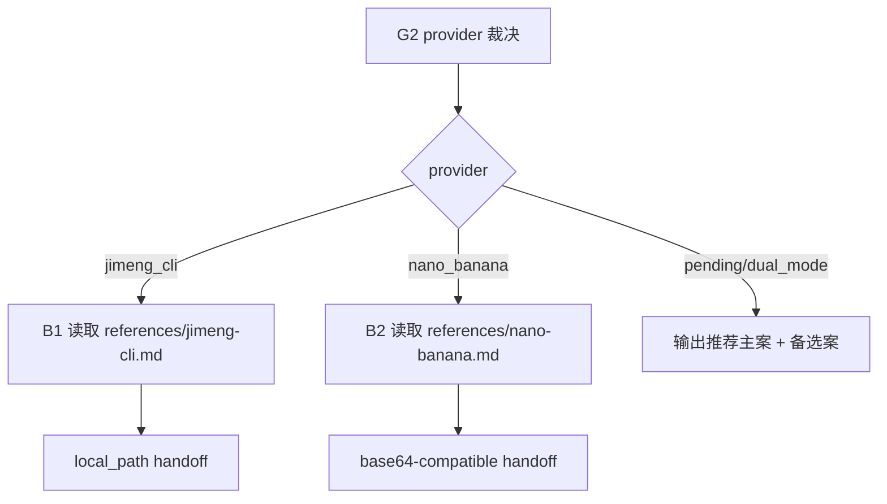
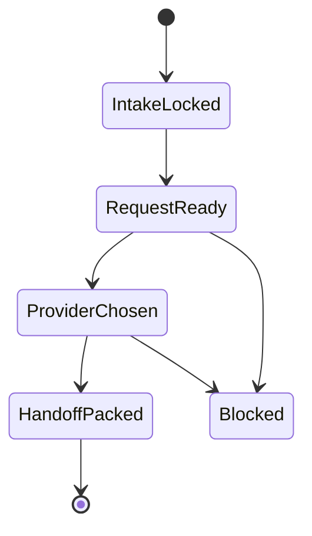

# aigc 5-Image / 3-图像生成

## Mode Selection

- 当前任务属于 `原生创建 + 既有优化`：目录已存在但无执行合同，同时必须承接 `1-提示词蒸馏` 与 `2-参照引用` 的既有请求对象。
- `复杂链路的骨架 / 细则分层 = true`：provider-specific 提交流程下沉到 `references/`，主合同只保留总输入、总路由、总输出与汇流门。
- 本技能不直接替代外部 provider 技能，而是负责形成唯一 provider 路由与 handoff 包。

## 概述

`3-图像生成` 是 `5-Image` 阶段里承接“稳定请求对象 -> provider 选择 -> provider-ready 输入解析 -> submit-plan -> 下一入口”的叶子父技能。

它要先回答四件事：

1. 当前请求对象是否达到可提交状态
2. 本轮到底应该走 `即梦 CLI` 还是 `NANO-banana`
3. 引用图片应当解析成 `local_path` 还是 `BASE64-compatible`
4. 下一入口是哪个 provider skill，而不是一句模糊的“去生成”

## Single Truth Boundary

### `3-图像生成` 拥有

- provider 选择机制
- `submit-plan.json` 与 `submit-brief.md` 的 canonical 生成入口
- provider-neutral -> provider-specific 的最后一层解析
- `jimeng_cli / nano_banana` 双模式 handoff

### `3-图像生成` 不拥有

- 改写 `1-提示词蒸馏` prompt
- 重新做参照绑定
- 伪装已执行成功的图片生成结果
- 把外部 provider skill 的运行规则写成第二真源

## Shared Canonical Sources (Mandatory)

- `.agents/skills/aigc/SKILL.md`
- `.agents/skills/aigc/5-Image/1-提示词蒸馏/SKILL.md`
- `.agents/skills/aigc/5-Image/2-参照引用/SKILL.md`
- `.agents/skills/aigc/5-Image/_shared/image-generation-input.template.json`
- `.agents/skills/cli/dreamina-cli/SKILL.md`
- `.agents/skills/api/image/nano-banana/SKILL.md`
- [references/jimeng-cli.md](references/jimeng-cli.md)
- [references/nano-banana.md](references/nano-banana.md)

## Reference Module Selection Contract

### 固定模块

- `即梦 CLI` 模块：`references/jimeng-cli.md`
- `NANO-banana` 模块：`references/nano-banana.md`

### 选择机制

1. 用户显式指定 provider：直接命中对应模块
2. 输入 `meta.provider_mode` 已锁定：命中对应模块
3. 若仍是 `dual_mode / pending`：
   - 需要本地路径直传、优先走 CLI 提交排队：推荐 `即梦 CLI`
   - 需要 BASE64-compatible 多图引用或走 Gemini/AnyFast API：推荐 `NANO-banana`
4. 若上游引用仍是 `pending_encode` 且用户未指定 provider，不自动猜最终 provider，只输出推荐主案 + 备选案

## Business Requirement Analysis Contract (Mandatory)

| analysis_slot | 当前结论 |
| --- | --- |
| `business_goal` | 把 `5-Image` 请求对象组织成可直接 handoff 给 `即梦 CLI` 或 `NANO-banana` 的提交计划，而不是在生成时临场拼参数。 |
| `business_object` | `1-提示词蒸馏` 或 `2-参照引用` 产出的 `第N集.json`、provider 模块、共享输入模板。 |
| `constraint_profile` | provider 必须唯一；`即梦 CLI` 只收本地路径；`NANO-banana` 最终走 BASE64-compatible；上游未解析好的引用不得越权硬补。 |
| `success_criteria` | 生成唯一 provider 结论、`submit-plan.json + submit-brief.md`、清晰的下一入口，以及可复核的 provider-specific 输入解析说明。 |
| `non_goals` | 不直接执行 provider、不假装图片已生成、不重新绑定引用、不回头重写 prompt。 |
| `complexity_source` | 当前复杂度来自 provider 选择、双模式输入运输、上游请求兼容与 handoff 完整性。 |
| `topology_fit` | 采用“输入审计 -> provider 判型 -> provider-specific 解析 -> submit-plan 汇流”的串行主干，并在 provider 模块处分叉。 |
| `step_strategy` | 主合同只写总判型与 handoff，provider-specific 命令骨架与解析细节下沉到 references。 |

## Context Preload (Mandatory)

1. 根 `AGENTS.md`
2. `.agents/skills/aigc/SKILL.md + CONTEXT.md`
3. `.agents/skills/aigc/5-Image/SKILL.md + CONTEXT.md`
4. `.agents/skills/aigc/5-Image/1-提示词蒸馏/SKILL.md + CONTEXT.md`
5. `.agents/skills/aigc/5-Image/2-参照引用/SKILL.md + CONTEXT.md`
6. 本 `SKILL.md + CONTEXT.md`
7. `.agents/skills/aigc/5-Image/_shared/image-generation-input.template.json`
8. 命中的 `references/*.md`

## Canonical Inputs

- `projects/aigc/<项目名>/5-Image/分镜故事板/<第N集>/<第N集>.json`
- `projects/aigc/<项目名>/5-Image/分镜帧/<第N集>/<第N集>.json`
- `projects/aigc/<项目名>/5-Image/漫画/<第N集>/<第N集>.json`
- `projects/aigc/<项目名>/5-Image/2-参照引用/<mode>/<source_tranche>/<第N集>/<第N集>.json`
- `.agents/skills/aigc/5-Image/_shared/image-generation-input.template.json`

## Canonical Landing

- 根目录：`projects/aigc/<项目名>/5-Image/3-图像生成/`
- provider 目录：`projects/aigc/<项目名>/5-Image/3-图像生成/<jimeng_cli|nano_banana>/<source_tranche>/<第N集>/`
- 计划文件：`projects/aigc/<项目名>/5-Image/3-图像生成/<provider>/<source_tranche>/<第N集>/submit-plan.json`
- 简报文件：`projects/aigc/<项目名>/5-Image/3-图像生成/<provider>/<source_tranche>/<第N集>/submit-brief.md`

## Readiness Gate

进入图像生成前必须确认：

1. 请求对象具备 `meta / prompt_style / model / prompt / prompt_char_count`
2. 若引用驱动，`reference_images / image_markers` 已存在且结构可解释
3. 若 `provider_mode=dual_mode`，必须先做 provider 选择，不得直接落计划
4. 若 `nano_banana` 槽位仍是 `pending_encode`，允许进入本层，但必须在 handoff 说明中写清“由 provider 执行前编码”

## Topology Contract (Mandatory)

- 主干节点：
  - `G0 输入锁定`
  - `G1 请求对象审计`
  - `G2 provider 裁决`
  - `G3 provider-specific 输入解析`
  - `G4 submit-plan 生成`
  - `G5 handoff 汇流`
- 条件支路：
  - `B1 即梦 CLI 模块`
  - `B2 NANO-banana 模块`

## Visual Maps

## Thinking-Action Node Network

| node_id | objective | actions | evidence | route_out | gate |
| --- | --- | --- | --- | --- | --- |
| `G0-intake-lock` | 锁定 source request 与当前 provider 选择上下文 | 读取请求对象、用户要求与上游 provider_mode | `intake_note` | `G1` | 未锁 source request 不得继续 |
| `G1-request-audit` | 检查请求对象是否可提交 | 审计 prompt、引用字段、双模式骨架、来源路径 | `request_audit` | `G2` 或阻断 | 未就绪请求不得进入 provider |
| `G2-provider-route` | 选择唯一 provider 或给出推荐主案 | 按选择机制锁定 `jimeng_cli` 或 `nano_banana` | `provider_decision` | `G3` 或推荐输出 | provider 不唯一不得写最终计划 |
| `G3-provider-resolve` | 解析 provider-specific 输入 | 读取命中模块，把引用解释成本地路径或 BASE64-compatible 说明 | `provider_resolution` | `G4` | 输入运输层未说清不得继续 |
| `G4-submit-pack` | 生成提交计划与简报 | 写 `submit-plan.json + submit-brief.md` | `submit_pack` | `G5` | 无计划文件不得 handoff |
| `G5-handoff-converge` | 给出唯一下一入口 | 明确 handoff 到 `dreamina-cli` 或 `nano-banana` | `handoff_note` | `Done` | 只有本节点可结案 |

## Output Contract

最低交付：

1. `submit-plan.json`
2. `submit-brief.md`
3. provider 选择结论
4. 唯一下一入口

硬规则：

1. 若 provider 为 `jimeng_cli`，计划中引用输入必须是本地路径。
2. 若 provider 为 `nano_banana`，计划中必须写清 BASE64-compatible 解析策略。
3. 若 provider 仍未唯一，不能写最终 provider 计划，只能输出推荐主案与缺口。
4. 本层不得删除 provider-neutral 引用字段。

## Root-Cause Execution Contract (Mandatory)

当出现以下症状时，先修本技能源层：

- `2-参照引用` 完成了，但 `3-图像生成` 仍不知道该走哪个 provider
- `即梦 CLI` handoff 里出现 URL 或 BASE64
- `NANO-banana` handoff 里没有 BASE64-compatible 策略
- provider 不唯一却仍然硬落最终计划
- 计划文件缺失下一入口或返工入口

链路固定为：

`Symptom -> Direct Technical Cause -> Rule Source -> Meta Rule Source -> Fix Landing Points`

优先检查：

- `Rule Source`
  - `.agents/skills/aigc/5-Image/3-图像生成/SKILL.md`
  - `.agents/skills/aigc/5-Image/3-图像生成/CONTEXT.md`
  - `.agents/skills/aigc/5-Image/3-图像生成/references/jimeng-cli.md`
  - `.agents/skills/aigc/5-Image/3-图像生成/references/nano-banana.md`
- `Meta Rule Source`
  - `.agents/skills/aigc/5-Image/2-参照引用/SKILL.md`
  - `.agents/skills/aigc/SKILL.md`
  - 根 `AGENTS.md`
