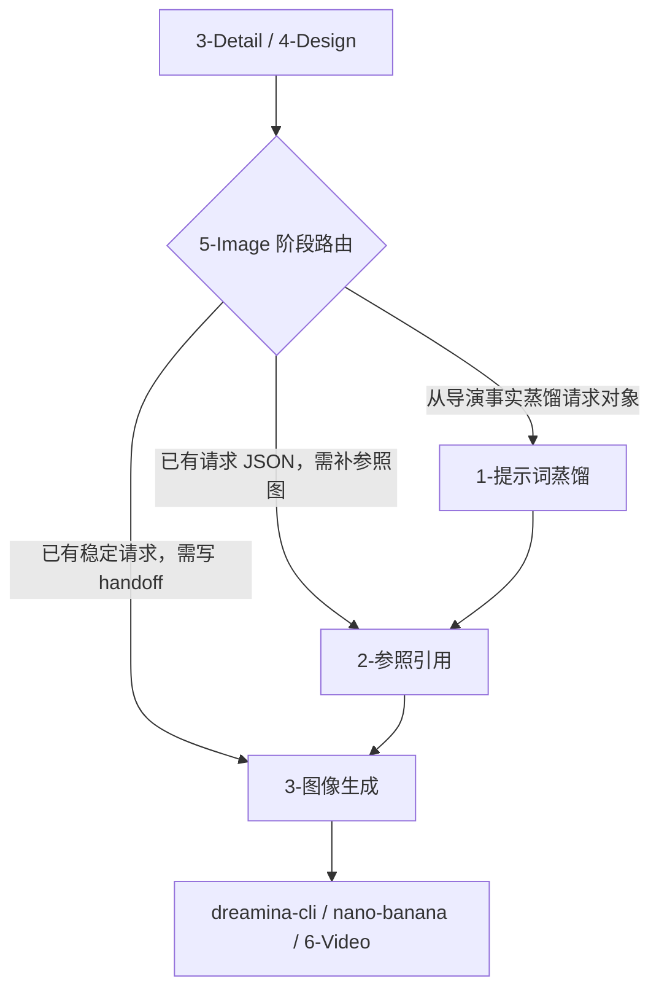

# aigc 5-Image

## Context Loading Contract

- 每次调用本技能时，必须同时加载同目录 `CONTEXT.md` 作为预加载上下文。
- 若同目录 `CONTEXT.md` 缺失，应先补齐最小知识库骨架，或向用户明确报告阻塞；不得在未检查该上下文的情况下执行技能。
- 冲突优先级：用户显式请求 > 仓库/全局 `AGENTS.md` > 本 `SKILL.md` > 同目录 `CONTEXT.md`。

## 概述

`5-Image` 是 `aigc` 主链里承接 `3-Detail` 与 `4-Design` 的图像阶段父 skill。

它不直接替代具体叶子蒸馏、引用绑定或 provider 提交，而是先把图像阶段收束成一个真实存在的阶段根合同，统一回答四件事：

1. 当前图像任务应进入哪一个唯一子路径
2. 图像阶段的 canonical runtime 根在哪里
3. 哪个子路径拥有当前这轮业务真源写位
4. 下一入口应回到哪个阶段或哪个 provider handoff

当前稳定可执行链固定为：

`3-Detail / 4-Design -> 1-提示词蒸馏 -> 2-参照引用 -> 3-图像生成`

## Stage Positioning

### `5-Image` 拥有

- 图像阶段父级路由合同
- `projects/aigc/<项目名>/5-Image/` 的 stage runtime 真源
- `1-提示词蒸馏 / 2-参照引用 / 3-图像生成` 三段链路的进入条件
- 图像请求 JSON、引用绑定结果、submit-plan handoff 的阶段级边界说明

### `5-Image` 不拥有

- 直接生成图片文件
- 改写 `3-Detail/第N集.json` 的导演事实
- 越权替代 `1-提示词蒸馏 / 2-参照引用 / 3-图像生成` 的局部合同
- 发明 stage-level 第二业务真源

## Stage Coverage Status

| 单元 | 当前状态 | 说明 |
| --- | --- | --- |
| `1-提示词蒸馏` | active | 负责把 `3-Detail` canonical 输出蒸馏成图像请求 JSON，并在 `分镜故事板 / 分镜帧` 间做对象级路由；漫画页诉求回接 repo-local `comic` workflow |
| `2-参照引用` | active | 负责把稳定请求 JSON 绑定到本地图片引用，并维持 provider-neutral 与 provider-specific 双层兼容 |
| `3-图像生成` | active | 负责锁定唯一 provider，生成 `submit-plan.json + submit-brief.md`，并给出唯一下一入口 |

## Shared Canonical Sources (Mandatory)

- `.agents/skills/aigc/SKILL.md`
- `.agents/skills/aigc/3-Detail/SKILL.md`
- `.agents/skills/aigc/4-Design/SKILL.md`
- `.agents/skills/aigc/5-Image/1-提示词蒸馏/SKILL.md`
- `.agents/skills/aigc/5-Image/2-参照引用/SKILL.md`
- `.agents/skills/aigc/5-Image/3-图像生成/SKILL.md`
- `.agents/skills/aigc/5-Image/_shared/image-generation-input.template.json`
- `projects/aigc/<项目名>/3-Detail/第N集.json`
- `projects/aigc/<项目名>/4-Design/`

硬规则：

1. `projects/aigc/<项目名>/5-Image/` 是图像阶段唯一 runtime 根。
2. 图像阶段父层只路由真实存在的三个子路径，不伪造平行入口。
3. 图像阶段父层不自建第二套 image-request 模板真源。
4. 业务真源始终由命中的子路径写回；父层只保留阶段边界、coverage 与 handoff。

## Context Preload (Mandatory)

加载顺序固定为：

1. 根 `AGENTS.md`
2. `.agents/skills/aigc/SKILL.md + CONTEXT.md`
3. `.agents/skills/aigc/3-Detail/SKILL.md + CONTEXT.md`
4. `.agents/skills/aigc/4-Design/SKILL.md + CONTEXT.md`
5. 本 `SKILL.md + CONTEXT.md`
6. `.agents/skills/aigc/5-Image/_shared/image-generation-input.template.json`
7. 命中 `1-提示词蒸馏` 时，加载 `.agents/skills/aigc/5-Image/1-提示词蒸馏/SKILL.md + CONTEXT.md`
8. 命中 `2-参照引用` 时，加载 `.agents/skills/aigc/5-Image/2-参照引用/SKILL.md + CONTEXT.md`
9. 命中 `3-图像生成` 时，加载 `.agents/skills/aigc/5-Image/3-图像生成/SKILL.md + CONTEXT.md`

## Route And Topology Contract (Mandatory)

### 默认模式

1. `detail_to_request`
2. `request_to_reference_binding`
3. `request_to_provider_handoff`

### 路由规则

1. 当前只有 `3-Detail` canonical episode 输出，且目标是先形成图像请求对象：进入 `1-提示词蒸馏`。
2. 当前已有稳定请求 JSON，但 `reference_images / image_markers` 仍待绑定或待规范化：进入 `2-参照引用`。
3. 当前已有稳定请求 JSON，且目标是锁定 provider、写 `submit-plan` 并形成 handoff 包：进入 `3-图像生成`。
4. 若 `3-Detail` 仍未到 `detail_in_progress | ready`，停止在图像阶段父层并回报上游缺口。
5. 若目标其实是直接排查 `dreamina-cli`、`nano-banana` 或其他 provider 的提交/轮询问题，优先回到对应 provider skill，而不是重复经过阶段父层。

## Visual Maps

## Canonical Output Governance (Mandatory)

1. `5-Image` 阶段没有父层第二业务真源。
2. `1-提示词蒸馏` 负责写请求 JSON 到 `分镜故事板 / 分镜帧` 子路径；漫画页诉求不再写入 `5-Image` 阶段 runtime。
3. `2-参照引用` 负责写绑定后的 JSON、`_manifest.json` 与 `match-report.md`。
4. `3-图像生成` 负责写 `submit-plan.json + submit-brief.md`、provider 输出图像同目录落盘合同与唯一下一入口。
5. 父层只负责阶段路由、边界、coverage 与下一入口说明。

### Runtime Write Slots

- 请求对象根：`projects/aigc/<项目名>/5-Image/分镜故事板/`、`projects/aigc/<项目名>/5-Image/分镜帧/`
- 参照绑定根：`projects/aigc/<项目名>/5-Image/2-参照引用/`
- 生成 handoff 根：`projects/aigc/<项目名>/5-Image/3-图像生成/`
- 真实输出图像不得回写到阶段父层根或项目级 `Assets/` 作为唯一真源；它应随 `3-图像生成` 的 provider/source/episode 包同目录落盘，资产库副本只能作为派生引用。

## Field Master

| field_id | 输出位置/字段 | 内容要求 | 默认责任 Step | 质量维度 | 失败码 |
| --- | --- | --- | --- | --- | --- |
| `FIELD-5I-01` | 阶段边界 | 明确 `5-Image` 只拥有阶段路由与 runtime 真源，不拥有第二业务真源 | `S1` | 边界清晰度 | `FAIL-5I-01` |
| `FIELD-5I-02` | 子路径路由 | 明确何时进入 `1-提示词蒸馏 / 2-参照引用 / 3-图像生成` | `S2` | 路由稳定性 | `FAIL-5I-02` |
| `FIELD-5I-03` | runtime 对齐 | 明确 `projects/aigc/<项目名>/5-Image/` 是唯一 stage runtime 根 | `S3` | 真源一致性 | `FAIL-5I-03` |
| `FIELD-5I-04` | 写位治理 | 明确各子路径各自拥有的 canonical 落点 | `S4` | 输出治理 | `FAIL-5I-04` |
| `FIELD-5I-05` | handoff | 明确图像阶段如何回接 provider skill 或下游阶段 | `S5` | 闭环完整性 | `FAIL-5I-05` |

## Thought Pass Map

| step_id | 聚焦字段 | 核心问题 | 生成动作 | 未达标信号 |
| --- | --- | --- | --- | --- |
| `S1` | `FIELD-5I-01` | 当前是不是图像阶段父层问题 | 锁定父层边界 | 父层越权写业务主稿 |
| `S2` | `FIELD-5I-02` | 当前应进哪个唯一子路径 | 写 route decision | 同一请求被并发拆成多条主链 |
| `S3` | `FIELD-5I-03` | runtime 根是否回到 `projects/aigc/<项目名>/5-Image/` | 回指 stage runtime | 子路径私造阶段根 |
| `S4` | `FIELD-5I-04` | 谁拥有当前这轮 canonical 写位 | 写 output ownership | 父层与子路径争真源 |
| `S5` | `FIELD-5I-05` | 下一入口是什么 | 写 handoff | 只能停在模糊中间态 |

## Pass Table

| field_id | Pass Standard | Fail Code | Rework Entry |
| --- | --- | --- | --- |
| `FIELD-5I-01` | 阶段边界明确，不造第二真源 | `FAIL-5I-01` | `S1` |
| `FIELD-5I-02` | 子路径路由唯一且可解释 | `FAIL-5I-02` | `S2` |
| `FIELD-5I-03` | stage runtime 根与磁盘结构一致 | `FAIL-5I-03` | `S3` |
| `FIELD-5I-04` | 子路径写位与父层边界不冲突 | `FAIL-5I-04` | `S4` |
| `FIELD-5I-05` | handoff 与阶段闭环明确 | `FAIL-5I-05` | `S5` |

## Root-Cause Execution Contract (Mandatory)

当 `5-Image` 出现以下问题时，必须先修阶段父层而不是只补子路径局部：

- registry 把 `5-Image` 注册成 active stage，但阶段父级真源缺失
- 模糊图像任务直接跳进 leaf，没人先裁决阶段级入口
- `1-提示词蒸馏 / 2-参照引用 / 3-图像生成` 对同一请求各写一套并行业务主稿
- live 合同继续引用旧 `5-画面` 路径或把 `5-Image` 当不存在的逻辑桶
- provider handoff 与图像阶段写位边界再次漂移

必经链路：

`Symptom -> Direct Technical Cause -> Rule Source -> Meta Rule Source -> Fix Landing Points`

优先检查：

- `Rule Source`
  - `.agents/skills/aigc/5-Image/SKILL.md`
  - `.agents/skills/aigc/5-Image/CONTEXT.md`
  - `.agents/skills/aigc/5-Image/1-提示词蒸馏/SKILL.md`
  - `.agents/skills/aigc/5-Image/2-参照引用/SKILL.md`
  - `.agents/skills/aigc/5-Image/3-图像生成/SKILL.md`
- `Meta Rule Source`
  - `.agents/skills/aigc/SKILL.md`
  - `.codex/registry/skills.yaml`
  - `.codex/registry/routes.yaml`
  - 根 `AGENTS.md`

## Completion Criteria

- 已建立真实存在的 `5-Image` 阶段父级合同
- 已把三个图像子路径收束到同一个 stage parent
- 已明确 `projects/aigc/<项目名>/5-Image/` 的 stage runtime 真源
- 已避免父层与子路径争夺 canonical business truth
