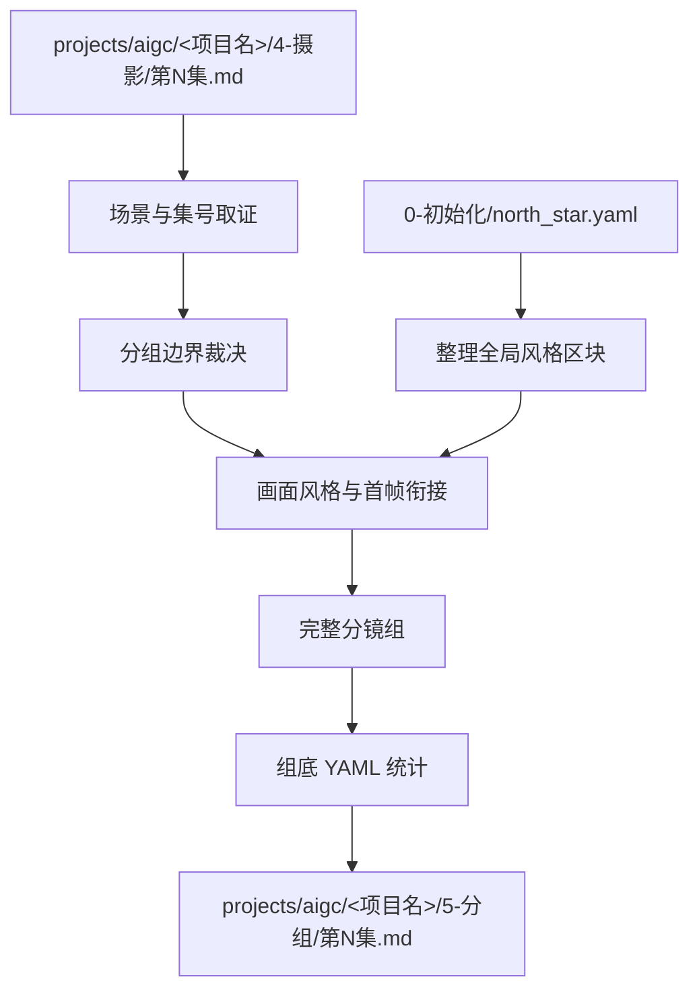
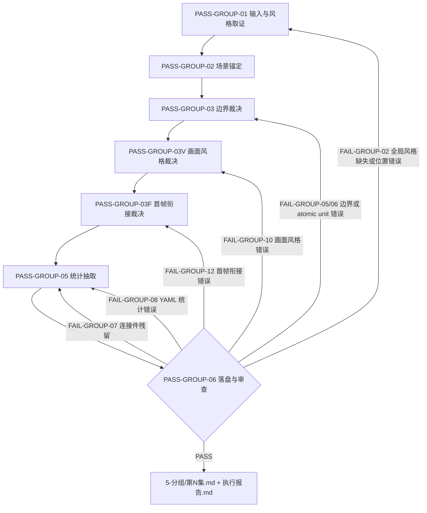

# aigc 5-分组

`5-分组` 负责把 `4-摄影` 的逐集摄影稿切分为可供后续设计、图像和视频阶段消费的完整分镜组。它不改写上游剧本正文、原画面性字段标题和字段下方时间段，只裁决组边界、整理 `全局风格`、提炼组级 `画面风格`、把首帧衔接内化到每组第一个普通 `[0-N秒]` 分镜行，并在组底部附加统计 YAML。

新版组头不再输出 `入场镜头：`、`出场画面：`、`画面构图：`、位置细节字段、`分镜画面：` 或 `增补首帧：`。组内连续性的主要机制改为：每组第一个原画面性字段标题下方直接从普通 `[0-N秒]` 时间码行开始；首组自然承接本组开始画面，第二组起自然承接上一组尾帧状态，但不写任何“增补首帧”字段、来源说明或规则说明。

## Context Loading Contract

- 每次调用 `$aigc-grouping` 时，必须同时加载同目录 `CONTEXT.md`。
- 每次调用本技能时，必须同时识别并加载同目录 `types/` 中选中的类型包（单选或多选）。
- 若任务绑定 `projects/aigc/<项目名>/`，必须先加载项目根 `MEMORY.md`、`projects/aigc/<项目名>/0-初始化/north_star.yaml`，再按需加载项目根 `CONTEXT/` 或 `CONTEXT/` 中与角色、场景、道具、风格和制作约束相关的上下文文件。
- 项目任务中还必须只读消费初始化冻结综合：`projects/aigc/<项目名>/team.yaml.init_synthesis.stage_seed_summary."5-分组"`、`projects/aigc/<项目名>/0-初始化/init_handoff.yaml.stage_entry_seeds.grouping_seed` 与 `north_star.yaml.创作阶段不变量.分组`；不得调用 team 身份、解析旧 stage profile 或补造创作阶段顾问问答。
- 上游正文真源固定为 `projects/aigc/<项目名>/4-摄影/第N集.md`，除非用户显式指定其他摄影稿文件。
- 冲突优先级：用户显式请求 > 根 `AGENTS.md` / meta 规则 > 本 `SKILL.md` > `references/` / `steps/` / `types/` / `review/` / `templates/` > `agents/openai.yaml` > 项目 `MEMORY.md` > 项目 `CONTEXT/` > 本 `CONTEXT.md`。
- 分组边界、首帧衔接变体整理、角色/场景/道具提取和组内完整性判断必须由 LLM 直接完成；`scripts/` 只能做读取、原画面性字段时间段核算、字数统计、ID/标题/YAML/禁用连接件结构检查和机械校验。

## Multi-Subskill Continuous Workflow

当本主技能包被整体调用时，视为用户已授权按本级声明的同级子技能包、阶段分区或内部连续节点自动完成整个技能组任务；在满足本技能必要输入、显式选择和安全门后，不再为“是否继续下一步”额外确认。

- 无序号同级子技能包默认全选并发执行，由本主技能包汇总、裁决和写回唯一 canonical 输出。
- 数字序号子技能包或节点（如 `1-`、`2-`、`3-`）默认按数字升序串行执行，前一节点产物自动作为后一节点输入。
- 英文序号子技能包或路线（如 `A-`、`B-`、`C-`）默认按用户意图、父级路由或任务类型单选分流；只有用户明确要求对比、并跑或批量多路线时才多选。
- 连续调度不得绕过本技能的阻断门：缺少必需输入、上游摄影稿或 `north_star.yaml` 不可读、破坏性覆盖未授权、子技能缺失或路线歧义会造成错误 canonical 写回时，必须先停下并给出最小澄清或不可用说明。
- 每个被调度的子技能包仍必须加载自身 `SKILL.md + CONTEXT.md`；脚本只能承担机械辅助，不得替代 LLM 分组判断或父级最终裁决。

## Input Contract

Accepted input:

- 项目名、项目路径、单个 `projects/aigc/<项目名>/4-摄影/第N集.md` 文件，或多个集号范围。
- 用户要求“分组”“分镜组”“从 4-摄影 到 5-分组”“给摄影稿按分镜组切分”“首帧衔接”“缝纫线头”“修复 15 秒分组之间断裂”等任务。
- 已完成或部分完成的 `4-摄影` 逐集稿；默认以集为单位处理 `第N集.md`。

Required input:

- 可定位、可读取的 `projects/aigc/<项目名>/4-摄影/第N集.md`。
- 可定位、可读取的 `projects/aigc/<项目名>/0-初始化/north_star.yaml`。
- 至少一个目标集号，或允许默认处理 `4-摄影/` 中全部 `第N集.md`。
- 输入正文中存在可识别的场景标题、剧本字段、对白字段、非画面字段或原画面性字段标题及其 `[起始秒-结束秒]` 时间段。

Optional input:

- 项目 `MEMORY.md` 中的长期偏好、禁区、衔接节奏或视觉惯性要求。
- 项目 `CONTEXT/` 或 `CONTEXT/` 中的角色表、场景表、道具表、世界观、风格和制作约束。
- 初始化冻结综合中的分组节奏、承接策略和 north_star 投影提示。
- 用户额外指定的目标组时长、最大组长、对白密度、相邻组承接偏好、首尾帧参照图生视频约束或下游视频生成限制。

Reject or clarify when:

- 上游 `4-摄影/第N集.md` 或 `0-初始化/north_star.yaml` 不存在、不可读，且用户没有提供替代真源。
- 用户要求脚本自动生成分组正文、首帧衔接正文或统计提取结论；必须改为 LLM 主创、脚本只校验。
- 用户要求改变剧情事实、改对白、删减原画面性字段下方时间段、重排场景顺序或把多集混写成一个分镜组。
- 当前项目只存在旧编号分组目录而用户未明确允许写入兼容路径时，应报告路径漂移；本技能 canonical 输出为 `5-分组/`。

## Mode Selection

| mode | 触发信号 | 输出 |
| --- | --- | --- |
| `single_episode` | 指定单个 `第N集.md` 或单个集号 | `projects/aigc/<项目名>/5-分组/第N集.md` |
| `episode_range` | 指定多个集号或集号范围 | 多个逐集分镜组稿与更新后的执行报告 |
| `all_ready_episodes` | 未指定集号但 `4-摄影/` 下有 `第N集.md` | 全部可读逐集分镜组稿 |
| `repair` | 已有分组稿 ID 错误、组过长、`全局风格` 拼接缺失、首帧衔接断裂、旧连接件块残留或 YAML 统计不完整 | 最小修复后的逐集分组稿与问题报告 |
| `review_only` | 用户只要求检查 `5-分组` 输出 | 审查报告，不改写正文，除非用户随后要求修复 |

## Reference Loading Guide

| 场景 | 必读文件 |
| --- | --- |
| 任意分组任务 | `steps/grouping-workflow.md`、`references/group-boundary-contract.md`、`references/north-star-projection-contract.md`、`references/group-visual-tone-contract.md`、`references/statistics-yaml-contract.md` |
| 反抽象语言、全局风格、画面风格和首帧衔接具象化落盘 | `../_shared/anti-abstract-language-contract.md`，并回接 `references/north-star-projection-contract.md`、`references/group-visual-tone-contract.md` |
| 画面风格落盘知识库 | `../4-摄影/knowledge-base/摄影构图/` |
| 组底 YAML 统计、角色/场景/道具抽取 | `references/statistics-yaml-contract.md` |
| 初始化综合消费边界 | `../_shared/team-advisor-consultation-contract.md` |
| 判断输入稿、边界风险和修复策略 | `types/grouping-type-map.md` |
| 验收、修复和 review gate | `review/review-contract.md` |
| 输出样板 | `templates/output-template.md`、`templates/episode-groups.template.md` |
| 脚本辅助边界与机械校验 | `scripts/README.md` |
| 可复用经验 | `knowledge-base/grouping-heuristics.md` |
| 产品入口元数据 | `agents/openai.yaml` |

## Visual Maps

## Execution Contract

1. 读取本 `SKILL.md + CONTEXT.md`，并在项目任务中加载项目 `MEMORY.md`、`0-初始化/north_star.yaml`、`team.yaml.init_synthesis.stage_seed_summary."5-分组"`、`init_handoff.stage_entry_seeds.grouping_seed` 与相关 `CONTEXT/`；初始化综合只能转成 `init_team_synthesis_context`，不得触发 team 身份调用、旧 stage profile 或新顾问问答。
2. 锁定上游 `4-摄影/第N集.md`，提取集号、场景标题、正文块、对白字段、原画面性字段标题、字段下方 `[起始秒-结束秒]` 时间段和场景顺序；不得改写原正文。
3. 按 `references/north-star-projection-contract.md` 从 `north_star.yaml` 整理 `全局风格.全局风格提示词`、`类型元素.类型元素提示词`、`细分风格.画面风格`。每个分镜组标题 `## x-y-z` 后必须先写当前上游场景标题行，随后立即输出可见字段标题 `全局风格：`，字段内按三行输出：第 1 行以固定前置词 `视频生成的画面风格，光影和氛围与场景参照图保持一致。需要生成现场物理互动音效、氛围感音效、环境声、自然现象声、动作声，不要生成任何字幕，不要生成背景音乐。` 开头，再接当前组 300 字以内全局风格整理句；第 2、3 行分别直引 `类型元素.类型元素提示词` 与 `细分风格.画面风格`。
4. 按 `references/group-boundary-contract.md` 执行边界裁决：上游每个原画面性字段以最后一条 `[起始秒-结束秒]` 的结束秒作为该字段画面总时长，先用这些字段总时长裁决分组；落盘到当前分镜组后，原本在各字段内各自从 0 开始的时间段必须统一改写为当前分镜组基准下的连续累计 `[N-N秒]`，后一个时间段起点必须等于前一个时间段终点，组内 `时长估算` 取当前组最后一个时间段的结束秒。每组优先接近约 15 秒，通常允许约 12-18 秒弹性，单组时长硬上限为 18 秒。
5. 按 `references/group-visual-tone-contract.md` 从上游摄影稿的镜头设计中提炼每组的组级 `画面风格：`。该字段必须位于 `全局风格：` 三行内容之后、第一个原画面性字段标题之前，覆盖构图布局核心选择、构图方式关键子维度、光源效果、色彩基调、关键摄影技术参数和必要的观看位置；不再输出 `画面构图：` 或 `左侧：` / `中间：` / `右侧：` / `前景：` / `中景：` / `背景：` 等位置细节字段。
6. 按普通分镜画面写法内化首帧衔接：
   - 每组第一个原画面性字段标题下方直接写普通 `[0-N秒]` 时间码行，不输出 `分镜画面：`、`增补首帧：` 或任何可识别特殊字段。
   - 首组第一条时间码行自然整理本组开始画面；第二组起第一条时间码行自然承接上一组最后分镜的主体、动作、道具、空间关系、光线和已成立状态，并接入本组开始画面。
   - 首帧衔接只调整景别、机位、镜头角度、焦距、观看距离或焦点路径，不新增剧情、不改对白、不改变人物状态；这些规则不得写入输出正文。
   - 首帧衔接作为普通分镜正文计入 `字数统计` 和当前组时间码，不输出独立组间连接件。
7. 保持从 `4-摄影` 划定的分镜剧本正文、字段标题和字段下方时间段完整同步原换行；不得删改上游字段、对白、时间段或场景顺序；不得把原画面性字段标题替换为 `分镜画面：`。
8. 不再输出 `## <上一个分镜组ID>~<下一个分镜组ID>` 组间连接件，也不输出 `连接类型：`、`连接方法：`、`变化过程：`、`主体运动：`、`运镜设计：`、`透视适应：`、`避免元素：` 等连接件字段；相邻组承接只通过下一组第一个普通 `[0-N秒]` 分镜行承担。
9. 给每个分镜组标注 `x-y-z` 格式 `分镜组ID`：`x` 为真实集号，`y` 为真实场景号，`z` 为该场景内分镜组序号；跨场景时组序号重新从 1 开始。
10. 按 `references/statistics-yaml-contract.md` 在每组底部附加 YAML 统计；每组标题后的场景标题行、`画面风格：` 和分镜剧本正文计入 YAML `字数统计`，但组头字段不计入组内 `时长估算`；`时长估算` 取当前分镜组累计时间码的最后结束秒；`全局风格：` 三行内容、统计 YAML fenced block 本身和组标题均不计入组内 `时长估算`、1680/1980 字数风险或 `字数统计`。
11. 写入 `projects/aigc/<项目名>/5-分组/第N集.md`，并生成或更新 `projects/aigc/<项目名>/5-分组/执行报告.md`。
12. 按 `review/review-contract.md` 执行验收；可运行 `scripts/validate_storyboard_groups.py` 做机械检查，但脚本不得替代 LLM 分组、首帧衔接和统计判断。

## Script And Metadata Contract

| path | role |
| --- | --- |
| `scripts/README.md` | 说明脚本只能承担机械辅助，不替代 LLM 分组判断 |
| `scripts/validate_storyboard_groups.py` | 必跑机械校验：检查分镜组标题、场景标题行、`全局风格：` 字段、`画面风格：` 位于第一个原画面性字段标题和第一个时间码上方、禁用 `分镜画面：` / `增补首帧：` / `入场镜头：` / `出场画面：` / `画面属性：` / `画面构图：` / 六类位置细节字段 / `## A~B` 连接件块、YAML 统计、组内时间码连续累加和编号连续性；不能替代分组边界、首帧衔接语义、原文保真和统计证据判断 |
| `agents/openai.yaml` | 提供产品侧入口元数据，默认提示必须显式提到 `$aigc-grouping` |

## Field Mapping

| field_id | 输出/证据 | 内容要求 | 失败码 |
| --- | --- | --- | --- |
| `FIELD-GROUP-01` | 输入取证 | source cinematography episode、north_star、项目记忆、相关上下文、目标集号明确 | `FAIL-GROUP-01` |
| `FIELD-GROUP-01A` | 初始化综合消费 | 只读消费初始化综合，形成 `init_team_synthesis_context`；未触发 team 身份、旧 stage profile 或伪顾问问答 | `FAIL-GROUP-INIT-SYNTHESIS` |
| `FIELD-GROUP-02` | 场景标题与 `全局风格` | 每组 `## x-y-z` 后先重复当前场景标题行，再输出 `全局风格：` 字段；字段内三行分别为固定前置词 + 当前组 300 字以内全局风格整理句、类型元素提示词、画面风格原文 | `FAIL-GROUP-02` |
| `FIELD-GROUP-03` | 边界裁决 | 每组按原画面性字段时间段总时长接近 15 秒，通常 12-18 秒，且不得超过 18 秒；同一 atomic unit 不跨组；落盘后组内时间码从 0 连续累加 | `FAIL-GROUP-05` / `FAIL-GROUP-06` |
| `FIELD-GROUP-04` | 分镜组 ID | `x-y-z` 与真实集、场、组匹配，场内组号连续 | `FAIL-GROUP-04` |
| `FIELD-GROUP-05` | `画面风格` | 每组有 `画面风格：`，且位于 `全局风格：` 三行内容之后、第一个原画面性字段标题之前；不输出 `画面构图：` 或六类位置细节字段 | `FAIL-GROUP-10` / `FAIL-GROUP-11` |
| `FIELD-GROUP-06` | 首帧衔接 | 每组第一个原画面性字段标题下方第一行是普通 `[0-N秒]` 分镜行；首组承接本组开始画面，第二组起承接上一组尾帧状态；不输出 `分镜画面：`、`增补首帧：` 或规则说明 | `FAIL-GROUP-12` |
| `FIELD-GROUP-07` | 连接件禁用 | 不输出 `## <上一个分镜组ID>~<下一个分镜组ID>` 连接件块，也不输出连接件字段 | `FAIL-GROUP-07` |
| `FIELD-GROUP-08` | 原文保真 | `4-摄影` 划定正文同步原换行，不删改字段标题、对白、原画面性字段标题、时间段或场景顺序 | `FAIL-GROUP-09` |
| `FIELD-GROUP-09` | YAML 统计 | 每组底部含 `字数统计`、`时长估算`、`角色`、`场景`、`道具`；统计口径符合 `statistics-yaml-contract.md` | `FAIL-GROUP-08` |
| `FIELD-GROUP-10` | 输出落盘 | `5-分组/第N集.md` 与 `执行报告.md` 可复查 | `FAIL-GROUP-09` |

## Thought Pass Map

| pass_id | pass_name | input | judgment | output |
| --- | --- | --- | --- | --- |
| `PASS-GROUP-01` | 输入与风格取证 | 摄影稿、north_star、项目上下文、初始化综合 | 是否具备可分组真源、三项风格字段和初始化分组种子 | `input_lock`、`init_team_synthesis_context` |
| `PASS-GROUP-02` | 场景锚定 | 场景标题与正文顺序 | 真实集号、真实场景号和场内组序 | `scene_group_index` |
| `PASS-GROUP-03` | 边界裁决 | 候选正文块、上游每个原画面性字段的最后结束秒、对白数、字数、完整画面字段 | 是否以组内画面字段总时长接近 15 秒并保持 atomic unit 完整；落盘后是否改写为组内连续累计时间码 | `group_boundary_plan` |
| `PASS-GROUP-03V` | 画面风格裁决 | 每组镜头设计、`references/group-visual-tone-contract.md` | 是否从组内镜头设计中提炼 `画面风格：`，且位于构图上方 | `group_visual_style` |
| `PASS-GROUP-03F` | 首帧衔接裁决 | 上一组最后原画面性字段、本组第一个原画面性字段 | 是否把衔接自然内化到第一个普通 `[0-N秒]` 分镜行，不写特殊字段或规则说明 | `first_storyboard_line_continuity` |
| `PASS-GROUP-05` | 统计抽取 | 完整分镜组正文 | 角色、场景、重要叙事道具是否准确；道具是否已完成同物识别、归一合并和去重 | `stats_yaml` |
| `PASS-GROUP-06` | 落盘与审查 | 分组稿 | ID、全局风格、画面风格、首帧衔接、时长、连接件禁用和 YAML 是否通过 | `review_result` |

## Pass Table

| pass_id | must_do | evidence | Rework Entry |
| --- | --- | --- | --- |
| `PASS-GROUP-01` | 读取上游摄影稿、north_star 三项字段和初始化分组综合 | input manifest、字段摘录、`init_team_synthesis_context` | `references/north-star-projection-contract.md` |
| `PASS-GROUP-02` | 建立 `x-y-z` ID 映射 | 集号、场景号、场内组号表 | `references/group-boundary-contract.md` |
| `PASS-GROUP-03` | 按画面字段总时长和完整性确定边界，并在落盘时改写组内累计时间码 | 每个原画面性字段最后结束秒、完整画面字段证据、短组回填理由、超 18 秒回退证据、连续累计 `[N-N秒]` 时间码 | `references/group-boundary-contract.md` |
| `PASS-GROUP-03V` | 在构图上方写 `画面风格：` | 组级画面风格语句、组内镜头设计证据 | `references/group-visual-tone-contract.md` |
| `PASS-GROUP-03F` | 写首帧衔接 | 第一个原画面性字段标题下方普通 `[0-N秒]` 分镜行、自然画面描述 | `steps/grouping-workflow.md#N5F-FIRST-STORYBOARD-LINE` |
| `PASS-GROUP-05` | 抽取角色、场景、道具统计 | 组底 YAML | `references/statistics-yaml-contract.md` |
| `PASS-GROUP-06` | 验证输出结构与语义质量 | validator 输出、语义 review 结论、短组例外说明 | `review/review-contract.md` |

## Root-Cause Execution Contract (Mandatory)

出现以下问题时，必须沿链路上溯并修复源层合同：

- 分镜组 ID 与真实集号、场景号或场内组序不匹配。
- 组头未按 `场景标题行 -> 全局风格： -> 画面风格： -> 原画面性字段标题 -> 普通 [0-N秒] 分镜行 -> 原正文 -> YAML` 的顺序输出。
- 继续输出旧字段 `入场镜头：`、`出场画面：`、`画面属性：`、`画面构图：` 或六类位置细节字段。
- `全局风格：` 缺失、未位于场景标题行下方、没有三行内容、固定前置词缺失、全局风格整理句超过 300 字、完整照抄全局母稿或未匹配当前组证据。
- `画面风格：` 缺失、未位于第一个原画面性字段标题上方，或没有从组内镜头设计提炼。
- 第一个原画面性字段标题下方第一行不是普通 `[0-N秒]` 分镜行，首帧衔接断裂，写成规则说明或模板化来源说明，输出 `分镜画面：` 或 `增补首帧：` 字段，或借首帧衔接新增剧情、改对白、改变人物状态。
- 只按字数硬切，只为了精确卡 15 秒切断同一原画面性字段、对应对白/画面承托或连续时间段，或组内后续字段时间段重新从 `[0-N秒]` 开始。
- 继续输出 `## <上一个分镜组ID>~<下一个分镜组ID>` 连接件块或连接件字段。
- YAML 统计缺字段、统计口径错误、道具未做同物识别和归一合并，或脚本/模板拼接替代 LLM 的分组边界、首帧衔接和统计判断。

失败时沿链路上溯：

`Symptom -> Direct Cause -> Field Owner -> Stage Contract -> AGENTS.md LLM-first creative authorship`

## Output Contract

- Required output:
  - `projects/aigc/<项目名>/5-分组/第N集.md`
  - `projects/aigc/<项目名>/5-分组/执行报告.md`
- Output format: Markdown 分镜组稿与 Markdown 执行报告。
- Output path: `projects/aigc/<项目名>/5-分组/`。
- Naming convention: 逐集分组稿为 `第N集.md`；分镜组 ID 为 `x-y-z`。
- Completion gate: 输入、边界、`全局风格`、`画面风格`、首帧衔接、YAML、原文保真与机械校验均通过；旧字段 `增补首帧：`、`入场镜头：`、`出场画面：`、`画面属性：`、`画面构图：`、六类位置细节字段和 `## A~B` 连接件块不再出现在新产物中。
