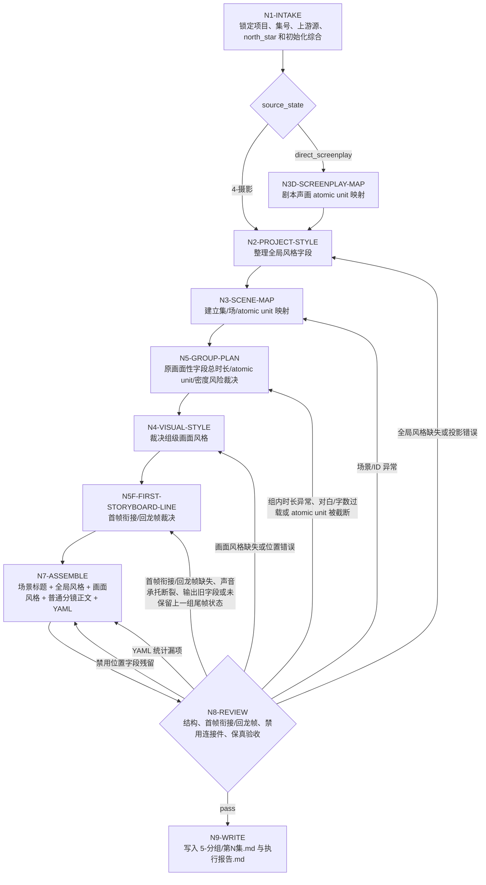

# Grouping Workflow

本文件定义 `5-分组` 的思行一体执行拓扑。

## Business Requirement Analysis

| slot | answer |
| --- | --- |
| `business_goal` | 将逐集摄影稿或用户显式指定剧本源切成完整分镜组，供后续设计、图像和视频阶段稳定消费 |
| `business_object` | `projects/aigc/<项目名>/4-摄影/第N集.md` 或 direct screenplay source、`0-初始化/north_star.yaml` 与冻结初始化综合 |
| `constraint_profile` | 初始化分组综合只读消费；标准摄影路径中组内连续原画面性字段总时长优先接近 15 秒；direct screenplay 路径中由 LLM 按剧本声画 atomic unit 自动规划约 15 秒/组；通常约 12-18 秒可接受，且单组不得超过 18 秒；原画面性字段、剧本声画单元和对应对白承托不可截断；每组按新结构输出 `全局风格：`、`画面风格：` 和普通时间码分镜正文；回龙帧只作为首行内部口径，不输出独立 `## A~B` 连接件、`分镜画面：`、`增补首帧：` 或 `回龙帧：` 字段 |
| `success_criteria` | 每组 ID 真实，标题后先写场景标题行；`全局风格：` 位于场景标题行下方；`画面风格：` 位于第一个原画面性字段标题上方；第一个原画面性字段标题下方第一行是普通 `[0-N秒]` 分镜描述并自然承担首帧衔接/回龙帧；正文保真、组内时间码连续累加、相邻组线头自然、统计 YAML 可复查 |
| `non_goals` | 不改剧情、不改对白、不重写原画面性字段标题、不生成图像/视频提示词、不继续输出 `入场镜头：`、`出场画面：`、`画面属性：`、`画面构图：`、`分镜画面：` 或六类位置细节字段 |
| `complexity_source` | 边界裁决、首帧衔接/回龙帧变体整理、声音承托同步、画面字段总时长与完整性汇流 |
| `topology_fit` | 串行取证 + 场景内树形分组 + 相邻组 pairwise review + 统一验收 |

## Node Network

## Node Table

| node_id | objective | inputs | actions | evidence | route_out | gate |
| --- | --- | --- | --- | --- | --- | --- |
| `N1-INTAKE` | 锁定项目、集号、上游源、north_star 和初始化综合 | 用户请求、项目目录、`team.yaml.init_synthesis.stage_seed_summary."5-分组"`、`init_handoff.grouping_seed`、`north_star.yaml.创作阶段不变量.分组` | 优先定位 `4-摄影/第N集.md`；若用户显式指定剧本/编导稿或 `4-摄影` 缺失但有可读剧本源，设置 `source_state=direct_screenplay`；定位 `north_star.yaml`、项目记忆和上下文；只读提取分组综合约束、启发和风险，不调用 team 身份或旧 stage profile | input manifest、source_state、`init_team_synthesis_context` | `N2-PROJECT-STYLE` 或 `N3D-SCREENPLAY-MAP` | north_star 和至少一个上游源可读；初始化综合存在时已消费或记录缺失 |
| `N3D-SCREENPLAY-MAP` | 建立剧本直入声画单元 | 剧本/编导稿正文 | 提取场景标题、环境、动作、对白、对白画面、音效、音效画面、心理反应、表情、转场；以对白承托、动作落点、物件证据和场景顺序形成不可拆声画 atomic unit | screenplay atomic unit table、dialogue fidelity sample | `N2-PROJECT-STYLE` | 场景顺序、剧情事实和英文对白原文未改写 |
| `N2-PROJECT-STYLE` | 整理 `全局风格：` 字段 | north_star、当前组场景证据、`init_team_synthesis_context` | 抽取 `全局风格.全局风格提示词`、`类型元素.类型元素提示词`、`细分风格.画面风格`；为每组整理 300 字以内全局风格句；字段必须写在场景标题行下方 | style_organization、group_style_projection list | `N3-SCENE-MAP` | 三项字段齐全；每组 `全局风格：` 位置正确 |
| `N3-SCENE-MAP` | 建立集/场/atomic unit 映射 | 摄影稿正文或 screenplay atomic unit table | 标准摄影路径提取场景标题、字段、原画面性字段、`[起始秒-结束秒]` 时间段和对白数；direct screenplay 路径消费 `N3D` 的声画单元表 | scene unit table | `N5-GROUP-PLAN` | atomic unit 不跨场景 |
| `N5-GROUP-PLAN` | 裁决组边界 | scene unit table、style_organization、source_state | 标准摄影路径按上游每个原画面性字段最后时间段结束秒累计形成组计划；direct screenplay 路径按剧本声画 atomic unit 由 LLM 规划约 15 秒/组并补写连续时间码；优先接近 15 秒，通常 12-18 秒，超过 18 秒必须拆分或重组；落盘时组内时间码为当前分镜组基准下连续递增的 `[N-N秒]`，后一个时间段起点等于前一个时间段终点 | group boundary plan、group_baseline_time_ranges、direct_screenplay_duration_source | `N4-VISUAL-STYLE` | 每组时长接近 15 秒、完整且 `<=18` 秒；时间码不在后续画面字段重启 |
| `N4-VISUAL-STYLE` | 裁决并输出组级 `画面风格：` | group boundary plan、上游摄影稿镜头设计、`references/group-visual-tone-contract.md`、`../4-摄影/knowledge-base/摄影构图/` | 从组内镜头设计中提炼每组 `画面风格：`；必须位于第一个原画面性字段标题上方 | group_visual_style list | `N5F-FIRST-STORYBOARD-LINE` | 每组都有 `画面风格：`，且与组内镜头设计一致 |
| `N5F-FIRST-STORYBOARD-LINE` | 内化首帧衔接/回龙帧 | 第一组本组首个原画面性字段；第二组起上一组最后原画面性字段和本组首个原画面性字段 | 写成第一个原画面性字段标题下方第一条普通 `[0-N秒]` 分镜描述；第二组起完整代入上一组结尾状态画面点内容，并只通过景别、机位、镜头角度、焦距、观看距离或焦点路径调整进入本组；若该点来自对白、独白、旁白或音效画面，同步带入对应声音内容；只写画面与必要声音，不写特殊字段、来源说明或规则说明 | first_storyboard_line_continuity list、source_last_storyboard_picture、shot_adjustment_evidence、sound_bridge_evidence | `N7-ASSEMBLE` | 每组第一个分镜行自然衔接；无 `分镜画面：`、`增补首帧：`、`回龙帧：` 字段、无新增剧情和模板化规则句 |
| `N7-ASSEMBLE` | 组装分组稿 | group plan、style_organization、group_visual_style、first_storyboard_line_continuity、scene title list | 每个分镜组按新顺序组装：场景标题、全局风格、画面风格、普通分镜正文、YAML；不输出连接件块、画面构图、位置细节字段、`增补首帧：` 或 `回龙帧：` | episode group draft | `N8-REVIEW` | 正文同步原换行；统计口径正确；无连接件残留 |
| `N8-REVIEW` | 验收结构和质量 | 分组稿、上游、validator | 运行机械检查或人工 review，记录报告 | review result | `N9-WRITE` 或返工 | 所有 gate pass |
| `N9-WRITE` | 落盘交付 | accepted draft | 写 `5-分组/第N集.md` 与 `执行报告.md` | output files | done | 输出可复查 |

## Failure Routes

| failure | return_to |
| --- | --- |
| north_star 三项缺失或 `全局风格：` 位置错误 | `N2-PROJECT-STYLE`，先修复或请求授权 |
| 场景标题缺失或重复异常 | `N3-SCENE-MAP`，回上游源修复 |
| `画面风格：` 缺失、位置错误或与镜头设计不一致 | `N4-VISUAL-STYLE`，重新从组内镜头设计提炼 |
| 组内时长低于约 10 秒，或高于 18 秒 | `N5-GROUP-PLAN`，移动完整 atomic unit；标准摄影路径若单个 atomic unit 超 18 秒，回退 `4-摄影` 修复；direct screenplay 路径由 LLM 重拆剧本声画单元 |
| 同一原画面性字段被截断，或组内后续字段时间码从 0 重启 | `N5-GROUP-PLAN`，恢复 atomic unit 并重算当前组连续累计时间码 |
| 画面构图或位置细节字段残留 | `N7-ASSEMBLE`，移除禁用字段并重算 YAML 字数 |
| 首帧衔接/回龙帧缺失、未完整代入上一组结尾状态画面点内容、回龙到声音承托画面但遗漏声音内容、输出 `分镜画面：` / `增补首帧：` / `回龙帧：` 或写成来源/规则说明 | `N5F-FIRST-STORYBOARD-LINE`，重写为第一个原画面性字段标题下方第一条普通 `[0-N秒]` 分镜描述 |
| `## A~B` 连接件块或连接件字段残留 | `N7-ASSEMBLE`，删除连接件块与字段，连续性回收到下一组第一个普通时间码行 |
| YAML 统计漏项 | `N7-ASSEMBLE`，重抽统计 |
| validator 失败 | `N8-REVIEW`，按 fail_code 返工 |
